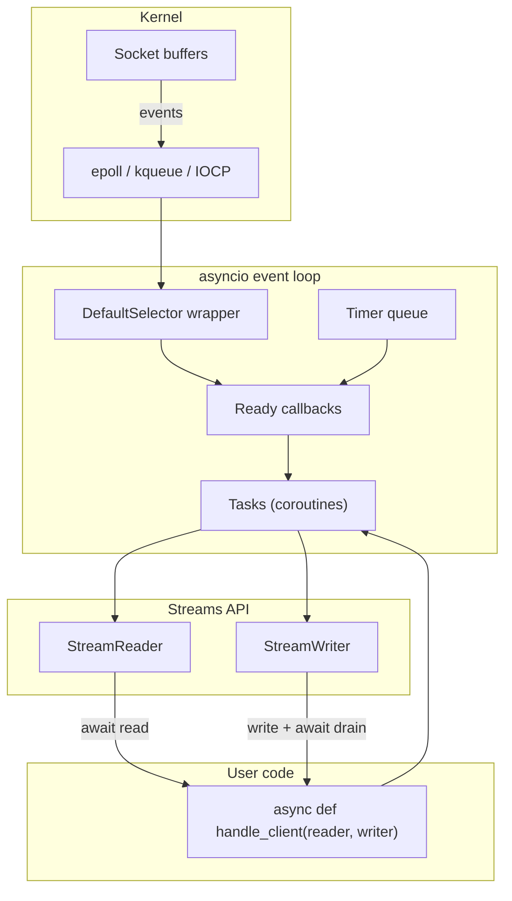
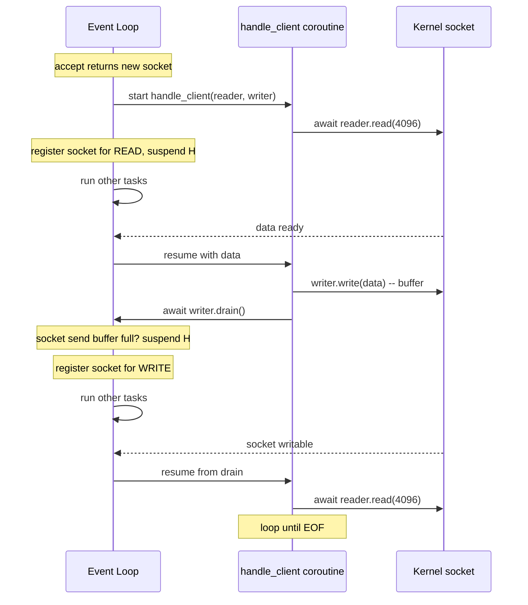
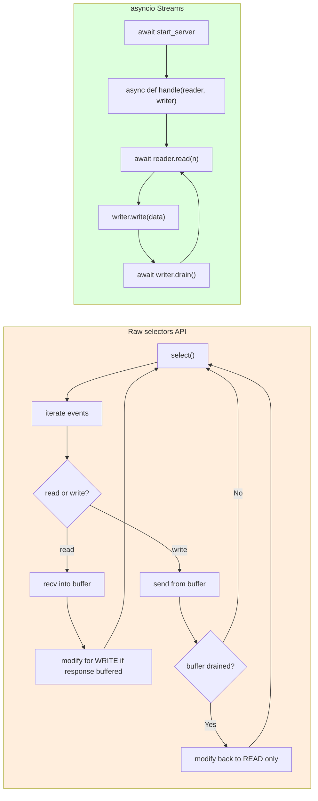
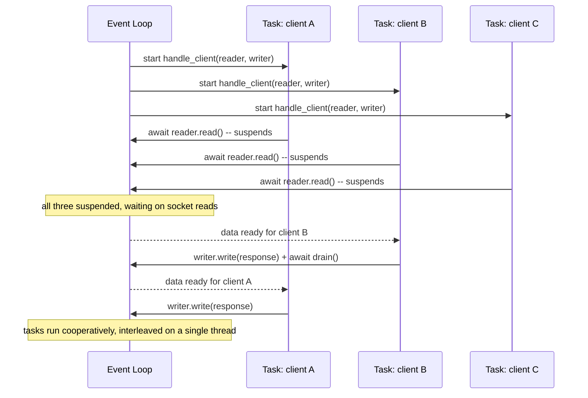

# asyncio Networking — High-Level Async I/O for Python Servers

> [!info] Chapter 27 — Networking and Sockets, Note 6 (final)
> Builds on [[5. Non-blocking Sockets]] (the underlying primitives) and [[14. Concurrency/4. asyncio Basics]] / [[14. Concurrency/5. async-await]] (the language-level coroutine support). This is the recommended way to write new networking code in Python.

## Why This Matters

The raw `selectors` API from [[5. Non-blocking Sockets]] is powerful but verbose. A simple echo server requires ~80 lines of state-machine code: register for read, recv into a buffer, modify registration for write, send from the buffer, handle errors, drain the buffer, modify back to read. Every protocol handler is a hand-rolled state machine.

`asyncio` (Python 3.4+, rewritten and stabilised in 3.5+ with `async`/`await`) provides a high-level abstraction: **write blocking-looking code that the event loop schedules cooperatively**. You write `data = await reader.read(4096)` and the event loop takes care of registering the socket, suspending your coroutine until data arrives, and resuming it.

The result is code that looks like thread-per-connection but scales like event-driven I/O:

- A single-threaded `asyncio` server can handle 50,000+ concurrent connections.
- Code is straightforward — no manual state machines, no callbacks.
- The same primitives (coroutines, `await`) work for I/O on sockets, files, subprocesses, and timers.
- It interoperates with the rest of the async ecosystem: `aiohttp`, `httpx`, `websockets`, `aiopg`, `aiomysql`, `aiokafka`, `aiormq`, `nats-py`, and many more.

If you are writing a new networking server in Python, `asyncio` is almost always the right choice. This note covers the high-level networking API.

## Background — What `asyncio` Adds on Top of `selectors`

Under the hood, `asyncio` uses `selectors.DefaultSelector()` (which uses `epoll` on Linux, `kqueue` on macOS/BSD). It adds three layers of abstraction:

1. **Event loop** — runs the selector, schedules callbacks and coroutines, manages timers and signals.
2. **Transports** — wrappers around sockets (or other I/O mechanisms) that translate kernel events into method calls on a protocol object.
3. **Streams** — even higher-level wrappers that expose `StreamReader` and `StreamWriter` objects with `async` methods like `read()`, `readline()`, `readexactly()`, and `write()`.

There are two API styles in `asyncio`:

- **The Transports/Protocols API** — low-level, callback-based. You subclass `asyncio.Protocol` and override `connection_made`, `data_received`, `connection_lost`. This mirrors the classic Twisted model. It is fast but verbose.
- **The Streams API** — high-level, coroutine-based. You use `asyncio.start_server` and `asyncio.open_connection` and write `await reader.read()`. This is the recommended API for almost all new code.

This note focuses on the Streams API.

## Main Content

### 1. The High-Level Server: `asyncio.start_server`

```python
import asyncio

async def handle_client(reader: asyncio.StreamReader, writer: asyncio.StreamWriter) -> None:
    addr = writer.get_extra_info("peername")
    print(f"Connection from {addr}")
    try:
        while True:
            data = await reader.read(4096)
            if not data:
                break
            writer.write(data)            # buffer the echo
            await writer.drain()          # wait if the buffer is full
    except (ConnectionResetError, BrokenPipeError):
        pass
    finally:
        writer.close()
        await writer.wait_closed()
        print(f"Connection closed: {addr}")

async def main() -> None:
    server = await asyncio.start_server(handle_client, "0.0.0.0", 8080, reuse_address=True)
    addrs = ", ".join(str(sock.getsockname()) for sock in server.sockets)
    print(f"Serving on {addrs}")
    async with server:
        await server.serve_forever()

if __name__ == "__main__":
    asyncio.run(main())
```

That is a complete echo server. Compare to the 80-line `selectors` version — the coroutine model lets you write `data = await reader.read(4096)` exactly as you would in a blocking thread-per-connection server.

Key points:

- **`asyncio.start_server(client_handler, host, port)`** returns a `Server` object. It uses the event loop to accept connections; each accepted connection runs `client_handler` as a new `Task`.
- **`handle_client` is a coroutine, not a function.** The `await` keywords mark suspension points — the event loop can run other coroutines while this one waits for I/O.
- **`writer.write(data)` does not block.** It buffers the data. **`await writer.drain()`** suspends the coroutine if the buffer is full.
- **`writer.close()` schedules the socket to close.** **`await writer.wait_closed()`** waits for the close to complete (Python 3.7+).
- **`asyncio.run(main())`** is the entry point. It creates an event loop, runs `main()` until it completes, and tears the loop down.

### 2. The High-Level Client: `asyncio.open_connection`

```python
import asyncio

async def fetch(host: str, port: int, request: bytes) -> bytes:
    reader, writer = await asyncio.open_connection(host, port)
    try:
        writer.write(request)
        await writer.drain()
        chunks = []
        while True:
            data = await reader.read(4096)
            if not data:
                break
            chunks.append(data)
        return b"".join(chunks)
    finally:
        writer.close()
        await writer.wait_closed()

async def main():
    response = await fetch("example.com", 80, b"GET / HTTP/1.0\r\nHost: example.com\r\n\r\n")
    print(response.decode("utf-8", "replace")[:500])

asyncio.run(main())
```

### 3. `StreamReader` and `StreamWriter` — The Full API

The Streams API gives you a small set of methods that cover most protocol needs.

#### `StreamReader`

| Method | Behaviour |
|---|---|
| `await reader.read(n)` | Reads up to `n` bytes. Returns `b""` on EOF. |
| `await reader.readexactly(n)` | Reads exactly `n` bytes. Raises `IncompleteReadError` on EOF. |
| `await reader.readuntil(separator=b"\n")` | Reads until `separator` found. Raises `IncompleteReadError` on EOF, `LimitOverrunError` if the buffer fills before finding the separator. |
| `await reader.readline()` | Equivalent to `readuntil(b"\n")` with a 64 KB default limit. |
| `reader.at_eof()` | Returns `True` if the stream is at EOF. |
| `reader.exception()` | Returns any exception that ended the stream. |

#### `StreamWriter`

| Method | Behaviour |
|---|---|
| `writer.write(data)` | Buffers `data` for sending. Non-blocking. |
| `writer.writelines(list_of_data)` | Like `write` but for many chunks. |
| `await writer.drain()` | Waits until the send buffer is below the high-water mark. |
| `writer.close()` | Schedules the socket to close. |
| `await writer.wait_closed()` | Waits for the close to complete. |
| `writer.get_extra_info(name, default)` | Returns info like `"peername"`, `"socket"`, `"ssl_object"`. |
| `writer.write_eof()` | Half-closes the write side. |

The `drain()` pattern is the key idiom. `writer.write()` is synchronous and never blocks — it just appends to a buffer. If you keep writing faster than the network can send, the buffer grows unboundedly and you run out of memory. `await writer.drain()` suspends your coroutine until the buffer drains below the high-water mark, providing flow control.

### 4. Mermaid — `asyncio` Server Architecture



### 5. Mermaid — Coroutine Lifecycle on a Connection



### 6. Comparison with Raw Sockets

| Aspect | Raw `socket` (threaded) | Raw `selectors` | `asyncio` Streams |
|---|---|---|---|
| Lines of code for echo server | ~20 | ~80 | ~15 |
| Concurrency model | One thread per connection | Single thread, callbacks | Single thread, coroutines |
| Max concurrent connections | ~10,000 (memory limited) | ~100,000+ | ~100,000+ |
| Code readability | Excellent (blocking calls) | Poor (state machines) | Excellent (coroutines) |
| Composability with blocking libraries | Excellent | Poor | Requires `run_in_executor` |
| Cancellation | Thread cancellation is unsafe | Manual flag | `Task.cancel()` is clean |
| Timeouts | `settimeout()` per socket | Manual | `asyncio.wait_for(coro, timeout)` |
| Maturity | Battle-tested | Battle-tested | Battle-tested (3.7+) |

### 7. Concurrency Within a Single Server

`asyncio.start_server` automatically schedules each accepted connection as a new `Task`. To do work concurrently within a single handler — for example, reading from a database while also reading from the client — just `await` them concurrently:

```python
import asyncio

async def handle(reader, writer):
    # Read from client and from a database concurrently
    client_task = asyncio.create_task(reader.readline())
    db_task = asyncio.create_task(fetch_from_db())
    done, pending = await asyncio.wait(
        [client_task, db_task],
        return_when=asyncio.FIRST_COMPLETED,
    )
    # ... use whichever finished first, cancel the other
```

Or use `asyncio.gather` to wait for all of them:

```python
results = await asyncio.gather(reader.readline(), fetch_from_db())
client_line, db_result = results
```

### 8. Timeouts and Cancellation

`asyncio` has clean timeout and cancellation semantics:

```python
import asyncio

async def handle(reader, writer):
    try:
        data = await asyncio.wait_for(reader.read(4096), timeout=30.0)
    except asyncio.TimeoutError:
        writer.write(b"timeout\n")
        await writer.drain()
        return
    # ...
```

`asyncio.wait_for(coro, timeout)` runs `coro` and raises `asyncio.TimeoutError` (a subclass of `TimeoutError` since 3.11) if it does not complete within `timeout` seconds. The underlying coroutine is cancelled cleanly — its `finally` blocks run, and any resources it holds are released (assuming the code is cancellation-safe).

Cancellation safety rules:

- Use `try/finally` for cleanup. `finally` blocks run when a coroutine is cancelled.
- Avoid bare `except:` — it suppresses `asyncio.CancelledError` and prevents proper cancellation.
- Re-raise `CancelledError` in your handlers unless you have a specific reason to swallow it.

```python
async def handle(reader, writer):
    try:
        await do_work(reader, writer)
    finally:
        # Always runs, even on cancellation
        writer.close()
        await writer.wait_closed()
```

### 9. Offloading Blocking Work

If a handler must call a blocking library (e.g., `requests`, `psycopg2`, a CPU-bound computation), it must not run inline — that would freeze the event loop. Use `loop.run_in_executor` to offload it to a thread pool:

```python
import asyncio
import time
import requests

async def handle(reader, writer):
    # Read request
    request = await reader.readline()
    # Make a blocking HTTP request in a thread pool
    loop = asyncio.get_running_loop()
    response = await loop.run_in_executor(
        None,  # default ThreadPoolExecutor
        lambda: requests.get("https://api.example.com/data").json(),
    )
    writer.write(str(response).encode())
    await writer.drain()
    writer.close()
    await writer.wait_closed()
```

For CPU-bound work, use `ProcessPoolExecutor` to bypass the GIL:

```python
from concurrent.futures import ProcessPoolExecutor
import asyncio

def heavy_compute(n: int) -> int:
    # Pure CPU work
    total = 0
    for i in range(n):
        total += i * i
    return total

async def handle(reader, writer):
    n = int((await reader.readline()).strip())
    loop = asyncio.get_running_loop()
    with ProcessPoolExecutor() as pool:
        result = await loop.run_in_executor(pool, heavy_compute, n)
    writer.write(str(result).encode() + b"\n")
    await writer.drain()
    writer.close()
    await writer.wait_closed()
```

### 10. UDP in `asyncio`

UDP is also supported via the Transports/Protocols API:

```python
import asyncio

class UDPServerProtocol(asyncio.DatagramProtocol):
    def connection_made(self, transport: asyncio.DatagramTransport) -> None:
        self.transport = transport

    def datagram_received(self, data: bytes, addr: tuple) -> None:
        print(f"From {addr}: {data!r}")
        self.transport.sendto(b"ack:" + data, addr)

async def main():
    print("Starting UDP server on 0.0.0.0:9999")
    transport, protocol = await asyncio.get_running_loop().create_datagram_endpoint(
        UDPServerProtocol,
        local_addr=("0.0.0.0", 9999),
    )
    try:
        await asyncio.sleep(3600)  # run for an hour
    finally:
        transport.close()

asyncio.run(main())
```

For a higher-level UDP client, you can use `loop.create_datagram_endpoint` with `remote_addr` to get a connected-style protocol.

### 11. SSL / TLS

`asyncio.start_server` and `asyncio.open_connection` accept an `ssl` argument that takes an `ssl.SSLContext`. This is the standard way to serve HTTPS, WebSockets over TLS, and any other secure protocol.

```python
import asyncio
import ssl

async def handle(reader, writer):
    data = await reader.read(4096)
    writer.write(data)
    await writer.drain()
    writer.close()
    await writer.wait_closed()

async def main():
    ctx = ssl.SSLContext(ssl.PROTOCOL_TLS_SERVER)
    ctx.load_cert_chain("server.crt", "server.key")
    server = await asyncio.start_server(handle, "0.0.0.0", 8443, ssl=ctx)
    async with server:
        await server.serve_forever()

asyncio.run(main())
```

### 12. A Length-Prefixed JSON-RPC Server in `asyncio`

Combining everything: a real-world protocol with framing, dispatch, and concurrent request handling.

```python
import asyncio
import struct
import json
from typing import Any, Awaitable, Callable

Handler = Callable[[dict], Awaitable[Any]]

async def recv_msg(reader: asyncio.StreamReader) -> dict | None:
    raw_len = await reader.readexactly(4)
    (length,) = struct.unpack(">I", raw_len)
    payload = await reader.readexactly(length)
    return json.loads(payload)

async def send_msg(writer: asyncio.StreamWriter, obj: dict) -> None:
    payload = json.dumps(obj).encode("utf-8")
    writer.write(struct.pack(">I", len(payload)) + payload)
    await writer.drain()

class RPCServer:
    def __init__(self):
        self.handlers: dict[str, Handler] = {}

    def method(self, name: str):
        def decorator(func: Handler) -> Handler:
            self.handlers[name] = func
            return func
        return decorator

    async def handle(self, reader: asyncio.StreamReader, writer: asyncio.StreamWriter):
        try:
            while True:
                req = await recv_msg(reader)
                if req is None:
                    return
                method = req.get("method")
                handler = self.handlers.get(method)
                if handler is None:
                    await send_msg(writer, {"id": req.get("id"), "error": f"unknown method {method!r}"})
                    continue
                try:
                    result = await handler(req)
                except Exception as e:
                    await send_msg(writer, {"id": req.get("id"), "error": str(e)})
                else:
                    await send_msg(writer, {"id": req.get("id"), "result": result})
        except asyncio.IncompleteReadError:
            pass  # client closed
        finally:
            writer.close()
            await writer.wait_closed()

rpc = RPCServer()

@rpc.method("add")
async def add(req: dict) -> int:
    return req["a"] + req["b"]

@rpc.method("upper")
async def upper(req: dict) -> str:
    await asyncio.sleep(0.1)  # simulate I/O
    return req["s"].upper()

async def main():
    server = await asyncio.start_server(rpc.handle, "0.0.0.0", 9000)
    async with server:
        await server.serve_forever()

asyncio.run(main())
```

Each request runs as its own coroutine; the event loop services all of them concurrently. A slow `add` does not block other clients' `upper` calls.

### 13. Mermaid — Comparison: Raw Sockets vs `asyncio`



### 14. Mermaid — asyncio Task Scheduling



## Code Examples

### Concurrent HTTP-like client

`asyncio` shines for clients too — fetching 100 URLs concurrently takes roughly the same time as fetching one.

```python
import asyncio

async def fetch(host: str, port: int, path: str) -> bytes:
    reader, writer = await asyncio.open_connection(host, port)
    try:
        writer.write(f"GET {path} HTTP/1.0\r\nHost: {host}\r\n\r\n".encode())
        await writer.drain()
        return await reader.read(-1)  # read until EOF
    finally:
        writer.close()
        await writer.wait_closed()

async def main():
    urls = [("example.com", 80, "/"), ("example.org", 80, "/"), ("example.net", 80, "/")]
    tasks = [fetch(h, p, path) for h, p, path in urls]
    results = await asyncio.gather(*tasks)
    for r in results:
        print(len(r), "bytes")

asyncio.run(main())
```

### Chat server with broadcast

```python
import asyncio

class ChatServer:
    def __init__(self):
        self.clients: set[asyncio.StreamWriter] = set()

    async def broadcast(self, message: bytes, exclude: asyncio.StreamWriter | None = None) -> None:
        for writer in list(self.clients):
            if writer is exclude:
                continue
            try:
                writer.write(message)
                # Do not await drain here — that would serialise broadcasts.
                # The event loop will flush the buffers in due course.
            except ConnectionResetError:
                self.clients.discard(writer)

    async def handle(self, reader: asyncio.StreamReader, writer: asyncio.StreamWriter):
        self.clients.add(writer)
        addr = writer.get_extra_info("peername")
        await self.broadcast(f"*** {addr} joined ***\n".encode(), exclude=writer)
        try:
            while True:
                line = await reader.readline()
                if not line:
                    break
                await self.broadcast(f"{addr}: ".encode() + line)
        except (ConnectionResetError, asyncio.IncompleteReadError):
            pass
        finally:
            self.clients.discard(writer)
            await self.broadcast(f"*** {addr} left ***\n".encode())
            writer.close()
            await writer.wait_closed()

    async def serve(self, host: str = "0.0.0.0", port: int = 8080):
        server = await asyncio.start_server(self.handle, host, port)
        async with server:
            await server.serve_forever()

asyncio.run(ChatServer().serve())
```

### Backpressure-aware proxy

```python
import asyncio

async def pipe(reader: asyncio.StreamReader, writer: asyncio.StreamWriter) -> None:
    try:
        while True:
            data = await reader.read(4096)
            if not data:
                break
            writer.write(data)
            await writer.drain()  # honour backpressure
    except (ConnectionResetError, BrokenPipeError):
        pass

async def handle(client_reader, client_writer):
    upstream_reader, upstream_writer = await asyncio.open_connection("upstream.example.com", 80)
    # Pipe in both directions concurrently
    await asyncio.gather(
        pipe(client_reader, upstream_writer),
        pipe(upstream_reader, client_writer),
    )
    client_writer.close()
    upstream_writer.close()

async def main():
    server = await asyncio.start_server(handle, "0.0.0.0", 8080)
    async with server:
        await server.serve_forever()

asyncio.run(main())
```

The `await writer.drain()` call provides backpressure: if the downstream is slow, the proxy stops reading from the upstream, which propagates backpressure through the entire chain.

## Common Pitfalls

> [!danger] Forgetting `await` on a coroutine
> Calling a coroutine function without `await` (or `asyncio.create_task`) produces a "coroutine was never awaited" warning and the coroutine never runs. Always `await` it or schedule it as a Task.

> [!danger] Calling blocking code from an async handler
> A single blocking call (e.g., `time.sleep(5)`, `requests.get(...)`, `psycopg2` query) freezes the entire event loop. All other clients stall. Use `await asyncio.sleep(5)` instead of `time.sleep(5)`, and `loop.run_in_executor` for blocking libraries.

> [!danger] Forgetting `await writer.drain()`
> `writer.write(data)` just buffers. If you never `await drain()`, the buffer grows unboundedly for slow clients — eventually you run out of memory. Always pair `write` with `drain` for any non-trivial write.

> [!danger] Not closing writers in a `finally` block
> If a handler raises, the writer may not be closed. Use `try/finally` or context managers (`async with` for some objects) to guarantee cleanup.

> [!danger] Suppressing `CancelledError`
> A bare `except:` or `except Exception:` in a coroutine can swallow `asyncio.CancelledError`, preventing the task from being cancelled properly. Always re-raise `CancelledError` (or use `finally` for cleanup).

> [!danger] Using `asyncio.get_event_loop()` instead of `asyncio.run`
> `asyncio.get_event_loop()` is deprecated in modern Python (3.10+) and creates a loop without a clear owner. Use `asyncio.run(main())` as the entry point — it creates the loop, runs `main()`, and tears the loop down cleanly.

> [!danger] Spawning unbounded tasks
> `asyncio.create_task(handle_client(...))` for every connection is fine — the event loop manages them. But spawning tasks inside a handler without bounds can exhaust memory. Use `asyncio.Semaphore` to limit concurrency.

> [!danger] Mixing `asyncio` with multi-threaded code
> The event loop is not thread-safe. If you need to call `asyncio` code from another thread, use `loop.call_soon_threadsafe(coro)` or `asyncio.run_coroutine_threadsafe(coro, loop)`. Conversely, blocking work must go through `run_in_executor`.

> [!danger] Calling `asyncio.run()` more than once in the same thread
> `asyncio.run` creates and destroys a loop. Calling it again in the same thread works, but any objects created in the first call (e.g., Tasks, future results) are bound to the dead loop and unusable.

> [!danger] Holding a reference to a `Task`
> `asyncio.create_task(coro)` returns a `Task`. If you do not hold a reference to it, the garbage collector may cancel it at any time. Always store tasks in a set or list, or use `asyncio.TaskGroup` (Python 3.11+) which manages them automatically.

## Tips and Tricks

- **Use `asyncio.run` as the entry point.** It handles loop creation, signal handling, and cleanup correctly.
- **Use `asyncio.TaskGroup` (3.11+) for structured concurrency.** It ensures all tasks complete or are cancelled together, and propagates exceptions cleanly.
- **Use `asyncio.gather(*tasks, return_exceptions=True)`** if you want all results, including exceptions, rather than failing on the first error.
- **For timeouts, prefer `asyncio.timeout(t)` (3.11+) over `asyncio.wait_for`.** It is a context manager that is more composable.
- **Use `loop.run_in_executor(None, blocking_fn, *args)`** for any blocking library call. The default `ThreadPoolExecutor` is fine for I/O-bound work.
- **Use `ProcessPoolExecutor` for CPU-bound work.** It bypasses the GIL.
- **Set `reuse_address=True` on `start_server`.** This is the default in modern Python, but be explicit.
- **Use `server.sockets` to introspect the bound addresses** — useful for finding the actual port when you bind to port 0.
- **For graceful shutdown, use `loop.add_signal_handler`** to catch `SIGTERM` and `SIGINT`, then call `server.close()` and `loop.stop()`.
- **Use `uvloop` (Linux/macOS) for ~2-4× faster event loop.** It is a drop-in replacement: `asyncio.set_event_loop_policy(uvloop.EventLoopPolicy())`. Used by `uvicorn` and `gunicorn` async workers.
- **Profile with `asyncio.get_event_loop().set_debug(True)`** — this enables warnings for slow callbacks and un-awaited coroutines.
- **Use `aiomonitor`** for an interactive debugger attached to a running asyncio program.
- **Prefer `aiohttp` or `httpx` over `asyncio.open_connection` for HTTP.** They handle TLS, redirects, cookies, connection pooling, and HTTP/2 properly.
- **For WebSocket, use `websockets` or `aiohttp`** — both are battle-tested.
- **Read PEP 492** (async/await) and PEP 525/530 (async generators) for the language design.
- **Use `anyio`** if you want code that works on both `asyncio` and `trio` event loops.

## Active Recall

> [!question] What does `await writer.drain()` do, and why must you call it?
>> [!success]- Answer
>> `drain()` suspends the coroutine until the socket's send buffer drops below the high-water mark. It implements flow control (backpressure). Without it, `writer.write()` would buffer unboundedly for slow clients, eventually exhausting memory.

> [!question] What is the difference between `asyncio.start_server` and `loop.create_server`?
>> [!success]- Answer
>> `start_server` is the high-level Streams API — it returns a `Server` and accepts a coroutine `handle_client(reader, writer)`. `create_server` is the lower-level Transports/Protocols API — it accepts a `protocol_factory` (a class subclassing `asyncio.Protocol`). For new code, prefer `start_server`.

> [!question] What happens if you call `reader.read(n)` and the peer has not sent any data yet?
>> [!success]- Answer
>> The coroutine suspends until at least one byte is available (or the peer closes, in which case `read` returns `b""`). The event loop runs other coroutines in the meantime. No thread is blocked.

> [!question] How do you read exactly N bytes from a `StreamReader`?
>> [!success]- Answer
>> Use `await reader.readexactly(N)`. It raises `asyncio.IncompleteReadError` if the connection closes before N bytes arrive. This is the right primitive for length-prefixed protocols.

> [!question] How do you offload a blocking call (e.g., `requests.get`) from an async handler?
>> [!success]- Answer
>> Use `loop = asyncio.get_running_loop(); result = await loop.run_in_executor(None, requests.get, url)`. The default `ThreadPoolExecutor` runs the blocking call in a worker thread, and `await` resumes the coroutine when it completes.

> [!question] What does `asyncio.run(main())` do?
>> [!success]- Answer
>> It creates a new event loop, runs `main()` to completion, cancels any remaining tasks, shuts down async generators, and closes the loop. It is the recommended entry point for `asyncio` programs.

> [!question] Why is it dangerous to ignore `asyncio.CancelledError`?
>> [!success]- Answer
>> `CancelledError` is how the event loop cancels a task — for example, when `asyncio.wait_for` times out. If you swallow it with a bare `except:`, the task keeps running instead of being cancelled, defeating timeouts and clean shutdown. Always re-raise it (or use `finally` for cleanup).

> [!question] Compare `asyncio` Streams to raw `selectors` for an echo server.
>> [!success]- Answer
>> `asyncio` gives ~15 lines of straightforward coroutine code (`await reader.read`, `writer.write`, `await drain`) that scales to 100K+ connections on a single thread. Raw `selectors` requires ~80 lines of state-machine code (register for read, recv into buffer, modify for write, send from buffer, handle partial writes, drain, modify back). Both use the same kernel primitives under the hood.

> [!question] How does `asyncio` achieve backpressure?
>> [!success]- Answer
>> When `await writer.drain()` is called and the socket's send buffer is full, the coroutine suspends. The handler stops reading from its source (e.g., another socket or a file). This propagates back through the entire pipeline — a slow downstream client eventually causes the upstream to stop producing data.

> [!question] Why might you choose `asyncio` over thread-per-connection?
>> [!success]- Answer
>> (1) Lower memory per connection — coroutines cost a few KB, threads cost ~8 MB. (2) Better scaling — a single thread can manage 100K+ connections. (3) No thread-safety bugs — there is only one thread. (4) Cleaner timeout and cancellation semantics. The trade-off is that all I/O must be non-blocking or wrapped in `run_in_executor`.

> [!question] What library provides a faster event loop than the standard `asyncio` one on Linux/macOS?
>> [!success]- Answer
>> `uvloop` — a drop-in replacement that implements the event loop in Cython on top of `libuv`. It is 2-4× faster than the standard library's pure-Python loop. Used by `uvicorn` and other production ASGI servers.

## Next Steps

- Cross-reference [[14. Concurrency/4. asyncio Basics]] and [[14. Concurrency/5. async-await]] for the language-level coroutine support.
- Cross-reference [[20. Advanced Async/1. Event Loops]] for the internals of the event loop.
- Cross-reference [[20. Advanced Async/2. Async Generators]] for streaming patterns.
- Cross-reference [[20. Advanced Async/3. Async Context Managers]] for resource management in async code.
- Cross-reference [[20. Advanced Async/4. Task Groups (Python 3.11+)]] for structured concurrency.
- For a production HTTP server, use `uvicorn` or `hypercorn` (ASGI) — they wrap `asyncio.start_server` with HTTP/1.1 and HTTP/2 parsing.
- For WebSocket, use the `websockets` library.
- For HTTP clients, use `aiohttp` or `httpx` (which works in both sync and async modes).
- Read PEP 492 (async/await), PEP 525 (async generators), and PEP 654 (TaskGroups) for the language design rationale.
- This completes Chapter 27 — Networking and Sockets. Continue to [[28. Software Engineering Practices/1. Project Structure]] for the next chapter on engineering discipline.
