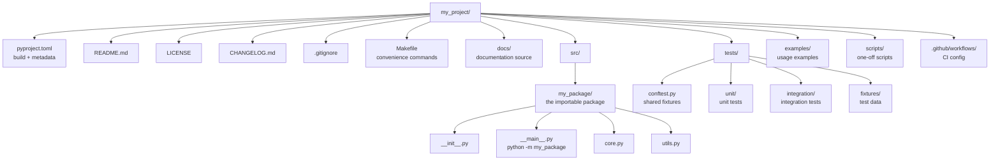
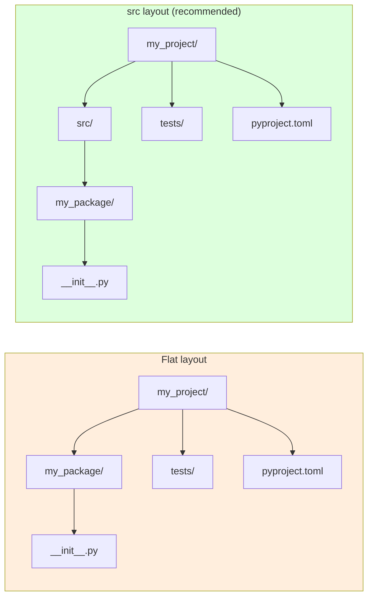
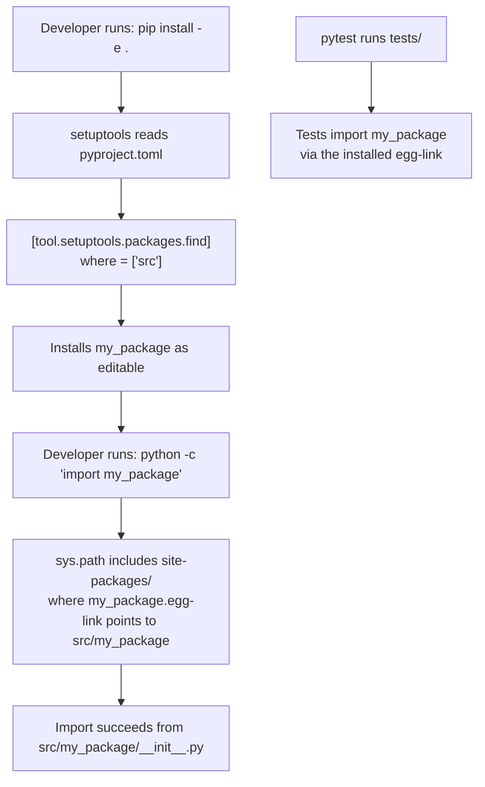
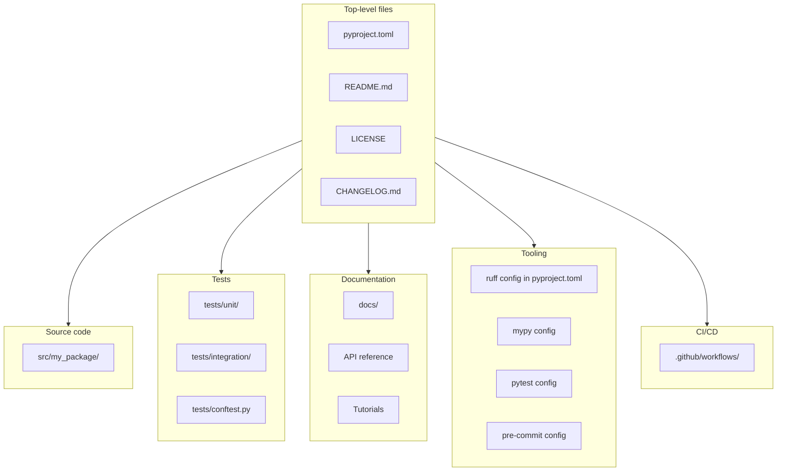

# Project Structure — Layout Decisions That Scale with Your Codebase

> [!info] Chapter 28 — Software Engineering Practices, Note 1
> First note of the SWE chapter. Subsequent notes: [[2. Design Patterns in Python]], [[3. SOLID Principles]], [[4. Code Quality Tools]], [[5. Documentation]]. Also cross-reference [[7. Modules and Packages/2. Packages and init.py]], [[7. Modules and Packages/4. pyproject.toml and Packaging]], and [[21. Packaging and Distribution/1. Wheels and Build Systems]].

## Why This Matters

A bad project layout is a tax you pay every day. It makes imports confusing, tests awkward to run, packaging brittle, and onboarding painful. A good layout is invisible — it lets you focus on the code.

Python is unusually permissive about project layout: there is no compiler to enforce directory structure, and `sys.path` manipulation can make almost anything importable. This freedom is a trap. The Python community has converged on conventions — codified in PEPs and tooling — that you should follow unless you have a compelling reason not to. Following the conventions means:

- New contributors understand your project on day one.
- `pytest` finds your tests without configuration.
- `pip install -e .` produces a working development install.
- IDEs (PyCharm, VS Code) auto-discover your package and provide jump-to-definition.
- `mypy`, `ruff`, and other tools "just work".

This note covers the recommended layout, the rationale for each piece, and the trade-offs between `src` and flat layouts.

## Background — Why Python Project Layout Is Non-Obvious

In compiled languages like C or Java, the build system enforces layout: header files in `include/`, sources in `src/`, packages matching directory paths. Python has no such enforcement — you can `import` from any directory on `sys.path`. This means layout is a convention, not a requirement, and conventions have evolved over time.

Three forces shaped the modern conventions:

1. **The packaging ecosystem's evolution** — from `setup.py` (manual, imperative) to `setup.cfg` (declarative) to `pyproject.toml` (PEP 518/621, the modern standard).
2. **The `src` layout movement** — popularised by projects like `pytest`, `requests`, and `setuptools` documentation in the late 2010s, which argued that putting the package under `src/` catches packaging bugs that the flat layout misses.
3. **PEP 517/518/621** — standardised `pyproject.toml` as the single source of build configuration, eliminating the need for `setup.py` in most cases.

The result is a fairly consistent layout across modern Python projects, which we document below.

## Main Content

### 1. The Recommended Layout

This is the canonical modern Python project layout:

```
my_project/
├── pyproject.toml          # build config + project metadata
├── README.md               # what the project is and how to use it
├── LICENSE                 # license text (MIT, Apache-2.0, BSD-3-Clause, etc.)
├── CHANGELOG.md            # release history
├── .gitignore              # files to exclude from git
├── .python-version         # for pyenv users
├── Makefile                # convenience commands (make test, make lint)
├── docs/                   # documentation source
│   ├── conf.py             # for Sphinx
│   ├── index.md            # for MkDocs
│   └── ...
├── src/                    # source code lives here (src layout)
│   └── my_package/         # the actual importable package
│       ├── __init__.py
│       ├── core.py
│       ├── utils.py
│       └── ...
├── tests/                  # tests live here (NOT inside src)
│   ├── conftest.py         # shared pytest fixtures
│   ├── unit/               # unit tests
│   │   ├── test_core.py
│   │   └── ...
│   └── integration/        # integration tests
│       └── ...
├── examples/               # usage examples
├── scripts/                # one-off scripts (not part of the package)
└── .github/                # CI/CD config
    └── workflows/
        └── ci.yml
```

Let us walk through each piece.

### 2. `pyproject.toml` — The Single Source of Truth

`pyproject.toml` (PEP 518, 517, 621) is the modern configuration file. It contains:

- `[build-system]` — what build backend to use (`setuptools`, `hatch`, `flit`, `poetry`).
- `[project]` — project metadata (name, version, description, authors, dependencies).
- `[project.optional-dependencies]` — extras like `dev`, `test`, `docs`.
- `[tool.*]` — tool-specific config (`tool.pytest`, `tool.ruff`, `tool.mypy`, etc.).

```toml
[build-system]
requires = ["setuptools>=64", "wheel"]
build-backend = "setuptools.build_meta"

[project]
name = "my-package"
version = "1.0.0"
description = "A short, one-line description."
readme = "README.md"
requires-python = ">=3.10"
license = { text = "MIT" }
authors = [
    { name = "Your Name", email = "you@example.com" },
]
dependencies = [
    "requests>=2.28",
    "pydantic>=2.0",
]

[project.optional-dependencies]
dev = [
    "ruff>=0.1.0",
    "mypy>=1.5",
    "pytest>=7.0",
    "pytest-cov>=4.0",
]
docs = [
    "sphinx>=7.0",
    "myst-parser>=2.0",
]

[project.scripts]
mycli = "my_package.cli:main"

[tool.setuptools.packages.find]
where = ["src"]

[tool.pytest.ini_options]
testpaths = ["tests"]
addopts = "--strict-markers"

[tool.ruff]
line-length = 100
target-version = "py310"
src = ["src", "tests"]

[tool.mypy]
strict = true
```

With this file, `pip install -e .` produces an editable install that lets you edit code in `src/` and immediately see changes. `pip install -e .[dev]` also installs the dev tools.

### 3. The `src` Layout vs the Flat Layout

There are two competing layouts for the source code itself:

#### Flat layout

```
my_project/
├── pyproject.toml
├── my_package/             # package lives at the project root
│   ├── __init__.py
│   └── ...
└── tests/
```

#### `src` layout

```
my_project/
├── pyproject.toml
├── src/
│   └── my_package/         # package lives under src/
│       ├── __init__.py
│       └── ...
└── tests/
```

The `src` layout is recommended. The reason is subtle but important: with the flat layout, the project root directory is on `sys.path` when you run `python` from there. This means `import my_package` works *even if you have not installed the package*. This sounds convenient but causes two bugs:

1. **Tests pass without the package being installed.** Your tests pass on your machine, but the package fails to install on PyPI because of a missing dependency or a packaging bug. With the `src` layout, tests only pass after `pip install -e .`, which forces the packaging to actually work.

2. **Ambiguous imports.** If your package is called `requests` and you have a top-level file called `requests.py` somewhere in your test directory, the flat layout can pick up the wrong one. The `src` layout isolates the package from the rest of the project.

The flat layout is still common in older projects (`requests` itself uses it, for historical reasons), but new projects should use the `src` layout.

### 4. `__init__.py` — What Goes in It

`__init__.py` marks a directory as a package. It can be:

- **Empty** — the most common case. The directory is a package, period.
- **Re-exports** — for packages that want a clean public API. For example, `requests/__init__.py` re-exports `get`, `post`, `Session`, etc., so users can do `from requests import get` instead of `from requests.sessions import Session`.
- **Package-level initialisation** — set up logging, register codecs, load configuration. This should be minimal; side effects at import time are a common source of bugs.

```python
# my_package/__init__.py
"""My package: a short description."""

from my_package.core import MyClass, my_function
from my_package.cli import main

__version__ = "1.0.0"
__all__ = ["MyClass", "my_function", "main"]
```

Key conventions:

- **`__all__`** declares the public API. `from my_package import *` only imports names in `__all__`.
- **`__version__`** is the canonical place for the version string. Modern Python (3.8+) recommends using `importlib.metadata.version("my-package")` instead, but `__version__` is still common.
- **Docstrings at the top of `__init__.py`** become the package's documentation.

Avoid heavy logic in `__init__.py`. If your package needs to read a config file or initialise a database connection, do it lazily — not at import time.

### 5. Public vs Private Modules

Python has no language-level access control. By convention:

- **Public modules** start with a letter: `core.py`, `utils.py`, `cli.py`.
- **Private modules** start with an underscore: `_internal.py`, `_helpers.py`. These signal "do not import from outside the package".
- **Dunder names** like `__init__.py`, `__main__.py`, `__version__.py` are reserved for special purposes.

`__main__.py` is special: if your package is run with `python -m my_package`, Python executes `my_package/__main__.py`. This is the canonical way to make a package runnable as a script.

```python
# my_package/__main__.py
import sys
from my_package.cli import main

if __name__ == "__main__":
    sys.exit(main())
```

### 6. The `tests/` Directory

Modern Python projects put tests in a top-level `tests/` directory, not inside the package. Reasons:

- Tests should not be packaged with the distribution — they add bulk without value to end users.
- A separate `tests/` directory makes it easy to run tests independently of the package.
- `pytest` finds tests in `tests/` automatically.

```
tests/
├── conftest.py             # shared fixtures
├── unit/
│   ├── __init__.py
│   ├── test_core.py
│   └── test_utils.py
├── integration/
│   ├── __init__.py
│   └── test_api.py
└── fixtures/               # test data
    └── sample.json
```

`conftest.py` is a pytest-specific file that defines fixtures shared across multiple test files. Pytest automatically discovers `conftest.py` files in the test tree.

```python
# tests/conftest.py
import pytest

@pytest.fixture
def sample_data():
    return {"name": "Alice", "age": 30}
```

### 7. The `docs/` Directory

Documentation lives in `docs/`. Two common choices:

- **Sphinx** (`docs/conf.py`, `.rst` or `.md` files) — the traditional Python documentation tool. Used by CPython, NumPy, pandas, requests, and most major libraries. Powerful but complex.
- **MkDocs** (`mkdocs.yml`, `.md` files) — simpler, Markdown-native, with Material theme being the modern default. Used by FastAPI, Typer, and many newer projects.

```bash
# Typical Sphinx structure
docs/
├── conf.py
├── index.rst
├── installation.rst
├── usage.rst
├── api.rst
├── _static/
└── _build/                # generated HTML (gitignored)
```

```bash
# Typical MkDocs structure
docs/
├── index.md
├── installation.md
├── usage.md
└── api/
    └── reference.md
```

Choose Sphinx if you want API auto-documentation with deep cross-references, or if your project is large and academic. Choose MkDocs if you want a quick-start guide with a beautiful default theme.

### 8. Real-World Examples

#### `requests`

```
requests/
├── HISTORY.md
├── LICENSE
├── README.md
├── setup.py                  # legacy
├── setup.cfg
├── pyproject.toml
├── requests/                 # flat layout
│   ├── __init__.py
│   ├── __version__.py
│   ├── _internal_utils.py
│   ├── adapters.py
│   ├── api.py
│   ├── auth.py
│   ├── certs.py
│   ├── compat.py
│   ├── cookies.py
│   ├── exceptions.py
│   ├── hooks.py
│   ├── models.py
│   ├── packages.py
│   ├── sessions.py
│   ├── status_codes.py
│   ├── structures.py
│   └── utils.py
└── tests/
```

Note: `requests` uses the flat layout (it predates the `src` convention). New projects should not copy this.

#### `flask`

```
flask/
├── pyproject.toml
├── src/
│   └── flask/
│       ├── __init__.py
│       ├── __main__.py
│       ├── app.py
│       ├── blueprints.py
│       ├── cli.py
│       ├── ctx.py
│       ├── debughelpers.py
│       ├── globals.py
│       ├── helpers.py
│       ├── json/
│       │   ├── __init__.py
│       │   └── provider.py
│       ├── logging.py
│       ├── scaffold.py
│       ├── sessions.py
│       ├── templating.py
│       ├── testing.py
│       ├── views.py
│       └── wrappers.py
├── tests/
└── docs/
```

`flask` uses the `src` layout — this is the model to follow.

#### `pandas`

`pandas` is too large for a single package; it uses subpackages:

```
pandas/
├── pyproject.toml
├── setup.cfg
├── pandas/                   # flat layout (historical)
│   ├── __init__.py
│   ├── _libs/                # Cython extensions
│   ├── api/
│   │   ├── __init__.py
│   │   └── types/
│   ├── arrays/
│   ├── compat/
│   ├── core/
│   │   ├── __init__.py
│   │   ├── frame.py          # DataFrame
│   │   ├── series.py         # Series
│   │   └── ...
│   ├── io/                   # I/O: read_csv, read_parquet, ...
│   ├── plotting/
│   ├── tests/
│   └── util/
└── doc/
```

For very large projects, subpackages (`core/`, `io/`, `plotting/`) provide a second level of organisation.

### 9. Mermaid — Recommended Python Project Tree



### 10. Mermaid — `src` Layout vs Flat Layout



### 11. Mermaid — How Imports Work in the `src` Layout



### 12. The `Makefile` — Convenience Commands

A small Makefile gives you a single entry point for common tasks:

```makefile
.PHONY: install test lint typecheck format docs clean

install:
	pip install -e ".[dev]"

test:
	pytest

lint:
	ruff check src tests

format:
	ruff format src tests

typecheck:
	mypy src

docs:
	cd docs && make html

clean:
	rm -rf build dist *.egg-info .pytest_cache .mypy_cache .ruff_cache
```

Now `make test`, `make lint`, `make typecheck` are all one-word commands. This is especially valuable for onboarding new contributors.

### 13. The `.gitignore`

Python's standard `.gitignore` (from GitHub's templates) excludes:

- `__pycache__/`, `*.pyc`
- `*.egg-info/`, `*.egg-link`
- `build/`, `dist/`
- `.venv/`, `venv/`, `env/`
- `.pytest_cache/`, `.mypy_cache/`, `.ruff_cache/`
- `.coverage`, `htmlcov/`
- `docs/_build/`
- `.ipynb_checkpoints/`
- `.env`, `.env.local`

Always include these. Committing `__pycache__` is a common rookie mistake.

### 14. CI/CD Configuration

The `.github/workflows/ci.yml` file runs your tests on every push:

```yaml
name: CI
on: [push, pull_request]
jobs:
  test:
    runs-on: ubuntu-latest
    strategy:
      matrix:
        python-version: ["3.10", "3.11", "3.12"]
    steps:
      - uses: actions/checkout@v4
      - uses: actions/setup-python@v5
        with:
          python-version: ${{ matrix.python-version }}
      - run: pip install -e ".[dev]"
      - run: pytest --cov=my_package --cov-report=xml
      - run: ruff check src tests
      - run: mypy src
```

### 15. Mermaid — Layers of a Python Project



## Code Examples

### A minimal `pyproject.toml` for a CLI tool

```toml
[build-system]
requires = ["setuptools>=64", "wheel"]
build-backend = "setuptools.build_meta"

[project]
name = "my-cli"
version = "0.1.0"
description = "A useful CLI tool."
readme = "README.md"
requires-python = ">=3.10"
license = { text = "MIT" }
authors = [{ name = "Your Name", email = "you@example.com" }]
dependencies = [
    "click>=8.0",
    "rich>=13.0",
]

[project.optional-dependencies]
dev = ["ruff", "mypy", "pytest", "pytest-cov"]

[project.scripts]
my-cli = "my_cli.cli:main"

[tool.setuptools.packages.find]
where = ["src"]

[tool.ruff]
line-length = 100
target-version = "py310"

[tool.mypy]
strict = true

[tool.pytest.ini_options]
testpaths = ["tests"]
addopts = "--strict-markers --cov=my_cli"
```

### A `__main__.py` for runnable packages

```python
# src/my_package/__main__.py
"""Entry point for `python -m my_package`."""
import sys
from my_package.cli import main

if __name__ == "__main__":
    sys.exit(main())
```

### A `conftest.py` with shared fixtures

```python
# tests/conftest.py
import pytest
from pathlib import Path


@pytest.fixture
def fixtures_dir() -> Path:
    return Path(__file__).parent / "fixtures"


@pytest.fixture
def sample_config(fixtures_dir: Path) -> dict:
    import json
    return json.loads((fixtures_dir / "config.json").read_text())


@pytest.fixture
def temp_db(tmp_path):
    """A temporary SQLite database."""
    import sqlite3
    db = sqlite3.connect(tmp_path / "test.db")
    db.execute("CREATE TABLE users (id INTEGER PRIMARY KEY, name TEXT)")
    yield db
    db.close()
```

### A monorepo structure

For projects with multiple packages, a monorepo layout works:

```
my_monorepo/
├── pyproject.toml          # workspace config
├── packages/
│   ├── core/
│   │   ├── pyproject.toml
│   │   ├── src/
│   │   │   └── my_core/
│   │   └── tests/
│   ├── api/
│   │   ├── pyproject.toml
│   │   ├── src/
│   │   │   └── my_api/
│   │   └── tests/
│   └── cli/
│       ├── pyproject.toml
│       ├── src/
│       │   └── my_cli/
│       └── tests/
└── tools/
    └── release.py
```

This is what large organisations (like the Linux kernel of Python packaging) use for related multi-package projects. Tools like `hatch` and `poetry` have begun supporting this natively.

## Common Pitfalls

> [!danger] Using the flat layout and not installing the package
> With the flat layout, `import my_package` works from the project root even without `pip install`. This means tests pass locally but fail in CI or when installed from PyPI. Use the `src` layout to catch this.

> [!danger] Mixing `setup.py` and `pyproject.toml`
> Modern Python uses `pyproject.toml`. Keep a `setup.py` only if you need it for C extensions or other complex build steps. Otherwise it is dead weight that confuses tools.

> [!danger] Putting tests inside the package
> `my_package/tests/` makes tests part of the distribution. End users get your tests installed, which adds bulk and creates import-time side effects. Put tests in a top-level `tests/` directory.

> [!danger] Heavy `__init__.py`
> Importing a package should be fast and side-effect-free. Database connections, config file reads, and network calls belong in lazy initialisation functions, not in `__init__.py`.

> [!danger] Not pinning Python version
> `requires-python = ">=3.7"` lets users install on Python 3.7, but if your code uses 3.10+ features (like `match`), it will crash on import. Use `requires-python = ">=3.10"` to enforce.

> [!danger] Committing `__pycache__/`
> These directories contain compiled bytecode and should never be committed. A proper `.gitignore` excludes them.

> [!danger] Letting version drift between `pyproject.toml` and `__init__.py`
> If your version is in both `pyproject.toml` (`version = "1.0.0"`) and `__init__.py` (`__version__ = "1.0.0"`), they will drift. Use a single source — either read the version with `importlib.metadata.version("my-package")` in `__init__.py`, or use a tool like `setuptools-scm` to derive the version from git tags.

> [!danger] Forgetting `__all__`
> Without `__all__`, `from my_package import *` imports every public name in the package, including ones you did not intend to expose. Define `__all__` explicitly.

> [!danger] Putting CLI scripts in `scripts/` and not declaring them
> If your `scripts/release.py` is meant to be runnable, declare it as an entry point in `[project.scripts]` so users can run it as a command after `pip install`.

> [!danger] Not having a `tests/conftest.py`
> Shared fixtures scattered across test files lead to duplication. A single `conftest.py` at the `tests/` root provides shared fixtures for all tests.

> [!danger] Running tests against the source tree, not the installed package
> `pytest` from the project root might import from `src/` directly (because `pytest` adds the project root to `sys.path`), masking packaging bugs. Install the package with `pip install -e .` first, then run `pytest` from a different directory to ensure you are testing the installed package.

## Tips and Tricks

- **Use the `src` layout for new projects.** It catches packaging bugs that the flat layout misses.
- **Use `pyproject.toml` exclusively.** Do not write `setup.py` unless you have a complex build.
- **Pin `requires-python` to the minimum version you actually support.** Use `ruff`'s `target-version` to enforce.
- **Put shared fixtures in `tests/conftest.py`.** Pytest discovers them automatically.
- **Use a `Makefile` (or `justfile`) for common commands.** `make test` is easier to remember than `pytest --cov=my_package --cov-report=html -x`.
- **Use `setuptools-scm` for versioning from git tags.** Eliminates the version drift problem.
- **Use `pre-commit` to enforce formatting and linting before each commit.** See [[4. Code Quality Tools]].
- **Keep `__init__.py` files short.** Re-exports are fine; logic is not.
- **Use `__main__.py` for runnable packages.** This is the canonical way to support `python -m my_package`.
- **Pin your dev dependencies.** Use `pip-compile` (from `pip-tools`) or `poetry` to produce a `requirements-dev.txt` lockfile.
- **Use `direnv`** to automatically activate a virtualenv when you `cd` into the project.
- **Use `pyenv`** to manage multiple Python versions on the same machine.
- **Document your project layout in `CONTRIBUTING.md`.** New contributors should not have to guess.
- **For monorepos, use a workspace tool** like `hatch`'s workspace mode, `poetry`'s monorepo support, or `pdm`'s workspace features.
- **Read the setuptools "Quickstart" and "Modern setuptools" docs** for the canonical reference on `pyproject.toml`.
- **Look at `flask`, `httpx`, and `pydantic`** for excellent modern examples to copy.

## Active Recall

> [!question] What are the two main project layouts in Python, and which is recommended for new projects?
>> [!success]- Answer
>> The **flat layout** (package at project root) and the **src layout** (package under `src/`). The src layout is recommended for new projects because it forces the package to be properly installed before tests can run, catching packaging bugs early.

> [!question] Why does the flat layout mask packaging bugs?
>> [!success]- Answer
>> With the flat layout, the project root is on `sys.path` when you run `python` or `pytest` from the project root. `import my_package` succeeds even if the package has not been installed. This means tests pass locally but may fail when the package is installed from PyPI.

> [!question] What goes in `pyproject.toml`?
>> [!success]- Answer
>> (1) `[build-system]` — the build backend (`setuptools`, `hatch`, `flit`). (2) `[project]` — metadata (name, version, description, dependencies). (3) `[project.optional-dependencies]` — extras like `dev`, `test`, `docs`. (4) `[project.scripts]` — CLI entry points. (5) `[tool.*]` — tool-specific config (pytest, ruff, mypy).

> [!question] Why put tests in a top-level `tests/` directory rather than inside the package?
>> [!success]- Answer
>> (1) Tests should not be distributed with the package — they add bulk without value to end users. (2) A separate `tests/` directory makes it easy to run tests independently. (3) `pytest` finds them automatically.

> [!question] What is the purpose of `__init__.py` and what should it contain?
>> [!success]- Answer
>> `__init__.py` marks a directory as a package. It can be empty (the most common case), contain re-exports of the public API (`from my_package.core import MyClass`), or set package-level state like `__version__` and `__all__`. Heavy initialisation logic should be avoided.

> [!question] What does `__main__.py` do?
>> [!success]- Answer
>> It is the entry point for `python -m my_package`. When you run `python -m my_package`, Python executes `my_package/__main__.py`. This is the canonical way to make a package runnable as a script.

> [!question] What is `__all__` for?
>> [!success]- Answer
>> `__all__` is a list of strings defining the public API of a module or package. It controls what `from my_package import *` imports. Without it, `import *` imports every public name (anything not starting with `_`).

> [!question] Why should `__init__.py` avoid heavy initialisation?
>> [!success]- Answer
>> Import-time side effects (database connections, config file reads, network calls) make the package slower to import, harder to test (you cannot import without triggering the side effect), and prone to circular import problems. Do initialisation lazily — inside functions or classes that need it.

> [!question] What does `pip install -e .` do, and why is it useful during development?
>> [!success]- Answer
>> It installs the package in "editable" mode: instead of copying files into `site-packages`, it creates a link (`.egg-link` or `.pth`) that points back to the source directory. Edits to the source are immediately visible without re-installing. This is essential for iterative development.

> [!question] Name three real-world Python projects and their layout choice.
>> [!success]- Answer
>> (1) **requests** — flat layout (historical). (2) **flask** — src layout (modern). (3) **pandas** — flat layout with subpackages (`core/`, `io/`, `plotting/`) for organisation. New projects should follow flask's example.

> [!question] Why is a `Makefile` (or `justfile`) useful in a Python project?
>> [!success]- Answer
>> It provides a single entry point for common tasks: `make install`, `make test`, `make lint`, `make docs`. This is easier to remember than the underlying commands, and it documents the project's workflow for new contributors.

## Next Steps

- Continue to [[2. Design Patterns in Python]] for how to organise code *within* a package.
- Then [[3. SOLID Principles]] for object-oriented design discipline.
- Then [[4. Code Quality Tools]] for the tooling that enforces your layout and style decisions.
- Then [[5. Documentation]] for how to document your well-structured code.
- Cross-reference [[7. Modules and Packages/2. Packages and init.py]] for the package mechanics.
- Cross-reference [[7. Modules and Packages/4. pyproject.toml and Packaging]] for the build configuration.
- Cross-reference [[21. Packaging and Distribution/1. Wheels and Build Systems]] for how `pyproject.toml` produces distributable wheels.
- Cross-reference [[12. Testing/3. pytest]] for the test side of this layout.
- Read the PyPA "Packaging Python Projects" tutorial at https://packaging.python.org/en/latest/tutorials/packaging-projects/ for the canonical reference.
