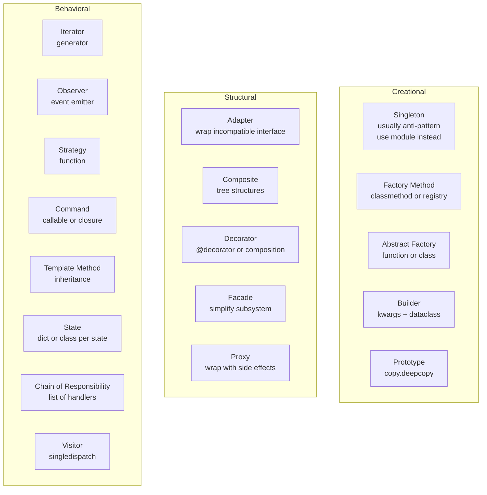
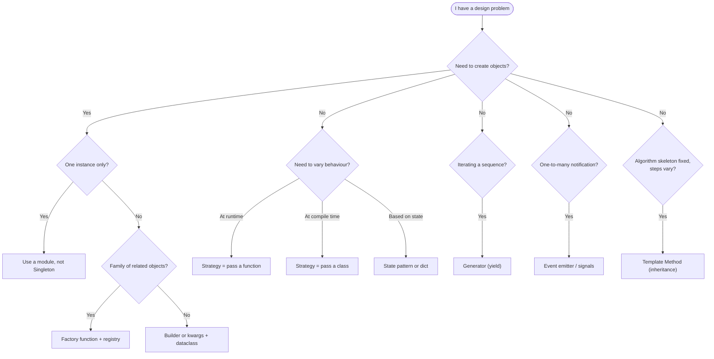

# Design Patterns in Python — GoF Patterns Adapted to a Dynamic Language

> [!info] Chapter 28 — Software Engineering Practices, Note 2
> Follows [[1. Project Structure]]. Continues with [[3. SOLID Principles]], [[4. Code Quality Tools]], [[5. Documentation]]. Cross-references [[8. Object-Oriented Programming/3. Inheritance]], [[8. Object-Oriented Programming/8. Composition vs Inheritance]], [[10. Pythonic Programming/4. Decorators Deep Dive]], and [[10. Pythonic Programming/2. Generators and Iterators]].

## Why This Matters

"Design Patterns: Elements of Reusable Object-Oriented Software" (Gamma, Helm, Johnson, Vlissides — the "Gang of Four", 1994) catalogued 23 recurring patterns in object-oriented design. The book was written for C++ and Smalltalk — statically-typed, class-heavy languages. Python is dynamically typed, has first-class functions, supports metaprogramming, and has a different idiom for nearly every pattern.

The key insight: **many GoF patterns are workarounds for missing language features**. In Python:

- **Strategy** — pass a function instead of subclassing.
- **Command** — use a closure or a callable object.
- **Iterator** — use a generator function.
- **Decorator** — Python has this built in as `@decorator`.
- **Singleton** — usually an anti-pattern; use a module instead.

Other patterns are still valuable:

- **Factory Method** and **Abstract Factory** — when object creation needs indirection.
- **Observer** — when one object needs to notify many others.
- **Adapter** and **Facade** — when you need to bridge incompatible interfaces.
- **Composite** — when you have tree structures of objects.

This note walks through the patterns most relevant to Python, shows the Pythonic implementation, and flags the ones that are usually better avoided. The goal is not to apply every pattern — it is to recognise when a pattern is the right tool and to implement it idiomatically.

## Background — The GoF Categories

The 23 GoF patterns are divided into three categories:

1. **Creational** — object construction: Singleton, Factory Method, Abstract Factory, Builder, Prototype.
2. **Structural** — composing objects into larger structures: Adapter, Bridge, Composite, Decorator, Facade, Flyweight, Proxy.
3. **Behavioral** — communication between objects: Chain of Responsibility, Command, Interpreter, Iterator, Mediator, Memento, Observer, State, Strategy, Template Method, Visitor.

In Python, the line between these categories blurs. First-class functions, generators, and dynamic dispatch make many patterns one-liners. We cover the most useful ones below.

## Main Content

### 1. Singleton — Usually an Anti-Pattern

The Singleton pattern ensures a class has only one instance and provides a global access point to it.

```python
class Singleton:
    _instance = None

    def __new__(cls):
        if cls._instance is None:
            cls._instance = super().__new__(cls)
        return cls._instance

a = Singleton()
b = Singleton()
assert a is b  # same instance
```

This works, but it has problems:

- **Hidden global state** — singletons are global variables dressed up as classes. They make code hard to test (you cannot easily substitute a mock) and create hidden dependencies.
- **Lifecycle coupling** — the singleton is created at first use and never destroyed. Configuration, database connections, and caches held by singletons live forever.
- **Concurrency bugs** — the `_instance = None` check is not thread-safe without a lock.

**The Pythonic alternative: use a module.** Modules in Python are singletons by design — they are imported once and cached in `sys.modules`. Any name defined at module level is shared by all importers.

```python
# config.py
class _Config:
    def __init__(self):
        self.database_url = "postgres://localhost/myapp"
        self.debug = False

    def reload(self):
        # ... re-read from environment ...
        pass

config = _Config()
```

```python
# anywhere else
from config import config
print(config.database_url)
```

This gives you singleton behaviour without the Singleton class machinery. It is also testable — you can `import config; config.config = MockConfig()` in your tests.

If you truly need a class-based singleton (e.g., for a subclass-aware singleton), use a metaclass:

```python
class SingletonMeta(type):
    _instances: dict[type, object] = {}

    def __call__(cls, *args, **kwargs):
        if cls not in cls._instances:
            cls._instances[cls] = super().__call__(*args, **kwargs)
        return cls._instances[cls]

class Database(metaclass=SingletonMeta):
    def __init__(self):
        self.connection = ...
```

But before doing this, ask yourself: do you really need a singleton, or would dependency injection be better?

### 2. Factory Method — Use a `classmethod` or a Function

The Factory Method pattern defines an interface for creating an object but lets subclasses decide which class to instantiate. In Python, you usually use a `classmethod` or a module-level function.

```python
from dataclasses import dataclass

@dataclass
class Animal:
    name: str

    @classmethod
    def from_config(cls, config: dict) -> "Animal":
        animal_type = config["type"]
        if animal_type == "dog":
            return Dog(config["name"])
        elif animal_type == "cat":
            return Cat(config["name"])
        else:
            raise ValueError(f"unknown animal type: {animal_type}")

@dataclass
class Dog(Animal):
    pass

@dataclass
class Cat(Animal):
    pass
```

Even more Pythonic: a registry of factories.

```python
ANIMAL_REGISTRY: dict[str, type[Animal]] = {}

def register(animal_type: str):
    def decorator(cls):
        ANIMAL_REGISTRY[animal_type] = cls
        return cls
    return decorator

@register("dog")
@dataclass
class Dog(Animal):
    pass

@register("cat")
@dataclass
class Cat(Animal):
    pass

def create_animal(config: dict) -> Animal:
    cls = ANIMAL_REGISTRY[config["type"]]
    return cls(config["name"])
```

This pattern — a decorator-based registry — is used by web frameworks (Flask routes, Click commands, pytest plugins) and is the Pythonic equivalent of the Abstract Factory pattern.

### 3. Abstract Factory — Use a Function or a Class with Factory Methods

Abstract Factory provides an interface for creating families of related objects without specifying their concrete classes.

```python
class UIFactory:
    def create_button(self): raise NotImplementedError
    def create_text_field(self): raise NotImplementedError

class WindowsFactory(UIFactory):
    def create_button(self): return WindowsButton()
    def create_text_field(self): return WindowsTextField()

class MacFactory(UIFactory):
    def create_button(self): return MacButton()
    def create_text_field(self): return MacTextField()
```

In Python, you often do not need the abstract base class — duck typing handles it. But for clarity, use `abc.ABC` or `typing.Protocol`:

```python
from typing import Protocol

class UIFactory(Protocol):
    def create_button(self) -> "Button": ...
    def create_text_field(self) -> "TextField": ...
```

### 4. Builder — Use Keyword Arguments and Dataclasses

The Builder pattern separates construction of a complex object from its representation. In Java, it looks like:

```java
Pizza pizza = new Pizza.Builder()
    .size(LARGE)
    .addTopping(PEPPERONI)
    .addTopping(MUSHROOM)
    .build();
```

In Python, keyword arguments and dataclasses cover 90% of use cases:

```python
from dataclasses import dataclass, field

@dataclass
class Pizza:
    size: str = "medium"
    toppings: list[str] = field(default_factory=list)

# Fluent builder if you want one:
class PizzaBuilder:
    def __init__(self):
        self._pizza = Pizza()

    def size(self, size: str) -> "PizzaBuilder":
        self._pizza.size = size
        return self

    def add_topping(self, topping: str) -> "PizzaBuilder":
        self._pizza.toppings.append(topping)
        return self

    def build(self) -> Pizza:
        return self._pizza

pizza = PizzaBuilder().size("large").add_topping("pepperoni").add_topping("mushroom").build()
```

For immutable objects, the `frozen=True` dataclass plus `dataclasses.replace` is the modern approach:

```python
@dataclass(frozen=True)
class Pizza:
    size: str = "medium"
    toppings: tuple[str, ...] = ()

# Update via replace:
large_pizza = replace(Pizza(), size="large")
```

### 5. Prototype — Use `copy.copy` and `copy.deepcopy`

The Prototype pattern creates new objects by cloning an existing instance.

```python
import copy

class Template:
    def __init__(self, name, fields):
        self.name = name
        self.fields = fields

    def clone(self) -> "Template":
        return copy.deepcopy(self)

template = Template("email", ["to", "subject", "body"])
new_template = template.clone()
new_template.name = "sms"
```

`copy.copy` does a shallow copy; `copy.deepcopy` recursively copies. Most of the time you want `deepcopy`. For dataclasses, use `dataclasses.replace(obj, field=new_value)` to get a copy with one field changed.

### 6. Adapter — Wrap an Incompatible Interface

The Adapter pattern converts the interface of a class into another interface clients expect.

```python
class OldPrinter:
    def print_text(self, text: str) -> None:
        print(f"[OLD] {text}")

class NewPrinterInterface:
    def send(self, message: bytes) -> None: ...

class PrinterAdapter(NewPrinterInterface):
    def __init__(self, old_printer: OldPrinter):
        self._old = old_printer

    def send(self, message: bytes) -> None:
        text = message.decode("utf-8")
        self._old.print_text(text)
```

In Python, adapters are often just functions:

```python
def adapt(old_printer: OldPrinter) -> NewPrinterInterface:
    class Adapter(NewPrinterInterface):
        def send(self, message: bytes) -> None:
            old_printer.print_text(message.decode("utf-8"))
    return Adapter()
```

### 7. Facade — Simplify a Complex Subsystem

The Facade pattern provides a unified interface to a set of interfaces in a subsystem. In Python, this is usually just a class or module that wraps several lower-level modules.

```python
class Computer:
    """A facade over CPU, Memory, and HardDrive."""
    def __init__(self):
        self.cpu = CPU()
        self.memory = Memory()
        self.hard_drive = HardDrive()

    def start(self) -> None:
        self.cpu.freeze()
        self.memory.load(0, self.hard_drive.read(0, 1024))
        self.cpu.execute(0)
```

Most Python modules are facades by design — `pathlib.Path` is a facade over `os`, `os.path`, `shutil`, and `glob`.

### 8. Composite — Tree Structures

The Composite pattern composes objects into tree structures to represent part-whole hierarchies. It lets clients treat individual objects and compositions uniformly.

```python
from abc import ABC, abstractmethod

class FileSystemNode(ABC):
    @abstractmethod
    def size(self) -> int: ...

class File(FileSystemNode):
    def __init__(self, name: str, size: int):
        self.name = name
        self._size = size

    def size(self) -> int:
        return self._size

class Directory(FileSystemNode):
    def __init__(self, name: str):
        self.name = name
        self.children: list[FileSystemNode] = []

    def add(self, node: FileSystemNode) -> "Directory":
        self.children.append(node)
        return self

    def size(self) -> int:
        return sum(child.size() for child in self.children)
```

This pattern is everywhere — DOM trees, AST nodes, file systems, organisation charts, UI component trees. The recursive `size()` works on both `File` and `Directory` because they share the interface.

### 9. Decorator — Python's Built-In Pattern

Python's `@decorator` syntax is the language-level implementation of the Decorator pattern. The pattern attaches additional responsibilities to an object dynamically.

```python
import functools
import time

def timing(func):
    @functools.wraps(func)
    def wrapper(*args, **kwargs):
        start = time.perf_counter()
        result = func(*args, **kwargs)
        elapsed = time.perf_counter() - start
        print(f"{func.__name__} took {elapsed:.4f}s")
        return result
    return wrapper

@timing
def slow_function():
    time.sleep(1)
```

For decorating instances (rather than functions), use composition:

```python
class Coffee:
    def cost(self) -> float: return 2.0

class MilkDecorator:
    def __init__(self, coffee: Coffee):
        self._coffee = coffee

    def cost(self) -> float:
        return self._coffee.cost() + 0.5

class SugarDecorator:
    def __init__(self, coffee: Coffee):
        self._coffee = coffee

    def cost(self) -> float:
        return self._coffee.cost() + 0.2

coffee = SugarDecorator(MilkDecorator(Coffee()))
print(coffee.cost())  # 2.7
```

See [[10. Pythonic Programming/4. Decorators Deep Dive]] for the full treatment.

### 10. Iterator — Use a Generator

The Iterator pattern provides a way to access the elements of an aggregate object sequentially without exposing its underlying representation. In Python, generators are the idiomatic implementation.

```python
# Iterator pattern (manual)
class RangeIterator:
    def __init__(self, start, end):
        self.current = start
        self.end = end

    def __iter__(self):
        return self

    def __next__(self):
        if self.current >= self.end:
            raise StopIteration
        result = self.current
        self.current += 1
        return result

# Generator (Pythonic)
def range_gen(start, end):
    while start < end:
        yield start
        start += 1
```

Both produce the same iterator, but the generator is 4 lines versus 12. Generators also handle infinite sequences and complex state naturally:

```python
def fibonacci():
    a, b = 0, 1
    while True:
        yield a
        a, b = b, a + b

fib = fibonacci()
print([next(fib) for _ in range(10)])  # [0, 1, 1, 2, 3, 5, 8, 13, 21, 34]
```

See [[10. Pythonic Programming/2. Generators and Iterators]] for the full treatment.

### 11. Observer — Use Signals or Event Emitters

The Observer pattern defines a one-to-many dependency so that when one object changes state, all its dependents are notified.

```python
from typing import Callable

class EventEmitter:
    def __init__(self):
        self._listeners: dict[str, list[Callable]] = {}

    def on(self, event: str, callback: Callable) -> None:
        self._listeners.setdefault(event, []).append(callback)

    def emit(self, event: str, *args, **kwargs) -> None:
        for callback in self._listeners.get(event, []):
            callback(*args, **kwargs)

# Usage
emitter = EventEmitter()
emitter.on("user_created", lambda user: print(f"Welcome, {user}!"))
emitter.on("user_created", lambda user: send_email(user))
emitter.emit("user_created", "Alice")
```

For larger systems, use a dedicated library:

- **`blinker`** — lightweight signal library, used by Flask.
- **`pydispatcher`** — robust signal library.
- **`asyncio`** — for async observers, use `asyncio.Queue` or `asyncio.Event`.

### 12. Strategy — Use Functions

The Strategy pattern defines a family of algorithms, encapsulates each one, and makes them interchangeable. In Python, functions are the natural unit.

```python
# Strategy pattern (verbose)
from abc import ABC, abstractmethod

class SortStrategy(ABC):
    @abstractmethod
    def sort(self, data): ...

class QuickSort(SortStrategy):
    def sort(self, data): return sorted(data)  # simplified

class MergeSort(SortStrategy):
    def sort(self, data): return sorted(data)  # simplified

class Sorter:
    def __init__(self, strategy: SortStrategy):
        self._strategy = strategy

    def sort(self, data):
        return self._strategy.sort(data)

# Pythonic: just use functions
def sort_data(data, strategy=None):
    return (strategy or sorted)(data)
```

The "strategies" are just functions. You can pass them around, compose them, and replace them at runtime. No classes needed.

For more complex strategies with state, use a callable class:

```python
class TaxCalculator:
    def __init__(self, rate: float):
        self.rate = rate

    def __call__(self, amount: float) -> float:
        return amount * self.rate

uk_tax = TaxCalculator(0.20)
us_tax = TaxCalculator(0.07)

print(uk_tax(100))  # 20.0
print(us_tax(100))  # 7.0
```

### 13. Command — Use a Callable Object or Closure

The Command pattern encapsulates a request as an object, letting you parameterise clients with different requests, queue or log requests, and support undo.

```python
class Command:
    def execute(self) -> None: ...
    def undo(self) -> None: ...

class AddTextCommand(Command):
    def __init__(self, document, text):
        self.document = document
        self.text = text

    def execute(self) -> None:
        self.document.append(self.text)

    def undo(self) -> None:
        self.document.pop()

document = []
commands = [AddTextCommand(document, "Hello"), AddTextCommand(document, " World")]
for cmd in commands:
    cmd.execute()
print(document)  # ['Hello', ' World']
```

For simple cases, closures suffice:

```python
def make_add_text_command(document, text):
    def execute():
        document.append(text)
    return execute
```

### 14. Template Method — Use Inheritance

The Template Method pattern defines the skeleton of an algorithm in a base class, letting subclasses override specific steps.

```python
from abc import ABC, abstractmethod

class DataProcessor(ABC):
    def process(self, data: str) -> str:
        data = self.read(data)
        data = self.transform(data)
        self.write(data)
        return data

    @abstractmethod
    def read(self, source: str) -> str: ...

    @abstractmethod
    def transform(self, data: str) -> str: ...

    @abstractmethod
    def write(self, data: str) -> None: ...

class CSVProcessor(DataProcessor):
    def read(self, source): return source
    def transform(self, data): return data.upper()
    def write(self, data): print(f"Writing CSV: {data}")
```

Template Method is one of the few patterns where inheritance is the right tool — the algorithm structure is fixed, but individual steps vary.

### 15. State — Use a Dictionary or a Class per State

The State pattern allows an object to alter its behaviour when its internal state changes.

```python
class VendingMachine:
    def __init__(self):
        self._state = IdleState(self)

    def set_state(self, state):
        self._state = state

    def insert_coin(self):
        self._state.insert_coin()

    def press_button(self):
        self._state.press_button()

class IdleState:
    def __init__(self, machine):
        self.machine = machine

    def insert_coin(self):
        print("Coin inserted")
        self.machine.set_state(HasCoinState(self.machine))

    def press_button(self):
        print("Insert a coin first")

class HasCoinState:
    def __init__(self, machine):
        self.machine = machine

    def insert_coin(self):
        print("Coin already inserted")

    def press_button(self):
        print("Dispensing product...")
        self.machine.set_state(IdleState(self.machine))
```

For simpler cases, a dictionary of state-to-handler mappings suffices:

```python
class TrafficLight:
    TRANSITIONS = {"red": "green", "green": "yellow", "yellow": "red"}

    def __init__(self):
        self.state = "red"

    def cycle(self):
        self.state = self.TRANSITIONS[self.state]
```

### 16. Chain of Responsibility — Use a List of Handlers

The Chain of Responsibility pattern passes a request along a chain of handlers, each deciding whether to handle it or pass it on.

```python
from typing import Optional, Callable

Handler = Callable[[dict], Optional[dict]]

def make_chain(*handlers: Handler) -> Handler:
    def chain(request: dict) -> dict:
        for handler in handlers:
            result = handler(request)
            if result is not None:
                return result
        raise ValueError("no handler could process the request")
    return chain

def auth_handler(request: dict) -> Optional[dict]:
    if "token" not in request:
        return {"error": "unauthorized"}
    return None  # pass to next

def rate_limit_handler(request: dict) -> Optional[dict]:
    if too_many_requests(request):
        return {"error": "rate limited"}
    return None

def business_handler(request: dict) -> Optional[dict]:
    return {"result": "processed"}

pipeline = make_chain(auth_handler, rate_limit_handler, business_handler)
response = pipeline({"token": "abc"})
```

This is how middleware works in Flask, Django, FastAPI, and most web frameworks.

### 17. Visitor — Use `singledispatch`

The Visitor pattern separates an algorithm from the object structure it operates on. In Python, `functools.singledispatch` is the idiomatic way.

```python
from functools import singledispatch

@singledispatch
def to_json(obj) -> str:
    raise TypeError(f"cannot serialise {type(obj)}")

@to_json.register
def _(obj: int) -> str:
    return str(obj)

@to_json.register
def _(obj: str) -> str:
    return f'"{obj}"'

@to_json.register
def _(obj: list) -> str:
    return "[" + ", ".join(to_json(x) for x in obj) + "]"

print(to_json([1, "hello", [2, 3]]))  # [1, "hello", [2, 3]]
```

For multiple-dispatch (on more than one argument), use `multipledispatch` from PyPI or `runtime`'s `multimethod`.

### 18. Mermaid — Design Patterns in Python (Categorised)



### 19. Mermaid — Choosing a Pattern in Python



## Code Examples

### Plugin system using a registry (Factory + Decorator)

```python
from typing import Callable, Type
import importlib

# Plugin registry
_PLUGINS: dict[str, Type] = {}

def plugin(name: str):
    def decorator(cls):
        if name in _PLUGINS:
            raise ValueError(f"duplicate plugin: {name}")
        _PLUGINS[name] = cls
        return cls
    return decorator

@plugin("csv")
class CSVReader:
    def read(self, path): ...

@plugin("json")
class JSONReader:
    def read(self, path): ...

def get_reader(name: str) -> "Reader":
    cls = _PLUGINS.get(name)
    if cls is None:
        raise ValueError(f"unknown reader: {name}")
    return cls()
```

### Observer with weak references (no memory leaks)

```python
import weakref
from typing import Callable

class Observable:
    def __init__(self):
        self._observers: list[weakref.ref] = []

    def subscribe(self, callback: Callable) -> None:
        self._observers.append(weakref.ref(callback))

    def notify(self, *args, **kwargs) -> None:
        for ref in list(self._observers):
            callback = ref()
            if callback is None:
                self._observers.remove(ref)
            else:
                callback(*args, **kwargs)
```

### Strategy with `functools.partial`

```python
from functools import partial

def discount(price: float, percent: float) -> float:
    return price * (1 - percent)

# Create strategies by partial application
ten_percent_off = partial(discount, percent=0.10)
twenty_percent_off = partial(discount, percent=0.20)

print(ten_percent_off(100))      # 90.0
print(twenty_percent_off(100))   # 80.0
```

### Composite for UI components

```python
from abc import ABC, abstractmethod

class UIComponent(ABC):
    @abstractmethod
    def render(self, indent: int = 0) -> str: ...

class Text(UIComponent):
    def __init__(self, content: str):
        self.content = content

    def render(self, indent: int = 0) -> str:
        return " " * indent + self.content

class Container(UIComponent):
    def __init__(self, name: str):
        self.name = name
        self.children: list[UIComponent] = []

    def add(self, component: UIComponent) -> "Container":
        self.children.append(component)
        return self

    def render(self, indent: int = 0) -> str:
        result = " " * indent + f"[{self.name}]\n"
        for child in self.children:
            result += child.render(indent + 2) + "\n"
        return result

ui = Container("window").add(
    Text("Hello, world!")
).add(
    Container("panel").add(Text("OK")).add(Text("Cancel"))
)
print(ui.render())
```

## Common Pitfalls

> [!danger] Implementing Singleton with `__new__`
> It looks clever, but it creates hidden global state, breaks testing, and is not thread-safe without a lock. Use a module instead — that is what modules are for.

> [!danger] Using abstract classes where protocols suffice
> `abc.ABC` requires inheritance. `typing.Protocol` (PEP 544) supports structural typing — you do not need to inherit from the protocol. Use protocols for duck-typed interfaces.

> [!danger] Over-engineering with patterns
> Patterns add complexity. Use them when the complexity is justified by the flexibility they provide. A 50-line script does not need a Factory, a Builder, and a Strategy.

> [!danger] Implementing the Visitor pattern manually
> The classic Visitor requires double dispatch, which Python does not natively support. Use `functools.singledispatch` for single-argument dispatch, or `multipledispatch` from PyPI for multi-argument.

> [!danger] Inheriting from concrete classes
> Inheritance is for substitutability (Liskov Substitution — see [[3. SOLID Principles]]). If a subclass overrides a method to do something incompatible, you violate LSP. Prefer composition over inheritance for code reuse.

> [!danger] Using class-level mutable defaults
> `_instances: dict = {}` at class level is shared across all subclasses. This is the source of many "Singleton works for one class but breaks for another" bugs. Use `__init_subclass__` or a per-class metaclass.

> [!danger] Tight coupling to singletons
> If your code calls `Database()` everywhere, you cannot substitute a mock for testing. Inject the dependency via the constructor.

> [!danger] Using Template Method when the algorithm structure is not actually fixed
> If subclasses override most of the methods, the pattern is just inheritance for inheritance's sake. Composition would be simpler.

> [!danger] Implementing Observer without weak references
> Strong references to observers prevent them from being garbage collected. Use `weakref.ref` or a library like `blinker` that handles this for you.

## Tips and Tricks

- **Reach for a function before a class.** Most patterns collapse to "pass a function" in Python.
- **Use `dataclasses` for value objects.** They give you `__init__`, `__repr__`, `__eq__`, and `__hash__` for free.
- **Use `typing.Protocol` for duck-typed interfaces.** No inheritance required.
- **Use `functools.singledispatch` for the Visitor pattern.** It is built in and idiomatic.
- **Use a module instead of Singleton.** Python modules are singletons.
- **Use `weakref` for Observer subscriptions.** Avoids memory leaks.
- **Use a registry decorator for Factories.** `@register("name")` is cleaner than a giant `if/elif/else`.
- **Prefer composition over inheritance.** Composition is more flexible and easier to test.
- **Use `__init_subclass__` for class-registration side effects.** Cleaner than metaclasses for most use cases.
- **For Strategy, use `functools.partial` to create strategies from a single function.**
- **For Chain of Responsibility, use a list of callables.** It is just a pipeline.
- **For State, use a dictionary for simple cases and classes for complex ones.**
- **For Decorator (the structural pattern), use composition.** For Python's `@decorator`, see [[10. Pythonic Programming/4. Decorators Deep Dive]].
- **Read "Python Patterns — Implementation of GoF Design Patterns"** at https://python-patterns.guide/ for Brandon Rhodes' excellent treatment.
- **Read "Fluent Python" by Luciano Ramalho** for a Pythonic view of design patterns.
- **Look at real codebases** — Flask, Django, pytest, and requests all use patterns idiomatically.

## Active Recall

> [!question] Why is Singleton often considered an anti-pattern in Python?
>> [!success]- Answer
>> (1) It introduces hidden global state that makes code hard to test. (2) It creates hidden dependencies — any code that calls `Database()` is coupled to the singleton. (3) The classic `__new__` implementation is not thread-safe without a lock. (4) Python already has singletons: modules. A module-level instance gives you the same behaviour with less machinery.

> [!question] What is the Pythonic alternative to the Strategy pattern?
>> [!success]- Answer
>> Pass a function. Strategies are usually just functions with a common signature; you can pass them as arguments, store them in attributes, and replace them at runtime. For stateful strategies, use a callable class.

> [!question] How is the Iterator pattern typically implemented in Python?
>> [!success]- Answer
>> With a generator function (using `yield`). The generator handles the `__iter__`/`__next__` machinery automatically. Manual `__iter__`/`__next__` classes are rarely needed.

> [!question] What does `functools.singledispatch` do, and which GoF pattern does it implement?
>> [!success]- Answer
>> It implements single-dispatch generic functions: a single function can have multiple implementations, selected based on the type of the first argument. This is the Pythonic implementation of the Visitor pattern for single-argument dispatch.

> [!question] How does Python's `@decorator` syntax relate to the GoF Decorator pattern?
>> [!success]- Answer
>> Python's `@decorator` is the language-level implementation of the Decorator pattern for functions. A decorator wraps a function with additional behaviour (timing, caching, logging, access control) without modifying the function's code. The GoF Decorator for objects (adding responsibilities to instances) is implemented via composition.

> [!question] What is the difference between Adapter and Facade?
>> [!success]- Answer
>> **Adapter** converts one interface into another, allowing incompatible classes to work together. **Facade** provides a simplified interface to a complex subsystem. Adapter is about *compatibility*; Facade is about *simplicity*.

> [!question] How is the Chain of Responsibility pattern typically implemented in Python?
>> [!success]- Answer
>> As a list of handler functions (or callables). Each handler receives the request, processes it (or returns `None` to pass it on), and the chain iterates until a handler returns a result. This is exactly how middleware works in Flask, Django, and FastAPI.

> [!question] When is the Template Method pattern the right choice in Python?
>> [!success]- Answer
>> When the algorithm structure is fixed but individual steps vary. The base class implements the algorithm as a series of calls to abstract methods; subclasses override the methods. This is one of the few patterns where inheritance is the right tool.

> [!question] What is a registry decorator, and what pattern does it implement?
>> [!success]- Answer
>> A decorator that registers a class or function in a global dictionary keyed by a string name. It implements the Factory pattern — callers can look up a class by name and instantiate it. Used by web frameworks for routes, by Click for commands, and by pytest for plugins.

> [!question] Why should Observer subscriptions use weak references?
>> [!success]- Answer
>> Strong references prevent observers from being garbage collected when they are no longer needed. If a short-lived object subscribes to a long-lived emitter, the observer leaks. `weakref.ref` lets the emitter hold a reference that does not prevent garbage collection; the emitter checks `ref()` and removes dead entries.

## Next Steps

- Continue to [[3. SOLID Principles]] for the design discipline that governs when patterns apply.
- Then [[4. Code Quality Tools]] for the tooling that catches anti-patterns automatically.
- Then [[5. Documentation]] for documenting your well-designed code.
- Cross-reference [[8. Object-Oriented Programming/8. Composition vs Inheritance]] for the central trade-off in pattern selection.
- Cross-reference [[8. Object-Oriented Programming/3. Inheritance]] and [[8. Object-Oriented Programming/4. Polymorphism and Duck Typing]].
- Cross-reference [[10. Pythonic Programming/4. Decorators Deep Dive]] for Python's decorator pattern.
- Cross-reference [[10. Pythonic Programming/2. Generators and Iterators]] for the Iterator pattern.
- Cross-reference [[19. Functional Python/2. partial and singledispatch]] for functional patterns.
- Read https://python-patterns.guide/ by Brandon Rhodes for the canonical Pythonic treatment.
- Read "Head First Design Patterns" (Freeman et al.) for an accessible introduction, then "Design Patterns" (GoF) for the original treatment.
