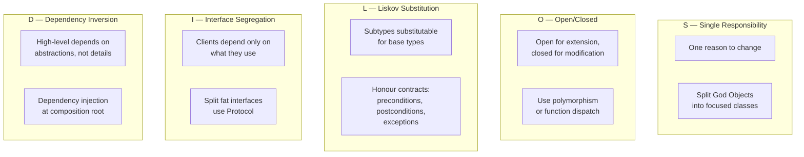
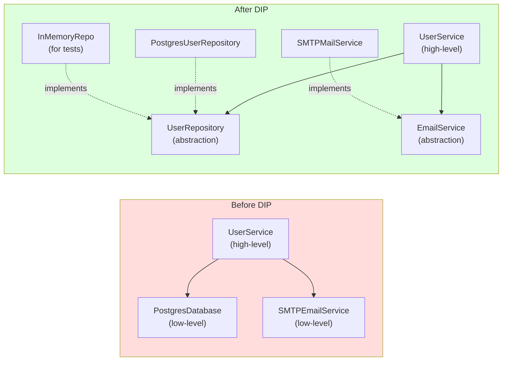
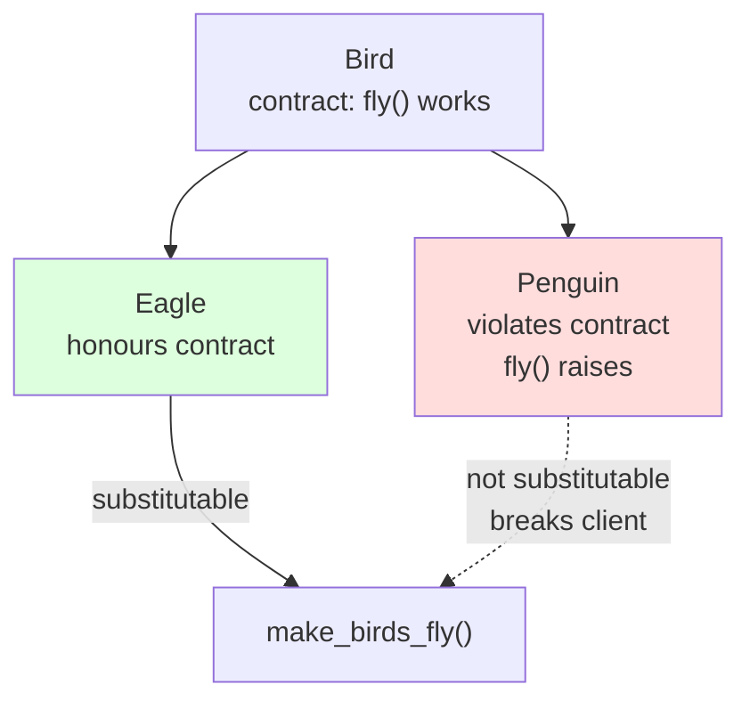

# SOLID Principles — Five Design Rules for Maintainable Object-Oriented Code

> [!info] Chapter 28 — Software Engineering Practices, Note 3
> Follows [[2. Design Patterns in Python]]. Continues with [[4. Code Quality Tools]] and [[5. Documentation]]. Cross-references [[8. Object-Oriented Programming/3. Inheritance]], [[8. Object-Oriented Programming/8. Composition vs Inheritance]], [[18. Advanced OOP/1. Abstract Base Classes]], and [[18. Advanced OOP/2. Protocols]].

## Why This Matters

SOLID is an acronym coined by Robert C. Martin ("Uncle Bob") around 2000 for five principles of object-oriented design:

- **S** — Single Responsibility Principle
- **O** — Open/Closed Principle
- **L** — Liskov Substitution Principle
- **I** — Interface Segregation Principle
- **D** — Dependency Inversion Principle

These principles are not arbitrary rules — they are heuristics for code that is easy to change. Violations of SOLID tend to produce specific smells:

- A change in one part of the system breaks unrelated parts.
- Subclasses that cannot be used where their parent is expected.
- Fat interfaces where most methods are irrelevant to most clients.
- High-level policy coupled to low-level details.

SOLID is language-agnostic in spirit, but Python's dynamic typing, first-class functions, and duck typing change which violations matter and how to fix them. This note covers each principle with Python examples, common violations, and Pythonic fixes.

## Background — Where SOLID Came From

The five principles were articulated separately in the 1980s and 1990s:

- **LSP** (Liskov, 1987) — Barbara Liskov's subtyping rule.
- **OCP** (Meyer, 1988) — Bertrand Meyer's "Object-Oriented Software Construction".
- **SRP, ISP, DIP** — popularised by Robert C. Martin in the 1990s and 2000s.

Martin packaged them as SOLID in his 2003 book "Agile Software Development: Principles, Patterns, and Practices". The principles predate agile, but they share the same goal: code that can be changed safely.

## Main Content

### 1. Single Responsibility Principle (SRP)

> A class should have one, and only one, reason to change.

The principle is widely misunderstood as "a class should do one thing". The real meaning is about *change*: a class should have one *axis of change*. If a class changes for multiple unrelated reasons, it has multiple responsibilities.

**Violation: the "God Object"**

```python
class User:
    def __init__(self, name, email):
        self.name = name
        self.email = email

    # Responsibility 1: persistence
    def save(self):
        db.execute("INSERT INTO users ...")

    def delete(self):
        db.execute("DELETE FROM users ...")

    # Responsibility 2: email
    def send_welcome_email(self):
        smtp.send(self.email, "Welcome!")

    # Responsibility 3: serialisation
    def to_json(self) -> str:
        return json.dumps({"name": self.name, "email": self.email})

    # Responsibility 4: validation
    def validate(self) -> bool:
        return "@" in self.email
```

This class changes when:
- The database schema changes.
- The email service changes.
- The API response format changes.
- The validation rules change.

Each change can break unrelated functionality. Refactor by separating responsibilities:

```python
class User:
    """Just the data — a value object."""
    def __init__(self, name: str, email: str):
        self.name = name
        self.email = email

class UserRepository:
    """Persistence responsibility."""
    def __init__(self, db):
        self.db = db

    def save(self, user: User) -> None: ...
    def delete(self, user: User) -> None: ...

class UserEmailService:
    """Email responsibility."""
    def __init__(self, smtp):
        self.smtp = smtp

    def send_welcome(self, user: User) -> None: ...

class UserSerializer:
    """Serialisation responsibility."""
    @staticmethod
    def to_json(user: User) -> str: ...

class UserValidator:
    """Validation responsibility."""
    @staticmethod
    def validate(user: User) -> bool: ...
```

Now each class changes for one reason only. Tests for one responsibility do not exercise the others.

> [!note] SRP and Python functions
> In Python, the unit of "responsibility" can also be a function or module. A 500-line function violates SRP just as much as a 500-line class. Splitting into smaller functions, each with a single job, is the same principle.

### 2. Open/Closed Principle (OCP)

> Software entities should be open for extension but closed for modification.

You should be able to add new behaviour without changing existing code. This is usually achieved through polymorphism: define an interface, and add new implementations rather than modifying existing ones.

**Violation: the `if/elif` chain**

```python
class DiscountCalculator:
    def calculate(self, customer_type: str, price: float) -> float:
        if customer_type == "regular":
            return price
        elif customer_type == "member":
            return price * 0.9
        elif customer_type == "vip":
            return price * 0.8
        else:
            raise ValueError(f"unknown customer type: {customer_type}")
```

Adding a new customer type requires editing this method. The class is not closed for modification.

**Refactor with polymorphism:**

```python
from abc import ABC, abstractmethod

class Discount(ABC):
    @abstractmethod
    def apply(self, price: float) -> float: ...

class NoDiscount(Discount):
    def apply(self, price: float) -> float:
        return price

class MemberDiscount(Discount):
    def apply(self, price: float) -> float:
        return price * 0.9

class VIPDiscount(Discount):
    def apply(self, price: float) -> float:
        return price * 0.8

class DiscountCalculator:
    def __init__(self, discount: Discount):
        self.discount = discount

    def calculate(self, price: float) -> float:
        return self.discount.apply(price)
```

Adding a new discount type means writing a new class — no existing code changes. This is "open for extension, closed for modification".

**Pythonic alternative: pass a function.**

```python
def calculate(price: float, discount=None) -> float:
    return (discount or (lambda p: p))(price)

# Usage
calculate(100, lambda p: p * 0.9)
```

For simple cases, a function is enough. For complex cases with state, use a class.

### 3. Liskov Substitution Principle (LSP)

> Subtypes must be substitutable for their base types without altering the correctness of the program.

If `B` is a subclass of `A`, then anywhere code expects an `A`, it must work correctly when given a `B`. Subclasses must honour the contracts of their parents.

**Violation 1: subclass strengthens preconditions**

```python
class Bird:
    def fly(self) -> None:
        ...

class Penguin(Bird):
    def fly(self) -> None:
        raise NotImplementedError("Penguins can't fly")

def make_birds_fly(birds: list[Bird]) -> None:
    for bird in birds:
        bird.fly()  # crashes on Penguin

make_birds_fly([Bird(), Penguin()])
```

`Penguin` is not a valid substitute for `Bird` because it cannot fly. The fix is to use a more refined hierarchy:

```python
class Bird: ...

class FlyingBird(Bird):
    def fly(self) -> None: ...

class FlightlessBird(Bird): ...

class Penguin(FlightlessBird): ...
class Eagle(FlyingBird): ...

def make_flying_birds_fly(birds: list[FlyingBird]) -> None: ...
```

**Violation 2: subclass weakens postconditions**

```python
class Rectangle:
    def __init__(self, width: int, height: int):
        self.width = width
        self.height = height

    def area(self) -> int:
        return self.width * self.height

class Square(Rectangle):
    def __init__(self, side: int):
        super().__init__(side, side)

    @property
    def width(self) -> int: return self._side
    @width.setter
    def width(self, value: int) -> None:
        self._side = value  # also changes height!

    @property
    def height(self) -> int: return self._side
    @height.setter
    def height(self, value: int) -> None:
        self._side = value  # also changes width!

def resize(rect: Rectangle, new_width: int, new_height: int) -> None:
    rect.width = new_width
    rect.height = new_height
    assert rect.width == new_width and rect.height == new_height

resize(Square(5), 4, 6)  # assertion fails!
```

The classic Rectangle/Square problem. `Square` overrides the width and height setters in a way that breaks the contract `resize` relies on. The fix is to not model `Square` as a subclass of `Rectangle` — they have different invariants.

**Violation 3: subclass throws new exceptions**

```python
class FileReader:
    def read(self, path: str) -> str:
        with open(path) as f:
            return f.read()

class EncryptedFileReader(FileReader):
    def read(self, path: str) -> str:
        if not has_decryption_key():
            raise MissingKeyError(...)  # new exception!
        ...
```

Code that catches `OSError` from `FileReader.read` will not catch `MissingKeyError` from `EncryptedFileReader`. Either raise `OSError` (or a subclass) or document the new exception in the base class.

### 4. Interface Segregation Principle (ISP)

> Clients should not be forced to depend on interfaces they do not use.

Fat interfaces — with many methods that most clients do not need — violate ISP. Split them into smaller, focused interfaces.

**Violation: the "fat interface"**

```python
class MultiFunctionDevice(ABC):
    @abstractmethod
    def print(self, document): ...
    @abstractmethod
    def scan(self, document): ...
    @abstractmethod
    def fax(self, document): ...

class SimplePrinter(MultiFunctionDevice):
    def print(self, document): ...

    def scan(self, document):
        raise NotImplementedError  # this printer can't scan!

    def fax(self, document):
        raise NotImplementedError  # this printer can't fax!
```

`SimplePrinter` is forced to implement `scan` and `fax` even though it cannot do them. Split into smaller interfaces:

```python
class Printer(ABC):
    @abstractmethod
    def print(self, document): ...

class Scanner(ABC):
    @abstractmethod
    def scan(self, document): ...

class FaxMachine(ABC):
    @abstractmethod
    def fax(self, document): ...

class SimplePrinter(Printer):
    def print(self, document): ...

class MultiFunctionPrinter(Printer, Scanner, FaxMachine):
    def print(self, document): ...
    def scan(self, document): ...
    def fax(self, document): ...
```

Now `SimplePrinter` only implements what it can do. Clients that only need printing depend only on `Printer`.

**Pythonic approach: use `typing.Protocol`.**

```python
from typing import Protocol

class Printer(Protocol):
    def print(self, document) -> None: ...

class Scanner(Protocol):
    def scan(self, document) -> None: ...

# No inheritance required — duck typing
class SimplePrinter:
    def print(self, document) -> None: ...

def print_document(printer: Printer, document) -> None:
    printer.print(document)

print_document(SimplePrinter(), "hello")  # works
```

With `Protocol`, you do not need to inherit — any class with the right methods satisfies the interface. See [[18. Advanced OOP/2. Protocols]].

### 5. Dependency Inversion Principle (DIP)

> High-level modules should not depend on low-level modules. Both should depend on abstractions.
> Abstractions should not depend on details. Details should depend on abstractions.

High-level policy (business rules) should not be coupled to low-level details (database, email, HTTP client). Both should depend on an abstraction (interface) that the high-level module owns.

**Violation: high-level depends on low-level**

```python
class UserService:
    def __init__(self):
        # Tightly coupled to a specific database and email service
        self.db = PostgresDatabase("postgres://localhost/myapp")
        self.email = SMTPEmailService("smtp.gmail.com")

    def register(self, email: str) -> None:
        user = self.db.insert_user(email)
        self.email.send_welcome(email)
```

`UserService` cannot be tested without a real Postgres database and SMTP server. Changing the database requires editing `UserService`.

**Refactor with dependency injection:**

```python
from abc import ABC, abstractmethod

class UserRepository(ABC):
    @abstractmethod
    def insert_user(self, email: str) -> User: ...

class EmailService(ABC):
    @abstractmethod
    def send_welcome(self, email: str) -> None: ...

class UserService:
    def __init__(self, repo: UserRepository, email: EmailService):
        self.repo = repo
        self.email = email

    def register(self, email: str) -> None:
        user = self.repo.insert_user(email)
        self.email.send_welcome(email)

# Wiring (composition root)
def main():
    repo = PostgresUserRepository("postgres://localhost/myapp")
    email = SMTPEmailService("smtp.gmail.com")
    service = UserService(repo, email)
    service.register("alice@example.com")
```

Now `UserService` depends only on abstractions. Tests can substitute in-memory or mock implementations. Changing the database only affects the wiring code (the "composition root").

**In Python, the abstractions are often `Protocol`:**

```python
from typing import Protocol

class UserRepository(Protocol):
    def insert_user(self, email: str) -> User: ...

class EmailService(Protocol):
    def send_welcome(self, email: str) -> None: ...
```

No inheritance required — any class with the right methods is a valid implementation. This is dependency inversion with minimal ceremony.

### 6. Mermaid — SOLID Principles Overview



### 7. Mermaid — Dependency Inversion Before vs After



### 8. Mermaid — Liskov Substitution in Action



## Code Examples

### A complete SRP + DIP example: a notification system

```python
from abc import ABC, abstractmethod
from dataclasses import dataclass

# === Models ===
@dataclass
class User:
    id: int
    name: str
    email: str

# === Abstractions (DIP) ===
class UserRepository(ABC):
    @abstractmethod
    def get(self, user_id: int) -> User: ...

class NotificationChannel(ABC):
    @abstractmethod
    def send(self, to: str, subject: str, body: str) -> None: ...

# === Low-level implementations ===
class PostgresUserRepository(UserRepository):
    def __init__(self, dsn: str):
        self.dsn = dsn

    def get(self, user_id: int) -> User:
        # ... actual DB call ...
        return User(user_id, "Alice", "alice@example.com")

class EmailChannel(NotificationChannel):
    def __init__(self, smtp_host: str):
        self.smtp_host = smtp_host

    def send(self, to: str, subject: str, body: str) -> None:
        print(f"[email to {to}] {subject}: {body}")

class SMSChannel(NotificationChannel):
    def send(self, to: str, subject: str, body: str) -> None:
        print(f"[sms to {to}] {body[:160]}")

# === High-level service (depends on abstractions) ===
class NotificationService:
    def __init__(self, repo: UserRepository, channel: NotificationChannel):
        self.repo = repo
        self.channel = channel

    def notify_user(self, user_id: int, subject: str, body: str) -> None:
        user = self.repo.get(user_id)
        self.channel.send(user.email, subject, body)

# === Composition root (wiring) ===
def main():
    repo = PostgresUserRepository("postgres://localhost/myapp")
    channel = EmailChannel("smtp.gmail.com")
    service = NotificationService(repo, channel)
    service.notify_user(1, "Welcome", "Thanks for signing up!")

if __name__ == "__main__":
    main()
```

### LSP violation caught by `typing.Protocol`

```python
from typing import Protocol, runtime_checkable

@runtime_checkable
class Readable(Protocol):
    def read(self) -> bytes: ...

class FileReader:
    def read(self) -> bytes: return b"file contents"

class NullReader:
    def read(self) -> bytes: return b""  # honours contract

class BrokenReader:
    def read(self) -> str: return "wrong type"  # violates return type

# isinstance checks at runtime (limited; mypy catches the real bug)
assert isinstance(FileReader(), Readable)
assert isinstance(NullReader(), Readable)

# mypy would flag:
# error: Return type "str" of "read" incompatible with return type "bytes" in protocol "Readable"
```

### OCP with a plugin registry

```python
# Adding new shapes without modifying existing code
from abc import ABC, abstractmethod
import math

class Shape(ABC):
    @abstractmethod
    def area(self) -> float: ...

class Circle(Shape):
    def __init__(self, radius: float):
        self.radius = radius

    def area(self) -> float:
        return math.pi * self.radius ** 2

class Rectangle(Shape):
    def __init__(self, width: float, height: float):
        self.width = width
        self.height = height

    def area(self) -> float:
        return self.width * self.height

# Adding Triangle does NOT require editing Circle, Rectangle, or Shape
class Triangle(Shape):
    def __init__(self, base: float, height: float):
        self.base = base
        self.height = height

    def area(self) -> float:
        return 0.5 * self.base * self.height

def total_area(shapes: list[Shape]) -> float:
    return sum(s.area() for s in shapes)
```

### ISP with segregated protocols

```python
from typing import Protocol

class Readable(Protocol):
    def read(self) -> bytes: ...

class Writable(Protocol):
    def write(self, data: bytes) -> int: ...

class Seekable(Protocol):
    def seek(self, offset: int) -> int: ...

class ReadOnlyFile:
    def read(self) -> bytes: ...

# A function that only needs to read does not depend on write or seek
def copy(src: Readable, dst: Writable) -> None:
    data = src.read()
    dst.write(data)
```

## Common Pitfalls

> [!danger] God Objects
> A class that handles persistence, business logic, serialisation, and validation violates SRP. Each responsibility should be a separate class. Symptoms: the file is 1000+ lines, every change touches it, every bug fix risks breaking unrelated features.

> [!danger] `if/elif` chains on type
> `if isinstance(x, A): ... elif isinstance(x, B): ...` violates OCP. Adding a new type requires editing the chain. Use polymorphism (a method on each type) or `singledispatch`.

> [!danger] Subclasses that override methods to do nothing
> `class Penguin(Bird): def fly(self): pass` — this is the classic LSP violation. If a subclass cannot honour a method's contract, the inheritance is wrong.

> [!danger] Subclasses that throw new exception types
> Code that catches the parent's exceptions will not catch the subclass's. Either raise only subclasses of the parent's exceptions, or document the new exceptions in the parent's interface.

> [!danger] Fat base classes
> A base class with 30 methods that most subclasses do not need violates ISP. Split into multiple smaller interfaces (Protocols).

> [!danger] Hard-coded dependencies
> `self.db = PostgresDatabase(...)` inside a class couples the class to Postgres. Inject the dependency via the constructor.

> [!danger] Mocking the world to test one class
> If you have to mock 5 dependencies to test one class, the class has too many responsibilities (SRP) or too many dependencies (DIP smell).

> [!danger] Inheriting from concrete classes
> Concrete classes have implementation details that subclasses can accidentally depend on. Inherit from `ABC` or `Protocol` instead. If you must inherit from a concrete class, mark the methods you expect subclasses to override as `@overridable` (a documentation hint, not enforced) or use `abc.ABC` for the parent.

> [!danger] Confusing SRP with "small classes"
> SRP is about reasons to change, not about size. A 500-line class with one responsibility is fine. A 50-line class with five responsibilities is a violation.

> [!danger] "Pure" DI without a composition root
> DI is useless if every class instantiates its own dependencies. Have one place (the composition root, usually `main()`) that wires up the dependency graph. The rest of the code receives dependencies via constructors.

## Tips and Tricks

- **Split God Objects along axes of change.** Ask "why would this class change?" — each distinct reason is a separate responsibility.
- **Prefer composition over inheritance.** Inheritance is for substitutability (LSP), not code reuse.
- **Use `typing.Protocol` for interfaces.** It supports structural typing — no inheritance required, and it is the Pythonic equivalent of Go's interfaces.
- **Use `abc.ABC` for interfaces that need runtime checks.** `isinstance(x, MyABC)` works, while `isinstance(x, MyProtocol)` only works if the protocol is `@runtime_checkable`.
- **Inject dependencies via constructors.** It makes the dependency graph explicit and testable.
- **Use `dataclasses` for value objects.** They are immutable (with `frozen=True`) and give you `__eq__`, `__hash__`, and `__repr__` for free.
- **For OCP, prefer `singledispatch` over polymorphism for one-off operations.** It avoids polluting domain classes with cross-cutting concerns.
- **For DIP, define abstractions in the same module as the high-level code, not the low-level code.** The high-level module "owns" the abstraction.
- **Test abstractions, not implementations.** Write a test suite against the `Protocol`/`ABC`, then run it against every implementation. This catches LSP violations automatically.
- **Use `pytest`'s `parametrize` to run the same test against multiple implementations:**
```python
@pytest.mark.parametrize("repo", [
    InMemoryUserRepository(),
    SqliteUserRepository(":memory:"),
    PostgresUserRepository("postgres://localhost/test"),
])
def test_repo_get(repo):
    repo.insert(User(1, "Alice", "alice@example.com"))
    assert repo.get(1).name == "Alice"
```
- **For ISP, define fine-grained protocols.** `Readable`, `Writable`, `Seekable` separately, not one big `File` protocol.
- **For LSP, write contract tests.** A test suite that any `Shape` must pass (area is non-negative, area is deterministic, etc.) catches violations across all subclasses.
- **Read "Agile Software Development, Principles, Patterns, and Practices"** by Robert C. Martin for the canonical treatment.
- **Read "Clean Architecture"** by the same author for how SOLID applies at the system level.

## Active Recall

> [!question] What does the "Single Responsibility Principle" actually mean?
>> [!success]- Answer
>> A class should have one — and only one — *reason to change*. The "responsibility" is an axis of change, not a unit of functionality. A class with multiple responsibilities changes for multiple unrelated reasons, which means changes break unrelated features.

> [!question] Give an example of an OCP violation.
>> [!success]- Answer
>> An `if/elif` chain on a type field:
>> ```python
>> if customer_type == "regular": return price
>> elif customer_type == "member": return price * 0.9
>> ```
>> Adding a new customer type requires editing this method. The class is not closed for modification. The fix is polymorphism — each discount type is a class implementing a `Discount` interface.

> [!question] What is the Liskov Substitution Principle?
>> [!success]- Answer
>> Subtypes must be substitutable for their base types without altering the correctness of the program. If `B` is a subclass of `A`, code that expects an `A` must work correctly when given a `B`. Subclasses must honour the parent's contract: preconditions cannot be strengthened, postconditions cannot be weakened, and no new exception types can be thrown.

> [!question] Give a classic LSP violation example.
>> [!success]- Answer
>> `Square` inherits from `Rectangle` and overrides the width/height setters to keep both equal. Code that calls `rect.width = 4; rect.height = 6; assert rect.width == 4` fails for a `Square`. The fix is to not model `Square` as a subclass of `Rectangle` — they have different invariants.

> [!question] What does ISP say about fat interfaces?
>> [!success]- Answer
>> Clients should not be forced to depend on methods they do not use. A fat interface with many methods forces every implementing class to provide implementations for methods it cannot meaningfully support (often raising `NotImplementedError`). The fix is to split the interface into smaller, focused interfaces.

> [!question] How does `typing.Protocol` help with ISP?
>> [!success]- Answer
>> Protocols support structural typing — a class satisfies a protocol if it has the right methods, without inheriting from it. You can define many small protocols (`Readable`, `Writable`, `Seekable`) and clients depend only on what they use. No inheritance ceremony is required.

> [!question] What is Dependency Inversion?
>> [!success]- Answer
>> High-level modules should not depend on low-level modules. Both should depend on abstractions. Concretely: `UserService` should not instantiate `PostgresDatabase` directly. Instead, it should accept a `UserRepository` abstraction (an `ABC` or `Protocol`) via its constructor. The actual database is injected at the composition root.

> [!question] What is the "composition root"?
>> [!success]- Answer
>> The single place in the application where the dependency graph is wired up — usually `main()`. It is the only code that knows about concrete implementations. Everything else depends on abstractions.

> [!question] Why is mocking a sign of design problems?
>> [!success]- Answer
>> If you have to mock 5 dependencies to test one class, the class has too many responsibilities (SRP violation) or too many dependencies. Each mock is a coupling point. Refactoring to fewer dependencies reduces the mocks needed.

> [!question] How do you test for LSP violations?
>> [!success]- Answer
>> Write a contract test suite that any implementation of the abstraction must pass. Run it against every implementation using `pytest.mark.parametrize`. If an implementation fails the contract test, it is not a valid substitute and LSP is violated.

> [!question] Why prefer composition over inheritance in Python?
>> [!success]- Answer
>> (1) Inheritance creates tight coupling — changes to the parent break subclasses. (2) Python's dynamic typing means you do not need inheritance for polymorphism — duck typing handles it. (3) Composition is more flexible — you can swap components at runtime. (4) Inheritance is for substitutability (LSP), not for code reuse.

## Next Steps

- Continue to [[4. Code Quality Tools]] for the tooling that catches SOLID violations automatically.
- Then [[5. Documentation]] for documenting well-designed code.
- Cross-reference [[8. Object-Oriented Programming/3. Inheritance]] and [[8. Object-Oriented Programming/8. Composition vs Inheritance]].
- Cross-reference [[18. Advanced OOP/1. Abstract Base Classes]] and [[18. Advanced OOP/2. Protocols]] for the interface primitives.
- Cross-reference [[11. Type Hinting/3. Protocols and Structural Typing]] for the typing side of protocols.
- Read "Agile Software Development, Principles, Patterns, and Practices" by Robert C. Martin.
- Read "Clean Architecture" by the same author.
- Read https://python-patterns.guide/ for Pythonic treatments.
