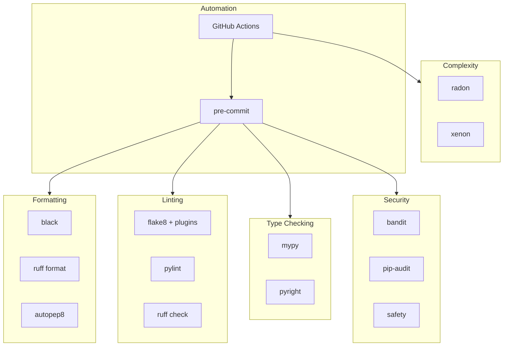
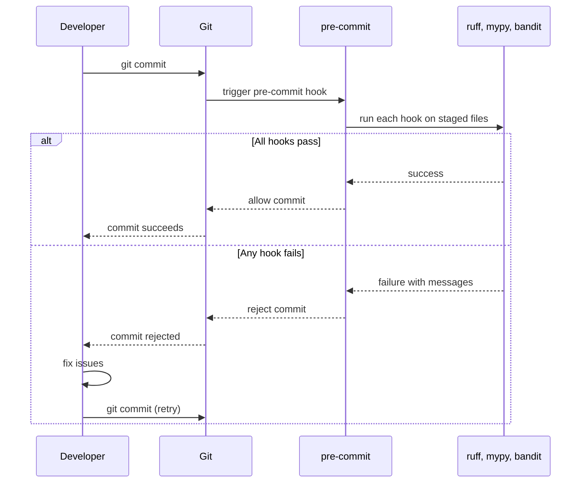
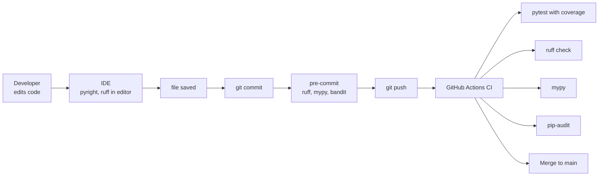

# Code Quality Tools — Linters, Formatters, Type Checkers, and the Pipeline That Runs Them

> [!info] Chapter 28 — Software Engineering Practices, Note 4
> Follows [[3. SOLID Principles]]. Continues with [[5. Documentation]]. Cross-references [[11. Type Hinting/5. mypy and pyright]], [[12. Testing/6. Coverage and CI]], and [[7. Modules and Packages/4. pyproject.toml and Packaging]].

## Why This Matters

Human reviewers catch logic bugs and design issues. They are terrible at catching style violations, unused imports, missing type annotations, and security anti-patterns — these are mechanical checks that a machine can do in milliseconds. Automating them frees human reviewers to focus on what humans are good at.

A modern Python project should have, at minimum:

- A **formatter** that enforces a consistent visual style (so reviewers do not argue about whitespace).
- A **linter** that catches bugs, anti-patterns, and style issues the formatter cannot fix.
- A **type checker** that catches type errors before runtime.
- A **security scanner** that flags known vulnerabilities.
- A **complexity meter** that flags functions and classes that have grown too complex.
- A **`pre-commit`** setup that runs all of these automatically before each commit.

The Python tooling ecosystem has consolidated dramatically in recent years. `ruff` has largely replaced `flake8`, `pylint`, `isort`, and `pyupgrade` for new projects. `black` is the dominant formatter. `mypy` and `pyright` are the dominant type checkers. This note covers the modern stack.

## Background — The Python Tooling Landscape (2020-2024)

The Python tooling landscape evolved rapidly:

- **2010s** — `flake8` (linting), `pylint` (deeper analysis), `black` (formatting), `isort` (import sorting), `mypy` (type checking) were the standard stack.
- **2020** — `pyright` (Microsoft, TypeScript-quality type checker) emerged as a faster, more accurate alternative to `mypy`.
- **2022** — `ruff` (Astral, Rust-based) emerged as a 100× faster replacement for `flake8`, `isort`, `pyupgrade`, and many `flake8` plugins. It also added a formatter that replaces `black`.
- **2023** — `ruff` reached maturity. Most new projects adopt `ruff` as their one-stop linting and formatting tool.

Today's recommendation:

- **`ruff`** for linting and formatting (replaces `flake8`, `isort`, `pyupgrade`, `black`).
- **`mypy`** or **`pyright`** for type checking.
- **`bandit`** for security scanning.
- **`pre-commit`** to run all of these automatically.
- **`radon`** / **`xenon`** for complexity metrics (optional).

## Main Content

### 1. Formatters

A formatter rewrites your code to a canonical style. The goal is to eliminate style debates — code looks the same regardless of who wrote it.

#### `black`

`black` is the dominant Python formatter. Its tagline is "The Uncompromising Code Formatter" — it has very few options and enforces a single canonical style.

```bash
pip install black
black src/ tests/
```

`black` reformats files in place. Configuration in `pyproject.toml`:

```toml
[tool.black]
line-length = 100
target-version = ["py310", "py311", "py312"]
```

`black`'s opinionated style includes:

- Double quotes for strings.
- Trailing commas in multi-line collections.
- Specific spacing around operators.

#### `blue`

`blue` is a fork of `black` with a few different defaults (single quotes, no trailing commas). It is rarely used today.

#### `autopep8`

`autopep8` is an older formatter that fixes PEP 8 violations. It is less aggressive than `black` — it only fixes things that are technically PEP 8 violations. Largely superseded by `black` and `ruff format`.

#### `ruff format`

`ruff format` is a drop-in replacement for `black`, written in Rust. It is 30× faster and produces nearly identical output. For new projects, `ruff format` is the recommendation.

```toml
[tool.ruff]
line-length = 100

[tool.ruff.format]
quote-style = "double"
indent-style = "space"
```

```bash
ruff format src/ tests/
```

### 2. Linters

A linter analyzes code for bugs, anti-patterns, style violations, and other issues without rewriting it. It reports problems; you fix them.

#### `flake8`

`flake8` was the standard linter for a decade. It wraps:

- `pyflakes` — finds undefined names, unused imports, syntax errors.
- `pycodestyle` — checks PEP 8 style.
- ` McCabe` — checks cyclomatic complexity.

Plus hundreds of plugins (`flake8-bugbear`, `flake8-comprehensions`, etc.). Configuration in `.flake8` or `setup.cfg`:

```ini
[flake8]
max-line-length = 100
extend-ignore = E203, W503
exclude = .git,__pycache__,build,dist
```

#### `pylint`

`pylint` does deeper static analysis than `flake8`. It catches:

- More bug patterns (e.g., `pylint` will warn if you reassign a built-in name).
- Code smells (too many public methods, too few public methods, etc.).
- Duplicate code.
- Missing docstrings (configurable).

`pylint` is more configurable but also more verbose. It tends to produce many warnings that are not actionable, which has led to its decline. Configuration in `pyproject.toml`:

```toml
[tool.pylint.main]
disable = [
    "missing-module-docstring",
    "too-few-public-methods",
]
max-line-length = 100
```

#### `ruff`

`ruff` is the modern replacement for `flake8`, `isort`, `pyupgrade`, `pydocstyle`, and dozens of plugins. It is written in Rust and is 100× faster than `flake8`. It also has a formatter (`ruff format`) that replaces `black`.

```bash
pip install ruff
ruff check src/ tests/
ruff check --fix src/ tests/  # auto-fix where possible
ruff format src/ tests/       # format like black
```

Configuration in `pyproject.toml`:

```toml
[tool.ruff]
line-length = 100
target-version = "py310"
src = ["src", "tests"]
exclude = ["build", "dist", ".venv"]

[tool.ruff.lint]
select = [
    "E",    # pycodestyle errors
    "W",    # pycodestyle warnings
    "F",    # pyflakes
    "I",    # isort
    "B",    # flake8-bugbear
    "C4",   # flake8-comprehensions
    "UP",   # pyupgrade
    "N",    # pep8-naming
    "SIM",  # flake8-simplify
    "TCH",  # flake8-type-checking
    "RUF",  # ruff-specific
]
ignore = [
    "E501",  # line too long (handled by formatter)
]

[tool.ruff.lint.per-file-ignores]
"tests/*" = ["S101"]  # allow asserts in tests

[tool.ruff.format]
quote-style = "double"
```

`ruff` is the recommendation for new projects. It replaces `flake8` + `isort` + `pyupgrade` + `black` with a single tool.

### 3. Type Checkers

A type checker uses the type annotations in your code to catch type errors at static analysis time, before runtime. See [[11. Type Hinting/1. Basic Type Hints]] for the annotation syntax.

#### `mypy`

`mypy` is the original Python type checker, developed at Dropbox. It is the reference implementation of PEP 484.

```bash
pip install mypy
mypy src/
```

Configuration in `pyproject.toml`:

```toml
[tool.mypy]
python_version = "3.10"
strict = true
warn_return_any = true
warn_unused_ignores = true
disallow_untyped_defs = true

[[tool.mypy.overrides]]
module = "third_party_lib.*"
ignore_missing_imports = true
```

`strict = true` enables all the strict checks: disallow untyped functions, disallow `Any`, require `Optional` for `None` defaults, etc. For a new project, start with `strict = true` and add overrides as needed.

#### `pyright`

`pyright` is Microsoft's type checker, written in TypeScript. It is faster than `mypy` and catches some bugs `mypy` misses. It is the type checker used by VS Code's Python extension (via Pylance).

```bash
npm install -g pyright
pyright src/
```

Configuration in `pyproject.toml` (via `[tool.pyright]`) or `pyrightconfig.json`:

```json
{
    "typeCheckingMode": "strict",
    "pythonVersion": "3.10",
    "include": ["src"],
    "exclude": ["**/__pycache__"]
}
```

For new projects, `pyright` is increasingly recommended over `mypy`. It is faster and more accurate, though `mypy` has better support for some advanced features (plugins, semantic analysis).

### 4. Security Scanners

#### `bandit`

`bandit` scans Python code for common security issues: `eval`/`exec` usage, `pickle.loads` on untrusted data, hardcoded passwords, weak crypto, etc.

```bash
pip install bandit
bandit -r src/
```

Configuration in `pyproject.toml`:

```toml
[tool.bandit]
exclude_dirs = ["tests"]
tests = ["B101", "B102"]  # only run specific checks
skips = ["B311"]          # skip random-for-crypto warning in tests
```

`bandit` produces a list of findings with severity (low/medium/high) and confidence. Each finding includes a description and a link to the docs.

#### `pip-audit`

`pip-audit` scans your dependencies for known vulnerabilities (CVEs) using the PyPI advisory database.

```bash
pip install pip-audit
pip-audit
```

It compares your installed packages against the OSV (Open Source Vulnerabilities) database and reports any with known CVEs. Run it in CI on every dependency update.

#### `safety`

`safety` is a commercial alternative to `pip-audit`. It uses a proprietary database (the free version is limited). For most open-source projects, `pip-audit` is sufficient.

### 5. Complexity Metrics

#### `radon`

`radon` computes several code metrics:

- **Cyclomatic complexity** — how many independent paths through a function. Higher = harder to test.
- **Halstead complexity** — based on operator and operand counts.
- **Maintainability index** — a composite score.
- **Raw metrics** — LOC, comment ratio, etc.

```bash
pip install radon
radon cc src/ -a        # cyclomatic complexity, average
radon mi src/           # maintainability index
radon raw src/          # raw metrics
```

Cyclomatic complexity grades:

| Grade | Complexity | Meaning |
|---|---|---|
| A | 1-5 | Simple |
| B | 6-10 | Well-structured |
| C | 11-15 | Slightly complex |
| D | 16-20 | Complex |
| E | 21-25 | Very complex |
| F | 26+ | Untestable, refactor |

Aim for grade A or B for most functions. Grade D and above warrants a refactor.

#### `xenon`

`xenon` is a thin wrapper around `radon` that fails CI if complexity exceeds a threshold.

```bash
pip install xenon
xenon --max-absolute C --max-modules A --max-average A src/
```

### 6. `pre-commit` — The Automation Framework

`pre-commit` is a framework for managing and running Git pre-commit hooks. It installs the tools in isolated environments, runs them on the staged files, and fails the commit if any tool reports issues.

```bash
pip install pre-commit
pre-commit install     # install the git hook
```

Configuration in `.pre-commit-config.yaml`:

```yaml
repos:
  - repo: https://github.com/astral-sh/ruff-pre-commit
    rev: v0.5.0
    hooks:
      - id: ruff
        args: [--fix]
      - id: ruff-format

  - repo: https://github.com/pre-commit/mirrors-mypy
    rev: v1.10.0
    hooks:
      - id: mypy
        additional_dependencies: [pydantic, types-requests]

  - repo: https://github.com/PyCQA/bandit
    rev: 1.7.9
    hooks:
      - id: bandit
        args: [-ll]  # only high severity

  - repo: https://github.com/pre-commit/pre-commit-hooks
    rev: v4.6.0
    hooks:
      - id: trailing-whitespace
      - id: end-of-file-fixer
      - id: check-yaml
      - id: check-added-large-files
      - id: check-merge-conflict
      - id: debug-statements
```

Now every `git commit` runs `ruff`, `mypy`, `bandit`, and basic checks on the staged files. If any check fails, the commit is rejected. The developer fixes the issues and re-commits.

```bash
# Run manually on all files
pre-commit run --all-files

# Update hook versions
pre-commit autoupdate
```

### 7. Mermaid — Code Quality Tool Ecosystem



### 8. Mermaid — Pre-commit Hook Flow



### 9. Mermaid — Where Each Tool Runs in the Pipeline



### 10. The CI Pipeline

A typical GitHub Actions workflow runs all tools on every push:

```yaml
name: CI
on: [push, pull_request]

jobs:
  lint:
    runs-on: ubuntu-latest
    steps:
      - uses: actions/checkout@v4
      - uses: actions/setup-python@v5
        with:
          python-version: "3.12"
      - run: pip install ruff mypy
      - run: ruff check src tests
      - run: ruff format --check src tests
      - run: mypy src

  test:
    runs-on: ubuntu-latest
    strategy:
      matrix:
        python-version: ["3.10", "3.11", "3.12"]
    steps:
      - uses: actions/checkout@v4
      - uses: actions/setup-python@v5
        with:
          python-version: ${{ matrix.python-version }}
      - run: pip install -e ".[dev]"
      - run: pytest --cov=src --cov-report=xml
      - uses: codecov/codecov-action@v4

  security:
    runs-on: ubuntu-latest
    steps:
      - uses: actions/checkout@v4
      - uses: actions/setup-python@v5
        with:
          python-version: "3.12"
      - run: pip install bandit pip-audit
      - run: bandit -r src -ll
      - run: pip-audit
```

## Code Examples

### A complete `pyproject.toml` with tool config

```toml
[build-system]
requires = ["setuptools>=64", "wheel"]
build-backend = "setuptools.build_meta"

[project]
name = "my-package"
version = "1.0.0"
requires-python = ">=3.10"

[tool.setuptools.packages.find]
where = ["src"]

[tool.ruff]
line-length = 100
target-version = "py310"
src = ["src", "tests"]

[tool.ruff.lint]
select = ["E", "W", "F", "I", "B", "C4", "UP", "N", "SIM", "RUF"]
ignore = ["E501"]

[tool.ruff.lint.per-file-ignores]
"tests/*" = ["S101"]

[tool.ruff.format]
quote-style = "double"

[tool.mypy]
python_version = "3.10"
strict = true
warn_return_any = true
warn_unused_ignores = true
disallow_untyped_defs = true

[[tool.mypy.overrides]]
module = "third_party_lib.*"
ignore_missing_imports = true

[tool.pytest.ini_options]
testpaths = ["tests"]
addopts = "--strict-markers --cov=src/my_package --cov-report=term-missing"

[tool.bandit]
exclude_dirs = ["tests"]
skips = ["B101"]

[tool.coverage.run]
source = ["src"]
omit = ["*/tests/*"]
```

### A `.pre-commit-config.yaml` for a modern project

```yaml
repos:
  - repo: https://github.com/pre-commit/pre-commit-hooks
    rev: v4.6.0
    hooks:
      - id: trailing-whitespace
      - id: end-of-file-fixer
      - id: check-yaml
      - id: check-toml
      - id: check-added-large-files
      - id: check-merge-conflict
      - id: debug-statements
      - id: mixed-line-ending

  - repo: https://github.com/astral-sh/ruff-pre-commit
    rev: v0.5.0
    hooks:
      - id: ruff
        args: [--fix, --exit-non-zero-on-fix]
      - id: ruff-format

  - repo: https://github.com/pre-commit/mirrors-mypy
    rev: v1.10.0
    hooks:
      - id: mypy
        additional_dependencies:
          - pydantic>=2.0
          - types-requests
        args: [--strict]

  - repo: https://github.com/PyCQA/bandit
    rev: 1.7.9
    hooks:
      - id: bandit
        args: [-ll, -r, src/]
```

### Enforcing type hints incrementally

For an existing codebase that has no type hints, adopting `mypy --strict` all at once is impractical. Use `mypy`'s incremental mode:

```toml
[tool.mypy]
python_version = "3.10"
# Start permissive, tighten over time
disallow_untyped_defs = false
warn_return_any = false
ignore_missing_imports = true
files = ["src/my_package"]

# Strict-check new modules
[[tool.mypy.overrides]]
module = "my_package.new_module.*"
strict = true
```

Run `mypy` in CI and gradually tighten the config. Tools like `flake8-type-checking` and `mypy --strict-by-default` can help.

### Using `ruff` to auto-fix issues

```bash
$ ruff check src/
src/my_package/utils.py:10:1: F401 [*] `os` imported but unused
src/my_package/utils.py:15:5: E722 Do not use bare except
src/my_package/core.py:25:80: E501 Line too long (95 > 79)

$ ruff check --fix src/
Found 3 errors.
[*] 1 fixable with the --fix option.
Fixed 1 error.

$ ruff check src/
src/my_package/utils.py:15:5: E722 Do not use bare except
src/my_package/core.py:25:80: E501 Line too long (95 > 79)
```

### Coverage gates in CI

```yaml
# .github/workflows/ci.yml
- name: Run tests with coverage
  run: pytest --cov=src/my_package --cov-fail-under=80

- name: Upload coverage
  uses: codecov/codecov-action@v4
  if: always()
```

`--cov-fail-under=80` makes the test step fail if coverage drops below 80%.

## Common Pitfalls

> [!danger] Not running tools in CI
> `pre-commit` only catches issues on commits the developer makes locally. If a contributor disables pre-commit (or never installs it), broken code can be pushed. Always run the tools in CI too.

> [!danger] Too many `# type: ignore` comments
> Each `# type: ignore` is a hole in your type checking. Investigate each one — most indicate either a real bug or a missing type annotation in a third-party library. `mypy`'s `warn_unused_ignores = true` flags ignores that are no longer needed.

> [!danger] Running linters on generated code
> Auto-generated code (protobuf bindings, dataclass schemas, Cython output) should be excluded from linting. Configure `exclude` in your tools.

> [!danger] Using `# noqa` to suppress warnings instead of fixing them
> `# noqa` should be a last resort, not a routine tool. If a linter is noisy, configure it to ignore specific rules project-wide, not to suppress each occurrence.

> [!danger] Disabling `mypy` strict mode project-wide
> Strict mode catches real bugs. If a few modules need permissive checking, override per-module — do not relax the project-wide config.

> [!danger] Mixing `black` and `ruff format`
> They produce nearly identical output but not always exactly identical. Pick one and use it consistently.

> [!danger] Not pinning tool versions in CI
> A new release of `ruff` may introduce new rules that fail your CI unexpectedly. Pin the tool versions in `requirements-dev.txt` or use `pre-commit autoupdate` deliberately.

> [!danger] Forgetting `pre-commit install` on a new clone
> `pre-commit install` sets up the git hook. New contributors who skip this step do not get the checks. Document it in `CONTRIBUTING.md`.

> [!danger] Over-configuring `pylint`
> `pylint` has hundreds of options. Resist the urge to tweak each one. Start with a sane default (e.g., the Google style config) and only deviate when necessary.

> [!danger] Running tools on tests with the same rules as production
> Tests often legitimately use `assert`, magic numbers, and bare `except:`. Use per-file ignores (`[tool.ruff.lint.per-file-ignores]`) to relax rules in `tests/`.

## Tips and Tricks

- **Use `ruff` for everything it can do.** It replaces `flake8`, `isort`, `pyupgrade`, `black`, `pydocstyle`, and dozens of plugins. One tool, one config, 100× faster.
- **Use `mypy` or `pyright` for type checking.** Pick one — `pyright` is faster, `mypy` has more plugins.
- **Run tools in both pre-commit and CI.** Pre-commit catches issues early; CI is the source of truth.
- **Pin tool versions.** Reproducible CI requires pinning. Use `pip-compile` or `uv pip compile` to produce a lockfile.
- **Use `pre-commit autoupdate` quarterly** to pick up new tool versions and new lint rules.
- **Configure per-file ignores for tests.** Tests often need `assert`, long lines, magic numbers.
- **Use `ruff check --fix` to auto-fix issues.** Many rules (unused imports, sorting, modernisation) are auto-fixable.
- **Use `mypy --strict` from day one.** Adopting strict typing later is painful. Starting strict is easy.
- **For an existing codebase, adopt mypy incrementally.** Start permissive, tighten per-module.
- **Use `coverage.py` with `--cov-fail-under`** to enforce a minimum coverage in CI.
- **Use `codecov` or `coveralls`** to track coverage over time and surface regressions in pull requests.
- **For security, run both `bandit` (your code) and `pip-audit` (your dependencies).** They catch different things.
- **Add `dependabot`** to your GitHub repo to automatically open PRs when dependencies have security updates.
- **Use `radon` to track complexity over time.** A function whose complexity is creeping up is a refactoring candidate.
- **For monorepos, configure each tool to scan only the affected package** to keep CI fast.
- **Read the `ruff` rules documentation.** Each rule has a clear explanation and example. Knowing what each rule catches makes you a better Python programmer.
- **Use `pyproject.toml` for all configuration.** Centralising config in one file is cleaner than scattering `.flake8`, `mypy.ini`, `setup.cfg`, etc.

## Active Recall

> [!question] What does `ruff` replace in a modern Python project?
>> [!success]- Answer
>> `ruff` replaces `flake8` (linting), `isort` (import sorting), `pyupgrade` (modernisation), `pydocstyle` (docstring checks), `black` (formatting, via `ruff format`), and dozens of `flake8` plugins. It is written in Rust and is 100× faster than the equivalent `flake8` setup.

> [!question] What is the difference between `black` and `ruff format`?
>> [!success]- Answer
>> They produce nearly identical output. `ruff format` is a drop-in replacement for `black` written in Rust, ~30× faster. For new projects, `ruff format` is recommended because it integrates with the linter (`ruff check`) — one tool, one config.

> [!question] What does `mypy --strict` enable?
>> [!success]- Answer
>> All strict checks: `disallow_untyped_defs`, `warn_return_any`, `warn_unused_ignores`, `disallow_any_generics`, `no_implicit_optional`, `strict_equality`, and more. It is the recommended starting point for new projects.

> [!question] Name two type checkers and one advantage of each.
>> [!success]- Answer
>> **`mypy`** — the reference implementation, supports plugins and semantic analysis. **`pyright`** — Microsoft's TypeScript-quality checker, faster than `mypy`, used by VS Code's Pylance extension, more accurate on some constructs.

> [!question] What does `bandit` check for?
>> [!success]- Answer
>> Common security issues: `eval`/`exec` usage, `pickle.loads` on untrusted data, hardcoded passwords, weak crypto (MD5, DES), `subprocess` with `shell=True`, SQL injection patterns, and many others. It reports findings with severity and confidence levels.

> [!question] What is `pip-audit` for?
>> [!success]- Answer
>> It scans your installed Python packages against the OSV (Open Source Vulnerabilities) database and reports any with known CVEs. Run it in CI on every dependency update to catch vulnerable dependencies.

> [!question] What does `pre-commit` do?
>> [!success]- Answer
>> It is a framework for managing Git pre-commit hooks. It installs the configured tools (ruff, mypy, bandit, etc.) in isolated environments, runs them on staged files when you `git commit`, and rejects the commit if any tool fails. Configuration is in `.pre-commit-config.yaml`.

> [!question] What is cyclomatic complexity and what tool measures it in Python?
>> [!success]- Answer
>> Cyclomatic complexity is the number of independent paths through a function — a measure of testability. A function with no `if`/`for`/`while` has complexity 1; each branch adds 1. `radon` measures it (and `xenon` enforces thresholds). Aim for grade A (1-5) or B (6-10).

> [!question] Why run tools in CI as well as pre-commit?
>> [!success]- Answer
>> Pre-commit only runs if the developer has installed it (`pre-commit install`). Contributors who skip this step can push broken code. CI is the source of truth — it runs the same checks on every push, regardless of local setup.

> [!question] Why is `# type: ignore` a code smell?
>> [!success]- Answer
>> Each `# type: ignore` is a hole in type checking — a place where `mypy` would have flagged an issue but you suppressed it. Most indicates either a real bug or a missing type annotation in a third-party library. `warn_unused_ignores = true` flags ignores that are no longer needed (often after the third-party library adds types).

> [!question] What is the recommended configuration location for modern Python tools?
>> [!success]- Answer
>> `pyproject.toml` — under `[tool.ruff]`, `[tool.mypy]`, `[tool.pytest.ini_options]`, `[tool.bandit]`, etc. Centralising in one file is cleaner than scattering `.flake8`, `mypy.ini`, `setup.cfg`, etc.

## Next Steps

- Continue to [[5. Documentation]] for documenting well-tested, well-typed code.
- Cross-reference [[11. Type Hinting/5. mypy and pyright]] for the type checker deep dive.
- Cross-reference [[12. Testing/6. Coverage and CI]] for coverage measurement and CI integration.
- Cross-reference [[7. Modules and Packages/4. pyproject.toml and Packaging]] for the configuration file.
- Read the `ruff` documentation at https://docs.astral.sh/ruff/ for the full rule list.
- Read the `mypy` documentation at https://mypy.readthedocs.io/ for type checker features.
- Read the `pre-commit` documentation at https://pre-commit.com/ for hook configuration.
- Watch "Write better Python code" by Anthony Sottile (flake8 maintainer) for practical advice.
