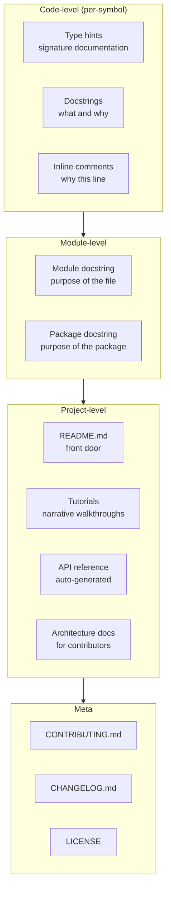
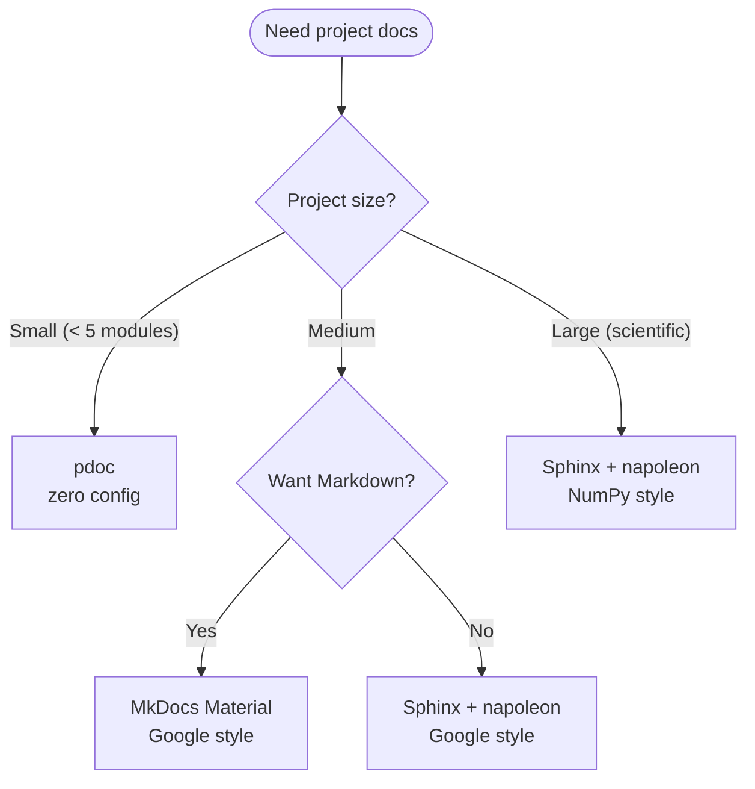
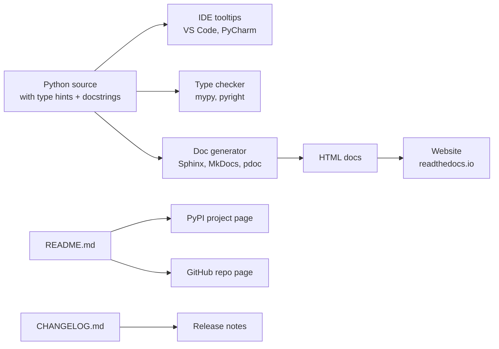

# Documentation — Docstrings, Type Hints, and Project-Level Docs That Age Well

> [!info] Chapter 28 — Software Engineering Practices, Note 5 (final)
> Follows [[4. Code Quality Tools]]. Cross-references [[1. Python Fundamentals/6. Comments and Documentation]], [[11. Type Hinting/1. Basic Type Hints]], [[7. Modules and Packages/4. pyproject.toml and Packaging]], and [[21. Packaging and Distribution/2. Publishing Packages]].

## Why This Matters

Undocumented code is a liability. Code that does not explain *why* it exists forces every future reader — including you, six months from now — to reverse-engineer the author's intent. The cost compounds: a function with no docstring gets used incorrectly, the incorrect usage becomes load-bearing in another module, and the bug surfaces months later in production.

Documentation has multiple audiences:

- **Users** of your library read the README, the API reference, and the tutorials. They want to know "how do I do X?".
- **Contributors** read the CONTRIBUTING guide, the architecture docs, and the code comments. They want to know "how do I change X without breaking Y?".
- **Future you** reads the docstrings and inline comments. You want to know "why did I write this?".
- **Tools** — IDEs, type checkers, documentation generators — consume docstrings and type hints to provide tooltips, autocompletion, and generated reference docs.

Good documentation serves all four. This note covers the layers of documentation, the conventions (PEP 257, NumPy, Google styles), the tooling (Sphinx, MkDocs, pdoc), and the file conventions (README, CHANGELOG, CONTRIBUTING).

## Background — The Documentation Pyramid

Documentation exists in layers, from most-local to most-global:

1. **Type hints** — the most local documentation. `def f(x: int) -> str:` tells the reader (and the IDE, and the type checker) the function's signature.
2. **Docstrings** — the next layer. A few sentences per function/class explaining what it does, what its parameters mean, and what it returns.
3. **Inline comments** — explain *why* a particular line or block does what it does. Reserved for non-obvious code.
4. **Module docstrings** — at the top of each module, a paragraph explaining the module's purpose.
5. **Package README** — the front door of the project. What it is, how to install, how to use.
6. **Tutorials** — narrative walkthroughs that teach the API.
7. **API reference** — auto-generated from docstrings, listing every public class and function.
8. **Architecture docs** — for contributors, explaining the system's structure and design decisions.
9. **CONTRIBUTING.md** — how to set up a development environment and submit changes.
10. **CHANGELOG.md** — what changed in each release.

A modern Python project should have all of these, though small projects can collapse several into the README.

## Main Content

### 1. PEP 257 — Docstring Conventions

PEP 257 defines Python's docstring conventions:

- **Module, function, class, and method docstrings** are the first statement in their body, as a string literal.
- **Multi-line docstrings** start with a summary line, followed by a blank line, followed by the detailed description.
- **The summary line** should fit on one line and use the imperative mood ("Return the average of `numbers`.", not "Returns the average...").
- **Class docstrings** document the class's purpose, its attributes, and its behaviour.
- **`__init__` docstrings** are optional — the class docstring should cover initialisation.

```python
def average(numbers: list[float]) -> float:
    """Return the arithmetic mean of `numbers`.

    Args:
        numbers: A non-empty sequence of floats.

    Returns:
        The arithmetic mean.

    Raises:
        ValueError: If `numbers` is empty.
    """
    if not numbers:
        raise ValueError("numbers must not be empty")
    return sum(numbers) / len(numbers)
```

### 2. Docstring Styles

There are three popular docstring styles. They differ in how they format parameters, returns, and exceptions. Pick one and use it consistently.

#### Google style

```python
def fetch_url(url: str, timeout: int = 10) -> str:
    """Fetch the content at `url` and return it as a string.

    A longer description goes here, after a blank line. It can span
    multiple lines.

    Args:
        url: The URL to fetch.
        timeout: Timeout in seconds. Defaults to 10.

    Returns:
        The response body as a string.

    Raises:
        ConnectionError: If the connection fails.
        TimeoutError: If the request times out.
    """
    ...
```

The Google style is compact and reads well as plain text. It is supported by Sphinx (via the `napoleon` extension) and MkDocs (via `mkdocstrings`).

#### NumPy style

```python
def fetch_url(url: str, timeout: int = 10) -> str:
    """
    Fetch the content at `url` and return it as a string.

    A longer description goes here, after a blank line. It can span
    multiple lines.

    Parameters
    ----------
    url : str
        The URL to fetch.
    timeout : int, optional
        Timeout in seconds. Default is 10.

    Returns
    -------
    str
        The response body as a string.

    Raises
    ------
    ConnectionError
        If the connection fails.
    TimeoutError
        If the request times out.
    """
    ...
```

The NumPy style is more verbose, with underlined section headers. It is the standard in scientific Python (NumPy, SciPy, pandas, scikit-learn). It is also supported by Sphinx `napoleon` and `mkdocstrings`.

#### reStructuredText (Sphinx default)

```python
def fetch_url(url: str, timeout: int = 10) -> str:
    """Fetch the content at `url` and return it as a string.

    A longer description goes here, after a blank line. It can span
    multiple lines.

    :param url: The URL to fetch.
    :param timeout: Timeout in seconds. Defaults to 10.
    :returns: The response body as a string.
    :raises ConnectionError: If the connection fails.
    :raises TimeoutError: If the request times out.
    """
    ...
```

This is the original Sphinx style. It is verbose and not as readable as plain text. Use Google or NumPy style with `napoleon` instead.

#### Recommendation

For a new project:

- **Google style** for general-purpose Python (web apps, CLIs, libraries).
- **NumPy style** for scientific Python (data analysis, ML, numerical code).

### 3. Type Hints as Documentation

Type hints are executable documentation. They are checked by `mypy`/`pyright`, displayed by IDEs as tooltips, and used by documentation generators. A function with type hints is largely self-documenting for its signature:

```python
# Without type hints — the reader has to guess
def process(data, options=None):
    ...

# With type hints — the signature is the documentation
def process(
    data: list[dict[str, Any]],
    options: ProcessOptions | None = None,
) -> ProcessResult:
    ...
```

See [[11. Type Hinting/1. Basic Type Hints]] for the full syntax. The docstring then focuses on *what* the function does and *why*, not on the types of its parameters.

### 4. Module and Package Docstrings

Every module should start with a docstring explaining its purpose:

```python
"""User authentication and session management.

This module provides the `AuthService` class, which handles login,
logout, and session validation. It depends on `UserRepository` for
persistence and `TokenService` for JWT generation.
"""

from abc import ABC, abstractmethod
# ...
```

Package-level docstrings go in `__init__.py`:

```python
"""My Package: a short description of what the package does.

Longer description if needed, including a high-level overview of
the public API.
"""

from my_package.core import MyClass, my_function

__version__ = "1.0.0"
__all__ = ["MyClass", "my_function", "__version__"]
```

### 5. Documentation Generators

#### Sphinx

Sphinx is the traditional Python documentation tool. It supports reStructuredText (`.rst`) by default and Markdown via `myst-parser`. It is used by CPython, NumPy, pandas, requests, and most major libraries.

```
docs/
├── conf.py             # Sphinx configuration
├── index.rst           # entry point
├── installation.rst
├── usage.rst
├── api.rst             # auto-generated API reference
├── _static/
└── Makefile
```

`conf.py` enables extensions and themes:

```python
# docs/conf.py
project = "My Package"
extensions = [
    "sphinx.ext.autodoc",        # auto-generate from docstrings
    "sphinx.ext.napoleon",       # Google/NumPy style support
    "sphinx.ext.typehints",      # include type hints
    "sphinx.ext.intersphinx",    # cross-references to other docs
    "myst_parser",               # Markdown support
]
html_theme = "furo"  # modern theme
```

`api.rst` declares which modules to document:

```rst
API Reference
=============

.. automodule:: my_package.core
   :members:
.. automodule:: my_package.utils
   :members:
```

Build with `sphinx-build docs docs/_build/html`.

#### MkDocs

MkDocs is a simpler, Markdown-native alternative. It is used by FastAPI, Typer, and many newer projects. The `mkdocs-material` theme is the modern default — beautiful, responsive, with search.

```yaml
# mkdocs.yml
site_name: My Package
theme:
  name: material
  features:
    - navigation.tabs
    - navigation.sections
    - search.suggest
    - content.code.copy
plugins:
  - search
  - mkdocstrings:
      handlers:
        python:
          options:
            docstring_style: google
            show_source: true
            show_signature_annotations: true
markdown_extensions:
  - admonition
  - pymdownx.highlight:
      anchor_linenums: true
  - pymdownx.superfences
nav:
  - Home: index.md
  - Installation: installation.md
  - Usage: usage.md
  - API Reference: api.md
```

```markdown
# API Reference

::: my_package.core
::: my_package.utils
```

Build with `mkdocs build` or serve locally with `mkdocs serve`.

#### pdoc

`pdoc` is the simplest option — zero configuration, just run `pdoc my_package` and it generates HTML from your docstrings. Best for small libraries where you want a quick API reference without setting up Sphinx or MkDocs.

```bash
pip install pdoc
pdoc -o docs/my_package my_package
```

### 6. README.md Best Practices

The README is the front door of your project. A good README has:

1. **Project name and tagline** — one sentence explaining what it is.
2. **Badges** — CI status, version, license, supported Python versions.
3. **Installation** — `pip install my-package`, plus any extras.
4. **Quick start** — a 5-line code example showing the most common use.
5. **Features** — bullet list of what makes the project valuable.
6. **Documentation link** — to the full docs.
7. **License** — name and link.
8. **Contributing** — link to CONTRIBUTING.md.
9. **Changelog** — link to CHANGELOG.md.

```markdown
# My Package

A short description of what this package does.


## Installation

```bash
pip install my-package
```

## Quick start

```python
from my_package import MyClass

obj = MyClass()
result = obj.do_thing()
print(result)
```

## Features

- Fast and memory-efficient.
- Type-hinted for great IDE support.
- No runtime dependencies.

## Documentation

Full docs at https://my-package.readthedocs.io.

## License

MIT — see [LICENSE](LICENSE).

## Contributing

See [CONTRIBUTING.md](CONTRIBUTING.md).
```

### 7. CHANGELOG.md

A changelog records what changed in each release. Use the "Keep a Changelog" format:

```markdown
# Changelog

All notable changes to this project are documented in this file.

The format is based on [Keep a Changelog](https://keepachangelog.com/),
and this project adheres to [Semantic Versioning](https://semver.org/).

## [Unreleased]

## [1.2.0] - 2024-06-15

### Added
- `MyClass.new_method()` for advanced use cases.
- Support for Python 3.12.

### Changed
- `MyClass.do_thing()` now returns a `Result` object instead of a dict.

### Deprecated
- `MyClass.old_method()` is deprecated and will be removed in 2.0.

### Fixed
- Crash when input is an empty list.

### Security
- Patched CVE-2024-1234 in dependency `requests`.

## [1.1.0] - 2024-03-01
...
```

Tools like `setuptools-scm`, `commitizen`, and `release-please` can auto-generate changelogs from git history and conventional commit messages.

### 8. CONTRIBUTING.md

A contributing guide tells new contributors how to set up a development environment and submit changes. It should include:

- How to clone and install in development mode (`pip install -e ".[dev]"`).
- How to run tests (`pytest`).
- How to run linters (`ruff check`, `mypy`).
- How to submit a pull request (branch naming, commit message conventions, CI requirements).
- Coding standards (style guide, type hint requirements, test coverage requirements).

```markdown
# Contributing

Thanks for your interest in contributing! This guide will help you get started.

## Setup

```bash
git clone https://github.com/you/my-package
cd my-package
pip install -e ".[dev]"
pre-commit install
```

## Running tests

```bash
pytest
```

## Running linters

```bash
ruff check src tests
mypy src
```

## Submitting a pull request

1. Fork the repo and create a branch: `git checkout -b my-feature`.
2. Make your changes. Add tests for any new functionality.
3. Ensure all checks pass: `pytest`, `ruff check`, `mypy`.
4. Commit with a clear message. We use [Conventional Commits](https://www.conventionalcommits.org/).
5. Open a pull request. CI will run automatically.

## Coding standards

- All public functions and classes must have type hints and docstrings.
- Tests must cover new code (aim for >90% coverage on changed lines).
- Follow the existing code style (enforced by `ruff`).
```

### 9. Mermaid — Documentation Layers



### 10. Mermaid — Documentation Tooling Decision Tree



### 11. Mermaid — How Documentation Is Consumed



## Code Examples

### A well-documented function

```python
from typing import Optional
from dataclasses import dataclass


@dataclass
class ProcessResult:
    """The result of processing a request.

    Attributes:
        success: Whether the processing succeeded.
        data: The processed data, if any.
        error: An error message, if processing failed.
    """
    success: bool
    data: Optional[dict] = None
    error: Optional[str] = None


def process_request(
    request: dict,
    *,
    timeout: float = 30.0,
    retry_count: int = 3,
) -> ProcessResult:
    """Process a request and return the result.

    The function attempts to process `request` up to `retry_count` times,
    with `timeout` seconds per attempt. If all attempts fail, the result
    has `success=False` and `error` set to the last error message.

    Args:
        request: The request payload. Must contain a "type" key.
        timeout: Timeout in seconds per attempt. Defaults to 30.0.
        retry_count: Maximum number of attempts. Defaults to 3.

    Returns:
        A `ProcessResult` indicating success or failure.

    Raises:
        ValueError: If `request` does not contain a "type" key.
        TypeError: If `request` is not a dict.

    Example:
        >>> result = process_request({"type": "ping"})
        >>> result.success
        True

    Note:
        This function is thread-safe but not async-safe. For async
        usage, see `process_request_async`.
    """
    if not isinstance(request, dict):
        raise TypeError(f"request must be a dict, got {type(request).__name__}")
    if "type" not in request:
        raise ValueError("request must contain a 'type' key")

    # Implementation omitted
    ...
```

### Auto-generating API docs with `mkdocstrings`

`mkdocs.yml`:

```yaml
site_name: My Package
theme:
  name: material
plugins:
  - mkdocstrings:
      handlers:
        python:
          options:
            docstring_style: google
            show_source: true
            show_signature_annotations: true
            separate_signature: true
            show_root_heading: true
            members_order: source
            filters:
              - "!^_"
              - "^__init__$"
```

`docs/api.md`:

```markdown
# API Reference

::: my_package.core
::: my_package.utils
::: my_package.cli
```

Now `mkdocs build` produces a complete API reference from your docstrings, with type hints, signatures, and source links.

### Sphinx with autodoc and napoleon

`docs/conf.py`:

```python
project = "My Package"
extensions = [
    "sphinx.ext.autodoc",
    "sphinx.ext.napoleon",
    "sphinx.ext.typehints",
    "sphinx.ext.intersphinx",
    "sphinx.ext.viewcode",
]
napoleon_google_docstring = True
napoleon_numpy_docstring = True
autodoc_typehints = "description"
intersphinx_mapping = {
    "python": ("https://docs.python.org/3", None),
    "numpy": ("https://numpy.org/doc/stable/", None),
}
html_theme = "furo"
```

`docs/api.rst`:

```rst
API Reference
=============

.. automodule:: my_package.core
   :members:
   :undoc-members:
   :show-inheritance:

.. automodule:: my_package.utils
   :members:
```

### Using `doctest` to test examples in docstrings

```python
def add(a: int, b: int) -> int:
    """Add two integers.

    >>> add(2, 3)
    5
    >>> add(-1, 1)
    0
    """
    return a + b
```

Run `pytest --doctest-modules src/` or `python -m doctest -v src/my_package/core.py` to execute the examples as tests.

## Common Pitfalls

> [!danger] No docstrings on public APIs
> Every public function, class, and method should have a docstring. At minimum, a one-line summary. Tools like `ruff` (rule `D103`) can enforce this.

> [!danger] Docstrings that just restate the function name
> `def save(self): """Save the object."""` adds no value. Either explain the *how* and *why*, or omit the docstring.

> [!danger] Out-of-date docstrings
> A docstring that contradicts the code is worse than no docstring. When you change a function's behaviour, update the docstring. Code review should catch this.

> [!danger] Documenting types in prose instead of type hints
> "Takes a list of integers and returns a string" should be `def f(xs: list[int]) -> str:`. The type hint is enforced by the type checker; prose is not.

> [!danger] Missing `Raises` section
> If your function raises exceptions, document them. Callers need to know what to catch.

> [!danger] No examples in the docstring
> A short example (`>>>`) shows how to use the function and serves as a doctest. It is the single most useful piece of documentation.

> [!danger] Over-documenting trivial code
> `def __init__(self): """Initialize the object."""` is noise. Skip it.

> [!danger] Sphinx without autodoc
> Maintaining API reference by hand is unsustainable. Use `autodoc` (or `mkdocstrings`) to generate it from docstrings.

> [!danger] README that does not include a quick start
> A README that says "see the docs" without showing a 5-line example forces users to dig. The first code example should be on the README, above the fold.

> [!danger] No CHANGELOG
> Without a changelog, users have to read git log to know what changed. This is unfriendly for library users.

> [!danger] Using `# TODO` without context
> `# TODO: fix this` is useless. `# TODO: replace with O(n) algorithm; current O(n^2) fails for n > 10k (see issue #123)` is useful.

## Tips and Tricks

- **Use Google or NumPy docstring style.** They are readable as plain text and supported by both Sphinx and MkDocs.
- **Use type hints.** They are executable documentation, enforced by type checkers.
- **Generate API docs from docstrings.** Do not hand-write the API reference — `autodoc` and `mkdocstrings` keep it in sync.
- **Include a working example in every public function's docstring.** Use `doctest` to verify it.
- **Document *why*, not *what*.** The code shows what; the docstring explains why.
- **Use the imperative mood in summary lines.** "Return the average" not "Returns the average" or "This function returns the average".
- **Document exceptions.** Callers need to know what to catch.
- **Keep docstrings DRY.** If a class has a `__init__` with parameters, document them in the class docstring, not in `__init__`.
- **Use `.. note::`, `.. warning::`, `.. seealso::` directives** (Sphinx) or admonitions (MkDocs) to call out important information.
- **Cross-reference other documentation with intersphinx.** `:class:`datetime.datetime`` links to the Python docs.
- **Use `readthedocs.io` for free hosting** of your Sphinx or MkDocs docs.
- **Run `doctest` in CI** to catch out-of-date examples.
- **Use `pydoc` to quickly view a module's docs** from the command line: `python -m pydoc my_package.core`.
- **For tutorials, use Jupyter notebooks** rendered with `nbsphinx` or `mkdocs-jupyter`. See [[29. Notebooks and Interactive Computing/1. Jupyter Notebook]].
- **Read PEP 257** for the docstring conventions.
- **Read "Docs for Developers"** by Bhatti, Corleissen, Lambourne, Waters, and Salis for a comprehensive treatment.
- **Look at the FastAPI docs** for an example of excellent MkDocs Material documentation.
- **Look at the NumPy docs** for an example of excellent Sphinx documentation.

## Active Recall

> [!question] What does PEP 257 specify?
>> [!success]- Answer
>> Python's docstring conventions: docstrings are the first statement in a module, function, class, or method; multi-line docstrings start with a one-line summary followed by a blank line and detailed description; class docstrings document the class's purpose and attributes.

> [!question] Name three docstring styles. Which is recommended for new projects?
>> [!success]- Answer
>> (1) **Google style** — compact, readable as plain text, supported by `napoleon` and `mkdocstrings`. (2) **NumPy style** — verbose with underlined section headers, standard in scientific Python. (3) **reStructuredText** — the Sphinx default, verbose, less readable. For new projects: Google style for general-purpose Python, NumPy style for scientific Python.

> [!question] How do type hints function as documentation?
>> [!success]- Answer
>> They are executable documentation of a function's signature. The type checker (`mypy`, `pyright`) enforces them at static analysis time, IDEs display them as tooltips, and documentation generators include them in the API reference. A signature with type hints is largely self-documenting.

> [!question] What is the role of `sphinx.ext.autodoc`?
>> [!success]- Answer
>> It auto-generates API documentation from docstrings. You write `.. automodule:: my_package.core` in your `.rst` file, and Sphinx reads the module's docstrings to produce the API reference. This keeps the docs in sync with the code.

> [!question] What does `sphinx.ext.napoleon` do?
>> [!success]- Answer
>> It enables Sphinx to parse Google-style and NumPy-style docstrings. Without it, Sphinx only understands reStructuredText-style docstrings (`:param x: description`). With it, you can write in the more readable Google or NumPy style.

> [!question] What is `mkdocstrings`?
>> [!success]- Answer
>> The MkDocs equivalent of `sphinx.ext.autodoc` — it auto-generates API documentation from docstrings, with support for Google, NumPy, and reStructuredText styles. Combined with the MkDocs Material theme, it produces beautiful, modern docs from Markdown sources.

> [!question] What sections should a good README have?
>> [!success]- Answer
>> (1) Project name and one-line description. (2) Badges (CI, version, license, Python versions). (3) Installation instructions. (4) Quick start with a 5-line code example. (5) Features bullet list. (6) Link to full documentation. (7) License. (8) Contributing link. (9) Changelog link.

> [!question] What format does "Keep a Changelog" recommend?
>> [!success]- Answer
>> Sections for `Added`, `Changed`, `Deprecated`, `Removed`, `Fixed`, and `Security` under each version. The file starts with an `[Unreleased]` section at the top. Versions follow Semantic Versioning (`MAJOR.MINOR.PATCH`).

> [!question] Why use `doctest`?
>> [!success]- Answer
>> It executes code examples in docstrings as tests. This catches out-of-date examples — if you change a function's behaviour but forget to update the docstring example, the doctest fails. Run with `pytest --doctest-modules`.

> [!question] What is the difference between documenting *what* and documenting *why*?
>> [!success]- Answer
>> "What" is shown by the code itself — the function name, the signature, the implementation. "Why" is the context that is not in the code: the design decision, the trade-off, the bug that prompted the workaround. Good documentation focuses on "why".

> [!question] Name three things every public function's docstring should include.
>> [!success]- Answer
>> (1) A one-line summary in the imperative mood. (2) A description of each parameter (or rely on type hints + a brief note). (3) A description of the return value. (4) The exceptions raised. (5) A working example (`>>>`). At minimum, the summary and the example.

## Next Steps

- Cross-reference [[1. Python Fundamentals/6. Comments and Documentation]] for the basics.
- Cross-reference [[11. Type Hinting/1. Basic Type Hints]] for the type hint syntax.
- Cross-reference [[11. Type Hinting/5. mypy and pyright]] for the type checker.
- Cross-reference [[7. Modules and Packages/4. pyproject.toml and Packaging]] for project configuration.
- Cross-reference [[21. Packaging and Distribution/2. Publishing Packages]] for publishing to PyPI.
- Read PEP 257 (https://peps.python.org/pep-0257/) for the docstring conventions.
- Read "Keep a Changelog" at https://keepachangelog.com/.
- Read Semantic Versioning at https://semver.org/.
- Look at the FastAPI documentation (https://fastapi.tiangolo.com/) for an example of excellent MkDocs Material docs.
- Look at the NumPy documentation (https://numpy.org/doc/) for an example of excellent Sphinx docs.
- This completes Chapter 28 — Software Engineering Practices. Continue to [[29. Notebooks and Interactive Computing/1. Jupyter Notebook]] for the next chapter.
