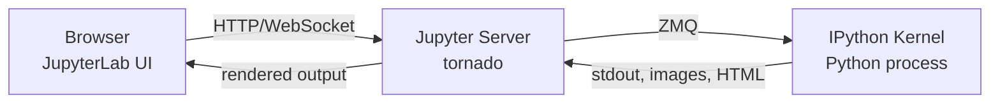
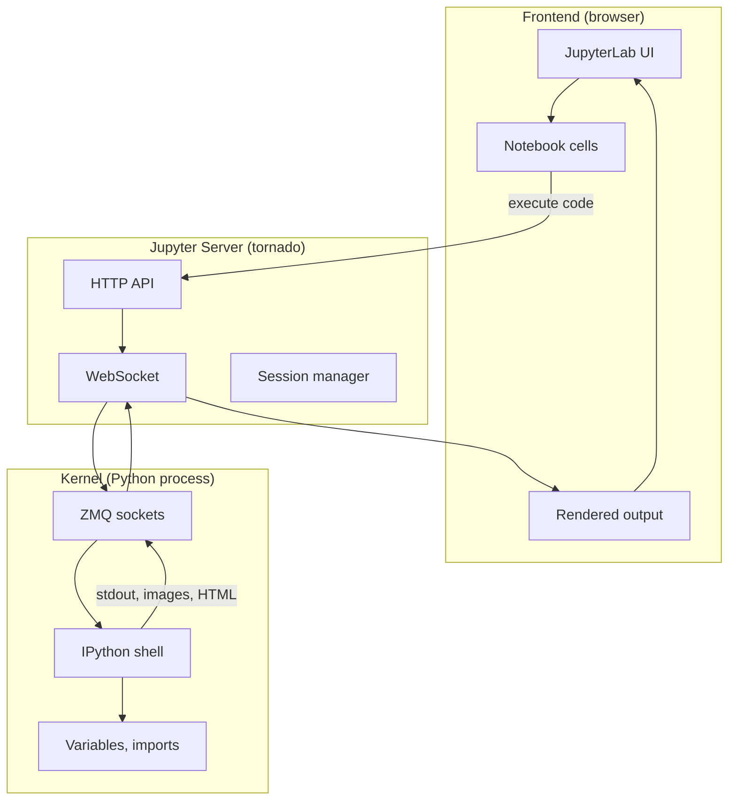
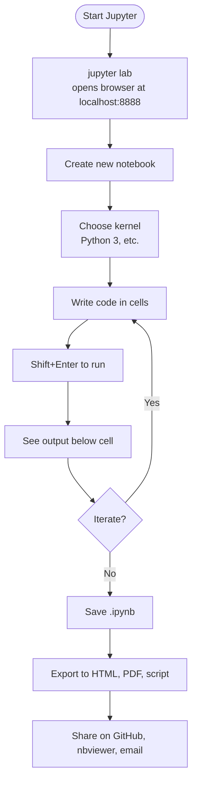
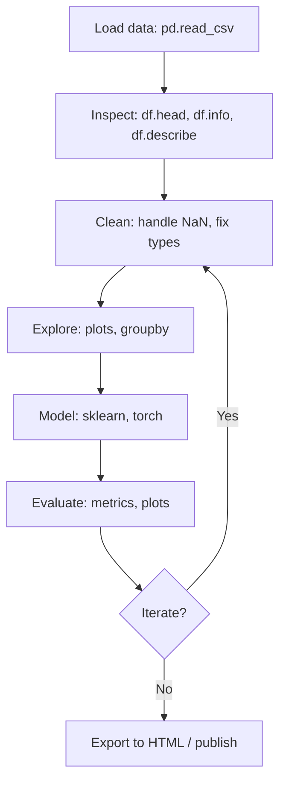

# Jupyter Notebook — Interactive Computing for Python (and Friends)

> [!info] Chapter 29 — Notebooks and Interactive Computing, Note 1
> First note of the Notebooks chapter. Followed by [[2. Google Colab]], [[3. Kaggle]], [[4. Comparison and Workflows]]. Cross-references [[23. NumPy/1. Array Fundamentals]] and [[24. Pandas/1. Series and DataFrame Basics]] for the libraries most often used inside notebooks.

## Why This Matters

Jupyter Notebook is the most widely used tool for interactive Python computing. It is the default environment for data exploration, scientific computing, machine learning prototyping, computational journalism, and CS education. A few highlights:

- **NumPy, pandas, matplotlib, scikit-learn, PyTorch** tutorials are almost always written as Jupyter notebooks.
- **Kaggle** (see [[3. Kaggle]]) runs Jupyter kernels in the cloud.
- **Google Colab** (see [[2. Google Colab]]) is hosted Jupyter with free GPUs.
- **Netflix**, **LinkedIn**, **Airbnb**, and many other companies use Jupyter for internal data analysis and reporting.
- **GitHub renders `.ipynb` files natively** — you can read a notebook on GitHub without running anything.

If you work with data in Python, you will use Jupyter. Understanding its architecture, conventions, and pitfalls is essential to using it well.

## Background — Where Jupyter Came From

Jupyter is the successor to IPython Notebook, which was created by Fernando Pérez in 2011. The name "Jupyter" is a portmanteau of the three languages it originally supported: **Ju**lia, **Pyt**hon, and **R**. Today it supports 40+ languages via "kernels" — Python is by far the most popular.

Jupyter is a project of the non-profit Project Jupyter, funded by foundations and tech companies. It is open source (BSD license). The architecture was redesigned in 2015–2017 to split the monolithic notebook server into independent components (kernel, server, frontend), enabling the modern JupyterLab interface and alternative frontends like VS Code's notebook support.

## Main Content

### 1. What Is Jupyter?

Jupyter Notebook is a **web application** that lets you create and share documents (called "notebooks") that combine:

- **Live code** that you can execute in place.
- **Equations** rendered from LaTeX (via MathJax).
- **Visualisations** — plots, images, interactive widgets.
- **Narrative text** in Markdown.

A notebook is a sequence of **cells**. Each cell is either:

- A **code cell** — Python code that you can run, with output displayed below.
- A **Markdown cell** — rich text with headings, lists, links, images, and LaTeX.
- A **raw cell** — plain text that is not executed or rendered (used for raw NBConvert output formats).

Notebooks are saved as `.ipynb` files — JSON files containing the cell contents, outputs, and metadata.

### 2. Installation

The modern way to install Jupyter is via JupyterLab, the next-generation interface:

```bash
pip install jupyterlab
# or with conda:
conda install -c conda-forge jupyterlab
```

To launch:

```bash
jupyter lab
```

This opens a browser tab at `http://localhost:8888/lab` with the JupyterLab interface. You can also run the classic notebook interface with `jupyter notebook`.

If you want to use Jupyter inside VS Code, install the "Jupyter" extension. VS Code's notebook support is now first-class — many developers prefer it to the JupyterLab web UI.

### 3. The Kernel Model

Jupyter's architecture separates the **frontend** (the editor you see) from the **kernel** (the process that executes code). The two communicate over ZMQ sockets.

- The **frontend** (JupyterLab, VS Code, etc.) displays cells, sends code to the kernel, and renders output.
- The **kernel** is a separate process running Python (or another language). It maintains state — variables, imports, the current directory — across cell executions.
- Multiple frontends can connect to the same kernel (useful for live collaboration).
- Multiple kernels can run simultaneously — one per notebook, or one per language.



The kernel is what makes notebooks stateful: when you run `x = 5` in one cell and then `print(x)` in another, the second cell sees `x = 5` because they share the same kernel process. This is also the source of the most common notebook pitfall — **hidden state**. If you run cells out of order, the kernel state may not match what the notebook appears to show.

### 4. Mermaid — Jupyter Architecture



### 5. Cell Types

#### Code cells

```python
# A code cell — execute with Shift+Enter
import numpy as np
import matplotlib.pyplot as plt

x = np.linspace(0, 10, 100)
y = np.sin(x)

plt.plot(x, y)
plt.title("Sine wave")
plt.show()
```

When you execute a code cell, the kernel runs the code and the output (text, image, or HTML) is displayed below the cell. The cell is given a number `[1]`, `[2]`, etc., indicating the execution order.

#### Markdown cells

```markdown
# Section heading

This is **bold** and *italic*. Lists:

- Item 1
- Item 2

Code inline: `print("hello")`.

Math: $e^{i\pi} + 1 = 0$.

Image: 
```

Markdown cells support GitHub-flavored Markdown plus LaTeX math (via MathJax). They are rendered when you "run" them (Shift+Enter).

#### Raw cells

Raw cells are not processed — they hold plain text that is passed through unchanged when the notebook is converted to another format (e.g., LaTeX, HTML) by `nbconvert`. They are rarely used.

### 6. Keyboard Shortcuts

Jupyter has two modes:

- **Edit mode** (press `Enter`) — you are editing the contents of a cell.
- **Command mode** (press `Esc`) — you are navigating between cells.

Key shortcuts in **command mode**:

| Shortcut | Action |
|---|---|
| `Shift+Enter` | Run cell and select the next one |
| `Ctrl+Enter` | Run cell and stay on it |
| `Alt+Enter` | Run cell and insert a new one below |
| `A` | Insert cell above |
| `B` | Insert cell below |
| `DD` | Delete cell |
| `M` | Change cell to Markdown |
| `Y` | Change cell to code |
| `R` | Change cell to raw |
| `Z` | Undo cell deletion |
| `Shift+M` | Merge selected cells |

Key shortcuts in **edit mode**:

| Shortcut | Action |
|---|---|
| `Tab` | Indent / autocomplete |
| `Shift+Tab` | Tooltip / docstring |
| `Ctrl+/` | Toggle comment |
| `Ctrl+D` | Delete line |
| `Ctrl+Shift+-` | Split cell at cursor |

Learning these is essential to using Jupyter efficiently.

### 7. Magic Commands

Jupyter (via IPython) supports "magic" commands — special commands prefixed with `%` (line magics) or `%%` (cell magics). The most useful:

#### Line magics

```python
# Time a single statement
%timeit sum(range(1000))

# Time a single statement, single run
%time sum(range(1_000_000))

# Run a shell command
%ls
%pwd
%cd /tmp

# Load a file into a cell
%load my_script.py

# Who's defined?
%who
%whos

# Reset the namespace
%reset -f

# Display Matplotlib plots inline
%matplotlib inline

# Load an extension
%load_ext autoreload
%autoreload 2
```

#### Cell magics

```python
# Time the whole cell
%%time
import time
time.sleep(1)
print("done")

# Run a cell as a different language
%%bash
echo "Hello from bash"
ls -l

%%html
<h1>Hello</h1>
<p>This is HTML.</p>

%%javascript
alert("Hello from JS");

%%writefile my_script.py
print("This cell is written to my_script.py")

%%latex
\begin{equation}
e^{i\pi} + 1 = 0
\end{equation}
```

#### The `!` shell escape

```python
# Run any shell command
!pip install pandas
!ls -la
!git status

# Capture the output
files = !ls
print(files)
```

### 8. Display System

Jupyter can display rich output — HTML, images, LaTeX, even interactive widgets. Any object that defines a `_repr_html_`, `_repr_png_`, etc. method will be rendered appropriately.

```python
from IPython.display import display, HTML, Image, Math, YouTubeVideo

display(HTML("<h1 style='color:red'>Hello</h1>"))
display(Image(url="https://example.com/image.png", width=200))
display(Math(r"\int_0^{\infty} e^{-x^2} dx = \frac{\sqrt{\pi}}{2}"))
display(YouTubeVideo("dQw4w9WgXcQ"))
```

Pandas DataFrames are rendered as HTML tables automatically:

```python
import pandas as pd
df = pd.DataFrame({"a": [1, 2, 3], "b": ["x", "y", "z"]})
df  # rendered as HTML table
```

### 9. Widgets — Interactivity

`ipywidgets` lets you add interactive controls (sliders, dropdowns, buttons) to notebooks:

```python
import ipywidgets as widgets
from IPython.display import display

slider = widgets.IntSlider(value=5, min=0, max=10, description="Value:")
display(slider)

# Or use @interact
@widgets.interact(x=(0, 10), y=["a", "b", "c"])
def f(x, y):
    print(f"x={x}, y={y}")
```

This is invaluable for exploring data — you can wire a slider to a plot and re-render the plot as the slider moves.

### 10. JupyterLab vs Classic Notebook

- **Classic Notebook** (Jupyter Notebook ≤ 6.x) — the original single-document interface. Still works, still supported, but no longer the recommended choice.
- **JupyterLab** (Jupyter Notebook ≥ 7.x is built on JupyterLab) — the modern interface. Supports multiple notebooks side-by-side, a file browser, a terminal, a console, and a tabbed layout. Has extensions for things like a CSV viewer, a JSON viewer, a debugger, and git integration.

For new work, use JupyterLab. The classic notebook is preserved for backwards compatibility.

### 11. VS Code's Notebook Support

VS Code has first-class notebook support via the "Jupyter" extension. You open a `.ipynb` file and get a notebook UI inside VS Code, with the full power of VS Code's IntelliSense, debugging, and Git integration. Many developers prefer this to the JupyterLab web UI.

```bash
# Install the Jupyter extension in VS Code, then open a .ipynb file
code my_notebook.ipynb
```

VS Code can connect to a local kernel (`pip install jupyter`) or a remote kernel (e.g., a JupyterHub or a kernel running on a server via SSH).

### 12. Mermaid — Jupyter Notebook Workflow



### 13. Mermaid — Cell Execution Order vs Document Order

```mermaid
flowchart LR
    subgraph DocOrder["Document order (what you see)"]
        C1[Cell 1: x = 5]
        C2[Cell 2: y = 10]
        C3[Cell 3: print(x + y)]
        C4[Cell 4: x = 0]
    end
    subgraph ExecOrder["Execution order (what the kernel sees)"]
        E1["[1] x = 5"]
        E3["[2] print(x + y)  # 15"]
        E2["[3] y = 10"]
        E4["[4] x = 0"]
    end
    C1 -.-> E1
    C2 -.-> E2
    C3 -.-> E3
    C4 -.-> E4
    style E3 fill:#fed
```

If the cells are executed in the order `1, 3, 2, 4`, then when Cell 3 runs, `y` is not yet defined — it raises `NameError`. This is the **hidden state problem**: the notebook file shows Cell 3 after Cell 2, but the kernel ran them in a different order.

### 14. nbconvert — Exporting Notebooks

`nbconvert` converts notebooks to other formats:

```bash
# Convert to HTML (default)
jupyter nbconvert --to html notebook.ipynb

# Convert to PDF (requires LaTeX)
jupyter nbconvert --to pdf notebook.ipynb

# Convert to a Python script (cells concatenated with # %% markers)
jupyter nbconvert --to script notebook.ipynb

# Convert to Markdown
jupyter nbconvert --to markdown notebook.ipynb

# Execute the notebook before converting
jupyter nbconvert --to html --execute notebook.ipynb

# Clear all outputs
jupyter nbconvert --clear-output notebook.ipynb
```

### 15. Mermaid — A Data Science Workflow in Jupyter



## Code Examples

### A complete data exploration notebook

```python
# Cell 1: Setup
import pandas as pd
import numpy as np
import matplotlib.pyplot as plt
import seaborn as sns

%matplotlib inline
sns.set_theme(style="whitegrid")

# Cell 2: Load data
df = pd.read_csv("https://raw.githubusercontent.com/mwaskom/seaborn-data/master/tips.csv")
df.head()

# Cell 3: Inspect
df.info()
df.describe()

# Cell 4: Plot
fig, axes = plt.subplots(1, 2, figsize=(12, 4))
sns.histplot(df["total_bill"], ax=axes[0])
sns.scatterplot(data=df, x="total_bill", y="tip", hue="time", ax=axes[1])
plt.tight_layout()
plt.show()

# Cell 5: Group analysis
df.groupby("day")["tip"].mean().plot(kind="bar")
plt.title("Average tip by day")
plt.show()

# Cell 6: Interactive widget
@widgets.interact(day=df["day"].unique())
def show_day(day):
    subset = df[df["day"] == day]
    print(f"{len(subset)} bills on {day}")
    print(subset[["total_bill", "tip"]].describe())
```

### Using `autoreload` during development

```python
# Reload modules automatically before executing code
%load_ext autoreload
%autoreload 2

import my_package.core
# Now if you edit my_package/core.py, the changes take effect on next cell run
```

### Profiling with `prun` and `lprun`

```python
# Line profiler — needs %load_ext line_profiler
%load_ext line_profiler

def slow_function():
    total = 0
    for i in range(100_000):
        total += i ** 2
    return total

%lprun -f slow_function slow_function()
```

### Capturing cell output

```python
# Capture stdout of a cell
%%capture captured
print("hello")
print("world")

# Now the output is in captured.stdout
print(captured.stdout)
```

## Common Pitfalls

> [!danger] Hidden state from out-of-order execution
> The classic notebook bug. You run cells in a different order than they appear in the document, the kernel state diverges from what the notebook shows, and you get mysterious `NameError`s. Always run "Restart & Run All" before sharing a notebook to verify it executes top-to-bottom.

> [!danger] Not clearing outputs before committing
> A notebook with outputs can be megabytes in size — large embedded images, huge DataFrame prints. Diffing is also painful because the outputs change every run. Use `nbstripout` to strip outputs automatically on commit:
> ```bash
> pip install nbstripout
> nbstripout --install
> ```

> [!danger] Using notebooks as production code
> Notebooks are great for exploration but terrible for production. They are hard to test, hard to refactor, and impossible to lint properly. Once your exploratory code stabilises, move it to a `.py` module and import it into the notebook.

> [!danger] Long cells with many unrelated operations
> A 100-line cell is impossible to debug. Break it into smaller cells, each with one job. Use Markdown cells to explain what each code cell does.

> [!danger] Modifying a DataFrame in place across cells
> If Cell 3 does `df = df.dropna()` and Cell 5 does `df["new_col"] = ...`, running Cell 5 alone (without Cell 3) may crash or produce wrong results. Make data transformations explicit and reproducible.

> [!danger] Hardcoding file paths
> `pd.read_csv("/Users/alice/data.csv")` does not work on anyone else's machine. Use relative paths (`"data.csv"`) or environment variables (`os.environ["DATA_DIR"]`).

> [!danger] Not setting `%matplotlib inline`
> Without this magic, plots may appear in a separate window or not at all. Modern Jupyter usually defaults to inline, but be explicit.

> [!danger] Printing huge DataFrames
> A DataFrame with 10,000 rows printed in a notebook can take seconds to render and megabytes to save. Use `df.head()`, `df.sample(10)`, or `df.info()` instead.

> [!danger] Installing packages from inside the notebook
> `!pip install pandas` inside a notebook installs to the wrong environment if Jupyter was launched from a different env. Use `%pip install pandas` instead, which uses the kernel's pip.

> [!danger] Multiple Python environments
> If you have multiple Python installations (system Python, Homebrew Python, conda), `jupyter` may run from one and the kernel from another. Use `python -m pip install jupyter` to install into the same env as `python`, and `python -m ipykernel install --user --name=myenv` to register the kernel.

> [!danger] Not using the `%pip` and `%conda` magics
> The plain `!pip` and `!conda` use the shell's PATH, which may not match the kernel. `%pip` and `%conda` are kernel-aware and use the right package manager.

## Tips and Tricks

- **Use JupyterLab, not the classic notebook.** It is the modern, supported interface.
- **Or use VS Code's notebook support.** Many developers prefer it for the integrated debugging and Git.
- **Restart & Run All before sharing.** It verifies the notebook executes top-to-bottom and clears stale state.
- **Use `nbstripout` to strip outputs on commit.** Keeps the git history clean and the diffs readable.
- **Break long cells into smaller ones.** Each cell should do one thing. Use Markdown cells to explain.
- **Use `%matplotlib inline`** (or `%matplotlib widget` for interactive plots).
- **Use `%pip install` not `!pip install`** to install packages from inside a notebook.
- **Use `%load_ext autoreload` and `%autoreload 2`** during development to auto-reload modules.
- **Use `%timeit` to benchmark** small snippets. Use `%%time` to time a whole cell.
- **Use `%debug`** to drop into a debugger after an exception.
- **Use `?` and `??`** for help and source code: `pd.DataFrame?` shows the docstring; `pd.DataFrame??` shows the source.
- **Use `!` for shell commands**: `!ls`, `!git status`, `!pip install`.
- **Use `Shift+Tab` for tooltips** — shows the docstring of the function under the cursor.
- **Use `Tab` for autocomplete** — works for attributes, methods, file paths.
- **Use Markdown cells liberally.** A notebook should read like a story, not a script.
- **Use LaTeX for math**: `$x^2$` inline, `$$\int x^2 dx$$` for display.
- **Use `nbconvert` to export** to HTML, PDF, or script.
- **Use `papermill`** to parameterise and run notebooks in batch (e.g., for reports). See [[4. Comparison and Workflows]].
- **Use `nbdev`** to develop a Python package from notebooks. See [[4. Comparison and Workflows]].
- **Use `jupyterlab-git` extension** for Git integration inside JupyterLab.
- **Use `jupyterlab-lsp` extension** for IDE-like language server features (autocompletion, goto definition).
- **For collaboration, use JupyterHub** (multi-user server) or cloud options like Colab (see [[2. Google Colab]]).
- **Pin your package versions** in a `requirements.txt` for reproducibility.

## Active Recall

> [!question] What does the name "Jupyter" stand for?
>> [!success]- Answer
>> It is a portmanteau of **Ju**lia, **Pyt**hon, and **R** — the three languages Jupyter originally supported. Today it supports 40+ languages via kernels, but Python remains by far the most popular.

> [!question] What are the three cell types in a Jupyter notebook?
>> [!success]- Answer
>> (1) **Code cells** — executable Python (or another kernel language) with output displayed below. (2) **Markdown cells** — rich text with headings, lists, links, images, and LaTeX math. (3) **Raw cells** — plain text not executed or rendered, used for nbconvert output formats.

> [!question] Describe the kernel model in Jupyter.
>> [!success]- Answer
>> Jupyter separates the frontend (the editor UI) from the kernel (the process that executes code). The frontend sends code cells to the kernel over ZMQ sockets; the kernel runs them and sends back output. The kernel maintains state (variables, imports, the working directory) across cell executions. Multiple frontends can connect to one kernel; multiple kernels can run simultaneously.

> [!question] What is the difference between JupyterLab and the classic notebook?
>> [!success]- Answer
>> **Classic Notebook** is the original single-document interface. **JupyterLab** is the modern interface, supporting multiple notebooks side-by-side, a file browser, terminal, console, tabbed layout, and extensions. For new work, use JupyterLab (or VS Code's notebook support).

> [!question] What does `%matplotlib inline` do?
>> [!success]- Answer
>> It configures Matplotlib to render plots as static PNG images inline in the notebook, rather than opening a separate window. Without it, plots may not appear in the notebook output. (Modern Jupyter usually defaults to inline, but be explicit.)

> [!question] What is the difference between `!pip install` and `%pip install`?
>> [!success]- Answer
>> `!pip install` runs the shell's `pip`, which may be from a different Python environment than the kernel. `%pip install` runs the kernel's `pip`, ensuring the package is installed into the correct environment. Always use `%pip` from inside a notebook.

> [!question] What is the "hidden state" problem in Jupyter notebooks?
>> [!success]- Answer
>> Because the kernel maintains state across cells, running cells out of order produces a kernel state that does not match what the notebook document appears to show. A cell that worked when run in order may fail when run alone, because earlier cells that defined variables were not run. The fix is to use "Restart & Run All" to verify the notebook executes top-to-bottom.

> [!question] Name three useful line magics and their purposes.
>> [!success]- Answer
>> (1) `%timeit` — benchmark a single statement over many runs. (2) `%pwd` — print the current working directory. (3) `%who` / `%whos` — list defined variables. (4) `%reset -f` — clear the namespace. (5) `%load_ext autoreload` + `%autoreload 2` — auto-reload modules on change.

> [!question] What does `%%time` do?
>> [!success]- Answer
>> It is a cell magic that times the execution of the entire cell. `%%timeit` runs the cell multiple times and reports the average. `%time` / `%timeit` are the line equivalents for a single statement.

> [!question] Why should you use `nbstripout`?
>> [!success]- Answer
>> Notebooks saved with outputs can be megabytes in size (large embedded images, huge DataFrame prints), and the outputs change every run, making git diffs unreadable. `nbstripout` strips outputs automatically on commit, keeping the repository clean and the diffs focused on code changes.

> [!question] How do you export a notebook to HTML or PDF?
>> [!success]- Answer
>> Use `nbconvert`: `jupyter nbconvert --to html notebook.ipynb` (HTML) or `jupyter nbconvert --to pdf notebook.ipynb` (PDF, requires LaTeX). You can also export from the JupyterLab "File → Export Notebook As..." menu.

## Next Steps

- Continue to [[2. Google Colab]] for hosted Jupyter with free GPUs.
- Then [[3. Kaggle]] for ML competitions and datasets.
- Then [[4. Comparison and Workflows]] for a side-by-side comparison and best practices for reproducible notebooks.
- Cross-reference [[23. NumPy/1. Array Fundamentals]] and [[24. Pandas/1. Series and DataFrame Basics]] for the libraries most used inside notebooks.
- Read the Jupyter documentation at https://jupyter.org/documentation.
- Read the IPython documentation at https://ipython.readthedocs.io/ for magic commands.
- Read "Python Data Science Handbook" by Jake VanderPlas — the canonical Jupyter-based data science tutorial.
