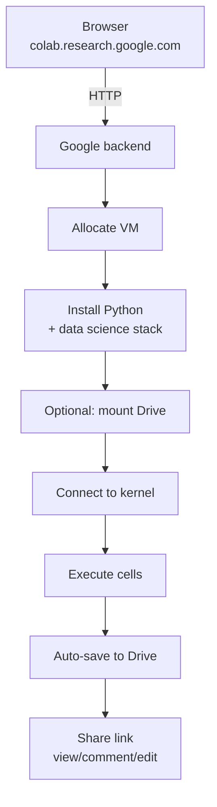
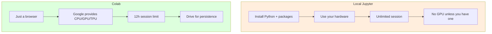
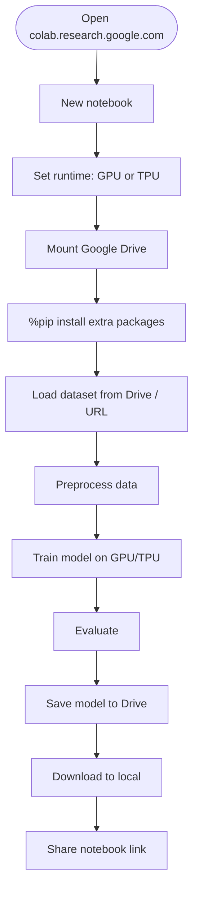

# Google Colab — Hosted Jupyter with Free GPUs and TPUs

> [!info] Chapter 29 — Notebooks and Interactive Computing, Note 2
> Follows [[1. Jupyter Notebook]]. Continues with [[3. Kaggle]] and [[4. Comparison and Workflows]]. Cross-references [[23. NumPy]], [[24. Pandas]], [[25. Matplotlib]], and [[30. ML and AI Libraries]].

## Why This Matters

Google Colaboratory ("Colab") is a hosted Jupyter notebook service that runs in the cloud, free of charge, with optional GPU and TPU access. For many users — students, hobbyists, ML researchers without institutional compute, data scientists prototyping models — Colab is the easiest way to:

- Run a Jupyter notebook without installing anything locally.
- Train deep learning models on a GPU for free.
- Share notebooks with collaborators via Google Drive.
- Run code on TPUs (Google's custom ML accelerator) — something few other services offer.

Colab has become a default environment for ML education (fast.ai, Coursera, university courses host their notebooks on Colab) and for ML research (papers often include a "Open in Colab" link so reviewers can reproduce the results).

## Background — Colab's History

Colab was announced by Google Research in October 2017. It is built on top of Google's internal Jupyter infrastructure (Google has used Jupyter internally for years) and integrates tightly with Google Drive. The name "Colaboratory" reflects its original emphasis on collaboration — multiple users editing the same notebook simultaneously, like Google Docs.

Key milestones:

- 2017: launch, free CPU and GPU runtimes.
- 2018: free TPU runtimes.
- 2020: Colab Pro subscription launched — longer runtimes, more memory, priority access to GPUs.
- 2021: Colab Pro+ added always-on runtimes and background execution.
- 2023: integrated code completion via Google's generative AI.

Colab is free to use, with paid tiers for heavier use. The free tier is generous — 12 hours of runtime, GPU access (subject to availability), and 12 GB of RAM.

## Main Content

### 1. What Is Colab?

Colab is a hosted Jupyter environment. The differences from running Jupyter locally:

| Feature | Local Jupyter | Google Colab |
|---|---|---|
| Installation | Required (`pip install jupyterlab`) | None — just a browser |
| Hardware | Your computer's CPU/RAM | Google cloud VM with CPU, GPU, or TPU |
| Storage | Local filesystem | Google Drive (mounted) + ephemeral VM disk |
| Cost | Free (you already own the computer) | Free tier, paid Pro/Pro+ tiers |
| Collaboration | Manual sharing of `.ipynb` files | Real-time multi-user editing via Google Drive |
| Session length | Unlimited | 12 hours (free), 24 hours (Pro) |
| Idle timeout | None | ~90 minutes (free), longer on Pro |

When you open a Colab notebook, Google allocates a virtual machine (VM) for you, installs Jupyter and the standard Python data science stack, and connects your browser to it. The VM persists for the duration of your session; when you disconnect (or after the idle timeout), the VM is recycled and all local state is lost.

### 2. Getting Started

1. Open https://colab.research.google.com in a browser.
2. Sign in with a Google account.
3. Click "New Notebook" (or open an existing one from Google Drive or GitHub).

The interface is a simplified Jupyter Notebook (not full JupyterLab). It has cells (code and text), a file browser on the left, and a "Runtime" menu for managing the kernel.

### 3. Runtime Types

Colab offers three runtime types:

#### CPU runtime (default)

The default. Free, available immediately. Suitable for data manipulation (pandas, NumPy), light ML (scikit-learn), and any non-deep-learning work.

Specs (free tier):

- 2 vCPUs (Intel Xeon).
- ~13 GB RAM.
- ~100 GB ephemeral disk.

#### GPU runtime

A NVIDIA T4 (free tier), P100, V100, or A100 (paid tiers). Free tier GPU is allocated dynamically based on availability — you may wait in a queue.

To enable: `Runtime → Change runtime type → Hardware accelerator: T4 GPU`.

GPU runtimes are essential for training deep learning models (PyTorch, TensorFlow, JAX). A task that takes hours on CPU may take minutes on GPU.

#### TPU runtime

A Google TPU (Tensor Processing Unit) — Google's custom ML accelerator, optimized for matrix multiplication. TPUs are particularly effective for large batch sizes and large models.

To enable: `Runtime → Change runtime type → Hardware accelerator: TPU v2`.

TPUs require special setup in your code (XLA compilation, specific data loading patterns). See the [TPU documentation](https://cloud.google.com/tpu/docs) and JAX/PyTorch TPU guides.

### 4. Google Drive Integration

Colab notebooks are stored in Google Drive by default. To access other Drive files (datasets, models, saved outputs), mount your Drive:

```python
from google.colab import drive
drive.mount("/content/drive")

# Now your Drive files are at /content/drive/MyDrive/
import os
print(os.listdir("/content/drive/MyDrive/"))
```

This creates a persistent storage location that survives between sessions. Use it for:

- Storing datasets too large to re-download each session.
- Saving trained model checkpoints.
- Saving outputs (plots, generated text).

### 5. Installing Packages

Colab comes with a generous pre-installed set of packages: NumPy, pandas, matplotlib, seaborn, scikit-learn, TensorFlow, PyTorch, Keras, JAX, OpenCV, Pillow, and many more. Check what is installed:

```python
!pip list
```

To install additional packages, use `%pip` (the kernel-aware way):

```python
%pip install transformers datasets accelerate
```

The installation persists for the duration of the session — when the VM is recycled, the packages are gone. For commonly-used packages, put the `%pip install` at the top of the notebook so it runs automatically when someone (including future you) opens the notebook.

### 6. Uploading and Downloading Files

#### Upload from your local machine

```python
from google.colab import files
uploaded = files.upload()  # opens a file picker

for filename, content in uploaded.items():
    with open(filename, "wb") as f:
        f.write(content)
```

#### Download to your local machine

```python
from google.colab import files
files.download("model.pkl")
```

#### Download from a URL

```python
import urllib.request
url = "https://example.com/data.csv"
urllib.request.urlretrieve(url, "data.csv")
```

### 7. Forms — Interactive Widgets

Colab supports "forms" — a simplified version of `ipywidgets`. You can add a form to a code cell by clicking the "Form" icon, or by using the `@param` syntax:

```python
#@title Example form { run: "auto", display-mode: "form" }

learning_rate = 0.01 #@param {type:"number"}
epochs = 50 #@param {type:"slider", min:1, max:100, step:1}
optimizer = "adam" #@param ["adam", "sgd", "rmsprop"]
use_gpu = True #@param {type:"boolean"}

print(f"LR={learning_rate}, epochs={epochs}, opt={optimizer}, GPU={use_gpu}")
```

This is a clean way to expose hyperparameters to non-technical users.

### 8. Display System

Colab supports the same rich output as Jupyter — HTML, images, pandas DataFrames, matplotlib plots. Plus a few Colab-specific helpers:

```python
from google.colab import data_table
data_table.enable_dataframe_formatter()

# Now DataFrames render as interactive tables with pagination and search
import pandas as pd
df = pd.read_csv("data.csv")
df
```

### 9. Mermaid — Colab Workflow



### 10. Mermaid — Colab Runtime Types

```mermaid
flowchart LR
    subgraph CPU["CPU runtime"]
        C1["2 vCPUs<br/>13 GB RAM<br/>100 GB disk"]
        C2[Data manipulation<br/>classical ML<br/>NumPy / pandas / sklearn]
    end
    subgraph GPU["GPU runtime"]
        G1["NVIDIA T4 (free)<br/>P100/V100/A100 (Pro)"]
        G2[Deep learning<br/>PyTorch / TensorFlow / JAX<br/>CNNs, transformers]
    end
    subgraph TPU["TPU runtime"]
        T1["Google TPU v2<br/>8 cores<br/>specialised for ML]
        T2[Large models<br/>JAX / TensorFlow<br/>high-throughput training]
    end
```

### 11. Mermaid — Colab vs Local Jupyter



### 12. Mermaid — A Full Colab ML Workflow



### 13. Colab Pro and Pro+

Google offers paid tiers for heavier use:

| Feature | Free | Pro ($10/mo) | Pro+ ($50/mo) |
|---|---|---|---|
| Session length | 12 h | 24 h | 24 h |
| Idle timeout | ~90 min | ~90 min | Always-on |
| Background execution | No | Yes | Yes |
| RAM | ~13 GB | ~32 GB | ~52 GB |
| GPU priority | Low | High | Higher |
| GPU type | T4 | T4, P100, V100 | V100, A100 |
| Compute units | None | 100 | 500 |

For most users, the free tier is sufficient. Pro is worth it for serious ML students and researchers — the better GPU and longer sessions make a real difference. Pro+ is for production-like workloads.

## Code Examples

### Mount Drive and load a dataset

```python
from google.colab import drive
drive.mount("/content/drive")

import pandas as pd
df = pd.read_csv("/content/drive/MyDrive/datasets/train.csv")
print(df.shape)
df.head()
```

### Train a simple CNN on GPU

```python
# Check that GPU is available
import torch
print(f"CUDA available: {torch.cuda.is_available()}")
print(f"Device: {torch.cuda.get_device_name(0) if torch.cuda.is_available() else 'CPU'}")

device = torch.device("cuda" if torch.cuda.is_available() else "cpu")

# Build a simple CNN
import torch.nn as nn
import torch.optim as optim
from torch.utils.data import DataLoader
from torchvision import datasets, transforms

transform = transforms.Compose([transforms.ToTensor()])
train_ds = datasets.MNIST("/content/data", train=True, download=True, transform=transform)
train_loader = DataLoader(train_ds, batch_size=64, shuffle=True)

model = nn.Sequential(
    nn.Flatten(),
    nn.Linear(28 * 28, 128),
    nn.ReLU(),
    nn.Linear(128, 10),
).to(device)

optimizer = optim.Adam(model.parameters())
criterion = nn.CrossEntropyLoss()

for epoch in range(3):
    for x, y in train_loader:
        x, y = x.to(device), y.to(device)
        optimizer.zero_grad()
        loss = criterion(model(x), y)
        loss.backward()
        optimizer.step()
    print(f"Epoch {epoch+1} done")

# Save to Drive
torch.save(model.state_dict(), "/content/drive/MyDrive/models/mnist_cnn.pt")
print("Saved.")
```

### Use the TPU with JAX

```python
import jax
import jax.numpy as jnp

# Detect TPU
print(f"Devices: {jax.devices()}")
# Should show 8 TPU cores on a TPU runtime

# A simple computation spread across TPU cores
x = jnp.ones((8, 1024, 1024))
y = jnp.dot(x, x)
print(y.shape)
```

### Upload files from local machine

```python
from google.colab import files
uploaded = files.upload()  # opens a file picker dialog

for filename, content in uploaded.items():
    with open(filename, "wb") as f:
        f.write(content)
    print(f"Saved {filename} ({len(content)} bytes)")
```

### Use Colab's interactive table for DataFrames

```python
from google.colab import data_table
data_table.enable_dataframe_formatter()

import pandas as pd
df = pd.read_csv("https://raw.githubusercontent.com/mwaskom/seaborn-data/master/tips.csv")
df  # now rendered as an interactive, searchable table
```

### Schedule a notebook with Colab Pro+ background execution

With Colab Pro+, you can run a notebook in the background and close your browser. The notebook runs to completion (or until the session limit) and saves results to Drive. Configure via `Runtime → Run in background`.

## Common Pitfalls

> [!danger] Losing data when the session ends
> The VM's local filesystem (`/content/`) is wiped when the session ends. Always save important outputs to Google Drive (`/content/drive/MyDrive/`) before disconnecting.

> [!danger] Idle timeout
> Free-tier Colab sessions are killed after ~90 minutes of inactivity. If you leave your browser tab in the background, the session may be gone when you return. Long-running training should checkpoint to Drive periodically.

> [!danger] Session length limit
> Free-tier sessions are limited to 12 hours. Long-running training must checkpoint and resume. Use Pro for 24-hour sessions.

> [!danger] GPU availability
> Free-tier GPUs are allocated based on availability. You may wait in a queue, or you may get a slower GPU than expected. For consistent access, use Colab Pro.

> [!danger] Installing packages every session
> When the VM is recycled, installed packages are gone. If you `%pip install transformers` one session, you must do it again the next. Put `%pip install` cells at the top of your notebook.

> [!danger] Not mounting Drive for persistence
> Without mounting Drive, your datasets and model checkpoints are lost when the session ends. Mount Drive once at the top of the notebook and use it for persistent storage.

> [!danger] Forgetting to enable GPU
> If you start training a model and it is slow, check the runtime type. `Runtime → Change runtime type → Hardware accelerator: T4 GPU`. The change requires a session restart.

> [!danger] TPU without proper setup
> TPUs require specific code patterns (XLA compilation, `tf.distribute.TPUStrategy` in TensorFlow, `jax.devices()` in JAX). Naive PyTorch code will not use the TPU.

> [!danger] Using `!pip` instead of `%pip`
> Same as local Jupyter: `!pip` may install to the wrong environment. Use `%pip` for kernel-aware installation.

> [!danger] Sharing private data via the notebook
> If your notebook reads from `/content/drive/MyDrive/private_data.csv` and you share the notebook, viewers do not get access to your Drive. But if you upload data directly to the VM (`files.upload()`), it is embedded in the notebook's outputs and may be visible to viewers. Be careful with sensitive data.

> [!danger] Not saving checkpoints during long training
> If the session is killed (timeout, preemption, network issue), you lose all progress. Save a checkpoint to Drive every N epochs.

> [!danger] Assuming the runtime is private
> Free-tier Colab VMs are not isolated from Google — they are Google cloud VMs. Do not process highly sensitive data on free Colab. For sensitive work, use a private cloud VM or run locally.

## Tips and Tricks

- **Pin your package versions** in `%pip install` cells for reproducibility:
  ```python
  %pip install transformers==4.40.0 datasets==2.19.0
  ```
- **Mount Drive at the top of every notebook** that needs persistence.
- **Save model checkpoints to Drive every epoch** during long training. If the session dies, you resume from the last checkpoint.
- **Use `Runtime → Run all`** to verify the notebook executes top-to-bottom before sharing.
- **Use `Runtime → Manage sessions`** to see and close your active sessions. Closing unused sessions frees up resources.
- **Use Forms** (`#@param`) for hyperparameters so the notebook is reusable.
- **For sharing, use the "Share" button in the top right** — you can set permissions to "Anyone with the link can view/comment/edit".
- **For GitHub integration**: open a notebook directly from a GitHub repo with `File → Open notebook → GitHub`. Or append `?tab=readme-ov-file` to a GitHub notebook URL... actually, append the notebook URL with `https://colab.research.google.com/github/USER/REPO/blob/main/notebook.ipynb`.
- **For accessing private GitHub repos**, store a personal access token in Colab secrets:
  ```python
  from google.colab import userdata
  token = userdata.get("github_token")
  ```
- **Use `google.colab` userdata** for API keys (OpenAI, Hugging Face, etc.) instead of hardcoding them:
  ```python
  from google.colab import userdata
  api_key = userdata.get("OPENAI_API_KEY")
  ```
- **For large datasets, use Google Cloud Storage** instead of Drive — it is faster and handles large files better. The `gcloud` CLI is pre-installed in Colab.
- **For multi-GPU training**, request the right runtime (Pro+ for V100/A100 multi-GPU VMs).
- **For background execution**, use Colab Pro+ — close your browser and the notebook keeps running.
- **For interactive widgets, use `ipywidgets`** — Colab supports them, though some advanced widgets may not render.
- **For visualisations, prefer Plotly or Altair** over matplotlib — they render as interactive HTML, which works well in Colab.
- **Read the official Colab FAQ** at https://research.google.com/colaboratory/faq.html for the latest on limits and features.

## Active Recall

> [!question] What is Google Colab?
>> [!success]- Answer
>> A hosted Jupyter notebook service from Google. It runs in the browser, requires no installation, provides free access to CPU, GPU, and TPU runtimes, and integrates with Google Drive for storage. Paid tiers (Pro, Pro+) offer longer sessions and better hardware.

> [!question] What are the three runtime types in Colab?
>> [!success]- Answer
>> (1) **CPU** — default, free, suitable for data manipulation and classical ML. (2) **GPU** — NVIDIA T4 (free) or P100/V100/A100 (paid), for deep learning. (3) **TPU** — Google's custom ML accelerator, optimised for large batch matrix multiplication, best with JAX or TensorFlow.

> [!question] How do you mount your Google Drive in Colab?
>> [!success]- Answer
>> ```python
>> from google.colab import drive
>> drive.mount("/content/drive")
>> ```
>> This mounts your Drive at `/content/drive/MyDrive/`. The mount persists for the session.

> [!question] What happens to files on the VM's local filesystem when the session ends?
>> [!success]- Answer
>> They are deleted. The VM is recycled and all local state (files, installed packages, in-memory variables) is lost. Always save important outputs to Google Drive.

> [!question] What are the session length and idle timeout for free-tier Colab?
>> [!success]- Answer
>> 12 hours maximum session length, ~90 minutes idle timeout. Pro extends to 24-hour sessions; Pro+ adds background execution.

> [!question] Why use `%pip install` instead of `!pip install` in Colab?
>> [!success]- Answer
>> `!pip` runs the shell's pip, which may not be the same Python environment as the kernel. `%pip` runs the kernel's pip, ensuring the package is installed into the correct environment and is importable from the notebook.

> [!question] How do you enable a GPU in Colab?
>> [!success]- Answer
>> `Runtime → Change runtime type → Hardware accelerator: T4 GPU`. This restarts the session, so do it at the start before running any cells.

> [!question] What is the difference between Colab Free, Pro, and Pro+?
>> [!success]- Answer
>> **Free**: 12h sessions, ~90 min idle, T4 GPU (when available), ~13 GB RAM. **Pro** ($10/mo): 24h sessions, better GPUs (P100, V100), ~32 GB RAM, 100 compute units. **Pro+** ($50/mo): always-on runtimes, background execution, V100/A100, ~52 GB RAM, 500 compute units.

> [!question] How do you store an API key in Colab without hardcoding it?
>> [!success]- Answer
>> Use Colab's secrets: `Runtime → Secrets → Add secret`, then in code:
>> ```python
>> from google.colab import userdata
>> api_key = userdata.get("OPENAI_API_KEY")
>> ```
>> This keeps the key out of the notebook source.

> [!question] How do you share a Colab notebook with collaborators?
>> [!success]- Answer
>> Click "Share" in the top right and set permissions: "Anyone with the link can view/comment/edit". Collaborators get real-time co-editing like Google Docs. The notebook is stored in your Google Drive.

> [!question] How do you open a notebook from a GitHub repo in Colab?
>> [!success]- Answer
>> Either `File → Open notebook → GitHub` and paste the repo, or prepend `https://colab.research.google.com/github/` to the notebook's raw GitHub URL.

## Next Steps

- Continue to [[3. Kaggle]] for ML competitions and datasets.
- Then [[4. Comparison and Workflows]] for a side-by-side comparison and migration tips.
- Cross-reference [[30. ML and AI Libraries]] for the deep learning frameworks (PyTorch, TensorFlow, JAX) most often used in Colab.
- Read the official Colab FAQ at https://research.google.com/colaboratory/faq.html.
- Read the Google TPU documentation at https://cloud.google.com/tpu/docs.
- Try the "Welcome To Colaboratory" notebook that opens by default — it covers all the basics.
