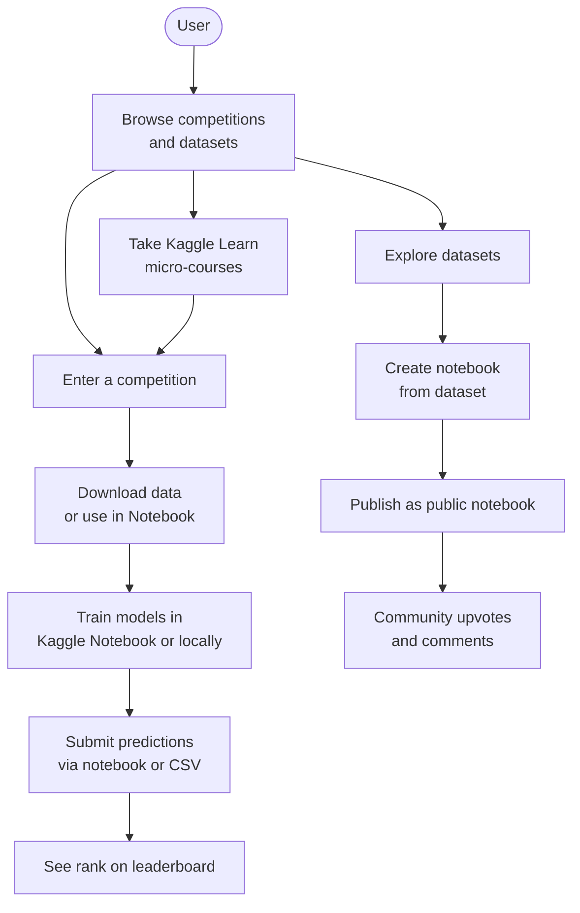
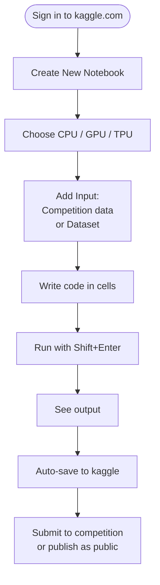
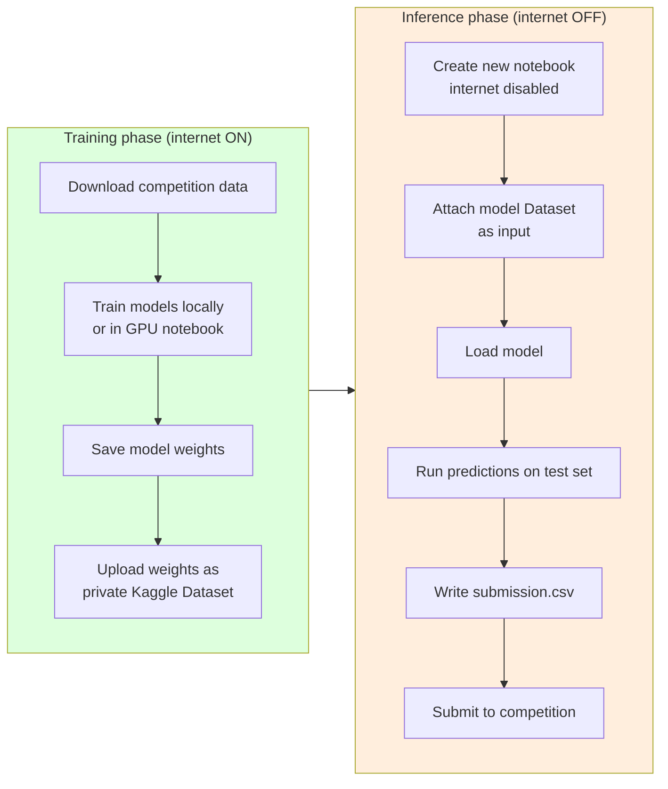
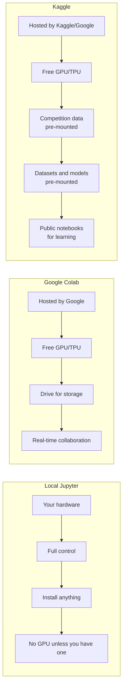
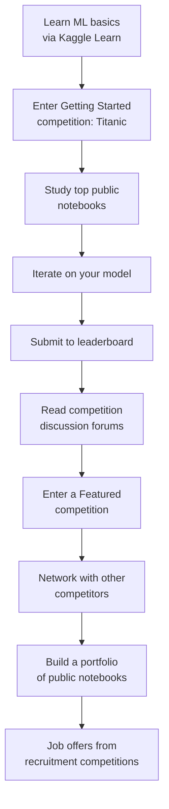

# Kaggle — ML Competitions, Datasets, and Notebooks in One Platform

> [!info] Chapter 29 — Notebooks and Interactive Computing, Note 3
> Follows [[2. Google Colab]]. Continues with [[4. Comparison and Workflows]]. Cross-references [[30. ML and AI Libraries]], [[23. NumPy]], [[24. Pandas]], [[25. Matplotlib]].

## Why This Matters

Kaggle is the world's largest machine learning community. It hosts:

- **Competitions** — companies and researchers post problems (with prize money) and a dataset; competitors submit predictions and are ranked on a leaderboard.
- **Datasets** — a public repository of ~100,000 datasets, free to download and use in notebooks.
- **Notebooks** (formerly "Kernels") — hosted Jupyter notebooks with free CPU and GPU compute, tightly integrated with the datasets and competitions.
- **Learn** — free micro-courses on Python, ML, deep learning, SQL, feature engineering, and more.
- **Discussion forums** — per-competition and per-dataset, where competitors share approaches and tips.
- **Models** — a model registry (added in 2023) for sharing pre-trained models.

For ML practitioners, Kaggle is valuable for three reasons:

1. **Real datasets and problems** — the competitions and datasets are real, often with cash prizes. Working through them teaches you the messy reality of ML that textbooks skip.
2. **Public notebooks** — for nearly any dataset, you can find dozens of public notebooks showing how others approached it. This is a goldmine for learning.
3. **Free compute** — Kaggle Notebooks provide 30 hours/week of GPU (T4) and 20 hours/week of TPU, free.

This note covers Kaggle's ecosystem and how to use it effectively.

## Background — Kaggle's History

Kaggle was founded in 2010 by Anthony Goldbloom and Ben Hamner as a platform for predictive modelling competitions. Early competitions included predicting HIV progression, ranking chess players, and forecasting grocery sales. Google acquired Kaggle in March 2017; it now operates as a subsidiary of Google Cloud.

Key milestones:

- 2010: launch, first competitions.
- 2016: "Kernels" (now Notebooks) launched — a hosted Jupyter environment.
- 2017: acquired by Google.
- 2018: Datasets launched as a first-class feature.
- 2019: free GPU (K80, later T4) and TPU added to Notebooks.
- 2020: "Learn" micro-courses expanded; competitions for COVID-19 research.
- 2023: Models registry added.

Today, Kaggle has 10+ million registered users, hosts hundreds of active competitions per year, and has paid out $40M+ in prize money.

## Main Content

### 1. Competitions

A Kaggle competition has:

- **A problem statement** — e.g., "predict house prices given 79 features", "classify toxic comments", "predict molecular toxicity".
- **A dataset** — split into `train.csv` (with labels), `test.csv` (without labels), and `sample_submission.csv` (the format).
- **A metric** — RMSE, AUC, F1, log-loss, etc. The leaderboard ranks submissions by this metric.
- **A deadline** — typically 2-3 months.
- **Prizes** — cash (sometimes $100,000+), jobs, or just glory.

#### Competition types

| Type | Description | Prizes |
|---|---|---|
| **Featured** | Real business or research problem | Cash, often $25k–$100k+ |
| **Research** | Scientific problem (e.g., medical imaging) | Cash or grants |
| **Playground** | Synthetic or fun problem | None (or swag) |
| **Getting Started** | No deadline, always open, for learning | None |
| **Recruitment** | Top performers get job interviews | Jobs |

The **Getting Started** competitions are the right place to start:

- **Titanic: Machine Learning from Disaster** — binary classification, predict survival.
- **House Prices: Advanced Regression Techniques** — regression, predict sale price.
- **Digit Recognizer (MNIST)** — image classification.
- **Spaceship Titanic** — modernised version of the Titanic competition.

These never close, so you can practice without time pressure.

### 2. Datasets

Kaggle hosts ~100,000 public datasets, ranging from tiny (the Titanic dataset, 12 columns) to massive (millions of rows). Each dataset has:

- A description.
- A list of files with sizes.
- Usage license.
- Tags (finance, health, NLP, computer vision, etc.).
- Notebooks that use it (public).
- A discussion forum.

You can download datasets directly (via the `kaggle` CLI or web UI) or use them in Kaggle Notebooks without downloading — they are mounted at `/kaggle/input/`.

```bash
# Install the kaggle CLI
pip install kaggle

# Configure your API key (download from kaggle.com → Account → Create New Token)
# Place it at ~/.kaggle/kaggle.json
chmod 600 ~/.kaggle/kaggle.json

# Download a dataset
kaggle datasets download -d uciml/iris
unzip iris.zip
```

### 3. Kaggle Notebooks

Kaggle Notebooks (formerly "Kernels") are hosted Jupyter notebooks with free compute. The specs:

| Resource | Limit |
|---|---|
| CPU cores | 4 |
| RAM | 30 GB |
| Disk | 73 GB (ephemeral) |
| GPU | NVIDIA T4, 30 hours/week |
| TPU | TPU v3-8, 20 hours/week |
| Internet | Enabled by default (can be disabled) |
| Session length | 12 hours (CPU), 9 hours (GPU), 9 hours (TPU) |
| Max notebooks per user | Unlimited (public) |

To create a notebook:

1. Sign in at https://kaggle.com.
2. Click "Create" → "New Notebook".
3. Choose CPU, GPU, or TPU.
4. (Optional) Add a dataset or competition data via the "Add Input" sidebar.

The interface is similar to Google Colab — a simplified Jupyter in the browser. Cells can be code or Markdown, and outputs are rendered inline.

### 4. Notebook Environment

Kaggle Notebooks come pre-installed with:

- Python 3.10+.
- NumPy, pandas, matplotlib, seaborn, scikit-learn.
- TensorFlow, PyTorch, Keras, JAX, Hugging Face transformers.
- XGBoost, LightGBM, CatBoost.
- OpenCV, Pillow, scikit-image.
- Most other common ML libraries.

To install something not pre-installed:

```python
!pip install -q some-package
```

Or use the "Internet" toggle to enable internet access (it is on by default, but competitions often require you to disable it for submission — see below).

### 5. Internet and the "No Internet" Submission Rule

Many competitions require that your submission notebook run without internet access. This is to prevent cheating (e.g., downloading test labels). To submit to such a competition:

1. Disable internet on your notebook (sidebar toggle).
2. Use **Kaggle Datasets** to host any pre-trained models or external data you need. You upload the data as a private Kaggle Dataset, then attach it to your notebook as an "Add Input".
3. Your notebook must run end-to-end without internet, producing the submission file.

This is the most common workflow for serious competition entries. The pattern is:

- Train locally or in a GPU notebook (with internet) using any libraries you want.
- Save the trained model as a Kaggle Dataset.
- Write an "inference" notebook that loads the model from the Kaggle Dataset and produces predictions. This notebook has internet disabled.

### 6. Mermaid — Kaggle Ecosystem



### 7. Mermaid — Kaggle Notebook Workflow



### 8. Mermaid — Competition Submission Workflow



### 9. Kaggle Learn

Kaggle Learn (https://kaggle.com/learn) is a free collection of micro-courses — short, focused, hands-on tutorials with exercises. Each course is 4-7 hours and includes Jupyter notebooks you can run in your browser.

Courses include:

- **Python** — basics.
- **Pandas** — data manipulation.
- **Data Visualization** — matplotlib and seaborn.
- **Intro to ML** — scikit-learn basics.
- **Intermediate ML** — missing values, categorical encoding, pipelines, cross-validation.
- **Feature Engineering** — creating useful features from raw data.
- **Intro to Deep Learning** — Keras and neural networks.
- **Computer Vision** — CNNs with TensorFlow.
- **Time Series** — forecasting.
- **Data Cleaning** — handling messy data.
- **Intro to SQL** and **Advanced SQL** — querying with BigQuery.
- **Machine Learning Explainability** — SHAP, permutation importance.
- **AI Ethics**.
- **Intro to Game AI and Reinforcement Learning**.

The micro-courses are a great way to learn a topic quickly, with immediate hands-on practice.

### 10. Models Registry (2023+)

Kaggle added a Models registry in 2023 — a place to publish and discover pre-trained models (especially Hugging Face transformers, but also Keras models and others). You can attach a model to your notebook as an input, just like a dataset.

```python
# Load a pre-trained model from Kaggle Models
from transformers import AutoTokenizer, AutoModelForSequenceClassification

model_path = "/kaggle/input/bert-base-uncased/transformers/default/1/"
tokenizer = AutoTokenizer.from_pretrained(model_path)
model = AutoModelForSequenceClassification.from_pretrained(model_path)
```

This is particularly useful for "no internet" submissions — you attach the pre-trained model as a Kaggle Model and load it from the local path.

### 11. Discussion Forums

Each competition and dataset has a discussion forum. Competitors share:

- EDA (exploratory data analysis) insights.
- Baseline models.
- Approach writeups (especially after the competition ends).
- "Bug" reports and rule clarifications.

Reading the discussion forums of past competitions is one of the highest-value learning activities in ML. After each competition ends, the top teams publish detailed writeups of their approach. These writeups are goldmines of practical ML knowledge.

### 12. Public Notebooks

Every Kaggle Notebook can be made public. For popular datasets and competitions, you will find dozens of public notebooks showing different approaches. Filter by:

- **Votes** — the most-upvoted notebooks are usually high quality.
- **Recent** — for the latest approaches.
- **Tutorial** — for educational notebooks.

Studying public notebooks is the fastest way to learn ML. For the Titanic competition, there are 20,000+ public notebooks — you can see every approach from "logistic regression" to "ensemble of 50 gradient-boosted trees with stacking".

### 13. Kaggle API

The `kaggle` CLI lets you interact with Kaggle from your local machine:

```bash
# Install
pip install kaggle

# Configure: download kaggle.json from kaggle.com → Account → Create New API Token
# Place at ~/.kaggle/kaggle.json (Linux/Mac) or %USERPROFILE%\.kaggle\kaggle.json (Windows)
chmod 600 ~/.kaggle/kaggle.json

# List competitions
kaggle competitions list

# Download competition data
kaggle competitions download -c titanic
unzip titanic.zip -d titanic

# Submit to a competition
kaggle competitions submit -c titanic -f submission.csv -m "my first submission"

# List datasets
kaggle datasets list

# Download a dataset
kaggle datasets download -d uciml/iris

# Push a new dataset
kaggle datasets init -p /path/to/dataset
# Edit dataset-metadata.json
kaggle datasets create -p /path/to/dataset

# Push a notebook
kaggle kernels init
# Edit kernel-metadata.json
kaggle kernels push -p /path/to/notebook
```

### 14. Mermaid — Kaggle vs Colab vs Local Jupyter



### 15. Mermaid — Kaggle's Role in an ML Workflow



## Code Examples

### A Titanic baseline notebook

```python
# Cell 1: Setup
import pandas as pd
import numpy as np
from sklearn.ensemble import RandomForestClassifier
from sklearn.model_selection import cross_val_score

# Cell 2: Load data (pre-mounted in Kaggle Notebooks)
train = pd.read_csv("/kaggle/input/titanic/train.csv")
test = pd.read_csv("/kaggle/input/titanic/test.csv")
print(train.shape, test.shape)
train.head()

# Cell 3: Feature engineering
def features(df):
    df = df.copy()
    df["Sex"] = df["Sex"].map({"male": 0, "female": 1})
    df["Age"] = df["Age"].fillna(df["Age"].median())
    df["Fare"] = df["Fare"].fillna(df["Fare"].median())
    df["Embarked"] = df["Embarked"].fillna("S").map({"S": 0, "C": 1, "Q": 2})
    return df[["Pclass", "Sex", "Age", "SibSp", "Parch", "Fare", "Embarked"]]

X = features(train)
y = train["Survived"]
X_test = features(test)

# Cell 4: Train and CV
model = RandomForestClassifier(n_estimators=100, random_state=42)
scores = cross_val_score(model, X, y, cv=5, scoring="accuracy")
print(f"CV accuracy: {scores.mean():.4f} ± {scores.std():.4f}")

# Cell 5: Fit and predict
model.fit(X, y)
predictions = model.predict(X_test)

# Cell 6: Submit
output = pd.DataFrame({"PassengerId": test["PassengerId"], "Survived": predictions})
output.to_csv("submission.csv", index=False)
print("Saved submission.csv")
```

Submit via the "Submit" button in the Kaggle Notebook UI, or via the CLI:

```bash
kaggle competitions submit -c titanic -f submission.csv -m "RF baseline"
```

### Use a Kaggle Dataset in a notebook

```python
# In a Kaggle Notebook, datasets are pre-mounted
import pandas as pd

# Path: /kaggle/input/{dataset-slug}/{filename}
df = pd.read_csv("/kaggle/input/iris/Iris.csv")
df.head()
```

### Download a dataset locally with the API

```bash
pip install kaggle
mkdir -p ~/.kaggle
# Copy your kaggle.json (downloaded from kaggle.com → Account → Create New Token) to ~/.kaggle/
chmod 600 ~/.kaggle/kaggle.json

# Download
kaggle datasets download -d uciml/iris
unzip iris.zip
```

### Use a pre-trained model from Kaggle Models

```python
# Attach the model as an input in the notebook sidebar
from transformers import AutoTokenizer, TFAutoModelForSequenceClassification

model_path = "/kaggle/input/bert-base-uncased/transformers/default/1/"
tokenizer = AutoTokenizer.from_pretrained(model_path)
model = TFAutoModelForSequenceClassification.from_pretrained(model_path)

# Tokenize and predict
text = "This is a great movie!"
inputs = tokenizer(text, return_tensors="tf")
logits = model(**inputs).logits
print(logits)
```

### Train an XGBoost model

```python
import xgboost as xgb
from sklearn.model_selection import train_test_split
from sklearn.metrics import mean_squared_error

X_train, X_val, y_train, y_val = train_test_split(X, y, test_size=0.2, random_state=42)

dtrain = xgb.DMatrix(X_train, label=y_train)
dval = xgb.DMatrix(X_val, label=y_val)

params = {"objective": "reg:squarederror", "learning_rate": 0.05, "max_depth": 6}
model = xgb.train(
    params, dtrain,
    num_boost_round=1000,
    evals=[(dval, "val")],
    early_stopping_rounds=20,
    verbose_eval=50,
)

print(f"Best RMSE: {np.sqrt(mean_squared_error(y_val, model.predict(dval)))}")
```

### Ensemble multiple models (a classic Kaggle pattern)

```python
from sklearn.ensemble import RandomForestClassifier, GradientBoostingClassifier
from sklearn.linear_model import LogisticRegression
from sklearn.model_selection import cross_val_predict

# Get out-of-fold predictions from each model
rf_pred = cross_val_predict(RandomForestClassifier(n_estimators=200), X, y, cv=5, method="predict_proba")[:, 1]
gb_pred = cross_val_predict(GradientBoostingClassifier(), X, y, cv=5, method="predict_proba")[:, 1]
lr_pred = cross_val_predict(LogisticRegression(max_iter=1000), X, y, cv=5, method="predict_proba")[:, 1]

# Stack: train a meta-model on the base predictions
stacked = np.column_stack([rf_pred, gb_pred, lr_pred])
meta_model = LogisticRegression()
meta_model.fit(stacked, y)
final_pred = meta_model.predict(stacked)
```

## Common Pitfalls

> [!danger] Looking at test data during EDA
> In competitions, looking at the test set's labels (if available) is cheating. Even looking at the test set's *distribution* during feature engineering risks overfitting to it. Use only the training set for EDA and model selection.

> [!danger] Overfitting to the public leaderboard
> The public leaderboard is computed on a subset of the test set. If you submit many times and pick the best, you are overfitting to that subset. The private leaderboard (revealed at the end) is computed on the rest. Limit submissions and use cross-validation on the training set.

> [!danger] Not using cross-validation
> A single train/validation split is noisy. Use 5-fold or 10-fold cross-validation for reliable model comparison. For competitions, use `StratifiedKFold` for classification to preserve class balance.

> [!danger] Data leakage
> If your feature engineering uses information that would not be available at prediction time (e.g., target encoding without proper cross-validation), you get a CV score that does not generalise. Always pipeline your feature engineering with cross-validation.

> [!danger] Forgetting the "no internet" submission rule
> Many competitions require the submission notebook to run without internet. If you `!pip install` something during training, you must add it as a Kaggle Dataset for inference.

> [!danger] Running out of GPU quota
> Kaggle gives 30 GPU-hours/week. Long training runs eat this fast. Use it wisely — prototype on CPU or with a small sample, then move to GPU only when the pipeline is solid.

> [!danger] Submitting the wrong format
> The `sample_submission.csv` shows the exact format required (column names, order, types). Match it exactly — a submission with the wrong format is rejected.

> [!danger] Using `print` for large DataFrames
> Kaggle notebooks have the same output limits as Jupyter. Use `.head()`, `.info()`, `.describe()` instead of printing the whole DataFrame.

> [!danger] Not reading the competition rules
> Some competitions limit the number of submissions per day, require open-sourcing your code, or have other constraints. Read the rules before submitting.

> [!danger] Not reading the data description
> The data description often contains critical information (units, missing value codes, column meanings). Skipping it leads to bugs that are hard to find later.

> [!danger] Using the test set for feature engineering
> Standardising features using the mean/std of the combined train+test set is a form of leakage. Fit the scaler on the train set only and apply to the test set.

## Tips and Tricks

- **Start with Getting Started competitions** (Titanic, House Prices, Digit Recognizer). They never close and have thousands of public notebooks to learn from.
- **Read the top public notebooks** for any competition before starting your own.
- **Use cross-validation** — `StratifiedKFold` for classification, `KFold` for regression.
- **Build a strong baseline first** — a simple model (logistic regression, random forest) gives you a benchmark to beat.
- **Iterate on features, not just models.** Good features usually beat fancy models.
- **Ensemble at the end.** A weighted average of 3-5 diverse models often beats any single model.
- **Read the discussion forums** — top competitors share approaches, and rule clarifications appear there.
- **After the competition, read the top writeups.** This is where the real learning happens.
- **Make your notebooks public** — you get feedback, build a portfolio, and help others.
- **Use the `kaggle` CLI** to download data locally and work outside Kaggle Notebooks if you need more compute.
- **For large datasets, use `kaggle.datasets.download` with `--unzip`** to avoid manual extraction.
- **Pin your package versions** in your notebook (`!pip install x==1.2.3`) for reproducibility.
- **Use `joblib` or `pickle`** to save trained models, then load them in a separate inference notebook.
- **Disable internet** before submitting, even if not required — it catches accidental dependencies.
- **Use TPU only if you have a model that benefits** (large batch sizes, matrix-heavy). For tabular data, GPU is usually faster.
- **Take Kaggle Learn courses** — they are short, free, and high-quality.
- **Build a portfolio** of public notebooks. Recruiters and hiring managers check Kaggle profiles.
- **For recruitment competitions**, top performers get job interviews — a great way into ML roles.
- **Network** — the Kaggle community is friendly and helpful. Ask questions in the forums.
- **Read "The Kaggle Book"** by Konrad Banachewicz and Luca Massaron for competition strategies.

## Active Recall

> [!question] What is Kaggle?
>> [!success]- Answer
>> A platform for machine learning competitions, datasets, hosted notebooks, and education. Owned by Google since 2017. Hosts ~100,000 public datasets, hundreds of active competitions per year, free notebooks with GPU/TPU compute, and free micro-courses.

> [!question] What types of competitions does Kaggle host?
>> [!success]- Answer
>> (1) **Featured** — real business/research problems with cash prizes. (2) **Research** — scientific problems. (3) **Playground** — synthetic or fun problems. (4) **Getting Started** — no deadline, for learning (Titanic, House Prices). (5) **Recruitment** — top performers get job interviews.

> [!question] What compute resources does a Kaggle Notebook provide?
>> [!success]- Answer
>> 4 CPU cores, 30 GB RAM, 73 GB disk, NVIDIA T4 GPU (30 hours/week), TPU v3-8 (20 hours/week), 12-hour session limit (CPU) / 9-hour (GPU/TPU). Internet is enabled by default but can be disabled.

> [!question] What is the "no internet" submission rule?
>> [!success]- Answer
>> Many competitions require the submission notebook to run without internet access. This prevents cheating (downloading test labels) and ensures the submission is reproducible. You must upload any pre-trained models or external data as Kaggle Datasets/Models and attach them to the notebook as inputs.

> [!question] What is Kaggle Learn?
>> [!success]- Answer
>> A collection of free, short (4-7 hour) micro-courses on Python, pandas, ML, deep learning, SQL, feature engineering, time series, computer vision, and more. Each course includes hands-on Jupyter notebooks you can run in your browser.

> [!question] Why is cross-validation important in Kaggle competitions?
>> [!success]- Answer
>> The public leaderboard is computed on a subset of the test set. Submitting many times and picking the best overfits to that subset. Cross-validation on the training set gives a more reliable estimate of model performance and prevents overfitting to the public leaderboard.

> [!question] What is data leakage in the context of ML competitions?
>> [!success]- Answer
>> Using information at training time that would not be available at prediction time. Examples: target encoding without proper cross-validation, scaling features using train+test statistics, using future data in time series. Leakage produces inflated CV scores that do not generalise.

> [!question] How do you download a Kaggle dataset locally?
>> [!success]- Answer
>> Install the `kaggle` CLI (`pip install kaggle`), place your API token at `~/.kaggle/kaggle.json` (downloaded from kaggle.com → Account → Create New API Token), then `kaggle datasets download -d <dataset-slug>`.

> [!question] What is the difference between the public and private leaderboards?
>> [!success]- Answer
>> The **public leaderboard** is computed on a subset of the test set (~30%) and visible during the competition. The **private leaderboard** is computed on the rest (~70%) and revealed only after the competition ends. The private leaderboard is the official ranking.

> [!question] Why is ensembling popular in Kaggle competitions?
>> [!success]- Answer
>> A weighted average of 3-5 diverse models (different algorithms, different feature sets) typically beats any single model. The diversity reduces variance — different models make different errors, and the average is more robust.

> [!question] What is the Kaggle Models registry?
>> [!success]- Answer
>> A 2023 addition — a registry of pre-trained models (especially Hugging Face transformers) hosted on Kaggle. You can attach a model to your notebook as an input, just like a dataset. Particularly useful for "no internet" submissions — you load the model from a local path instead of downloading it.

## Next Steps

- Continue to [[4. Comparison and Workflows]] for a side-by-side comparison of Jupyter, Colab, and Kaggle, plus best practices for reproducible notebooks.
- Cross-reference [[30. ML and AI Libraries]] for the deep learning frameworks used in Kaggle competitions.
- Cross-reference [[24. Pandas]] and [[23. NumPy]] for the data manipulation libraries used in every Kaggle notebook.
- Read "The Kaggle Book" by Konrad Banachewicz and Luca Massaron for competition strategies.
- Read "The Kaggle Workbook" by the same authors for hands-on practice.
- Browse the Kaggle forum "How to read and write .ipynb notebooks in Kaggle" for Kaggle-specific tips.
- Sign up at https://kaggle.com and start with the Titanic competition.
