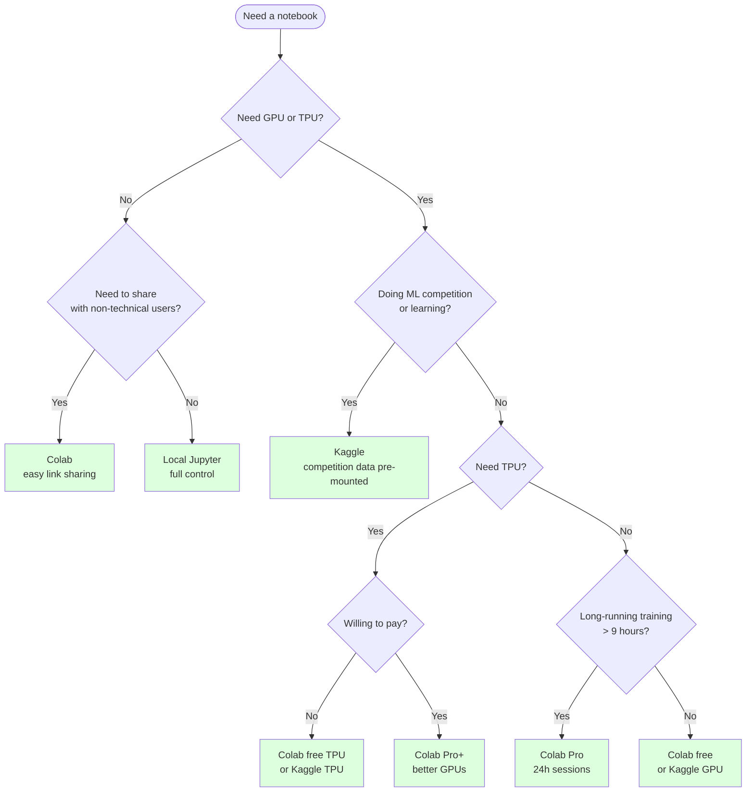
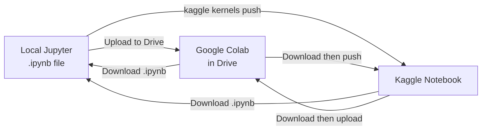
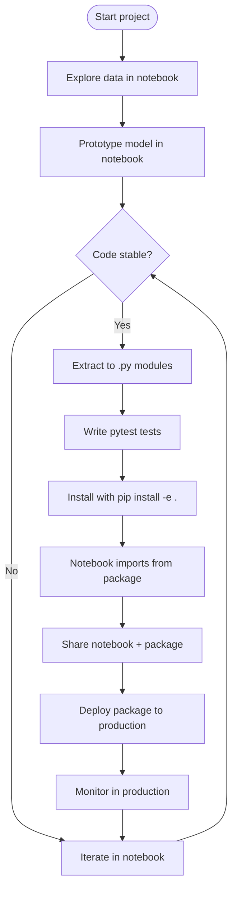
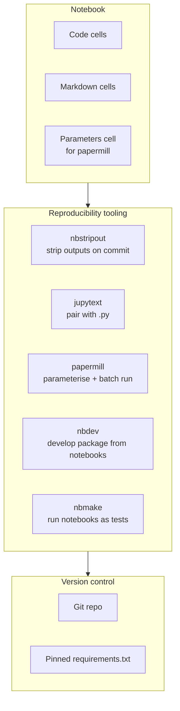

# Comparison and Workflows — Choosing a Notebook Tool and Using It Well

> [!info] Chapter 29 — Notebooks and Interactive Computing, Note 4 (final)
> Follows [[1. Jupyter Notebook]], [[2. Google Colab]], [[3. Kaggle]]. Cross-references [[28. Software Engineering Practices/1. Project Structure]] and [[12. Testing/3. pytest]] for the production-code side.

## Why This Matters

You now know three notebook tools: local Jupyter, Google Colab, and Kaggle. Each has its sweet spot. Choosing wrong wastes time and creates frustration — running a 12-hour GPU training job on local Jupyter without a GPU, or trying to do exploratory data analysis on Colab when the network keeps dropping.

Equally important: notebooks have well-known limitations — hidden state, hard-to-version-control outputs, no native testing, no refactoring tools. Many teams have moved ML code from notebooks to proper Python packages once it stabilises. Knowing the limitations and the migration paths is essential to using notebooks well in a professional context.

This note provides:

- A side-by-side comparison of the three tools.
- A decision tree for choosing one.
- Migration paths between them.
- Best practices for reproducible notebooks (`papermill`, `nbdev`).
- Limitations of notebooks and when to move to `.py` files.

## Background — The Three Tools in Context

| Tool | What it is | Best for |
|---|---|---|
| **Jupyter** (local) | Open-source notebook server you run on your machine | General-purpose interactive computing; packages you have installed; full control |
| **Google Colab** | Hosted Jupyter with free GPUs/TPUs and Drive integration | ML prototyping; quick sharing; no-install demos; GPU/TPU access without buying hardware |
| **Kaggle** | Hosted notebooks + competitions + datasets + community | ML competitions; learning from public notebooks; accessing curated datasets; portfolio building |

The three are not mutually exclusive — many data scientists use all three. A typical workflow:

1. Explore data in local Jupyter (fast, full control, packages installed).
2. Train a model on Colab (free GPU) or Kaggle (free GPU + competition data).
3. Share results on Colab (link) or Kaggle (public notebook).
4. Migrate stable code to a `.py` package.

## Main Content

### 1. Side-by-Side Comparison

| Feature | Local Jupyter | Google Colab | Kaggle Notebooks |
|---|---|---|---|
| **Installation** | Required (`pip install jupyterlab`) | None (browser) | None (browser) |
| **Cost** | Free (you own hardware) | Free; Pro $10/mo; Pro+ $50/mo | Free |
| **Hardware** | Your computer | Google cloud VM (CPU/GPU/TPU) | Kaggle cloud VM (CPU/GPU/TPU) |
| **GPU** | Only if you have one | NVIDIA T4 (free), V100/A100 (Pro) | NVIDIA T4 (30h/week) |
| **TPU** | No | Yes (TPU v2) | Yes (TPU v3-8, 20h/week) |
| **RAM** | Your machine's | ~13 GB (free), ~52 GB (Pro+) | 30 GB |
| **Disk** | Your machine's | ~100 GB ephemeral + Drive | ~73 GB ephemeral + Datasets |
| **Session length** | Unlimited | 12h (free), 24h (Pro) | 12h (CPU), 9h (GPU/TPU) |
| **Idle timeout** | None | ~90 min (free) | ~20 min idle, ~60 min inactive |
| **Persistent storage** | Local filesystem | Google Drive | Kaggle Datasets |
| **Pre-installed packages** | Whatever you installed | Generous ML stack | Generous ML stack |
| **Custom packages** | Yes, any | Yes, via `%pip` | Yes, via `!pip` (no internet for some competitions) |
| **Collaboration** | Manual file sharing | Real-time co-editing | Public/private forks |
| **Public sharing** | GitHub, nbviewer | "Share" link | "Publish" makes it public |
| **Version control** | Git (with nbstripout) | Drive revisions | Kaggle versions |
| **GPU quota** | N/A | Unlimited (subject to availability) | 30h/week GPU, 20h/week TPU |
| **Special features** | Full Jupyter ecosystem | Forms, Drive, secrets | Competitions, datasets, models, learn |
| **Best for** | General interactive work | ML prototyping | Competitions, learning |

### 2. Mermaid — Decision Tree for Choosing a Notebook Tool



### 3. Migration Between Tools

Notebooks are `.ipynb` files (JSON). All three tools can open and save `.ipynb` files, so migration is mostly straightforward.

#### Local Jupyter  Colab

- **Local → Colab**: Upload the `.ipynb` to Google Drive, then open with `File → Open notebook → Drive`. Or upload directly to Colab.
- **Colab → Local**: `File → Download → .ipynb`. Then run locally with `jupyter notebook`.

The main friction is package availability. A Colab notebook that uses `%pip install transformers` must run the same `%pip install` cell when imported to local Jupyter.

#### Local Jupyter  Kaggle

- **Local → Kaggle**: `kaggle kernels push -p /path/to/notebook/` (after `kaggle kernels init` and editing `kernel-metadata.json`).
- **Kaggle → Local**: Download the `.ipynb` from the notebook's "Download Code" button, or use `kaggle kernels pull <user>/<slug>`.

#### Colab  Kaggle

- **Colab → Kaggle**: Download `.ipynb` from Colab, then push with the `kaggle` CLI.
- **Kaggle → Colab**: Download from Kaggle, upload to Drive, open in Colab.

The friction points:

- **Paths**: Kaggle mounts datasets at `/kaggle/input/...`; Colab uses `/content/drive/MyDrive/...`. You will need to change paths.
- **Internet**: Some Kaggle competition submissions require no internet; Colab always has internet.
- **GPU/TPU detection**: Code that detects the device (`torch.cuda.is_available()`, `jax.devices()`) works in both, but the actual hardware differs.

### 4. Mermaid — Migration Paths



### 5. Best Practices for Reproducible Notebooks

Notebooks are notorious for being unreproducible — the classic "works on my machine" problem, amplified by hidden state. Several tools address this:

#### `nbstripout` — Strip outputs from git

```bash
pip install nbstripout
nbstripout --install            # auto-strip on commit
nbstripout --install-attributes # also strip metadata
```

Every `git commit` now strips outputs from `.ipynb` files automatically. The repo stays clean, diffs stay focused on code.

#### `jupytext` — Pair notebooks with plain Python

`jupytext` saves a notebook as both `.ipynb` and `.py` (or `.md`). The `.py` version is plain Python with `# %%` cell markers, which can be edited in any IDE and diffed with standard tools. The two stay in sync.

```bash
pip install jupytext
jupytext --set-formats ipynb,py notebook.ipynb  # pair
jupytext --sync notebook.ipynb                  # sync changes
```

Now you can edit the `.py` file in your IDE, run tests, refactor — and the notebook updates automatically.

#### `papermill` — Parameterise and run notebooks in batch

`papermill` lets you execute a notebook with parameters, producing a separate executed notebook with the results. This is invaluable for reports: "run this notebook with these date parameters and email me the result".

```bash
pip install papermill
```

Define a parameters cell at the top of the notebook:

```python
# Parameters cell (papermill injects values here)
date = "2024-01-01"
region = "US"
```

Run with parameters:

```bash
papermill input.ipynb output.ipynb -p date 2024-06-01 -p region EU
```

In Python:

```python
import papermill as pm

pm.execute_notebook(
    "input.ipynb",
    "output.ipynb",
    parameters={"date": "2024-06-01", "region": "EU"},
)
```

Use cases:

- Daily reports: a cron job runs `papermill` with today's date.
- Hyperparameter search: run the same notebook with different parameters.
- Batch predictions: run the same notebook on different datasets.

#### `nbdev` — Develop a Python package from notebooks

`nbdev` (from fast.ai) lets you develop a Python package *in* notebooks. You write code in code cells, mark some as exportable with `#| export` directives, and `nbdev_export` generates `.py` files. Tests, docs, and the package all come from the notebooks.

```bash
pip install nbdev
nbdev_new           # initialise an nbdev project
nbdev_export        # generate .py files from notebooks
nbdev_test          # run tests
nbdev_docs          # build docs
```

This is a powerful pattern for ML libraries where exploratory code and production code are intertwined. The fast.ai library, Answer.ai's tools, and many others use `nbdev`.

#### Version pinning

Always pin your package versions in a `requirements.txt`:

```text
numpy==1.26.4
pandas==2.2.2
scikit-learn==1.5.0
matplotlib==3.9.0
torch==2.3.0
```

And install with `%pip install -r requirements.txt` at the top of the notebook. This makes the notebook reproducible across machines and over time.

### 6. Limitations of Notebooks

Notebooks are great for exploration and bad for production. The limitations:

#### Hidden state

Running cells out of order produces kernel state that does not match the document. The notebook shows Cell 3 with output `[3]`, but the kernel actually ran Cell 3 *before* Cell 2 — so the output may depend on stale state.

**Mitigation**: Always "Restart & Run All" before sharing. Use `papermill` to execute notebooks end-to-end in CI.

#### Hard to version control

`.ipynb` files are JSON with embedded outputs. Outputs change every run (timestamps, random seeds), so `git diff` is noisy. Embedded images make the files megabytes in size.

**Mitigation**: `nbstripout` to strip outputs. `jupytext` to pair with plain Python.

#### No native testing

You cannot run `pytest` against a notebook. The closest is `doctest` for examples in docstrings, or `nbmake` which runs notebooks end-to-end as tests.

**Mitigation**: Move stable code to `.py` modules and write proper tests. Use `nbmake` in CI to verify notebooks execute without errors.

```bash
pip install nbmake
pytest --nbmake notebooks/*.ipynb
```

#### No refactoring tools

IDEs can rename variables, extract functions, and move code between files in `.py`. Notebooks do not support these — you do them manually.

**Mitigation**: Use VS Code's notebook support, which has some refactoring. Or use `jupytext` to convert to `.py`, refactor, and sync back.

#### Code duplication

If you have the same data-loading code in 10 notebooks, a change requires editing 10 files.

**Mitigation**: Move shared code to a `.py` module and import it.

#### Long cells are hard to debug

A 100-line cell is impossible to step through with a debugger. You can use `%debug` after an exception, but proactive debugging is hard.

**Mitigation**: Keep cells short. Move complex logic to functions in `.py` modules where you can use a real debugger.

#### Encourages bad software engineering

Because notebooks make it easy to write top-to-bottom scripts, they encourage:
- Global state instead of functions.
- Copy-paste instead of imports.
- Hardcoded paths and parameters instead of configuration.
- No tests.

**Mitigation**: Be disciplined. Refactor stable code into modules. Write tests for the modules.

### 7. When to Move from Notebook to `.py`

Move to `.py` when:

- The code is being used in production (serving predictions, batch jobs, dashboards).
- The code is being tested (you need `pytest`).
- The code is being shared across multiple projects or notebooks.
- The code is being reviewed by a team (notebook diffs are painful).
- The code is more than ~200 lines — it has outgrown the notebook format.
- The code has non-trivial control flow (functions, classes, exceptions) that notebooks obscure.

The migration pattern:

1. Identify the stable, reusable parts of the notebook.
2. Move them to a `.py` module under `src/my_package/`.
3. Import the module in the notebook:
   ```python
   import sys
   sys.path.append("../src")
   from my_package.data import load_data
   from my_package.model import train_model
   ```
4. Install the package with `pip install -e .` for an editable install:
   ```python
   %load_ext autoreload
   %autoreload 2
   from my_package.data import load_data
   ```
5. The notebook now contains only the exploratory / visualisation code, importing the stable logic from the package.

### 8. Mermaid — The Notebook Lifecycle in a Project



### 9. Mermaid — Reproducibility Stack



### 10. Mermaid — A Modern Reproducible Notebook Workflow


## Code Examples

### `papermill` for parameterised reports

```python
# report_template.ipynb — first cell:
# Parameters (papermill will inject values here)
start_date = "2024-01-01"
end_date = "2024-12-31"
region = "US"

# Subsequent cells:
import pandas as pd

df = pd.read_csv(f"data/{region}.csv", parse_dates=["date"])
mask = (df["date"] >= start_date) & (df["date"] <= end_date)
result = df.loc[mask].groupby(df["date"].dt.month)["revenue"].sum()
result.plot(kind="bar", title=f"Revenue by month, {region}, {start_date} to {end_date}")
```

```python
# Run with parameters
import papermill as pm

pm.execute_notebook(
    "report_template.ipynb",
    f"reports/report_{region}_{start_date}.ipynb",
    parameters={"start_date": "2024-06-01", "end_date": "2024-09-30", "region": "EU"},
)
```

### `nbmake` in CI

```yaml
# .github/workflows/notebooks.yml
name: Notebooks
on: [push, pull_request]
jobs:
  test:
    runs-on: ubuntu-latest
    steps:
      - uses: actions/checkout@v4
      - uses: actions/setup-python@v5
        with:
          python-version: "3.12"
      - run: pip install -r requirements.txt nbmake
      - run: pytest --nbmake notebooks/*.ipynb
```

This runs every notebook end-to-end in CI. If any notebook raises an exception, the build fails.

### `nbdev` project structure

```
my_package/
├── settings.ini
├── notebooks/
│   ├── 00_core.ipynb       # source for my_package/core.py
│   ├── 01_data.ipynb       # source for my_package/data.py
│   ├── 02_model.ipynb      # source for my_package/model.py
│   └── index.ipynb         # docs home page
├── my_package/             # auto-generated
│   ├── __init__.py
│   ├── core.py
│   ├── data.py
│   └── model.py
└── tests/
    └── test_core.py
```

A cell in `00_core.ipynb`:

```python
#| export
def hello(name: str) -> str:
    """Return a greeting."""
    return f"Hello, {name}!"

# Test cell
assert hello("world") == "Hello, world!"
```

`nbdev_export` generates `my_package/core.py` with the `hello` function. The test cell becomes a test that `nbdev_test` runs.

### `jupytext` pairing

```bash
# Pair a notebook with a Python file
jupytext --set-formats ipynb,py:percent notebook.ipynb

# Now both files exist:
# notebook.ipynb (with outputs, for execution)
# notebook.py (with # %% cell markers, for diffing)

# Edit either; sync with:
jupytext --sync notebook.ipynb
```

The `.py` file uses the "percent format" with `# %%` markers:

```python
# ---
# jupyter:
#   jupytext:
#     formats: ipynb,py:percent
# ---

# %% [markdown]
# # My Notebook

# %%
import pandas as pd
df = pd.read_csv("data.csv")
df.head()

# %% [markdown]
# ## Analysis

# %%
df.groupby("category").sum().plot()
```

This is plain Python — you can run it with `python notebook.py`, edit it in any IDE, diff it with git, and the notebook stays in sync.

### Combining tools: a reproducible ML pipeline

```bash
# Project structure
my_project/
├── pyproject.toml
├── requirements.txt         # pinned versions
├── src/
│   └── my_package/
│       ├── __init__.py
│       ├── data.py          # data loading
│       ├── features.py      # feature engineering
│       ├── model.py         # model definition
│       └── train.py         # training loop
├── notebooks/
│   ├── 01_eda.ipynb         # exploratory analysis
│   ├── 02_train.ipynb       # training notebook
│   └── 03_report.ipynb      # final report
├── tests/
│   └── test_features.py
└── .github/workflows/ci.yml
```

```python
# notebooks/02_train.ipynb — first cell
%load_ext autoreload
%autoreload 2

import sys
sys.path.append("../src")

from my_package.data import load_data
from my_package.features import add_features
from my_package.model import MyModel
from my_package.train import train_one_epoch
```

```yaml
# .github/workflows/ci.yml
name: CI
on: [push]
jobs:
  test:
    runs-on: ubuntu-latest
    steps:
      - uses: actions/checkout@v4
      - uses: actions/setup-python@v5
        with: { python-version: "3.12" }
      - run: pip install -e ".[dev]"
      - run: pytest
      - run: pytest --nbmake notebooks/
```

This combines:
- `pyproject.toml` for package management.
- `src/` layout for the package.
- `notebooks/` for exploratory and reporting notebooks.
- `tests/` for proper tests of the package.
- `nbmake` to verify notebooks execute without errors.
- `pytest` for the package tests.
- GitHub Actions to run everything in CI.

## Common Pitfalls

> [!danger] Treating notebooks as production code
> Notebooks are for exploration. Move stable code to `.py` modules for production. Notebooks are hard to test, hard to refactor, and hard to deploy.

> [!danger] Hidden state in shared notebooks
> If you run cells out of order, the notebook you share may not reproduce. Always "Restart & Run All" before sharing.

> [!danger] Not committing outputs stripped
> `.ipynb` files with outputs are huge and produce noisy git diffs. Use `nbstripout`.

> [!danger] Hardcoded paths and parameters
> `/Users/alice/data.csv` and `learning_rate = 0.001` hardcoded in a notebook make it unreproducible. Use relative paths and `papermill` for parameterisation.

> [!danger] Not pinning package versions
> A notebook that worked yesterday may break tomorrow when a library releases a new version. Pin your versions.

> [!danger] Choosing the wrong tool for the job
> Running a 12-hour GPU training job on local Jupyter (without a GPU) is painful. Doing exploratory analysis on Colab (with network drops) is painful. Match the tool to the task.

> [!danger] Copy-pasting code between notebooks
> If the same data-loading code appears in 10 notebooks, a bug fix requires editing 10 files. Move shared code to a `.py` module.

> [!danger] Not testing notebook code
> Notebooks have no native tests. Move stable logic to `.py` modules and write `pytest` tests. Use `nbmake` to verify notebooks execute end-to-end.

> [!danger] Long cells
> A 100-line cell is impossible to debug. Break it into smaller cells, or move the logic to a function in a `.py` module.

> [!danger] Not using `papermill` for batch reports
> Running the same notebook manually for daily reports is error-prone. `papermill` parameterises and automates it.

> [!danger] Trusting the notebook's apparent state
> The notebook shows outputs, but those outputs may be from a previous kernel state. The kernel's actual state may differ. Restart and run all to be sure.

> [!danger] Not reading the docs of the tools you use
> Colab's session limits, Kaggle's GPU quota, Jupyter's keyboard shortcuts — all are in the docs. Read them.

## Tips and Tricks

- **Use the right tool for the job.** Local Jupyter for exploration, Colab for free GPUs, Kaggle for competitions and learning.
- **Pin your package versions.** A `requirements.txt` makes notebooks reproducible.
- **Use `nbstripout`** to keep `.ipynb` files clean in git.
- **Use `jupytext`** to pair notebooks with plain Python for better diffing and refactoring.
- **Use `papermill`** for parameterised, batch notebook execution.
- **Use `nbdev`** if you are developing a Python package alongside notebooks.
- **Use `nbmake`** to run notebooks as tests in CI.
- **Restart & Run All before sharing.** Always.
- **Move stable code to `.py` modules.** The notebook should be the *interface*, not the *implementation*.
- **Use `%load_ext autoreload` + `%autoreload 2`** during development so your notebook picks up changes to imported modules.
- **Use VS Code's notebook support** if you prefer an IDE over the JupyterLab web UI.
- **For collaboration, use Colab** — its real-time co-editing is unmatched.
- **For learning ML, use Kaggle** — the public notebooks and competitions are unmatched.
- **For production, use none of these** — use `.py` modules with proper tests.
- **Read "Notebooks Must Be Clean"** by Joel Grus for a humorous take on notebook anti-patterns.
- **Read "I Don't Like Notebooks"** by Joel Grus (a famous JupyterCon talk) for the case against notebooks.
- **Read "What's Wrong with Jupyter Notebooks?"** discussions for balance — the tools have improved since these critiques.
- **Use `nbqa`** to run `ruff`, `mypy`, `black`, `isort`, `pyupgrade` on notebooks. It extracts the code, runs the tool, and writes back changes.
  ```bash
  pip install nbqa
  nbqa ruff notebook.ipynb
  nbqa mypy notebook.ipynb
  nbqa black notebook.ipynb
  ```
- **Use `jupyterlab-code-formatter`** extension for in-JupyterLab formatting.

## Active Recall

> [!question] Name three notebook tools and one strength of each.
>> [!success]- Answer
>> (1) **Local Jupyter** — full control, packages you installed, no session limits. (2) **Google Colab** — free GPU/TPU, no installation, real-time collaboration. (3) **Kaggle** — competition data pre-mounted, public notebooks for learning, free GPU/TPU with weekly quotas.

> [!question] How do you migrate a notebook from local Jupyter to Colab?
>> [!success]- Answer
>> Upload the `.ipynb` file to Google Drive, then in Colab use `File → Open notebook → Drive`. Or upload directly via `File → Upload notebook`. The main friction is package availability — re-run any `%pip install` cells.

> [!question] What does `nbstripout` do?
>> [!success]- Answer
>> It strips outputs (and optionally metadata) from `.ipynb` files on git commit. This keeps the repository clean — files are smaller, diffs are focused on code changes rather than output changes, and merge conflicts are reduced.

> [!question] What does `jupytext` do?
>> [!success]- Answer
>> It pairs a `.ipynb` notebook with a plain-text format (`.py` with `# %%` markers, or `.md`). The two files stay in sync. You can edit the `.py` in any IDE, run it with `python`, diff it with git, and the notebook updates.

> [!question] What is `papermill` for?
>> [!success]- Answer
>> It executes a notebook with parameters, producing a separate executed notebook with the results. Use cases: daily reports (run with today's date), hyperparameter search (run with different parameters), batch predictions (run on different datasets). It enables parameterised, batch, scheduled notebook execution.

> [!question] What is `nbdev`?
>> [!success]- Answer
>> A tool from fast.ai that lets you develop a Python package from notebooks. You write code in code cells, mark some as exportable with `#| export` directives, and `nbdev_export` generates `.py` files. Tests, docs, and the package all come from the notebooks.

> [!question] Name three limitations of notebooks for production code.
>> [!success]- Answer
>> (1) **Hidden state** — running cells out of order produces kernel state that does not match the document. (2) **No native testing** — you cannot run `pytest` against a notebook. (3) **Hard to version control** — outputs change every run, producing noisy diffs. (4) **No refactoring tools** — IDE features like rename and extract function do not work. (5) **Encourages bad SE practices** — global state, copy-paste, hardcoded paths.

> [!question] When should you move code from a notebook to a `.py` module?
>> [!success]- Answer
>> When the code is being used in production, tested, shared across multiple notebooks, reviewed by a team, more than ~200 lines, or has non-trivial control flow. The migration pattern: extract stable code to `src/my_package/`, install with `pip install -e .`, import in the notebook with `%autoreload 2`.

> [!question] What does `nbmake` do?
>> [!success]- Answer
>> It runs notebooks end-to-end as tests in CI. `pytest --nbmake notebooks/*.ipynb` executes each notebook and fails if any cell raises an exception. This catches broken notebooks before they are merged.

> [!question] How do you run `ruff` or `mypy` on a notebook?
>> [!success]- Answer
>> Use `nbqa`: `nbqa ruff notebook.ipynb` or `nbqa mypy notebook.ipynb`. `nbqa` extracts the code from the notebook, runs the tool, and writes back any changes. This brings notebook code under the same linting and type checking as the rest of your project.

> [!question] Why pin package versions in a notebook?
>> [!success]- Answer
>> A notebook that worked yesterday may break tomorrow when a library releases a new version with breaking changes. Pinning versions (`pandas==2.2.2` instead of `pandas`) ensures the notebook reproduces the same results over time and across machines.

## Next Steps

- This completes Chapter 29 — Notebooks and Interactive Computing. Continue to [[30. ML and AI Libraries/1. Introduction to ML Libraries]] for the next chapter.
- Cross-reference [[28. Software Engineering Practices/1. Project Structure]] for the `src/` layout that notebooks should migrate to.
- Cross-reference [[12. Testing/3. pytest]] for testing the modules you extract from notebooks.
- Cross-reference [[7. Modules and Packages/3. Virtual Environments]] for managing package versions.
- Read "Notebooks Must Be Clean" by Joel Grus for a humorous critique of notebook anti-patterns.
- Read the `nbdev` documentation at https://nbdev.fast.ai/.
- Read the `papermill` documentation at https://papermill.readthedocs.io/.
- Read the `jupytext` documentation at https://jupytext.readthedocs.io/.
- Read the `nbqa` documentation at https://nbqa.readthedocs.io/.
