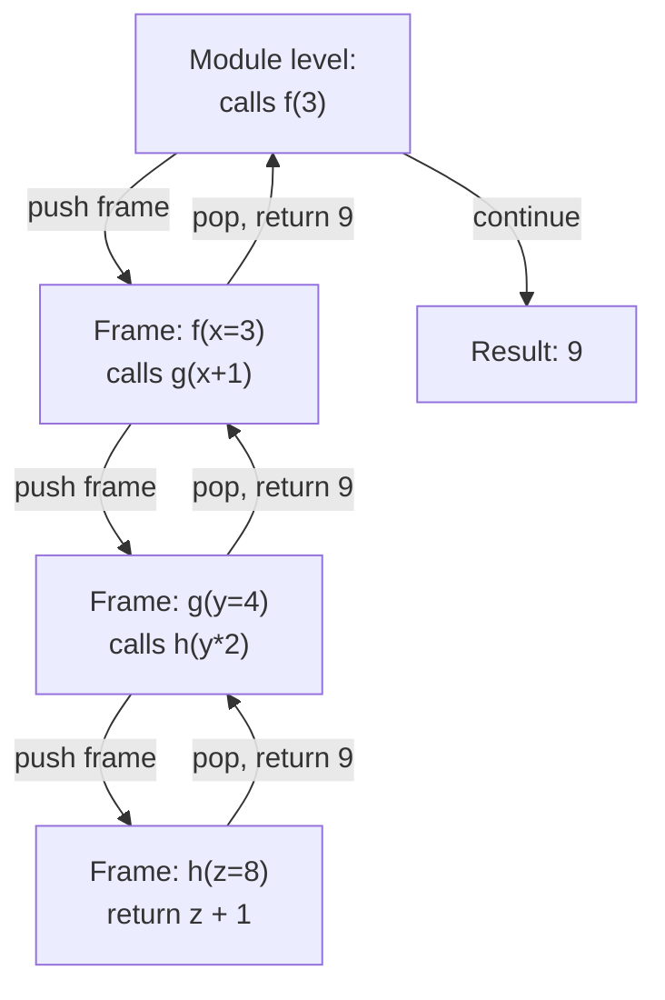

# 1. Function Basics

## Why This Matters

Functions are the most important abstraction in programming. They let you **name** a block of code, **parameterise** it, and **reuse** it. Without functions, every program would be one long script; with functions, you can decompose problems into small, testable, composable units. Python's function model is unusually expressive: functions are **first-class objects** (you can pass them around, store them in variables, return them from other functions), they support **default arguments, keyword arguments, variadic arguments, closures, decorators, and generators**, and they integrate cleanly with type hints and docstrings.

This note covers the foundation: the `def` syntax, function vs. method, functions as first-class objects, return values (including the implicit `None`), multiple return values via tuples, docstrings, and the runtime call-stack model. Later notes in this chapter dive deeper into parameters, defaults, `*args`/`**kwargs`, scope, closures, lambdas, decorators, generators, and type hints.

---

## Background

A Python function is defined with the `def` keyword:

```python
def name(parameters):
    """Optional docstring."""
    body
    return value
```

When you call `name(args)`, Python:

1. Evaluates the arguments.
2. Binds parameter names to the argument values (in the function's local scope).
3. Pushes a new frame onto the call stack.
4. Executes the body.
5. Returns the value of the `return` statement (or `None` if no return).
6. Pops the frame off the call stack.

Functions in Python are **first-class objects**. They have a type (`function`), can be assigned to variables, passed as arguments, returned from other functions, stored in data structures, and inspected at runtime. This is what makes higher-order functions, decorators, and callbacks possible — all of Python's functional and meta-programming features flow from this single design choice.

---

## Defining and Calling

### Basic definition

```python
def greet(name):
    return f"Hello, {name}!"

print(greet("Alice"))   # Hello, Alice!
```

### No parameters

```python
def now_iso():
    from datetime import datetime
    return datetime.now().isoformat()

print(now_iso())
```

### Implicit `None` return

If a function has no `return` statement, or a bare `return`, it returns `None`:

```python
def log(message):
    print(message)

result = log("hi")
print(result)        # None
```

### Multiple return values via tuples

Python doesn't have a built-in multiple-return mechanism, but tuple packing/unpacking makes it feel native:

```python
def min_max(xs):
    return min(xs), max(xs)

lo, hi = min_max([3, 1, 4, 1, 5, 9, 2, 6])
print(lo, hi)        # 1 9
```

The function actually returns a single 2-tuple; the caller unpacks it. You can return any number of values this way:

```python
def stats(xs):
    return len(xs), sum(xs), sum(xs)/len(xs), min(xs), max(xs)

n, total, mean, lo, hi = stats([1, 2, 3, 4, 5])
```

### Early returns

```python
def safe_divide(a, b):
    if b == 0:
        return None
    return a / b
```

Python encourages early returns (guard clauses) over deep nesting.

### Returning nothing vs returning None

`return` (bare) and `return None` are equivalent. Both signal "I'm done, the value is None." Use `return` when the function is for side effects; use `return None` when you explicitly want to indicate "no result."

---

## Function vs. Method

A **function** is defined with `def` at module level (or nested inside another function).

A **method** is a function defined inside a `class` and accessed via an instance. The first parameter (conventionally `self`) receives the instance:

```python
class Counter:
    def __init__(self):
        self.count = 0

    def increment(self):       # method
        self.count += 1
        return self.count

c = Counter()
print(c.increment())           # 1
```

Methods are just functions accessed through a class. `Counter.increment` is a function; `c.increment` is a bound method (with `self` already bound to `c`).

---

## Functions Are First-Class Objects

```python
def square(x):
    return x * x

# Assign to a variable
f = square
print(f(5))           # 25

# Pass as argument
def apply(func, value):
    return func(value)
print(apply(square, 4))    # 16

# Store in a collection
ops = [square, abs, str]
for op in ops:
    print(op(-3))

# Return from another function
def make_multiplier(factor):
    def multiply(x):
        return x * factor
    return multiply

double = make_multiplier(2)
print(double(5))      # 10
```

This is what enables:

- **Higher-order functions**: `map`, `filter`, `sorted` with `key`.
- **Callbacks**: passing a function to be invoked later.
- **Decorators**: wrapping one function with another.
- **Strategy patterns**: selecting behaviour at runtime.
- **Event handlers**: GUI and async frameworks.

### Function attributes

Functions have many useful attributes:

```python
def f(a, b, c=3):
    """Example."""
    return a + b + c

print(f.__name__)          # 'f'
print(f.__doc__)           # 'Example.'
print(f.__defaults__)      # (3,)
print(f.__code__.co_varnames)   # ('a', 'b', 'c')
print(f.__module__)        # '__main__'
```

The `inspect` module gives you even more introspection:

```python
import inspect
print(inspect.signature(f))   # (a, b, c=3)
print(inspect.getsource(f))   # full source text
```

---

## `def` vs `lambda`

A `def` statement creates a named function with a body of one or more statements.

A `lambda` expression creates an anonymous function with a single expression:

```python
def square(x):
    return x * x

square_lambda = lambda x: x * x

print(square(5))           # 25
print(square_lambda(5))    # 25
```

Lambdas are limited to a single expression — no statements (no assignments, no `try`, no `for`/`while`). They're useful for short callbacks but should be replaced with `def` for anything complex. See [[6. Lambda Functions]] for the full treatment.

---

## The Call Stack

When a function is called, Python pushes a **frame** onto the call stack. The frame holds the function's local variables, the value of `self` (for methods), and the return address. When the function returns, the frame is popped.



You can inspect the stack at runtime:

```python
import traceback

def f(): g()
def g(): h()
def h():
    traceback.print_stack()

f()
```

Recursion depth is limited (default 1000); exceeding it raises `RecursionError`:

```python
def infinite():
    return infinite()

infinite()    # RecursionError
```

You can change the limit with `sys.setrecursionlimit(n)`, but doing so risks a C-stack overflow (segfault). Better to refactor to iteration for deep recursion.

---

## Docstrings

Functions should have a docstring as the first statement:

```python
def fetch(url, timeout=10):
    """Fetch a URL and return the response body as text.

    Args:
        url: URL to fetch.
        timeout: Timeout in seconds. Defaults to 10.

    Returns:
        Response body as a string.

    Raises:
        TimeoutError: If the request exceeds ``timeout``.
    """
    ...
```

`help(fetch)` displays the docstring; `fetch.__doc__` accesses it directly; `inspect.getdoc(fetch)` cleans up indentation. See [[6. Comments and Documentation]] in Chapter 1.

---

## Annotated Code Examples

### Example 1: A simple function with default return

```python
def is_even(n):
    """Return True if n is even, False otherwise."""
    return n % 2 == 0

print(is_even(4))   # True
print(is_even(5))   # False
```

### Example 2: Multiple return values

```python
def divide_with_remainder(a, b):
    """Return (quotient, remainder) of a divided by b."""
    if b == 0:
        raise ZeroDivisionError
    return a // b, a % b

q, r = divide_with_remainder(17, 5)
print(q, r)         # 3 2
```

### Example 3: First-class function

```python
def shout(s): return s.upper()
def whisper(s): return s.lower()

def greet(name, formatter):
    return f"Hello, {formatter(name)}!"

print(greet("Alice", shout))      # Hello, ALICE!
print(greet("Bob", whisper))      # Hello, bob!
```

### Example 4: Function as data

```python
ops = {
    "add":      lambda a, b: a + b,
    "subtract": lambda a, b: a - b,
    "multiply": lambda a, b: a * b,
    "divide":   lambda a, b: a / b if b != 0 else float("inf"),
}

print(ops["add"](2, 3))           # 5
print(ops["multiply"](2, 3))      # 6
```

### Example 5: Closure factory

```python
def make_counter():
    count = 0
    def increment():
        nonlocal count
        count += 1
        return count
    return increment

c = make_counter()
print(c(), c(), c())   # 1 2 3
```

See [[5. Scope and Closures]] for the full closure story.

### Example 6: Recursive function

```python
def factorial(n):
    if n < 0:
        raise ValueError("n must be non-negative")
    return 1 if n == 0 else n * factorial(n - 1)

print(factorial(5))   # 120
```

For deep recursion, prefer iteration:

```python
def factorial_iter(n):
    result = 1
    for k in range(2, n + 1):
        result *= k
    return result
```

### Example 7: Function with type hints

```python
def repeat(s: str, n: int) -> str:
    """Return s repeated n times."""
    if n < 0:
        raise ValueError("n must be non-negative")
    return s * n

print(repeat("ab", 3))   # ababab
```

See [[9. Type Hinting for Functions]].

### Example 8: Function with side effect

```python
def log_call(func):
    """Decorator-style: print before calling func."""
    def wrapper(*args, **kwargs):
        print(f"calling {func.__name__}")
        return func(*args, **kwargs)
    return wrapper
```

This is a decorator — see [[7. Decorators]].

---

## Function Objects and Introspection

Functions in Python have many attributes you can read (and some you can write):

```python
def f(a, b, c=3, *args, **kwargs):
    """Add some things."""
    return a + b + c

f.__name__              # 'f' — function name
f.__doc__               # 'Add some things.' — docstring
f.__module__            # '__main__' — defining module
f.__defaults__          # (3,) — default values for positional-or-keyword params
f.__kwdefaults__        # {} — default values for keyword-only params
f.__code__              # code object (bytecode)
f.__code__.co_varnames  # ('a', 'b', 'c', 'args', 'kwargs') — local names
f.__code__.co_argcount  # 3 — number of positional parameters
f.__dict__              # {} — function's attribute namespace (you can add to it)
f.__annotations__       # {'a': ..., 'return': ...} — type hints
f.__globals__           # module's global namespace
f.__closure__           # tuple of cells (or None) — captured variables
```

You can attach custom attributes:

```python
def f(): pass
f.call_count = 0
f.description = "A simple function"
print(f.call_count, f.description)   # 0 A simple function
```

This is sometimes used to attach metadata to functions (though a decorator or class is usually cleaner).

### `inspect` module

```python
import inspect

print(inspect.signature(f))         # (a, b, c=3, *args, **kwargs)
print(inspect.getdoc(f))            # cleaned-up docstring
print(inspect.getsource(f))         # full source text
print(inspect.getsourcefile(f))     # source file path
print(inspect.isfunction(f))        # True
print(inspect.isbuiltin(print))     # True
```

`inspect` is the foundation of frameworks that introspect functions: `argparse` (CLI), FastAPI (HTTP routes), pytest (fixtures), and many more.

## Function Execution Model — A Deeper Look

When `f(a, b, c=3)` is called with `f(1, 2)`:

1. Python evaluates the arguments: `1`, `2` (and the default `3`).
2. A new **frame object** is created.
3. The frame's local namespace is populated: `{'a': 1, 'b': 2, 'c': 3}`.
4. The frame is pushed onto the call stack.
5. The bytecode interpreter executes `f`'s code in this frame.
6. When `return` is hit (or the function ends), the frame is popped.
7. The return value is passed back to the caller.

You can inspect frames with `inspect.currentframe()` and `sys._getframe()` — useful for debugging and metaprogramming.

## Common Pitfalls

### 1. Forgetting `return`

```python
def square(x):
    x * x        # ← no return, returns None

print(square(5))   # None
```

### 2. Returning a tuple when you meant to return multiple values

```python
def stats(xs):
    return (min(xs), max(xs))   # tuple of 2

lo, hi = stats([1, 2, 3])       # OK — unpacking works
result = stats([1, 2, 3])       # result is a tuple (1, 3)
```

Both work — they're the same operation. Just remember the function returns one tuple value.

### 3. Modifying a mutable argument

```python
def add_one(items):
    items.append(1)

xs = [1, 2]
add_one(xs)
print(xs)        # [1, 2, 1] — caller's list mutated
```

See [[2. Parameters and Arguments]] for the pass-by-object-reference semantics.

### 4. Default mutable argument

```python
def add_item(item, items=[]):   #  shared across calls
    items.append(item)
    return items
```

See [[3. Default and Keyword Arguments]] for the fix.

### 5. Late binding in closures

```python
funcs = [lambda: i for i in range(3)]
for f in funcs:
    print(f())   # 2 2 2 — all capture the same `i`
```

See [[5. Scope and Closures]].

### 6. Confusing function reference with function call

```python
def greet(): return "hi"

print(greet)       # <function greet at 0x...>
print(greet())     # hi
```

Without the parens, you have a function object. With parens, you call it.

### 7. Recursion without base case

```python
def infinite(n):
    return infinite(n + 1)

infinite(0)   # RecursionError after ~1000 frames
```

### 8. Forgetting `self` in methods

```python
class C:
    def method(x):       # ← should be (self, x) or (cls, x) for classmethod
        ...
```

### 9. Calling a function with the wrong number of arguments

```python
def f(a, b):
    return a + b

f(1)              # TypeError: missing positional argument 'b'
f(1, 2, 3)        # TypeError: too many positional arguments
```

### 10. Shadowing built-ins

```python
def list(xs):    # ← shadows built-in list()
    return sorted(xs)

list([3, 1, 2])  # works here
list((1, 2, 3))  # works here too, but breaks if you ever need list() elsewhere
```

Avoid naming functions `list`, `dict`, `set`, `id`, `type`, `sum`, `max`, `min`, `str`, `int`, `input`, `print`, etc.

---

## Tips and Tricks

- **Name functions as verbs**: `fetch_user`, `parse_csv`, `compute_total`. Variables are nouns; functions are actions.
- **Keep functions short** — under 30 lines is a common heuristic. If longer, decompose.
- **Single responsibility** — a function should do one thing. If you can't describe it in one sentence, split it.
- **Pure functions are easier to test** — same input always gives same output, no side effects.
- **Use early returns** — guard clauses at the top, happy path at the bottom.
- **Document with docstrings** — `help(f)` should be useful.
- **Use type hints** — even informal ones help readers and tools.
- **Functions are objects** — leverage higher-order functions, but don't over-engineer.
- **Avoid deep recursion** — Python has a 1000-frame default limit; use iteration or `functools.lru_cache` for memoization.
- **`inspect.signature`** lets you introspect parameters programmatically — useful for frameworks and CLI builders.
- **`functools.partial`** lets you fix some arguments, creating a new function — handy for callbacks.
- **Profile before optimising** — use `cProfile` and `timeit`.

---

## Active Recall

1. Write the syntax of a `def` statement and explain each part.
2. What does a function return if it has no `return` statement? What about a bare `return`?
3. How do you "return multiple values" from a Python function? What's actually happening?
4. Explain what "first-class object" means for a Python function. Give three examples of leveraging this.
5. What's the difference between a function and a method?
6. Describe the call stack: what happens when `f` calls `g` calls `h`?
7. What is the default recursion limit, and what error is raised if you exceed it?
8. Why might you prefer iteration over recursion for deep algorithms in Python?
9. Show how to inspect a function's signature at runtime.
10. List five function attributes (`__name__`, `__doc__`, etc.) and what they contain.
11. What is the difference between `greet` and `greet()`?
12. Why is shadowing built-ins like `list` or `id` a bad idea?

---

## Next Steps

- Read [[2. Parameters and Arguments]] for the parameter vs. argument distinction and Python's pass-by-object-reference model.
- Then [[3. Default and Keyword Arguments]] for defaults, keyword-only args, and positional-only args.
- See [[4. args and kwargs]] for variadic arguments.
- See [[5. Scope and Closures]] for LEGB and the closure mechanism.
- See [[6. Lambda Functions]] for anonymous functions.
- See [[7. Decorators]] for higher-order function patterns.
- See [[8. Generators and yield]] for functions that produce sequences lazily.
- See [[9. Type Hinting for Functions]] for type annotations.
