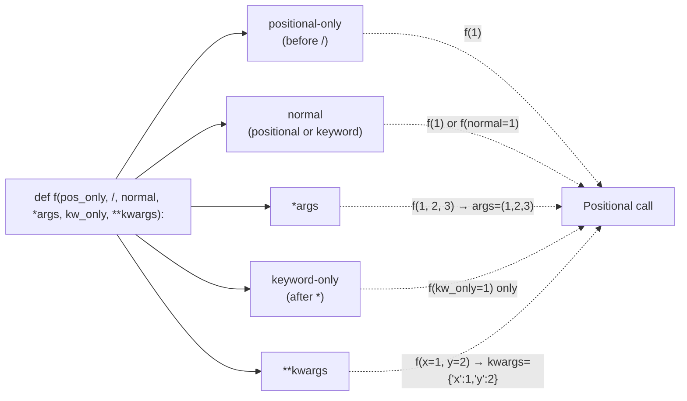

# 3. Default and Keyword Arguments

## Why This Matters

Default arguments and keyword arguments are how Python functions become **flexible** without becoming **overloaded**. In languages like C++ or Java, you'd write multiple overloads of the same function to handle optional parameters; in Python, a single function signature with defaults does the job. Combined with keyword-only arguments (after `*`) and positional-only arguments (before `/`, Python 3.8+), you can express precisely which arguments must be positional, which can be keyword, which have defaults, and which are required.

This note covers default values (and the mutable-default pitfall revisited), keyword arguments in calls, **keyword-only parameters** (a powerful API-design tool), **positional-only parameters** (rare but important for stdlib-style APIs), the rules for mixing them, and the gotchas you'll hit in production.

---

## Background

Python's parameter syntax has evolved. The original model (Python 1.x):

```
def f(a, b, c=3): ...
```

You could have required positional parameters followed by parameters with default values. All parameters could be passed either positionally or by keyword.

Python 3.0 (PEP 3102) added **keyword-only parameters** — parameters that *must* be passed by keyword, signaled by a bare `*` in the signature.

Python 3.8 (PEP 570) added **positional-only parameters** — parameters that *must* be passed positionally, signaled by a bare `/` in the signature.

The full modern signature:

```
def f(pos_only, /, normal, *, kw_only): ...
```

- Before `/`: positional-only.
- Between `/` and `*`: normal (positional or keyword).
- After `*`: keyword-only.

Defaults can be applied to any parameter except pure positional-only-required ones.

---

## Default Values

A default value lets the caller omit an argument:

```python
def greet(name="World", greeting="Hello"):
    return f"{greeting}, {name}!"

greet()                              # Hello, World!
greet("Alice")                       # Hello, Alice!
greet("Alice", "Hi")                 # Hi, Alice!
greet(greeting="Hi")                 # Hi, World!
```

### Rules

1. **Required parameters must come first.** `def f(a=1, b): ...` is a `SyntaxError`.
2. **Default values are evaluated once at definition time** (not on each call). This is the mutable-default trap.
3. **Defaults are stored on `f.__defaults__`** (a tuple) and `f.__kwdefaults__` (a dict for keyword-only).
4. **You can mix positional and keyword** in the call, as long as positional comes first.

### The mutable default trap (revisited)

```python
def f(x=[]):       #  shared list across calls
    x.append(1)
    return x

print(f())    # [1]
print(f())    # [1, 1]
print(f.__defaults__)   # ([1, 1],)
```

Fix: use `None` and create inside the body.

```python
def f(x=None):
    if x is None:
        x = []
    x.append(1)
    return x

print(f())    # [1]
print(f())    # [1]
```

See [[2. Parameters and Arguments]] for the full discussion.

---

## Keyword Arguments in Calls

You can name arguments at the call site, in any order:

```python
def create_user(name, email, role="user", active=True):
    return {"name": name, "email": email, "role": role, "active": active}

create_user("Alice", "alice@example.com")               # all positional
create_user("Bob", "bob@example.com", role="admin")     # mix
create_user("Carol", "carol@example.com", active=False) # mix
create_user("Dave", "dave@example.com", active=False, role="admin")  # keyword order can differ
create_user(email="eve@example.com", name="Eve")        # all keyword
```

### Why use keyword arguments?

1. **Readability.** `create_user("Alice", "alice@example.com", role="admin")` is clearer than `create_user("Alice", "alice@example.com", "admin", True)`.
2. **Order independence.** You can pass `active=False` without filling in `role`.
3. **Forward compatibility.** Adding a new parameter with a default doesn't break callers.
4. **Self-documenting.** `time.sleep(2)` vs `time.sleep(delay=2)` — the latter tells you what 2 means.

### Forcing keyword arguments

Forcing the caller to use keywords is a powerful API-design tool. It makes code more readable and prevents bugs where someone accidentally passes a positional that gets bound to the wrong parameter. There are two ways:

- **Bare `*` in the signature**: everything after `*` is keyword-only.
- **`*args`**: everything after `*args` is keyword-only.

```python
def connect(host, port, *, timeout=30, retry=3, ssl=True):
    ...

connect("localhost", 8080)                       # OK
connect("localhost", 8080, timeout=10)           # OK
connect("localhost", 8080, 10)                   # TypeError — `timeout` is keyword-only
connect("localhost", 8080, ssl=False, retry=5)   # OK — order doesn't matter for keywords
```

This is why many stdlib functions (e.g., `sorted(iterable, *, key=None, reverse=False)`) use `*`: to prevent callers from accidentally passing `key` as the second positional argument.

---

## Keyword-Only Parameters

```python
def f(a, b, *, c, d=10):
    print(a, b, c, d)

f(1, 2, c=3)         # 1 2 3 10
f(1, 2, c=3, d=4)    # 1 2 3 4
f(1, 2, 3)           # TypeError — 'c' is keyword-only
```

`c` and `d` are keyword-only. They must be passed by name.

### With `*args`

```python
def f(*args, option="default"):
    print(args, option)

f(1, 2, 3)                # (1, 2, 3) default
f(1, 2, 3, option="x")    # (1, 2, 3) x
f(1, 2, 3, "x")           # TypeError — 'option' is keyword-only
```

After `*args`, everything must be keyword.

### Why keyword-only?

- **Clarity at call site**: `f(x, y, key=42)` reads better than `f(x, y, 42)`.
- **Refactoring safety**: You can reorder keyword-only parameters without breaking callers.
- **Preventing positional ambiguity**: When a function has many flags, positional passing is dangerous.

---

## Positional-Only Parameters (Python 3.8+)

A bare `/` in the signature marks the end of positional-only parameters:

```python
def f(a, b, /, c, d=10):
    print(a, b, c, d)

f(1, 2, 3)            # OK — a=1, b=2, c=3
f(1, 2, c=3)          # OK
f(1, 2, 3, d=4)       # OK
f(a=1, b=2, c=3)      # TypeError — a and b are positional-only
```

`a` and `b` are positional-only — they cannot be passed by keyword. `c` and `d` can be either.

### Why positional-only?

1. **Parameter name freedom.** You can rename `a` to `x` later without breaking callers who used `a=1` (since they couldn't have).
2. **Performance.** Slightly faster argument binding (no keyword lookup).
3. **Matching built-in semantics.** Many built-ins (`len`, `pow`, `int`) have positional-only parameters; PEP 570 let stdlib authors express this in pure Python.
4. **Preventing keyword-name conflicts.** If a function takes `**kwargs`, a positional-only parameter named `kwargs` is unambiguous.

### Full syntax

```python
def f(a, b, /, c, d, *, e, f):
    ...
```

- `a, b`: positional-only.
- `c, d`: positional or keyword.
- `e, f`: keyword-only.

This is the complete parameter-kind spectrum.

---

## Argument Kinds Diagram



### Full signature example

```python
def f(a, b=2, /, c=3, d=4, *args, e=5, f=6, **kwargs):
    print(f"a={a} b={b} c={c} d={d} args={args} e={e} f={f} kwargs={kwargs}")

f(1)                              # a=1 b=2 c=3 d=4 args=() e=5 f=6 kwargs={}
f(1, 20, 30, 40, 50, 60, e=70, x=99)
# a=1 b=20 c=30 d=40 args=(50, 60) e=70 f=6 kwargs={'x': 99}
```

Walking through that call:

- `1` → `a` (positional-only)
- `20` → `b` (positional-only)
- `30` → `c` (normal positional)
- `40` → `d` (normal positional)
- `50, 60` → `*args` (variadic positional)
- `e=70` → `e` (keyword-only)
- `x=99` → `**kwargs` (variadic keyword)

---

## Annotated Code Examples

### Example 1: Defaults for optional config

```python
def send_email(to, subject, body, *, cc=None, bcc=None, priority=3):
    """Send an email. cc/bcc/priority must be keyword arguments."""
    msg = {"to": to, "subject": subject, "body": body, "priority": priority}
    if cc:  msg["cc"]  = cc
    if bcc: msg["bcc"] = bcc
    return msg

send_email("alice@example.com", "Hi", "Hello there")
send_email("alice@example.com", "Hi", "Hello there", cc="bob@example.com", priority=1)
```

### Example 2: Keyword-only for clarity

```python
def split(items, *, into=2):
    """Split items into `into` chunks. `into` is keyword-only."""
    k, m = divmod(len(items), into)
    return [items[i*k+min(i, m):(i+1)*k+min(i+1, m)] for i in range(into)]

split([1,2,3,4,5])               # [[1,2,3],[4,5]]   (default 2)
split([1,2,3,4,5,6], into=3)     # [[1,2],[3,4],[5,6]]
split([1,2,3], 3)                # TypeError — `into` is keyword-only
```

### Example 3: Positional-only for refactorability

```python
def pow(base, exp, /):
    """base and exp are positional-only — names can change later."""
    return base ** exp

pow(2, 10)       # 1024
pow(base=2, exp=10)   # TypeError
```

### Example 4: Mutable default fix

```python
def add_user(name, users=None):
    if users is None:
        users = []
    users.append(name)
    return users

print(add_user("Alice"))   # ['Alice']
print(add_user("Bob"))     # ['Bob']
print(add_user("Carol", ["Alice", "Bob"]))   # ['Alice', 'Bob', 'Carol']
```

### Example 5: Forcing keyword for boolean flags

```python
def create_server(host, port, *, ssl=False, verbose=False):
    ...

create_server("localhost", 8080, ssl=True)
# vs. the ambiguous:
# create_server("localhost", 8080, True, False)  ← which is which?
```

### Example 6: Mixing all kinds

```python
def process(data, /, transform=None, *, reverse=False, limit=None, **meta):
    """Process `data` with optional transform."""
    items = list(data)
    if transform:
        items = [transform(x) for x in items]
    if reverse:
        items.reverse()
    if limit is not None:
        items = items[:limit]
    return items, meta

result, info = process([1, 2, 3], lambda x: x*2, reverse=True, user="alice")
print(result, info)   # [6, 4, 2] {'user': 'alice'}
```

---

## Why Keyword-Only Arguments Matter for API Design

When you design a public API, keyword-only arguments are a powerful tool. They let you:

1. **Add parameters later** without breaking positional callers.
2. **Reorder keyword-only parameters** without breaking callers.
3. **Make intent explicit** at the call site.
4. **Prevent silent positional mistakes**.

Consider this function:

```python
def create_user(name, email, *, send_welcome=True, role="user", active=True):
    ...
```

Callers must use keywords for `send_welcome`, `role`, `active`. This:

```python
create_user("Alice", "alice@example.com", True, "admin", False)
```

is impossible — they must write:

```python
create_user("Alice", "alice@example.com", send_welcome=True, role="admin", active=False)
```

The keyword version is self-documenting. When you read it six months later, you know exactly what each boolean means.

The stdlib uses this pattern widely:

```python
sorted(iterable, *, key=None, reverse=False)
print(*objects, sep=' ', end='\n', file=sys.stdout, flush=False)
json.dumps(obj, *, skipkeys=False, ensure_ascii=True, ...)
```

Every parameter after `*` is keyword-only. This is why `sorted([1,2,3], None)` is a `TypeError` — `key` is keyword-only.

## Why Positional-Only Parameters Matter

Positional-only parameters (Python 3.8+) matter for:

1. **Refactoring parameter names** without breaking callers.
2. **Allowing `**kwargs` to capture a name that matches a parameter** without conflict.
3. **Performance** (slightly faster argument binding).
4. **Matching built-in semantics**.

Example: `int("10", base=2)` works, but `int("10", 2)` also works, and `int(x="10", base=2)` raises `TypeError` because `x` is positional-only.

```python
def int_my(x, /, base=10):
    return int(x, base)

int_my("10")         # OK
int_my("10", 2)      # OK
int_my("10", base=2) # OK
int_my(x="10")       # TypeError — x is positional-only
```

## Default Argument Gotchas Summary

1. **Mutable defaults** are shared across calls — use `None`.
2. **Defaults are evaluated at def time**, not call time. Don't use `time.time()` or `datetime.now()` as defaults.
3. **Defaults cannot reference other parameters** — use `None` and compute inside.
4. **`__defaults__` exposes mutable defaults** — anyone can mutate them.
5. **Default values are part of the API** — changing them is a backwards-incompatible change.

## Common Pitfalls

### 1. Mutable default arguments

Covered above and in [[2. Parameters and Arguments]]. Use `None`.

### 2. Required-after-default

```python
def f(a=1, b): ...    # SyntaxError
def f(a, b=1): ...    # OK
```

Required parameters cannot follow optional ones.

### 3. Forgetting the `*` for keyword-only

```python
def f(a, b, c): ...
f(1, 2, 3)         # works
f(1, 2, c=3)       # works
# `c` is not keyword-only — caller can pass positionally.
```

If you want `c` keyword-only, write `def f(a, b, *, c): ...`.

### 4. Keyword-only with no default

```python
def f(a, *, b): ...
f(1)         # TypeError — missing 'b'
f(1, 2)      # TypeError — 'b' is keyword-only
f(1, b=2)    # OK
```

### 5. Positional-only with default

```python
def f(a=1, /): ...    # OK — positional-only with default
f()        # OK
f(2)       # OK
f(a=2)     # TypeError
```

### 6. Using mutable defaults for caching

Some people *intentionally* use mutable defaults as a cache:

```python
def fib(n, cache={}):
    if n in cache: return cache[n]
    cache[n] = n if n < 2 else fib(n-1) + fib(n-2)
    return cache[n]
```

This works (the dict is shared across calls) but is fragile: the cache can't be cleared, and `fib.__defaults__` exposes it. Use `functools.lru_cache` instead.

### 7. Forgetting that defaults are evaluated once

```python
import time
def f(t=time.time()): ...   # `t` is fixed at definition time!
```

If you want "now" on each call, use `None` and check inside.

### 8. Keyword arguments to the wrong parameter

```python
def f(a, b): ...
f(a=1, c=2)    # TypeError: unexpected keyword 'c'
```

### 9. Mixing positional and keyword incorrectly

```python
def f(a, b): ...
f(1, b=2)     # OK
f(a=1, 2)     # SyntaxError — positional after keyword
```

### 10. Misreading `*` and `/` in signatures

If you see `def f(a, /, b, *, c):`, parse it as:
- `a`: positional-only
- `b`: normal
- `c`: keyword-only

Practice reading these — they appear in stdlib signatures (e.g., `dict`, `range`, `int`).

---

## Tips and Tricks

- **Use keyword-only for flags and options** — makes calls self-documenting.
- **Use positional-only for parameters that are conceptually "the input"** (like `x` in `len(x)`).
- **Use `None` as a sentinel for mutable defaults** — every time.
- **Document defaults in the docstring** — `Args:` section.
- **Consider `functools.partial`** to fix defaults at call time: `double = partial(mul, 2)`.
- **`inspect.signature(f)`** to see the parameter kinds at runtime.
- **Type-hint defaults**: `def f(x: int = 0): ...` — see [[9. Type Hinting for Functions]].
- **Refactor long parameter lists** into a dataclass: `def f(config: ServerConfig): ...`.
- **Don't overuse keyword-only** — required positional parameters are fine for short lists.
- **Beware `**kwargs` typo-safety** — typos in keyword arg names raise `TypeError` immediately, which is good.

---

## Active Recall

1. Write a function with a positional-only parameter, a normal parameter, and a keyword-only parameter.
2. How do you force a parameter to be keyword-only? Give one reason to do so.
3. How do you force a parameter to be positional-only (Python 3.8+)? Give one reason.
4. Why does `def f(a=1, b): ...` raise a `SyntaxError`?
5. Show the mutable default argument bug and the canonical fix.
6. Where are default values stored on a function object?
7. When are default values evaluated — at definition time or call time?
8. Write a function that uses `*` to mark all subsequent parameters as keyword-only.
9. Show a call that mixes positional and keyword arguments correctly.
10. Why is `def f(host, port, *, ssl=False)` safer than `def f(host, port, ssl=False)`?
11. What's the rule for argument order in a function signature? (Positional-only, normal, *args, kw-only, **kwargs.)
12. How does `inspect.signature` represent the four parameter kinds?

---

## Next Steps

- Read [[4. args and kwargs]] for `*args` and `**kwargs` in depth.
- See [[2. Parameters and Arguments]] for the parameter/argument distinction and pass-by-object-reference.
- See [[5. Scope and Closures]] for how parameters bind to local scope.
- See [[9. Type Hinting for Functions]] for annotating defaults and keyword-only parameters.
- For dataclass-based config objects (an alternative to long parameter lists), see Chapter 8 ([[1. Object-Oriented Programming]]).
