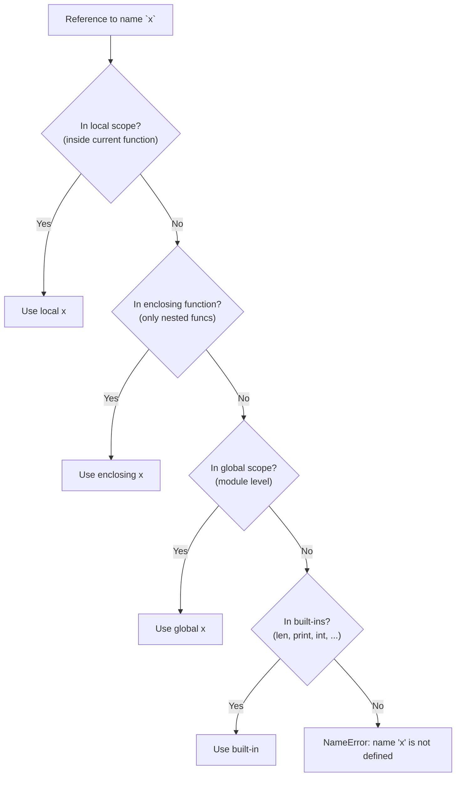

# 5. Scope and Closures

## Why This Matters

Every variable in Python lives in a **scope** — a namespace where it's visible. Understanding scope is the difference between code that reads naturally and code that produces `UnboundLocalError`, `NameError`, or "why did this variable change?" bugs. Python's scope rules follow the **LEGB** order (Local, Enclosing, Global, Built-in), and the language provides two keywords — `global` and `nonlocal` — to write to outer scopes deliberately.

Closures — functions that "remember" the variables of their enclosing scope — are a direct consequence of LEGB. Closures power decorators, function factories, partial application, callbacks, and many functional-programming patterns. But closures have subtle pitfalls: **late binding in lambdas**, accidental sharing of closure variables, and confusion about when `nonlocal` is needed. This note covers LEGB, `global`/`nonlocal`, closure mechanics, and the gotchas.

---

## Background

A **scope** is a region of code where a name is visible. Python has four scope levels, in lookup order:

1. **L — Local**: inside the current function.
2. **E — Enclosing**: inside enclosing function definitions (only for nested functions).
3. **G — Global**: at module level.
4. **B — Built-in**: `len`, `print`, `int`, `True`, `None`, etc.

When you reference a name, Python searches L → E → G → B and uses the first match. If none matches, you get `NameError`.

When you **assign** to a name (`x = ...`), Python creates a local variable in the current function (unless `global` or `nonlocal` is declared). This is the source of the classic `UnboundLocalError`.

---

## The LEGB Rule



### Local scope

```python
def f():
    x = 10        # local
    print(x)
f()               # 10
print(x)          # NameError — x is local to f
```

### Enclosing scope (nested functions)

```python
def outer():
    x = 10
    def inner():
        print(x)   # finds x in enclosing scope
    inner()
outer()            # 10
```

### Global scope

```python
x = 10            # module-level (global)

def f():
    print(x)      # finds x in global scope
f()               # 10
```

### Built-in scope

```python
def f():
    print(len)    # finds len in built-in scope
f()               # <built-in function len>
```

### Shadowing

A name in an inner scope shadows outer names:

```python
x = "global"
def f():
    x = "local"
    print(x)      # local

f()               # local
print(x)          # global — unchanged
```

---

## Assignment and `UnboundLocalError`

When you **assign** to a name inside a function, Python treats that name as **local for the entire function** — even if there's a global with the same name. This is determined at compile time, not runtime.

```python
x = 10
def f():
    print(x)      #  UnboundLocalError
    x = 20
f()
```

Even though `print(x)` comes before `x = 20`, Python sees the assignment and decides `x` is local throughout `f`. When `print(x)` runs, `x` hasn't been bound yet → `UnboundLocalError`.

### Fix 1: Use `global`

```python
x = 10
def f():
    global x
    print(x)      # 10
    x = 20
f()
print(x)          # 20
```

`global x` tells Python: "in this function, `x` refers to the module-level `x`, not a local one."

### Fix 2: Don't rebind; mutate

```python
x = [10]
def f():
    print(x[0])   # 10 — reading from global x is fine
    x[0] = 20     # mutation — not rebinding
f()
print(x)          # [20]
```

Mutating a global doesn't require `global` — only rebinding does.

> [!warning] Avoid `global` in real code
> Globals are a common source of bugs and make code hard to test. Prefer:
> - Pass values as arguments.
> - Return values from functions.
> - Wrap state in a class.
> Use `global` only for genuine module-level configuration (and even then, prefer a config object).

---

## `global` and `nonlocal`

### `global`

Declares that a name refers to a module-level variable. Used to **rebind** globals from inside a function:

```python
counter = 0

def increment():
    global counter
    counter += 1

increment()
increment()
print(counter)    # 2
```

### `nonlocal`

Declares that a name refers to a variable in an **enclosing function scope** (not global, not local). Used in closures:

```python
def make_counter():
    count = 0
    def increment():
        nonlocal count
        count += 1
        return count
    return increment

c = make_counter()
print(c(), c(), c())   # 1 2 3
```

Without `nonlocal`, the `count += 1` would create a new local `count`, leaving the enclosing one untouched (and the increment wouldn't persist between calls).

`nonlocal` was added in Python 3. In Python 2, you had to use a mutable container (like a 1-element list) to simulate it.

### `nonlocal` cannot reach globals

```python
x = 10
def f():
    nonlocal x     # SyntaxError: no binding for nonlocal 'x' found
    ...
```

`nonlocal` only finds enclosing function scopes, not module scope. Use `global` for that.

---

## Closures

A **closure** is a function that retains access to variables from its enclosing scope, even after the enclosing function has returned. The function "closes over" the free variables.

```python
def make_multiplier(factor):
    def multiply(x):
        return x * factor    # `factor` is the closed-over variable
    return multiply

double = make_multiplier(2)
triple = make_multiplier(3)

print(double(5))   # 10
print(triple(5))   # 15
```

Each call to `make_multiplier` creates a fresh `factor` variable, and the returned `multiply` function remembers its own `factor`. That's why `double` and `triple` work independently.

### What's in a closure?

```python
print(double.__closure__)         # (<cell at 0x...>,)
print(double.__closure__[0].cell_contents)   # 2
print(triple.__closure__[0].cell_contents)   # 3
```

Each closure has a `__closure__` attribute — a tuple of "cells," each holding a closed-over variable. The closure function references these cells, not the original scope.

### When are closures useful?

1. **Function factories** — `make_multiplier`, `make_adder`, `make_logger`.
2. **Decorators** — the wrapper closes over the decorated function.
3. **Callbacks** — GUI/async handlers that capture state.
4. **Partial application** — fixing some arguments of a function.
5. **State encapsulation** — like a class but using functions.

### State encapsulation via closures

```python
def make_account(balance=0):
    """A bank account implemented as a closure."""
    def deposit(amount):
        nonlocal balance
        balance += amount
        return balance
    def withdraw(amount):
        nonlocal balance
        if amount > balance:
            raise ValueError("insufficient funds")
        balance -= amount
        return balance
    def get_balance():
        return balance
    return SimpleNamespace(deposit=deposit, withdraw=withdraw, get_balance=get_balance)

acc = make_account(100)
print(acc.deposit(50))     # 150
print(acc.withdraw(30))    # 120
print(acc.get_balance())   # 120
```

The `balance` variable is not directly accessible — only through the closure's methods. This is "private state via closure," an alternative to classes.

---

## Late Binding in Lambdas (Pitfall)

Closures capture **variables**, not values. If the variable changes after the closure is created, the closure sees the new value.

```python
funcs = []
for i in range(3):
    funcs.append(lambda: i)

for f in funcs:
    print(f())    # 2 2 2  ← not 0 1 2!
```

All three lambdas close over the same `i` variable. By the time they're called, the loop has finished and `i` is 2.

### Fix 1: Default argument

```python
funcs = [lambda i=i: i for i in range(3)]
for f in funcs: print(f())   # 0 1 2
```

The default argument `i=i` captures the value at lambda-creation time.

### Fix 2: Use a factory function

```python
def make_func(i):
    return lambda: i

funcs = [make_func(i) for i in range(3)]
for f in funcs: print(f())   # 0 1 2
```

Each call to `make_func` creates a fresh `i` binding.

### Fix 3: `functools.partial`

```python
from functools import partial
funcs = [partial(lambda i: i, i) for i in range(3)]
for f in funcs: print(f())   # 0 1 2
```

This pitfall applies to nested functions too, not just lambdas. Any closure that captures a loop variable will see the final value unless you bind explicitly.

---

## Annotated Code Examples

### Example 1: LEGB lookup

```python
x = "global"

def outer():
    x = "enclosing"
    def inner():
        x = "local"
        print(x)   # local
    inner()
    print(x)       # enclosing

outer()
print(x)           # global
```

### Example 2: Reading without `global`

```python
PI = 3.14159

def area(r):
    return PI * r * r    # reads global PI without `global`

print(area(2))    # 12.566
```

### Example 3: Writing with `global`

```python
call_count = 0

def f():
    global call_count
    call_count += 1

f(); f(); f()
print(call_count)   # 3
```

### Example 4: Counter via closure and `nonlocal`

```python
def make_counter(start=0):
    count = start
    def increment():
        nonlocal count
        count += 1
        return count
    return increment

c1 = make_counter()
c2 = make_counter(100)
print(c1(), c1(), c1())   # 1 2 3
print(c2(), c2())         # 101 102
```

### Example 5: Late binding bug

```python
# Buggy
buttons = []
for i in range(3):
    buttons.append(lambda: print(f"button {i} clicked"))
for b in buttons: b()
# button 2 clicked
# button 2 clicked
# button 2 clicked

# Fixed
buttons = [lambda i=i: print(f"button {i} clicked") for i in range(3)]
for b in buttons: b()
# button 0 clicked
# button 1 clicked
# button 2 clicked
```

### Example 6: Closure inspection

```python
def make_adder(n):
    def adder(x):
        return x + n
    return adder

add5 = make_adder(5)
print(add5.__closure__)                  # (<cell at 0x...>,)
print(add5.__closure__[0].cell_contents) # 5
```

### Example 7: Encapsulating state

```python
def make_stack():
    items = []
    def push(x): items.append(x)
    def pop():
        if not items:
            raise IndexError("pop from empty stack")
        return items.pop()
    def peek():
        return items[-1] if items else None
    def size(): return len(items)
    return type("Stack", (), {
        "push": push, "pop": pop, "peek": peek, "size": size
    })()

s = make_stack()
s.push(1); s.push(2)
print(s.pop(), s.peek(), s.size())   # 2 1 1
```

### Example 8: Module-level singleton via closure

```python
def get_config():
    config = {"debug": False, "timeout": 30}
    def get(key): return config[key]
    def set(key, value): config[key] = value
    return get, set

get, set = get_config()
print(get("debug"))   # False
set("debug", True)
print(get("debug"))   # True
```

---

## Common Pitfalls

### 1. `UnboundLocalError` from assignment in function

```python
x = 10
def f():
    print(x)    # UnboundLocalError
    x = 20
```

Python sees the assignment and treats `x` as local throughout. Use `global` (or move the assignment).

### 2. Late binding in lambdas

Covered above. Use default args or a factory function.

### 3. Forgetting `nonlocal`

```python
def make_counter():
    count = 0
    def inc():
        count += 1    # UnboundLocalError — `count` is treated as local
        return count
    return inc
```

Add `nonlocal count`.

### 4. `nonlocal` doesn't reach globals

```python
x = 10
def f():
    nonlocal x    # SyntaxError
    ...
```

Use `global` for module-level names.

### 5. Shared closure state

```python
def make_funcs():
    state = []
    def f1(): state.append(1); return state
    def f2(): state.append(2); return state
    return f1, f2

f1, f2 = make_funcs()
print(f1())   # [1]
print(f2())   # [1, 2]   ← shared state!
```

If you don't want sharing, give each closure its own state.

### 6. Closure cell vs. value

```python
funcs = []
for i in range(3):
    state = {"i": i}
    funcs.append(lambda: state["i"])

for f in funcs: print(f())   # 2 2 2 — same bug, just with a dict
```

The dict is rebound each iteration but the lambda reads `state["i"]` at call time.

### 7. Modifying enclosing list (mutation, not rebinding)

```python
def outer():
    items = []
    def inner():
        items.append(1)    # works — mutation, not rebinding
    inner()
    print(items)
outer()   # [1]
```

Mutating a closed-over variable doesn't need `nonlocal`. Only rebinding does.

### 8. Reading global from a method

```python
class C:
    def method(self):
        print(x)   # reads global x — usually a code smell

x = 10
C().method()   # 10
```

Methods reading globals is usually a sign of bad design. Pass dependencies as arguments.

### 9. Built-in shadowing

```python
def f():
    list = [1, 2, 3]   # shadows built-in `list` in this scope
    print(list)        # OK — local list
    print(list([4, 5])) # NameError... actually no, list is local!
                       # Actually: TypeError — 'list' object is not callable
```

Don't shadow built-ins.

### 10. Comprehension scope

```python
[x for x in range(3)]
print(x)   # NameError — comprehension variables don't leak (Python 3)
```

In Python 2, they did. In Python 3, list comprehension variables are scoped to the comprehension.

---

## Tips and Tricks

- **Avoid `global` in real code** — pass values as arguments or wrap state in a class.
- **Use `nonlocal` only in closures** that genuinely need to update enclosing state.
- **Closures are powerful but opaque** — classes are usually clearer for non-trivial state.
- **Watch for late binding** in loops that build lambdas or callbacks.
- **`__closure__` lets you inspect** what a function closed over — useful for debugging.
- **Mutable default arguments** are sometimes used as "static" closure state — fragile, prefer a closure or class.
- **`functools.partial`** is often cleaner than a hand-written closure for partial application.
- **Closures enable decorators** — see [[7. Decorators]].
- **Closures are how `lru_cache` and similar wrappers maintain state**.
- **Keep functions small** — long functions with complex scope rules are hard to reason about.

---

## Active Recall

1. What does LEGB stand for? Give an example of each scope level.
2. Why does this raise `UnboundLocalError`?
   ```python
   x = 10
   def f():
       print(x)
       x = 20
   ```
3. When do you need `global`? When do you need `nonlocal`?
4. What's the difference between reading a global and rebinding a global?
5. What is a closure? Give an example.
6. What's in `f.__closure__`?
7. Explain the late-binding-in-lambdas bug and three ways to fix it.
8. Why does `nonlocal x` fail if `x` is a module-level variable?
9. Show how to implement a counter using a closure and `nonlocal`.
10. Why don't list comprehension variables leak into the enclosing scope in Python 3?
11. When does mutation of a closed-over variable not require `nonlocal`?
12. Why is `global` considered a code smell in production code?

---

## Next Steps

- Read [[6. Lambda Functions]] for the interplay between lambdas and closures (and the late-binding bug).
- See [[7. Decorators]] — decorators are the killer app of closures.
- See [[1. Function Basics]] for the function-as-first-class-object foundation.
- See [[4. args and kwargs]] for forwarding patterns that interact with scope.
- For OOP-based state encapsulation (an alternative to closures), see Chapter 8 ([[1. Object-Oriented Programming]]).
