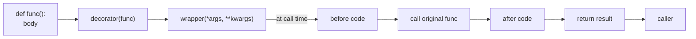
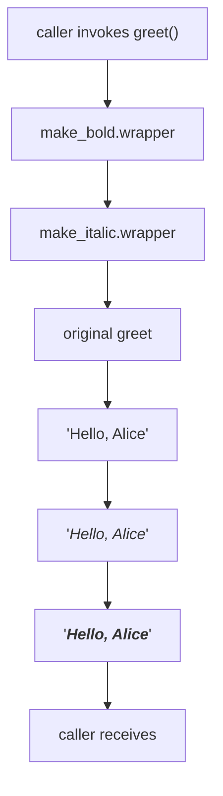

# 7. Decorators

## Why This Matters

Decorators are one of Python's most elegant and powerful features. A decorator lets you **wrap one function with another** — adding behaviour before, after, or around the original — without modifying the original's source code. This is the foundation of caching (`@functools.lru_cache`), property accessors (`@property`), class methods (`@classmethod`), data classes (`@dataclass`), web routes (`@app.route`), test fixtures (`@pytest.fixture`), context managers (`@contextmanager`), and hundreds of other patterns.

This note expands on the foundational Decorators concept (covered briefly in the source `Python/DSA/Decorators.md` at lines 5082–5197 of the master project file) by going deeper into the runtime mechanics, decorator factories (decorators with arguments), class-based decorators, stacked decorators, built-in decorators, and the pitfalls around `functools.wraps`. Once you understand decorators, you'll see Python's metaprogramming model in a new light — and you'll be ready to write your own frameworks.

---

## Background

A **decorator** is a function (or class) that takes another function (or class) as input and returns a new function (or class) that usually wraps the original. Because Python functions are first-class objects (see [[1. Function Basics]]), this is straightforward.

The `@decorator` syntax is **syntactic sugar**:

```python
@decorator
def func():
    pass

# Equivalent to:
def func():
    pass
func = decorator(func)
```

The decorator is applied at **definition time** (when the `def` statement runs), not at call time. The original `func` name is rebound to whatever the decorator returns.



---

## Basic Decorator

```python
def my_decorator(func):
    def wrapper():
        print("Before the function runs")
        func()
        print("After the function runs")
    return wrapper

@my_decorator
def say_hello():
    print("Hello!")

say_hello()
# Before the function runs
# Hello!
# After the function runs
```

`@my_decorator` is equivalent to `say_hello = my_decorator(say_hello)`. The original `say_hello` is replaced by `wrapper`.

### Why functions need to be first-class

Decorators rely on:

- Functions being **passable as arguments** (`my_decorator(func)`).
- Functions being **returnable** (`return wrapper`).
- Closures capturing the `func` parameter (see [[5. Scope and Closures]]).

Without these, decorators would be impossible. With them, the whole feature is just a convention plus some sugar.

---

## `functools.wraps` — Preserve Metadata

The wrapper function replaces the original. By default, the wrapper has its own `__name__`, `__doc__`, `__module__`, etc., which breaks introspection, help systems, and debugging.

```python
def my_decorator(func):
    def wrapper(*args, **kwargs):
        return func(*args, **kwargs)
    return wrapper

@my_decorator
def greet(name):
    """Greet someone."""
    return f"Hello, {name}"

print(greet.__name__)   # 'wrapper'     ← not 'greet'
print(greet.__doc__)    # None          ← lost the docstring
```

The fix is `functools.wraps`, which copies metadata from `func` to `wrapper`:

```python
from functools import wraps

def my_decorator(func):
    @wraps(func)            # ← decorator on the wrapper
    def wrapper(*args, **kwargs):
        return func(*args, **kwargs)
    return wrapper

@my_decorator
def greet(name):
    """Greet someone."""
    return f"Hello, {name}"

print(greet.__name__)   # 'greet'
print(greet.__doc__)    # 'Greet someone.'
print(greet.__wrapped__)  # <function greet at 0x...> — original, accessible
```

`wraps` also sets `__wrapped__` to the original function, so you can "unwrap" if needed.

> [!warning] Always use `@functools.wraps(func)` on your wrappers
> Without it, decorated functions lose their identity. `help(decorated_func)` shows the wrapper's docstring, tracebacks show the wrapper's name, and tools like `inspect.signature` return the wrapper's signature. Just add the decorator — it's a one-line fix.

---

## Decorators with Arguments (Decorator Factories)

Sometimes you want to parameterise a decorator: `@repeat(3)` instead of `@repeat`. To do this, the decorator needs to be **a function that returns a decorator** — a "decorator factory."

The pattern is **three levels of nesting**:

```python
from functools import wraps

def repeat(times):                       # Level 1: factory — takes the argument
    def decorator(func):                 # Level 2: decorator — takes the function
        @wraps(func)
        def wrapper(*args, **kwargs):    # Level 3: wrapper — called in place of func
            result = None
            for _ in range(times):
                result = func(*args, **kwargs)
            return result
        return wrapper
    return decorator

@repeat(3)
def greet(name):
    print(f"Hello, {name}")

greet("Alice")
# Hello, Alice
# Hello, Alice
# Hello, Alice
```

The call chain when defining:

1. `repeat(3)` is called → returns `decorator`.
2. `decorator(greet)` is called → returns `wrapper`.
3. `greet` is rebound to `wrapper`.

When calling `greet("Alice")`, Python calls `wrapper("Alice")`, which calls the original `greet` three times.

### Why three levels?

- Level 1 (factory): consumes the decorator arguments.
- Level 2 (decorator): consumes the function being decorated.
- Level 3 (wrapper): consumes the call arguments and runs the wrapped behaviour.

The three-level structure is awkward but unavoidable for parameterised decorators. With experience it becomes a familiar pattern.

### Optional arguments

If you want `@repeat` (no args) and `@repeat(3)` to both work, you need to detect whether the first argument is a function:

```python
def repeat(func=None, *, times=3):
    def decorator(fn):
        @wraps(fn)
        def wrapper(*args, **kwargs):
            result = None
            for _ in range(times):
                result = fn(*args, **kwargs)
            return result
        return wrapper

    if func is None:
        return decorator        # called with arguments: @repeat(times=5)
    else:
        return decorator(func)  # called without: @repeat

@repeat
def f(): ...                    # repeats 3 times (default)

@repeat(times=5)
def g(): ...                    # repeats 5 times
```

This is the pattern used by `@lru_cache`, `@dataclass`, and similar stdlib decorators.

---

## Class-Based Decorators

A class with `__call__` can also be a decorator. This is useful when you need to maintain state across calls:

```python
class CountCalls:
    def __init__(self, func):
        self.func = func
        self.count = 0
        wraps(func)(self)        # copy metadata onto self

    def __call__(self, *args, **kwargs):
        self.count += 1
        print(f"Call {self.count} of {self.func.__name__}")
        return self.func(*args, **kwargs)

@CountCalls
def say_hi():
    print("Hi!")

say_hi()    # Call 1 of say_hi / Hi!
say_hi()    # Call 2 of say_hi / Hi!
say_hi()    # Call 3 of say_hi / Hi!
print(say_hi.count)   # 3
```

`__call__` makes the instance callable, so it can replace the original function. State lives on the instance.

### Class-based decorator with arguments

```python
class Repeat:
    def __init__(self, times):
        self.times = times

    def __call__(self, func):
        @wraps(func)
        def wrapper(*args, **kwargs):
            result = None
            for _ in range(self.times):
                result = func(*args, **kwargs)
            return result
        return wrapper

@Repeat(3)
def greet(name):
    print(f"Hello, {name}")

greet("Alice")
```

Here `@Repeat(3)` creates a `Repeat` instance, then `__call__(greet)` is invoked, which returns `wrapper`. The instance itself is not the wrapper — it's a factory.

---

## Stacked Decorators

You can apply multiple decorators to one function. They apply **bottom-up**:

```python
@decorator_a
@decorator_b
@decorator_c
def func():
    pass

# Equivalent to:
func = decorator_a(decorator_b(decorator_c(func)))
```

So `decorator_c` is applied first (closest to `func`), then `decorator_b` wraps that, then `decorator_a` wraps the result.

At call time, **execution is top-down**: `decorator_a`'s wrapper runs first, calls `decorator_b`'s wrapper, which calls `decorator_c`'s wrapper, which calls the original `func`.

```python
def make_bold(func):
    @wraps(func)
    def wrapper(*args, **kwargs):
        return f"<b>{func(*args, **kwargs)}</b>"
    return wrapper

def make_italic(func):
    @wraps(func)
    def wrapper(*args, **kwargs):
        return f"<i>{func(*args, **kwargs)}</i>"
    return wrapper

@make_bold
@make_italic
def greet(name):
    return f"Hello, {name}"

print(greet("Alice"))
# <b><i>Hello, Alice</i></b>
```

Read it as: `greet` is italicised first (innermost), then bolded. The result is nested tags.



---

## Built-in Decorators

Python ships with many decorators in the stdlib. Here are the most important.

### `@property` — getter/setter for attributes

```python
class Circle:
    def __init__(self, radius):
        self._radius = radius

    @property
    def radius(self):
        return self._radius

    @radius.setter
    def radius(self, value):
        if value < 0:
            raise ValueError("radius must be non-negative")
        self._radius = value

    @property
    def area(self):
        import math
        return math.pi * self._radius ** 2

c = Circle(5)
print(c.radius, c.area)   # 5 78.5398...
c.radius = 10             # calls setter
c.radius = -1             # ValueError
```

`@property` turns a method into a computed attribute. `@x.setter` defines the setter. `@x.deleter` defines the deleter.

### `@staticmethod` and `@classmethod`

```python
class MyClass:
    count = 0

    @staticmethod
    def utility():
        """No implicit first argument — like a plain function in the class namespace."""
        return "I'm a utility"

    @classmethod
    def create(cls):
        """Receives the class as first argument — useful for alternative constructors."""
        cls.count += 1
        return cls()

print(MyClass.utility())         # I'm a utility
obj = MyClass.create()
print(MyClass.count)             # 1
```

- `@staticmethod`: no `self`/`cls`. Like a regular function placed in the class.
- `@classmethod`: receives `cls` (the class, not an instance). Used for alternative constructors (e.g., `dict.fromkeys`, `datetime.now`).

### `@functools.lru_cache` — memoization

```python
from functools import lru_cache

@lru_cache(maxsize=128)
def fib(n):
    return n if n < 2 else fib(n - 1) + fib(n - 2)

print(fib(100))   # fast — cached
print(fib.cache_info())   # CacheInfo(hits=98, misses=101, maxsize=128, currsize=101)
```

`lru_cache` caches results based on arguments. `maxsize=None` gives an unbounded cache (LRU still applies when bounded). Python 3.9+ also has `@functools.cache` (= `lru_cache(maxsize=None)`).

### `@functools.wraps` — preserve metadata (used when writing decorators, as above)

### `@dataclass` — auto-generate `__init__`, `__repr__`, `__eq__`

```python
from dataclasses import dataclass

@dataclass
class Point:
    x: int
    y: int

p = Point(1, 2)
print(p)   # Point(x=1, y=2)
```

See Chapter 8 ([[1. Object-Oriented Programming]]-style topics) for full dataclass coverage.

### `@contextlib.contextmanager` — define a context manager with a generator

```python
from contextlib import contextmanager

@contextmanager
def timer(name):
    import time
    start = time.perf_counter()
    try:
        yield
    finally:
        elapsed = time.perf_counter() - start
        print(f"{name}: {elapsed:.3f}s")

with timer("operation"):
    do_something()
# operation: 0.123s
```

### `@abstractmethod` — mark a method that subclasses must override

```python
from abc import ABC, abstractmethod

class Animal(ABC):
    @abstractmethod
    def speak(self):
        ...
```

### `@overload` — type-checker-only overloading

```python
from typing import overload

@overload
def parse(x: int) -> int: ...
@overload
def parse(x: str) -> str: ...
def parse(x):
    return x  # actual implementation
```

`@overload` declarations are erased at runtime; they exist for mypy/Pyright to understand the signature variants.

### `@typing.final` — declare a method should not be overridden

### `@asyncio.coroutine` (deprecated; use `async def`)

---

## Annotated Code Examples

### Example 1: Logging decorator

```python
from functools import wraps

def log_call(func):
    @wraps(func)
    def wrapper(*args, **kwargs):
        print(f"Calling {func.__name__}({args}, {kwargs})")
        result = func(*args, **kwargs)
        print(f"{func.__name__} returned {result!r}")
        return result
    return wrapper

@log_call
def add(a, b):
    return a + b

add(3, 4)
# Calling add((3, 4), {})
# add returned 7
```

### Example 2: Timing decorator

```python
import time
from functools import wraps

def timed(func):
    @wraps(func)
    def wrapper(*args, **kwargs):
        start = time.perf_counter()
        try:
            return func(*args, **kwargs)
        finally:
            elapsed = time.perf_counter() - start
            print(f"{func.__name__}: {elapsed:.4f}s")
    return wrapper

@timed
def slow():
    time.sleep(0.5)
    return "done"

slow()    # slow: 0.5002s
```

### Example 3: Decorator with arguments — retry

```python
import time
from functools import wraps

def retry(times=3, delay=1.0, exceptions=(Exception,)):
    def decorator(func):
        @wraps(func)
        def wrapper(*args, **kwargs):
            last_exc = None
            for attempt in range(times):
                try:
                    return func(*args, **kwargs)
                except exceptions as e:
                    last_exc = e
                    print(f"attempt {attempt+1}/{times} failed: {e}")
                    if attempt < times - 1:
                        time.sleep(delay)
            raise last_exc
        return wrapper
    return decorator

@retry(times=3, delay=0.1, exceptions=(ConnectionError, TimeoutError))
def fetch(url):
    return requests.get(url)
```

### Example 4: Authentication decorator

```python
from functools import wraps

def requires_auth(func):
    @wraps(func)
    def wrapper(request, *args, **kwargs):
        if not request.user.is_authenticated:
            raise PermissionError("authentication required")
        return func(request, *args, **kwargs)
    return wrapper

@requires_auth
def view_profile(request):
    return render_profile(request.user)
```

### Example 5: Class-based decorator with state

```python
class CallCounter:
    def __init__(self, func):
        self.func = func
        self.calls = 0
        wraps(func)(self)

    def __call__(self, *args, **kwargs):
        self.calls += 1
        return self.func(*args, **kwargs)

@CallCounter
def compute(x):
    return x * 2

compute(3); compute(5)
print(compute.calls)   # 2
```

### Example 6: Stacked decorators

```python
def bold(func):
    @wraps(func)
    def wrapper(*args, **kwargs):
        return f"<b>{func(*args, **kwargs)}</b>"
    return wrapper

def italic(func):
    @wraps(func)
    def wrapper(*args, **kwargs):
        return f"<i>{func(*args, **kwargs)}</i>"
    return wrapper

@bold
@italic
def greet(name):
    return f"Hello, {name}"

print(greet("Alice"))   # <b><i>Hello, Alice</i></b>
```

### Example 7: Caching with `lru_cache`

```python
from functools import lru_cache

@lru_cache(maxsize=256)
def expensive(x, y):
    print(f"computing {x}, {y}")
    return x ** y

print(expensive(2, 10))   # computing 2, 10 / 1024
print(expensive(2, 10))   # 1024  (cached, no print)
print(expensive.cache_info())   # hits=1, misses=1, maxsize=256, currsize=1
```

### Example 8: Type-enforcing decorator

```python
from functools import wraps

def enforce_types(func):
    @wraps(func)
    def wrapper(*args, **kwargs):
        hints = func.__annotations__
        # bind args to parameter names
        import inspect
        bound = inspect.signature(func).bind(*args, **kwargs)
        bound.apply_defaults()
        for name, value in bound.arguments.items():
            expected = hints.get(name)
            if expected and not isinstance(value, expected):
                raise TypeError(f"{name} expected {expected.__name__}, got {type(value).__name__}")
        return func(*args, **kwargs)
    return wrapper

@enforce_types
def greet(name: str, times: int) -> str:
    return f"Hello, {name}!\n" * times

print(greet("Alice", 2))
greet("Alice", "two")   # TypeError: times expected int, got str
```

---

## Common Pitfalls

### 1. Forgetting `@wraps`

```python
def my_dec(func):
    def wrapper(*args, **kwargs):
        return func(*args, **kwargs)
    return wrapper

@my_dec
def f():
    """My great function."""

print(f.__name__)   # 'wrapper'    ← should be 'f'
print(f.__doc__)    # None         ← should be 'My great function.'
help(f)             # shows wrapper's info — useless
```

Fix: add `@wraps(func)` to the wrapper.

### 2. Forgetting to return the wrapper

```python
def my_dec(func):
    def wrapper(*args, **kwargs):
        return func(*args, **kwargs)
    # forgot `return wrapper`!

@my_dec
def f(): ...
f()    # TypeError: 'NoneType' object is not callable
```

### 3. Forgetting to return the original result

```python
def my_dec(func):
    @wraps(func)
    def wrapper(*args, **kwargs):
        func(*args, **kwargs)   # ← result discarded!
    return wrapper

@my_dec
def add(a, b):
    return a + b

print(add(1, 2))   # None — wrapper didn't return
```

Fix: `return func(*args, **kwargs)`.

### 4. Decorator without arguments vs. with

```python
@my_dec            # my_dec is a decorator
def f(): ...

@my_dec(arg=1)     # my_dec(arg=1) is called first; it returns a decorator
def g(): ...
```

If your decorator doesn't take arguments, don't add `()` after it. If it does, use the three-level factory pattern.

### 5. Stacking order confusion

```python
@dec_a
@dec_b
def f(): ...

# Equivalent to: f = dec_a(dec_b(f))
```

`dec_b` is applied first (innermost). Read top-down for call order; bottom-up for application order.

### 6. Class-based decorator: forgetting `wraps`

```python
class Counter:
    def __init__(self, func):
        self.func = func
        # forgot: wraps(func)(self)
    def __call__(self, *args, **kwargs):
        return self.func(*args, **kwargs)

@Counter
def f(): ...
f.__name__   # AttributeError — instance has no __name__
```

Fix: call `wraps(func)(self)` in `__init__`.

### 7. Mutable default arguments in decorator factories

```python
def my_dec(options={}):   #  shared across all decorated functions
    ...
```

Use `None` and create inside.

### 8. Decorator applies at definition time

```python
enabled = True

def conditional(func):
    if enabled:
        @wraps(func)
        def wrapper(*args, **kwargs):
            return func(*args, **kwargs)
        return wrapper
    return func

@conditional
def f(): ...

enabled = False
# `f` is still wrapped — the decorator ran at def time!
```

### 9. Type hints on the wrapper

If the original function is `def f(x: int) -> str:` and you wrap it, the wrapper has signature `(*args, **kwargs)` — losing the type information. Use `functools.wraps` (which copies `__annotations__`) or, more robustly, `ParamSpec` and `TypeVar` from `typing` (Python 3.10+):

```python
from typing import Callable, ParamSpec, TypeVar
P = ParamSpec("P")
R = TypeVar("R")

def my_dec(func: Callable[P, R]) -> Callable[P, R]:
    @wraps(func)
    def wrapper(*args: P.args, **kwargs: P.kwargs) -> R:
        return func(*args, **kwargs)
    return wrapper
```

See [[9. Type Hinting for Functions]].

### 10. Decorators on `__init__`

Decorating `__init__` is fine, but be careful: the wrapper replaces `__init__`, and if it doesn't return `None`, Python raises `TypeError`.

---

## Tips and Tricks

- **Always use `@functools.wraps(func)`** on wrappers. No exceptions.
- **Three-level nesting for parameterised decorators** — factory, decorator, wrapper.
- **Class-based decorators** are great for stateful wrappers (counters, rate limiters).
- **Stack decorators bottom-up** for application, top-down for execution.
- **`__wrapped__`** lets you access the original function: `func.__wrapped__()`.
- **`inspect.signature(decorated_func)`** — if `@wraps` was used, it returns the original signature.
- **`@dataclass`, `@lru_cache`, `@property`, `@staticmethod`, `@classmethod`** are the most common built-ins.
- **Use `ParamSpec`** to preserve signature types in typed decorators (3.10+).
- **Decorators run at import time** — keep them fast, no I/O.
- **Decorators can decorate classes too** — `@dataclass` does this; the decorator receives the class and returns a (possibly modified) class.
- **`@contextmanager`** turns a generator into a context manager — eliminates the need for `__enter__`/`__exit__` boilerplate.
- **Use `@wraps` even on lambdas** if you wrap them dynamically.

---

## Active Recall

1. What is a decorator? Show that `@dec` is sugar for an assignment.
2. Why must Python functions be first-class for decorators to work?
3. What does `functools.wraps` do, and why must you use it on every wrapper?
4. Write a decorator that logs each call to a function.
5. Write a parameterised decorator `@retry(times=3)`. Explain the three levels of nesting.
6. How do stacked decorators apply? Show with `@bold` / `@italic`.
7. Write a class-based decorator that counts function calls.
8. List five built-in decorators and what each does.
9. What's the difference between `@staticmethod` and `@classmethod`?
10. How does `@functools.lru_cache` work? Show a memoized Fibonacci.
11. Why does a decorator that "forgets to return the wrapper" break the decorated function?
12. How can you preserve type hints across a decorator in Python 3.10+?

---

## Next Steps

- Read [[5. Scope and Closures]] — closures are the foundation of decorators.
- See [[6. Lambda Functions]] — short decorators sometimes use lambdas.
- See [[8. Generators and yield]] — `@contextmanager` uses generators.
- See [[9. Type Hinting for Functions]] — `ParamSpec` for typed decorators.
- See Chapter 8 ([[1. Object-Oriented Programming]]-style topics) for `@property`, `@classmethod`, `@staticmethod`, `@dataclass`.
- See Chapter 9 ([[1. Standard Library Deep Dive]]-style topics) for `functools` (`lru_cache`, `wraps`, `partial`, `singledispatch`).
- See Chapter 17 ([[1. Metaprogramming]]-style topics) for advanced decorator patterns and class decorators.
