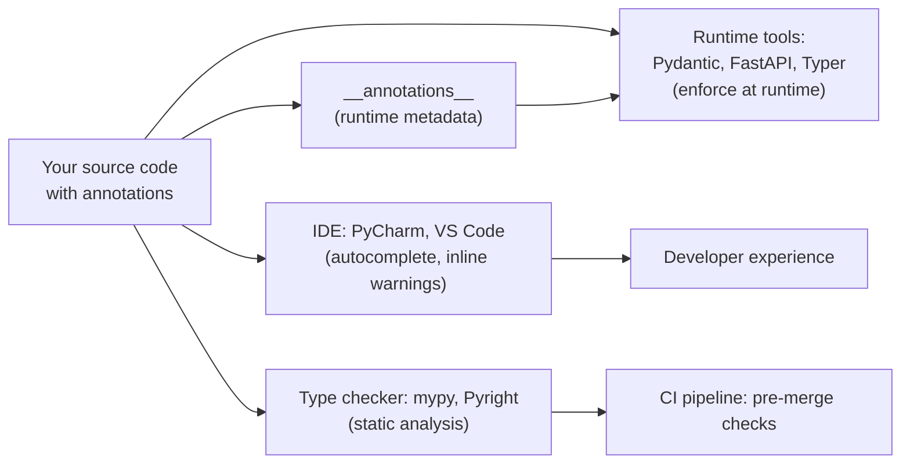

# 9. Type Hinting for Functions

## Why This Matters

Type hints — annotations on function parameters and return values — are the most significant addition to Python since `async`/`await`. Introduced in PEP 484 (Python 3.5), they let you document the **expected types** of arguments and return values in a way that static type checkers (mypy, Pyright, Pytype) can verify, IDEs (PyCharm, VS Code) can use for autocomplete and inline warnings, and runtime tools (Pydantic, FastAPI, Typer) can enforce.

Type hints are **optional and not enforced at runtime** — Python remains dynamically typed. But adding hints to your function signatures pays compounding dividends: fewer `AttributeError`s in production, better IDE support, self-documenting code, easier refactoring, and a contract that other developers (and your future self) can rely on. In modern Python codebases — especially anything using FastAPI, Pydantic, or SQLAlchemy 2.0 — type hints are mandatory.

This note covers the basic annotation syntax, the built-in and `typing` types, the modern (Python 3.9+) lowercase syntax (`list[int]` instead of `List[int]`), `Optional` and `Union`, `Callable` for higher-order functions, `Any` and `Never`/`NoReturn`, generic functions with `TypeVar`, `ParamSpec` for decorators, and how type checkers consume your annotations.

---

## Background

Python's type system is **gradual**: you can annotate some functions and not others. Annotations are stored in `__annotations__` and otherwise ignored at runtime. The compiler does not enforce them — that's the job of static checkers like mypy.

```python
def greet(name: str) -> str:
    return f"Hello, {name}"

print(greet.__annotations__)
# {'name': <class 'str'>, 'return': <class 'str'>}
```

The annotations are stored as a dict but Python does not check them. You can call `greet(42)` and it will work — until `42` doesn't behave like a `str` somewhere downstream.

### History

| PEP | Year | What it added |
|-----|------|---------------|
| PEP 3107 | 2006 | Function annotation syntax (no semantics) |
| PEP 484  | 2015 | Type hinting semantics, `typing` module, mypy contract |
| PEP 526  | 2016 | Variable annotations (`x: int = 0`) |
| PEP 544  | 2019 | Protocols (structural subtyping) |
| PEP 561  | 2019 | Distributing type information (py.typed marker) |
| PEP 585  | 2020 | `list[int]` syntax (no need for `typing.List`) |
| PEP 604  | 2021 | `int | str` syntax (no need for `typing.Union`) |
| PEP 612  | 2020 | `ParamSpec` for typed decorators |
| PEP 646  | 2022 | `TypeVarTuple` (variadic generics) |
| PEP 695  | 2023 | Native syntax for type params: `def f[T](x: T) -> T:` |

---

## Basic Syntax

### Function annotations

```python
def function_name(param: type, another: type = default) -> return_type:
    body
```

Examples:

```python
def greet(name: str) -> str:
    return f"Hello, {name}"

def add(a: int, b: int) -> int:
    return a + b

def parse(text: str, strict: bool = False) -> list[str]:
    ...

def log(message: str, level: str = "INFO") -> None:
    print(f"[{level}] {message}")
```

`-> None` indicates the function returns nothing (either no `return`, or `return None`).

### Variable annotations

```python
x: int = 0
y: str = "hello"
z: list[int] = []
```

Variable annotations are mostly informational at runtime; they're stored in `__annotations__` at module/class level. Local variable annotations are not stored at all (they're for type checkers only).

---

## Built-in Types

The most common types are built-ins: `int`, `float`, `str`, `bool`, `bytes`, `complex`, `None` (or `type(None)` = `NoneType`).

```python
def square(x: int) -> int: ...
def is_even(n: int) -> bool: ...
def shout(s: str) -> str: ...
```

### Container types — modern (3.9+) syntax

```python
def sum_list(xs: list[int]) -> int: ...
def index(d: dict[str, int]) -> int: ...
def first_pair(p: tuple[int, str]) -> str: ...
def unique(xs: set[str]) -> list[str]: ...
```

### Container types — `typing` module (legacy, pre-3.9)

Before Python 3.9, you had to import `List`, `Dict`, `Tuple`, `Set` from `typing`:

```python
from typing import List, Dict, Tuple, Set

def sum_list(xs: List[int]) -> int: ...
def index(d: Dict[str, int]) -> int: ...
def first_pair(p: Tuple[int, str]) -> str: ...
```

In Python 3.9+, prefer the built-in syntax (`list[int]`). The `typing.List` etc. are deprecated (and removed in 3.12+ for some).

### Tuple variants

```python
def f(t: tuple[int, str]) -> None: ...        # fixed: 2 elements, int then str
def g(t: tuple[int, ...]) -> None: ...        # variable: all ints, any length
def h(t: tuple) -> None: ...                  # untyped tuple (avoid)
```

`tuple[int, ...]` means "tuple of any number of ints." `...` is the `Ellipsis` literal.

### Mixed-type tuples

```python
def point() -> tuple[float, float, float]:
    return (1.0, 2.0, 3.0)
```

---

## `Optional` and `Union`

### `Optional[X]` — `X | None`

`Optional[X]` means "either X or None." It's shorthand for `Union[X, None]`.

```python
from typing import Optional

def find_user(user_id: int) -> Optional[User]:
    ...
    return None    # OK
    return User()  # OK
```

### `Union[X, Y]` — `X | Y`

`Union[X, Y]` means "either X or Y."

```python
from typing import Union

def parse(value: Union[int, str]) -> int:
    if isinstance(value, str):
        return int(value)
    return value
```

### Modern syntax (3.10+)

PEP 604 lets you use `|`:

```python
def find_user(user_id: int) -> User | None: ...
def parse(value: int | str) -> int: ...
```

`X | None` is preferred over `Optional[X]` in modern code. Both work in 3.10+.

---

## `Callable` for Functions

```python
from typing import Callable

def apply(func: Callable[[int], int], x: int) -> int:
    return func(x)

# Callable[[Arg1, Arg2, ...], ReturnType]
# Callable[..., int]  — any signature, returns int
```

`Callable[[int, str], bool]` means "a function taking int and str, returning bool."

### Modern alternative (3.9+): `collections.abc.Callable`

```python
from collections.abc import Callable

def apply(func: Callable[[int], int], x: int) -> int:
    return func(x)
```

`collections.abc.Callable` is preferred over `typing.Callable` in modern code.

### `Callable` without parameters (3.10+)

```python
def run(f: Callable[..., int]) -> int: ...
```

`...` means "any signature."

---

## `Any`, `Never`, `NoReturn`

### `Any` — anything goes

```python
from typing import Any

def log(data: Any) -> None:
    print(data)
```

`Any` disables type checking for that value. Use sparingly — usually a more specific type or `object` is better.

### `Never` and `NoReturn` — never returns

`NoReturn` (now `Never` in 3.11+) marks functions that don't return normally — they raise or exit:

```python
from typing import NoReturn

def fail(message: str) -> NoReturn:
    raise RuntimeError(message)

def sys_exit(code: int) -> NoReturn:
    import sys
    sys.exit(code)
```

This helps type checkers understand that code after `fail()` is unreachable.

---

## Generics: `TypeVar`

A `TypeVar` lets you write generic functions that preserve type relationships:

```python
from typing import TypeVar

T = TypeVar("T")

def first(xs: list[T]) -> T:
    return xs[0]

# first([1, 2, 3]) returns int
# first(["a", "b"]) returns str
```

Without `T`, you'd have to write `def first(xs: list[Any]) -> Any`, losing the relationship between input and output types.

### Bounded `TypeVar`

```python
T = TypeVar("T", bound=str)        # T must be str or a subclass
T = TypeVar("T", bound=Comparable) # T must implement Comparable
```

### Constrained `TypeVar`

```python
T = TypeVar("T", int, float)       # T must be int or float
```

### PEP 695 (Python 3.12+) — native syntax

```python
def first[T](xs: list[T]) -> T:
    return xs[0]

class Stack[T]:
    def push(self, x: T) -> None: ...
```

No more `TypeVar` boilerplate — the type parameter is declared inline.

---

## `ParamSpec` for Typed Decorators (3.10+)

Decorators preserve the wrapped function's signature. To type this, use `ParamSpec`:

```python
from typing import Callable, ParamSpec, TypeVar, Awaitable
from functools import wraps

P = ParamSpec("P")
R = TypeVar("R")

def log_calls(func: Callable[P, R]) -> Callable[P, R]:
    @wraps(func)
    def wrapper(*args: P.args, **kwargs: P.kwargs) -> R:
        print(f"calling {func.__name__}")
        return func(*args, **kwargs)
    return wrapper

@log_calls
def add(a: int, b: int) -> int:
    return a + b
```

`P.args` and `P.kwargs` capture the original parameter types, so `add` retains its `(int, int) -> int` signature through the decorator.

---

## `Iterator`, `Generator`, `AsyncIterator`

For generators (see [[8. Generators and yield]]):

```python
from collections.abc import Iterator, Generator

def count_up_to(n: int) -> Iterator[int]:
    i = 1
    while i <= n:
        yield i
        i += 1

# Full Generator form: Generator[YieldType, SendType, ReturnType]
def echo() -> Generator[str, int, None]:
    while True:
        x = yield
        ...
```

For async generators:

```python
from collections.abc import AsyncIterator

async def numbers(n: int) -> AsyncIterator[int]:
    for i in range(n):
        yield i
        await asyncio.sleep(0.1)
```

---

## `Literal` for fixed values

```python
from typing import Literal

def set_mode(mode: Literal["r", "w", "a"]) -> None: ...

set_mode("r")    # OK
set_mode("x")    # type error
```

`Literal` is great for "string enums" where you want compile-time checking without defining an `Enum`.

---

## `TypedDict` — dict with fixed keys

```python
from typing import TypedDict

class UserInfo(TypedDict):
    name: str
    age: int
    email: str | None

def create_user(info: UserInfo) -> None: ...

create_user({"name": "Alice", "age": 30, "email": None})   # OK
create_user({"name": "Alice"})                             # type error — missing 'age'
```

`TypedDict` lets you type dicts that have a known shape, like JSON config or API responses.

---

## `Protocol` — structural typing (PEP 544)

A `Protocol` defines an interface by shape, not by inheritance:

```python
from typing import Protocol

class SupportsClose(Protocol):
    def close(self) -> None: ...

def cleanup(resource: SupportsClose) -> None:
    resource.close()

class File:
    def close(self) -> None: ...

cleanup(File())    # OK — File has a close() method
cleanup(object())  # type error — no close()
```

Any class with the right methods satisfies the protocol, no inheritance needed. This is "duck typing with type checking."

---

## Type Hint Value Chain



Type hints flow from your source code into multiple consumers:

1. **`__annotations__`** — stored at runtime, accessible to runtime tools.
2. **IDE** — uses hints for autocomplete and inline errors.
3. **Type checker** (mypy, Pyright) — verifies hints statically.
4. **Runtime tools** (Pydantic, FastAPI, Typer, Typer) — use hints to validate input and generate docs.
5. **CI** — runs the type checker pre-merge.

---

## Annotated Code Examples

### Example 1: Basic annotations

```python
def greet(name: str, greeting: str = "Hello") -> str:
    return f"{greeting}, {name}!"

print(greet("Alice"))            # Hello, Alice!
print(greet("Bob", greeting="Hi"))  # Hi, Bob!
```

### Example 2: Containers

```python
def process(items: list[int]) -> dict[str, int]:
    return {str(x): x for x in items}

print(process([1, 2, 3]))   # {'1': 1, '2': 2, '3': 3}
```

### Example 3: Optional

```python
def find(items: list[int], target: int) -> int | None:
    for i, x in enumerate(items):
        if x == target:
            return i
    return None

print(find([1, 2, 3], 2))   # 1
print(find([1, 2, 3], 5))   # None
```

### Example 4: Callable

```python
from collections.abc import Callable

def apply(func: Callable[[int], int], x: int) -> int:
    return func(x)

print(apply(lambda x: x * 2, 5))   # 10
```

### Example 5: TypeVar generic

```python
from typing import TypeVar

T = TypeVar("T")

def first(xs: list[T]) -> T:
    return xs[0]

print(first([1, 2, 3]))          # 1   — T inferred as int
print(first(["a", "b", "c"]))    # a   — T inferred as str
```

### Example 6: ParamSpec decorator

```python
from typing import Callable, ParamSpec, TypeVar
from functools import wraps

P = ParamSpec("P")
R = TypeVar("R")

def log(func: Callable[P, R]) -> Callable[P, R]:
    @wraps(func)
    def wrapper(*args: P.args, **kwargs: P.kwargs) -> R:
        print(f"calling {func.__name__}")
        return func(*args, **kwargs)
    return wrapper

@log
def add(a: int, b: int) -> int:
    return a + b

add(1, 2)   # add retains (int, int) -> int signature
```

### Example 7: Generator typing

```python
from collections.abc import Iterator

def fib(n: int) -> Iterator[int]:
    a, b = 0, 1
    for _ in range(n):
        yield a
        a, b = b, a + b

print(list(fib(10)))
# [0, 1, 1, 2, 3, 5, 8, 13, 21, 34]
```

### Example 8: Literal and TypedDict

```python
from typing import Literal, TypedDict

class ServerConfig(TypedDict):
    host: str
    port: int
    mode: Literal["dev", "staging", "prod"]

def start(config: ServerConfig) -> None:
    print(f"{config['mode']} server at {config['host']}:{config['port']}")

start({"host": "localhost", "port": 8080, "mode": "dev"})
# dev server at localhost:8080
```

### Example 9: Protocol (structural typing)

```python
from typing import Protocol

class Sized(Protocol):
    def __len__(self) -> int: ...

def print_size(obj: Sized) -> None:
    print(f"size: {len(obj)}")

print_size([1, 2, 3])    # size: 3
print_size("hello")      # size: 5
print_size({1, 2})       # size: 2
```

### Example 10: `overload`

```python
from typing import overload

@overload
def parse(x: int) -> int: ...
@overload
def parse(x: str) -> str: ...
def parse(x):
    if isinstance(x, int):
        return x * 2
    return x.upper()

print(parse(5))    # 10   — type checker sees return type int
print(parse("hi")) # HI   — type checker sees return type str
```

`@overload` declarations are erased at runtime — only the final implementation runs. They exist purely for type-checker benefit.

### Example 11: PEP 695 (Python 3.12+) — native syntax

```python
# Python 3.12+
def first[T](xs: list[T]) -> T:
    return xs[0]

class Stack[T]:
    def __init__(self) -> None:
        self._items: list[T] = []
    def push(self, x: T) -> None:
        self._items.append(x)
    def pop(self) -> T:
        return self._items.pop()
```

---

## Common Pitfalls

### 1. Using `list` instead of `List` in old Python

```python
# Python 3.8 and earlier — SyntaxError at runtime
def f(xs: list[int]) -> int: ...

# Python 3.9+ — OK
```

For 3.8 and earlier, use `from typing import List` and `List[int]`.

### 2. `Optional[X]` doesn't make the parameter optional

```python
def f(x: Optional[int] = None) -> None: ...
```

`Optional[int]` means `int | None` — the type. To make the parameter optional (with a default), you need `= None` separately. The two are independent.

### 3. Mutable default annotations

```python
def f(x: list[int] = []) -> None: ...    # mutable default — same bug as always
```

Use `None`:

```python
def f(x: list[int] | None = None) -> None:
    if x is None:
        x = []
```

### 4. Annotations aren't enforced at runtime

```python
def add(a: int, b: int) -> int:
    return a + b

add("hello", "world")   # works! returns "helloworld"
```

Use `pydantic` or `beartype` for runtime enforcement.

### 5. `Any` defeats the purpose

```python
def f(x: Any) -> Any: ...
```

This is barely better than no annotation. Use specific types or `object`.

### 6. Confusing `Callable` parameter list

```python
# Wrong — takes int, returns str
def f(cb: Callable[int, str]) -> None: ...

# Right
def f(cb: Callable[[int], str]) -> None: ...
```

The argument list is in `[...]`.

### 7. Forward references

```python
class Node:
    def __init__(self, value: int, next: Node | None = None) -> None: ...
```

`Node` is referenced inside its own definition. In Python 3.11 and earlier, this requires `from __future__ import annotations` (which makes all annotations strings) or string quoting: `"Node | None"`. In Python 3.12+ (PEP 695 / PEP 563 default behavior), it works directly.

### 8. `None` vs `type(None)`

```python
def f() -> None: ...      # 
def f() -> type(None): ...  # works but ugly
```

Use `None`. The annotation `None` is interpreted as `type(None)` (i.e., `NoneType`).

### 9. Forgetting `-> None`

```python
def log(msg: str): ...   # missing return type — defaults to Unknown
```

Always annotate the return type, even for functions that "don't return anything" (use `-> None`).

### 10. Stale annotations after refactoring

If you rename a function or change a parameter type, the annotation can become stale. Run mypy in CI to catch.

### 11. `from typing import *` pollution

Don't wildcard-import `typing` — it pollutes your namespace with `List`, `Dict`, `Callable`, etc. Import only what you need.

### 12. Confusing `TypeVar` constraints

```python
T = TypeVar("T", int, str)    # T must be int or str
T = TypeVar("T", bound=Comparable)  # T must be Comparable or subclass
```

The first is *constrained* (must be one of these exact types); the second is *bounded* (must be this type or subclass).

---

## Tips and Tricks

- **Adopt type hints early in new projects** — easier than retrofitting.
- **Start with `--strict` mypy** — easier to relax than tighten.
- **Use modern syntax** (`list[int]`, `X | None`) on Python 3.10+.
- **Annotate public APIs first** — internal code can be gradual.
- **`from __future__ import annotations`** for forward references on Python <3.12.
- **Pydantic** uses type hints for runtime validation — see Chapter 30 ([[1. ML and AI Libraries]]-style topics).
- **FastAPI** generates OpenAPI docs from type hints — see Chapter 27 ([[1. Networking and Sockets]]-style topics).
- **Typer / Click** generate CLIs from type hints.
- **mypy** is the canonical type checker; **Pyright** (used by Pylance in VS Code) is faster.
- **`beartype`** for runtime type checking with O(1) overhead.
- **`typing.TYPE_CHECKING`** guards imports that are only needed by type checkers:
  ```python
  from typing import TYPE_CHECKING
  if TYPE_CHECKING:
      from .models import User

  def f(u: "User") -> None: ...
  ```
- **PEP 695 (Python 3.12+)** lets you skip `TypeVar` boilerplate with native syntax.
- **`@overload`** for functions with multiple call signatures.
- **`Protocol`** for duck-typed interfaces — no inheritance needed.

---

## Active Recall

1. What is the purpose of type hints, and are they enforced at runtime?
2. Write a function `add(a: int, b: int) -> int` and explain each part.
3. What's the difference between `list[int]` and `List[int]`? When can you use each?
4. What does `Optional[X]` mean? What's the modern equivalent?
5. How would you type a function that takes another function as an argument?
6. What is `TypeVar` for? Show a generic `first(xs: list[T]) -> T`.
7. How do you type a generator that yields ints?
8. What is `ParamSpec`, and why is it useful for decorators?
9. Show the modern (3.10+) syntax for a function that returns `int | None`.
10. What is `TypedDict`, and when would you use it instead of a dataclass?
11. What's the difference between `Protocol` and `ABC`?
12. How do `@overload` declarations work, and what happens to them at runtime?

---

## Next Steps

- This is the final note in Chapter 3 — review [[1. Function Basics]] if you skipped it.
- For OOP type hints (class methods, `Self`, `ClassVar`), see Chapter 8 ([[1. Object-Oriented Programming]]-style topics).
- For runtime type validation, see Pydantic in Chapter 30 ([[1. ML and AI Libraries]]-style topics).
- For typed decorators in depth, revisit [[7. Decorators]] and the `ParamSpec` example.
- For async type hints (`Coroutine`, `AsyncIterator`), see Chapter 20 ([[1. Advanced Async]]-style topics).
- For deep type-system coverage (generics, variance, protocols), see Chapter 11 ([[1. Type Hinting]]-style topics).
- Run `mypy --strict` on your projects to catch type errors at "compile" time.
