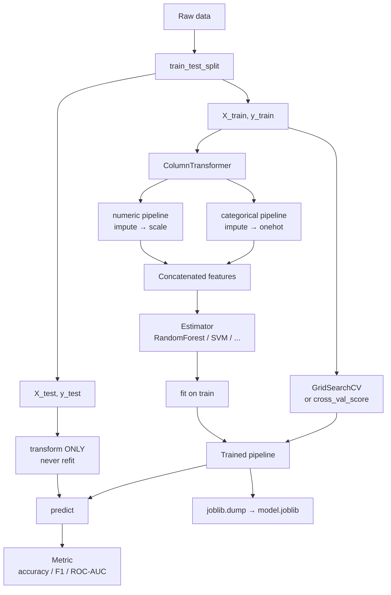
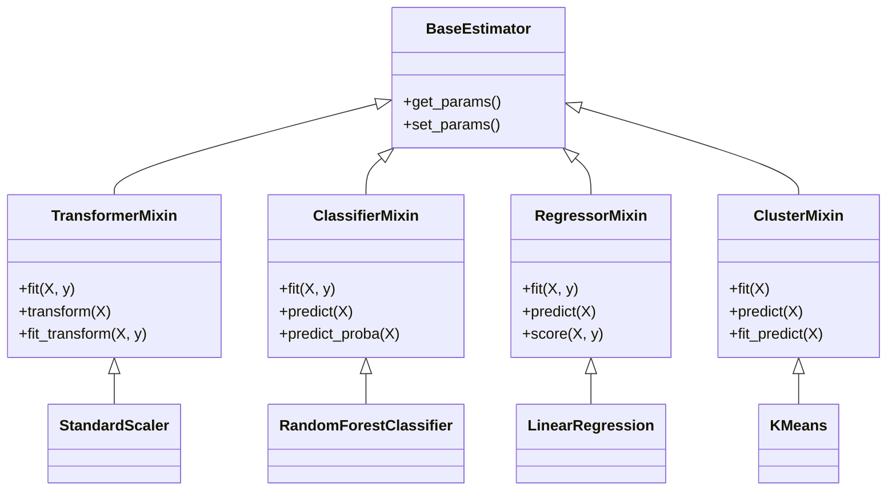
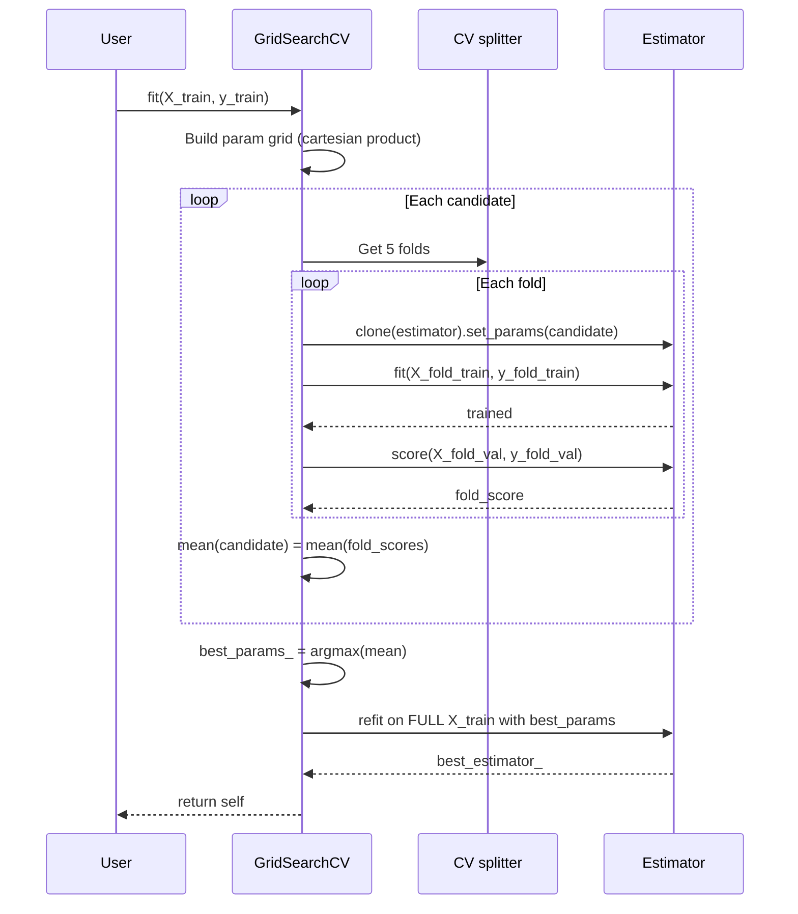

# 1. Scikit-Learn

> [!note] Why this note exists
> This note is the canonical reference for **scikit-learn** — Python's de-facto library for *classical* machine learning. It covers the unified **estimator API** (`fit` / `predict` / `transform`), the built-in toy datasets, preprocessing primitives, the most-used model families, the model-selection toolkit (`train_test_split`, `cross_val_score`, `GridSearchCV`), the metrics zoo, and the `Pipeline` + `ColumnTransformer` composition system that ties everything together. It deliberately stops short of deep learning — that is [[2. PyTorch Fundamentals]] and [[3. TensorFlow Fundamentals]] — and stops short of distributed ML (Spark MLlib, Ray). After this note you should be able to take a tabular dataset, train a baseline model, evaluate it correctly, and ship it as a single `Pipeline` object that can be `pickle`d into production.

## Why It Matters

Scikit-learn is the **first stop** for any tabular ML problem. If your data fits in memory (let's say < ~10 GB) and your model is not a deep neural network, scikit-learn probably has a better-tuned, better-tested implementation than you will write yourself. The library ships:

- **40+ supervised algorithms** — linear models, nearest neighbours, support vector machines, decision trees, random forests, gradient boosting (HistGradientBoosting), naive Bayes, Gaussian processes, and more.
- **20+ unsupervised algorithms** — KMeans, DBSCAN, PCA, t-SNE, UMAP-style manifold learning, isotonic regression, factor analysis, NMF.
- **A single consistent API**. Once you have learned `fit` / `predict` on a `RandomForestClassifier`, you know how to use a `GradientBoostingRegressor`, an `SVC`, or a `KNeighborsRegressor`. The API is the killer feature, not the algorithms.
- **Composition primitives** — `Pipeline`, `ColumnTransformer`, `FeatureUnion` — that make it impossible to leak data between train and test, and that bundle preprocessing + model into one serializable object.

Modern gradient-boosted trees (XGBoost, LightGBM, CatBoost) and even some neural approaches (skorch, scikeras) implement the scikit-learn estimator interface so that they drop into the same `Pipeline`. That interoperability is the library's enduring contribution.

## Background

### The estimator API in one breath

Every scikit-learn object is an **estimator**. An estimator is a Python class that:

1. Is constructed with **hyperparameters** (`RandomForestClassifier(n_estimators=100, max_depth=5)`). Construction does **no work** — it just stores the config.
2. Has a `fit(X, y)` method (supervised) or `fit(X)` (unsupervised) that learns from data and returns `self` (so you can chain `model = RandomForestClassifier().fit(X, y)`).
3. Has either a `predict(X)` method (supervised models) or a `transform(X)` method (preprocessors), sometimes both.

```python
from sklearn.linear_model import LinearRegression
from sklearn.preprocessing import StandardScaler

# Hyperparameters set at construction; no learning happens yet.
scaler = StandardScaler()
model = LinearRegression()

# Learning happens here:
scaler.fit(X_train)              # compute mean & std
model.fit(scaler.transform(X_train), y_train)

# Inference:
y_pred = model.predict(scaler.transform(X_test))
```

That is the whole API. Internal state learned during `fit` is stored as **attributes with a trailing underscore**: `scaler.mean_`, `scaler.scale_`, `model.coef_`, `model.intercept_`. The trailing underscore is scikit-learn's way of saying "this attribute was learned from data, not set by you".

### Toy datasets

```python
from sklearn.datasets import (
    load_iris,                  # 150 flowers, 4 features, 3 classes
    load_digits,                # 1797 8x8 images, 10 classes (classification)
    load_wine,                  # 178 wines, 13 features, 3 classes
    load_breast_cancer,         # 569 patients, 30 features, 2 classes
    load_diabetes,              # 442 patients, 10 features, regression target
    fetch_california_housing,   # 20640 houses, 8 features, regression (downloads)
    fetch_openml,               # arbitrary dataset from openml.org
    make_classification,        # synthetic classification
    make_regression,            # synthetic regression
    make_blobs,                 # synthetic clusters
)
```

`load_*` datasets ship inside the package (a few KB). `fetch_*` datasets are downloaded from the internet on first call and cached in `~/scikit_learn_data/`. `make_*` generate synthetic data with controllable difficulty — invaluable for unit tests and demos.

```python
from sklearn.datasets import load_iris
X, y = load_iris(return_X_y=True)        # NumPy arrays
# Or the richer "Bunch" object:
bunch = load_iris()
print(bunch.feature_names)   # ['sepal length (cm)', ...]
print(bunch.target_names)    # ['setosa', 'versicolor', 'virginica']
print(bunch.data.shape)      # (150, 4)
```

## Main content

### Preprocessing

Preprocessing is the part of ML that takes the longest to learn and the longest to get right. Scikit-learn provides a `transformer` API: every preprocessor has `fit` (compute statistics) and `transform` (apply), plus `fit_transform` (often faster than calling both).

#### Scaling numerical features

| Transformer | What it does | When to use |
|-------------|--------------|-------------|
| `StandardScaler` | `(x - mean) / std` → mean 0, variance 1 | Linear models, SVMs, neural nets |
| `MinMaxScaler` | Linear map to `[0, 1]` (or other range) | When you need bounded inputs (images, neural nets) |
| `MaxAbsScaler` | Divide by max abs → `[-1, 1]`, preserves sparsity | Sparse data |
| `RobustScaler` | `(x - median) / IQR` | Data with outliers |
| `Normalizer` | Normalize each **row** to unit norm (L1/L2) | Text features, cosine similarity |

```python
from sklearn.preprocessing import StandardScaler, RobustScaler

scaler = StandardScaler()
X_train_scaled = scaler.fit_transform(X_train)   # fit AND transform
X_test_scaled  = scaler.transform(X_test)        # transform only — uses train stats!
```

> [!warning] The single most common mistake
> Calling `fit_transform` on the **test** set. This re-computes mean/std from the test data, silently leaking information and producing numbers that look right but are not comparable to the train data. **Always** call `fit` (or `fit_transform`) on train, and only `transform` on test. Using a `Pipeline` makes this impossible to get wrong.

#### Encoding categorical features

```python
from sklearn.preprocessing import OneHotEncoder, LabelEncoder, OrdinalEncoder

# OneHotEncoder: for features (X). Produces a sparse matrix by default.
ohe = OneHotEncoder(handle_unknown='ignore', sparse_output=False)
X_cat = ohe.fit_transform(df[['colour', 'size']])

# OrdinalEncoder: for features when categories have order (low/med/high).
oe = OrdinalEncoder(categories=[['low', 'med', 'high']])

# LabelEncoder: for TARGETS (y). Maps strings to 0..K-1.
le = LabelEncoder()
y = le.fit_transform(['cat', 'dog', 'cat', 'fish'])  # array([0, 1, 0, 2])
```

For targets with many classes, `LabelEncoder` is preferred over `OneHotEncoder` because classifiers like `RandomForest` can take integer labels directly; `LogisticRegression` and neural nets typically want one-hot via the loss function (`CrossEntropyLoss` in PyTorch, `sparse_categorical_crossentropy` in Keras).

#### Imputation

```python
from sklearn.experimental import enable_iterative_imputer  # noqa: F401 — required import
from sklearn.impute import SimpleImputer, KNNImputer, IterativeImputer

SimpleImputer(strategy='median')      # fill with column median
SimpleImputer(strategy='constant', fill_value='missing')
KNNImputer(n_neighbors=5)              # use nearest rows
IterativeImputer()                     # model each feature as a function of the others
```

#### Feature engineering helpers

- `PolynomialFeatures(degree=2, interaction_only=False)` — adds x², x*y terms.
- `KBinsDiscretizer(n_bins=5, encode='onehot', strategy='quantile')` — turn a continuous feature into bins.
- `FunctionTransformer(func=np.log1p)` — apply any stateless function.
- `PowerTransformer(method='yeo-johnson')` — make data more Gaussian.

### Models — a tour

#### Linear models

```python
from sklearn.linear_model import (
    LinearRegression,            # ordinary least squares
    Ridge,                       # L2 regularised
    Lasso,                       # L1 regularised (sparse coefficients)
    ElasticNet,                  # L1 + L2
    LogisticRegression,          # classification (despite the name)
    SGDClassifier,               # incremental / out-of-core via partial_fit
    HuberRegressor,              # robust to outliers
)
```

`LogisticRegression` despite its name is a **classifier** (binary or multinomial). It has several solvers; `lbfgs` is the default, but for large datasets `saga` allows L1 and elastic-net penalties and scales to millions of rows.

#### Nearest neighbours

```python
from sklearn.neighbors import KNeighborsClassifier, KNeighborsRegressor
KNeighborsClassifier(n_neighbors=5, weights='distance', metric='minkowski', p=2)
```

KNN is **lazy** — `fit` just stores the data, prediction does all the work. Use `algorithm='auto'` (picks `'ball_tree'`, `'kd_tree'`, or `'brute'` based on dimensionality).

#### Support vector machines

```python
from sklearn.svm import SVC, SVR, LinearSVC
SVC(kernel='rbf', C=1.0, gamma='scale')
LinearSVC(C=1.0)             # much faster for linear kernels on large data
```

SVMs scale poorly: `SVC` is `O(n²)` to `O(n³)` in the number of samples. Above ~10k samples use `LinearSVC` or switch to `SGDClassifier(loss='hinge')`.

#### Trees and ensembles

```python
from sklearn.tree import DecisionTreeClassifier, plot_tree
from sklearn.ensemble import (
    RandomForestClassifier,
    GradientBoostingClassifier,
    HistGradientBoostingClassifier,    # fast, native histogram GBDT, scales to millions
    AdaBoostClassifier,
    ExtraTreesClassifier,
    VotingClassifier,                  # ensemble of arbitrary models
    StackingClassifier,                # learn how to combine models
    BaggingClassifier,
)
```

`HistGradientBoostingClassifier` is the scikit-learn-native answer to LightGBM. It supports missing values natively, is parallelised, and is roughly 100x faster than the old `GradientBoostingClassifier`. It should be your default gradient-boosting model unless you specifically need XGBoost/LightGBM/CatBoost.

#### Unsupervised — clustering and dimensionality

```python
from sklearn.cluster import KMeans, DBSCAN, AgglomerativeClustering, HDBSCAN
from sklearn.decomposition import PCA, TruncatedSVD, NMF
from sklearn.manifold import TSNE                      # use for visualisation only
```

`HDBSCAN` (hierarchical DBSCAN) is available in scikit-learn 1.3+ and is dramatically better than `DBSCAN` for clusters of varying density.

### Model selection

```python
from sklearn.model_selection import (
    train_test_split,
    KFold, StratifiedKFold, GroupKFold, TimeSeriesSplit,
    cross_val_score, cross_val_predict, cross_validate,
    GridSearchCV, RandomizedSearchCV,
    learning_curve, validation_curve,
)
```

#### Splits

```python
X_tr, X_te, y_tr, y_te = train_test_split(
    X, y,
    test_size=0.2,
    random_state=42,
    stratify=y,        # keep class proportions — important for imbalanced data
)
```

For time series, **never** use `train_test_split` — it shuffles. Use `TimeSeriesSplit` which always trains on the past and tests on the future.

```python
from sklearn.model_selection import TimeSeriesSplit
tscv = TimeSeriesSplit(n_splits=5, test_size=24)  # 24-hour holdout windows
```

#### Cross-validation

```python
from sklearn.model_selection import cross_val_score
scores = cross_val_score(model, X, y, cv=5, scoring='f1_macro', n_jobs=-1)
print(f"{scores.mean():.3f} ± {scores.std():.3f}")
```

`cross_validate` returns fit time, score time, and multiple metrics at once. `cross_val_predict` returns the out-of-fold predictions — useful for stacking and for plotting residuals.

#### Hyperparameter search

```python
from sklearn.model_selection import GridSearchCV, RandomizedSearchCV
from scipy.stats import loguniform

param_grid = {
    'n_estimators':    [100, 200, 500],
    'max_depth':       [None, 5, 10, 20],
    'min_samples_leaf':[1, 2, 5],
}
gs = GridSearchCV(RandomForestClassifier(), param_grid,
                  cv=5, scoring='roc_auc', n_jobs=-1, refit=True)
gs.fit(X_train, y_train)
print(gs.best_params_, gs.best_score_)
best_model = gs.best_estimator_

# Faster alternative: sample from a distribution
param_dist = {
    'n_estimators':    [100, 200, 500, 1000],
    'max_depth':       [None, 5, 10, 20, 50],
    'min_samples_leaf':[1, 2, 5, 10],
    'max_features':    ['sqrt', 'log2', 0.5, 1.0],
    'C':               loguniform(1e-3, 1e2),
}
rs = RandomizedSearchCV(model, param_dist, n_iter=50, cv=5, n_jobs=-1)
```

For serious search use `Optuna` or `scikit-optimize` (`BayesSearchCV`) — they outperform both grid and random by an order of magnitude on noisy objective surfaces.

### Metrics

```python
from sklearn.metrics import (
    # Classification
    accuracy_score, balanced_accuracy_score,
    precision_score, recall_score, f1_score,
    precision_recall_fscore_support,
    roc_auc_score, average_precision_score, roc_curve,
    confusion_matrix, ConfusionMatrixDisplay,
    classification_report, log_loss,
    # Regression
    mean_squared_error, mean_absolute_error, r2_score,
    mean_absolute_percentage_error,
    # Clustering
    silhouette_score, adjusted_rand_score, normalized_mutual_info_score,
)
```

The scoring names used by `cross_val_score(scoring=...)` and `GridSearchCV(scoring=...)` are **strings**, not function calls:

```python
cross_val_score(model, X, y, scoring='roc_auc')   # 
cross_val_score(model, X, y, scoring=roc_auc_score)  #  — wrong
```

The full list of valid scoring strings is `sorted(sklearn.metrics.SCORERS.keys())`.

### Pipelines and ColumnTransformer

The single most important composition primitive in scikit-learn. A `Pipeline` chains transformers + a final estimator so that:

- You cannot leak test data (only `fit` is called on train, only `transform` on test).
- You can serialize the whole workflow as one object.
- Hyperparameter search can tune preprocessing AND model jointly.

```python
from sklearn.pipeline import Pipeline, make_pipeline
from sklearn.compose import ColumnTransformer
from sklearn.preprocessing import StandardScaler, OneHotEncoder
from sklearn.impute import SimpleImputer
from sklearn.ensemble import RandomForestClassifier

numeric_features = ['age', 'income', 'score']
categorical_features = ['city', 'plan']

numeric_pipeline = Pipeline([
    ('impute', SimpleImputer(strategy='median')),
    ('scale',  StandardScaler()),
])
categorical_pipeline = Pipeline([
    ('impute', SimpleImputer(strategy='constant', fill_value='missing')),
    ('onehot', OneHotEncoder(handle_unknown='ignore')),
])

preprocessor = ColumnTransformer([
    ('num', numeric_pipeline,      numeric_features),
    ('cat', categorical_pipeline,  categorical_features),
])

full_pipeline = Pipeline([
    ('preprocess', preprocessor),
    ('model',      RandomForestClassifier(n_estimators=200, random_state=42)),
])

full_pipeline.fit(X_train, y_train)
y_pred = full_pipeline.predict(X_test)

# Hyperparameter tuning — note the double-underscore syntax:
param_grid = {
    'model__n_estimators':      [100, 200, 500],
    'model__max_depth':         [None, 10, 20],
    'preprocess__num__impute__strategy': ['mean', 'median'],
}
gs = GridSearchCV(full_pipeline, param_grid, cv=5, scoring='roc_auc', n_jobs=-1)
gs.fit(X_train, y_train)
```

The double-underscore syntax (`step__param`) is how scikit-learn addresses nested parameters. `model__n_estimators` means "the `n_estimators` parameter of the step named `model`". Two levels of nesting use triple underscores: `preprocess__num__impute__strategy`.

### Persisting models

```python
import joblib              # preferred over pickle for scikit-learn
joblib.dump(full_pipeline, 'model.joblib', compress=3)
loaded = joblib.load('model.joblib')
loaded.predict(new_data)
```

Always pin the scikit-learn version in production. `joblib` files are **not** guaranteed compatible across major versions.

## Mermaid diagrams

### The scikit-learn workflow



### The estimator API surface



### GridSearchCV execution



## Code examples

### End-to-end classification on Iris

```python
from sklearn.datasets import load_iris
from sklearn.model_selection import train_test_split, GridSearchCV
from sklearn.pipeline import Pipeline
from sklearn.preprocessing import StandardScaler
from sklearn.svm import SVC
from sklearn.metrics import classification_report, confusion_matrix, ConfusionMatrixDisplay
import matplotlib.pyplot as plt

X, y = load_iris(return_X_y=True)
X_tr, X_te, y_tr, y_te = train_test_split(X, y, test_size=0.2,
                                          random_state=42, stratify=y)

pipe = Pipeline([
    ('scale', StandardScaler()),
    ('svm',   SVC(probability=True, random_state=42)),
])

param_grid = [
    {'svm__kernel': ['linear'], 'svm__C': [0.1, 1, 10]},
    {'svm__kernel': ['rbf'],    'svm__C': [0.1, 1, 10],
                               'svm__gamma': ['scale', 'auto', 0.1]},
]

gs = GridSearchCV(pipe, param_grid, cv=5, scoring='accuracy', n_jobs=-1, refit=True)
gs.fit(X_tr, y_tr)

print("Best params:", gs.best_params_)
print("Best CV accuracy:", gs.best_score_)
print("Test accuracy:", gs.score(X_te, y_te))

y_pred = gs.predict(X_te)
print(classification_report(y_te, y_pred, target_names=load_iris().target_names))

ConfusionMatrixDisplay.from_predictions(y_te, y_pred,
                                        display_labels=load_iris().target_names)
plt.tight_layout()
plt.savefig("iris_confusion.png", dpi=120)
```

### Regression on California Housing

```python
from sklearn.datasets import fetch_california_housing
from sklearn.model_selection import train_test_split, cross_val_score
from sklearn.pipeline import make_pipeline
from sklearn.preprocessing import StandardScaler
from sklearn.ensemble import HistGradientBoostingRegressor
from sklearn.metrics import mean_squared_error, r2_score
import numpy as np

X, y = fetch_california_housing(return_X_y=True)
X_tr, X_te, y_tr, y_te = train_test_split(X, y, test_size=0.2, random_state=42)

# HistGradientBoosting is tree-based → does NOT need scaling.
# We scale here only to demonstrate a pipeline.
model = make_pipeline(
    StandardScaler(),
    HistGradientBoostingRegressor(max_iter=400, learning_rate=0.05,
                                  random_state=42),
)
model.fit(X_tr, y_tr)
pred = model.predict(X_te)
rmse = np.sqrt(mean_squared_error(y_te, pred))
print(f"RMSE: {rmse:.3f}  R²: {r2_score(y_te, pred):.3f}")

# 5-fold CV with negative MSE
scores = cross_val_score(model, X, y, cv=5, scoring='neg_root_mean_squared_error',
                         n_jobs=-1)
print(f"CV RMSE: {-scores.mean():.3f} ± {scores.std():.3f}")
```

### Custom transformer

```python
from sklearn.base import BaseEstimator, TransformerMixin
import numpy as np

class OutlierClipper(BaseEstimator, TransformerMixin):
    """Clip values to [Q1 - k*IQR, Q3 + k*IQR] learned on train data."""
    def __init__(self, k=1.5):
        self.k = k

    def fit(self, X, y=None):
        X = np.asarray(X, dtype=float)
        q1 = np.percentile(X, 25, axis=0)
        q3 = np.percentile(X, 75, axis=0)
        self.lo_ = q1 - self.k * (q3 - q1)
        self.hi_ = q3 + self.k * (q3 - q1)
        return self

    def transform(self, X):
        return np.clip(np.asarray(X, dtype=float), self.lo_, self.hi_)

# Drop into a pipeline just like a built-in:
pipe = make_pipeline(OutlierClipper(k=3.0), StandardScaler(),
                     HistGradientBoostingRegressor())
```

### Text classification

```python
from sklearn.feature_extraction.text import TfidfVectorizer
from sklearn.linear_model import LogisticRegression
from sklearn.pipeline import Pipeline
from sklearn.model_selection import train_test_split
from sklearn.metrics import classification_report

texts = ["I love this movie", "Terrible waste of time", "Brilliant and moving", ...]
labels = ["pos", "neg", "pos", ...]

pipe = Pipeline([
    ('tfidf', TfidfVectorizer(ngram_range=(1, 2), min_df=2, sublinear_tf=True)),
    ('clf',   LogisticRegression(max_iter=1000, C=5.0, n_jobs=-1)),
])
X_tr, X_te, y_tr, y_te = train_test_split(texts, labels, test_size=0.2, random_state=42)
pipe.fit(X_tr, y_tr)
print(classification_report(y_te, pipe.predict(X_te)))
```

## Common Pitfalls

> [!warning] Data leakage
> The single biggest source of "my model performs great in CV but terribly in production" is leakage. The classic leak is calling `fit_transform` on the whole dataset before splitting, which means your scaler's statistics include test data. The fix is always: `fit` on train, `transform` on test — or, better, wrap everything in a `Pipeline`.

> [!warning] Stratification for imbalanced classes
> With a 99/1 class split, plain `train_test_split` can leave the test set with **zero** positives in small samples. Always pass `stratify=y` for classification, and use `StratifiedKFold` for CV.

> [!warning] `predict_proba` is not calibrated
> A `RandomForest` will tell you "90% probability" when the true probability is 60%. If you care about actual probabilities (risk modelling, thresholding), use `CalibratedClassifierCV` to wrap your model with Platt scaling or isotonic regression.

> [!warning] Treating `random_state` as a knob
> A common cheat is to try several `random_state` values and report the best. This is **p-hacking**. Set the seed once, at the top of the script, and stick with it. Cross-validation variance tells you the real story.

> [!warning] Reporting accuracy on imbalanced data
> On a 99/1 dataset, predicting "always negative" gets 99% accuracy. Use `balanced_accuracy_score`, `f1_score(average='macro')`, or `roc_auc_score` instead.

> [!warning] `n_jobs=-1` everywhere
> Spawning `n_cores` processes for a `RandomForest` and then nesting that inside `GridSearchCV(n_jobs=-1)` causes process explosion: `n_cores²` processes, each fighting for CPU, and the OS thrashes. Set `n_jobs` only on the **outermost** call (usually the `GridSearchCV`), and leave the inner estimator at `n_jobs=1`.

> [!warning] SVM on big data
> `SVC(kernel='rbf')` on 50k samples will not finish today. Switch to `LinearSVC`, `SGDClassifier(loss='hinge')`, or `HistGradientBoostingClassifier`.

> [!warning] Pickle vs joblib vs scikit-learn version
> Models pickled with scikit-learn 1.1 may not unpickle cleanly in 1.4. Pin the version in your deployment Docker image, and use `joblib` (better for NumPy arrays) rather than raw `pickle`.

## Tips and Tricks

- **`make_pipeline` vs `Pipeline`**: `make_pipeline(StandardScaler(), SVC())` auto-names steps `standardscaler` and `svc`. Use it for quick prototyping; switch to explicit `Pipeline` names (`'scaler'`, `'model'`) before hyperparameter search so the `step__param` strings stay stable.
- **`FunctionTransformer`**: wrap any pure function (`np.log1p`, `lambda x: x.sum(axis=1, keepdims=True)`) into a transformer that plays nice with `Pipeline`.
- **`set_output(transform='pandas')`** (scikit-learn ≥ 1.2): makes every transformer return a pandas DataFrame with proper column names instead of a NumPy array. Huge for debugging.
  ```python
  scaler = StandardScaler().set_output(transform='pandas')
  ```
- **`memory=` parameter on Pipeline**: caches the results of intermediate `fit_transform` calls. During `GridSearchCV` with 50 candidates and 5 folds, this can save hours if your preprocessing is expensive. Use `joblib.Memory('/tmp/sklearn_cache')`.
- **`partial_fit`** for out-of-core learning: `SGDClassifier`, `MiniBatchKMeans`, `MultinomialNB`, `PassiveAggressiveClassifier` support `.partial_fit(X_chunk, y_chunk)`. Train on data that doesn't fit in memory by streaming chunks.
- **`HalvingGridSearchCV`** (experimental): starts with all candidates on a small subset of data, drops the worst half, doubles the data, repeats. Often 10× faster than `GridSearchCV` with no loss in final quality.
- **`class_weight='balanced'`**: automatically up-weights minority classes. Available on most classifiers.
- **`feature_importances_`** on tree models, but trust them cautiously — they're biased towards high-cardinality features. Prefer `permutation_importance` for an honest answer.
  ```python
  from sklearn.inspection import permutation_importance
  r = permutation_importance(model, X_te, y_te, n_repeats=10, random_state=42)
  ```
- **`SHAP`** values are even better than permutation importance for explainability; the `shap` library integrates with scikit-learn estimators out of the box.
- **`learning_curve`** tells you whether more data would help. If train and CV scores have converged, more data won't help — improve the model or features instead.
- **`ValidationCurveDisplay`** and **`LearningCurveDisplay`** (1.4+): one-liner plots of validation/learning curves.

## Active Recall

> [!question] What three methods does every supervised scikit-learn estimator expose?
> `fit(X, y)`, `predict(X)`, and `score(X, y)`. Classifiers also expose `predict_proba(X)` (if supported) and `decision_function(X)`.

> [!question] What does the trailing underscore on `model.coef_` mean?
> The attribute was **learned from data** during `fit`, not set as a hyperparameter by the user. This is the scikit-learn convention for distinguishing learned state from configuration.

> [!question] Why must `fit_transform` be called only on the training set?
> Because `fit` computes statistics (mean, std, vocabulary, bin edges) from the data. Computing them from the test set leaks information about the test distribution into preprocessing, inflating CV scores and degrading real-world performance.

> [!question] What does `cross_val_score(scoring='roc_auc')` do differently from `scoring=roc_auc_score`?
> The **string** `'roc_auc'` is a recognised scoring identifier that scikit-learn resolves to the correct call convention (it knows to call `predict_proba` first). Passing the function object directly is wrong and will raise an error in recent versions.

> [!question] When should you use `HistGradientBoostingClassifier` instead of `GradientBoostingClassifier`?
> Almost always. The histogram-based implementation is ~100× faster, scales to millions of rows, supports missing values natively, and is multi-threaded. The old `GradientBoostingClassifier` exists for backwards compatibility.

> [!question] What is the double-underscore syntax `preprocess__num__impute__strategy` for?
> It addresses nested hyperparameters in a `Pipeline` or `ColumnTransformer`. `step1__step2__param` means "the `param` of the estimator named `step2` inside the step named `step1`". Used by `GridSearchCV` and `RandomizedSearchCV`.

> [!question] Why use `StratifiedKFold` rather than `KFold` for classification?
> `KFold` can leave a fold with zero examples of a rare class. `StratifiedKFold` preserves class proportions in every fold, which is essential for imbalanced problems.

> [!question] How do you serialize a fitted `Pipeline` for production?
> `joblib.dump(pipeline, 'model.joblib', compress=3)`. Pin the scikit-learn version on the loading side — joblib files are not guaranteed compatible across major versions.

## Next Steps

- [[2. PyTorch Fundamentals]] — when scikit-learn's classical models are not expressive enough (images, sequences, large embeddings), graduate to PyTorch.
- [[3. TensorFlow Fundamentals]] — the Google alternative; Keras makes simple architectures even more concise than PyTorch.
- [[23. NumPy]] — scikit-learn operates on NumPy arrays; understanding broadcasting explains a lot of "weird" error messages.
- [[24. Pandas]] — real tabular data lives in DataFrames. `ColumnTransformer` exists specifically to bridge pandas to scikit-learn.
- [[31. Projects/5. Build a Data Analysis Pipeline]] — the natural project to cement scikit-learn skills: load CSV, clean, engineer features, train, evaluate, report.
- [[12. Testing]] — your ML code needs tests too. Property-based tests for custom transformers (`OutlierClipper` always returns same-shape output) catch an entire class of bugs.
- [[21. Packaging and Distribution]] — ship your trained model and inference code as an installable package.
