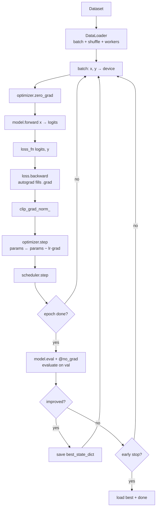
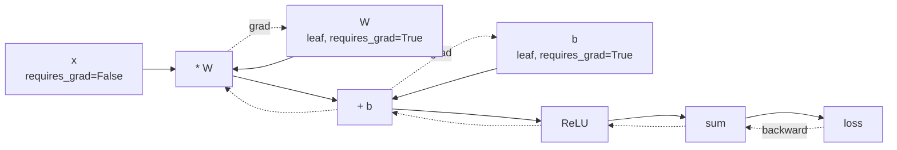
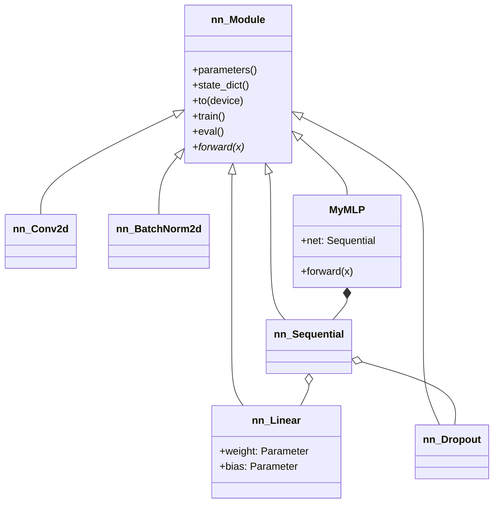

# 2. PyTorch Fundamentals

> [!note] Why this note exists
> This note covers **PyTorch** — Facebook/Meta's open-source deep learning framework and, since ~2020, the dominant library in research and increasingly in production. It explains what a `torch.Tensor` is and why it differs from a NumPy array (GPU + autograd), how the `torch.autograd` engine implements reverse-mode automatic differentiation, the `nn.Module` API for composing layers, the standard loss functions and optimizers, the canonical training loop, and the `Dataset`/`DataLoader` machinery for batching and shuffling. It stops short of distributed training (`DistributedDataParallel`), TorchScript/TorchExport, and domain libraries (`torchvision`, `torchtext`, `torchaudio`), which deserve their own treatment. After this note you should be able to write, train, and evaluate a small feed-forward or convolutional network from scratch.

## Why It Matters

Scikit-learn ([[1. Scikit-Learn]]) gives you classical ML on tabular data. The moment your input is a **high-dimensional unstructured signal** — an image, a waveform, a sentence, a graph — classical models plateau quickly and you need to learn *representations* from data. That is what deep learning is for, and PyTorch is currently the most popular way to do it in Python.

Why PyTorch specifically:

- **Eager execution by default.** Every operation runs immediately, so you can `print(t.shape)`, `print(t.dtype)`, drop into `pdb`, and reason about your program the way you reason about any other Python program. TensorFlow 1.x's static-graph `session.run()` mental model is gone; TensorFlow 2.x copied PyTorch here.
- **Dynamic computation graphs.** The graph is built as your code runs. Loops, `if` statements, recursion — all work naturally inside a forward pass.
- **`autograd` is genuinely magical.** You write the forward pass; the framework computes the backward pass for free. Most of "deep learning research" is "what new forward pass can I invent that autograd will still differentiate?".
- **Pythonic object model.** A model is just a class subclassing `nn.Module` with an `__init__` and a `forward`. You aren't locked into a `Sequential` container; you can branch, loop, and call other modules.
- **Research → production pipeline.** PyTorch for training, then export to ONNX or TorchExport for inference in C++ / Rust / mobile. PyTorch 2.x's `torch.compile` produces optimised graphs without changing your code.

The cost: PyTorch is **verbose** compared to Keras. A "compile + fit" workflow in Keras is 5 lines; the same in PyTorch is 30 lines. That verbosity is the price of flexibility.

## Background

### What is a tensor?

A `torch.Tensor` is a multi-dimensional array, like a NumPy `ndarray`, with two extra capabilities:

1. **It can live on a GPU.** `tensor.to('cuda')` moves it. Operations on a CUDA tensor run on the GPU and produce a CUDA tensor.
2. **It records operations for autograd.** If you create a tensor with `requires_grad=True`, every operation on it is recorded in a computation graph. Calling `.backward()` walks that graph in reverse and accumulates gradients into `.grad`.

```python
import torch

x = torch.tensor([1.0, 2.0, 3.0], requires_grad=True)
y = (x ** 2).sum()           # y = 1 + 4 + 9 = 14
y.backward()                  # dy/dx = 2x → [2, 4, 6]
print(x.grad)                 # tensor([2., 4., 6.])
```

That six-line program *is* deep learning in miniature. Every PyTorch model is just a more elaborate version: more operations, more parameters, but the same `forward → loss → backward → step` cycle.

### The tensor / ndarray bridge

```python
import numpy as np, torch

a = np.random.randn(3, 4).astype(np.float32)
t = torch.from_numpy(a)             # shares memory with `a`
b = t.numpy()                       # shares memory with `t`
t[0, 0] = 99
print(a[0, 0])                      # 99.0
```

`from_numpy` and `.numpy()` share memory — no copy. This is fantastic for interoperability with scikit-learn / pandas but a footgun if you mutate one expecting the other to stay the same.

### Devices

```python
device = torch.device('cuda' if torch.cuda.is_available() else 'cpu')
# or, more idiomatically:
device = 'cuda' if torch.cuda.is_available() else 'cpu'

t = torch.randn(10, 5).to(device)
model = MyModel().to(device)
```

Every tensor your model touches must be on the **same device**. A common crash: `RuntimeError: Expected all tensors to be on the same device, but found at least two devices, cuda:0 and cpu!`. Move input, target, and model all to the same device.

### Data types

PyTorch is strict about dtypes — it does not auto-promote the way NumPy does.

```python
torch.randn(3, 3)              # float32 (default)
torch.randn(3, 3).double()    # float64
torch.tensor([1, 2, 3])        # int64
torch.tensor([1, 2, 3], dtype=torch.int32)
torch.zeros(5, dtype=torch.bool)
```

Most models use `float32` everywhere. `float64` is rarely worth the 2× memory and 2× compute. Mixed-precision training (`torch.cuda.amp`) uses `float16` or `bfloat16` for the heavy matmuls — typically a 2× speedup on modern GPUs.

### Autograd in more detail

The autograd engine builds a **directed acyclic graph (DAG)** as your forward pass executes. Each node is a `Function` that knows:

- How to compute its output from inputs (the forward formula).
- How to compute the gradient of its inputs given the gradient of its output (the backward formula).

When you call `loss.backward()`, autograd traverses this DAG in reverse topological order, calling each node's backward and accumulating the result into each leaf tensor's `.grad`.

```python
W = torch.randn(5, 3, requires_grad=True)   # leaf
x = torch.randn(2, 5)                        # leaf, no grad needed
y = x @ W                                    # non-leaf, op recorded
loss = y.sum()
loss.backward()
print(W.grad.shape)   # torch.Size([5, 3])   ← gradient accumulated
print(x.grad)         # None                  ← x has no requires_grad
```

Three subtleties:

1. **`requires_grad`** can be set per-tensor and toggled with `torch.no_grad()` context manager — used during inference and evaluation to save memory.
2. **Gradients accumulate.** Calling `loss.backward()` twice without zeroing adds the two gradients. This is why every training loop starts with `optimizer.zero_grad()`.
3. **`detach()`** breaks the graph. `y_detached = y.detach()` returns a new tensor sharing storage but with no graph. Useful for logging intermediate values, freezing parameters, or implementing RL targets.

### Custom autograd — extending with new ops

If you implement a forward that autograd cannot differentiate (e.g. a custom CUDA kernel, or a non-differentiable operation like sorting that you want to gradient-hack), subclass `torch.autograd.Function`:

```python
class MyReLU(torch.autograd.Function):
    @staticmethod
    def forward(ctx, x):
        ctx.save_for_backward(x)
        return x.clamp(min=0)
    @staticmethod
    def backward(ctx, grad_output):
        x, = ctx.saved_tensors
        return grad_output * (x > 0).float()

# Use it:
y = MyReLU.apply(x)
```

Rare in practice — most custom layers can be expressed in terms of built-in ops and differentiated automatically.

## Main content

### `nn.Module`

`nn.Module` is the base class for all neural-network components. A module:

- Holds **parameters** (`nn.Parameter` — tensors with `requires_grad=True`).
- Holds **sub-modules** (registered via `self.layer = nn.Linear(...)`).
- Has a `forward` method that defines the computation.
- Provides `.to(device)`, `.cuda()`, `.eval()`, `.train()`, `.parameters()`, `.state_dict()`, `.load_state_dict()`.

```python
import torch.nn as nn

class MLP(nn.Module):
    def __init__(self, in_dim, hidden, out_dim, dropout=0.1):
        super().__init__()
        self.net = nn.Sequential(
            nn.Linear(in_dim, hidden),
            nn.ReLU(),
            nn.Dropout(dropout),
            nn.Linear(hidden, hidden),
            nn.ReLU(),
            nn.Dropout(dropout),
            nn.Linear(hidden, out_dim),
        )
    def forward(self, x):
        return self.net(x)

model = MLP(784, 256, 10)
print(model)                          # pretty-prints the architecture
print(sum(p.numel() for p in model.parameters()))   # total params
```

A few critical things to know:

- **You call the module like a function** (`model(x)`) rather than `model.forward(x)`. The `__call__` invokes hooks (profiling, debugging, forward pre-hooks) before calling `forward`. Always use `model(x)`.
- **`.train()` vs `.eval()`** flips the behaviour of `Dropout` (active in train, disabled in eval) and `BatchNorm` (updates running stats in train, uses them in eval). Forgetting to call `.eval()` before validation is a classic bug.
- **`nn.Parameter`** is just a tensor flagged as a learnable parameter. `model.parameters()` yields all of them; `model.named_parameters()` yields `(name, tensor)` tuples — useful for debugging and freezing.

### Built-in layers

```python
nn.Linear(in, out)                      # y = x W^T + b
nn.Conv2d(in_ch, out_ch, kernel_size, stride, padding)
nn.ConvTranspose2d(...)                 # "deconvolution" / upsampling
nn.BatchNorm1d / BatchNorm2d / LayerNorm / GroupNorm
nn.RNN / nn.LSTM / nn.GRU(input_size, hidden_size, num_layers, batch_first=True)
nn.Embedding(num_embeddings, embedding_dim)   # integer-index lookup table
nn.MultiheadAttention(embed_dim, num_heads, batch_first=True)
nn.Dropout(p)
nn.Flatten()
nn.MaxPool2d / AvgPool2d / AdaptiveAvgPool2d(output_size)
```

### Activation functions

```python
nn.ReLU()
nn.GELU()         # used in transformers
nn.SiLU()         # aka Swish — used in EfficientNet
nn.LeakyReLU(0.01)
nn.Sigmoid()      # binary classifier output
nn.Tanh()
nn.Softmax(dim=-1)   # NOTE: usually built into the loss, don't add to model
```

### Loss functions

```python
import torch.nn.functional as F
from torch import nn

nn.MSELoss()                       # regression
nn.L1Loss()                        # robust regression
nn.CrossEntropyLoss()              # multi-class classification (DO NOT softmax first!)
nn.BCEWithLogitsLoss()             # binary / multi-label classification (DO NOT sigmoid first!)
nn.NLLLoss()                       # negative log-likelihood, expects log-probs input
nn.SmoothL1Loss()                  # Huber loss — robust regression
nn.KLDivLoss()                     # KL divergence (expects log-probs input)
nn.CosineEmbeddingLoss()
nn.TripletMarginLoss()
```

The two most common mistakes:

1. **Adding `nn.Softmax()` at the end of a model trained with `nn.CrossEntropyLoss`.** The loss applies `log_softmax` internally; adding softmax yourself applies it twice, destroys gradients, and trains slowly or not at all. Output **raw logits**.
2. **Using `nn.BCELoss` instead of `nn.BCEWithLogitsLoss`.** The former requires sigmoided inputs and is numerically unstable; the latter takes logits and uses the log-sum-exp trick.

### Optimizers

```python
from torch import optim

optim.SGD(model.parameters(), lr=0.01, momentum=0.9, weight_decay=1e-4, nesterov=True)
optim.Adam(model.parameters(), lr=1e-3, betas=(0.9, 0.999), weight_decay=0)
optim.AdamW(model.parameters(), lr=1e-3, weight_decay=0.01)   # ← preferred over Adam+wd
optim.RMSprop(model.parameters(), lr=1e-3)
optim.Adagrad(model.parameters(), lr=1e-2)
optim.LBFGS(model.parameters(), lr=1.0)   # second-order, expensive, small models only
```

**`AdamW`** is the modern default for transformers and most deep nets. The original `Adam` with `weight_decay` is mathematically wrong — it applies the L2 penalty before the adaptive scaling, which makes the regularisation uneven across parameters. `AdamW` decouples the two.

#### Learning-rate schedulers

```python
from torch.optim.lr_scheduler import (
    StepLR, MultiStepLR, ExponentialLR, CosineAnnealingLR,
    CosineAnnealingWarmRestarts, ReduceLROnPlateau, OneCycleLR, LambdaLR,
)

scheduler = optim.lr_scheduler.OneCycleLR(optimizer, max_lr=1e-3,
                                          total_steps=num_training_steps)
scheduler = ReduceLROnPlateau(optimizer, mode='min', factor=0.5, patience=3)
# with ReduceLROnPlateau, you must pass the metric:
scheduler.step(val_loss)
```

Call `scheduler.step()` once per epoch for most schedulers; `OneCycleLR` and `CosineAnnealingWarmRestarts` are called per **batch**.

### The canonical training loop

```python
def train_one_epoch(model, loader, optimizer, loss_fn, device):
    model.train()
    running = 0.0
    n = 0
    for x, y in loader:
        x, y = x.to(device), y.to(device)

        optimizer.zero_grad(set_to_none=True)   # set_to_none=True is faster
        logits = model(x)
        loss = loss_fn(logits, y)
        loss.backward()
        torch.nn.utils.clip_grad_norm_(model.parameters(), max_norm=1.0)
        optimizer.step()
        scheduler.step()    # if using per-batch scheduler

        running += loss.item() * x.size(0)
        n += x.size(0)
    return running / n

@torch.no_grad()
def evaluate(model, loader, metric_fn, device):
    model.eval()
    total, correct = 0, 0
    for x, y in loader:
        x, y = x.to(device), y.to(device)
        logits = model(x)
        preds = logits.argmax(dim=-1)
        correct += (preds == y).sum().item()
        total += y.size(0)
    return correct / total
```

The five non-negotiables:

1. **`optimizer.zero_grad()`** at the start. Gradients accumulate.
2. **`loss.backward()`** populates `.grad` on every parameter.
3. **`optimizer.step()`** updates parameters using `.grad`.
4. **`model.train()` / `model.eval()`** before each phase.
5. **`@torch.no_grad()`** on evaluation — without it you OOM as the graph accumulates.

### `Dataset` and `DataLoader`

```python
from torch.utils.data import Dataset, DataLoader, TensorDataset, random_split

# Easy case: tensors already in memory
dataset = TensorDataset(X_tensor, y_tensor)

# Custom case:
class MyDataset(Dataset):
    def __init__(self, paths, transform=None):
        self.paths = paths
        self.transform = transform
    def __len__(self):
        return len(self.paths)
    def __getitem__(self, idx):
        x = load_one(self.paths[idx])        # whatever your data is
        y = label_from_path(self.paths[idx])
        if self.transform:
            x = self.transform(x)
        return x, y

loader = DataLoader(
    dataset,
    batch_size=64,
    shuffle=True,         # shuffle training set; leave False for val/test
    num_workers=4,        # background processes for data loading
    pin_memory=True,      # speeds up CPU→GPU copy
    drop_last=True,       # drop the small final batch — keeps BatchNorm happy
)

train_size = int(0.8 * len(dataset))
val_size   = len(dataset) - train_size
train_ds, val_ds = random_split(dataset, [train_size, val_size])
```

`num_workers > 0` spawns background processes that load and preprocess batches in parallel with training. Essential when each `__getitem__` does I/O (reading an image) or heavy CPU work (augmentation).

### Saving and loading

```python
# Checkpoint (resumable training):
torch.save({
    'epoch': epoch,
    'model_state_dict':     model.state_dict(),
    'optimizer_state_dict': optimizer.state_dict(),
    'scheduler_state_dict': scheduler.state_dict(),
    'val_loss': val_loss,
}, 'ckpt.pt')

# Resume:
ckpt = torch.load('ckpt.pt', map_location=device)
model.load_state_dict(ckpt['model_state_dict'])
optimizer.load_state_dict(ckpt['optimizer_state_dict'])

# Inference-only (smaller file):
torch.save(model.state_dict(), 'weights.pt')
model.load_state_dict(torch.load('weights.pt', map_location=device))
model.eval()
```

`state_dict` is an `OrderedDict` mapping parameter names to tensors. It is the canonical serialisation format — preferred over pickling the model directly, because it is robust to code refactors that move classes around.

## Mermaid diagrams

### The training loop



### The autograd DAG



### nn.Module composition



## Code examples

### Minimal MLP on MNIST

```python
import torch, torch.nn as nn
from torch.utils.data import DataLoader
from torchvision import datasets, transforms

device = 'cuda' if torch.cuda.is_available() else 'cpu'

tfm = transforms.Compose([
    transforms.ToTensor(),
    transforms.Normalize((0.1307,), (0.3081,)),    # MNIST mean / std
])
train_ds = datasets.MNIST('./data', train=True,  download=True, transform=tfm)
test_ds  = datasets.MNIST('./data', train=False, download=True, transform=tfm)
train_dl = DataLoader(train_ds, batch_size=128, shuffle=True,  num_workers=4, pin_memory=True)
test_dl  = DataLoader(test_ds,  batch_size=256, shuffle=False, num_workers=4)

class MLP(nn.Module):
    def __init__(self):
        super().__init__()
        self.net = nn.Sequential(
            nn.Flatten(),
            nn.Linear(28*28, 256), nn.GELU(), nn.Dropout(0.2),
            nn.Linear(256, 128),   nn.GELU(), nn.Dropout(0.2),
            nn.Linear(128, 10),
        )
    def forward(self, x): return self.net(x)

model = MLP().to(device)
opt = torch.optim.AdamW(model.parameters(), lr=1e-3, weight_decay=1e-4)
sched = torch.optim.lr_scheduler.OneCycleLR(opt, max_lr=1e-3,
                                            steps_per_epoch=len(train_dl), epochs=5)
loss_fn = nn.CrossEntropyLoss()

def train():
    model.train()
    for x, y in train_dl:
        x, y = x.to(device), y.to(device)
        opt.zero_grad(set_to_none=True)
        loss = loss_fn(model(x), y)
        loss.backward()
        opt.step(); sched.step()

@torch.no_grad()
def eval_():
    model.eval()
    correct = total = 0
    for x, y in test_dl:
        x, y = x.to(device), y.to(device)
        correct += (model(x).argmax(-1) == y).sum().item()
        total += y.size(0)
    return correct / total

for epoch in range(5):
    train()
    print(f"epoch {epoch+1}: test acc = {eval_():.4f}")
```

### A small CNN

```python
class CNN(nn.Module):
    def __init__(self, num_classes=10):
        super().__init__()
        self.features = nn.Sequential(
            nn.Conv2d(3, 32, 3, padding=1), nn.BatchNorm2d(32), nn.GELU(),
            nn.MaxPool2d(2),                                        # 32x16x16
            nn.Conv2d(32, 64, 3, padding=1), nn.BatchNorm2d(64), nn.GELU(),
            nn.MaxPool2d(2),                                        # 64x8x8
            nn.Conv2d(64, 128, 3, padding=1), nn.BatchNorm2d(128), nn.GELU(),
            nn.AdaptiveAvgPool2d(1),                                # 128x1x1
        )
        self.classifier = nn.Linear(128, num_classes)
    def forward(self, x):
        x = self.features(x).flatten(1)
        return self.classifier(x)
```

### Custom training step with mixed precision

```python
from torch.cuda.amp import autocast, GradScaler

scaler = GradScaler()

def train_amp(model, loader, opt, loss_fn, device):
    model.train()
    for x, y in loader:
        x, y = x.to(device), y.to(device)
        opt.zero_grad(set_to_none=True)
        with autocast(dtype=torch.float16):
            logits = model(x)
            loss = loss_fn(logits, y)
        scaler.scale(loss).backward()
        scaler.unscale_(opt)
        torch.nn.utils.clip_grad_norm_(model.parameters(), 1.0)
        scaler.step(opt)
        scaler.update()
```

`torch.cuda.amp` gives a typical 1.5–2× speedup on Ampere/Hopper GPUs for almost no code change. In PyTorch 2.x you can also use `torch.amp.autocast('cuda', dtype=torch.bfloat16)` — `bfloat16` doesn't need a `GradScaler` and is the default on modern Google/TPU hardware.

### `torch.compile` (PyTorch 2.x)

```python
model = MLP().to(device)
model = torch.compile(model, mode='default')    # JIT-fuses ops, ~20-50% faster
# Then train normally — nothing else changes.
```

`torch.compile` analyses your forward pass, fuses element-wise ops, and generates optimised kernels. On most workloads it's a free 20–50% speedup with no code changes. If it breaks something, fall back to `mode='reduce-overhead'` or just remove it.

## Common Pitfalls

> [!warning] Softmax + CrossEntropyLoss
> `nn.CrossEntropyLoss` expects **raw logits**. Adding `nn.Softmax()` at the end of your model is the #1 beginner bug — it doesn't crash, but training is slow and accuracy caps ~10% below where it should be.

> [!warning] Forgetting `model.train()` / `model.eval()`
> Validation accuracy will look fine but be slightly worse than it should, or training will mysteriously degrade. `Dropout` will drop units during validation; `BatchNorm` will update its running statistics on validation data. Always toggle.

> [!warning] Forgetting `optimizer.zero_grad()`
> Gradients accumulate across iterations. Without zeroing, each batch's gradient is added to the previous, producing nonsensical updates and divergence within a few epochs.

> [!warning] Not using `@torch.no_grad()` in evaluation
> Without it, autograd builds a graph for every batch, memory grows linearly, and you OOM after a few hundred batches. Always decorate evaluation functions.

> [!warning] Device mismatch
> `RuntimeError: Expected all tensors to be on the same device`. Every tensor — input, target, model, loss weights — must be on the same device. Move them in the training loop with `.to(device)`.

> [!warning] `view` vs `reshape`
> `view` requires contiguous memory; `reshape` doesn't (it copies if needed). Use `reshape` if unsure, `view` if you're confident the tensor is contiguous (after a `flatten()` or a `permute().contiguous()`).

> [!warning] `batch_first` confusion in RNNs
> `nn.LSTM` defaults to `(seq, batch, feature)`. Almost always pass `batch_first=True` to get the more intuitive `(batch, seq, feature)`. Forgetting this leads to mysterious shape errors several layers down.

> [!warning] Mutating a tensor that requires grad
> In-place ops on tensors with `requires_grad=True` can break autograd. `x.add_(1)` works sometimes, errors other times. Prefer functional style: `x = x + 1`.

> [!warning] `DataLoader(num_workers=N)` on Windows / macOS
> Multiprocessing uses `spawn` on Windows and macOS (pre-fork is unavailable). Your `Dataset` and any transforms must be picklable. Lambdas and closures are not — use `functools.partial` or named functions.

> [!warning] Saving the whole model vs `state_dict`
> `torch.save(model, 'm.pt')` pickles the entire object, including the class definition's path. Loading it requires the same module structure to be importable. Always save `state_dict` instead.

## Tips and Tricks

- **`torch.set_printoptions(precision=4, sci_mode=False)`** — much easier to read tensor output during debugging.
- **`tensor.is_leaf`** — tells you whether a tensor is a leaf (the thing autograd accumulates `.grad` into). Useful when debugging "why is my `.grad` None?".
- **`torch.autograd.set_detect_anomaly(True)`** — runs a slow mode that pinpoints which op produced a NaN. Slows training ~10× but saves hours of debugging.
- **`with torch.no_grad():` blocks** — for any computation that doesn't need gradients (evaluation, feature extraction for k-NN on embeddings, computing metrics).
- **`tensor.detach().cpu().numpy()`** — the canonical chain to get a value out of a GPU tensor for logging or plotting.
- **`torch.utils.tensorboard.SummaryWriter`** — log scalars, histograms, images, and the model graph to TensorBoard. The default way to monitor PyTorch training.
- **`torchinfo.summary(model, input_size=(1, 3, 32, 32))`** — beautiful per-layer parameter counts and output shapes. Install: `pip install torchinfo`.
- **Freeze layers** with `for p in model.backbone.parameters(): p.requires_grad = False`. Combined with `optimizer = AdamW([p for p in model.parameters() if p.requires_grad], lr=1e-3)`.
- **`parameter.grad` is None until the first backward** — don't be confused; lazy allocation.
- **`set_to_none=True` in `zero_grad`** — since PyTorch 1.7, the fastest way to zero gradients is to set them to `None` rather than zero. The next `backward` allocates fresh.
- **Pin memory + non-blocking transfer**: `x = x.to(device, non_blocking=True)` with `pin_memory=True` in the DataLoader overlaps the CPU→GPU transfer with the previous batch's compute.
- **`torch.compile` your model**, but be ready to disable it when debugging — error messages from inside compiled graphs are sometimes opaque.
- **Gradient accumulation** for big effective batch sizes that don't fit in GPU memory:
  ```python
  for i, (x, y) in enumerate(loader):
      loss = loss_fn(model(x), y) / accum_steps
      loss.backward()
      if (i + 1) % accum_steps == 0:
          optimizer.step(); optimizer.zero_grad()
  ```
- **Reproducibility**: set `torch.manual_seed(42)`, `torch.cuda.manual_seed_all(42)`, `torch.backends.cudnn.deterministic = True`, `torch.use_deterministic_algorithms(True)`. Even then, GPU non-determinism means runs are not bit-identical across machines.

## Active Recall

> [!question] What two things does a `torch.Tensor` have that a NumPy `ndarray` lacks?
> (1) It can be moved to and operated on by a GPU. (2) It can track operations for autograd if `requires_grad=True`.

> [!question] What is the difference between `tensor.view(...)` and `tensor.reshape(...)`?
> `view` requires the tensor to be contiguous in memory and never copies; `reshape` copies if needed. Use `reshape` unless you specifically need the no-copy guarantee of `view`.

> [!question] Why must you call `optimizer.zero_grad()` before `loss.backward()`?
> PyTorch **accumulates** gradients into `.grad` on each backward pass. Without zeroing, the new gradient is added to the previous iteration's, producing incorrect updates.

> [!question] What happens if you put `nn.Softmax(dim=-1)` at the end of a model and train with `nn.CrossEntropyLoss`?
> `CrossEntropyLoss` already applies `log_softmax` internally. Adding softmax double-applies it, destroying the gradient signal and giving very poor convergence. Output raw logits.

> [!question] What does `model.eval()` actually change?
> It sets `self.training = False` on every submodule. This changes behaviour for `Dropout` (becomes identity) and `BatchNorm`/`LayerNorm` with running stats (uses cached stats instead of batch stats, doesn't update them).

> [:question] Why use `AdamW` instead of `Adam` with `weight_decay`?
> Because `Adam`'s weight decay is applied before the adaptive per-parameter scaling, which mangles the regularisation. `AdamW` decouples weight decay from the gradient update, applying it uniformly — the correct L2 regularisation.

> [!question] When is `@torch.no_grad()` necessary?
> During evaluation, inference, and any computation where you don't need gradients. It prevents autograd from building a graph (saving memory) and speeds up computation by ~30%.

> [!question] What does `pin_memory=True` do in a DataLoader, and when does it help?
> It allocates page-locked (pinned) host memory, which enables faster DMA to the GPU. Combined with `.to(device, non_blocking=True)` it overlaps the transfer with compute. Helps whenever the GPU is waiting on the CPU for data.

## Next Steps

- [[3. TensorFlow Fundamentals]] — the alternative. Keras's `compile + fit` API is dramatically more concise for simple models; knowing both helps you read both ecosystems' code.
- [[1. Scikit-Learn]] — for the classical baselines. Always compare your neural net against a random forest; on tabular data the forest often wins.
- [[23. NumPy]] — PyTorch tensors are NumPy's spiritual cousin; broadcasting rules and indexing tricks transfer directly.
- [[14. Concurrency]] / [[20. Advanced Async]] — data loading with `DataLoader(num_workers=N)` is multiprocessing under the hood; understanding `spawn` vs `fork` explains Windows/macOS errors.
- [[15. Memory and Performance]] — mixed precision, gradient accumulation, and `torch.compile` are all memory-and-performance tricks.
- [[31. Projects/4. Build an Image Pipeline]] — natural follow-on: build a CV preprocessing pipeline that feeds into a PyTorch classifier.
- [[12. Testing]] — ML code is notoriously under-tested; property-based tests for shapes and dtypes catch an enormous class of bugs.
