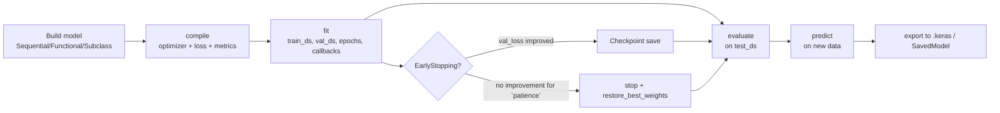
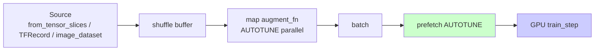
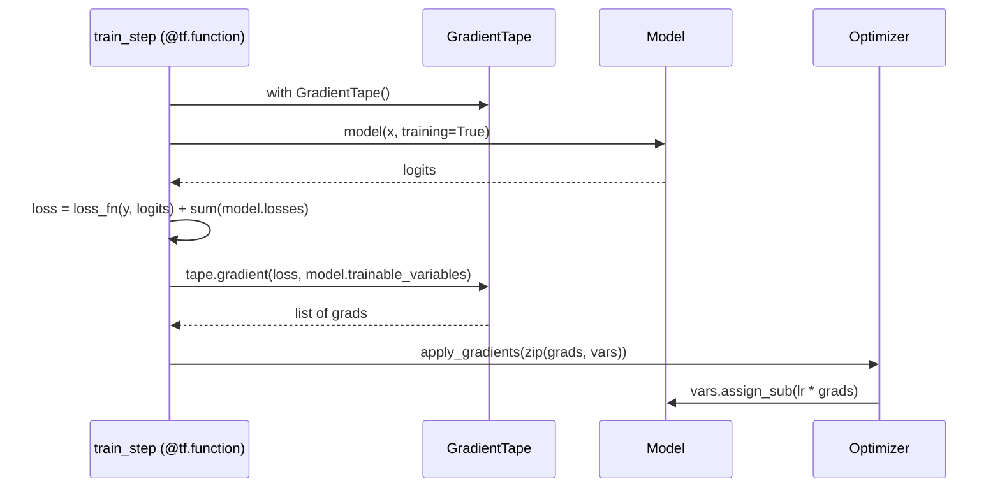

# 3. TensorFlow Fundamentals

> [!note] Why this note exists
> This note covers **TensorFlow** — Google's open-source numerical-computation and machine-learning platform — and its high-level API **Keras**, which since TF 2.x is the default way to build and train neural networks. It explains the differences from PyTorch ([[2. PyTorch Fundamentals]]), the tensor and `Variable` primitives, the `tf.keras.layers` / `tf.keras.models` API, the `compile → fit → evaluate → predict` cycle, callbacks, the `tf.data` input pipeline, and the modern `Keras 3` multi-backend story. It stops short of TPU training, TensorFlow Serving, TensorFlow Lite, and TensorFlow.js, each of which deserves its own treatment. After this note you should be able to build, train, and evaluate a Keras model and know when to choose TensorFlow over PyTorch.

## Why It Matters

TensorFlow is the other heavyweight deep-learning framework. Its strengths relative to PyTorch:

- **Keras is dramatically more concise.** A simple classifier is `compile + fit` — five lines vs PyTorch's thirty. For fast prototyping on standard architectures, this matters.
- **Production story is mature.** TensorFlow Serving (gRPC + REST), TFLite (mobile), TF.js (browser), and the SavedModel format are battle-tested at Google scale. PyTorch has closed the gap with TorchExport and ExecuTorch, but TF still has the edge in deployment breadth.
- **`tf.data` is excellent.** A fluent API for building input pipelines (map, batch, prefetch, cache, shuffle, interleave) that handles streaming, distributed training, and GPU prefetch in a few lines.
- **Multi-backend Keras 3.** As of 2024, Keras can run on TensorFlow, PyTorch, or JAX backends with the same code. You can prototype in Keras and ship on PyTorch.
- **TPU support** out of the box — Google's TPUs are the cheapest way to train very large models, and TensorFlow is the only first-class path to them.

Where PyTorch still wins:

- **Research flexibility.** Dynamic graphs and the Pythonic `nn.Module` are more ergonomic for unusual architectures (looped, recursive, conditional).
- **Community momentum.** As of 2024, most papers publish PyTorch reference implementations. Hugging Face Transformers, despite supporting both, defaults to PyTorch.
- **Eager debugging.** PyTorch's eager execution was always eager; TF 1.x's `session.run()` model left a generation of users with debugging trauma. TF 2.x fixed this by adopting eager by default, but the cultural memory remains.

The practical rule of thumb: **PyTorch for research, TensorFlow for production-scale deployment**. Both can do both; the sweet spots differ.

## Background

### TF 1.x vs TF 2.x — a brief history

TensorFlow 1.x (2015–2019) was built around a **static computation graph** and a `tf.Session`. You defined the graph symbolically (creating `tf.Placeholder` and `tf.Variable` nodes), then ran `session.run(loss, feed_dict={x: data})` to execute it. This was fast for production deployment (the graph could be optimised, frozen, and shipped to C++ / mobile) but miserable for debugging — `print` didn't work, errors surfaced only at `session.run`, and control flow required special `tf.cond` / `tf.while_loop` ops.

TF 2.x (2019–) defaulted to **eager execution** (operations run immediately, like PyTorch) and promoted **Keras** to the official high-level API. `tf.function` is the bridge: decorate a Python function with `@tf.function` and TF traces it into a graph for performance and deployability. Best of both worlds: eager for development, graph for production.

### Keras 3 — the multi-backend era

Keras 3 (late 2023) decoupled Keras from TensorFlow: the same model code can run on TensorFlow, PyTorch, or JAX backends. Set `KERAS_BACKEND=jax` (or `torch`, or `tensorflow`) and the same `keras.Sequential` trains on whichever engine you chose. This makes Keras a compelling "learn once, run anywhere" layer above the framework wars.

```bash
export KERAS_BACKEND=tensorflow   # or: torch, jax
```

```python
import os; os.environ['KERAS_BACKEND'] = 'jax'
import keras
```

## Main content

### Tensors and Variables

```python
import tensorflow as tf

# Constants (immutable, no gradients):
c = tf.constant([[1., 2.], [3., 4.]])
print(c.dtype, c.shape)   # <dtype: 'float32'> (2, 2)

# Variables (mutable, trainable):
v = tf.Variable(initial_value=tf.random.normal((3, 3)), trainable=True)
v.assign([[1, 2, 3], [4, 5, 6], [7, 8, 9]])
v.assign_add(tf.ones((3, 3)))     # in-place add

# Operations:
a = tf.constant([[1., 2.], [3., 4.]])
b = tf.constant([[5., 6.], [7., 8.]])
print(tf.matmul(a, b))            # matmul
print(a @ b)                      # same, Python operator
print(a + b, a * b, tf.reduce_sum(a), tf.transpose(a))
```

Tensors are immutable; Variables are mutable and have an `assign` API. Trainable variables are tracked by Keras automatically when assigned to a `Layer` or `Model`.

### Devices and GPU placement

```python
print(tf.config.list_physical_devices('GPU'))
# Memory growth — don't grab all GPU memory at startup:
for gpu in tf.config.list_physical_devices('GPU'):
    tf.config.experimental.set_memory_growth(gpu, True)
```

Unlike PyTorch, TensorFlow **automatically** places ops on the GPU if one is available. You rarely write `.to('cuda')`. The cost: TF grabs **all** GPU memory by default — set `set_memory_growth(True)` to fix that, or you'll OOM everyone else on a shared machine.

### `tf.keras.layers`

```python
from tensorflow import keras
from tensorflow.keras import layers

layers.Dense(128, activation='relu', use_bias=True,
             kernel_initializer='he_normal', kernel_regularizer='keras.regularizers.l2(1e-4)')
layers.Conv2D(32, 3, strides=1, padding='same', activation='relu')
layers.MaxPooling2D(2)
layers.GlobalAveragePooling2D()
layers.BatchNormalization()
layers.LayerNormalization()
layers.Dropout(0.3)
layers.Flatten()
layers.Embedding(input_dim=10000, output_dim=128)
layers.LSTM(128, return_sequences=False)
layers.GRU(128)
layers.MultiHeadAttention(num_heads=4, key_dim=64)
layers.ReLU()
layers.Softmax()
```

Every layer is a callable: `out = layer(inp)`. Layers manage their own variables — `Dense` creates `kernel` and `bias` Variables lazily on first call (shape inferred from input).

### `tf.keras.models`

```python
# 1. Sequential — linear stack, easiest:
model = keras.Sequential([
    keras.Input(shape=(784,)),          # explicit input shape (recommended)
    layers.Dense(256, activation='relu'),
    layers.Dropout(0.2),
    layers.Dense(128, activation='relu'),
    layers.Dropout(0.2),
    layers.Dense(10, activation='softmax'),
])

# 2. Functional API — multi-input, multi-output, shared layers:
inp = keras.Input(shape=(784,), name='features')
x = layers.Dense(256, activation='relu')(inp)
x = layers.Dropout(0.2)(x)
aux_in = keras.Input(shape=(10,), name='aux')
x = layers.concatenate([x, aux_in])
out = layers.Dense(10, activation='softmax')(x)
model = keras.Model(inputs=[inp, aux_in], outputs=out)

# 3. Subclassing — full flexibility, like nn.Module:
class MyModel(keras.Model):
    def __init__(self):
        super().__init__()
        self.d1 = layers.Dense(256, activation='relu')
        self.drop = layers.Dropout(0.2)
        self.d2 = layers.Dense(10, activation='softmax')
    def call(self, x, training=False):
        x = self.d1(x)
        x = self.drop(x, training=training)   # training flag toggles dropout
        return self.d2(x)
model = MyModel()
model.build((None, 784))    # or just call once with sample data
```

Use **Sequential** for linear stacks, the **Functional API** for everything else (it's the sweet spot — most production code), and **Subclassing** only when you need custom forward logic that the Functional API can't express.

### `compile`, `fit`, `evaluate`, `predict`

```python
model.compile(
    optimizer=keras.optimizers.AdamW(learning_rate=1e-3, weight_decay=1e-4),
    loss=keras.losses.SparseCategoricalCrossentropy(),   # integer labels
    metrics=[keras.metrics.SparseCategoricalAccuracy(name='acc')],
)

history = model.fit(
    x_train, y_train,
    validation_data=(x_val, y_val),
    epochs=20,
    batch_size=128,
    callbacks=[...],
)

test_metrics = model.evaluate(x_test, y_test, verbose=2)
preds = model.predict(x_new)
```

The `compile` step wires the model to an optimizer, a loss function, and a list of metrics. `fit` runs the training loop, returns a `History` object whose `.history` dict contains per-epoch loss and metric values.

### Loss functions — the "from_logits" question

```python
# Option A — model ends in softmax, use *_crossentropy (no from_logits):
layers.Dense(10, activation='softmax')
loss = keras.losses.SparseCategoricalCrossentropy()       # expects probabilities

# Option B — model ends in linear (no activation), use from_logits=True:
layers.Dense(10)   # raw logits
loss = keras.losses.SparseCategoricalCrossentropy(from_logits=True)
```

**Prefer Option B.** `from_logits=True` is more numerically stable (uses the log-sum-exp trick internally) and is the modern default. The same trap as PyTorch: don't double-softmax.

### Built-in optimizers

```python
keras.optimizers.SGD(learning_rate=0.01, momentum=0.9, nesterov=True)
keras.optimizers.RMSprop(learning_rate=1e-3, rho=0.9)
keras.optimizers.Adam(learning_rate=1e-3, beta_1=0.9, beta_2=0.999)
keras.optimizers.AdamW(learning_rate=1e-3, weight_decay=1e-4)   # preferred
keras.optimizers.Nadam(learning_rate=1e-3)
keras.optimizers.Lion(learning_rate=1e-4)                       # newer, memory-efficient
```

For learning-rate schedules:

```python
schedule = keras.optimizers.schedules.CosineDecay(
    initial_learning_rate=1e-3, decay_steps=10000, alpha=0.01,
)
opt = keras.optimizers.AdamW(learning_rate=schedule)
```

### Callbacks

```python
callbacks = [
    keras.callbacks.ModelCheckpoint('best.weights.h5',
                                    save_best_only=True,
                                    monitor='val_loss',
                                    save_weights_only=True),
    keras.callbacks.EarlyStopping(monitor='val_loss', patience=5,
                                  restore_best_weights=True),
    keras.callbacks.ReduceLROnPlateau(monitor='val_loss',
                                      factor=0.5, patience=2, min_lr=1e-6),
    keras.callbacks.CSVLogger('training.csv'),
    keras.callbacks.TensorBoard(log_dir='./logs'),
]
history = model.fit(..., callbacks=callbacks)
```

Callbacks are the killer feature of `fit`-style training. They make the boilerplate of training-loop bookkeeping (checkpointing, early stopping, LR decay, logging) a one-liner each. PyTorch users typically have to write this themselves.

### Custom training loop with `tf.GradientTape`

```python
@tf.function
def train_step(x, y):
    with tf.GradientTape() as tape:
        logits = model(x, training=True)
        loss = loss_fn(y, logits)
        # add regularisation losses:
        loss += sum(model.losses)
    grads = tape.gradient(loss, model.trainable_variables)
    optimizer.apply_gradients(zip(grads, model.trainable_variables))
    return loss

for epoch in range(epochs):
    for x, y in train_ds:
        loss = train_step(x, y)
```

`tf.GradientTape` is TensorFlow's answer to PyTorch's autograd: it records operations inside a `with` block, and `tape.gradient(target, sources)` computes `d target / d sources`. Wrap the whole step in `@tf.function` to trace it into a graph — usually 2–5× faster than eager.

### `tf.data` — the input pipeline

```python
ds = (tf.data.Dataset.from_tensor_slices((x_train, y_train))
      .shuffle(buffer_size=10000)
      .batch(128)
      .map(augment_fn, num_parallel_calls=tf.data.AUTOTUNE)
      .prefetch(tf.data.AUTOTUNE))

# From files (image directory):
ds = keras.utils.image_dataset_from_directory(
    'data/train', image_size=(224, 224), batch_size=32,
    shuffle=True, seed=42, label_mode='categorical',
)

# From TFRecords (large-scale):
raw = tf.data.TFRecordDataset('shard-0001.tfrecord')
ds = raw.map(parse_example, num_parallel_calls=AUTOTUNE).batch(256).prefetch(AUTOTUNE)
```

`prefetch(AUTOTUNE)` lets the CPU prepare the next batch while the GPU trains on the current one — overlap is automatic. `tf.data` is one of TF's strongest features; it is more declarative and more performant than PyTorch's `DataLoader` for complex pipelines.

### Saving and loading

```python
# Save the whole model (architecture + weights + optimizer state):
model.save('model.keras')                # Keras 3 native format (.keras)
model = keras.models.load_model('model.keras')

# Weights only:
model.save_weights('weights.weights.h5')
model.load_weights('weights.weights.h5')

# Export to SavedModel (for TF Serving, TFLite, etc.):
model.export('saved_model_dir')
```

`.keras` is the modern archive format (a zip with config + weights). The legacy `.h5` format still works for weights. For deployment to non-Python runtimes (TF Serving, TFLite), export to `SavedModel`.

## Mermaid diagrams

### TensorFlow / Keras architecture

```mermaid
flowchart TB
    subgraph Frontend
        K[Keras 3 API<br/>Sequential / Functional / Subclass]
    end
    subgraph Backends
        TF[TensorFlow]
        PT[PyTorch]
        JAX[JAX]
    end
    K -->|KERAS_BACKEND=tensorflow| TF
    K -->|KERAS_BACKEND=torch| PT
    K -->|KERAS_BACKEND=jax| JAX

    TF --> Eager[Eager execution]
    Eager -->|@tf.function| Graph[XLA graph]
    Graph --> CPU[CPU]
    Graph --> GPU[GPU]
    Graph --> TPU[TPU]

    subgraph Layers
        L1[Dense]
        L2[Conv2D]
        L3[LSTM]
        L4[BatchNorm]
        L5[MultiHeadAttention]
    end
    K --> Layers
    Layers --> Vars[tf.Variable<br/>trainable]
```

### The `compile → fit → evaluate → predict` cycle



### `tf.data` pipeline



### Custom training step with GradientTape



## Code examples

### MNIST classifier — the canonical 10-line Keras model

```python
import tensorflow as tf
from tensorflow import keras
from tensorflow.keras import layers

(x_train, y_train), (x_test, y_test) = keras.datasets.mnist.load_data()
x_train = x_train.astype('float32') / 255.0
x_test  = x_test.astype('float32')  / 255.0

model = keras.Sequential([
    keras.Input(shape=(28, 28)),
    layers.Flatten(),
    layers.Dense(128, activation='relu'),
    layers.Dropout(0.2),
    layers.Dense(10, activation='softmax'),
])

model.compile(optimizer='adam',
              loss='sparse_categorical_crossentropy',
              metrics=['accuracy'])

model.fit(x_train, y_train, validation_split=0.1, epochs=5, batch_size=128)
print("Test:", model.evaluate(x_test, y_test, verbose=0))
```

That's the whole program. Compare to the PyTorch version which is ~50 lines. This is Keras's killer feature.

### CNN on CIFAR-10 with `tf.data` and callbacks

```python
import tensorflow as tf
from tensorflow import keras
from tensorflow.keras import layers

def make_datasets():
    (x, y), (xt, yt) = keras.datasets.cifar10.load_data()
    x  = x.astype('float32')  / 255.0
    xt = xt.astype('float32') / 255.0
    def augment(img, label):
        img = tf.image.random_flip_left_right(img)
        img = tf.image.random_brightness(img, max_delta=0.1)
        return img, label
    train = (tf.data.Dataset.from_tensor_slices((x, y))
             .shuffle(50000).batch(128).map(augment, tf.data.AUTOTUNE)
             .prefetch(tf.data.AUTOTUNE))
    test  = (tf.data.Dataset.from_tensor_slices((xt, yt))
             .batch(256).prefetch(tf.data.AUTOTUNE))
    return train, test

def make_model():
    inp = keras.Input(shape=(32, 32, 3))
    x = layers.Conv2D(32, 3, padding='same', activation='relu')(inp)
    x = layers.BatchNormalization()(x)
    x = layers.Conv2D(32, 3, padding='same', activation='relu')(x)
    x = layers.MaxPooling2D()(x)
    x = layers.Conv2D(64, 3, padding='same', activation='relu')(x)
    x = layers.BatchNormalization()(x)
    x = layers.Conv2D(64, 3, padding='same', activation='relu')(x)
    x = layers.MaxPooling2D()(x)
    x = layers.GlobalAveragePooling2D()(x)
    x = layers.Dropout(0.3)(x)
    out = layers.Dense(10)(x)             # raw logits
    return keras.Model(inp, out)

train_ds, test_ds = make_datasets()
model = make_model()
model.compile(
    optimizer=keras.optimizers.AdamW(learning_rate=1e-3, weight_decay=1e-4),
    loss=keras.losses.SparseCategoricalCrossentropy(from_logits=True),
    metrics=[keras.metrics.SparseCategoricalAccuracy(name='acc')],
)
callbacks = [
    keras.callbacks.ModelCheckpoint('cifar10.weights.h5',
                                    save_best_only=True, save_weights_only=True),
    keras.callbacks.EarlyStopping(patience=5, restore_best_weights=True),
    keras.callbacks.ReduceLROnPlateau(factor=0.5, patience=2),
]
model.fit(train_ds, validation_data=test_ds, epochs=50, callbacks=callbacks)
```

### Functional API with multiple inputs and outputs

```python
# Multi-task: predict class + regression of an attribute, given an image + tabular side-info.
img_in = keras.Input(shape=(224, 224, 3), name='image')
x = layers.Conv2D(32, 3, activation='relu')(img_in)
x = layers.MaxPooling2D()(x)
x = layers.Conv2D(64, 3, activation='relu')(x)
x = layers.GlobalAveragePooling2D()(x)
img_features = layers.Dense(64, activation='relu')(x)

tab_in = keras.Input(shape=(10,), name='tabular')
t = layers.Dense(32, activation='relu')(tab_in)

combined = layers.concatenate([img_features, t])
class_out = layers.Dense(5, activation='softmax', name='class')(combined)
reg_out   = layers.Dense(1, name='regression')(combined)

model = keras.Model(inputs=[img_in, tab_in], outputs=[class_out, reg_out])
model.compile(
    optimizer='adamw',
    loss={'class': 'categorical_crossentropy', 'regression': 'mse'},
    loss_weights={'class': 1.0, 'regression': 0.1},
    metrics={'class': 'accuracy', 'regression': 'mae'},
)
model.fit({'image': imgs, 'tabular': tabs},
          {'class': y_cls, 'regression': y_reg},
          epochs=10, batch_size=32)
```

### Custom layer

```python
class Linear(keras.layers.Layer):
    def __init__(self, units, **kw):
        super().__init__(**kw)
        self.units = units
    def build(self, input_shape):
        self.w = self.add_weight(
            shape=(input_shape[-1], self.units),
            initializer='he_normal', trainable=True, name='w')
        self.b = self.add_weight(
            shape=(self.units,), initializer='zeros', trainable=True, name='b')
    def call(self, x):
        return tf.matmul(x, self.w) + self.b

m = keras.Sequential([keras.Input(shape=(4,)), Linear(16), layers.ReLU(), Linear(3)])
```

`build` is called lazily on first `call`, once the input shape is known. `add_weight` registers the variable with the layer so it shows up in `model.trainable_variables` and is saved by `model.save_weights`.

### Transfer learning

```python
base = keras.applications.ResNet50(
    include_top=False, weights='imagenet',
    input_shape=(224, 224, 3))
base.trainable = False                # freeze backbone

model = keras.Sequential([
    base,
    layers.GlobalAveragePooling2D(),
    layers.Dropout(0.3),
    layers.Dense(10, activation='softmax'),
])
model.compile(optimizer='adamw', loss='sparse_categorical_crossentropy',
              metrics=['accuracy'])
model.fit(train_ds, validation_data=val_ds, epochs=5)

# Then fine-tune the top of the backbone:
base.trainable = True
for layer in base.layers[:-50]:
    layer.trainable = False
model.compile(optimizer=keras.optimizers.AdamW(1e-5),
              loss='sparse_categorical_crossentropy', metrics=['accuracy'])
model.fit(train_ds, validation_data=val_ds, epochs=5)
```

## Comparison: PyTorch vs TensorFlow

| Aspect | PyTorch | TensorFlow / Keras |
|--------|---------|--------------------|
| Owner | Meta | Google |
| Execution | Eager by default | Eager by default; `@tf.function` for graphs |
| API style | Object-oriented `nn.Module` | Functional + Sequential + Subclass |
| Simple model lines | ~30 | ~10 |
| Custom loop | First-class, easy | `GradientTape`, slightly verbose |
| Input pipeline | `DataLoader` + `Dataset` | `tf.data` — more declarative |
| Production | TorchExport, ExecuTorch (catching up) | TF Serving, TFLite, TF.js (mature) |
| TPU | Limited (via PyTorch/XLA) | First-class |
| Research momentum | Dominant in 2024 papers | Strong in industry, weaker in academia |
| Multi-backend | No | Keras 3 → TF, PyTorch, or JAX |
| Hub models | Hugging Face (default) | Hugging Face + TF Hub |
| Mixed precision | `torch.cuda.amp` | `keras.mixed_precision.set_global_policy('mixed_float16')` |
| Best for | Research, custom architectures | Production scale, mobile/web, TPUs |

Pick the one your team uses. The ML literature is increasingly framework-agnostic — architectures transfer; only the syntax differs.

## Common Pitfalls

> [!warning] `softmax` + `SparseCategoricalCrossentropy`
> Same trap as PyTorch: the loss function applies softmax internally when `from_logits=False` (default). If your model already ends in softmax, that's fine; if it ends in linear, set `from_logits=True` (preferred for numerical stability).

> [!warning] TF grabs all GPU memory
> By default TensorFlow pre-allocates 100% of GPU memory at startup. On a shared box this OOMs everyone else. Always call `tf.config.experimental.set_memory_growth(gpu, True)` for each GPU at the top of your script.

> [!warning] `model.fit` `validation_split` shuffles
> `validation_split=0.1` takes the **last** 10% of the training data after shuffling. If your data has temporal order (time series), this leaks future into past. Build a `tf.data.Dataset` and pass `validation_data=` instead.

> [!warning] Forgetting `training=` flag in custom `call`
> `Dropout` and `BatchNorm` need `training=` to know whether to apply dropout / update running stats. In subclassed models, propagate it: `def call(self, x, training=False): ... layers.Dropout(0.3)(x, training=training)`. In Sequential/Functional this is handled automatically.

> [!warning] `tf.function` and Python side effects
> A function decorated with `@tf.function` is traced once into a graph. `print`, logging, and any Python-only side effects happen **once at trace time**, not per call. Use `tf.print` for graph-time printing.

> [!warning] Mixing Keras 2 and Keras 3 APIs
> Keras 3 (2024+) renamed several methods and changed defaults. If you copy code from an old tutorial, it may use `tf.keras.optimizers.legacy.Adam` or `model.save('m.h5')` (legacy). Stick to one version's idioms.

> [!warning] `SparseCategoricalCrossentropy` expects **integer** labels
> If your labels are one-hot, use `CategoricalCrossentropy` instead. Mixing the two produces shape errors or silently wrong losses.

> [!warning] Not setting `restore_best_weights=True` in EarlyStopping
> Without this, EarlyStopping stops training but leaves the model at the **last** (worse) epoch's weights. You want the best epoch's weights, which is what `restore_best_weights=True` does.

## Tips and Tricks

- **`keras.utils.image_dataset_from_directory`** — the fastest way to start training on a folder of images. Returns a `tf.data.Dataset` with batching and label inference included.
- **Mixed precision** is a one-liner in Keras 3:
  ```python
  keras.mixed_precision.set_global_policy('mixed_float16')
  ```
  Typically 1.5–2× speedup on modern GPUs. Add `layers.Activation('linear', dtype='float32')` before the final softmax for numerical stability.
- **`keras.callbacks.TensorBoard(log_dir=...)`** — view training curves, the model graph, weight histograms, and projector embeddings in your browser with `tensorboard --logdir=logs`.
- **`keras.Model(...)` summary and plot**:
  ```python
  model.summary()                                     # text table
  keras.utils.plot_model(model, 'm.png', show_shapes=True)   # graph image
  ```
- **Subclass `keras.callbacks.Callback`** for custom logic:
  ```python
  class PrintLR(keras.callbacks.Callback):
      def on_epoch_end(self, epoch, logs=None):
          print(f"lr = {self.model.optimizer.learning_rate.numpy():.2e}")
  ```
- **`tf.data.Dataset.cache()`** — caches the dataset in memory (or to a file with `cache(filename)`). Place after `map` for heavy augmentation? No — cache **before** augmentation so the cheap pre-augmented data is cached and augmentation runs fresh each epoch. Cache **after** expensive non-random preprocessing.
- **`@tf.function` with `input_signature`** — fix the trace to avoid re-tracing on every new input shape:
  ```python
  @tf.function(input_signature=[tf.TensorSpec([None, 224, 224, 3], tf.float32)])
  def predict(x): return model(x)
  ```
- **`tf.saved_model.save`** for deployment — produces a directory with a `saved_model.pb` and `variables/` that TF Serving, TFLite Converter, and the C++ `libtensorflow` can load.
- **Distributed training with `tf.distribute.MirroredStrategy`**:
  ```python
  strategy = tf.distribute.MirroredStrategy()
  with strategy.scope():
      model = build_model()
      model.compile(...)
  model.fit(...)   # automatically uses all GPUs
  ```
- **`keras.applications`** — pre-trained ImageNet models (ResNet, EfficientNet, ConvNeXt, MobileNet, etc.) with one-liner weight loading. Great for transfer learning.
- **Keras Tuner** (`pip install keras-tuner`) — Bayesian / Hyperband / Random search over `hp.Choice`, `hp.Int`, `hp.Float`. Tighter integration than Optuna for pure-Keras workflows.
- **`model.export(path)`** (Keras 3) — the modern alternative to `tf.saved_model.save`. Inference-only artifact for production.
- **Debug NaN with `tf.debugging.check_numerics`** — insert `x = tf.debugging.check_numerics(x, 'x in layer N')` to localise where NaNs first appear.

## Active Recall

> [!question] What is the difference between `tf.constant` and `tf.Variable`?
> `tf.constant` is immutable; `tf.Variable` is mutable (has `assign`, `assign_add`, etc.) and is the type used for trainable parameters. Keras layers wrap their weights as `tf.Variable`.

> [!question] Why use `from_logits=True` with `SparseCategoricalCrossentropy`?
> Because the loss function then applies `log_softmax` internally using the numerically stable log-sum-exp formula. If your model ends in softmax and you set `from_logits=False` (default), you're applying softmax twice — slow convergence or no convergence.

> [!question] What are the three ways to build a Keras model?
> `Sequential` (linear stack), the Functional API (multi-input/output, shared layers), and subclassing `keras.Model` (full custom forward logic, like `nn.Module`).

> [!question] Why is `tf.data.Dataset.prefetch(AUTOTUNE)` important?
> It overlaps the CPU work of preparing the next batch with the GPU's training on the current batch. Without it, the GPU idles while the CPU prepares data. AUTOTUNE lets TF choose the prefetch buffer size automatically.

> [!question] What does `@tf.function` do?
> It traces the Python function into a TensorFlow graph on first call. Subsequent calls execute the cached graph, which is faster (op fusion, XLA compilation) and serialisable for deployment. Side effects like `print` happen only at trace time.

> [!question] What does `restore_best_weights=True` in `EarlyStopping` do?
> Without it, EarlyStopping stops training and leaves the model at the last (worse) epoch's weights. With it, the model's weights are rolled back to the epoch with the best monitored metric — what you actually want.

> [!question] When should you call `tf.config.experimental.set_memory_growth(gpu, True)`?
> At the start of any script that uses a GPU, especially on shared machines. Without it, TensorFlow pre-allocates 100% of GPU memory, starving other processes.

> [!question] In Keras 3, what determines which backend runs your model?
> The `KERAS_BACKEND` environment variable (`tensorflow`, `torch`, or `jax`). The same Keras code runs on any of the three. Set it before `import keras`.

## Next Steps

- [[2. PyTorch Fundamentals]] — the alternative. Knowing both lets you read papers from either ecosystem and switch when one fits the task better.
- [[1. Scikit-Learn]] — for the classical baselines and the preprocessing primitives (`StandardScaler`, `OneHotEncoder`, `Pipeline`) that Keras does not provide natively.
- [[23. NumPy]] — TensorFlow tensors interoperate with NumPy via `np.array(t)` and `tf.convert_to_tensor(a)`; broadcasting rules transfer.
- [[26. Image Processing]] — image augmentation is its own discipline; `tf.image` provides primitives but a deep understanding of convolution / filtering helps you design them.
- [[31. Projects/4. Build an Image Pipeline]] — natural follow-on: an image preprocessing pipeline that feeds a Keras classifier.
- [[31. Projects/5. Build a Data Analysis Pipeline]] — a full ETL + reporting pipeline often terminates in a quick model trained with Keras.
- [[12. Testing]] — `tf.test.TestCase` and `pytest` over custom layers / metrics catch an entire class of subtle bugs.
