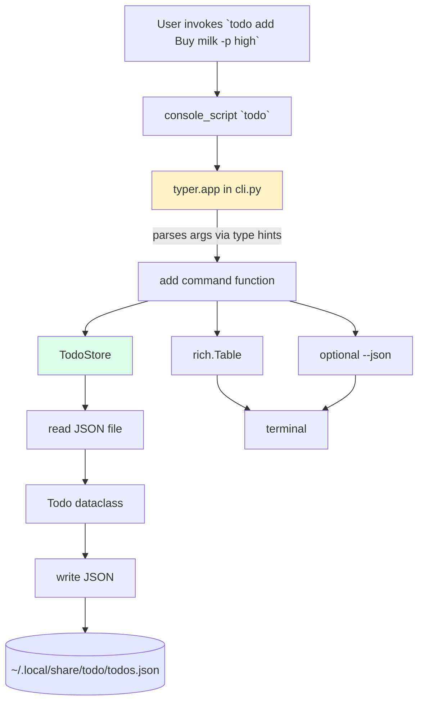
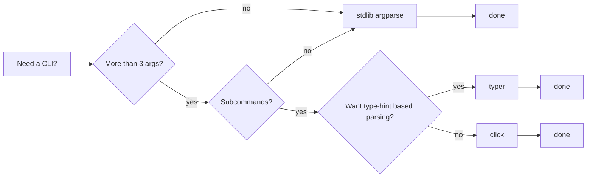
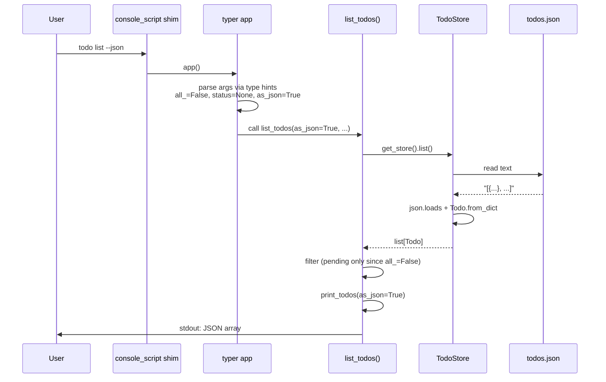

# 1. Build a CLI Tool

> [!note] Why this note exists
> This note is the first of five capstone projects in Chapter 31. It walks through building a **command-line application** end to end: choosing a framework (`argparse`, `click`, `typer`), structuring the project as a proper package, persisting data, packaging it with `pyproject.toml` so the tool becomes a single command on the user's `$PATH`, and testing the CLI with `pytest` + `CliRunner`. The running example is a **todo list manager** — small enough to fit in one file, complex enough to exercise every concept. After this note you should be able to ship a `pip install`able CLI of your own.

## Why It Matters

Most Python programs you'll write in a professional context have a CLI surface — even web apps typically have a `manage.py` or `flask` command for migrations, user creation, and admin tasks. A well-built CLI:

- **Documents itself.** `mytool --help` shows every command, flag, and default. No README needed for the basics.
- **Composes.** Output should be pipe-friendly: `mytool list | grep urgent | wc -l` should work.
- **Has sensible defaults.** A new user running `mytool` with no arguments should do something useful, not crash.
- **Is installable.** `pip install mytool` puts a `mytool` binary on `$PATH`. The user never types `python /path/to/main.py`.

Python's standard library gives you `argparse` for free; `click` and `typer` add power (subcommands, type validation, autocompletion, beautiful help) on top. The right choice depends on the project's complexity.

## Background

### The three CLI frameworks

| Framework | Stdlib? | Sweet spot | Cost |
|-----------|---------|------------|------|
| `argparse` | yes | Simple scripts, ≤ 1 level of subcommands | Verbose for big apps; no nested subcommands; no shell completion |
| `click` | no (`pip install click`) | Medium-to-large CLIs with many subcommands | Decorator-heavy; explicitly designed for composability |
| `typer` | no (`pip install typer`) | CLIs whose arguments map cleanly to typed functions | Built on click; uses type hints for arg parsing; near-zero boilerplate |

If you're writing anything more complex than `prog --input x --output y`, reach for `typer` or `click`. They pay back the install cost within the first day.

### The shape of a CLI package

```
todo/
├── pyproject.toml          # build config + entry point
├── README.md
├── src/
│   └── todo/
│       ├── __init__.py
│       ├── __main__.py     # so `python -m todo` works
│       ├── cli.py          # typer app + commands
│       ├── models.py       # data classes (Todo, etc.)
│       ├── storage.py      # persistence (JSON / SQLite)
│       └── config.py       # paths, defaults
└── tests/
    ├── conftest.py
    ├── test_storage.py
    └── test_cli.py
```

Two important conventions:

1. **`src/` layout.** Putting your package under `src/` (rather than `todo/` at the project root) prevents Python from accidentally importing the local directory during tests, which masks packaging bugs. Modern Python packaging strongly recommends this.
2. **`__main__.py`** enables `python -m todo`. Useful for "run from source without installing" workflows.

## Main content

### The example: a todo list CLI

We want these commands:

```bash
todo add "buy milk" --priority high --due 2025-12-31
todo list                 # show pending
todo list --all           # show all
todo list --status done   # filter
todo done 3               # mark task 3 as completed
todo delete 5
todo edit 2 --priority low
todo clear --done         # delete all completed
```

Plus:

- Persistent storage in `~/.local/share/todo/todos.json` (or `%APPDATA%\todo\todos.json` on Windows — use `platformdirs` to be portable).
- Pretty output with colors (only when stdout is a TTY).
- JSON output for scripting: `todo list --json | jq ...`.

### Step 1: The data model

```python
# src/todo/models.py
from __future__ import annotations
from dataclasses import dataclass, asdict, field
from datetime import date, datetime
from enum import Enum
from typing import Any

class Priority(str, Enum):
    low = "low"
    medium = "medium"
    high = "high"

class Status(str, Enum):
    pending = "pending"
    done = "done"

@dataclass
class Todo:
    id: int
    title: str
    priority: Priority = Priority.medium
    status: Status = Status.pending
    due: date | None = None
    created_at: datetime = field(default_factory=datetime.now)
    completed_at: datetime | None = None

    def to_dict(self) -> dict[str, Any]:
        d = asdict(self)
        d["priority"] = self.priority.value
        d["status"] = self.status.value
        d["created_at"] = self.created_at.isoformat()
        d["due"] = self.due.isoformat() if self.due else None
        d["completed_at"] = self.completed_at.isoformat() if self.completed_at else None
        return d

    @classmethod
    def from_dict(cls, d: dict[str, Any]) -> "Todo":
        return cls(
            id=d["id"],
            title=d["title"],
            priority=Priority(d["priority"]),
            status=Status(d["status"]),
            due=date.fromisoformat(d["due"]) if d["due"] else None,
            created_at=datetime.fromisoformat(d["created_at"]),
            completed_at=datetime.fromisoformat(d["completed_at"]) if d["completed_at"] else None,
        )
```

Using a `str`-backed `Enum` makes serialisation trivial and the JSON file human-readable.

### Step 2: Storage

```python
# src/todo/storage.py
from __future__ import annotations
import json
from pathlib import Path
from typing import Optional
from .models import Todo

class TodoStore:
    def __init__(self, path: Path):
        self.path = Path(path)
        self.path.parent.mkdir(parents=True, exist_ok=True)
        if not self.path.exists():
            self.path.write_text("[]")

    def _read(self) -> list[Todo]:
        return [Todo.from_dict(d) for d in json.loads(self.path.read_text())]

    def _write(self, todos: list[Todo]) -> None:
        self.path.write_text(json.dumps([t.to_dict() for t in todos],
                                        indent=2, ensure_ascii=False))

    def list(self) -> list[Todo]:
        return self._read()

    def next_id(self, todos: list[Todo]) -> int:
        return max((t.id for t in todos), default=0) + 1

    def add(self, todo: Todo) -> Todo:
        todos = self._read()
        todo.id = self.next_id(todos)
        todos.append(todo)
        self._write(todos)
        return todo

    def update(self, todo_id: int, **fields) -> Optional[Todo]:
        todos = self._read()
        for t in todos:
            if t.id == todo_id:
                for k, v in fields.items():
                    if v is not None and hasattr(t, k):
                        setattr(t, k, v)
                self._write(todos)
                return t
        return None

    def delete(self, todo_id: int) -> bool:
        todos = self._read()
        new = [t for t in todos if t.id != todo_id]
        if len(new) == len(todos):
            return False
        self._write(new)
        return True

    def find(self, todo_id: int) -> Optional[Todo]:
        for t in self._read():
            if t.id == todo_id:
                return t
        return None
```

For a single-user CLI, a JSON file is fine. If you ever need concurrent writes, transactions, or queries, swap in SQLite — it's in the stdlib.

### Step 3: Config and paths

```python
# src/todo/config.py
from __future__ import annotations
from pathlib import Path
try:
    from platformdirs import user_data_path
    DATA_DIR = user_data_path("todo")
except ImportError:
    # Fallback if platformdirs isn't installed
    DATA_DIR = Path.home() / ".local" / "share" / "todo"

DB_PATH = DATA_DIR / "todos.json"
```

`platformdirs` resolves the right directory on every OS — Linux (`~/.local/share/`), macOS (`~/Library/Application Support/`), Windows (`%APPDATA%\`). Never hard-code `~/.todo`; it's wrong on Windows.

### Step 4: The CLI with `typer`

```python
# src/todo/cli.py
from __future__ import annotations
from datetime import date
from typing import Optional
import json
import sys

import typer
from rich.console import Console
from rich.table import Table

from .config import DB_PATH
from .models import Todo, Priority, Status
from .storage import TodoStore

app = typer.Typer(
    name="todo",
    help="A simple todo list manager.",
    no_args_is_help=True,        # show help when called with no args
    add_completion=True,         # generates shell-completion script
)
console = Console()
err_console = Console(stderr=True, style="bold red")

def get_store() -> TodoStore:
    return TodoStore(DB_PATH)

def print_todos(todos: list[Todo], as_json: bool = False) -> None:
    if as_json:
        typer.echo(json.dumps([t.to_dict() for t in todos], indent=2))
        return
    if not todos:
        console.print("[dim]No todos.[/dim]")
        return
    table = Table(show_header=True, header_style="bold cyan")
    table.add_column("ID", justify="right", style="yellow")
    table.add_column("Status")
    table.add_column("Pri")
    table.add_column("Due", style="magenta")
    table.add_column("Title")
    for t in todos:
        status_style = "green" if t.status == Status.done else "white"
        pri_style = {"high": "red", "medium": "yellow", "low": "blue"}[t.priority.value]
        table.add_row(
            str(t.id),
            f"[{status_style}]{t.status.value}[/{status_style}]",
            f"[{pri_style}]{t.priority.value}[/{pri_style}]",
            t.due.isoformat() if t.due else "",
            t.title,
        )
    console.print(table)

@app.command()
def add(
    title: str = typer.Argument(..., help="The todo title."),
    priority: Priority = typer.Option(Priority.medium, "--priority", "-p"),
    due: Optional[date] = typer.Option(None, "--due", "-d",
                                       help="Due date (YYYY-MM-DD)."),
) -> None:
    """Add a new todo."""
    store = get_store()
    todo = Todo(id=0, title=title, priority=priority, due=due)
    saved = store.add(todo)
    console.print(f"[green]Added[/green] #{saved.id}: {saved.title}")

@app.command(name="list")
def list_todos(
    all_: bool = typer.Option(False, "--all", "-a", help="Show all, including done."),
    status: Optional[Status] = typer.Option(None, "--status", "-s"),
    priority: Optional[Priority] = typer.Option(None, "--priority", "-p"),
    as_json: bool = typer.Option(False, "--json", help="Emit JSON for scripting."),
) -> None:
    """List todos (pending by default)."""
    todos = get_store().list()
    if not all_ and status is None:
        todos = [t for t in todos if t.status == Status.pending]
    if status is not None:
        todos = [t for t in todos if t.status == status]
    if priority is not None:
        todos = [t for t in todos if t.priority == priority]
    print_todos(todos, as_json=as_json)

@app.command()
def done(todo_id: int = typer.Argument(..., help="ID of the todo to complete.")) -> None:
    """Mark a todo as done."""
    from datetime import datetime
    t = get_store().update(todo_id, status=Status.done, completed_at=datetime.now())
    if t is None:
        err_console.print(f"No todo with id {todo_id}."); raise typer.Exit(1)
    console.print(f"[green]Done[/green]: {t.title}")

@app.command()
def delete(todo_id: int = typer.Argument(..., help="ID of the todo to delete.")) -> None:
    """Delete a todo."""
    if not get_store().delete(todo_id):
        err_console.print(f"No todo with id {todo_id}."); raise typer.Exit(1)
    console.print(f"[yellow]Deleted[/yellow] #{todo_id}")

@app.command()
def clear(done_only: bool = typer.Option(True, "--done/--all",
                                         help="Clear only completed (default) or everything.")) -> None:
    """Clear todos."""
    store = get_store()
    todos = store.list()
    if done_only:
        keep = [t for t in todos if t.status != Status.done]
        removed = len(todos) - len(keep)
    else:
        keep, removed = [], len(todos)
    store._write(keep)
    console.print(f"[yellow]Cleared {removed} todo(s).[/yellow]")

if __name__ == "__main__":
    app()
```

```python
# src/todo/__main__.py
from .cli import app
app()
```

### Step 5: `pyproject.toml` with an entry point

```toml
[build-system]
requires = ["hatchling"]
build-backend = "hatchling.build"

[project]
name = "todo"
version = "0.1.0"
description = "A simple todo list CLI."
readme = "README.md"
requires-python = ">=3.10"
authors = [{name = "You"}]
license = {text = "MIT"}
dependencies = [
    "typer>=0.12",
    "rich>=13",
    "platformdirs>=4",
]

[project.scripts]
todo = "todo.cli:app"

[project.optional-dependencies]
dev = ["pytest>=8", "pytest-cov", "ruff", "mypy"]

[tool.hatch.build.targets.wheel]
packages = ["src/todo"]
```

The magic line is `[project.scripts]` — `todo = "todo.cli:app"` tells the installer to create a `todo` executable that calls the `app` object in `todo.cli`. After `pip install .`, `todo --help` works from anywhere.

### Step 6: Install and use

```bash
# Editable install for development:
pip install -e .

# Try it:
todo --help
todo add "Write README" --priority high --due 2025-12-31
todo add "Buy coffee"
todo list
todo done 1
todo list --all
todo list --json | jq '.[] | .title'

# Shell completion (one-time):
todo --install-completion   # for bash/zsh/fish
```

### Step 7: Testing the CLI

```python
# tests/test_cli.py
from pathlib import Path
import pytest
from typer.testing import CliRunner
from todo.cli import app
from todo.config import DB_PATH

runner = CliRunner()

@pytest.fixture(autouse=True)
def temp_db(tmp_path, monkeypatch):
    fake = tmp_path / "todos.json"
    fake.write_text("[]")
    monkeypatch.setattr("todo.cli.DB_PATH", fake)
    yield

def test_add_and_list():
    result = runner.invoke(app, ["add", "buy milk", "-p", "high"])
    assert result.exit_code == 0
    assert "Added" in result.stdout

    result = runner.invoke(app, ["list"])
    assert result.exit_code == 0
    assert "buy milk" in result.stdout

def test_done():
    runner.invoke(app, ["add", "task one"])
    result = runner.invoke(app, ["done", "1"])
    assert result.exit_code == 0
    result = runner.invoke(app, ["list"])      # default: only pending
    assert "task one" not in result.stdout
    result = runner.invoke(app, ["list", "--all"])
    assert "task one" in result.stdout

def test_delete_nonexistent_fails():
    result = runner.invoke(app, ["delete", "999"])
    assert result.exit_code == 1
    assert "No todo" in result.stdout

def test_json_output_is_valid():
    runner.invoke(app, ["add", "x"])
    runner.invoke(app, ["add", "y"])
    result = runner.invoke(app, ["list", "--json"])
    assert result.exit_code == 0
    import json
    data = json.loads(result.stdout)
    assert len(data) == 2
    assert data[0]["title"] in {"x", "y"}
```

Two patterns to notice:

1. **`monkeypatch.setattr`** to redirect `DB_PATH` to a temp file. Each test gets a clean store.
2. **`CliRunner.invoke`** runs the CLI as a subprocess-equivalent without forking. It captures stdout, exit code, and exceptions. The single best tool for testing CLIs.

## Mermaid diagrams

### CLI architecture



### Choice of CLI framework



### Execution of `todo list --json`



## Common Pitfalls

> [!warning] Not using `no_args_is_help=True`
> Without it, `todo` with no arguments silently does nothing (or worse, errors deep in your code). Users expect `tool` with no args to show help.

> [!warning] Hard-coding `~/.todo`
> Wrong on Windows (`%APPDATA%`), wrong on macOS (`~/Library/Application Support/`), wrong on Linux if `XDG_DATA_HOME` is set. Use `platformdirs`.

> [!warning] Writing to stdout when piped
> If your output goes to a pipe (`todo list | grep`), disable colors and progress bars. Test for a TTY with `sys.stdout.isatty()`. `rich` handles this automatically; `tqdm` does too if you don't override it.

> [!warning] Mixing exit codes
> A CLI should return 0 on success and non-zero on failure. `typer.Exit(1)` is the way; `sys.exit(1)` also works. **Never** let an exception bubble up to the user — it dumps a traceback that's hostile to script use.

> [!warning] `print` instead of structured logging
> Use `logging` for diagnostics (so the user can `--verbose` or `--quiet`); reserve `print` / `typer.echo` for actual program output. Mixing them makes `todo list > out.txt` cluttered with diagnostic junk.

> [!warning] Forgetting the `[project.scripts]` entry point
> Without it, `pip install .` works but `todo` is not on `$PATH`. The user has to type `python -m todo`, which is awkward.

> [!warning] Using a mutable default argument
> `def add(tags: list[str] = []):` is the classic Python footgun — the list is shared across calls. Use `tags: list[str] = typer.Option([])` (typer makes a fresh one each invocation) or `Optional[list[str]] = None`.

> [!warning] Not testing the CLI
> Unit-testing the `add()` function in isolation misses all the typer glue. Use `CliRunner.invoke` to test the whole CLI end to end.

> [!warning] Reading/writing files without permissions check
> If `~/.local/share/todo/` isn't writable, the program crashes with an opaque traceback. Catch `OSError`, give a friendly message, and exit non-zero.

## Tips and Tricks

- **`typer.Argument(..., autocompletion=complete_ids)`** — autocompletes todo IDs in your shell. Define a function that returns a list of `typer.CompletionItem(id=..., help=title)`.
- **`rich.inspect(obj)`** — invaluable when debugging. Dumps a structured view of any object.
- **`rich.logging.RichHandler`** — beautiful, colorised logs for free:
  ```python
  import logging
  from rich.logging import RichHandler
  logging.basicConfig(level=logging.INFO, format="%(message)s",
                      datefmt="[%X]", handlers=[RichHandler()])
  ```
- **`typer.Option(..., envvar="TODO_DB_PATH")`** — let users override config via environment variables.
- **Configuration files**: use `tomllib` (stdlib in 3.11+) to read `~/.config/todo/config.toml`. Keep CLI args as overrides, with environment variables in between (CLI > env > config > defaults).
- **`--version`**: typer has a built-in `@app.callback()` decorator; or use:
  ```python
  def version_callback(value: bool):
      if value: typer.echo(f"todo {__version__}"); raise typer.Exit()
  @app.callback()
  def main(version: bool = typer.Option(None, "--version", callback=version_callback,
                                        is_eager=True)): ...
  ```
- **Progress bars**: `rich.progress.Progress` for long-running commands (a `todo sync` that uploads to a server, say).
- **`typer.confirm("Delete all?", default=False)`** — interactive yes/no, but skip if `--yes` was passed.
- **Color detection**: `rich` and `click` both respect `NO_COLOR=1` environment variable and `--no-color` is conventional.
- **`shell-completion`**: `typer` and `click` generate completion scripts for bash, zsh, fish. `todo --install-completion` installs them; users get tab-completion for commands and arguments.
- **Subcommand groups**: in `click` or `typer`, `app.add_typer(typer.Typer(), name="db")` lets you build `todo db migrate`, `todo db reset`, etc.
- **`humanize` package**: `humanize.naturaltime(some_datetime)` prints "3 minutes ago" instead of an ISO timestamp.
- **Test with `CliRunner.mix_stderr=False`** (newer typer versions) so you can assert on stdout and stderr separately.
- **`coverage` over your CLI**: `pytest --cov=todo --cov-report=html` shows which branches your `CliRunner` tests miss.

## Active Recall

> [!question] What does `[project.scripts]` in `pyproject.toml` do?
> It tells the installer to create a console script — an executable file on `$PATH` that, when run, calls a specific Python callable. `todo = "todo.cli:app"` creates a `todo` binary that calls the `app` object in the `todo.cli` module.

> [!question] Why prefer `typer` over `argparse` for non-trivial CLIs?
> `typer` derives the argument parser from type hints, supports nested subcommands, generates shell-completion scripts, and integrates with `rich` for pretty output. `argparse` requires you to declare each argument twice (in the parser and in the function signature) and lacks subcommand composition and completion.

> [!question] Why use a `src/` layout instead of putting the package at the project root?
> It prevents Python from accidentally importing the unbuilt source directory during tests, which would mask packaging bugs. The installed package and the local source are clearly separated.

> [!question] How do you make `todo list > out.txt` not contain ANSI color codes?
> Detect whether stdout is a TTY with `sys.stdout.isatty()` (or rely on `rich` / `click` which check automatically). Skip colors when not a TTY.

> [!question] What's the right way to test a `typer` CLI?
> `from typer.testing import CliRunner; runner = CliRunner(); result = runner.invoke(app, ["add", "x"])`. Assert `result.exit_code` and on substrings of `result.stdout`. The runner executes the CLI in-process without spawning a subprocess.

> [!question] Where should a CLI store its data files on Linux / macOS / Windows?
> Linux: `~/.local/share/<app>/` (or `$XDG_DATA_HOME`). macOS: `~/Library/Application Support/<app>/`. Windows: `%APPDATA%\<app>\`. Use `platformdirs.user_data_path("app")` to get the right one portably.

> [!question] What is `__main__.py` for?
> It enables `python -m mypackage` to invoke a package as a script. It should import and call your CLI entry point. Useful for running from source without installing.

## Next Steps

- [[2. Build a Web Scraper]] — the next project. Many scrapers are themselves CLIs: `scraper --url ... --out ...`. Apply what you learned here.
- [[9. Standard Library Deep Dive]] — `argparse` lives here, along with `os.path`, `shutil`, `configparser`, `secrets`, all of which are CLI-relevant.
- [[21. Packaging and Distribution]] — the deep dive on `pyproject.toml`, build backends, and PyPI publishing.
- [[12. Testing]] — `pytest` fixtures, `monkeypatch`, and `CliRunner` patterns.
- [[13. Logging]] — replacing `print` with `logging` for production-quality diagnostics.
- [[11. Type Hinting]] — `typer` is built on type hints; the better your hints, the better your CLI's help text.
