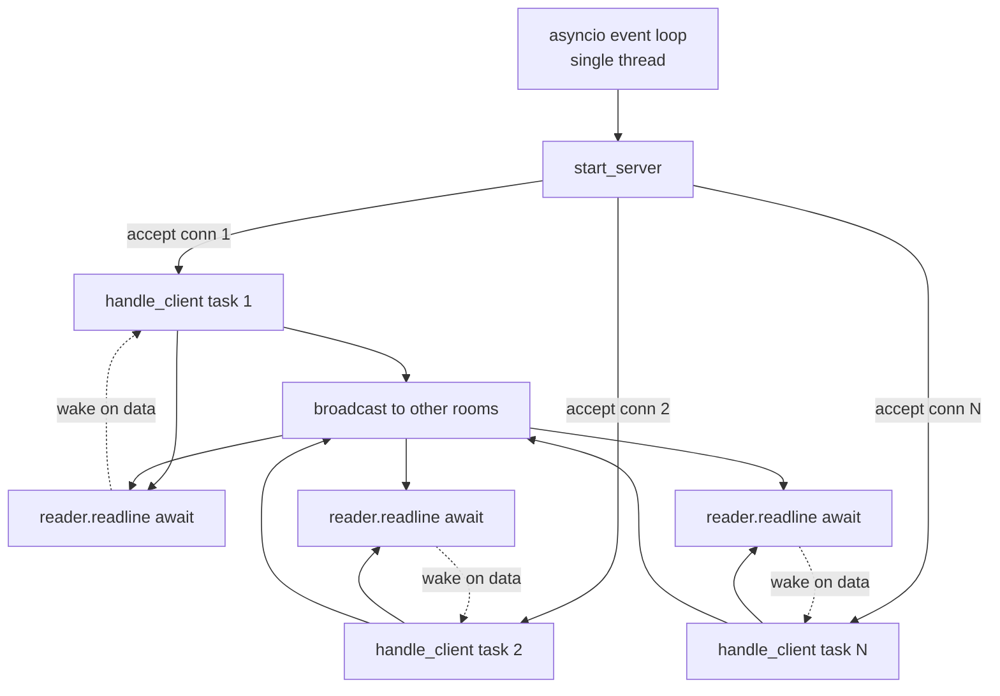
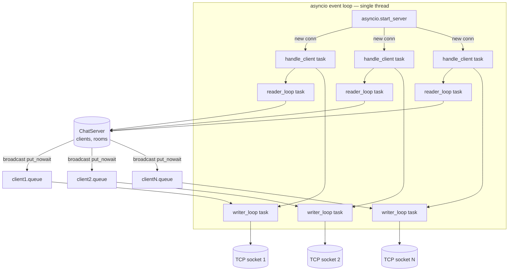
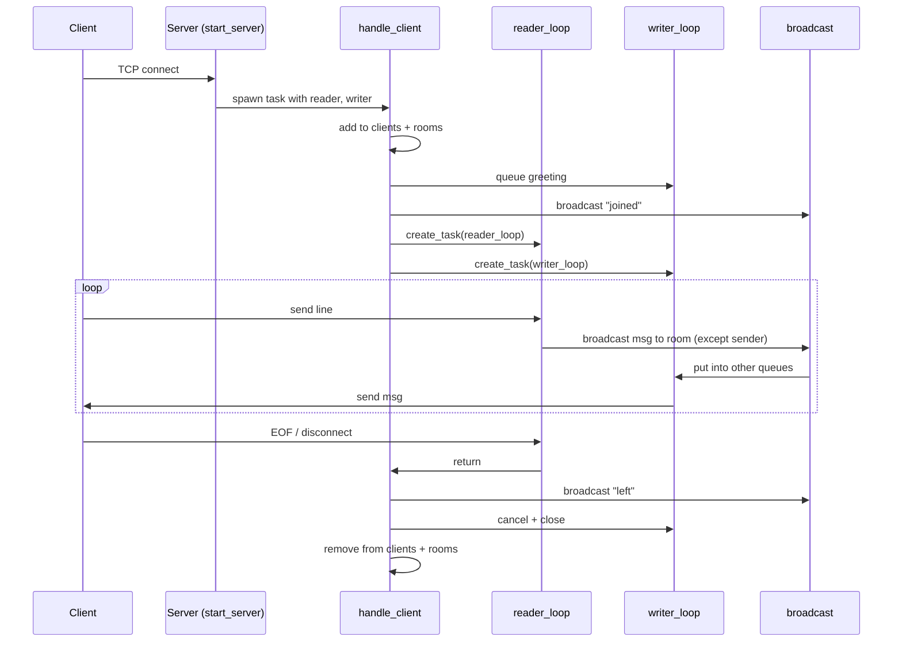
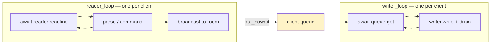

# 3. Build an Async Chat Server

> [!note] Why this note exists
> This note is the capstone for asyncio. It walks through building a **multi-user TCP chat server** from scratch: a single-threaded event loop handling thousands of concurrent connections; per-client reader/writer coroutines; broadcast fan-out; nickname negotiation; chat rooms; graceful disconnect handling; and structured logging. The companion client is a 30-line script. The server uses only the Python standard library — no frameworks — so you see exactly how the pieces fit. After this note you should be able to build any async network service: a game server, a pub/sub broker, a telemetry aggregator, a webhook listener.

## Why It Matters

Real-time multi-user services are everywhere: chat (Slack, Discord, IRC), games (any multiplayer server), collaboration tools (Google Docs's operational transform layer), trading dashboards, IoT telemetry collectors. All share the same shape:

- Many long-lived TCP/WebSocket connections.
- Messages from one client must be relayed to others (broadcast / routing).
- The server must stay responsive even when one client is slow or hostile.
- State (rooms, presence, user lists) lives in memory and must be carefully shared.

The classic mistakes — one thread per connection (won't scale past ~10k), shared mutable state without locks (data races), blocking calls inside the event loop (freezes everyone) — all have well-known async solutions. Building a chat server is the canonical exercise for learning them.

The Python stdlib gives you everything you need: `asyncio.start_server` for accepting connections, `asyncio.StreamReader` / `StreamWriter` for I/O, `asyncio.Queue` for backpressure-aware message routing, and `asyncio.gather` for fan-out. No external dependencies.

## Background

### What `asyncio.start_server` gives you

```python
import asyncio

async def handle_client(reader: asyncio.StreamReader,
                        writer: asyncio.StreamWriter) -> None:
    peer = writer.get_extra_info('peername')
    print(f"Connection from {peer}")
    while True:
        data = await reader.read(4096)
        if not data:
            break
        writer.write(data.upper())
        await writer.drain()
    writer.close()
    await writer.wait_closed()

async def main():
    server = await asyncio.start_server(handle_client, host='0.0.0.0', port=5000)
    async with server:
        await server.serve_forever()

asyncio.run(main())
```

That's a complete async echo server. `asyncio.start_server`:

1. Listens on `host:port`.
2. For every accepted connection, calls `handle_client(reader, writer)` as a new task.
3. Each `handle_client` invocation runs concurrently with all others — thousands of them on one thread.

`reader.read(n)` awaits up to `n` bytes; `reader.readline()` awaits a line ending in `\n`. `writer.write(...)` is synchronous (buffers into the OS socket); `await writer.drain()` awaits until the buffer is drained below the high-water mark — this is your backpressure mechanism.

### The `readline` protocol

For a chat server we want message framing. The simplest protocol: one message per line, UTF-8 encoded, terminated by `\n`. Each side calls `await reader.readline()` and writes with `writer.write(msg.encode() + b'\n')`.

This is line-delimited JSON-over-TCP — the same pattern as IRC, Redis's RESP, and most chat protocols before WebSockets. It's trivial to debug with `nc` or `telnet`.

### Concurrency model — one task per client



The loop has one OS thread. Every `await` is a point where the loop can switch to another task. A blocked `reader.readline()` doesn't block the loop — it just parks that task until data arrives.

### Why no locks?

Because the loop is single-threaded and only switches at `await` points, any code between two `await`s is **atomic with respect to other asyncio tasks**. You can mutate a shared dict between awaits without a lock, as long as you don't `await` in the middle.

This is asyncio's killer feature: shared state without locks, *if* you're disciplined about where you await.

## Main content

### Step 1: The connection registry

```python
from __future__ import annotations
import asyncio, logging, time
from dataclasses import dataclass, field
from collections import defaultdict

log = logging.getLogger('chat')

@dataclass
class Client:
    reader: asyncio.StreamReader
    writer: asyncio.StreamWriter
    nick: str = "anon"
    room: str = "lobby"
    queue: asyncio.Queue[str] = field(default_factory=lambda: asyncio.Queue(maxsize=100))
    joined_at: float = field(default_factory=time.time)

    @property
    def peer(self) -> str:
        peer = self.writer.get_extra_info('peername')
        return f"{self.nick}@{peer[0]}:{peer[1]}" if peer else self.nick
```

Each `Client` has its own outgoing `asyncio.Queue`. We never call `writer.write` directly from the broadcasting code — instead we put the message into every recipient's queue, and each client's writer task drains its own queue. This decouples broadcast throughput from slow clients.

### Step 2: The server state

```python
class ChatServer:
    def __init__(self):
        self.clients: set[Client] = set()
        self.rooms: dict[str, set[Client]] = defaultdict(set)
        self.lock = asyncio.Lock()    # for any state that crosses an await

    def add(self, client: Client):
        self.clients.add(client)
        self.rooms[client.room].add(client)

    def remove(self, client: Client):
        self.clients.discard(client)
        self.rooms[client.room].discard(client)
        if not self.rooms[client.room]:
            del self.rooms[client.room]

    def occupants(self, room: str) -> list[Client]:
        return list(self.rooms.get(room, ()))

    async def broadcast(self, room: str, message: str, exclude: Client | None = None) -> None:
        for c in self.rooms.get(room, ()):
            if c is exclude:
                continue
            try:
                c.queue.put_nowait(message)
            except asyncio.QueueFull:
                # Client is too slow to keep up. Drop the message and warn.
                log.warning("Dropping message to %s — queue full", c.peer)
```

`put_nowait` is non-blocking: it either enqueues immediately or raises `QueueFull`. We don't `await` it because broadcasting shouldn't be stalled by a single slow client. The slow client's writer task will eventually catch up (or be killed).

### Step 3: Per-client handling

Each client gets two concurrent tasks:

1. **Reader task** — `await reader.readline()` in a loop, parses commands and chat messages, broadcasts to the room.
2. **Writer task** — `await client.queue.get()` in a loop, writes to the socket.

Splitting them decouples read and write throughput. A slow reader doesn't block writes; a slow writer doesn't block reads.

```python
async def handle_client(reader: asyncio.StreamReader,
                        writer: asyncio.StreamWriter,
                        server: ChatServer) -> None:
    client = Client(reader=reader, writer=writer)
    server.add(client)
    log.info("Connected: %s", client.peer)

    # Send greeting
    await client.queue.put(
        "Welcome! Type /nick <name> to set your nickname, "
        "/join <room> to switch rooms, /quit to leave.\n"
    )
    await server.broadcast(client.room,
                           f"*** {client.nick} joined {client.room} ***\n",
                           exclude=client)

    writer_task = asyncio.create_task(writer_loop(client, server))
    try:
        await reader_loop(client, server)
    except (asyncio.IncompleteReadError, ConnectionResetError, BrokenPipeError):
        pass
    finally:
        await shutdown_client(client, server, writer_task)

async def reader_loop(client: Client, server: ChatServer) -> None:
    while True:
        line = await client.reader.readline()
        if not line:
            break
        text = line.decode(errors='replace').rstrip('\r\n')
        if not text:
            continue
        if text.startswith('/'):
            await handle_command(text, client, server)
        else:
            msg = f"<{client.nick}> {text}\n"
            log.debug("MSG %s room=%s: %s", client.peer, client.room, text)
            await server.broadcast(client.room, msg, exclude=client)

async def writer_loop(client: Client, server: ChatServer) -> None:
    try:
        while True:
            msg = await client.queue.get()
            client.writer.write(msg.encode('utf-8'))
            await client.writer.drain()
    except (ConnectionResetError, BrokenPipeError):
        pass

async def shutdown_client(client: Client, server: ChatServer,
                          writer_task: asyncio.Task) -> None:
    server.remove(client)
    await server.broadcast(client.room, f"*** {client.nick} left ***\n")
    await client.queue.put("")    # sentinel to unblock writer_loop
    writer_task.cancel()
    try:
        await writer_task
    except asyncio.CancelledError:
        pass
    client.writer.close()
    try:
        await client.writer.wait_closed()
    except Exception:
        pass
    log.info("Disconnected: %s", client.peer)
```

### Step 4: Commands

```python
async def handle_command(text: str, client: Client, server: ChatServer) -> None:
    parts = text.split(maxsplit=1)
    cmd = parts[0].lower()
    arg = parts[1].strip() if len(parts) > 1 else ""

    if cmd == '/nick':
        if not arg:
            await client.queue.put("Usage: /nick <name>\n")
            return
        old = client.nick
        client.nick = arg[:20]    # cap length
        await client.queue.put(f"You are now known as {client.nick}.\n")
        await server.broadcast(client.room, f"*** {old} is now {client.nick} ***\n")

    elif cmd == '/join':
        if not arg:
            await client.queue.put("Usage: /join <room>\n")
            return
        old_room = client.room
        server.rooms[old_room].discard(client)
        if not server.rooms[old_room]:
            del server.rooms[old_room]
        client.room = arg[:30]
        server.rooms[client.room].add(client)
        await server.broadcast(old_room, f"*** {client.nick} left ***\n")
        await server.broadcast(client.room, f"*** {client.nick} joined ***\n", exclude=client)
        await client.queue.put(f"You are now in room '{client.room}' "
                               f"with {len(server.rooms[client.room])-1} others.\n")

    elif cmd == '/who':
        names = sorted(c.nick for c in server.rooms[client.room])
        await client.queue.put(f"In {client.room}: {', '.join(names)}\n")

    elif cmd == '/rooms':
        rooms = sorted(server.rooms.keys())
        await client.queue.put(f"Rooms: {', '.join(rooms) or '(none)'}\n")

    elif cmd in ('/quit', '/exit'):
        await client.queue.put("Bye!\n")
        client.reader.feed_eof()    # breaks reader_loop

    elif cmd == '/help':
        await client.queue.put(
            "Commands: /nick <name>, /join <room>, /who, /rooms, /quit, /help\n"
        )

    else:
        await client.queue.put(f"Unknown command: {cmd}\n")
```

### Step 5: Tying it together

```python
async def main(host: str = '0.0.0.0', port: int = 5000):
    logging.basicConfig(level=logging.INFO,
                        format='%(asctime)s %(levelname)s %(message)s')
    server = ChatServer()

    async def handler(reader, writer):
        await handle_client(reader, writer, server)

    srv = await asyncio.start_server(handler, host, port, backlog=128)
    addrs = ', '.join(str(s.getsockname()) for s in srv.sockets)
    log.info("Chat server listening on %s", addrs)

    async with srv:
        await srv.serve_forever()

if __name__ == '__main__':
    try:
        asyncio.run(main())
    except KeyboardInterrupt:
        log.info("Shutting down.")
```

### Step 6: A minimal client

```python
# chat_client.py
import asyncio, sys, threading

async def chat_client(host: str, port: int, nick: str):
    reader, writer = await asyncio.open_connection(host, port)
    writer.write(f"/nick {nick}\n".encode()); await writer.drain()

    async def recv_loop():
        while True:
            data = await reader.readline()
            if not data:
                print("Server closed connection.")
                return
            print(data.decode(errors='replace'), end='', flush=True)

    async def send_loop():
        loop = asyncio.get_running_loop()
        while True:
            line = await loop.run_in_executor(None, sys.stdin.readline)
            if not line:
                writer.close(); await writer.wait_closed(); return
            writer.write(line.encode()); await writer.drain()

    await asyncio.gather(recv_loop(), send_loop())

if __name__ == '__main__':
    asyncio.run(chat_client(sys.argv[1] if len(sys.argv) > 1 else '127.0.0.1',
                            int(sys.argv[2]) if len(sys.argv) > 2 else 5000,
                            sys.argv[3] if len(sys.argv) > 3 else 'guest'))
```

`run_in_executor(None, sys.stdin.readline)` is the trick to do blocking stdin reads inside an async program — it runs the blocking call on a thread pool and `await`s the result.

### Step 7: Test it with `nc`

You don't need the Python client to test the server. Use netcat:

```bash
# Terminal 1:
python chat_server.py

# Terminal 2:
nc localhost 5000
/nick alice
hello there

# Terminal 3:
nc localhost 5000
/nick bob
/join lobby
hi alice
```

### Step 8: Graceful shutdown

`asyncio.run` cancels all remaining tasks on `KeyboardInterrupt`. To shut down cleanly:

```python
async def main():
    stop = asyncio.Event()
    srv = await asyncio.start_server(handler, host, port)

    # Handle Ctrl-C / SIGTERM
    loop = asyncio.get_running_loop()
    for sig in (signal.SIGINT, signal.SIGTERM):
        loop.add_signal_handler(sig, stop.set)

    async with srv:
        serve_task = asyncio.create_task(srv.serve_forever())
        await stop.wait()
        log.info("Shutting down...")
        serve_task.cancel()
        # Give all client tasks a moment to clean up
        await asyncio.sleep(0.5)
```

On Unix, `loop.add_signal_handler` is the canonical way to react to signals. (Windows doesn't support it; fall back to catching `KeyboardInterrupt`.)

## Mermaid diagrams

### Chat server architecture



### Connection lifecycle



### Reader / writer task split



### Room routing

```mermaid
flowchart TD
    Msg[reader_loop parses message<br/>&lt;alice&gt; hello] --> BR[broadcast room=lobby<br/>exclude=sender]
    BR --> Lookup[server.rooms['lobby']]
    Lookup --> C1[client 'bob' queue]
    Lookup --> C2[client 'carol' queue]
    Lookup --> C3[client 'dave' queue]
    Lookup -.->|sender excluded| CS[client 'alice' queue]
    C1 --> BobWriter[bob's writer_loop → socket]
    C2 --> CarolWriter[carol's writer_loop → socket]
    C3 --> DaveWriter[dave's writer_loop → socket]
```

## Common Pitfalls

> [!warning] Blocking calls inside the event loop
> A `time.sleep(1)`, `requests.get(...)`, or `socket.recv()` inside a coroutine freezes the loop for the duration. All clients stall. Every blocking call must be wrapped in `await asyncio.to_thread(...)` or replaced with an async equivalent (`asyncio.sleep`, `aiohttp`, `aiomysql`).

> [!warning] `await writer.drain()` inside broadcast
> If you `await client.writer.drain()` for every recipient during a broadcast, one slow client pauses the broadcast to everyone. Use per-client queues with `put_nowait` and let each writer task handle its own backpressure.

> [!warning] Not handling `ConnectionResetError` / `BrokenPipeError`
> Clients disconnect ungracefully all the time (kill -9, laptop closed, wifi dropped). Wrap socket writes in try/except and ensure the client is removed from the registry on any exception.

> [!warning] Forgetting to remove disconnected clients from `server.clients` / `server.rooms`
> Your set grows forever, you keep trying to write to dead sockets, and your "who's online" list lies. Use a `finally` block in `handle_client` to always run cleanup.

> [!warning] `asyncio.Queue` with no `maxsize`
> An unbounded queue is a memory leak waiting to happen: a slow consumer lets messages pile up until the process OOMs. Always pass `maxsize=` and handle `QueueFull` explicitly (drop, log, or kill the slow client).

> [!warning] `create_task` without saving the reference
> `asyncio.create_task(coro)` returns a Task. If you don't keep a reference, the garbage collector may cancel it mid-run. Python 3.11+ warns about this; the fix is to store tasks in a set: `self._tasks.add(task); task.add_done_callback(self._tasks.discard)`.

> [!warning] Awaiting `gather` with `return_exceptions=False` (default)
> If one task raises, `gather` cancels the others and propagates the exception. For long-running servers, use `asyncio.gather(*tasks, return_exceptions=True)` and log each exception individually — one bad client shouldn't kill the server.

> [!warning] Not handling `SIGTERM` / `SIGINT`
> Without a signal handler, Ctrl-C raises `KeyboardInterrupt` somewhere in the middle of your code, possibly leaving clients hanging. Use `loop.add_signal_handler` (Unix) or wrap `main()` in try/except `KeyboardInterrupt`.

> [!warning] Reading unsized data
> `reader.read(4096)` returns whatever's in the buffer — could be 1 byte, could be 4096. It does **not** wait for 4096 bytes. Use `readline()` for line-delimited protocols, or `readexactly(n)` for fixed-length framing.

> [!warning] Encoding errors
> `data.decode()` raises `UnicodeDecodeError` on malformed bytes. Always pass `errors='replace'` (or `'ignore'`) when decoding untrusted network input.

> [!warning] One bad command crashing the parser
> A client sending `/\xff\xff` or a 10 MB line should not bring the server down. Wrap command parsing in try/except and cap line length: `reader = asyncio.StreamReader(limit=65536)`.

## Tips and Tricks

- **`asyncio.gather(*tasks, return_exceptions=True)`** is the canonical pattern for "run all these to completion, don't let one failure kill the rest". Inspect each result; if it's an `Exception`, log it.
- **`asyncio.TaskGroup`** (Python 3.11+) is the modern, structured-concurrency alternative to `gather`. It tracks child tasks, cancels them if one fails, and produces a clean `ExceptionGroup`. Prefer it for new code.
  ```python
  async with asyncio.TaskGroup() as tg:
      tg.create_task(reader_loop(...))
      tg.create_task(writer_loop(...))
  ```
- **`asyncio.wait_for(coro, timeout=...)`** to bound any await. Use it to detect dead connections: if a client hasn't sent anything for 5 minutes, kick them.
- **Per-client `asyncio.timeout`** (3.11+) is even cleaner:
  ```python
  async with asyncio.timeout(300):
      line = await reader.readline()
  ```
- **Heartbeats**: every 30 seconds, send `\n` (or a `/ping` message) to every client. If `writer.drain()` raises, the client is dead — clean up.
- **`writer.get_extra_info('peername')`** gives you `(ip, port)`. Useful for logging, rate-limiting, and per-IP connection caps.
- **Rate limiting**: track per-client message timestamps; if a client sends > N messages per second, mute them.
- **Backpressure**: `asyncio.Queue(maxsize=N)` with `put_nowait` is your friend. Drop excess with a log line, or close the connection if it persists.
- **Structured logging**: use `structlog` or `python-json-logger` so each log line is a JSON object — easy to ingest into ELK / Loki.
- **Prometheus metrics**: `prometheus_async` exposes counters for `connections_total`, `messages_total`, `active_clients`. Invaluable in production.
- **TLS**: wrap the server with `ssl.create_default_context(ssl.Purpose.CLIENT_AUTH)` and pass `ssl=` to `start_server`. A few lines for full encryption.
- **Authentication**: send a token in the first line; reject the connection if invalid. Don't roll your own crypto — use `secrets.compare_digest` for constant-time comparison.
- **WebSocket upgrade**: if you want browser clients, the `websockets` library is the standard: same async model, slightly different framing.
- **Testing**: `pytest-asyncio` plus a small in-memory test client that opens a connection to `127.0.0.1` and asserts on exchanged lines. Integration tests catch protocol bugs that unit tests miss.
- **Load testing**: `locust` or `asyncio` + a thousand fake clients to find your real concurrency ceiling before production does.
- **Don't share state across event loops** — each `asyncio.run` creates a fresh loop. A `ChatServer` instance bound to one loop cannot be safely used from another.
- **`asyncio.isfuture(x) or asyncio.iscoroutine(x)`** to defensively `await` "things that might be awaitable".

## Active Recall

> [!question] What does `asyncio.start_server` do, and what's its callback signature?
> It binds a TCP listener; for every accepted connection, it calls your `handle_client(reader, writer)` coroutine. `reader` is an `asyncio.StreamReader`, `writer` is an `asyncio.StreamWriter`. Each invocation runs as a separate task on the loop.

> [!question] Why split each client into a reader task and a writer task?
> To decouple inbound throughput from outbound. A slow client's writes shouldn't block its reads, and a fast broadcaster's writes shouldn't block waiting for one slow client's `drain()`. The per-client queue mediates between them.

> [!question] Why use `put_nowait` instead of `await queue.put(...)` during broadcast?
> `await queue.put(...)` blocks the broadcaster when the queue is full — one slow client pauses delivery to everyone else. `put_nowait` is non-blocking; it either enqueues immediately or raises `QueueFull`, which we handle (drop + log) without stalling the broadcast.

> [!question] Why don't we need locks to protect `server.clients` and `server.rooms`?
> The asyncio event loop is single-threaded and only switches tasks at `await` points. Between two `await`s, code is atomic with respect to other tasks. As long as we don't `await` in the middle of a multi-step mutation, no lock is needed.

> [!question] How do you detect a dead client?
> Either `reader.readline()` returns `b''` (clean EOF), or `writer.drain()` raises `ConnectionResetError` / `BrokenPipeError`. Wrap all socket I/O in try/except and clean up the client in a `finally` block.

> [!question] Why is `asyncio.Queue(maxsize=...)` preferred over an unbounded queue?
> An unbounded queue will accumulate messages for a slow consumer until the process OOMs. A bounded queue enforces backpressure; once full, you decide what to do (drop, log, disconnect the slow client).

> [!question] What does `await writer.drain()` actually do?
> It awaits until the OS socket's send buffer drops below a high-water mark. It's the backpressure mechanism for the socket itself — if the remote peer is slow to read, `drain()` pauses your writes instead of buffering forever.

> [!question] How do you handle blocking I/O (e.g. `sys.stdin.readline`) inside an async program?
> Wrap it: `await asyncio.to_thread(blocking_fn, *args)` (3.9+) or `await loop.run_in_executor(None, blocking_fn, *args)`. This runs the blocking call on a thread pool and resumes your coroutine when it returns.

## Next Steps

- [[4. Build an Image Pipeline]] — the next project. Same async primitives applied to batch I/O instead of long-lived connections.
- [[14. Concurrency/4. asyncio Basics]] — the conceptual foundation. Read this first if any of the patterns felt unfamiliar.
- [[14. Concurrency/5. async-await]] — the syntax and semantics of `async` / `await`.
- [[14. Concurrency/8. Synchronization Primitives]] — `asyncio.Lock`, `Event`, `Semaphore`, `Condition` — needed once your coordination gets non-trivial.
- [[20. Advanced Async]] — `TaskGroup`, structured concurrency, cancellation scopes.
- [[27. Networking and Sockets]] — the underlying TCP layer. Knowing what `SO_REUSEADDR` does explains a lot of "address already in use" errors.
- [[13. Logging]] — every server needs structured logging; this note's `logging.basicConfig` is the floor, not the ceiling.
- [[12. Testing]] — `pytest-asyncio` for testing async code in isolation.
