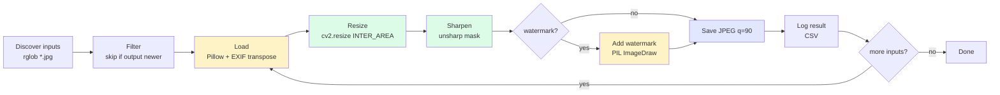
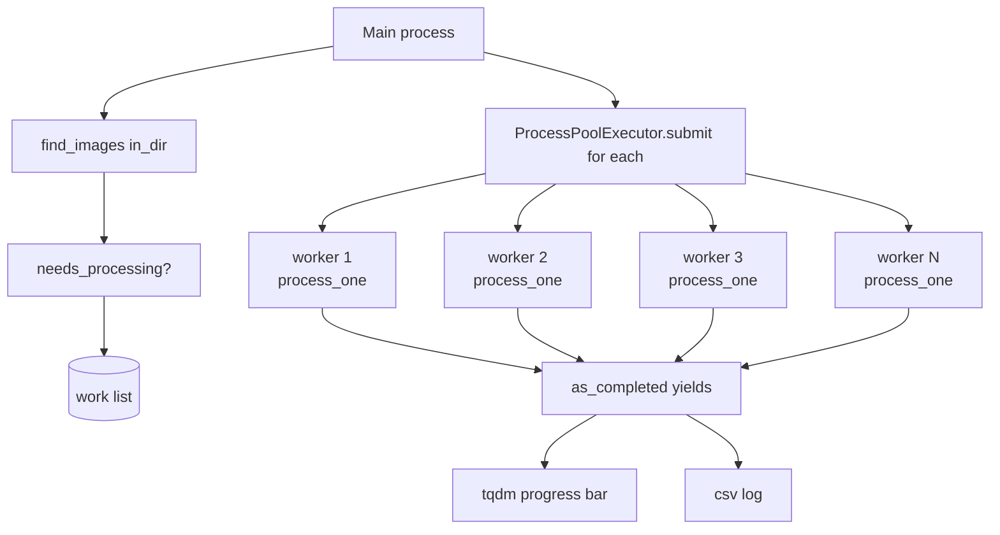
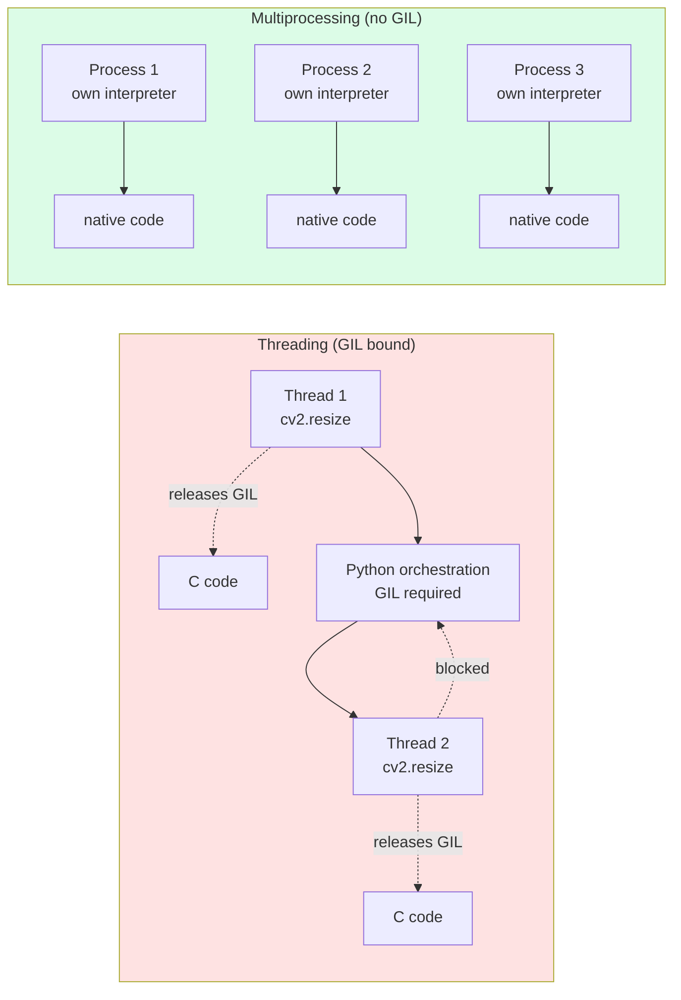

# 4. Build an Image Pipeline

> [!note] Why this note exists
> This note walks through building a **production-quality image processing pipeline**: load → resize → filter → annotate → save, applied to thousands of images in batch. It covers `Pillow` (PIL fork) for high-level image ops, `OpenCV` (`cv2`) for performance-critical and computer-vision work, `NumPy` as the shared array substrate, `tqdm` for progress visibility, and **`multiprocessing`** for CPU-bound parallelism that sidesteps the GIL. The running example is a thumbnail-and-watermark generator for an e-commerce catalog. After this note you should be able to build any image-processing batch job: a face-detector batch, a dataset-prep pipeline for ML, a contact-sheet generator, a video-frame extractor with per-frame processing.

## Why It Matters

Image processing is one of the most common batch-workload types in industry:

- **E-commerce**: generate thumbnails, watermarks, and multiple resolution variants for every product photo.
- **ML training data preparation**: resize, augment, normalise, and shard millions of images before feeding them to PyTorch or TensorFlow ([[2. PyTorch Fundamentals]], [[3. TensorFlow Fundamentals]]).
- **Medical imaging**: tile large histology slides into patches for classification.
- **Satellite / drone imagery**: orthorectify, mosaic, and chunk large geotiffs.
- **Video pipelines**: extract frames, run detection, re-encode.

All share the same shape: take a directory of inputs, apply a deterministic transform to each, write the output, and do it fast. Python is slow at pixel-by-pixel work, but the **libraries** (OpenCV, NumPy, Pillow) are implemented in C/C++ and run at native speed. The job of the Python code is to *orchestrate* — list files, call the right C function on each, manage concurrency, and report progress.

The hard parts are not the per-image logic (which is usually 5 lines of Pillow or cv2) but:

1. **Parallelism** — Python's GIL prevents true multi-core threading for CPU-bound work, so you need `multiprocessing` (or a C-extension that releases the GIL, like NumPy's ufuncs).
2. **Memory** — a 12 MP RGB image is 36 MB in float32; loading 100 of them in parallel is 3.6 GB. You must bound memory.
3. **Resilience** — one corrupt image must not abort the whole batch.
4. **Progress visibility** — a 50k-image job takes 30 minutes; you need a progress bar and ETA.
5. **Idempotency** — re-running the pipeline should skip work already done.

## Background

### The three libraries and their overlap

| Library | Strengths | Weaknesses |
|---------|-----------|------------|
| **Pillow** (`PIL`) | Simple API, great for I/O, drawing, fonts, EXIF. Pure high-level ops. | Slower than OpenCV for large kernels; limited computer-vision ops. |
| **OpenCV** (`cv2`) | Blazing fast (C++ + SIMD), huge CV op set (edge detect, contours, optical flow, feature matching), GPU acceleration via CUDA builds. | Verbose API; BGR instead of RGB; less polished for text/fonts. |
| **NumPy** | Universal array substrate. Both Pillow and OpenCV expose their images as NumPy arrays. | No image-specific I/O or high-level ops. |

The idiomatic mix:

- **Pillow for I/O and high-level ops** (`Image.open`, `Image.save`, `Image.thumbnail`, `ImageDraw`, `ImageFont`).
- **OpenCV for performance-critical pixel work** (`cv2.resize`, `cv2.GaussianBlur`, `cv2.Canny`, `cv2.warpAffine`).
- **NumPy for custom ops** (per-pixel math, masking, channel manipulation, broadcasting).

```python
from PIL import Image
import cv2, numpy as np

# All three representations interconvert:
pil_img = Image.open('input.jpg')           # PIL.Image
arr = np.array(pil_img)                      # NumPy array (H, W, 3) uint8 RGB
cv_img = cv2.cvtColor(arr, cv2.COLOR_RGB2BGR)  # cv2 Mat (H, W, 3) uint8 BGR
pil_back = Image.fromarray(cv2.cvtColor(cv_img, cv2.COLOR_BGR2RGB))
```

> [!warning] OpenCV uses BGR, not RGB
> This is a historical accident. Every cv2 function expects/returns BGR. Convert at the boundaries with `cv2.cvtColor(arr, cv2.COLOR_RGB2BGR)` and `cv2.COLOR_BGR2RGB`, or you'll get blue apples and red skies.

### Image as a NumPy array

A grayscale image is a 2D array of shape `(H, W)` with dtype `uint8` (0=black, 255=white). An RGB image is `(H, W, 3)`. An RGBA image is `(H, W, 4)`. Channels-last is the convention in Pillow and OpenCV; PyTorch uses channels-first `(C, H, W)`; TensorFlow uses channels-last by default.

```python
arr = np.array(Image.open('cat.jpg'))
print(arr.shape, arr.dtype)     # (480, 640, 3) uint8

# Per-pixel operations via NumPy broadcasting:
gray = arr.mean(axis=-1).astype(np.uint8)
brightened = np.clip(arr.astype(np.int16) + 30, 0, 255).astype(np.uint8)
red_only = arr.copy(); red_only[..., 1:] = 0     # zero out green + blue
```

### Why multiprocessing, not threading

The Python GIL ([[14. Concurrency/6. The GIL]]) prevents two Python threads from running Python bytecode simultaneously. NumPy and OpenCV calls release the GIL while they execute their C code, so threading *does* help for pure-library calls — but the Python orchestration between calls (a `for` loop, `if` checks, opening files) is still serial.

For a typical pipeline that does 80% library calls and 20% Python, threading gives ~3–4× speedup on 8 cores. `multiprocessing` gives ~7× because there's no shared interpreter at all. The cost: each process has its own memory and you must serialise arguments (or use shared memory).

The standard library gives you `concurrent.futures.ProcessPoolExecutor`, which is the right tool for 95% of batch image jobs.

## Main content

### Step 1: A single-image transform

```python
from __future__ import annotations
from pathlib import Path
from PIL import Image, ImageDraw, ImageFont
import cv2, numpy as np

def load_rgb(path: Path) -> np.ndarray:
    """Load an image as RGB uint8 NumPy array, handling EXIF orientation."""
    with Image.open(path) as im:
        im = ImageOps.exif_transpose(im)        # respect camera orientation
        if im.mode != 'RGB':
            im = im.convert('RGB')
        return np.array(im)

def resize_with_aspect(arr: np.ndarray, max_side: int) -> np.ndarray:
    h, w = arr.shape[:2]
    scale = max_side / max(h, w)
    if scale >= 1:
        return arr
    new = (int(w * scale), int(h * scale))      # cv2 wants (W, H)
    return cv2.resize(arr, new, interpolation=cv2.INTER_AREA)

def sharpen(arr: np.ndarray) -> np.ndarray:
    """Unsharp mask: out = arr + 0.5 * (arr - blur(arr))"""
    blur = cv2.GaussianBlur(arr, (0, 0), sigmaX=2.0)
    sharp = cv2.addWeighted(arr, 1.5, blur, -0.5, 0)
    return sharp

def add_watermark(arr: np.ndarray, text: str) -> np.ndarray:
    pil = Image.fromarray(arr)
    draw = ImageDraw.Draw(pil, 'RGBA')
    try:
        font = ImageFont.truetype("DejaVuSans-Bold.ttf", size=max(16, arr.shape[0] // 30))
    except OSError:
        font = ImageFont.load_default()
    # Bottom-right with semi-transparent background
    bbox = draw.textbbox((0, 0), text, font=font)
    tw, th = bbox[2] - bbox[0], bbox[3] - bbox[1]
    pad = 8
    x = arr.shape[1] - tw - pad * 2
    y = arr.shape[0] - th - pad * 2
    draw.rectangle([x, y, x + tw + pad, y + th + pad], fill=(0, 0, 0, 140))
    draw.text((x + pad // 2, y + pad // 2), text, font=font, fill=(255, 255, 255, 230))
    return np.array(pil)

def save_jpeg(arr: np.ndarray, path: Path, quality: int = 90) -> None:
    """Save as JPEG via Pillow (better quality control than cv2.imwrite)."""
    Image.fromarray(arr).save(path, format='JPEG', quality=quality,
                              optimize=True, progressive=True)

def process_one(in_path: Path, out_path: Path, max_side: int = 1024,
                watermark: str | None = None) -> tuple[Path, str]:
    try:
        arr = load_rgb(in_path)
        arr = resize_with_aspect(arr, max_side)
        arr = sharpen(arr)
        if watermark:
            arr = add_watermark(arr, watermark)
        out_path.parent.mkdir(parents=True, exist_ok=True)
        save_jpeg(arr, out_path)
        return out_path, 'ok'
    except Exception as e:
        return in_path, f'error: {e}'
```

Note the try/except around the whole function — a corrupt image will raise (often a truncated-file error from Pillow), and we want to record it and continue, not abort the batch.

### Step 2: Discovering input files

```python
def find_images(root: Path, exts: tuple[str, ...] = ('.jpg', '.jpeg', '.png', '.webp')) -> list[Path]:
    files = []
    for ext in exts:
        files.extend(root.rglob(f'*{ext}'))
        files.extend(root.rglob(f'*{ext.upper()}'))
    return sorted(set(files))
```

`rglob` walks recursively. Sorting gives deterministic order (important for reproducibility and for resumable pipelines).

### Step 3: Idempotency — skip work already done

```python
def needs_processing(in_path: Path, out_path: Path) -> bool:
    if not out_path.exists():
        return True
    # Re-process if the source is newer than the output:
    return in_path.stat().st_mtime > out_path.stat().st_mtime
```

A pipeline that re-does work it already finished is a pipeline nobody trusts. `needs_processing` is a 3-liner that makes reruns cheap.

### Step 4: Sequential baseline

```python
from tqdm import tqdm

def run_sequential(in_dir: Path, out_dir: Path, max_side: int = 1024,
                   watermark: str | None = None) -> dict[str, int]:
    inputs = find_images(in_dir)
    counts = {'ok': 0, 'error': 0}
    for in_path in tqdm(inputs, desc='processing', unit='img'):
        rel = in_path.relative_to(in_dir)
        out_path = out_dir / rel.with_suffix('.jpg')
        if not needs_processing(in_path, out_path):
            counts['skipped'] = counts.get('skipped', 0) + 1
            continue
        _, status = process_one(in_path, out_path, max_side, watermark)
        counts[status.split(':')[0]] = counts.get(status.split(':')[0], 0) + 1
    return counts
```

`tqdm` shows a live progress bar with throughput, ETA, and item count. It's the single biggest quality-of-life improvement in any batch script.

### Step 5: Parallel with `ProcessPoolExecutor`

```python
from concurrent.futures import ProcessPoolExecutor, as_completed
from functools import partial
import os

def run_parallel(in_dir: Path, out_dir: Path, max_side: int = 1024,
                 watermark: str | None = None,
                 workers: int | None = None) -> dict[str, int]:
    inputs = find_images(in_dir)
    workers = workers or os.cpu_count() or 4
    # Compute the work list (skip already-done):
    work = []
    for in_path in inputs:
        rel = in_path.relative_to(in_dir)
        out_path = out_dir / rel.with_suffix('.jpg')
        if needs_processing(in_path, out_path):
            work.append((in_path, out_path))

    counts = {'ok': 0, 'error': 0, 'skipped': len(inputs) - len(work)}
    if not work:
        return counts

    fn = partial(process_one, max_side=max_side, watermark=watermark)
    with ProcessPoolExecutor(max_workers=workers) as pool:
        # Submit in chunks to reduce IPC overhead:
        futures = {pool.submit(fn, in_p, out_p): in_p for in_p, out_p in work}
        for fut in tqdm(as_completed(futures), total=len(futures),
                        desc='processing', unit='img'):
            _, status = fut.result()
            key = status.split(':')[0]
            counts[key] = counts.get(key, 0) + 1
    return counts
```

Key points:

- **`functools.partial`** bakes in the constants (`max_side`, `watermark`) so each task only takes `(in_path, out_path)`. Less to pickle.
- **`as_completed`** yields futures in completion order, so the progress bar advances as soon as any worker finishes a task.
- **`ProcessPoolExecutor`** manages the worker pool, task queue, and result queue for you. Don't roll your own with `multiprocessing.Pool` unless you need finer control.

### Step 6: Bounded memory with `chunksize`

For very large batches (100k+ images), `as_completed` keeps every future in memory. Use `pool.map(fn, iterable, chunksize=N)` instead, which streams results:

```python
def run_parallel_streaming(in_dir, out_dir, max_side=1024, watermark=None,
                           workers=None, chunksize=8):
    inputs = find_images(in_dir)
    workers = workers or os.cpu_count() or 4
    work = [(p, out_dir / p.relative_to(in_dir).with_suffix('.jpg'))
            for p in inputs
            if needs_processing(p, out_dir / p.relative_to(in_dir).with_suffix('.jpg'))]
    fn = partial(process_one, max_side=max_side, watermark=watermark)
    with ProcessPoolExecutor(max_workers=workers) as pool:
        # imap_unordered-style streaming via executor.map:
        for out_path, status in tqdm(pool.map(fn, *zip(*work), chunksize=chunksize),
                                     total=len(work), desc='processing', unit='img'):
            ...
```

`chunksize=8` batches 8 tasks per IPC round-trip. Tune for your workload — large chunks reduce IPC overhead but increase memory and slow the progress bar.

### Step 7: Logging results to a CSV

```python
import csv

def run_with_logging(in_dir, out_dir, log_path='pipeline.log.csv', **kwargs):
    counts = {'ok': 0, 'error': 0, 'skipped': 0}
    with log_path.open('w', newline='') as f:
        writer = csv.writer(f)
        writer.writerow(['input', 'output', 'status', 'timestamp'])
        ...
        for in_path, out_path, status in ...:
            writer.writerow([in_path, out_path, status, datetime.now().isoformat()])
            f.flush()
    return counts
```

A CSV log lets you grep for errors after a 50k-image run, re-run only the failures, and prove to a stakeholder that the job completed.

### Step 8: Wrapping it as a CLI

```python
# pipeline_cli.py
import typer
from pathlib import Path
app = typer.Typer()

@app.command()
def run(in_dir: Path, out_dir: Path,
        max_side: int = typer.Option(1024, help="Max width or height in pixels."),
        watermark: str = typer.Option(None, help="Watermark text."),
        workers: int = typer.Option(None, help="Parallel workers (default: cpu_count)."),
        sequential: bool = typer.Option(False, help="Disable parallelism.")):
    """Process all images in in_dir → out_dir."""
    if sequential:
        counts = run_sequential(in_dir, out_dir, max_side, watermark)
    else:
        counts = run_parallel(in_dir, out_dir, max_side, watermark, workers)
    typer.echo(counts)

if __name__ == '__main__':
    app()
```

See [[1. Build a CLI Tool]] for the full typer / packaging story.

## Mermaid diagrams

### Pipeline stages



### Parallel execution model



### The GIL constraint



### Image representations interconvert

```mermaid
flowchart LR
    File[(image.jpg)] -->|Image.open| PIL[PIL.Image RGB]
    PIL -->|np.array| NP[NumPy (H,W,3) uint8 RGB]
    NP -->|cv2.cvtColor RGB2BGR| CV[cv2.Mat (H,W,3) uint8 BGR]
    CV -->|cv2.cvtColor BGR2RGB + np| PIL2[PIL.Image]
    PIL2 -->|.save| Out[(out.jpg)]
    NP -->|torch.from_tensor + permute| TORCH[torch.Tensor (3,H,W) float]
    TORCH -->|permute + numpy| NP
```

## Code examples

### Full pipeline module

```python
# image_pipeline.py
from __future__ import annotations
import csv, logging, os, sys
from concurrent.futures import ProcessPoolExecutor, as_completed
from datetime import datetime
from functools import partial
from pathlib import Path

import cv2, numpy as np
from PIL import Image, ImageDraw, ImageFont, ImageOps
from tqdm import tqdm

log = logging.getLogger('image_pipeline')

EXTS = ('.jpg', '.jpeg', '.png', '.webp', '.tif', '.tiff')

# ----- per-image functions (must be module-level for pickling) -----

def load_rgb(path: Path) -> np.ndarray:
    with Image.open(path) as im:
        im = ImageOps.exif_transpose(im)
        if im.mode != 'RGB':
            im = im.convert('RGB')
        return np.array(im)

def resize_max_side(arr: np.ndarray, max_side: int) -> np.ndarray:
    h, w = arr.shape[:2]
    scale = max_side / max(h, w)
    if scale >= 1:
        return arr
    new = (max(1, int(w * scale)), max(1, int(h * scale)))
    return cv2.resize(arr, new, interpolation=cv2.INTER_AREA)

def unsharp(arr: np.ndarray, amount: float = 0.5) -> np.ndarray:
    blur = cv2.GaussianBlur(arr, (0, 0), sigmaX=2.0)
    return cv2.addWeighted(arr, 1 + amount, blur, -amount, 0)

def watermark(arr: np.ndarray, text: str) -> np.ndarray:
    pil = Image.fromarray(arr)
    draw = ImageDraw.Draw(pil, 'RGBA')
    try:
        font = ImageFont.truetype("DejaVuSans-Bold.ttf", max(14, arr.shape[0] // 30))
    except OSError:
        font = ImageFont.load_default()
    bbox = draw.textbbox((0, 0), text, font=font)
    pad = 10
    x = arr.shape[1] - (bbox[2] - bbox[0]) - pad * 2
    y = arr.shape[0] - (bbox[3] - bbox[1]) - pad * 2
    draw.rectangle([x, y, x + (bbox[2]-bbox[0]) + pad, y + (bbox[3]-bbox[1]) + pad],
                   fill=(0, 0, 0, 140))
    draw.text((x + pad // 2, y + pad // 2), text, font=font, fill=(255, 255, 255, 230))
    return np.array(pil)

def process_one(in_path: Path, out_path: Path, max_side: int = 1024,
                watermark_text: str | None = None) -> tuple[str, str, str]:
    try:
        arr = load_rgb(in_path)
        arr = resize_max_side(arr, max_side)
        arr = unsharp(arr, amount=0.4)
        if watermark_text:
            arr = watermark(arr, watermark_text)
        out_path.parent.mkdir(parents=True, exist_ok=True)
        Image.fromarray(arr).save(out_path, format='JPEG', quality=90,
                                  optimize=True, progressive=True)
        return str(in_path), str(out_path), 'ok'
    except Exception as e:
        return str(in_path), '', f'error: {type(e).__name__}: {e}'

# ----- orchestration -----

def find_images(root: Path) -> list[Path]:
    out = []
    for ext in EXTS:
        out.extend(root.rglob(f'*{ext}'))
        out.extend(root.rglob(f'*{ext.upper()}'))
    return sorted(set(out))

def needs_processing(in_path: Path, out_path: Path) -> bool:
    if not out_path.exists():
        return True
    return in_path.stat().st_mtime > out_path.stat().st_mtime

def run(in_dir: Path, out_dir: Path, max_side: int = 1024,
        watermark_text: str | None = None, workers: int | None = None,
        log_csv: Path | None = None) -> dict[str, int]:
    inputs = find_images(in_dir)
    workers = workers or os.cpu_count() or 4

    work = []
    for in_path in inputs:
        rel = in_path.relative_to(in_dir)
        out_path = out_dir / rel.with_suffix('.jpg')
        if needs_processing(in_path, out_path):
            work.append((in_path, out_path))

    counts = {'ok': 0, 'error': 0, 'skipped': len(inputs) - len(work)}
    log.info('Discovered %d images, %d need processing, %d workers',
             len(inputs), len(work), workers)
    if not work:
        return counts

    fn = partial(process_one, max_side=max_side, watermark_text=watermark_text)
    csv_file = log_csv.open('w', newline='') if log_csv else None
    writer = csv.writer(csv_file) if csv_file else None
    if writer:
        writer.writerow(['input', 'output', 'status', 'timestamp'])

    try:
        with ProcessPoolExecutor(max_workers=workers) as pool:
            futures = {pool.submit(fn, in_p, out_p): in_p for in_p, out_p in work}
            for fut in tqdm(as_completed(futures), total=len(futures),
                            desc='processing', unit='img'):
                in_str, out_str, status = fut.result()
                key = 'ok' if status == 'ok' else 'error'
                counts[key] += 1
                if writer:
                    writer.writerow([in_str, out_str, status,
                                     datetime.now().isoformat()])
                    csv_file.flush()
                if status != 'ok':
                    log.warning('Failed %s: %s', in_str, status)
    finally:
        if csv_file:
            csv_file.close()
    return counts

if __name__ == '__main__':
    logging.basicConfig(level=logging.INFO,
                        format='%(asctime)s %(levelname)s %(message)s')
    in_dir = Path(sys.argv[1])
    out_dir = Path(sys.argv[2])
    counts = run(in_dir, out_dir, max_side=1024,
                 watermark_text='© 2025 My Shop', workers=os.cpu_count())
    print(counts)
```

### Single-image preview for development

```python
# preview.py — process one image and display side-by-side
import sys, numpy as np, cv2
from image_pipeline import load_rgb, resize_max_side, unsharp, watermark
from pathlib import Path

arr = load_rgb(Path(sys.argv[1]))
arr_r = resize_max_side(arr, 512)
arr_s = unsharp(arr_r, 0.5)
arr_w = watermark(arr_s, 'SAMPLE')
comparison = np.hstack([arr_r, arr_s, arr_w])
cv2.imshow('original | sharpened | watermarked', cv2.cvtColor(comparison, cv2.COLOR_RGB2BGR))
cv2.waitKey(0); cv2.destroyAllWindows()
```

### Memory-mapped batch processing (for huge images)

```python
# For satellite/geotiff work where each image is gigabytes:
import numpy as np
arr = np.memmap('big.tif', dtype=np.uint8, mode='r', shape=(30000, 30000, 3))
# Tile and process:
tile = 1024
for y in range(0, arr.shape[0], tile):
    for x in range(0, arr.shape[1], tile):
        patch = arr[y:y+tile, x:x+tile].copy()    # .copy() materialises
        process_one(patch, ...)
```

## Common Pitfalls

> [!warning] Forgetting EXIF orientation
> Modern phones embed an orientation tag in EXIF rather than rotating the pixel data. `Image.open` reads the pixels as stored; thumbnails end up sideways. Always call `ImageOps.exif_transpose(im)` first.

> [!warning] BGR vs RGB
> OpenCV reads and writes BGR; Pillow and Matplotlib expect RGB. Convert at every boundary or you'll ship images with swapped red and blue channels.

> [!warning] `Image.open` is lazy
> `im = Image.open(path)` doesn't actually read the pixels — it reads only the header. The pixel data is read on first access (or on `im.load()`). If you `Image.open` 1000 files in a loop and keep references, you'll have 1000 open file handles and not much memory — until you touch one. Use a `with` block or call `im.load()` explicitly.

> [!warning] Wrong interpolation for downscaling
> `cv2.resize` default is `INTER_LINEAR` — fine for upscaling, but produces aliasing on downscale. Use `INTER_AREA` for downscaling and `INTER_CUBIC` or `INTER_LANCZOS4` for upscaling.

> [!warning] JPEG quality surprises
> Pillow's `quality=85` is dramatically smaller than `quality=95` with imperceptible visual difference. `quality=100` is rarely worth it. `optimize=True` adds a final Huffman optimisation pass — small win, no quality cost.

> [!warning] Modifying arrays in place
> `arr[:, :, 0] = 0` works on a NumPy array but mutates the underlying data. If `arr` came from `np.array(pil_img)`, the original PIL image is unaffected (good). If it came from `np.asarray(pil_img)`, it shares memory and the PIL image is now corrupted. Use `np.array(...)` for safe copies.

> [!warning] Multiprocessing on macOS / Windows
> The default start method is `spawn` (not `fork`) on these platforms — each worker re-imports your module. Any code that opens files or starts work at import time runs N times. Guard with `if __name__ == '__main__':` and pass file paths, not file objects, as task arguments.

> [!warning] Passing large arguments to workers
> `pool.submit(process, big_array)` pickles `big_array` and sends it over a pipe to the worker. For a 50 MB array this is slow. Pass file paths and let workers load the data themselves — IPC then carries only a few bytes.

> [!warning] Unbounded result memory
> `as_completed(futures)` keeps all `Future` objects in memory. For 1M tasks, that's 1M Future objects (~hundreds of MB). Use `pool.map(fn, iterable, chunksize=N)` for streaming.

> [!warning] Ignoring corrupt files
> A truncated JPEG or a 0-byte PNG will raise in `Image.open`. Wrap each `process_one` in try/except, log the failure, and continue — never let one bad file abort a 50k-image batch.

> [!warning] CMYK / palette / 16-bit images
> `Image.open` returns whatever mode the file is in. A CMYK JPEG, a paletted PNG, or a 16-bit TIFF will surprise you. Convert to RGB at the boundary: `im.convert('RGB')`.

## Tips and Tricks

- **`ImageOps.exif_transpose`** is the one-liner for fixing phone-camera orientation. Always use it on user-uploaded images.
- **`ImageOps.fit(size, method=Image.LANCZOS, centering=(0.5, 0.5))`** for square thumbnails with smart cropping. Better than manual crop-and-resize.
- **`cv2.INTER_AREA`** for downscaling, **`cv2.INTER_LANCZOS4`** for upscaling. The defaults are wrong for both directions.
- **`np.clip(arr.astype(np.int16) + delta, 0, 255).astype(np.uint8)`** for brightness/contrast adjustments — the int16 intermediate prevents wraparound.
- **`cv2.addWeighted(a, alpha, b, beta, gamma)`** for fast alpha blending of two equally-sized images.
- **`np.linalg.norm`** on flattened images gives you a simple similarity metric (use cosine similarity for actual matching).
- **`Image.thumbnail(size)`** modifies in place and respects aspect ratio — perfect for "make me a thumbnail that fits in 200x200".
- **`tqdm` in multiprocessing**: the progress bar must live in the main process, not the workers. Workers should just return results; the main process increments the bar.
- **`ProcessPoolExecutor(max_workers=os.cpu_count())`** is usually right, but for I/O-heavy workloads you can oversubscribe (`2 * cpu_count`). For pure CPU, don't.
- **`joblib.Parallel(n_jobs=-1, prefer='processes')`** is a friendly alternative to `ProcessPoolExecutor` with built-in tqdm support via `joblib.parallel.BatchCallCallBack`.
- **`dask.delayed`** for pipelines that need both multiprocessing and task-graph optimisation (skips, retries, dependency tracking).
- **`Pillow-SIMD`** is a drop-in fork of Pillow compiled with SIMD instructions — 2–6× faster on common operations. Install before `pillow` and import normally.
- **`pyvips`** is dramatically faster than Pillow for huge images — it streams the image in tiles rather than loading it whole. Use for >100 MP images.
- **`imageio`** for unusual formats (GIF, video frames, DICOM) that Pillow doesn't handle.
- **`albumentations`** for ML augmentation pipelines — fast, composable, integrates with both PyTorch and TensorFlow.
- **Lazy evaluation with generators**: `for path in find_images(in_dir)` rather than `paths = list(find_images(in_dir))` keeps memory low for huge directory trees.
- **`rich.progress`** as a prettier alternative to `tqdm` — multiple bars, transfer rates, ETA, custom columns.
- **`hashlib.blake2b(path.read_bytes(), digest_size=16)`** for content-based deduplication — useful when the same image appears under many filenames.

## Active Recall

> [!question] Why does OpenCV use BGR instead of RGB?
> Historical accident from when OpenCV was built on top of camera drivers that delivered BGR. It's been kept for backwards compatibility. Convert at boundaries with `cv2.cvtColor(arr, cv2.COLOR_RGB2BGR)`.

> [!question] Why use `multiprocessing` instead of `threading` for an image pipeline?
> Python's GIL prevents two threads from running Python bytecode simultaneously. NumPy and OpenCV release the GIL while in C code, so threading helps somewhat — but the Python orchestration between calls is still serial. `multiprocessing` gives each worker its own interpreter and bypasses the GIL entirely, yielding near-linear speedup on N cores.

> [!question] What does `ImageOps.exif_transpose` do, and why is it necessary?
> It applies the orientation tag stored in EXIF metadata to the pixel data. Without it, photos from phones appear sideways because phones store the raw sensor data plus an orientation hint rather than rotating the pixels.

> [!question] Which `cv2.resize` interpolation should you use for downscaling? For upscaling?
> `INTER_AREA` for downscaling (avoids aliasing); `INTER_CUBIC` or `INTER_LANCZOS4` for upscaling (smoother edges). The default `INTER_LINEAR` is fine for sideways scaling but suboptimal in both directions.

> [!question] What's the difference between `np.array(pil_img)` and `np.asarray(pil_img)`?
> `np.array` makes a copy; `np.asarray` returns a view sharing memory with the PIL image. Use `np.array` when you intend to mutate the array; `np.asarray` is faster for read-only access.

> [!question] Why must the per-image function be module-level for use with `ProcessPoolExecutor`?
> Worker processes are spawned with `spawn` (macOS/Windows) or `fork` (Linux). In `spawn` mode, the function and its arguments must be picklable — local closures and lambdas aren't. Module-level functions pickle by reference (just the qualified name) and are always importable.

> [!question] What does `tqdm` add to a batch pipeline, and where should the progress bar live?
> Live throughput, ETA, and item count. The bar must live in the **main** process, not in workers — workers just return results and the main loop increments the bar via `as_completed`.

> [!question] How do you make the pipeline idempotent?
> Skip work whose output already exists and is newer than the input: `if out_path.exists() and out_path.stat().st_mtime >= in_path.stat().st_mtime: skip`. This makes reruns cheap and lets you resume after a crash.

## Next Steps

- [[5. Build a Data Analysis Pipeline]] — the sister project. Same orchestration patterns (discover → process → log), different per-item work (data frames instead of images).
- [[26. Image Processing]] — the deep dive on Pillow, OpenCV, and image fundamentals.
- [[23. NumPy]] — the array substrate underneath everything. Broadcasting explains a lot of "weird" image-math results.
- [[14. Concurrency/3. multiprocessing Module]] — the underlying primitives. `ProcessPoolExecutor` is built on top.
- [[14. Concurrency/6. The GIL]] — why threading isn't enough for CPU-bound image work.
- [[2. PyTorch Fundamentals]] / [[3. TensorFlow Fundamentals]] — the natural destination for an image pipeline that ends in a classifier or detector.
- [[1. Build a CLI Tool]] — wrap the pipeline as `image-pipeline run --in ... --out ...`.
- [[12. Testing]] — `pytest` fixtures with `tmp_path` make per-image function tests trivial.
