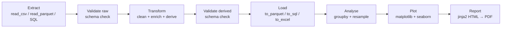
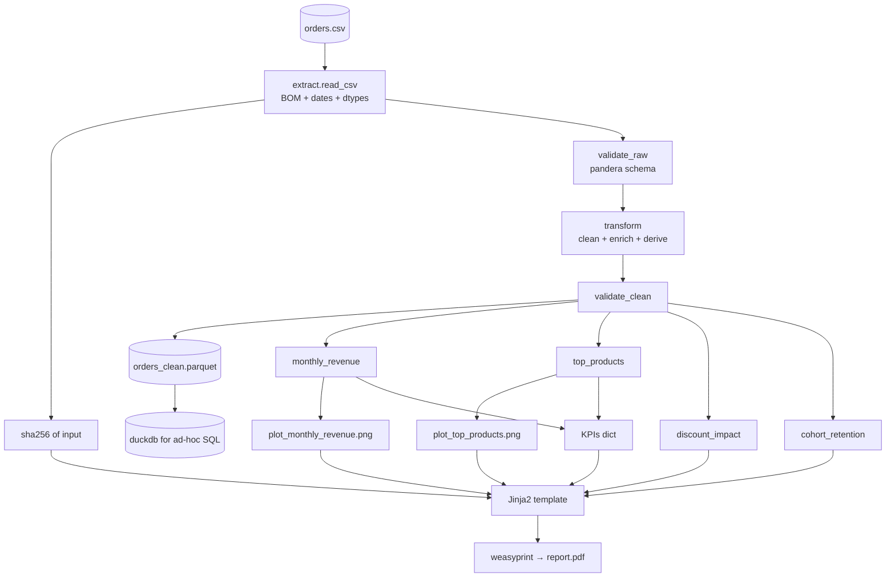
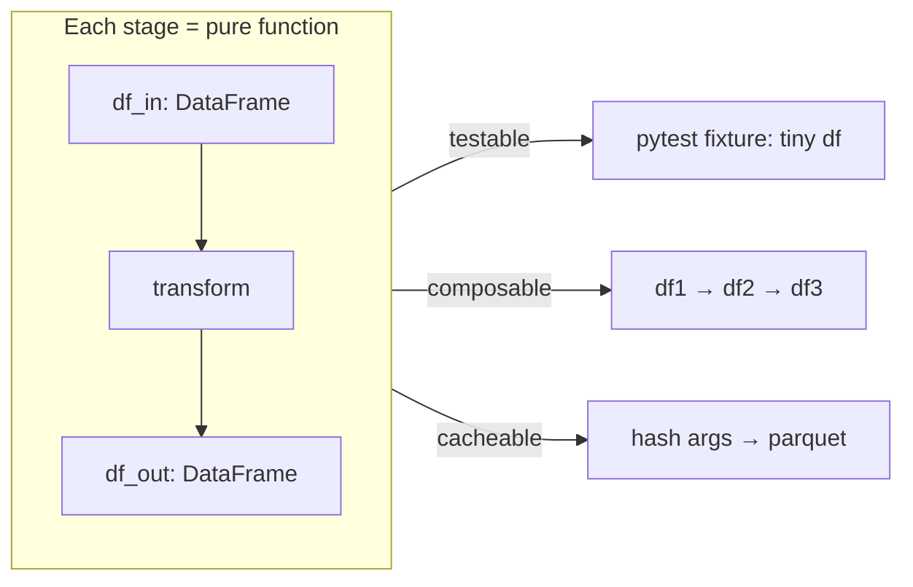
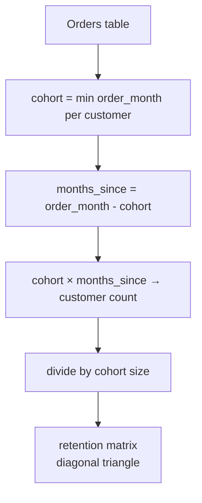
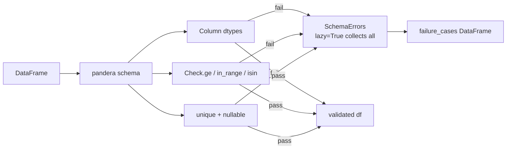

# 5. Build a Data Analysis Pipeline

> [!note] Why this note exists
> This note is the final capstone. It walks through building an **end-to-end data analysis pipeline**: ETL (Extract → Transform → Load), data validation, statistical summarisation, visualisation, and automated reporting. The stack is `pandas` + `numpy` for data manipulation, `matplotlib` + `seaborn` for visualisation, `pydantic` / `pandera` for validation, and `jinja2` + `weasyprint` (or `matplotlib` PDF backend) for HTML/PDF reports. The running example analyses a CSV of e-commerce orders: clean, validate, enrich, summarise, plot, and emit a PDF executive summary. After this note you should be able to build the same shape of pipeline for sales data, server logs, sensor telemetry, survey results — anything that starts as a messy CSV and ends as a decision-supporting report.

## Why It Matters

Almost every data job, regardless of title, eventually looks like this:

1. Receive a messy CSV / Excel / SQL dump.
2. Clean it (missing values, weird encodings, mixed types).
3. Validate it (does it match the expected schema?).
4. Enrich it (join with reference data, compute derived columns).
5. Summarise it (group-by aggregations, time-series resampling).
6. Visualise it (trends, distributions, breakdowns).
7. Report it (PDF / HTML / dashboard / Slack message).

Do this once and you've analysed a dataset. Automate it and you have a **pipeline** — a programmatic ETL that runs nightly, produces a fresh report every morning, and frees you from copy-pasting Excel formulas.

The hardest parts are not the analysis (pandas makes that pleasant) but:

- **Reproducibility** — the report from Tuesday must use the same code as Monday's, even if the input changed. Pin versions; record inputs' hashes.
- **Validation** — garbage in, garbage out. A schema mismatch (a column changed dtype, a column renamed) must surface as a clear error, not silently produce wrong numbers.
- **Robustness to weird inputs** — non-UTF-8 encodings, BOMs, mixed delimiters, scientific notation, locale-specific decimals (`,` vs `.`), dates in 5 different formats.
- **Reporting** — output must be readable by humans who don't run Python. HTML + PDF are universal.

## Background

### The modern Python data stack

| Layer | Tool | Why |
|-------|------|-----|
| Arrays / math | `numpy` | Universal substrate; pandas is built on it. |
| Tabular manipulation | `pandas` | The default. `polars` is the faster modern alternative. |
| Validation | `pandera` / `pydantic` | Schema enforcement; clear error messages. |
| Visualisation | `matplotlib` (low-level), `seaborn` (statistical), `plotly` (interactive) | Pick by need. |
| Reporting | `jinja2` (templates) + `weasyprint` (HTML→PDF) or `matplotlib.backends.backend_pdf` | HTML+CSS gives the most control. |
| Orchestration | `prefect` / `dagster` / `airflow` | For multi-stage pipelines with scheduling and retries. |
| Storage | `duckdb` (in-process SQL), `parquet` (columnar file format) | DuckDB queries parquet files at native speed. |

For a single-machine pipeline that runs nightly on one CSV, plain pandas + jinja2 is the right choice. Reach for `polars` when pandas is too slow (10M+ rows), for `prefect`/`dagster` when you have many interdependent tasks with retries, and for `duckdb` when SQL is more natural than pandas.

### ETL — the canonical shape



Each stage is a pure function: `df_out = transform(df_in)`. Keeping stages pure lets you test them in isolation and re-run only the failing stage when something breaks.

### Data validation matters

Without validation, you'll eventually write a report that says "average order value: NaN" because a column was renamed upstream. Validation catches this at the boundary, with a clear error message, before it propagates into summary statistics.

Two approaches:

- **`pandera`** — schema definitions on DataFrames, with type, range, and custom checks.
- **`pydantic`** — per-row validation, ideal when each row is a structured record.

We'll use `pandera` for the pipeline.

## Main content

### Step 1: The schema

```python
# schema.py
import pandera.pandas as pa
from pandera.pandas import Column, Check, DataFrameSchema

orders_raw_schema = DataFrameSchema({
    "order_id":       Column(int,        Check.ge(0),                  unique=True),
    "customer_id":    Column(int,        Check.ge(0),                  nullable=False),
    "order_date":     Column(pa.DateTime),
    "product_id":     Column(str,        Check.str_length(min_value=1)),
    "quantity":       Column(int,        Check.in_range(1, 1000)),
    "unit_price":     Column(float,      Check.gt(0)),
    "currency":       Column(str,        Check.isin(["USD", "EUR", "GBP", "JPY"])),
    "discount_code":  Column(str,        nullable=True),
}, strict=False, coerce=True)

orders_clean_schema = orders_raw_schema.add_columns({
    "total":         Column(float, Check.ge(0)),
    "usd_total":     Column(float, Check.ge(0)),
    "order_month":   Column(pa.DateTime),
})
```

`strict=False` allows extra columns (don't fail on surprises, just ignore them). `coerce=True` converts dtypes (e.g. `int` column read as `str` because of a single `""` gets coerced back). `nullable=True` for `discount_code` allows missing values.

### Step 2: Extract

```python
# extract.py
from pathlib import Path
import pandas as pd
import hashlib

def extract(path: Path) -> pd.DataFrame:
    """Read a CSV with all the common weirdness handled."""
    df = pd.read_csv(
        path,
        encoding='utf-8-sig',           # handles BOM
        parse_dates=['order_date'],     # parse to datetime
        dayfirst=True,                  # European dates: 31/12/2025
        na_values=['', 'NA', 'N/A', 'null', 'NULL', 'NaN'],
        dtype={'order_id': 'Int64', 'customer_id': 'Int64',
               'product_id': 'string', 'currency': 'string',
               'discount_code': 'string'},
        encoding_errors='replace',
    )
    return df

def file_hash(path: Path) -> str:
    h = hashlib.sha256()
    with path.open('rb') as f:
        for chunk in iter(lambda: f.read(1 << 16), b''):
            h.update(chunk)
    return h.hexdigest()[:16]
```

Always record the input file's hash. If the report on Tuesday differs from Monday, the hash tells you whether the input changed or the code did.

### Step 3: Validate raw

```python
# validate.py
import pandera.pandas as pa
from schema import orders_raw_schema

def validate_raw(df: pd.DataFrame) -> pd.DataFrame:
    try:
        return orders_raw_schema.validate(df, lazy=True)
    except pa.errors.SchemaErrors as e:
        # e.failure_cases is a DataFrame describing each failure
        print("Validation failed:")
        print(e.failure_cases.head(20))
        raise
```

`lazy=True` collects all failures before raising, instead of failing on the first. Crucial for understanding the full scope of bad data.

### Step 4: Transform — clean and enrich

```python
# transform.py
import pandas as pd
import numpy as np

# FX rates as of some date — in production, fetch from an API.
FX_TO_USD = {"USD": 1.0, "EUR": 1.08, "GBP": 1.27, "JPY": 0.0067}

def transform(df: pd.DataFrame) -> pd.DataFrame:
    df = df.copy()

    # 1. Drop fully-duplicate rows:
    df = df.drop_duplicates(subset=['order_id'])

    # 2. Standardise strings:
    df['currency'] = df['currency'].str.upper().str.strip()
    df['discount_code'] = df['discount_code'].str.upper().str.strip()

    # 3. Handle outliers — clip quantity to a sane range:
    df['quantity'] = df['quantity'].clip(lower=1, upper=1000)

    # 4. Derive total:
    df['total'] = df['quantity'] * df['unit_price']

    # 5. Convert to USD:
    df['usd_total'] = df['total'] * df['currency'].map(FX_TO_USD).astype(float)
    # If a currency wasn't in the map, usd_total becomes NaN — fail loudly:
    if df['usd_total'].isna().any():
        unknown = df.loc[df['usd_total'].isna(), 'currency'].unique()
        raise ValueError(f"Unknown currencies: {unknown}")

    # 6. Time features:
    df['order_month'] = df['order_date'].dt.to_period('M').dt.to_timestamp()
    df['day_of_week'] = df['order_date'].dt.day_name()

    # 7. Categorise order size:
    df['order_size'] = pd.cut(df['usd_total'],
                              bins=[0, 50, 200, 1000, np.inf],
                              labels=['small', 'medium', 'large', 'enterprise'])

    return df
```

### Step 5: Load

```python
# load.py
from pathlib import Path
import pandas as pd

def load_parquet(df: pd.DataFrame, path: Path) -> None:
    path.parent.mkdir(parents=True, exist_ok=True)
    df.to_parquet(path, engine='pyarrow', compression='snappy', index=False)

def load_duckdb(df: pd.DataFrame, db_path: Path, table: str = 'orders') -> None:
    import duckdb
    con = duckdb.connect(str(db_path))
    con.execute(f"CREATE OR REPLACE TABLE {table} AS SELECT * FROM df")
    con.close()
```

Parquet is the modern default for storing transformed data:

- Columnar (fast aggregations on selected columns).
- Compressed (5–10× smaller than CSV).
- Type-preserving (no re-parsing on read).
- Standardised (works across pandas, polars, duckdb, spark, pyarrow).

CSV is for human consumption; parquet is for machine consumption.

### Step 6: Analyse

```python
# analyse.py
import pandas as pd

def monthly_revenue(df: pd.DataFrame) -> pd.DataFrame:
    return (df.groupby('order_month', as_index=False)
              .agg(revenue=('usd_total', 'sum'),
                   orders=('order_id', 'nunique'),
                   customers=('customer_id', 'nunique'),
                   avg_order_value=('usd_total', 'mean')))

def top_products(df: pd.DataFrame, n: int = 10) -> pd.DataFrame:
    return (df.groupby('product_id', as_index=False)
              .agg(revenue=('usd_total', 'sum'),
                   units=('quantity', 'sum'))
              .nlargest(n, 'revenue'))

def revenue_by_currency(df: pd.DataFrame) -> pd.DataFrame:
    return (df.groupby('currency', as_index=False)
              .agg(revenue_usd=('usd_total', 'sum'),
                   orders=('order_id', 'nunique')))

def cohort_retention(df: pd.DataFrame) -> pd.DataFrame:
    """First-order-month cohort → % of customers returning each subsequent month."""
    df = df.copy()
    df['cohort'] = df.groupby('customer_id')['order_month'].transform('min')
    df['months_since'] = ((df['order_month'].dt.year - df['cohort'].dt.year) * 12
                          + df['order_month'].dt.month - df['cohort'].dt.month)
    cohort_sizes = df.groupby('cohort')['customer_id'].nunique()
    ret = (df.groupby(['cohort', 'months_since'])['customer_id'].nunique()
             .div(cohort_sizes, level='cohort')
             .unstack(fill_value=0))
    return ret

def discount_impact(df: pd.DataFrame) -> pd.DataFrame:
    df = df.copy()
    df['discounted'] = df['discount_code'].notna()
    return (df.groupby('discounted', as_index=False)
              .agg(avg_order_value=('usd_total', 'mean'),
                   order_count=('order_id', 'nunique')))
```

Every function is pure: takes a DataFrame, returns a DataFrame. No side effects. Easy to test, easy to compose.

### Step 7: Visualise

```python
# plots.py
import matplotlib.pyplot as plt
import matplotlib.ticker as mticker
import seaborn as sns
import pandas as pd
from pathlib import Path

sns.set_theme(style='whitegrid', context='talk')
PALETTE = sns.color_palette('muted')

def plot_monthly_revenue(monthly: pd.DataFrame, out: Path) -> None:
    fig, ax = plt.subplots(figsize=(10, 5))
    ax.plot(monthly['order_month'], monthly['revenue'], marker='o', linewidth=2)
    ax.set_title('Monthly Revenue (USD)')
    ax.set_xlabel('Month'); ax.set_ylabel('Revenue (USD)')
    ax.yaxis.set_major_formatter(mticker.FuncFormatter(lambda x, _: f'${x/1e3:.0f}k'))
    fig.autofmt_xdate()
    fig.tight_layout()
    fig.savefig(out, dpi=120, bbox_inches='tight')
    plt.close(fig)

def plot_top_products(top: pd.DataFrame, out: Path) -> None:
    fig, ax = plt.subplots(figsize=(10, 5))
    sns.barplot(data=top, y='product_id', x='revenue',
                hue='product_id', palette='viridis', legend=False, ax=ax)
    ax.set_title('Top 10 Products by Revenue')
    ax.set_xlabel('Revenue (USD)'); ax.set_ylabel('Product ID')
    ax.xaxis.set_major_formatter(mticker.FuncFormatter(lambda x, _: f'${x/1e3:.0f}k'))
    fig.tight_layout()
    fig.savefig(out, dpi=120, bbox_inches='tight')
    plt.close(fig)

def plot_order_size_distribution(df: pd.DataFrame, out: Path) -> None:
    fig, ax = plt.subplots(figsize=(8, 5))
    sns.countplot(data=df, x='order_size', hue='order_size',
                  palette='Set2', legend=False, ax=ax,
                  order=['small', 'medium', 'large', 'enterprise'])
    ax.set_title('Order Size Distribution')
    ax.set_xlabel('Order Size'); ax.set_ylabel('Count')
    fig.tight_layout()
    fig.savefig(out, dpi=120, bbox_inches='tight')
    plt.close(fig)
```

Three principles:

1. **`fig.tight_layout()` before `savefig`** — never ship a plot with axis labels cut off.
2. **`plt.close(fig)` after saving** — otherwise matplotlib accumulates figures in memory and the next PDF you generate has 50 duplicate plots.
3. **Formatters** (`mticker.FuncFormatter`) for human-readable axis labels ($1.5k, not 1534.27).

### Step 8: Report — HTML via Jinja2

```python
# report.py
from datetime import datetime
from pathlib import Path
from jinja2 import Template

HTML_TEMPLATE = """<!DOCTYPE html>
<html lang="en"><head>
<meta charset="utf-8">
<title>{{ title }}</title>
<style>
  body { font-family: -apple-system, 'Segoe UI', Roboto, sans-serif;
         margin: 40px; color: #222; line-height: 1.5; }
  h1 { color: #1a3a6c; border-bottom: 3px solid #1a3a6c; padding-bottom: 8px; }
  h2 { color: #1a3a6c; margin-top: 32px; }
  .kpi-grid { display: grid; grid-template-columns: repeat(4, 1fr); gap: 16px; margin: 20px 0; }
  .kpi { background: #f4f6fa; padding: 16px; border-radius: 8px;
         border-left: 4px solid #1a3a6c; }
  .kpi .label { font-size: 13px; color: #666; text-transform: uppercase; }
  .kpi .value { font-size: 24px; font-weight: bold; color: #1a3a6c; }
  table { border-collapse: collapse; width: 100%; margin: 12px 0; }
  th, td { padding: 8px 12px; text-align: left; border-bottom: 1px solid #ddd; }
  th { background: #1a3a6c; color: white; }
  tr:nth-child(even) { background: #f8f8f8; }
  img { max-width: 100%; height: auto; margin: 12px 0; border: 1px solid #eee; }
  .meta { color: #888; font-size: 12px; margin-top: 40px; }
</style></head><body>

<h1>{{ title }}</h1>
<p>Generated {{ generated_at }} from input <code>{{ input_path }}</code> (sha256: {{ input_hash }}).</p>

<div class="kpi-grid">
  <div class="kpi"><div class="label">Total Revenue</div><div class="value">{{ kpis.total_revenue }}</div></div>
  <div class="kpi"><div class="label">Orders</div><div class="value">{{ kpis.orders }}</div></div>
  <div class="kpi"><div class="label">Customers</div><div class="value">{{ kpis.customers }}</div></div>
  <div class="kpi"><div class="label">Avg Order Value</div><div class="value">{{ kpis.aov }}</div></div>
</div>

<h2>Monthly Revenue Trend</h2>


<h2>Top Products</h2>
{{ top_products_html }}

<h2>Top Products (chart)</h2>


<h2>Order Size Distribution</h2>


<h2>Discount Impact</h2>
{{ discount_html }}

<div class="meta">Pipeline version {{ version }}.</div>
</body></html>"""

def render_html(context: dict, out: Path) -> None:
    html = Template(HTML_TEMPLATE).render(**context)
    out.write_text(html, encoding='utf-8')

def to_pdf(html_path: Path, pdf_path: Path) -> None:
    """Requires weasyprint: pip install weasyprint"""
    from weasyprint import HTML
    HTML(filename=str(html_path), base_url=str(html_path.parent)).write_pdf(str(pdf_path))
```

Jinja2 templates give you full HTML+CSS control. `weasyprint` renders HTML/CSS to PDF — supports most of CSS 2.1 plus parts of CSS 3. The `base_url` is critical: it's how relative `` resolves.

### Step 9: Orchestrate

```python
# pipeline.py
from __future__ import annotations
import logging
from pathlib import Path
from datetime import datetime

import pandas as pd

from extract import extract, file_hash
from validate import validate_raw
from transform import transform
from load import load_parquet
from analyse import (monthly_revenue, top_products, revenue_by_currency,
                     discount_impact, cohort_retention)
from plots import plot_monthly_revenue, plot_top_products, plot_order_size_distribution
from report import render_html, to_pdf

log = logging.getLogger('pipeline')

def run(input_csv: Path, out_dir: Path) -> Path:
    out_dir.mkdir(parents=True, exist_ok=True)

    # ---- Extract ----
    log.info('Extracting %s', input_csv)
    df_raw = extract(input_csv)
    in_hash = file_hash(input_csv)

    # ---- Validate raw ----
    log.info('Validating raw schema (%d rows)', len(df_raw))
    df_raw = validate_raw(df_raw)

    # ---- Transform ----
    log.info('Transforming')
    df = transform(df_raw)

    # ---- Load ----
    parquet_path = out_dir / 'orders_clean.parquet'
    load_parquet(df, parquet_path)
    log.info('Wrote %s', parquet_path)

    # ---- Analyse ----
    monthly = monthly_revenue(df)
    top = top_products(df, n=10)
    by_cur = revenue_by_currency(df)
    disc = discount_impact(df)
    cohort = cohort_retention(df)

    # ---- KPIs ----
    kpis = {
        'total_revenue': f"${df['usd_total'].sum():,.0f}",
        'orders':        f"{df['order_id'].nunique():,}",
        'customers':     f"{df['customer_id'].nunique():,}",
        'aov':           f"${df['usd_total'].mean():,.2f}",
    }

    # ---- Plots ----
    plot_monthly_revenue(monthly, out_dir / 'monthly_revenue.png')
    plot_top_products(top, out_dir / 'top_products.png')
    plot_order_size_distribution(df, out_dir / 'order_size.png')

    # ---- Report ----
    context = {
        'title':         'E-Commerce Orders — Executive Summary',
        'generated_at':  datetime.now().isoformat(timespec='seconds'),
        'input_path':    str(input_csv),
        'input_hash':    in_hash,
        'kpis':          kpis,
        'top_products_html': top.to_html(index=False, border=0, classes='sortable'),
        'discount_html': disc.to_html(index=False, border=0),
        'version':       '1.0.0',
    }
    html_path = out_dir / 'report.html'
    render_html(context, html_path)
    pdf_path = out_dir / 'report.pdf'
    try:
        to_pdf(html_path, pdf_path)
        log.info('Wrote %s', pdf_path)
    except Exception as e:
        log.warning('PDF generation failed (%s); HTML only.', e)
    log.info('Done.')
    return pdf_path if pdf_path.exists() else html_path
```

### Step 10: CLI + scheduling

```python
# cli.py
import typer, logging
from pathlib import Path
from pipeline import run

app = typer.Typer()

@app.command()
def report(input_csv: Path, out_dir: Path = Path('out'),
           verbose: bool = typer.Option(False, '--verbose', '-v')):
    logging.basicConfig(level=logging.DEBUG if verbose else logging.INFO,
                        format='%(asctime)s %(levelname)s %(name)s: %(message)s')
    result = run(input_csv, out_dir)
    typer.echo(f"Report written to {result}")

if __name__ == '__main__':
    app()
```

Run nightly via cron:

```bash
0 2 * * * cd /opt/pipeline && /opt/pipeline/.venv/bin/report /data/orders.csv /reports/$(date +\%F)
```

Or via `systemd` timer, or `prefect` / `dagster` for richer scheduling and retries.

## Mermaid diagrams

### Pipeline architecture



### The pure-function transform pattern



### Cohort retention logic



### Validation flow



## Code examples

### Testing the pipeline

```python
# tests/test_transform.py
import pandas as pd, pytest
from transform import transform

@pytest.fixture
def sample_df():
    return pd.DataFrame({
        'order_id':      [1, 2, 3, 4],
        'customer_id':   [10, 10, 20, 30],
        'order_date':    pd.to_datetime(['2025-01-15', '2025-02-20',
                                          '2025-02-25', '2025-03-01']),
        'product_id':    ['A', 'B', 'A', 'C'],
        'quantity':      [1, 5, 2, 0],     # 0 will be clipped to 1
        'unit_price':    [10.0, 5.0, 10.0, 100.0],
        'currency':      ['usd', 'EUR', 'gbp', 'JPY'],
        'discount_code': ['SAVE10', None, 'save20', None],
    })

def test_transform_clips_quantity(sample_df):
    out = transform(sample_df)
    assert out['quantity'].min() == 1
    assert out.loc[3, 'quantity'] == 1

def test_transform_normalises_currency(sample_df):
    out = transform(sample_df)
    assert set(out['currency']) == {'USD', 'EUR', 'GBP', 'JPY'}

def test_transform_normalises_discount(sample_df):
    out = transform(sample_df)
    assert out.loc[0, 'discount_code'] == 'SAVE10'
    assert pd.isna(out.loc[1, 'discount_code'])

def test_transform_computes_total(sample_df):
    out = transform(sample_df)
    assert out.loc[0, 'total'] == 10.0
    assert out.loc[1, 'total'] == 25.0

def test_transform_usd_conversion(sample_df):
    out = transform(sample_df)
    assert abs(out.loc[0, 'usd_total'] - 10.0)  < 1e-6   # USD → USD
    assert abs(out.loc[1, 'usd_total'] - 27.0)  < 1e-6   # EUR 25 × 1.08
    assert abs(out.loc[2, 'usd_total'] - 25.4)  < 1e-6   # GBP 20 × 1.27 (after clip)

def test_transform_raises_on_unknown_currency(sample_df):
    sample_df.loc[0, 'currency'] = 'XYZ'
    with pytest.raises(ValueError, match='Unknown currencies'):
        transform(sample_df)
```

Property-based tests with `hypothesis` go further: "for any DataFrame matching the raw schema, `transform` produces a DataFrame matching the clean schema." Catch edge cases you'd never think to write.

### Ad-hoc SQL via DuckDB

```python
import duckdb
import pandas as pd

df = pd.read_parquet('orders_clean.parquet')

# Query the DataFrame as if it were a SQL table — no setup:
result = duckdb.query("""
    SELECT order_month,
           COUNT(*) AS orders,
           SUM(usd_total) AS revenue,
           AVG(usd_total) AS aov
    FROM df
    GROUP BY order_month
    ORDER BY order_month
""").to_df()
```

DuckDB can query pandas DataFrames, parquet files, CSVs, and even join across them — all in-process, with a PostgreSQL-compatible SQL dialect. Ideal for ad-hoc analysis after the pipeline has produced the clean parquet.

### Incremental / streaming ETL

For datasets too large to fit in memory:

```python
import pyarrow.parquet as pq
import pyarrow as pa

# Stream a large CSV in chunks:
batch_size = 100_000
writer = None
for chunk in pd.read_csv('huge.csv', chunksize=batch_size, parse_dates=['order_date']):
    chunk = transform(chunk)         # transform per-batch
    table = pa.Table.from_pandas(chunk)
    if writer is None:
        writer = pq.ParquetWriter('out.parquet', table.schema, compression='snappy')
    writer.write_table(table)
writer.close()
```

For genuinely huge data, switch to `polars` (lazy, multi-threaded, can scan disk-based parquet without loading) or `duckdb` (which can stream SQL over parquet files larger than RAM).

## Common Pitfalls

> [!warning] Trusting `read_csv` defaults
> `pd.read_csv(path)` infers dtypes from the first 1000 rows. If row 1001 has `"N/A"` in an int column, the whole column becomes `object`. Pass `dtype=` explicitly, or use `keep_default_na=False` + manual handling.

> [!warning] `Int64` vs `int64`
> Pandas' `int64` cannot represent missing values; a single `NaN` upcasts the column to `float64`. Use the nullable `Int64` (capital I) for integer columns that may have gaps.

> [!warning] Chained assignment
> `df[df['a'] > 0]['b'] = 5` doesn't modify `df` — it modifies a copy, then throws it away. Use `df.loc[df['a'] > 0, 'b'] = 5` (single statement). Pandas will warn (`SettingWithCopyWarning`); heed the warning.

> [!warning] Time zones
> A `datetime64[ns]` column is timezone-naive; `datetime64[ns, UTC]` is timezone-aware. Mixing them silently coerces or errors. Pick one and stick to it; convert at boundaries with `s.dt.tz_localize('UTC')` and `s.dt.tz_convert('US/Eastern')`.

> [!warning] `groupby` + `agg` with duplicate column names
> `df.groupby('g').agg({'x': ['sum', 'mean'], 'y': 'sum'})` produces a MultiIndex column. Flatten it: `agg.columns = ['_'.join(c).strip('_') for c in agg.columns]`.

> [!warning] `SettingWithCopyWarning` ignored
> It's not always benign. Sometimes pandas modifies a copy and silently loses your change. Refactor to use `.loc[]` or `df = df.copy()` at the top of each transform function.

> [!warning] Plotting without `plt.close(fig)`
> In a long-running pipeline, every `plt.figure()` accumulates in memory. Use `fig, ax = plt.subplots(); ...; fig.savefig(...); plt.close(fig)` to be explicit. Or use the object-oriented API exclusively (never `plt.plot`).

> [!warning] Weasyprint system dependencies
> WeasyPrint needs `libpango`, `libcairo`, and `libgdk-pixbuf` installed at the OS level. The Python `pip install weasyprint` is not enough. Use a Docker image with these pre-installed, or fall back to `pdfkit` (which wraps `wkhtmltopdf`).

> [!warning] Non-deterministic ordering
> `df.groupby('g').agg(...)` doesn't guarantee row order across pandas versions. Always `sort_values()` before serialising or plotting, so your report is reproducible.

> [!warning] Hard-coding FX rates / parameters
> A magic `1.08` somewhere in `transform.py` is a bug waiting to happen. Move all such constants to a `config.yaml` or `pydantic.BaseSettings` and version-control it.

> [!warning] Pipeline runs forever on bad data
> A 10 GB CSV with a malformed row can hang `read_csv` for hours. Use `nrows=1000` during development, and `on_bad_lines='warn'` (or `'skip'`) in production.

## Tips and Tricks

- **`pd.read_csv(..., dtype_backend='pyarrow')`** (pandas 2.0+) — uses Arrow's nullable types natively. Better missing-value handling, faster parsing, lower memory.
- **`pd.read_parquet`** is dramatically faster than `pd.read_csv` and preserves dtypes. Convert CSVs to parquet once, then work with parquet forever.
- **`df.describe(include='all')`** for a one-line summary of every column — dtypes, count, unique, top value, mean, quartiles.
- **`df.info(memory_usage='deep')`** to see where memory is going. `object` columns of strings often dominate; convert to `category` for 10–100× compression.
- **`pandas-stubs`** for type hints: `from pandas import DataFrame`. Enables IDE autocompletion and `mypy` checks.
- **`ydata-profiling`** (formerly `pandas-profiling`) — one-liner that generates an HTML profile report of any DataFrame. Excellent for first-pass EDA.
- **`great_expectations`** — enterprise-grade data validation with a declarative expectation syntax and HTML reports. Heavier than pandera but more featureful.
- **`polars`** for >1M-row workloads. Lazy evaluation, multi-threaded, 5–50× faster than pandas on equivalent operations. API is similar but not identical.
- **`duckdb`** as the SQL layer over parquet: `duckdb.query("SELECT * FROM 'data.parquet' WHERE ...")` — no setup, no server, native speed.
- **`hvplot` / `plotly`** for interactive HTML plots — hover tooltips are invaluable for executive reports.
- **`papermill`** for parameterised Jupyter notebooks — turn a notebook into a scheduled report: `papermill input.ipynb out.ipynb -p date 2025-01-15`.
- **`nbconvert`** to render notebooks to HTML / PDF as the report itself. Notebooks-as-reports is a popular pattern when the audience wants to see the code.
- **`matplotlib.ticker`** for human-friendly axes: `FuncFormatter(lambda x, _: f'${x/1e3:.0f}k')` is the difference between "1500000" and "$1,500k".
- **`seaborn.set_theme(style='whitegrid', context='talk', palette='muted')`** at the top of every plots module — consistent, professional defaults.
- **Cache intermediate results**: `if parquet_path.exists(): return pd.read_parquet(parquet_path)` at the top of `transform` — reruns are 10× faster during development.
- **`hashlib.sha256(file_bytes)`** at extract time; embed the hash in the report footer. If the report changes between runs, the hash tells you whether the input or the code changed.
- **Pin your dependencies** with `pip-tools` or `uv pip compile`. A pandas 2.x feature in your code will crash on pandas 1.x in production.
- **Logging with structured fields**: `log.info('extracted', extra={'rows': len(df), 'path': str(path)})` — machine-parseable, easy to ship to ELK / Loki.

## Active Recall

> [!question] Why use parquet instead of CSV for intermediate pipeline storage?
> Parquet is columnar (fast aggregations on selected columns), compressed (5–10× smaller), type-preserving (no re-parsing on read), and standardised across pandas / polars / duckdb / spark. CSV is for humans; parquet is for machines.

> [!question] What does `pandera` add over plain pandas dtypes?
> Pandera lets you declare not just dtypes but constraints: `Check.ge(0)`, `Check.isin([...])`, `unique=True`, `nullable=False`. It validates the whole DataFrame against the schema in one call and collects all failures (with `lazy=True`) into a structured `failure_cases` DataFrame.

> [!question] Why is each pipeline stage a pure function?
> Pure functions (input → output, no side effects) are independently testable, composable, cacheable, and parallelisable. A bug in `transform` can be reproduced with a single fixture DataFrame, without re-running extract.

> [!question] What's the difference between `int64` and `Int64` in pandas?
> `int64` is NumPy's, cannot represent missing values — a single `NaN` upcasts the column to `float64`. `Int64` (capital I) is pandas' nullable integer dtype, which can hold `NaN` without losing integer-ness.

> [!question] Why must you call `plt.close(fig)` after `fig.savefig(...)`?
> Matplotlib accumulates figures in memory until explicitly closed. In a long-running pipeline that generates hundreds of plots, this leads to an OOM crash. `plt.close(fig)` releases the figure's memory immediately.

> [!question] What does WeasyPrint need that `pip install weasyprint` doesn't provide?
> System libraries: `libpango`, `libcairo`, `libgdk-pixbuf` (and their headers on Linux). On a clean OS you must install these via the package manager before WeasyPrint will work. The Python wheel alone is insufficient.

> [!question] How do you make the pipeline reproducible across runs?
> (1) Pin dependency versions (`uv pip compile` or `pip-tools`). (2) Record the input file's SHA-256 hash and embed it in the report. (3) Sort outputs deterministically (no `groupby` without `sort_values`). (4) Set `random_state` on any stochastic step.

> [!question] Why prefer DuckDB over pandas for ad-hoc analysis?
> DuckDB can query parquet files (and pandas DataFrames) in-process with SQL, often 5–50× faster than equivalent pandas code, with no setup or server. It also handles larger-than-RAM data by streaming.

## Next Steps

- [[24. Pandas]] — the deep dive. Every transform function in this note is a pandas idiom; the chapter is the reference.
- [[23. NumPy]] — pandas is built on NumPy; understanding broadcasting explains the trickier `agg` and `transform` outputs.
- [[25. Matplotlib]] — the deep dive on plotting. This note's three plots barely scratch the surface.
- [[1. Scikit-Learn]] — the natural extension. Once the pipeline produces a clean parquet, train a model on it.
- [[2. Build a Web Scraper]] — many pipelines start with scraped data; combine the two for end-to-end automation.
- [[4. Build an Image Pipeline]] — sister project with the same orchestration patterns (discover → process → log → parallelise) applied to images instead of tabular rows.
- [[1. Build a CLI Tool]] — wrap the pipeline as `report /data/orders.csv --out /reports/today`.
- [[12. Testing]] — `pytest` fixtures + `hypothesis` property-based tests catch an entire class of transform bugs.
- [[13. Logging]] — structured logging makes pipeline failures debuggable from logs alone.
- [[21. Packaging and Distribution]] — ship the pipeline as an installable package; pin dependencies for reproducibility.
