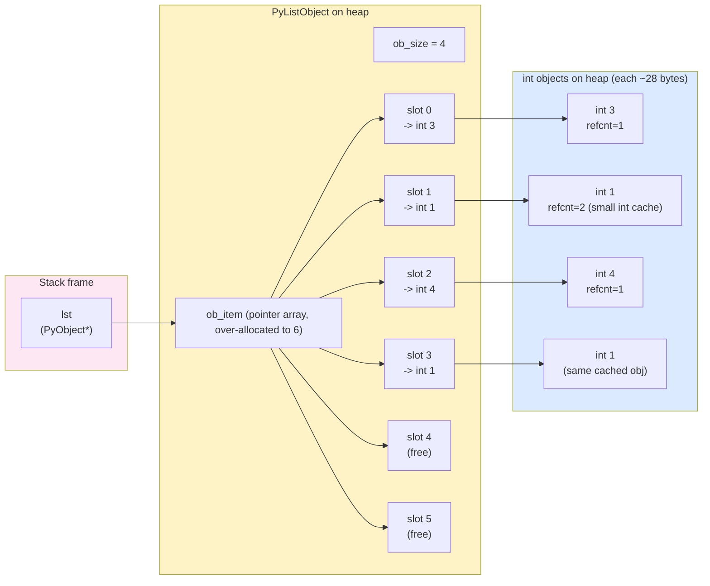

# 1. Lists Deep Dive

> [!note] Why this note exists
> The Python `list` is the most-used container in the language, yet most developers treat it as a magic bag that just works. This note peels back the abstraction: lists are **dynamic arrays of pointers**, grown with a geometric over-allocation strategy that gives amortized O(1) appends. Understanding the underlying memory model is the difference between writing list code that runs in 2 ms and 2 seconds — and the difference between knowing when a list is the right tool and when you should reach for a `deque`, `array`, or `set` instead.

## Why It Matters

Consider the following two snippets that build a list of one million integers:

```python
# Approach A: append in a loop
xs = []
for i in range(1_000_000):
    xs.append(i)

# Approach B: prepend in a loop
ys = []
for i in range(1_000_000):
    ys.insert(0, i)
```

Both look symmetric. Both produce a list of length one million. On a typical laptop, Approach A finishes in about 80 ms; Approach B takes about **35 seconds** — a **400× slowdown**. The reason is not the loop overhead, nor Python's interpreter speed. It is the **cost of shifting memory**. `append` adds to the end (where there is pre-allocated free space); `insert(0, ...)` must shift every existing element one slot to the right each time, making it O(n) per call and O(n²) overall.

If you don't know how lists are implemented, you will write code like Approach B without realizing it — and you will blame Python for being "slow" when the real problem is a data-structure choice you didn't know you were making. This note exists to give you the mental model so that you can predict these costs before you measure them.

## Background

### Lists are arrays of pointers

A Python list is **not** an array of values in the C sense. It is an array of `PyObject*` pointers, each pointing to a separate Python object on the heap. This has three consequences:

1. **Every element has the same size at the array level** — one pointer (8 bytes on 64-bit). The objects themselves can be tiny integers or multi-MB strings; the array slot is always 8 bytes.
2. **Storing an integer in a list does not store the integer** — it stores a reference to a Python `int` object. That object has its own header, type info, and reference count. This is why a list of 1 million small integers consumes ~35 MB of memory rather than 4 MB: 8 MB for the pointer array plus ~28 bytes per integer object.
3. **Pointer indirection matters for cache performance**. Iterating a list does a pointer chase on every element, defeating the CPU's prefetcher. This is one reason NumPy is dramatically faster than pure-Python lists for numeric work — NumPy stores values inline.

### Geometric over-allocation

When you create an empty list, Python allocates no slots at all. The first `append` triggers an allocation. Subsequent `appends` may need to grow the underlying buffer. Python's growth strategy (from CPython's `listobject.c`) is approximately:

```c
new_allocated = newsize + (newsize >> 3) + (newsize < 9 ? 3 : 6);
```

Roughly, each resize adds about 12.5% of the current size, plus a small constant. This means:

- Each resize is O(n) (it must copy the existing pointers).
- Resizes happen O(log n) times over n appends.
- The total cost of n appends is O(n) — so **amortized O(1) per append**.

This is the classic dynamic-array argument: you pay O(n) for a resize, but because resizes are exponentially rare, the average per operation is constant. The trade-off is that the list's underlying buffer is usually **bigger than `len(lst)`** — Python is buying speed with memory.

### Lists vs. linked lists

Because Python lists are arrays, the cost profile is the **opposite** of a linked list:

| Operation | Python list | Linked list |
|-----------|-------------|-------------|
| `lst[i]` (random access) | O(1) | O(n) |
| `lst.append(x)` | O(1) amortized | O(1) |
| `lst.insert(0, x)` | O(n) | O(1) |
| `lst.pop()` (end) | O(1) | O(1) |
| `lst.pop(0)` (front) | O(n) | O(1) |
| Iteration | Fast (cache-friendly) | Slow (pointer chase) |

If you need cheap front-and-back operations, use `collections.deque` (a doubly-linked list of blocks). If you need random access, use a list. If you need numeric speed, use NumPy.

## Main Content

### List methods — the complete tour

```python
lst = [3, 1, 4, 1, 5, 9, 2, 6]

# --- Mutators that change length ---
lst.append(5)            # -> [3,1,4,1,5,9,2,6,5]      O(1) amortized
lst.extend([7, 8])       # -> [...,5,7,8]              O(k)
lst.insert(2, 99)        # -> [...,99,...]              O(n)
lst.pop()                # removes & returns last       O(1)
lst.pop(2)               # removes & returns index 2    O(n)
lst.remove(1)            # removes first 1 (by value)   O(n)
lst.clear()              # empties the list             O(n)

# --- In-place reordering ---
lst.sort()               # ascending                    O(n log n)
lst.sort(reverse=True)   # descending
lst.sort(key=len)        # by key function
lst.reverse()            # in-place                     O(n)

# --- Information ---
lst.index(4)             # first index of value 4       O(n)
lst.count(1)             # count of value 1             O(n)

# --- Copies ---
shallow = lst.copy()     # same as lst[:]               O(n)
```

> [!warning] `list.copy()` and `lst[:]` produce a **shallow** copy. The list is new, but the elements are the same object references. Mutating an element (if mutable) is visible through both lists. Use `copy.deepcopy()` for true independence.

### Slicing — the deepest rabbit hole in Python lists

Slicing creates a **new list** containing references to a subset of elements. The full syntax is `lst[start:stop:step]`, with these rules:

- All three are optional. `lst[:]` is a full shallow copy.
- `start` is **inclusive**, `stop` is **exclusive** — same as `range()`.
- Negative indices count from the end: `lst[-1]` is the last element.
- A negative `step` reverses: `lst[::-1]` reverses the list.
- Out-of-range indices are silently clamped: `lst[:999]` does not raise.

```python
lst = [0, 1, 2, 3, 4, 5, 6, 7, 8, 9]

lst[2:5]      # [2, 3, 4]              start=2, stop=5, step=1
lst[:3]       # [0, 1, 2]              first 3
lst[-3:]      # [7, 8, 9]              last 3
lst[::2]      # [0, 2, 4, 6, 8]        every other
lst[::-1]     # [9, 8, ..., 0]         reversed (new list)
lst[1:-1:2]   # [1, 3, 5, 7]           step 2, skip ends
lst[5:1:-1]   # [5, 4, 3, 2]           negative step, "start > stop"
```

> [!tip] Reverse idiom
> `lst[::-1]` is the idiomatic Python way to reverse a list. It returns a new list. For in-place reversal use `lst.reverse()`; for an iterator use `reversed(lst)`.

**Slice assignment** is a powerful, underused feature:

```python
lst = [0, 1, 2, 3, 4]
lst[1:3] = [10, 20, 30, 40]   # -> [0, 10, 20, 30, 40, 3, 4]
lst[::2] = [100, 200, 300]    # -> [100, 10, 200, 30, 300, 3, 4]
lst[1:4] = []                 # deletes -> [100, 300, 3, 4]
```

Slice assignment **replaces** the slice with the iterable on the right. The lengths don't have to match — the list grows or shrinks accordingly. With a step, the right side must have exactly as many elements as the slice.

### List comprehensions (cross-reference)

```python
squares = [x*x for x in range(10)]
even_squares = [x*x for x in range(10) if x % 2 == 0]
nested = [[r*c for c in range(3)] for r in range(3)]
```

Comprehensions are faster than `for`-loop-and-`append` because the loop runs inside the CPython evaluator without per-iteration `append` attribute lookups. See [[3. Comprehensions and Generator Expressions]] (or the relevant Control Flow note) for the full treatment.

### Identity vs. equality

```python
a = [1, 2, 3]
b = [1, 2, 3]
c = a

a == b       # True  — same contents (equality)
a is b       # False — different objects (identity)
a is c       # True  — same object
```

`is` checks **identity** (same `id()`, i.e. same memory address). `==` checks **equality** (the `__eq__` method). For lists, `==` compares element-wise. For the singleton-like objects (`None`, `True`, `False`), always use `is`:

```python
if x is None: ...      # correct
if x == None: ...      # works but wrong idiom; can be tricked by __eq__
```

> [!danger] The "is vs ==" silent bug
> `x == None` *can* raise or return weird results if `x` is a NumPy array, a pandas Series, or any object with an unusual `__eq__`. Always use `is None`. Linters (flake8, ruff) flag this.

### Memory layout



The diagram shows: the list variable holds a pointer to a `PyListObject` on the heap. That object contains a length and a pointer to a `PyObject**` array. The array is over-allocated (capacity 6, length 4). Each slot points to a separate integer object. Small integers (-5 to 256) are cached by CPython, so the two `1`s point to the same cached object — but `lst` does not know or care.

### Length vs. capacity

`len(lst)` is the user-visible length. The **capacity** (the size of the underlying `ob_item` array) is bigger. You can't read it directly from Python without `sys.getsizeof`:

```python
import sys
xs = []
for _ in range(20):
    xs.append(0)
    print(len(xs), sys.getsizeof(xs))
```

You'll see capacity jump in discrete steps — say, from 88 to 120 to 184 to 248 bytes — every few appends. Those are the resize events.

## Code Examples

### Example 1: Building a list efficiently

```python
# BAD: prepending — O(n^2)
def build_reversed_bad(n):
    lst = []
    for i in range(n):
        lst.insert(0, i)
    return lst

# GOOD: appending, then reversing — O(n)
def build_reversed_good(n):
    lst = []
    for i in range(n):
        lst.append(i)
    lst.reverse()
    return lst

# BEST: comprehension — O(n), fast constant
def build_reversed_best(n):
    return [n - 1 - i for i in range(n)]
```

### Example 2: Flattening a 2D list

```python
matrix = [[1, 2, 3], [4, 5, 6], [7, 8, 9]]

# Approach A: nested comprehension (Pythonic, fast)
flat = [x for row in matrix for x in row]

# Approach B: itertools.chain (avoids intermediate lists)
from itertools import chain
flat = list(chain.from_iterable(matrix))

# Approach C: sum with start=[] (CUTE but O(n^2) — avoid!)
flat = sum(matrix, [])     # don't do this
```

### Example 3: Picking the right data structure

```python
# Membership testing — list is O(n), set is O(1)
def find_duplicates_list(items):
    seen = []
    dups = []
    for x in items:
        if x in seen:        # O(n) — makes whole loop O(n^2)
            dups.append(x)
        else:
            seen.append(x)
    return dups

def find_duplicates_set(items):
    seen = set()
    dups = []
    for x in items:
        if x in seen:        # O(1) — whole loop O(n)
            dups.append(x)
        else:
            seen.add(x)
    return dups
```

For 100,000 items with 1,000 duplicates, the list version takes seconds; the set version takes milliseconds. See [[2. List Operations and Complexity]] and [[4. Sets and Frozen Sets]].

## Advanced Patterns and Performance

### List vs `array.array` vs `bytearray` vs NumPy

The general-purpose `list` is rarely the optimal container when you have **homogeneous numeric data**. Python offers a spectrum of more specialised containers, each with different memory and speed trade-offs:

| Container | Element type | Bytes/elem | Random access | Use case |
|-----------|--------------|------------|---------------|----------|
| `list` | Any Python object | ~8 (ptr) + ~28 (object) | O(1) | General-purpose, heterogeneous |
| `array.array('i')` | C `int` | 4 | O(1) | Homogeneous numeric, no NumPy |
| `array.array('d')` | C `double` | 8 | O(1) | Floats, scientific on constrained envs |
| `bytearray` | `0..255` | 1 | O(1) | Binary protocols, mutable buffers |
| `bytes` | `0..255` | 1 | O(1) | Immutable binary, network/file content |
| `numpy.ndarray` | Any numeric | 1-16 | O(1), vectorized ops | Numerical computing, batch math |

For a million integers, `list` uses ~35 MB, `array('i')` uses 4 MB, `numpy.int32` uses 4 MB. For a million floats, `list` uses ~36 MB, `array('d')` uses 8 MB, `numpy.float64` uses 8 MB — and NumPy computes elementwise operations in C, often 50× faster than a Python loop.

### Pre-allocation and slot reuse

When you know the final length upfront and need indexed assignment, pre-allocate:

```python
# O(n) with one allocation, no resizes
result = [None] * n
for i, x in enumerate(source):
    result[i] = transform(x)

# Worse: O(n) but with log(n) resizes and repeated attribute lookups
result = []
for x in source:
    result.append(transform(x))
```

For very tight loops the pre-allocated version can be 10-15% faster. With comprehensions (`[transform(x) for x in source]`) you usually get the best of both worlds — CPython pre-sizes the comprehension's list based on the iterable's length when possible.

### The `*` operator and aliasing

`lst * k` creates a new list with `k * len(lst)` slots, but the **element references are shared**:

```python
row = [0] * 3        # [0, 0, 0] — fine, ints are immutable
board = [row] * 3    # [[0,0,0],[0,0,0],[0,0,0]] — DANGER
board[0][0] = 1
# board is now [[1,0,0],[1,0,0],[1,0,0]] — all rows alias row
```

The safe pattern is a comprehension that re-evaluates the inner constructor:

```python
board = [[0] * 3 for _ in range(3)]   # independent rows
```

### Memory over-allocation and `lst.clear()`

`clear()` empties the list but does **not** free the underlying `ob_item` buffer. The capacity remains. If you want to actually release memory, replace the list:

```python
lst[:] = []     # also keeps capacity
lst = []        # creates a new list; old one GC'd if no other refs
```

For long-running services that build large temporary lists, this matters: a list that briefly held 10M elements will keep its ~80 MB buffer even after `clear()`. Use `del lst[:]` or rebind to release the buffer.

### Sorting stability and multi-key sorts

Python's `list.sort()` is **stable** — equal keys retain their original order. This is the key to multi-key sorts: sort by the **least significant key first**, then by more significant keys. Or, more idiomatically, use a tuple key:

```python
# Sort people by age ascending, then name ascending — both as one operation
people.sort(key=lambda p: (p.age, p.name))

# Sort by age ascending, name DESCENDING — negate the string is impossible,
# so do it in two passes (stable sort):
people.sort(key=lambda p: p.name, reverse=True)
people.sort(key=lambda p: p.age)  # age is primary; name's reverse-order preserved
```

The two-pass approach exploits stability: after the second sort by age, ties keep the name-descending order established by the first sort. With mixed-direction keys on non-numeric types, this is the only general solution.

### The "Schwartzian transform" via `key=` (decorate-sort-undecorate)

Decorating each element with a computed sort key, sorting, then undecorating used to be a common idiom:

```python
# Old-school decorate-sort-undecorate (no longer needed in Python)
decorated = [(len(s), s) for s in strings]
decorated.sort()
result = [s for (_, s) in decorated]
```

Python's `key=` parameter does this internally and efficiently — the key function is called **exactly once per element**, the keys are cached, and the sort compares the cached keys. This is dramatically faster than passing a comparator (`functools.cmp_to_key`), which would invoke the comparator O(n log n) times.

## Common Pitfalls

> [!danger] Default argument mutation
> ```python
> def add_item(x, lst=[]):     # BAD
>     lst.append(x)
>     return lst
> ```
> The default `[]` is evaluated **once** at function definition. All calls without `lst` share the same list. Use `lst=None` and `if lst is None: lst = []` inside.

> [!danger] Aliasing in a list of lists
> ```python
> board = [[0] * 3] * 3       # BAD
> board[0][0] = 1
> # board is now [[1,0,0],[1,0,0],[1,0,0]] — all rows are the same object!
> ```
> The outer `* 3` repeats the **reference** to the inner list. Use a comprehension: `[[0] * 3 for _ in range(3)]`.

> [!danger] Modifying a list while iterating
> ```python
> lst = [1, 2, 3, 4, 5]
> for x in lst:
>     if x % 2 == 0:
>         lst.remove(x)        # skips elements!
> ```
> Iteration uses an internal index; `remove` shifts elements left, so the next `x` skips one. Collect to-remove indices first, or build a new list:
> ```python
> lst = [x for x in lst if x % 2 != 0]
> ```

> [!danger] `+=` vs `+` on lists
> `lst += other` calls `__iadd__`, which **extends in place** (mutates `lst`). `lst = lst + other` calls `__add__`, which creates a new list. They behave differently inside functions when `lst` is a parameter:
> ```python
> def f(lst):
>     lst += [4]       # caller sees the change (in-place)
> def g(lst):
>     lst = lst + [4]  # caller does NOT see the change (rebind)
> ```

> [!danger] `sort()` returns `None`
> ```python
> lst = [3, 1, 2].sort()      # lst is None!
> lst = sorted([3, 1, 2])     # correct — sorted() returns new list
> ```

## Tips and Tricks

- **Use `list.sort(key=...)` instead of a custom comparator.** A key function is called once per element; a comparator is called O(n log n) times. Sort by a tuple for multi-key sorts: `lst.sort(key=lambda x: (x.priority, x.name))`.
- **Pre-size with `[None] * n`** when you know the final length and need indexed assignment — it avoids the resize overhead. But you lose the auto-grow property.
- **`enumerate` over `range(len(...))`**: `for i, x in enumerate(lst)` is more Pythonic and slightly faster than `for i in range(len(lst)): x = lst[i]`.
- **`zip(*lists)` to transpose**: `list(zip(*matrix))` turns rows into columns in one line.
- **`any` / `all` short-circuit**: `any(x > 0 for x in lst)` stops at the first `True`. Wrap in a generator to avoid materializing a list.
- **Small int cache**: integers -5..256 are singletons in CPython, so `a is b` is True if both are small ints with the same value. Don't rely on this for large ints.
- **`array.array` for homogeneous primitives**: if you have a million floats, `array('d', ...)` is ~8 bytes per element instead of ~36 — see [[5. Dictionaries Deep Dive]]-adjacent discussions.
- **`sys.getsizeof(lst, 'element')`** gives the shallow size; for deep size use `pympler` or `objgraph`.

## Active Recall

1. Why is `lst.append(x)` O(1) amortized but `lst.insert(0, x)` is O(n)?
2. What is the capacity-vs-length distinction in CPython's list implementation, and why does it matter?
3. Write a one-liner to reverse a list. Why might you prefer `lst.reverse()` instead?
4. Explain why `board = [[0]*3] * 3` produces aliasing bugs and how to fix it.
5. What does `lst[::2]` do? What about `lst[::-1]`? What about `lst[5:1:-1]`?
6. Why does `def f(x, lst=[])` cause a "shared default" bug? How do you fix it?
7. What's the difference between `lst += other` and `lst = lst + other` when `lst` is a function parameter?
8. Why is iterating a Python list slower than iterating a NumPy array of the same length?
9. Does `lst.copy()` produce a deep copy? How do you get a deep copy?
10. What is the small-int cache and what range does it cover?
11. Write a function that removes all even numbers from a list **without** the iterator-modification bug.
12. Given a list of 10 million integers, what's the fastest way to count duplicates: keep a `seen = []`, or `seen = set()`? Why?

## Next Steps

- [[2. List Operations and Complexity]] — the full Big-O reference table for every list operation.
- [[4. Sets and Frozen Sets]] — when membership tests matter, sets crush lists.
- [[5. Dictionaries Deep Dive]] — hash tables, the closest sibling to lists in everyday Python.
- [[7. collections Module]] — `deque`, `ChainMap`, `Counter`, `defaultdict` for when a plain list isn't enough.
- [[8. heapq and bisect]] — using a list as a heap or a sorted sequence.
- [[3. Tuples and Named Tuples]] — the immutable cousin, with different performance trade-offs.
