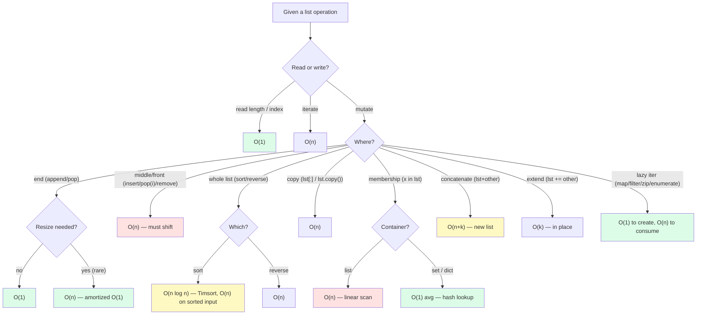

# 2. List Operations and Complexity

> [!note] Why this note exists
> Most Python developers use lists every day without a precise mental model of which operations are cheap and which are secretly O(n). This note is a complete Big-O reference for every list operation, expanded from the canonical source table, with the **why** behind each cost. When you finish reading it you should be able to look at any list expression and predict its asymptotic cost — and to know when to swap the list for a set, dict, deque, or NumPy array.

## Why It Matters

Here is a piece of code that looks fine and runs in milliseconds for a thousand elements, in seconds for a hundred thousand, and **never finishes** for ten million:

```python
def find_pairs(lst, target):
    for i, a in enumerate(lst):
        for j, b in enumerate(lst):
            if i != j and a + b == target:
                return (a, b)
```

The problem is not the nested loop per se — it's that the author didn't think about the cost of `enumerate`, indexing, and comparison at scale. The full loop is O(n²) and there is no algorithmic shortcut as written. A two-line rewrite using a set brings it to O(n):

```python
def find_pairs(lst, target):
    seen = set()
    for a in lst:
        if (target - a) in seen:    # O(1) lookup
            return (target - a, a)
        seen.add(a)
```

The rewrite only works if you **know** that `in` on a list is O(n) and `in` on a set is O(1). That knowledge is what this note teaches. Without it, you will keep writing O(n²) code, and your programs will mysteriously fall over when the dataset grows.

## Background

### What "complexity" means here

For each operation we report two costs:

- **Time complexity** — how the wall-clock time grows with the input size `n`. We use Big-O notation: O(1), O(log n), O(n), O(n log n), O(n²). We say "amortized" when the cost is O(1) on average but an occasional operation is O(n) — e.g. `append`.
- **Space complexity** — extra memory the operation allocates beyond the input.

All numbers assume CPython. PyPy and other implementations differ in detail but match the asymptotics.

### Amortized analysis — the trick behind `append`

A single `append` can be O(n) if it triggers a resize that copies the existing buffer. But resizes happen geometrically (see [[1. Lists Deep Dive]]), so over `n` appends there are only O(log n) resizes, each O(n). The total cost is O(n) for n appends, so the **amortized** cost per `append` is O(1). For the user this means: an `append`-heavy loop is O(n) total, not O(n²).

### Hash-based operations and pathological inputs

`set`, `dict.fromkeys`, and dict membership are O(1) **on average** but O(n) **in the worst case** when many keys hash to the same bucket. Python's hash randomization (since 3.3) makes this extremely unlikely for ordinary data, but a malicious adversary who can control keys (e.g. JSON request bodies) could trigger it. See the discussion of CVE-2012-1150 in the Python security archives.

### Lazy iterators

`map`, `filter`, `zip`, `enumerate`, `reversed`, generator expressions, and `dict.keys`/`dict.values`/`dict.items` views are **lazy**: creating them is O(1); they don't materialize any output until you iterate. The cost of full iteration is still O(n), but you only pay for what you consume:

```python
z = zip(big_list_1, big_list_2)   # O(1)
first = next(iter(z))             # O(1) — only one pair produced
# big_list_2's later elements are never touched.
```

This is enormously useful when you want `next(filter(pred, haystack))` — you find the first match in O(k) where k is the index, not O(n).

## Main Content

### The complete complexity table

This is the canonical reference, expanded with notes:

| Operation | Description | Time | Space |
|-----------|-------------|------|-------|
| `len(lst)` | Length | **O(1)** | O(1) |
| `lst[i]` | Indexing | **O(1)** | O(1) |
| `lst[i] = x` | Index assignment | **O(1)** | O(1) |
| `for x in lst:` | Iteration (full) | **O(n)** | O(1) |
| `x in lst` | Membership (linear scan) | **O(n)** | O(1) |
| `lst.append(x)` | Add to end | **O(1)** amortized | O(1) |
| `lst.pop()` | Remove from end | **O(1)** | O(1) |
| `lst.pop(i)` | Remove at index i | **O(n)** | O(1) |
| `lst.insert(i, x)` | Insert at index i | **O(n)** | O(1) |
| `del lst[i]` | Delete at index i | **O(n)** | O(1) |
| `lst.remove(x)` | Delete first matching value | **O(n)** | O(1) |
| `lst.sort()` | In-place sort (Timsort) | **O(n log n)** | O(1) extra |
| `sorted(lst)` | Return new sorted list | **O(n log n)** | O(n) |
| `reversed(lst)` | Reverse iterator (lazy) | **O(1)** | O(1) |
| `lst.reverse()` | In-place reverse | **O(n)** | O(1) |
| `min(lst) / max(lst)` | Linear scan | **O(n)** | O(1) |
| `sum(lst)` | Linear scan | **O(n)** | O(1) |
| `list(set(lst))` | Dedupe (no order) | **O(n)** avg | O(n) |
| `list(dict.fromkeys(lst))` | Dedupe (keep order) | **O(n)** avg | O(n) |
| `map(func, lst)` | Lazy map | **O(1)** | O(1) |
| `filter(func, lst)` | Lazy filter | **O(1)** | O(1) |
| `lst.copy()` | Shallow copy | **O(n)** | O(n) |
| `lst[:]` | Slice copy | **O(n)** | O(n) |
| `lst[a:b]` | Sub-slice | **O(k)**, k = slice size | O(k) |
| `lst.extend(other)` | In-place extend | **O(k)**, k = len(other) | O(1) |
| `lst + other` | Concatenation (new list) | **O(n + k)** | O(n + k) |
| `lst += other` | In-place extend (alias for extend) | **O(k)** | O(1) |
| `zip(a, b)` | Lazy pair iterator | **O(1)** | O(1) |
| `enumerate(lst)` | Lazy index+value iterator | **O(1)** | O(1) |
| `any(lst)` | Short-circuit OR | **O(n)** worst case | O(1) |
| `all(lst)` | Short-circuit AND | **O(n)** worst case | O(1) |
| `lst.count(x)` | Linear scan | **O(n)** | O(1) |
| `lst.index(x)` | Linear scan to first match | **O(n)** | O(1) |
| `lst * k` | Repetition (new list) | **O(n*k)** | O(n*k) |

### Per-row rationale

- **`len(lst)` is O(1)** because `PyListObject` stores `ob_size` directly. The runtime doesn't have to scan.
- **`lst[i]` is O(1)** because lists are arrays of pointers — direct index arithmetic.
- **`x in lst` is O(n)** because there is no shortcut: the runtime must compare `x` with each element until a match or end. Compare with `x in set` which is O(1) — see below.
- **`pop()` is O(1)** but `pop(0)` is O(n)**: popping the end just decrements `ob_size`; popping the front requires shifting every element left by one.
- **`insert(i, x)` is O(n)**: same shift as `pop(i)`, in reverse.
- **`remove(x)` is O(n)**: linear scan to find `x`, then a left shift to close the gap. So even though it's "by value" it has the same cost as `pop(index_of_x)`.
- **`sort()` is O(n log n)**: CPython uses **Timsort**, a hybrid merge-insertion sort that exploits existing runs. Timsort's best case (already-sorted input) is O(n). Worst case is O(n log n). Space is O(n) for `sorted()` (new list), O(1) *extra* for `lst.sort()` (in-place, but Timsort uses up to n/2 temporary slots internally — those count as overhead, not extra user-visible space).
- **`lst[a:b]` is O(k)** where k = `b - a`. Slicing allocates a new list of size k and copies k pointers.
- **`extend` vs `+`**: `extend` mutates `lst` in place (no new list); `+` builds a new list. Both are O(len(other)) for the work, but `+` allocates a new n+k list.
- **`list(set(lst))`** is O(n) average but you lose order (sets are insertion-ordered in CPython 3.7+ but the *resulting order* is the order of first appearance — actually, this is reliable since 3.7. So `list(set(lst))` *does* preserve first-occurrence order in modern Python, but `dict.fromkeys(lst)` is the more idiomatic way to express that intent.)

### Hash-based deduplication: why `set` and `dict.fromkeys` are O(n) avg

Both rely on hashing each element (O(1) per element on average) and storing it in a hash table. For n elements this is O(n) total. The worst case — adversarial collisions — is O(n²), but Python's hash randomization makes that impractical to trigger accidentally.

```python
import random
n = 1_000_000
data = [random.randint(0, n) for _ in range(n)]

# Dedupe with set — O(n) avg
unique_set = list(set(data))

# Dedupe with dict.fromkeys — also O(n) avg, explicit "keep first"
unique_ordered = list(dict.fromkeys(data))
```

### Lazy iterators: O(1) to create, O(n) to consume

```python
# Creating these is O(1) — no work done yet
m = map(str.upper, big_list)         # lazy
f = filter(lambda s: len(s) > 3, m)  # lazy
z = zip(f, range(10))                # lazy — stops at 10 anyway
e = enumerate(z)                     # lazy

# Now consume — pays O(k) where k is how far you actually go
result = list(e)                     # materialize all — bounded by min(10, len(filter result))
```

This is the key insight: **you can chain lazy iterators without paying the cost of intermediate lists**. Compare:

```python
# Eager — allocates 3 intermediate lists
result = list(filter(pred2, list(filter(pred1, list(map(fn, big))))))

# Lazy — one pass, no intermediates
result = list(filter(pred2, filter(pred1, map(fn, big))))
```

The lazy version streams elements through the chain one at a time. Memory is O(1) for the chain (not counting the result), and time is O(n).

### Why `any` and `all` can be sub-linear

```python
def has_even(lst):
    return any(x % 2 == 0 for x in lst)
```

`any` returns `True` the moment it sees a truthy value. If the first element is even, `has_even` returns in O(1). Only the **worst case** (no match, or match at the end) is O(n). The generator expression makes this short-circuit behavior automatic.

### Why Timsort is good

Timsort detects **already-sorted runs** in the input and merges them. If your data is already sorted or nearly sorted, `lst.sort()` runs in O(n), not O(n log n). This is why sorting a list that you've just appended to (which preserves order) is dramatically faster than sorting a randomly-shuffled list.

```python
import random
import time

n = 1_000_000
sorted_data = list(range(n))
shuffled = sorted_data[:]
random.shuffle(shuffled)

t0 = time.perf_counter(); sorted_data.sort(); print(f"sorted input:  {time.perf_counter()-t0:.3f}s")
t0 = time.perf_counter(); shuffled.sort();    print(f"shuffled input:{time.perf_counter()-t0:.3f}s")
```

Expect roughly a 5-10× difference — both asymptotically O(n log n) but Timsort's best case is much better.

## Complexity cheat sheet



Green = fast, red = slow at scale, yellow = tolerable but think before using in a hot loop.

## Code Examples

### Example 1: Convert an O(n²) algorithm to O(n)

```python
# O(n^2) — for each element, linear-scan the list for its duplicate
def first_dup_quad(lst):
    for i, x in enumerate(lst):
        if lst.count(x) > 1:        # count is O(n) inside an O(n) loop
            return x
    return None

# O(n) — single pass with a set
def first_dup_linear(lst):
    seen = set()
    for x in lst:
        if x in seen:               # O(1)
            return x
        seen.add(x)
    return None
```

For `n = 100_000`, the linear version takes ~5 ms; the quadratic version takes ~30 seconds. That's a **6,000× speedup** from understanding the table.

### Example 2: Lazy iterator chains

```python
# Find the first match in a billion-element stream — without buffering
def first_match(stream, predicate):
    return next(filter(predicate, stream), None)

# Stays O(k) where k is the index of the first match — never materializes the stream.
```

### Example 3: When to swap list for deque

```python
from collections import deque

# O(n^2) — list as a queue
def process_queue_list(items):
    q = list(items)
    while q:
        x = q.pop(0)              # O(n) each time — O(n^2) total
        process(x)

# O(n) — deque as a queue
def process_queue_deque(items):
    q = deque(items)
    while q:
        x = q.popleft()           # O(1) — deque is a doubly-linked list of blocks
        process(x)
```

See [[7. collections Module]] for more on `deque`.

### Example 4: Timsort-friendly insertion

```python
import bisect

# Maintain a sorted list with O(log n) insertion point + O(n) shift
def keep_sorted(sorted_lst, value):
    bisect.insort(sorted_lst, value)    # O(n) total — but the bisect part is O(log n)

# This is fine for n up to ~10k. Above that, switch to a heap (heapq) or balanced tree.
```

See [[8. heapq and bisect]] for the full treatment.

## Advanced Patterns and Performance

### The hidden cost of repeated `list.append` in tight loops

Even though `append` is O(1) amortized, the **Python-level overhead** of the attribute lookup and method call is non-trivial. Compare:

```python
# Slow: attribute lookup + method call per iteration
def slow(n):
    lst = []
    ap = lst.append        # bind once
    for i in range(n):
        lst.append(i)      # attribute lookup each time
    return lst

# Faster: bind the method once
def faster(n):
    lst = []
    ap = lst.append
    for i in range(n):
        ap(i)
    return lst

# Fastest: comprehension (CPython special-cases this)
def fastest(n):
    return [i for i in range(n)]
```

For n = 10M, the comprehension is typically 30-40% faster than `slow`. The difference between `slow` and `faster` is ~10%. These are constant-factor wins, but they compound in hot code.

### When `extend` beats repeated `append`

`extend(iterable)` does one resize check and one bulk copy from the source. Repeated `append` does n resize checks (most of which pass, but each is a function call). For inserting 100K elements, `extend` is typically 2-3× faster than a `for` loop with `append`.

```python
# Slower
for x in source:
    out.append(x)

# Faster
out.extend(source)
```

### Big-O vs constant factors in practice

A "slower" algorithm with a small constant can beat a "faster" algorithm with a large constant for small n. Example: `lst.sort()` (Timsort, O(n log n)) is faster than `heapq.nlargest(k, lst)` for k close to n, because the heap operations have larger per-element constants. The crossover is typically around k ≈ n/4:

```python
import heapq, time
n, k = 1_000_000, 1000
data = list(range(n))

t0 = time.perf_counter(); top_sort = sorted(data, reverse=True)[:k]; print(f"sort+slice: {time.perf_counter()-t0:.3f}s")
t0 = time.perf_counter(); top_heap = heapq.nlargest(k, data);         print(f"heapq:      {time.perf_counter()-t0:.3f}s")
```

For k=1000, n=1M, `heapq.nlargest` is typically ~5× faster. For k=n, `sorted` is faster. Always profile when the constants are unclear.

### The 80/20 of list performance

In real Python code, ~80% of list performance problems come from one of these four patterns:

1. **`x in lst` inside a loop** — O(n²). Convert `lst` to a set once.
2. **`list.insert(0, ...)` or `list.pop(0)`** — O(n) per op, O(n²) for a loop. Use `collections.deque`.
3. **Repeated `lst + chunk`** in a loop — O(n²). Use `lst.extend(chunk)` or `lst += chunk`.
4. **`lst.count(x)` or `lst.index(x)` inside a loop** — O(n²). Build a `Counter` or use a dict.

Fix these four and most list performance complaints disappear. The remaining 20% usually need either a different algorithm (sort-then-binary-search, hash lookup, etc.) or a different data structure entirely (heap, sorted container, NumPy array).

### Microbenchmark template

When you suspect an operation is slow, use this template to confirm before optimising:

```python
import time
from statistics import median

def bench(fn, n=1000, runs=5):
    times = []
    for _ in range(runs):
        t0 = time.perf_counter()
        for _ in range(n):
            fn()
        times.append(time.perf_counter() - t0)
    return median(times) / n
```

Run on inputs of size 1K, 10K, 100K, 1M. If the per-op time grows linearly, you have O(n). If it grows quadratically, you have O(n²). Big-O is theoretical; measurement is truth.

## Common Pitfalls

> [!danger] `lst.count(x)` is O(n) — don't use it in a loop
> ```python
> for x in lst:
>     if lst.count(x) > 1:   # O(n^2) total
>         ...
> ```
> Pre-compute with `collections.Counter(lst)` — O(n) once.

> [!danger] Membership test on a list inside a loop
> ```python
> for x in big_list:
>     if x in other_list:    # O(n) inside O(n) loop — O(n*m)
>         ...
> ```
> Convert `other_list` to a set first: `other = set(other_list)`.

> [!danger] Building a list with `+` in a loop
> ```python
> result = []
> for chunk in chunks:
>     result = result + chunk    # O(len(result)) each time — O(n^2) total
> ```
> Use `result.extend(chunk)` or `result += chunk` — O(k) per iteration, O(n) total.

> [!danger] `sorted()` vs `list.sort()` confusion
> `lst.sort()` mutates and returns `None`. `sorted(lst)` returns a new list. Assigning the result of `lst.sort()` is a classic bug.

> [!danger] Assuming `set` and `dict` are always O(1)
> They're O(1) **average**. Pathological inputs can degrade to O(n). Don't use them in security-critical contexts where an attacker can control keys without hash randomization.

> [!danger] Treating `reversed(lst)` as a list
> `reversed(lst)` returns a lazy iterator, not a list. `list(reversed(lst))` materializes it. For a new reversed list, use `lst[::-1]` (slightly faster, single C call).

## Tips and Tricks

- **Profile, don't guess.** Use `cProfile` or `pyinstrument` to find which list ops are hot. Big-O tells you the asymptotic shape, not the constants.
- **For large numeric data, use NumPy.** A list of 10M floats is ~280 MB; a NumPy array is 80 MB. And NumPy operations are vectorized — O(n) in C, not in Python bytecode.
- **`collections.Counter` replaces hand-rolled count loops.** `Counter(lst)['x']` is O(n) to build, then O(1) per query.
- **Use `itertools` for chained lazy iteration.** `chain.from_iterable`, `islice`, `takewhile`, `dropwhile`, `accumulate` are all O(n) and lazy.
- **Sort with a tuple key** for multi-key sorts: `lst.sort(key=lambda x: (x.priority, -x.timestamp, x.name))`.
- **`sorted()` accepts any iterable.** `sorted(some_dict, key=...)` sorts the keys; `sorted(some_dict.items(), key=lambda kv: kv[1])` sorts by value.
- **Avoid `list.pop(0)` and `list.insert(0, x)`** — they are O(n). Use `deque.popleft()` / `deque.appendleft()`.
- **Pre-allocate when you know the size**: `lst = [None] * n; for i, x in enumerate(src): lst[i] = transform(x)` is faster than `append` if you're going to fill the whole list.
- **`sys.getsizeof` is for shallow size only.** For deep size, use `pympler.asizeof`.
- **Test scaling**: if you're not sure if an operation is O(1) or O(n), run it on inputs of size 10K, 100K, 1M and time it. A 100× growth in input that produces a 100× growth in time is O(n); 10,000× growth in time is O(n²).

## Active Recall

1. Why is `lst.append(x)` O(1) amortized but `lst.insert(0, x)` O(n)?
2. What is the worst-case time complexity of `x in lst`? Of `x in some_set`?
3. Why is `sum(map(fn, lst))` typically faster than a `for` loop with `+=`?
4. What is Timsort's best-case time complexity, and what input achieves it?
5. Is `reversed(lst)` O(n) or O(1)? When does the O(n) cost actually get paid?
6. Why does `lst = lst + other` allocate a new list but `lst += other` does not?
7. Write an O(n) algorithm to remove duplicates from a list while preserving order.
8. Why is `lst.count(x)` inside a `for` loop catastrophically slow? What's the O(n) replacement?
9. What is the average vs worst-case complexity of `dict.fromkeys(lst)`?
10. Give an example where `any(...)` returns in O(1) and an example where it returns in O(n).
11. If you need a sorted-list-with-insertion data structure, why is plain `list.insert` the wrong choice above ~10,000 elements?
12. True or false: `list(set(lst))` preserves order. Explain the version dependency.
13. Why does the `pop(0)` pattern degrade to O(n²) over n operations?
14. What's the difference in space cost between `lst.sort()` and `sorted(lst)`?

## Next Steps

- [[1. Lists Deep Dive]] — the underlying memory model that explains *why* these costs are what they are.
- [[4. Sets and Frozen Sets]] — the O(1) alternative for membership tests.
- [[5. Dictionaries Deep Dive]] — hash tables, also O(1) on average.
- [[7. collections Module]] — `deque`, `Counter`, `defaultdict` solve specific list-pain points.
- [[8. heapq and bisect]] — O(log n) insertion into a sorted structure (heap) or O(n) with O(log n) lookup (bisect).
- [[6. Strings Deep Dive]] — strings share slicing and iteration cost profiles with lists.
