# 3. Tuples and Named Tuples

> [!note] Why this note exists
> Tuples look like "immutable lists" — and that's true at a surface level — but their proper use is entirely different. Tuples are **records**: fixed-length bundles of heterogeneous values where position has meaning. Lists are **collections**: variable-length sequences of homogeneous values. Conflating the two leads to code that compiles but reads wrong. This note covers tuple semantics, the `(1,)` single-element gotcha, packing/unpacking, multiple-return values, and the two ways to make tuples self-documenting: `collections.namedtuple` and `typing.NamedTuple`.

## Why It Matters

Consider this function signature:

```python
def parse_log_line(line: str) -> tuple:
    ...
```

What does it return? Two things? Three? A timestamp and a level and a message? Or four things including the PID? The type annotation is technically honest but practically useless. Now compare:

```python
from typing import NamedTuple

class LogEntry(NamedTuple):
    timestamp: float
    level: str
    message: str
    pid: int

def parse_log_line(line: str) -> LogEntry: ...
```

The second version is self-documenting. You can call `entry.level` instead of `entry[1]`. You get type hints in your editor, attribute completion, and a `repr` that shows field names. The cost? About 100 extra characters and one extra import.

This is the difference between using tuples as a quick-and-dirty struct and using them as a designed part of your API. This note covers both ends: the raw tuple mechanics you must know to read other people's code, and the named-tuple patterns you should use to write your own.

## Background

### Tuples: immutable sequences of pointers

A Python tuple is, like a list, an array of `PyObject*` pointers. The difference is that the tuple itself is **immutable**: you cannot add, remove, or replace elements. However — and this is critical — the **objects the tuple points to** can still be mutable:

```python
t = ([1, 2], [3, 4])
t[0].append(99)         # legal! the list is mutable
# t is now ([1, 2, 99], [3, 4])
t[0] = [99]             # TypeError: tuple is immutable
```

So "immutable" means "the references can't change", not "the contents can't change". This is identical to a `const std::vector<int*>*` in C++ — the vector is const but the pointed-to ints aren't.

### Why tuples exist at all

A list can do everything a tuple can do, plus mutation. So why have tuples?

1. **Immutability is a contract.** When a function takes a tuple, you know it won't be modified during the call. You can use a tuple as a dict key (lists can't — they're unhashable because they're mutable). You can put a tuple in a set.
2. **Memory.** A tuple of length k uses ~56 + 8*k bytes (no over-allocation); a list of the same length uses ~88 + 8*capacity (over-allocated). Tuples are 30-50% smaller.
3. **Construction speed.** `tuple literal = (1, 2, 3)` is one bytecode op (`BUILD_TUPLE`); `[1, 2, 3]` is several. Tuples are typically 2-3× faster to construct.
4. **Semantic intent.** A tuple says "this is a fixed record"; a list says "this is a homogeneous collection". Reading `(x, y)` tells you "two values"; reading `[x, y]` could be two values or a thousand.

### The single-element tuple trap

```python
type((1))       # <class 'int'>   — parens are grouping, not tuple!
type((1,))      # <class 'tuple'> — comma makes the tuple
type(1,)        # <class 'tuple'> — trailing comma works too
type(())        # <class 'tuple'> — empty tuple
```

This is the most common tuple gotcha. The comma, not the parentheses, creates the tuple. Parentheses are needed only for the empty tuple and to disambiguate in expressions like `f((1, 2))`.

## Main Content

### Packing and unpacking

```python
# Packing — RHS is evaluated as a tuple
point = 3, 4                   # (3, 4) — parens optional on RHS
rgb = (255, 128, 0)

# Unpacking — LHS receives tuple elements
x, y = point                   # x=3, y=4
r, g, b = rgb

# Swapping (no temp variable!)
a, b = b, a

# Star-unpacking (Python 3)
first, *rest = [1, 2, 3, 4]    # first=1, rest=[2, 3, 4]
*init, last = [1, 2, 3, 4]     # init=[1, 2, 3], last=4
a, *mid, z = [1, 2, 3, 4, 5]   # a=1, mid=[2,3,4], z=5

# Ignoring values
_, _, z = (1, 2, 3)            # z=3
a, *_ = (1, 2, 3, 4)           # a=1
```

Unpacking works on any iterable, not just tuples. This makes function returns cleaner:

```python
def minmax(lst):
    return min(lst), max(lst)    # returns a tuple

lo, hi = minmax([3, 1, 4, 1, 5])    # unpacking the return
```

### Multiple return values — the canonical idiom

Python doesn't have multi-return built in, but tuple-return-and-unpack is so idiomatic that it feels native. Compare:

```python
# C-style: pass output params
def divide(a, b, out_quotient, out_remainder): ...

# Python: return a tuple
def divide(a, b):
    return a // b, a % b

q, r = divide(17, 5)
```

Common patterns:

```python
# Multiple assignment with side-effecting function
ok, value = try_parse(s)

# Mixed return: scalar + status
found, index = linear_search(lst, target)
```

### Named tuples — `collections.namedtuple`

`namedtuple` is a factory that creates a tuple subclass with named fields:

```python
from collections import namedtuple

Point = namedtuple('Point', ['x', 'y'])
# or: Point = namedtuple('Point', 'x y')
# or: Point = namedtuple('Point', 'x, y')

p = Point(3, 4)
p.x          # 3 — attribute access
p.y          # 4
p[0]         # 3 — still works (it's a tuple)
p._asdict()  # {'x': 3, 'y': 4}
p._replace(x=10)  # Point(x=10, y=4) — new tuple
p._fields    # ('x', 'y') — field names
```

Key facts:
- `namedtuple` instances are **tuples** — they're immutable, hashable, and iterable.
- The `_*` methods (`_asdict`, `_replace`, `_fields`, `_make`) start with underscore to avoid collisions with user-defined field names.
- `_make` constructs from an iterable: `Point._make([3, 4])`.
- `defaults=` argument lets trailing fields default:

```python
Point = namedtuple('Point', ['x', 'y', 'z'], defaults=[0])
Point(1, 2)        # Point(x=1, y=2, z=0)
```

### Named tuples — `typing.NamedTuple` (modern, preferred)

Since Python 3.6, `typing.NamedTuple` provides a class-based syntax with type hints:

```python
from typing import NamedTuple, Optional

class Point(NamedTuple):
    x: float
    y: float
    label: Optional[str] = None

p = Point(1.0, 2.0, "origin")
p.x          # 1.0
p.label      # "origin"
p._asdict()  # {'x': 1.0, 'y': 2.0, 'label': 'origin'}
```

Benefits over `collections.namedtuple`:
- **Type hints** — your editor and `mypy` know `x` is `float`.
- **Defaults** are specified inline (`= None`) instead of via the `defaults=` parameter.
- **Methods** can be added:

```python
class Point(NamedTuple):
    x: float
    y: float

    def distance_to(self, other: 'Point') -> float:
        return ((self.x - other.x)**2 + (self.y - other.y)**2) ** 0.5
```

- **`__slots__` is automatic** — no `__dict__` is allocated, so memory is the same as a raw tuple.

### When to use tuple vs list

| Use a tuple when... | Use a list when... |
|---------------------|--------------------|
| The position of each element has distinct meaning (record-like) | All elements have the same role (collection) |
| The length is fixed by the problem | The length varies |
| You need a hashable value (dict key, set member) | You need to mutate (append, sort) |
| Returning 2-3 closely-related values from a function | Returning an arbitrary number of values |
| The data is conceptually a row in a table | The data is conceptually a column or a bag |

```python
# Tuple — heterogeneous record
user = ("Alice", 30, "admin")

# List — homogeneous collection
ages = [30, 25, 41, 28, 35]

# Tuple as dict key — works because it's hashable
connections = {("localhost", 8080): "active"}

# List as dict key — TypeError
# connections = {["localhost", 8080]: "active"}  # unhashable!
```

### Hashing and immutability

A tuple is hashable **only if all its elements are hashable**:

```python
hash((1, 2, 3))         # works — int is hashable
hash((1, [2, 3]))       # TypeError — list is unhashable
hash((1, (2, 3)))       # works — nested tuple is hashable
```

This is why tuples can be dict keys but lists cannot: the hash of a tuple depends on the hashes of its elements, which requires those elements to themselves be hashable (and therefore stable across their lifetime).

### Tuple vs list — comparison

```mermaid
flowchart LR
    subgraph Tuple["Tuple — immutable record"]
        direction TB
        T1["Pointers: *p1 *p2 *p3"]
        T2["Size: 56 + 8n bytes (no over-allocation)"]
        T3["Methods: count, index only"]
        T4["Hashable if all elements hashable"]
        T5["Created with: (a, b, c) or tuple(iter)"]
    end
    subgraph List["List — mutable collection"]
        direction TB
        L1["Pointers: *p1 *p2 *p3 (capacity often > n)"]
        L2["Size: 88 + 8*capacity bytes (over-allocated)"]
        L3["Methods: append, extend, insert, sort, ..."]
        L4["Never hashable — always mutable"]
        L5["Created with: [a, b, c] or list(iter)"]
    end
    Tuple -.->|"same underlying layout"| List
    style Tuple fill:#dcfce7
    style List fill:#dbeafe
```



### Performance comparison

```python
import sys
import timeit

# Construction
t_list = timeit.timeit("[1, 2, 3]", number=1_000_000)
t_tuple = timeit.timeit("(1, 2, 3)", number=1_000_000)
# Tuple construction is typically 2-3x faster

# Memory
lst = [1, 2, 3, 4, 5, 6]
tup = (1, 2, 3, 4, 5, 6)
sys.getsizeof(lst)    # ~152 bytes (capacity = 10)
sys.getsizeof(tup)    # ~104 bytes (no over-allocation)

# Caching of empty tuple
() is ()    # True — singletons shared
(1,) is (1,)  # usually False — new tuple each time, but CPython caches
                # some small tuples in the peephole optimizer
```

## Code Examples

### Example 1: Designing a return type

```python
from typing import NamedTuple, Optional

class SearchResult(NamedTuple):
    found: bool
    index: int = -1
    value: Optional[object] = None

def find(lst, target) -> SearchResult:
    for i, x in enumerate(lst):
        if x == target:
            return SearchResult(True, i, x)
    return SearchResult(False)

r = find([1, 2, 3], 2)
if r.found:
    print(f"At index {r.index}: {r.value}")
```

Compare to the bare-tuple version `return (True, i, x)` — the caller has to remember the positional order. The named version eliminates that cognitive load.

### Example 2: Tuple as dict key (grouping)

```python
from collections import defaultdict

events = [
    ("click", "home", "2024-01-01"),
    ("view", "home", "2024-01-01"),
    ("click", "home", "2024-01-02"),
    ("click", "about", "2024-01-01"),
]

counts = defaultdict(int)
for evt in events:
    counts[(evt[0], evt[1])] += 1     # tuple key groups by event+page

for key, count in counts.items():
    print(key, count)
# ('click', 'home') 2
# ('view', 'home') 1
# ('click', 'about') 1
```

### Example 3: Converting a "magic tuple" to a NamedTuple

```python
# Before — magic positions
def get_user_info(uid):
    return ("Alice", 30, "admin", True)   # name, age, role, active

info = get_user_info(1)
if info[3]:                                # what's [3]?
    print(info[0])                         # what's [0]?

# After — explicit
from typing import NamedTuple

class UserInfo(NamedTuple):
    name: str
    age: int
    role: str
    active: bool

def get_user_info(uid) -> UserInfo:
    return UserInfo("Alice", 30, "admin", True)

info = get_user_info(1)
if info.active:
    print(info.name)
```

### Example 4: `_replace` for immutable updates

```python
from typing import NamedTuple

class Point(NamedTuple):
    x: float
    y: float

p = Point(1, 2)
q = p._replace(x=10)    # Point(x=10, y=2) — new tuple, original unchanged
```

This is the immutable equivalent of `p.x = 10` (which would fail on a tuple). The trade-off is a full copy, but for small tuples this is faster than you'd think.

### Example 5: Star-unpacking in function signatures

```python
# Variable args — collected into a tuple
def printf(fmt, *args):
    print(fmt % args)

printf("%s is %d years old", "Alice", 30)

# Unpacking into a call
args = ("Alice", 30)
printf("%s is %d years old", *args)   # unpacks to two arguments
```

## Advanced Patterns and Performance

### Tuple caching and immutability economics

Because tuples are immutable, CPython can perform several optimisations that lists cannot:

- **Empty tuple singleton**: `()` is a singleton — every `()` literal returns the same object. `() is ()` is `True`.
- **Small tuple caching**: CPython caches recently-freed tuple objects of small sizes (up to ~20 elements) in a free-list, so `tuple(...)` of a short sequence may reuse a previously-allocated slot.
- **Module/class/function constant tuples** in code objects are deduplicated by the peephole optimiser.

The practical consequence: constructing short tuples is essentially free. Constructing short lists is also cheap, but slightly more expensive due to the over-allocation strategy and lack of free-list caching.

### Tuples as dict keys (and why lists can't be)

Tuples are **hashable** (when all their elements are hashable), which makes them usable as dict keys and set elements. Lists are not hashable:

```python
d = {(0, 0): "origin", (1, 0): "east"}
d[(0, 0)]  # "origin"

s = {(1, 2), (3, 4)}    # set of coordinate tuples
s.add((1, 2))           # no-op, already present

bad = {[1, 2]: "x"}     # TypeError: unhashable type: 'list'
```

This is the canonical reason to prefer tuples for "fixed-shape" data that needs to be looked up — coordinates, RGB triples, date components, cache keys composed of multiple scalar values.

> [!warning] Tuple hashability depends on elements
> A tuple containing an unhashable element is itself unhashable:
> ```python
> hash((1, [2, 3]))   # TypeError: unhashable type: 'list'
> ```
> Use `tuple` of `tuple` (not `tuple` of `list`) for nested hashable structures.

### `collections.namedtuple` vs `typing.NamedTuple` — full comparison

| Aspect | `collections.namedtuple` | `typing.NamedTuple` |
|--------|--------------------------|---------------------|
| Introduced | Python 2.6 | Python 3.6+ (3.8+ for class syntax) |
| Type hints | None (no annotation) | Full per-field type hints |
| Default values | Via `defaults=` argument (right-aligned) | Inline `field: type = default` |
| Method definition | Awkward (subclass) | Natural (class body) |
| `__slots__` | Implicit (tuples have no `__dict__`) | Implicit (no `__dict__`) |
| Memory per instance | ~64 bytes + GC header | Same as `namedtuple` |
| Runtime speed | Identical to `tuple` | Identical to `tuple` |
| IDE / type checker support | None | Full (mypy, pyright, IDE) |
| Recommended for new code | Legacy only | Yes |

```python
from typing import NamedTuple

class Point(NamedTuple):
    x: float
    y: float
    label: str = "unlabeled"     # default

p = Point(1.0, 2.0)
print(p.x, p.y, p.label)         # 1.0 2.0 unlabeled
print(p._asdict())               # {'x': 1.0, 'y': 2.0, 'label': 'unlabeled'}
print(p._replace(x=10))          # Point(x=10.0, y=2.0, label='unlabeled')
```

`_asdict()`, `_replace()`, `_fields`, `_make()` are inherited from `tuple` in both flavours. Use `typing.NamedTuple` for all new code — it's strictly better unless you're on Python 3.5 or older.

### `dataclass` vs `NamedTuple` — when to pick which

Both create lightweight record types with type hints, defaults, and named access. The differences:

| Feature | `typing.NamedTuple` | `@dataclass` |
|---------|---------------------|--------------|
| Base | `tuple` | `object` (regular class) |
| Mutability | Immutable | Mutable by default (`frozen=True` for immutable) |
| Memory | Compact (no `__dict__`) | Larger (has `__dict__`) |
| Iteration / unpacking | Yes (it's a tuple) | No (unless you add `__iter__`) |
| Hashable by default | Yes (if elements hashable) | No (unless `frozen=True` and `eq=True`) |
| Inheritance | Limited | Standard MRO |
| Use case | Small, immutable records, dict keys | Default for most record types |

Rule of thumb: **`NamedTuple` for tiny immutable records that you'd otherwise use a raw tuple for; `dataclass` for everything else.** See [[1. Lists Deep Dive]] and the OOP chapter for dataclass deep-dives.

### Tuple unpacking advanced forms

```python
# Star unpack — collect middle elements
first, *middle, last = range(10)
# first=0, middle=[1,2,3,4,5,6,7,8], last=9

# Ignoring values
_, y, _ = (1, 2, 3)         # y=2; _ is convention for "don't care"

# Nested unpacking
(x, (a, b)), z = (1, (2, 3)), 4
# x=1, a=2, b=3, z=4

# In for loops
for index, (key, value) in enumerate(d.items()):
    ...
```

Star unpacking (PEP 3132) is one of the most underused Python features — it eliminates dozens of `head, *tail = lst` patterns that would otherwise need slicing.

## Common Pitfalls

> [!danger] Single-element tuple missing the trailing comma
> ```python
> x = (5)      # int 5 — not a tuple!
> x = (5,)     # tuple (5,)
> ```
> Linters (ruff, flake8) usually catch this only if you wrote it as part of a sequence.

> [!danger] Mutable elements inside an "immutable" tuple
> ```python
> t = ([1, 2], [3, 4])
> t[0].append(99)        # legal — mutates the list, not the tuple
> ```
> If you need a truly immutable nested structure, use tuples recursively or `frozenset` for sets.

> [!danger] Trying to use a tuple as a dict key when it contains a list
> ```python
> d = {(1, [2, 3]): "x"}   # TypeError — unhashable
> ```
> Convert the inner list to a tuple first.

> [!danger] `namedtuple` field names starting with underscore
> `namedtuple('X', ['_x', 'y'])` raises `ValueError`. Underscore-prefixed names are reserved for the helper methods (`_asdict`, `_replace`, etc.).

> [!danger] Modifying a "constant" tuple is impossible — but you can shadow it
> ```python
> COLORS = ("red", "green", "blue")
> COLORS = ("red", "green", "blue", "alpha")   # rebinds the name
> ```
> The original tuple is unchanged; you've just rebound the variable. Other code that captured `COLORS` earlier still sees the old tuple.

> [!danger] `typing.NamedTuple` is a class — but not a normal one
> You can't add arbitrary attributes at runtime (no `__dict__`), and you can't use `__init__` to override field defaults. To customize construction, use `__post_init__`-style hooks or `classmethod` factories.

> [!danger] Comparing tuples of different lengths
> ```python
> (1, 2) < (1, 2, 0)    # True — lexicographic, shorter wins
> ```
> Lexicographic comparison goes element-by-element and treats the shorter tuple as "smaller" if all common elements are equal. This is rarely what you want for sorting records — prefer an explicit `key=`.

## Tips and Tricks

- **Use `typing.NamedTuple` over `collections.namedtuple` for new code.** Type hints, default values, and methods make it strictly better.
- **`_replace` is your friend for immutable updates.** It's the equivalent of `dataclasses.replace` for named tuples.
- **`_asdict()` returns a regular `dict` (not `OrderedDict`) since Python 3.8.** Useful for serialization bridges.
- **Use tuples as dict keys when you need composite keys.** `counts[(user_id, date)]` is fast and idiomatic.
- **`tuple(some_iterable)` is the cheapest way to materialize an iterator** when you need to iterate it twice. Faster than `list(...)` and uses less memory.
- **For heterogeneous records of arbitrary length, consider `dataclasses.dataclass`.** It's mutable by default but supports `frozen=True` for immutability, and gives you default factories, inheritance, and more flexibility than named tuples.
- **Tuple unpacking in `for` loops is idiomatic**: `for key, value in d.items(): ...`
- **`*` unpacking in function calls** is the modern way to spread args: `print(*xs)` instead of `print(' '.join(map(str, xs)))`.
- **Don't use bare tuples for public API returns** — wrap them in `NamedTuple` to give callers named fields.
- **Tuple literals in `match` statements (Python 3.10+)**: `match point: case (0, 0): ...` is a clean way to do record-style pattern matching.

## Active Recall

1. Why does `(5)` not create a tuple, and what's the fix?
2. What is tuple packing? What is unpacking? Give an example of each.
3. How do you swap two variables in Python without a temp? Why does this work?
4. Write a function that returns three values, then unpack them at the call site.
5. What's the difference between `collections.namedtuple` and `typing.NamedTuple`? Which should you prefer for new code?
6. Why can a tuple be used as a dict key but a list cannot?
7. If a tuple contains a list, can you mutate the list? Can you replace it? Explain.
8. What do `_asdict`, `_replace`, `_fields`, and `_make` do on a named tuple?
9. How would you add a method to a `typing.NamedTuple` subclass?
10. Why is tuple construction typically faster than list construction?
11. Write a one-liner that uses star-unpacking to extract the first element and the rest of a list.
12. When would you use a tuple vs a `dataclass` vs a plain class?
13. What happens if you try to put a tuple containing a list into a set?
14. How does lexicographic comparison of tuples work for tuples of different lengths?

## Next Steps

- [[1. Lists Deep Dive]] — the mutable counterpart; same underlying layout, different cost profile.
- [[5. Dictionaries Deep Dive]] — tuples are the canonical key type for composite dict keys.
- [[4. Sets and Frozen Sets]] — `frozenset` is to `set` what `tuple` is to `list`.
- [[7. collections Module]] — `namedtuple` lives here, alongside `deque`, `Counter`, `defaultdict`.
- [[2. List Operations and Complexity]] — most tuple operations share the list cost profile (tuple has no `append`/`insert`/`sort` because it's immutable).
