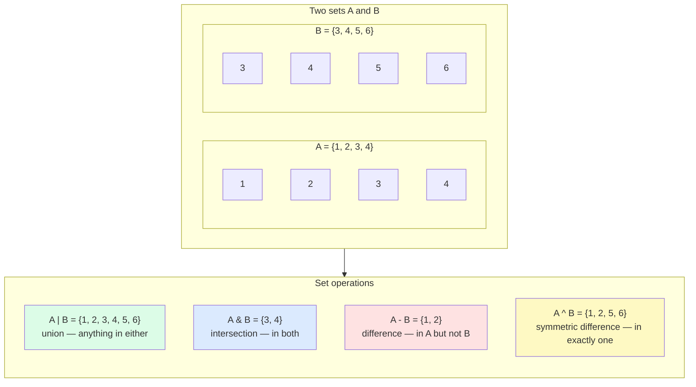

# 4. Sets and Frozen Sets

> [!note] Why this note exists
> If you've ever written `if x in some_list` inside a hot loop, you've felt the O(n) tax. Sets turn that into O(1). Sets are also the only built-in way to express **uniqueness** as a data property, and they carry a small algebra of operations — union, intersection, difference, symmetric difference — that maps directly onto real problems (deduplicate, find common items, find what's missing). This note covers set semantics, the set-algebra operators, the immutability distinction between `set` and `frozenset`, the hashing requirement, and the performance profile that makes sets indispensable.

## Why It Matters

Consider a server that processes 100,000 requests per second and needs to check if each request's IP is on a blocklist of 50,000 entries:

```python
blocklist_list = [...]   # list of 50k IPs
blocklist_set = set(blocklist_list)   # set of 50k IPs

# Per-request check
if ip in blocklist_list:    # O(50,000) comparisons
    ...
if ip in blocklist_set:     # O(1) hash lookup
    ...
```

The list version does up to 50,000 string comparisons per request — at 100k req/s that's 5 billion comparisons per second. The set version does one hash and one equality check per request. The difference between these two implementations is the difference between a server that maxes out one CPU doing nothing useful and a server that idles.

Sets are also the cleanest way to express "the unique elements of this collection" and "what's in A but not B". Once you internalize the set-algebra operators, you start seeing problems where they apply everywhere — and you stop writing nested loops that reinvent `intersection` from scratch.

## Background

### What a set is

A Python `set` is an **unordered collection of unique, hashable elements**. Three properties matter:

1. **Unordered** — sets have no defined iteration order (though CPython 3.7+ preserves insertion order as an implementation detail; do not rely on it).
2. **Unique** — adding an element that's already present is a no-op; `len(set)` counts distinct elements.
3. **Hashable elements only** — every element must implement `__hash__` and `__eq__`. `int`, `float`, `str`, `tuple` (if its elements are hashable), `frozenset`, and user-defined classes with default object identity work. `list`, `dict`, `set` are unhashable.

Internally, a set is a **hash table** of keys (with no associated values). This is why membership testing is O(1) — same mechanism as `dict`.

### `set` vs `frozenset`

- `set` is **mutable** — you can add and remove elements. Not hashable, so can't be nested in another set or used as a dict key.
- `frozenset` is **immutable** — once created, it can't be changed. Hashable, so it can be a set element or a dict key.

```python
s = {1, 2, 3}
fs = frozenset({1, 2, 3})

s.add(4)            # OK
# fs.add(4)         # AttributeError

{fs}                # OK — frozenset is hashable
# {s}               # TypeError — set is unhashable

d = {fs: "metadata"}   # OK as dict key
```

This mirrors the `list`/`tuple` relationship: a mutable and an immutable variant of the same data structure.

### Hashing — the requirement that enables O(1)

For an object to be hashable, it must implement `__hash__` returning an integer that is **stable across the object's lifetime**. If two objects compare equal (`a == b`), their hashes must be equal (`hash(a) == hash(b)`). The reverse is not required: two objects with the same hash need not be equal (this is a hash collision; the hash table handles it by falling back to `==`).

This is why mutable containers are unhashable: if you could hash a list, then mutate it, the hash would no longer match — the hash table would be corrupted. Python forbids this by making `list.__hash__ = None`.

## Main Content

### Creating sets

```python
# Literal (must be non-empty)
s = {1, 2, 3}

# From an iterable (also the empty-set form)
s = set()              # empty set — {} would be a dict!
s = set([1, 2, 2, 3])  # {1, 2, 3} — dedupes
s = set("hello")       # {'h', 'e', 'l', 'o'} — chars of string
s = {x*x for x in range(5)}   # set comprehension

# Frozenset
fs = frozenset([1, 2, 3])
fs = frozenset({1, 2, 3})
```

> [!warning] Empty set gotcha
> `{}` is an empty **dict**, not an empty set. Always use `set()` for the empty set.

### Set methods

```python
s = {1, 2, 3}

# --- Mutators (set only, not frozenset) ---
s.add(4)               # add element
s.discard(10)          # remove if present, no error if missing
s.remove(1)            # remove; KeyError if missing
s.pop()                # remove and return an arbitrary element
s.update({4, 5, 6})    # in-place union (like |= but accepts iterables)
s.intersection_update({2, 3, 4})   # in-place intersection
s.difference_update({4, 5})        # in-place difference
s.symmetric_difference_update({3, 7})  # in-place symmetric diff
s.clear()              # empty the set

# --- Information / non-mutating ---
s.union(other)                  # new set with elements from both
s.intersection(other)           # new set with elements in both
s.difference(other)             # new set with elements in s but not other
s.symmetric_difference(other)   # new set with elements in exactly one
s.issubset(other)               # s <= other
s.issuperset(other)             # s >= other
s.isdisjoint(other)             # True if no common elements
```

### Operators vs. methods

The set-algebra operators (`|`, `&`, `-`, `^`) are concise and read well, but they require both operands to be sets. The method forms accept any iterable:

```python
a = {1, 2, 3}
b = {2, 3, 4}
some_list = [3, 4, 5]

a | b                 # {1, 2, 3, 4}  — operator
a.union(b)            # same
a.union(some_list)    # {1, 2, 3, 4, 5}  — accepts iterable
# a | some_list       # TypeError — | requires sets
```

| Operation | Operator | Method form |
|-----------|----------|-------------|
| Union | `a \| b` | `a.union(b, ...)` |
| Intersection | `a & b` | `a.intersection(b, ...)` |
| Difference | `a - b` | `a.difference(b, ...)` |
| Symmetric difference | `a ^ b` | `a.symmetric_difference(b)` |
| Subset | `a <= b` | `a.issubset(b)` |
| Proper subset | `a < b` | — |
| Superset | `a >= b` | `a.issuperset(b)` |
| Proper superset | `a > b` | — |
| Disjoint | — | `a.isdisjoint(b)` |

### Set comprehensions

```python
squares = {x*x for x in range(10)}
even_squares = {x*x for x in range(10) if x % 2 == 0}

# Uniqueness is automatic
words = "the cat sat on the mat".split()
lengths = {len(w) for w in words}    # {3, 2, 5, 3, 3} -> {2, 3, 5}
```

### Set operations visualization



### Performance

| Operation | Time | Notes |
|-----------|------|-------|
| `len(s)` | O(1) | stored size |
| `x in s` | O(1) avg | hash + eq; O(n) worst case |
| `s.add(x)` | O(1) avg | may trigger resize |
| `s.discard(x)` | O(1) avg | |
| `s.remove(x)` | O(1) avg | raises if missing |
| `s.pop()` | O(1) avg | arbitrary element |
| `s.union(t)` | O(len(s) + len(t)) | new set |
| `s.intersection(t)` | O(min(len(s), len(t))) | iterates smaller |
| `s.difference(t)` | O(len(s)) | iterates s, check membership in t |
| `s.symmetric_difference(t)` | O(len(s) + len(t)) | |
| `s.issubset(t)` | O(len(s)) | each element of s checked in t |
| `s.isdisjoint(t)` | O(min(len(s), len(t))) | short-circuits on first common |

Notes:
- For intersection, CPython iterates the **smaller** set and looks up in the larger — so intersection is `O(min(|A|, |B|))`, not `O(|A| × |B|)`.
- For difference, CPython iterates `s` and checks each element's absence from `t` — `O(|s|)` average.
- All operations can degrade to O(n) in pathological hash-collision cases, but Python's hash randomization (PEP 456) makes this practically impossible accidentally.

### Hashing requirement in depth

To put an object in a set:
1. The object must have `__hash__` returning an int (not `None`).
2. The object must have `__eq__` defining equality.
3. If `a == b`, then `hash(a) == hash(b)` must hold for the lifetime of both.

User-defined classes satisfy this by default: `__hash__` is `id()`-based and `__eq__` is identity. So instances of any class are hashable unless you override `__eq__` without overriding `__hash__` (which sets `__hash__ = None`, making instances unhashable — a common pitfall).

```python
class Point:
    def __init__(self, x, y):
        self.x = x
        self.y = y
    def __eq__(self, other):
        return self.x == other.x and self.y == other.y
    # If you forget __hash__, instances become unhashable!
    def __hash__(self):
        return hash((self.x, self.y))

p = Point(1, 2)
s = {p}       # works because we defined __hash__
```

### `frozenset` — the immutable, hashable set

```python
# Frozenset of permissions — can be a dict key or set member
ADMIN_PERMS = frozenset({"read", "write", "delete"})
USER_PERMS = frozenset({"read"})

roles = {
    "admin": ADMIN_PERMS,
    "user": USER_PERMS,
}

# Frozenset as a set member — sets of frozensets
edges = {frozenset({1, 2}), frozenset({2, 3}), frozenset({1, 3})}
# This represents an undirected graph; frozenset makes {1,2} == {2,1}.
```

Frozenset is the right choice when:
- You need a set that won't change after creation (defensive copy, configuration data).
- You need to use the set as a dict key or as an element of another set.
- You're modeling something where two sets with the same elements are "the same" (like the graph edge example above).

## Code Examples

### Example 1: Deduplication

```python
data = [1, 2, 2, 3, 3, 3, 4]
unique = list(set(data))                  # order not guaranteed (CPython 3.7+ keeps insertion order)
unique_ordered = list(dict.fromkeys(data))  # order preserved explicitly
```

### Example 2: Common and unique elements

```python
yesterday_users = {"alice", "bob", "carol"}
today_users = {"bob", "carol", "dave"}

returning = yesterday_users & today_users       # {"bob", "carol"}
new_today = today_users - yesterday_users       # {"dave"}
churned = yesterday_users - today_users         # {"alice"}
either = yesterday_users | today_users          # all four
either_but_not_both = yesterday_users ^ today_users  # {"alice", "dave"}
```

Compare to the list version, which would be:

```python
returning = [u for u in yesterday_users if u in today_users]   # O(n*m)
```

The set version is O(n + m) — orders of magnitude faster on large data.

### Example 3: Filtering against a blocklist

```python
ALLOWED_METHODS = frozenset({"GET", "POST", "PUT", "DELETE", "PATCH", "HEAD", "OPTIONS"})

def handle_request(method: str, path: str):
    if method.upper() not in ALLOWED_METHODS:
        return 405, "Method Not Allowed"
    # ... dispatch ...
```

`frozenset` because the allowed set is a compile-time constant; we never want it mutated.

### Example 4: Graph adjacency as a set of frozensets

```python
# Undirected graph — each edge is a frozenset so {1,2} == {2,1}
edges = {frozenset({1, 2}), frozenset({2, 3}), frozenset({1, 3})}

def is_adjacent(a, b):
    return frozenset({a, b}) in edges

def neighbors(node):
    result = set()
    for edge in edges:
        if node in edge:
            other = (edge - {node}).pop()
            result.add(other)
    return result
```

### Example 5: Set comprehensions for filtering

```python
# Unique words longer than 4 chars
text = "the quick brown fox jumps over the lazy dog"
long_words = {w for w in text.split() if len(w) > 4}
# {'brown', 'jumps', 'quick', 'over'}
```

### Example 6: `isdisjoint` for fast "no overlap" check

```python
sensitive_keys = frozenset({"password", "ssn", "credit_card"})

def is_safe_to_log(payload: dict) -> bool:
    return sensitive_keys.isdisjoint(payload.keys())

# Short-circuits on first common key — doesn't scan the whole payload.
```

## Advanced Patterns and Performance

### Set operations as algorithmic primitives

The set-algebra operators map directly onto everyday algorithmic problems. Internalising these patterns eliminates reams of loop code:

| Problem | Set operation | Code |
|---------|--------------|------|
| Items in both A and B | Intersection | `A & B` |
| Items in A or B (or both) | Union | `A \| B` |
| Items in A but not B | Difference | `A - B` |
| Items in exactly one of A, B | Symmetric difference | `A ^ B` |
| Is A a subset of B? | Subset test | `A <= B` |
| Is A a strict subset of B? | Proper subset | `A < B` |
| Is A disjoint from B? | Disjoint test | `A.isdisjoint(B)` |
| Remove A's items from B in place | In-place difference | `B -= A` |
| Update A to include B's items | In-place union | `A |= B` |

These are all O(min(|A|, |B|)) on average — they iterate the smaller set and probe the larger. A naive nested loop would be O(|A| × |B|).

### Hashing: the contract

An object is hashable iff:

1. It has a `__hash__()` method that returns the same integer for the object's lifetime.
2. It has an `__eq__()` method that is consistent: if `a == b`, then `hash(a) == hash(b)`.
3. (Recommended) It is **immutable** — so the hash cannot be invalidated by mutation.

Built-in hashables: `int`, `float`, `str`, `bytes`, `tuple` (if elements hashable), `frozenset`, `None`, `bool`. Non-hashables: `list`, `dict`, `set`, `bytearray`, and any user class with default `__eq__` but no `__hash__` override.

> [!warning] Defining `__eq__` without `__hash__` silently unhashes your class
> Python sets `__hash__ = None` automatically when you define `__eq__`. Instances become unhashable and can't be put in sets or used as dict keys. Define both, or use `@dataclass(frozen=True)` which generates them consistently.

### `frozenset` — when you need a hashable set

`frozenset` is an **immutable, hashable** set. Use cases:

- As a dict key for "set of things" lookups (e.g., memoisation caches keyed by argument sets).
- As an element of another set (sets of sets — only possible via `frozenset`).
- As a default argument (avoids the mutable-default bug because it can't be mutated).
- For "constants" — a frozenset of valid choices can be a module-level constant without risk of mutation.

```python
VALID_ROLES = frozenset({"admin", "editor", "viewer"})

def authorize(user, role):
    if role not in VALID_ROLES:        # O(1) check
        raise ValueError(f"Unknown role: {role}")
    ...

# As a dict key (memoisation)
memo = {frozenset(kwargs.items()): compute(**kwargs) for kwargs in batch}
```

### Set comprehensions and performance

Set comprehensions (`{expr for x in iter if pred}`) build a set in one pass, with the same over-allocation amortisation as list comprehensions. They are typically 2-3× faster than `set(); for x in iter: s.add(x)` because the loop runs in C and there are no `add` attribute lookups.

```python
# Fast
unique_lengths = {len(s) for s in strings}

# Slower (function call per add)
unique_lengths = set()
for s in strings:
    unique_lengths.add(len(s))
```

### When sets are the wrong tool

Sets are O(1) for membership but they:

1. **Don't preserve order** (well, insertion order is preserved in CPython 3.7+ as an implementation detail, but you shouldn't rely on it for ordering logic — use a dict).
2. **Don't allow duplicates** — by design.
3. **Can't index by position** — `s[0]` is a `TypeError`.
4. **Require hashable elements** — can't put a list or dict in a set.
5. **Have higher memory overhead per element** than a list (typically ~72 bytes per element vs ~8 bytes for a list slot, due to the hash table structure).

If you need ordered unique elements with O(1) membership, use `dict.fromkeys(iterable)` and iterate the keys — you get insertion order, uniqueness, and O(1) lookup in one structure.

### Performance: `set` vs `list` for membership

| Operation | `list` | `set` |
|-----------|--------|-------|
| `x in container` | O(n) | O(1) avg |
| Build from n elements | O(n) | O(n) avg |
| Memory for n small ints | ~36n bytes | ~72n bytes |
| Iteration order | Insertion order | Insertion order (CPython 3.7+) |
| Indexed access `container[i]` | O(1) | Not supported |

For 1M elements, `x in lst` takes ~10ms; `x in s` takes ~50ns. That's a **200,000× speedup** — the single largest constant-factor win in the standard library.

## Common Pitfalls

> [!danger] `{}` is a dict, not a set
> ```python
> s = {}        # dict!
> s = set()     # empty set — correct
> ```

> [!danger] Modifying a set while iterating
> ```python
> s = {1, 2, 3, 4, 5}
> for x in s:
>     if x % 2 == 0:
>         s.remove(x)     # RuntimeError: Set changed size during iteration
> ```
> Collect first: `to_remove = {x for x in s if x % 2 == 0}; s -= to_remove`. Or use set comprehension: `s = {x for x in s if x % 2 != 0}`.

> [!danger] `set.pop()` returns an **arbitrary** element
> Don't use it as if it were a queue. The "arbitrary" element in CPython happens to be the first one in iteration order, but that's an implementation detail — and changes between Python versions and across hash randomization seeds.

> [!danger] Floating-point sets behave surprisingly
> ```python
> {0.1 + 0.2, 0.3}    # {0.1+0.2, 0.3} — wait, is it {0.30000000000000004, 0.3} or {0.3}?
> ```
> Actually `{0.1+0.2, 0.3}` is `{0.30000000000000004, 0.3}` — two elements, because they're not bit-equal. Be careful with floats in sets; consider rounding.

> [!danger] `nan` in sets
> ```python
> s = {float('nan'), float('nan')}
> len(s)    # 2 — nan != nan, so two distinct entries
> ```
> `float('nan')` is the only float where `x != x`. Sets and dicts treat each instance as distinct.

> [!danger] Overriding `__eq__` without `__hash__`
> ```python
> class Point:
>     def __init__(self, x, y): self.x, self.y = x, y
>     def __eq__(self, o): return self.x == o.x and self.y == o.y
>     # forgot __hash__!
>
> s = {Point(1, 2)}     # TypeError: unhashable type: 'Point'
> ```
> Python sets `__hash__ = None` automatically when you define `__eq__`. Always define both together. Use `dataclasses.dataclass(frozen=True)` to get correct hashing for free.

> [!danger] Set operations don't short-circuit on type errors
> `{1, 2, 3} & [2, 3, 4]` raises `TypeError`. You meant `{1, 2, 3} & set([2, 3, 4])` or `{1, 2, 3}.intersection([2, 3, 4])`.

> [!danger] Order is not part of the set contract
> Even though CPython 3.7+ preserves insertion order in `set`, this is an implementation detail. Don't rely on it for cross-implementation code (PyPy, Jython, future Python versions).

## Tips and Tricks

- **Always convert lists used for membership testing to sets** if you test more than once. `seen = set(items)` once, then `x in seen` is O(1).
- **`isdisjoint` is the cheapest "any overlap?" check** because it short-circuits on the first common element.
- **For union of many sets, use `set.union(*many)`** — more efficient than `functools.reduce(operator.or_, many)`.
- **Frozenset for module-level constants.** It signals "do not mutate" and gives you a tiny performance edge (no mutation checks).
- **Sets dedupe iterables in one call**: `list(set(items))` — but use `dict.fromkeys` if you need to preserve order.
- **For "all unique" check**, compare lengths: `len(items) == len(set(items))`.
- **`collections.Counter` is a dict subclass** — useful when you need counts, not just membership.
- **Don't store mutable elements in a set** — even if you could make them hashable, mutating them after insertion silently breaks the hash table. Use immutable equivalents (`tuple` for `list`, `frozenset` for `set`).
- **Hash randomization**: since Python 3.3, `str`, `bytes`, and `datetime` hashes are salted per-process. Iteration order across runs may differ — your tests should not depend on it.
- **Bench before assuming O(1)**: for very small sets (< 10 elements), a list can actually be faster because of cache effects and the lack of hashing overhead. Profile if it matters.

## Active Recall

1. What three properties define a Python set?
2. Why can't you put a list in a set? What's the workaround?
3. What's the difference between `set` and `frozenset`? When would you use each?
4. Why is `{}` not an empty set?
5. Write a one-liner to compute the intersection of three lists.
6. Why does `{0.1+0.2, 0.3}` have two elements?
7. What's the time complexity of `s.intersection(t)` in terms of `|s|` and `|t|`?
8. What happens if you override `__eq__` on a class without overriding `__hash__`?
9. Compare `a | b` to `a.union(b)`. When must you use the method form?
10. What does `set.pop()` return, and why shouldn't you rely on it?
11. How would you represent an undirected graph using sets?
12. Why does `isdisjoint` short-circuit, and why does that matter for performance?
13. True or false: sets preserve insertion order. Defend your answer.
14. Give an example where `frozenset` is the right choice over `set`.

## Next Steps

- [[5. Dictionaries Deep Dive]] — sets and dicts share the hash-table internals; this note explains the underlying mechanism in depth.
- [[1. Lists Deep Dive]] — the mutable-vs-immutable distinction in sets (`set`/`frozenset`) mirrors that of lists and tuples.
- [[3. Tuples and Named Tuples]] — tuples (especially of hashable elements) are the canonical "composite hashable key".
- [[7. collections Module]] — `Counter` is a dict subclass that adds set-like counts.
- [[2. List Operations and Complexity]] — direct comparison: where lists lose to sets on membership tests.
