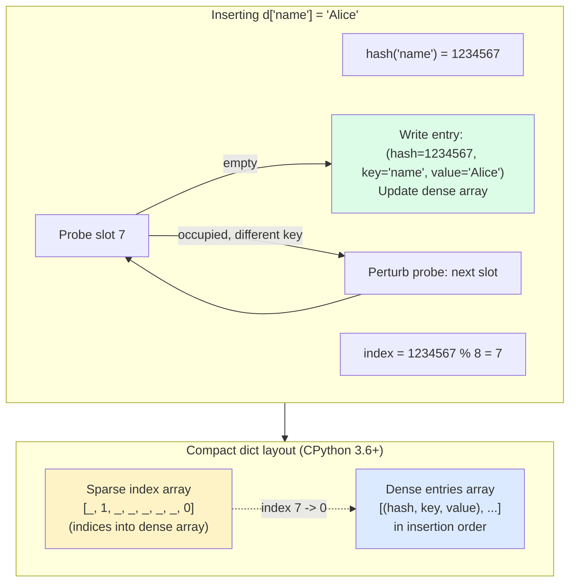

# 5. Dictionaries Deep Dive

> [!note] Why this note exists
> The Python `dict` is the most important data structure in the language — it's not just a hash map you use explicitly, it's the mechanism behind namespaces, instance attributes, keyword arguments, and module globals. This note covers dict internals (open-addressing hash tables, insertion-order preservation since 3.7), the full API surface (`get`, `setdefault`, `pop`, `update`, `items`, the new `|` operator), dict comprehensions, the hashing contract, and the performance profile that makes dicts the workhorse of Python data modeling.

## Why It Matters

Consider a configuration system that needs to look up 10,000 keys per second:

```python
config_list = [("host", "localhost"), ("port", 8080), ("debug", True), ...]   # 10k entries

# Each lookup: linear scan
def get(key):
    for k, v in config_list:
        if k == key:
            return v
    raise KeyError(key)

# Versus dict
config_dict = dict(config_list)
config_dict["host"]    # one hash + one equality check
```

The list version does up to 10,000 comparisons per lookup. The dict version does one hash plus one comparison. At 10k lookups/sec, that's 100M comparisons/sec vs 20k. The list version saturates a CPU; the dict version idles.

But dicts are more than fast lookup. They're also the natural way to model **records with named fields** when you need dynamic keys (a `User` class has fixed fields; a JSON document has whatever fields the data has). And the modern syntax — comprehensions, the `|` union operator, `setdefault`, `defaultdict` — has turned what used to be a clumsy pattern into a one-liner. Knowing the full API surface is what separates "I can use a dict" from "I can model data with a dict".

## Background

### Dicts are hash tables

A Python dict is an **open-addressing hash table** with these properties:

- Each entry is a `(hash, key, value)` triple stored in a sparse array.
- Lookup computes `hash(key)`, then probes the array starting at `hash % table_size`.
- Collisions are resolved by **open addressing with pseudo-random probing** (CPython uses a perturbed Fibonacci-like sequence, not linear probing — this avoids clustering).
- The table is resized when it's ~2/3 full. Resize doubles the capacity.
- Since Python 3.6, CPython uses a **compact dict** layout: a sparse array of indices points into a dense array of entries. This saves 20-25% memory and preserves **insertion order** as a free side effect.
- Since Python 3.7, **insertion order preservation is a language guarantee** (not just CPython's behavior).

### The hashing contract

A dict key must satisfy:
1. **Hashable**: implements `__hash__` returning a stable integer.
2. **Comparable**: implements `__eq__`.
3. **Consistency**: if `a == b` then `hash(a) == hash(b)` for the lifetimes of `a` and `b`.

The reverse is not required: objects with the same hash need not be equal (collisions are handled by `__eq__`). But many collisions degrade performance to O(n) — so a good hash distributes keys uniformly.

This is the same contract as set elements — see [[4. Sets and Frozen Sets]].

### Why insertion order matters

Before 3.6, dict iteration order was "arbitrary" — it depended on hash values, which (since 3.3) are randomized per process. So `list(d.keys())` could differ between runs. This made testing harder and led people to use `collections.OrderedDict` when order mattered.

Since 3.7, regular `dict` preserves insertion order. This means:
- `list(d)` is in insertion order.
- `json.dumps(d)` produces keys in insertion order (important for diff stability).
- `OrderedDict` is mostly redundant for new code — use it only when you need its extra features (`move_to_end`, equality that depends on order).

### Dict vs other "lookup" structures

| Need | Use |
|------|-----|
| Key → value lookup | `dict` |
| Counted items | `collections.Counter` |
| Lookup with default factory | `collections.defaultdict` |
| Ordered with `move_to_end` (LRU cache) | `collections.OrderedDict` |
| Multiple maps chained (defaults) | `collections.ChainMap` |
| Immutable dict | `types.MappingProxyType` |
| Typed dict (structural) | `typing.TypedDict` (3.8+) |

## Main Content

### The dict API

```python
d = {"a": 1, "b": 2, "c": 3}

# --- Access ---
d["a"]                  # 1 — raises KeyError if missing
d.get("a")              # 1 — returns None if missing
d.get("z", 0)           # 0 — returns default if missing
d["z"]                  # KeyError

# --- Insertion / update ---
d["d"] = 4              # add or overwrite
d.update({"e": 5, "f": 6})     # in-place update from another mapping
d.update(g=7, h=8)             # or from kwargs
d |= {"i": 9}                  # in-place update (Python 3.9+)
new = d | {"j": 10}            # new dict (Python 3.9+)

# --- Removal ---
del d["a"]              # removes; KeyError if missing
d.pop("b")              # removes and returns value
d.pop("b", None)        # safe pop with default
d.popitem()             # removes and returns last (key, value) — LIFO since 3.7
d.clear()               # empty the dict

# --- Iteration ---
d.keys()                # view of keys
d.values()              # view of values
d.items()               # view of (key, value) pairs
for k in d: ...         # equivalent to d.keys()
for k, v in d.items(): ...

# --- Safe access patterns ---
d.setdefault("z", []).append(1)   # if missing, insert [] first
val = d.get(key, default)
```

### `get` vs `setdefault` vs `defaultdict`

These three are the different ways to handle "missing key":

```python
# get — read with default, do NOT add the key
v = d.get("z", 0)

# setdefault — read with default, AND insert the default if missing
v = d.setdefault("z", [])

# defaultdict — auto-create missing keys via factory
from collections import defaultdict
dd = defaultdict(list)
dd["z"].append(1)      # creates dd["z"] = [] then appends
```

When to use which:
- `get` when you just want a fallback and don't want to mutate the dict.
- `setdefault` when you want to mutate, but only sometimes — and you don't want a whole `defaultdict`.
- `defaultdict` when you're going to repeatedly miss keys and always want the same factory result.

> [!warning] `setdefault` evaluates its default eagerly
> `d.setdefault("k", expensive_factory())` always calls `expensive_factory()`, even if `"k"` exists. Use `defaultdict` or `if "k" not in d: d["k"] = expensive_factory()` to avoid the wasted call.

### Dict union with `|` (Python 3.9+)

```python
defaults = {"host": "localhost", "port": 8080, "debug": False}
overrides = {"port": 9000, "verbose": True}

merged = defaults | overrides     # new dict; overrides win on conflict
# {"host": "localhost", "port": 9000, "debug": False, "verbose": True}

defaults |= overrides             # in-place
```

This is much cleaner than the older `{**defaults, **overrides}` syntax, though both work.

### Dict comprehensions

```python
# Filter
small = {k: v for k, v in d.items() if v < 10}

# Transform keys
upper = {k.upper(): v for k, v in d.items()}

# Transform values
str_vals = {k: str(v) for k, v in d.items()}

# Invert (assuming unique values)
inverted = {v: k for k, v in d.items()}

# From two lists
keys = ["a", "b", "c"]
vals = [1, 2, 3]
d = {k: v for k, v in zip(keys, vals)}
# or: dict(zip(keys, vals))
```

### Iteration views are live

`d.keys()`, `d.values()`, and `d.items()` return **view objects**, not lists. A view is a live window on the dict — it reflects changes:

```python
d = {"a": 1, "b": 2}
keys = d.keys()
d["c"] = 3
list(keys)    # ['a', 'b', 'c'] — view sees the new key
```

Views also support set-like operations on keys and items:

```python
d1 = {"a": 1, "b": 2}
d2 = {"b": 3, "c": 4}
d1.keys() & d2.keys()    # {'b'} — intersection
d1.keys() | d2.keys()    # {'a', 'b', 'c'} — union
d1.items() & d2.items()  # set of common (k, v) pairs
```

### Hash table internals



The compact layout: the sparse index array tells you which slot in the dense entries array holds the entry for a given hash bucket. The dense array is in insertion order, which is why iteration is ordered "for free".

### Performance

| Operation | Time | Notes |
|-----------|------|-------|
| `d[k]` (get) | O(1) avg | hash + eq |
| `d[k] = v` (set) | O(1) avg | may trigger resize |
| `del d[k]` | O(1) avg | |
| `d.get(k, default)` | O(1) avg | |
| `k in d` | O(1) avg | uses hash |
| `d.update(other)` | O(len(other)) | |
| `d.pop(k)` | O(1) avg | |
| `d.popitem()` | O(1) | last inserted (LIFO) |
| `d.keys() / values() / items()` | O(1) | returns view |
| `list(d)` | O(n) | materialize |
| Iteration | O(n) | in insertion order |
| `d1 \| d2` (union) | O(len(d1) + len(d2)) | new dict |

Worst case for any single operation is O(n) — pathological hash collisions. With Python's hash randomization, this is essentially never seen in practice.

### Hashable keys — what works

| Type | Hashable? | Notes |
|------|-----------|-------|
| `int`, `float`, `bool` | Yes | `True == 1`, so `{True: 'x', 1: 'y'}` has one entry |
| `str`, `bytes` | Yes | hash randomized per process |
| `tuple` | If elements hashable | `(1, 2)` yes; `([1],)` no |
| `frozenset` | Yes | |
| `None` | Yes | |
| `list`, `dict`, `set` | **No** | mutable, unhashable |
| User class (default) | Yes | by identity (`id()`) |
| User class with `__eq__` only | **No** | must also define `__hash__` |
| `dataclass(frozen=True)` | Yes | auto-generated `__hash__` |

> [!warning] `True == 1` and `1.0 == 1`
> ```python
> d = {1: "int", 1.0: "float", True: "bool"}
> len(d)    # 1 — all three keys are equal!
> d[1]      # 'bool' — last write wins
> ```
> `True`, `1`, and `1.0` compare equal and hash equal, so they're treated as the same key. This is rarely intentional.

### Specialized dict subclasses

```python
from collections import defaultdict, OrderedDict, Counter, ChainMap
from types import MappingProxyType

# defaultdict — auto-creates missing keys
counts = defaultdict(int)
for word in words:
    counts[word] += 1

# OrderedDict — needed only for move_to_end or order-sensitive equality
lru = OrderedDict()
lru["a"] = 1
lru.move_to_end("a")    # mark as recently used

# Counter — counting with convenient helpers
c = Counter("abracadabra")
c.most_common(3)        # [('a', 5), ('b', 2), ('r', 2)]

# ChainMap — layered lookups (e.g., defaults + overrides)
defaults = {"host": "localhost", "port": 8080}
env = {"port": 9000}
config = ChainMap(env, defaults)   # lookups check env first
config["host"]          # 'localhost' (from defaults)
config["port"]          # 9000 (from env)

# MappingProxyType — read-only view of a dict
config = MappingProxyType({...})   # callers can read but not mutate
```

See [[7. collections Module]] for full coverage.

## Code Examples

### Example 1: Grouping with `defaultdict`

```python
from collections import defaultdict

records = [
    ("alice", "view"),
    ("bob", "click"),
    ("alice", "click"),
    ("carol", "view"),
    ("bob", "view"),
]

by_user = defaultdict(list)
for user, action in records:
    by_user[user].append(action)

# {'alice': ['view', 'click'], 'bob': ['click', 'view'], 'carol': ['view']}
```

### Example 2: Counting

```python
from collections import Counter

words = "the cat sat on the mat the cat".split()
c = Counter(words)
c.most_common(2)        # [('the', 3), ('cat', 2)]
c["the"]                # 3
c.update("the dog ran".split())
c.most_common(3)
```

### Example 3: Inverting a dict

```python
d = {"a": 1, "b": 2, "c": 1}
inverted = {}
for k, v in d.items():
    inverted.setdefault(v, []).append(k)
# {1: ['a', 'c'], 2: ['b']}

# Or with defaultdict:
from collections import defaultdict
inverted = defaultdict(list)
for k, v in d.items():
    inverted[v].append(k)
```

### Example 4: Config merging

```python
# Old way (still works)
config = {**defaults, **env, **cli_overrides}

# Python 3.9+
config = defaults | env | cli_overrides
```

### Example 5: LRU cache with `OrderedDict`

```python
from collections import OrderedDict
from time import time

class LRUCache:
    def __init__(self, capacity: int):
        self.cap = capacity
        self.store = OrderedDict()

    def get(self, key):
        if key not in self.store:
            return None
        self.store.move_to_end(key)    # mark as recently used
        return self.store[key]

    def put(self, key, value):
        if key in self.store:
            self.store.move_to_end(key)
        self.store[key] = value
        if len(self.store) > self.cap:
            self.store.popitem(last=False)    # evict oldest
```

### Example 6: `dict.fromkeys` for default dicts

```python
keys = ["a", "b", "c"]
d = dict.fromkeys(keys, 0)    # {'a': 0, 'b': 0, 'c': 0}
# Each value is the SAME object 0 — fine for ints (immutable), dangerous for lists
d2 = dict.fromkeys(keys, [])  # all three keys share the same list!
d2["a"].append(1)             # {'a': [1], 'b': [1], 'c': [1]} — aliasing bug
```

## Advanced Patterns and Performance

### Open addressing in CPython's dict

Python uses **open addressing with perturbed probing** — no separate bucket chains, just a single array of (hash, key, value) entries. When a collision occurs, the probe sequence (a function of the hash and the previous index) walks through the table looking for an empty slot. This is cache-friendly (no pointer chasing) and avoids the memory overhead of linked-list buckets.

The key consequence for users: **load factor matters**. CPython resizes when the table is ~2/3 full. This keeps the average probe length around 1-2 even in the worst case. You cannot tune the load factor from Python, but you can avoid pathological patterns:

- Don't pre-fill a dict with thousands of entries that all hash to the same bucket (impossible with built-in types due to hash randomisation, but possible with custom `__hash__`).
- Don't mix hashable and unhashable keys in the same dict (you can't — `TypeError`).
- Don't mutate a key's hash-relevant state after insertion (custom classes with mutable `__hash__`-affecting state are a footgun).

### Insertion order preservation (Python 3.7+, 3.6 CPython impl detail)

Before Python 3.6, dicts were unordered. Since 3.7 (3.6 in CPython), insertion order is preserved as a language guarantee. The implementation uses two arrays: a sparse **index array** (hash → position) and a dense **entries array** (key, value, hash in insertion order). Iteration walks the dense array — O(n) in insertion order, with no overhead.

Practical implications:

- `dict` replaces `OrderedDict` for nearly all use cases (OrderedDict still has `move_to_end`, `popitem(last=)`, and equality that's order-sensitive — useful for LRU caches).
- `json.dumps(d)` outputs keys in insertion order, not sorted. Use `json.dumps(d, sort_keys=True)` for canonical output.
- Iterating `d.items()` is fastest when you've just built the dict — locality is excellent.

### `dict.get`, `setdefault`, `defaultdict`, `dict|` — picking the right idiom

Four ways to handle "missing key with a default":

```python
# 1. dict.get — read-only with default, doesn't insert
v = d.get(k, default_value)

# 2. dict.setdefault — insert if missing, return value
v = d.setdefault(k, [])          # if k missing, d[k] = [] and return it
v.append(item)

# 3. collections.defaultdict — auto-construct on missing access
from collections import defaultdict
d = defaultdict(list)
d[k].append(item)                # if k missing, d[k] = list() then append

# 4. dict | (Python 3.9+) — merge with default
merged = base_defaults | user_overrides
```

Rule of thumb:

- **`get`** for one-off lookups where missing means "use this fallback".
- **`setdefault`** for "ensure key exists, then mutate".
- **`defaultdict`** when you're repeatedly mutating missing keys in a loop.
- **`|`** for merging two dicts (new in 3.9; before that use `{**a, **b}`).

### Modern dict syntax (Python 3.9+)

```python
# Union operator (PEP 584) — creates a new dict
merged = a | b                   # b's keys override a's

# In-place union (updates a)
a |= b

# Older syntax (still works):
merged = {**a, **b}              # unpacking — works back to 3.5
a.update(b)
```

The `|` operator is cleaner and more discoverable than `{**a, **b}`, but both produce the same result.

### Dict comprehensions and filtering

```python
# Filter to even values
evens = {k: v for k, v in d.items() if v % 2 == 0}

# Invert (lossy if values not unique)
inverted = {v: k for k, v in d.items()}

# Build from parallel lists
d = {k: v for k, v in zip(keys, values)}

# Build from list of pairs
d = dict(pairs)                  # even simpler — dict constructor
```

Dict comprehensions are 30-40% faster than `for` loops with assignment.

### Memory: `dict` vs `list` of tuples

| Container | Per-entry overhead | Lookup |
|-----------|-------------------|--------|
| `dict` | ~100-150 bytes/entry (hash table) | O(1) |
| `list` of `(k, v)` tuples | ~80 bytes/entry | O(n) |
| Two parallel `list`s | ~16 bytes/entry (just pointers) | O(n) |
| `tuple` of `(k, v)` | ~80 bytes/entry | O(n) |

The dict's overhead is large but pays for itself in lookup speed. For tiny maps (≤ 5 keys), a list of tuples can be faster — but the dict wins decisively above ~20 keys.

### `dict.keys()`, `dict.values()`, `dict.items()` — set-like views

These are **live views** of the dict — they reflect mutations in real time, not snapshots:

```python
d = {'a': 1, 'b': 2}
ks = d.keys()                    # dict_keys(['a', 'b'])
d['c'] = 3
list(ks)                         # ['a', 'b', 'c'] — saw the insertion

# keys() and items() views are set-like (keys must be hashable)
{'a', 'b'} & d.keys()            # {'a', 'b'}
d.keys() - {'a'}                 # {'b', 'c'}
```

This is enormously useful for set-algebra on dict keys without materialising a new structure. `values()` is not set-like (values may not be hashable).

## Common Pitfalls

> [!danger] `dict.fromkeys(keys, [])` shares the default
> Use a comprehension or `defaultdict(list)` instead:
> ```python
> d = {k: [] for k in keys}
> ```

> [!danger] Iterating and mutating
> ```python
> for k in d:
>     if k.startswith("_"):
>         del d[k]    # RuntimeError: dictionary changed size during iteration
> ```
> Collect keys first: `for k in list(d): if k.startswith("_"): del d[k]`.

> [!danger] `d.get(k)` returns `None` for missing keys, which is falsy
> ```python
> if not d.get("count"):
>     # runs when count is 0, None, "", [], etc. — not just missing!
> ```
> Use `if "count" not in d:` or `if d.get("count") is None:` for the "missing key" case.

> [!danger] `True`, `1`, and `1.0` are the same key
> ```python
> d = {1: "one"}
> d[True] = "yes"
> d[1]        # 'yes' — overwrote
> ```

> [!danger] Mutable default arguments are shared (dict edition)
> ```python
> def f(x, cache={}):    # BAD
>     cache[x] = expensive(x)
>     return cache[x]
> ```
> Same bug as lists — defaults are evaluated once. Use `cache=None` and create inside.

> [!danger] Hashing a custom class without `__hash__`
> Defining `__eq__` alone makes the class unhashable. Always define both, or use `@dataclass(frozen=True)`.

> [!danger] Iteration order is guaranteed in 3.7+, but not in older versions
> Don't write code that depends on dict order if it might run on Python <3.7. Use `OrderedDict` for those legacy cases.

> [!danger] `popitem()` is LIFO since 3.7, FIFO before
> Don't rely on the order of `popitem()` for code that needs to run on multiple Python versions.

## Tips and Tricks

- **Use `|` for dict merging** (3.9+). It reads better than `{**a, **b}`.
- **`dict.fromkeys(iterable, default)` is faster than a comprehension** for non-mutable defaults.
- **`Counter` is a dict subclass** with extras: `most_common`, `+`, `-`, `&` (min), `|` (max).
- **`ChainMap` for layered config** — no copying, just lookups across multiple maps.
- **`MappingProxyType` for read-only dicts** — better than a frozen dict because it reflects mutations to the underlying dict (use with care).
- **`TypedDict` for structural typing of dicts** — gives you type hints for keys and values without a class.
- **`dataclass(frozen=True)` for hashable records** — better than a custom class with `__hash__` and `__eq__`.
- **Use `in` rather than `KeyError` for "is key present"** — `if k in d:` is clearer than `try: d[k]; except KeyError:`.
- **Iterate `items()` for k,v pairs** — `for k, v in d.items():` is faster than `for k in d: v = d[k]`.
- **`dict` ordering makes `OrderedDict` mostly redundant** — but it's still useful for `move_to_end` (LRU caches) and for dicts where equality should consider order.
- **`dict.pop(k, default)` is your friend** — atomic "get and remove", or just "remove if present".
- **For very large dicts, consider `shelve` or a real database** — dicts are in-memory only.
- **Hash randomization** means your dict iteration order may differ between Python processes (since 3.3). Tests should not depend on specific order.

## Active Recall

1. What does "insertion order preservation" mean for `dict`, and since which Python version is it guaranteed?
2. Why can a `tuple` be a dict key but a `list` cannot?
3. What's the difference between `d.get(k, default)`, `d.setdefault(k, default)`, and `defaultdict(factory)`?
4. Why does `setdefault` evaluate its default eagerly? How do you avoid the cost?
5. Write a one-liner to merge three dicts where the rightmost wins on conflict.
6. What does `d.keys() & other_set` return, and why does this work?
7. Explain the compact-dict layout introduced in CPython 3.6.
8. Why are `True`, `1`, and `1.0` the same dict key?
9. What's the time complexity of `d.update(other)`? Of `d1 | d2`?
10. When would you still use `OrderedDict` instead of a regular `dict`?
11. What happens if you mutate a dict while iterating over `d.items()`?
12. Give an example where `defaultdict(list)` is cleaner than `setdefault`.
13. Why does `dict.fromkeys(keys, [])` cause an aliasing bug?
14. How would you implement a simple LRU cache using `OrderedDict`?

## Next Steps

- [[4. Sets and Frozen Sets]] — sets are "dicts without values"; same hash-table internals.
- [[7. collections Module]] — `defaultdict`, `OrderedDict`, `Counter`, `ChainMap` all extend `dict`.
- [[3. Tuples and Named Tuples]] — tuples are the canonical composite key for dicts.
- [[1. Lists Deep Dive]] — for the `list` vs `dict` "collection vs record" decision.
- [[6. Strings Deep Dive]] — strings are the most common dict key; hashing and equality matter.
- [[6. Files and Serialization/3. CSV and JSON]] — dicts are the natural representation of JSON objects.
