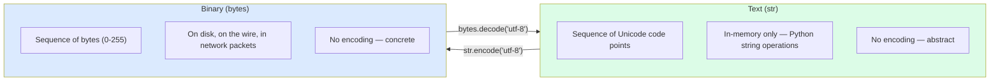

# 6. Strings Deep Dive

> [!note] Why this note exists
> Strings in Python look simple — `"hello"` — but underneath they are a tangle of Unicode, encodings, byte sequences, and historical compromises. Every Python developer eventually hits a `UnicodeDecodeError` and stares at it without understanding. This note covers what a string *actually* is (a sequence of Unicode code points, not bytes), the `str` vs `bytes` distinction, the methods you'll use every day (`split`, `join`, `strip`, `format`, `replace`), f-strings, slicing, the code-point vs grapheme-cluster distinction, and the UTF-8/UTF-16/UTF-32 encoding landscape. After this note, mojibake should hold no terror.

## Why It Matters

Consider this code, which reads a file and counts the words:

```python
with open("data.txt") as f:    # default encoding on Linux is usually UTF-8
    text = f.read()
words = text.split()
print(len(words))
```

On a Windows machine where the default encoding is `cp1252`, opening a UTF-8 file containing the word "café" raises `UnicodeDecodeError` on the `é`. The developer stares at the error, adds `errors="ignore"`, and silently corrupts the data. The fix is one parameter: `open("data.txt", encoding="utf-8")`.

This is the central lesson: **strings are sequences of code points, bytes are sequences of bytes, and the bridge between them is an encoding**. If you don't specify the encoding, Python picks one for you — and on Windows, it picks wrong. Every `open()`, every `subprocess` call, every `requests.get().text`, every network read should specify the encoding explicitly.

The second lesson is more subtle: **a "character" is not a code point**. The string "" (family emoji) is one grapheme cluster but thirteen code points (father, ZWJ, mother, ZWJ, girl, ZWJ, boy). Python's `len()` counts code points, not graphemes. If you're building a UI that truncates text, you'll get this wrong. Knowing the distinction is what separates "I can use strings" from "I can build correct internationalized software".

## Background

### What a string is

A Python `str` is an **immutable sequence of Unicode code points**. A code point is an integer in the range 0 to 0x10FFFF (the Unicode codespace). Each code point is identified by `U+xxxx` (e.g., `U+0041` is `A`, `U+1F600` is ).

Internally, CPython stores strings in one of three representations:
1. **ASCII compact** — 1 byte per code point (Latin-1).
2. **UCS-2 compact** — 2 bytes per code point (BMP only).
3. **UCS-4 compact** — 4 bytes per code point (full Unicode).

CPython picks the narrowest representation that can hold all the code points in the string. This is invisible to the programmer but means memory usage varies dramatically: `"hello"` is 5 bytes, `"héllo"` is 10 bytes (UCS-2), `"héllo"` is 28 bytes (UCS-4 — the whole string uses 4 bytes per char).

### `str` vs `bytes`

| | `str` | `bytes` |
|--|-------|---------|
| What it holds | Unicode code points | Raw bytes (0-255) |
| Literal | `"hello"` | `b"hello"` |
| Encoding | None — abstract | None — concrete |
| Element type | `str` (1 code point) | `int` (0-255) |
| Decode → | — | `bytes.decode(enc)` → `str` |
| Encode → | `str.encode(enc)` → `bytes` | — |

```python
s = "café"               # str — 4 code points
b = s.encode("utf-8")    # bytes — 5 bytes (é is 2 bytes in UTF-8)
s2 = b.decode("utf-8")   # back to str
s == s2                  # True
```

The encode/decode pair is the bridge. You encode when writing to disk/network; you decode when reading. If you mix them up — e.g. `bytes.encode()` doesn't exist; you want `bytes.decode()` — you get a confusing `AttributeError`.

### Encodings

The same string can be encoded in many ways:

```python
s = "café"
s.encode("utf-8")     # b'caf\xc3\xa9'      5 bytes
s.encode("utf-16")    # b'\xff\xfec\x00a\x00f\x00\xe9\x00'    10 bytes (with BOM)
s.encode("latin-1")   # b'caf\xe9'           4 bytes (Latin-1 covers é)
s.encode("ascii")     # UnicodeEncodeError — é not in ASCII
s.encode("ascii", errors="ignore")    # b'caf' — silently drops é
s.encode("ascii", errors="replace")   # b'caf?' — replaces with ?
```

Common encodings:
- **UTF-8**: variable-length, 1-4 bytes per code point. ASCII-compatible. The default for the web, for JSON, for most modern systems.
- **UTF-16**: 2 or 4 bytes per code point. Used by Windows internally and by Java's `String`.
- **UTF-32**: 4 bytes per code point. Wasteful but constant-time indexing by code point.
- **Latin-1 (ISO-8859-1)**: 1 byte, covers Western European languages. Common on legacy systems.
- **ASCII**: 1 byte, 128 characters. The lowest common denominator.
- **cp1252**: Windows Western European. The Windows default for English locales.

> [!tip] Always specify encoding
> `open(path, encoding="utf-8")` — never rely on the platform default. The default differs between Linux (UTF-8) and Windows (cp1252), causing silent corruption or `UnicodeDecodeError`s when files move between systems.

### Code points vs grapheme clusters

```python
s = ""           # family emoji — one visual character
len(s)              # 7 — 7 code points: man, ZWJ, woman, ZWJ, girl, ZWJ, boy
s[0]                # '' — first code point

# What about é? It can be one code point or two:
e_precomposed = "é"          # U+00E9 — one code point
e_decomposed = "e\u0301"     # U+0065 + U+0301 (e + combining acute)
len(e_precomposed)           # 1
len(e_decomposed)            # 2
e_precomposed == e_decomposed  # False! visually identical, different code points
# Normalize to compare:
import unicodedata
unicodedata.normalize("NFC", e_precomposed) == unicodedata.normalize("NFC", e_decomposed)
# True
```

This is why string indexing is dangerous for UI truncation: `s[:10]` may cut in the middle of a grapheme cluster, leaving a stray combining mark. For correct grapheme-aware operations, use the third-party `grapheme` library or Python 3.12+ `re` with `\X`.

## Main Content

### Common string methods

```python
s = "  Hello, World!  "

# --- Stripping whitespace ---
s.strip()            # 'Hello, World!'
s.lstrip()           # 'Hello, World!  '
s.rstrip()           # '  Hello, World!'
"  hello  ".strip()  # also strips \t \n \r etc.

# --- Case ---
s.lower()            # '  hello, world!  '
s.upper()            # '  HELLO, WORLD!  '
s.title()            # '  Hello, World!  '
s.capitalize()       # '  hello, world!  '
s.swapcase()         # '  hELLO, wORLD!  '

# --- Splitting and joining ---
"a,b,c".split(",")              # ['a', 'b', 'c']
"a,b,,c".split(",")             # ['a', 'b', '', 'c']
"a,b,c".split(",", maxsplit=1)  # ['a', 'b,c']
"line1\nline2\nline3".splitlines()  # ['line1', 'line2', 'line3']
",".join(["a", "b", "c"])       # 'a,b,c'
", ".join(["a", "b", "c"])      # 'a, b, c'

# --- Searching ---
s.find("World")          # 10 — index of first occurrence, -1 if not found
s.index("World")         # 10 — same but raises ValueError if not found
s.rfind("l")             # last 'l' position
s.count("l")             # 3 — number of occurrences
"World" in s             # True — membership
s.startswith("  Hello")  # True
s.endswith("!")          # False (because trailing spaces)

# --- Replacing ---
s.replace("World", "Python")    # '  Hello, Python!  '
s.replace("l", "L", 1)          # replace only first occurrence

# --- Partitioning ---
"a=b=c".partition("=")   # ('a', '=', 'b=c') — splits on first occurrence
"a=b=c".rpartition("=")  # ('a=b', '=', 'c') — splits on last

# --- Formatting ---
"name: {}, age: {}".format("Alice", 30)
"name: {name}, age: {age}".format(name="Alice", age=30)
"{0:>10}".format("hi")     # right-justify, width 10
"{:.2f}".format(3.14159)   # '3.14'
"{:08x}".format(255)       # '000000ff' — hex with leading zeros
```

### f-strings (Python 3.6+)

f-strings are the modern, fast, readable way to format strings:

```python
name = "Alice"
age = 30
f"name: {name}, age: {age}"          # 'name: Alice, age: 30'

# Expressions
f"next year: {age + 1}"              # 'next year: 31'
f"upper: {name.upper()}"             # 'upper: ALICE'
f"len: {len(name)}"                  # 'len: 5'

# Format spec after colon
f"{3.14159:.2f}"                     # '3.14'
f"{255:#010b}"                       # '0b11111111'
f"{name:>10}"                        # '     Alice' (right-justify)
f"{name:<10}|"                       # 'Alice     |' (left-justify)
f"{name:^10}"                        # '  Alice   ' (center)

# Debugging (3.8+)
x = 42
f"{x=}"                              # 'x=42' — name and value
f"{x=:.2f}"                          # 'x=42.00'

# Conversion
f"{name!r}"                          # "'Alice'" — repr
f"{name!s}"                          # "Alice"  — str (default)
f"{name!a}"                          # "'Alice'" — ascii
```

f-strings are **faster than `.format()` and `%`** because they're compiled to a single `FORMAT_VALUE` bytecode op instead of a method call.

> [!warning] Don't put user input directly into f-strings as a security reflex
> f-strings don't have the `eval` problem of `str.format` with attribute access (`"{0.__class__}".format(x)`), but they do evaluate the embedded expression — make sure the expression is something you control, not user input that could be a string with `{__import__('os').system('rm -rf /')}`. (Note: this would only be a problem if you re-fed the result through `eval` or another format string.)

### Slicing

Strings support the same `start:stop:step` slicing as lists:

```python
s = "Hello, World"
s[0]            # 'H' — single character (still a str, no char type)
s[-1]           # 'd'
s[0:5]          # 'Hello'
s[:5]           # 'Hello'
s[7:]           # 'World'
s[::2]          # 'HloWrd' — every other char
s[::-1]         # 'dlroW ,olleH' — reversed
s[1:10:2]       # 'el,Wl'
```

Like lists, slicing returns a new string (strings are immutable). Like lists, out-of-range indices are clamped.

### `str` vs `bytes` — when each matters



Rules of thumb:
- **Inside your program**: use `str` everywhere. All string operations (find, replace, split, regex) work on `str`.
- **At the I/O boundary**: encode to `bytes` when writing, decode from `bytes` when reading. Always specify the encoding.
- **For binary data that's not text** (images, audio, structured protocols): use `bytes` and `bytearray` directly, never `str`.

### `bytearray` — mutable `bytes`

```python
ba = bytearray(b"hello")
ba[0] = ord("H")      # mutable!
ba.append(ord("!"))
bytes(ba)              # b'Hello!' — back to immutable bytes
```

`bytearray` is useful for building up binary data incrementally without the O(n²) cost of repeated `b += chunk` on immutable `bytes`.

### Unicode normalization

```python
import unicodedata

# NFC: composed form (single code point for é)
# NFD: decomposed form (e + combining acute)
# NFKC/NFKD: compatibility decomposition (e.g., ligatures split)

s1 = "café"           # NFC
s2 = "cafe\u0301"     # NFD — visually identical
s1 == s2              # False — different code points

unicodedata.normalize("NFC", s1) == unicodedata.normalize("NFC", s2)  # True
```

Always normalize when comparing user-input strings, especially for usernames, search queries, and database deduplication.

### Performance notes

- Strings are immutable. **`s += chunk` in a loop is O(n²)** because each `+=` creates a new string. Use `"".join(list_of_chunks)` instead — O(n).
- `str.startswith` and `str.endswith` accept a tuple of prefixes/suffixes: `s.startswith(("<", "</"))`.
- `in` on a string is O(n*m) worst case (Boyer-Moore-like in CPython; the algorithm is fast in practice but not guaranteed).
- For repeated pattern matching, **compile a regex**: `re.compile(...)`.
- For massive strings, `io.StringIO` provides a file-like buffered API.

### String interning

CPython **interns** some strings automatically:
- Identifier-like strings (matching `[a-zA-Z_][a-zA-Z0-9_]*`) at compile time.
- Strings of length 0 and 1.
- Strings explicitly interned with `sys.intern()`.

```python
a = "hello"
b = "hello"
a is b       # usually True — interned (identifier-like)

a = "hello world!"
b = "hello world!"
a is b       # may be False — not identifier-like (has space)

sys.intern(a) is sys.intern(b)   # True — explicitly interned
```

Interning makes dict-key lookups faster (hashing once, then `is`-comparison). Don't rely on it for correctness — always use `==` for equality — but be aware it's happening.

## Code Examples

### Example 1: Safe file reading with encoding

```python
# BAD — relies on platform default encoding
with open("data.txt") as f:
    text = f.read()

# GOOD — explicit encoding
with open("data.txt", encoding="utf-8") as f:
    text = f.read()

# Even better — handle errors explicitly
with open("data.txt", encoding="utf-8", errors="replace") as f:
    text = f.read()
```

### Example 2: Building a string efficiently

```python
# BAD — O(n^2)
s = ""
for chunk in chunks:
    s += chunk

# GOOD — O(n)
s = "".join(chunks)

# For very large data, use StringIO
from io import StringIO
buf = StringIO()
for chunk in chunks:
    buf.write(chunk)
s = buf.getvalue()
```

### Example 3: CSV parsing (simple)

```python
line = 'alice,30,"New York, NY",admin'
# Naive split fails on quoted commas:
line.split(",")    # ['alice', '30', '"New York', ' NY"', 'admin']

# Use the csv module instead — see [[6. Files and Serialization/3. CSV and JSON]]
import csv
from io import StringIO
for row in csv.reader(StringIO(line)):
    print(row)    # ['alice', '30', 'New York, NY', 'admin']
```

### Example 4: Template substitution

```python
from string import Template

t = Template("Hello $name, your order #$order_id is $status.")
t.substitute(name="Alice", order_id=12345, status="shipped")
# 'Hello Alice, your order #12345 is shipped.'

t.safe_substitute({"name": "Bob"})   # leaves missing keys alone
# 'Hello Bob, your order #$order_id is $status.'
```

Use `Template` for user-supplied templates — it doesn't allow attribute access (safer than `str.format` with `{user.__class__}`).

### Example 5: Text normalization for search

```python
import unicodedata
import re

def normalize_for_search(s: str) -> str:
    # NFC normalize, lowercase, strip accents, collapse whitespace
    s = unicodedata.normalize("NFKD", s)
    s = "".join(c for c in s if not unicodedata.combining(c))
    s = s.lower()
    s = re.sub(r"\s+", " ", s).strip()
    return s

normalize_for_search("Café  À la carte")    # 'cafe a la carte'
```

### Example 6: Working with bytes (binary protocols)

```python
# Read a 4-byte big-endian length prefix, then that many bytes
def read_packet(sock):
    header = sock.recv(4)
    if len(header) < 4:
        raise EOFError
    length = int.from_bytes(header, "big")
    body = b""
    while len(body) < length:
        chunk = sock.recv(length - len(body))
        if not chunk:
            raise EOFError
        body += chunk
    return body

# For binary data, never call .decode() — work in bytes.
```

## Advanced Patterns and Performance

### Python's string representation — the PEP 393 compact str

Since Python 3.3, the internal representation of a `str` is **compact**: each string stores its data in the smallest representation that fits all its code points — 1 byte per char (Latin-1), 2 bytes per char (UCS-2), or 4 bytes per char (UCS-4). This is chosen per-string, not per-character, so an all-ASCII string uses 1 byte per char, while a string containing a single emoji uses 4 bytes per char throughout.

```python
import sys
print(sys.getsizeof("a"))           # 50 bytes (header + 1 byte data)
print(sys.getsizeof("a" * 1000))    # 1049 bytes (header + 1000 bytes data)
print(sys.getsizeof(""))          # 80 bytes (header + 4 bytes data)
print(sys.getsizeof("" * 1000))   # 4052 bytes (header + 4000 bytes data)
```

This is dramatically more memory-efficient than the pre-3.3 fixed-width representations, which always used 2 or 4 bytes per character regardless of content.

### String interning

CPython **interns** some strings automatically — meaning identical string literals share the same object. This is a memory and speed optimisation (identity check is O(1); equality check is O(n) worst case). The interning rules are:

- All identifier-like strings (matching `[a-zA-Z_][a-zA-Z0-9_]*`) at compile time.
- String literals in code objects.
- Explicitly interned via `sys.intern(s)`.

```python
import sys
a = sys.intern("a long string that's not interned automatically")
b = sys.intern("a long string that's not interned automatically")
print(a is b)    # True — same object

c = "a long string that's not interned automatically"
d = "a long string that's not interned automatically"
print(c is d)    # False (usually) — different objects
```

Interning is useful when you have many repeated strings (e.g., parsing log files, configuration keys) and you want `is` checks or dict lookups to be O(1) on string keys. The CPython dict already interns keys internally, so manual interning rarely helps — but it can help if you're storing the same strings in multiple structures.

### `str` vs `bytes` — the absolute rule

> [!danger] Encode/decode boundary rule
> - **Encode** at the system boundary: when writing to a file, socket, or external system, convert `str → bytes` with an explicit encoding.
> - **Decode** at the system boundary: when reading, convert `bytes → str` immediately.
> - **Never mix**: don't concatenate `str` with `bytes`, don't pass `str` to a binary API, don't pass `bytes` to a text API.

```python
# Right
with open("file.txt", "r", encoding="utf-8") as f:
    text = f.read()                    # decode happens here, str comes out
with open("file.txt", "w", encoding="utf-8") as f:
    f.write(text)                      # encode happens here

# Wrong (works on Linux, fails on Windows due to default cp1252)
with open("file.txt", "r") as f:
    text = f.read()
```

Always specify `encoding="utf-8"` explicitly. The system default (`locale.getpreferredencoding()`) is platform-dependent and a source of bugs.

### String formatting: the four ways

```python
name, age = "Alice", 30

# 1. f-strings (Python 3.6+) — fastest, most readable
s = f"{name} is {age} years old"

# 2. str.format() — flexible, pre-3.6 compatible
s = "{} is {} years old".format(name, age)
s = "{n} is {a} years old".format(n=name, a=age)

# 3. %-formatting — legacy, C-style, avoid in new code
s = "%s is %d years old" % (name, age)

# 4. Template strings — for user-supplied formats (safe)
from string import Template
s = Template("$n is $a years old").substitute(n=name, a=age)
```

f-strings are the default for new code. They're the fastest (evaluated at compile time when possible) and the most readable. Use `Template` when the format string comes from an untrusted source — `str.format()` can be exploited to leak attributes (the "format string vulnerability").

### f-string advanced features (Python 3.8+, 3.12+)

```python
x = 42
print(f"{x = }")              # x = 42       (debug syntax, 3.8+)
print(f"{x:.2f}")             # 42.00        (format spec)
print(f"{x:>10}")             # '        42' (right-align width 10)
print(f"{x:,.2f}")            # 1,234.56     (thousands separator)
print(f"{x:+}")               # +42          (always show sign)
print(f"{x:b}")               # 101010       (binary)
print(f"{x:#x}")              # 0x2a         (hex with prefix)

# Nested expressions (3.12+ allows quotes inside)
width = 10
precision = 2
value = 3.14159
print(f"{value:{width}.{precision}f}")   # '      3.14'

# Python 3.12: same quote chars allowed inside and outside the f-string
print(f"{"hello"}")           # 'hello'      (was a SyntaxError before 3.12)
```

### Performance: string concatenation

Repeated `s += chunk` in a loop is O(n²) because strings are immutable — each `+=` allocates a new string. Use `''.join(list_of_chunks)` instead:

```python
# O(n^2) — bad
result = ""
for chunk in chunks:
    result += chunk

# O(n) — good
result = "".join(chunks)

# O(n) — also good for non-string iterables
result = "".join(str(c) for c in chunks)
```

`join` is fast because it pre-computes the total length and allocates once. For very large strings (>1 MB), consider `io.StringIO` if you're streaming.

### Unicode normalisation

The same visual character can have multiple Unicode representations. For example, "é" can be a single code point (`U+00E9`) or "e" + combining acute (`U+0065 U+0301`). They look identical but compare unequal:

```python
a = "é"            # U+00E9
b = "e\u0301"      # U+0065 U+0301
print(a == b)             # False
print(len(a), len(b))     # 1 2

import unicodedata
a_norm = unicodedata.normalize("NFC", a)
b_norm = unicodedata.normalize("NFC", b)
print(a_norm == b_norm)   # True
```

Always normalise (NFC is the recommended default for storage and comparison) when storing or comparing user-supplied text. This is the root cause of countless "the same name doesn't match" bugs.

## Common Pitfalls

> [!danger] Default encoding is platform-dependent
> `open(path)` uses `locale.getpreferredencoding()`. On Linux/macOS that's usually UTF-8; on Windows it's cp1252. Always pass `encoding="utf-8"`.

> [!danger] `str += chunk` is O(n²)
> Use `"".join(chunks)` or `io.StringIO`.

> [!danger] Confusing `str` and `bytes`
> ```python
> b"hello".upper()      # b'HELLO' — bytes has some str-like methods
> "hello".encode()      # b'hello' — str to bytes
> b"hello".decode()     # 'hello' — bytes to str
> b"hello" + "world"    # TypeError — can't mix
> ```

> [!danger] `len()` counts code points, not graphemes
> ```python
> len("")    # 7 — code points
> len("café")      # 4 — code points (é is one code point in NFC)
> len("cafe\u0301")  # 5 — code points (e + combining acute)
> ```
> For grapheme-aware operations, use the `grapheme` library.

> [!danger] Equality without normalization
> ```python
> "café" == "cafe\u0301"     # False — visually identical
> ```
> Normalize before comparing user-input strings.

> [!danger] `str.find()` returns -1, not raises
> ```python
> idx = s.find("missing")
> if idx:          # bug: -1 is truthy!
>     ...
> # Use `if idx != -1:` or `if "missing" in s:`
> ```

> [!danger] `str.split()` with no argument collapses whitespace
> ```python
> "a  b\tc\n".split()    # ['a', 'b', 'c'] — multiple whitespace = one separator
> "a  b\tc\n".split(" ") # ['a', '', 'b\tc\n'] — single space only
> ```

> [!danger] Mutable default `s.replace` semantics
> Strings are immutable, so `s.replace(...)` returns a **new** string — it does not modify `s`. Beginners often write `s.replace("a", "b")` without assigning.

> [!danger] f-strings and braces
> ```python
> f"{{not a placeholder}}"     # '{not a placeholder}' — double braces escape
> f"{name}"                    # value of name
> ```

## Tips and Tricks

- **Use f-strings for new code.** They're faster and clearer than `.format()` and `%`.
- **Always specify encoding in `open()`.** Future-you will thank past-you.
- **`"".join(chunks)` is the canonical way to build strings** — never `+=` in a loop.
- **`str.split()` with no args** is the right way to tokenize whitespace-separated text — it handles any whitespace and skips empty tokens.
- **`str.startswith`/`endswith` accept tuples** for multi-prefix checks.
- **`re.sub` with a callable** for dynamic replacements: `re.sub(r"\d+", lambda m: str(int(m.group()) * 2), s)`.
- **`textwrap.fill`** for wrapping text to a width.
- **`difflib`** for fuzzy matching and diffs.
- **`unicodedata.normalize("NFC", s)`** before storing user-input strings — saves space and makes equality sane.
- **`sys.intern`** for short, frequently-compared strings (e.g. parsing tokens) — can speed up dict lookups.
- **For very large text, use `mmap`** to map a file into memory without loading it all.
- **For Unicode-aware case conversion**, use `str.casefold()` instead of `str.lower()` — casefold handles ß → ss etc.

## Active Recall

1. What's the difference between a `str` and a `bytes` in Python?
2. Why should you always specify `encoding="utf-8"` in `open()`?
3. What does `len("")` return, and why isn't it 1?
4. Why is `s += chunk` in a loop slow? What's the idiomatic replacement?
5. Compare `"café" == "cafe\u0301"`. Why might they differ? How do you fix it?
6. Write an f-string that formats a float to 2 decimal places with leading zeros, width 10.
7. What does `str.split()` (no argument) do that `str.split(" ")` doesn't?
8. Why is `str.find("x")` returning `-1` a footgun? How do you fix the typical bug?
9. What's the difference between NFC and NFD normalization? When does it matter?
10. How would you reverse a string in Python? Why is this an O(n) operation?
11. What is string interning, and when does CPython do it automatically?
12. Why does `"hello".encode("ascii")` work but `"héllo".encode("ascii")` raise? What are the two ways to silence the error?
13. Give an example of using `bytearray` instead of `bytes`.
14. What does `str.casefold()` do that `str.lower()` doesn't, and why does it matter for search?

## Next Steps

- [[1. Lists Deep Dive]] — strings share the slicing semantics and immutable semantics with tuples.
- [[5. Dictionaries Deep Dive]] — strings are the most common dict key; hashing matters.
- [[6. Files and Serialization/3. CSV and JSON]] — text-file formats build on `str` and `bytes`.
- [[6. Files and Serialization/1. Reading and Writing Files]] — the I/O boundary where `str`/`bytes` matters most.
- [[2. List Operations and Complexity]] — string operations have analogous cost profiles (linear scan for `in`, O(n) for slicing, etc.).
