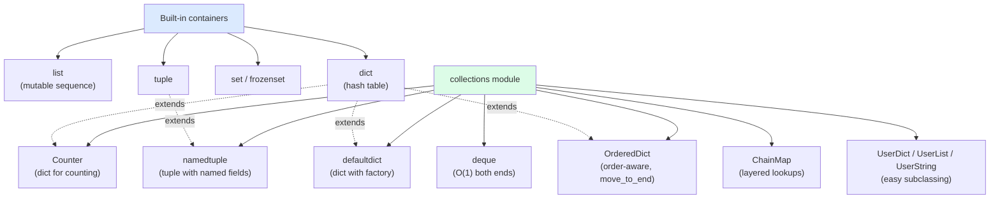

# 7. collections Module

> [!note] Why this note exists
> The built-in `list`, `dict`, `set`, and `tuple` cover 90% of everyday data structure needs. The other 10% — counting, defaulting, double-ended queues, record-style classes, layered lookups — is what `collections` is for. This note covers the five workhorses (`namedtuple`, `deque`, `Counter`, `defaultdict`, `OrderedDict`), the two specialists (`ChainMap`, `UserDict`), and the trade-offs that determine when each is the right tool. After this note, you should never again hand-roll a frequency counter or use a `list` as a queue.

## Why It Matters

Consider counting the frequency of each word in a 10-million-word corpus:

```python
# Approach A — hand-rolled with plain dict
counts = {}
for word in words:
    if word in counts:
        counts[word] += 1
    else:
        counts[word] = 1

# Approach B — defaultdict
from collections import defaultdict
counts = defaultdict(int)
for word in words:
    counts[word] += 1

# Approach C — Counter
from collections import Counter
counts = Counter(words)
counts.most_common(10)    # top 10 — free!
```

All three are O(n). But Approach A is six lines and three lookups per word; B is two lines and one lookup; C is one line and gives you `most_common`, arithmetic (`+`, `-`), and set operations (`&`, `|`) for free. The same goes for `deque` vs `list` for queues, `namedtuple` vs magic tuples, `OrderedDict` for LRU caches — `collections` exists because the plain built-ins, while general, leave a lot of common patterns to be re-implemented by every programmer.

The mental shift is: **the standard library already solved this**. Before you write `for i, x in enumerate(...)` with `if i not in seen: seen[i] = []`, check if `collections` has it.

## Background

The `collections` module has been part of Python since 2.4. It contains:

- **Container base classes**: `Container`, `Iterable`, `Sized`, `Sequence`, `Mapping`, `Set` (in `collections.abc`).
- **Concrete containers**: `namedtuple`, `deque`, `ChainMap`, `Counter`, `OrderedDict`, `defaultdict`, `UserDict`, `UserList`, `UserString`.

The `User*` classes are wrappers that make it easier to subclass built-in types (subclassing `dict` directly has subtle gotchas; `UserDict` is the safe choice). The other five are everyday tools.

### Why `collections` is separate from built-ins

Built-ins (`list`, `dict`, `set`, `tuple`) are written in C and deeply integrated into the language. `collections` types are mostly also C-implemented but live in a module so they can evolve independently. If a new container pattern emerges (say, a `Trie`), it can be added to `collections` without changing the language syntax.

## Main Content

### `namedtuple` — see [[3. Tuples and Named Tuples]]

Recap: `namedtuple` creates tuple subclasses with named fields. Use it for lightweight immutable records where you don't want to define a full class.

```python
from collections import namedtuple

Point = namedtuple('Point', ['x', 'y'])
p = Point(3, 4)
p.x, p.y         # (3, 4)
p._asdict()      # {'x': 3, 'y': 4}
p._replace(x=10) # Point(x=10, y=4)
```

For new code, prefer `typing.NamedTuple` (class syntax, type hints, default values, methods).

### `deque` — double-ended queue

A `deque` (double-ended queue, pronounced "deck") is a doubly-linked list of fixed-size blocks. It supports O(1) `append` and `pop` at **both ends**, unlike a `list` where `insert(0, x)` and `pop(0)` are O(n).

```python
from collections import deque

d = deque([1, 2, 3])
d.append(4)         # right side: deque([1, 2, 3, 4])
d.appendleft(0)     # left side:  deque([0, 1, 2, 3, 4])
d.pop()             # 4 (from right)
d.popleft()         # 0 (from left)
d[0]                # 1 — O(1) indexing (slower than list but possible)
d.extend([5, 6])    # right side
d.extendleft([5, 6])# left side, in reverse: deque([6, 5, ...])
d.rotate(1)         # rotate right by 1: last becomes first
d.rotate(-1)        # rotate left by 1: first becomes last
```

Key features:
- **O(1) appends and pops at both ends** — the killer feature.
- **O(n) random access** — slower than list (linked structure), but possible.
- **Optional `maxlen`** — when set, adding beyond the limit silently drops from the other end. Perfect for "keep last N items" patterns.

```python
# Bounded log: keeps only the last 1000 entries
recent_logs = deque(maxlen=1000)
for log in stream:
    recent_logs.append(log)    # old entries auto-evicted

# Sliding window of last 5 readings
window = deque(maxlen=5)
for sample in sensor:
    window.append(sample)
    if len(window) == 5:
        process(window)
```

Use cases:
- **Queues and stacks** — `deque` is the canonical implementation of both.
- **Producer/consumer buffers** — `maxlen` caps memory.
- **BFS** — `popleft()` for FIFO.
- **Undo/redo** — `deque(maxlen=N)` for the last N actions.
- **Sliding window algorithms** — fixed-size `deque` is the canonical tool.

### `Counter` — counting with extras

A `Counter` is a `dict` subclass for counting hashable items. It adds:

```python
from collections import Counter

c = Counter("abracadabra")
c                     # Counter({'a': 5, 'b': 2, 'r': 2, 'c': 1, 'd': 1})
c['a']                # 5
c['z']                # 0 — missing keys default to 0 (no KeyError!)
c.most_common(3)      # [('a', 5), ('b', 2), ('r', 2)]
c.elements()          # iterator: 'a', 'a', 'a', 'a', 'a', 'b', 'b', ...
c.update("abracadabra")    # add counts (in-place)
c.subtract("abra")    # subtract counts (in-place)

# Arithmetic on counters
c1 = Counter(a=3, b=1)
c2 = Counter(a=1, b=2)
c1 + c2               # Counter({'a': 4, 'b': 3}) — sums
c1 - c2               # Counter({'a': 2}) — subtracts, drops <=0
c1 & c2               # Counter({'a': 1, 'b': 1}) — min (intersection)
c1 | c2               # Counter({'a': 3, 'b': 2}) — max (union)
c1 == c2              # False — equality considers counts
```

Use cases:
- **Frequency analysis** — `Counter(text).most_common(10)`.
- **Histograms** — `Counter(samples)`.
- **Multiset operations** — `&` for "common items", `|` for "any item with max count".
- **Inventory** — `Counter(products) - Counter(sold)` gives remaining stock.

### `defaultdict` — dict with default factory

A `defaultdict` calls a factory function to produce a default value when a key is missing, then inserts it:

```python
from collections import defaultdict

# Group items by key
groups = defaultdict(list)
for item in items:
    groups[item.category].append(item)
# groups is a regular dict-like; no KeyError on missing categories

# Count
counts = defaultdict(int)
for word in words:
    counts[word] += 1

# Nested dicts
tree = defaultdict(lambda: defaultdict(int))
tree['a']['b'] += 1   # creates tree['a'] = defaultdict(int) on the fly

# Fixed default
config = defaultdict(lambda: "unset")
config['host']        # 'unset'
```

The factory is called with **no arguments** — so it must be a callable that takes zero args. `int`, `list`, `dict`, `set` all work as zero-arg factories (returning 0, [], {}, set()).

> [!warning] `defaultdict` only calls the factory on `__missing__`
> `d.get(k)` and `k in d` still return `None`/`False` for missing keys — they don't trigger the factory. Only `d[k]` does.

### `OrderedDict` — order-aware dict

Since Python 3.7, regular `dict` preserves insertion order, so `OrderedDict` is mostly redundant. But it has three features plain `dict` lacks:

```python
from collections import OrderedDict

od = OrderedDict()
od['a'] = 1
od['b'] = 2
od['c'] = 3

od.move_to_end('a')    # move 'a' to the end -> OrderedDict({'b':2,'c':3,'a':1})
od.move_to_end('a', last=False)  # move to front

od.popitem()           # ('a', 1) — LIFO (last inserted)
od.popitem(last=False) # ('b', 2) — FIFO (first inserted)

# Equality considers order
od1 = OrderedDict([('a', 1), ('b', 2)])
od2 = OrderedDict([('b', 2), ('a', 1)])
od1 == od2             # False — order differs
# (regular dict: {'a':1,'b':2} == {'b':2,'a':1} -> True)
```

Use cases:
- **LRU caches** — `move_to_end` + `popitem(last=False)` is the canonical LRU pattern.
- **Order-sensitive equality** — when (k, v) order matters.
- **Python <3.7 compatibility** — if you need order on old Python.

### `ChainMap` — layered lookups

A `ChainMap` groups multiple dicts together and looks up keys in order, returning the first match:

```python
from collections import ChainMap

defaults = {"host": "localhost", "port": 8080, "debug": False}
env = {"port": 9000}
cli = {"debug": True}

config = ChainMap(cli, env, defaults)   # check cli, then env, then defaults
config['port']        # 9000 (from env)
config['debug']       # True (from cli)
config['host']        # 'localhost' (from defaults)

# Writes go to the FIRST map only
config['port'] = 8888   # writes to cli, not env or defaults

# Add a new layer on top (without mutating any underlying dict)
overrides = config.new_child({"verbose": True})
```

Use cases:
- **Layered configuration** — defaults + env + CLI flags.
- **Variable scopes** — local + enclosing + global + builtin.
- **Defaults without copying** — no need to merge dicts; ChainMap is a view.

### `UserDict` — easy dict subclassing

```python
from collections import UserDict

class CaseInsensitiveDict(UserDict):
    def __setitem__(self, key, value):
        super().__setitem__(key.lower(), value)
    def __getitem__(self, key):
        return super().__getitem__(key.lower())
    def __contains__(self, key):
        return super().__contains__(key.lower())

d = CaseInsensitiveDict()
d['Host'] = 'localhost'
d['host']    # 'localhost'
'HOST' in d  # True
```

Why `UserDict` instead of subclassing `dict` directly? Because subclassing `dict` has subtle issues — many C-level methods bypass your overrides (e.g., `dict.update` doesn't call your `__setitem__`). `UserDict` is a pure-Python wrapper, so all operations go through your overrides.

Use `UserDict` (and `UserList`, `UserString`) when you need to customize dict/list/string behavior. For new code, consider whether `dataclasses.dataclass` or `typing.NamedTuple` is a better fit.

### `collections` overview



## Code Examples

### Example 1: BFS with `deque`

```python
from collections import deque

def bfs(graph, start):
    visited = {start}
    queue = deque([start])
    order = []
    while queue:
        node = queue.popleft()      # O(1) — would be O(n) on a list
        order.append(node)
        for neighbor in graph.get(node, []):
            if neighbor not in visited:
                visited.add(neighbor)
                queue.append(neighbor)
    return order
```

### Example 2: Sliding-window maximum with `deque`

```python
from collections import deque

def sliding_max(nums, k):
    # deque stores indices; front is always the max for current window
    dq = deque()
    result = []
    for i, n in enumerate(nums):
        # remove indices outside the window
        while dq and dq[0] <= i - k:
            dq.popleft()
        # remove smaller values from the back
        while dq and nums[dq[-1]] <= n:
            dq.pop()
        dq.append(i)
        if i >= k - 1:
            result.append(nums[dq[0]])
    return result
```

### Example 3: Multi-key grouping with `defaultdict`

```python
from collections import defaultdict

records = [
    ("2024-01-01", "click", "home"),
    ("2024-01-01", "view", "home"),
    ("2024-01-01", "click", "about"),
    ("2024-01-02", "click", "home"),
]

# Group by (date, action)
by_date_action = defaultdict(list)
for date, action, page in records:
    by_date_action[(date, action)].append(page)

# Group by page only
by_page = defaultdict(list)
for date, action, page in records:
    by_page[page].append((date, action))
```

### Example 4: LRU cache with `OrderedDict`

```python
from collections import OrderedDict
from functools import wraps

def lru_cache(capacity):
    def decorator(func):
        cache = OrderedDict()
        @wraps(func)
        def wrapper(*args):
            key = args
            if key in cache:
                cache.move_to_end(key)        # mark as recently used
                return cache[key]
            result = func(*args)
            cache[key] = result
            if len(cache) > capacity:
                cache.popitem(last=False)     # evict oldest
            return result
        return wrapper
    return decorator

# (Or just use functools.lru_cache — this is the educational version.)
```

### Example 5: Top-N with `Counter.most_common`

```python
from collections import Counter

# Top 5 most frequent IPs in a log
with open("access.log") as f:
    ip_counts = Counter(line.split()[0] for line in f)

for ip, count in ip_counts.most_common(5):
    print(f"{ip}: {count}")
```

`most_common(n)` uses a heap internally — O(n log k) where k is `n`, not O(n log n). Much faster than sorting the whole Counter.

### Example 6: Layered config with `ChainMap`

```python
import os
from collections import ChainMap

defaults = {"host": "localhost", "port": "8080", "debug": "false"}
env = {k: v for k, v in os.environ.items() if k.lower() in defaults}
cli = parse_args()  # dict

config = ChainMap(cli, env, defaults)

# Read
print(config["host"])

# Add a temporary override without mutating
with_debug = config.new_child({"debug": "true"})
print(with_debug["debug"])    # 'true'
print(config["debug"])        # unchanged
```

## Advanced Patterns and Performance

### `deque` — the O(1) front-and-back sequence

`deque` (double-ended queue) is implemented as a **doubly-linked list of fixed-size blocks** (each block is an array of 64 pointers). This gives:

- O(1) `append`, `appendleft`, `pop`, `popleft` — no shifting, no resize.
- O(n) random access — must walk blocks; slower than list indexing.
- O(k) for `extend` and `extendleft` where k = len(other).

The block-array design is cache-friendlier than a pure linked list (each block is contiguous) but slower than a list for indexed access. `deque` is the right choice whenever you need queue or stack semantics on a sequence that grows from both ends.

```python
from collections import deque

# Sliding window over a stream — O(n) total
def windowed(stream, k):
    win = deque(maxlen=k)        # automatic eviction when full
    for x in stream:
        win.append(x)
        if len(win) == k:
            yield tuple(win)

# BFS — O(V+E) with deque
def bfs(graph, start):
    seen = {start}
    q = deque([start])
    while q:
        node = q.popleft()       # O(1)
        for nb in graph[node]:
            if nb not in seen:
                seen.add(nb)
                q.append(nb)
```

The `maxlen` parameter is the killer feature: a bounded deque automatically evicts the oldest element when full, making it perfect for sliding-window computations, recent-event logs, and ring buffers.

### `Counter` — frequency analysis in one line

`Counter` is a `dict` subclass for counting hashable items. It adds:

- `most_common(n)` — top n by count (heap-based, O(n log k)).
- `elements()` — iterator repeating each element by its count.
- Arithmetic: `+`, `-`, `&` (min), `|` (max) on Counters.
- `total()` (Python 3.10+) — sum of all counts.

```python
from collections import Counter

text = "the quick brown fox jumps over the lazy dog the fox"
words = Counter(text.split())
print(words.most_common(3))          # [('the', 3), ('fox', 2), ...]
print(sum(words.values()))           # 10
print(words.total())                 # 10 (3.10+)

# Multiset arithmetic
a = Counter(a=3, b=1)
b = Counter(a=1, b=2)
print(a + b)     # Counter({'a': 4, 'b': 3})   — union (sum)
print(a - b)     # Counter({'a': 2})           — difference (drop ≤0)
print(a & b)     # Counter({'a': 1, 'b': 1})   — intersection (min)
print(a | b)     # Counter({'a': 3, 'b': 2})   — union (max)
```

### `defaultdict` — auto-initialising dicts

`defaultdict(factory)` calls `factory()` to produce a default value whenever a missing key is accessed. The factory must be a zero-argument callable.

```python
from collections import defaultdict

# Group items by key
groups = defaultdict(list)
for item in items:
    groups[item.category].append(item)

# Count occurrences (equivalent to Counter, but Counter has more methods)
counts = defaultdict(int)
for word in words:
    counts[word] += 1

# Tree structure
tree = lambda: defaultdict(tree)
t = tree()
t['a']['b']['c'] = 1               # auto-creates nested dicts
```

The recursive `defaultdict` trick is a famous Python idiom for building nested structures without explicit initialisation. Be careful: `defaultdict` will create entries on **any** access, including read-only `d[k]` checks. Use `d.get(k)` if you want to query without side effects.

### `OrderedDict` — still useful in the 3.7+ era

Even though plain `dict` preserves insertion order, `OrderedDict` has features dict lacks:

- `move_to_end(key, last=True)` — O(1) reordering. Essential for LRU caches.
- `popitem(last=True)` — pop from either end.
- Order-sensitive equality: `OrderedDict([(1,2),(3,4)]) == OrderedDict([(3,4),(1,2)])` is `False`. Plain `dict` would say `True`.

```python
from collections import OrderedDict

class LRUCache:
    def __init__(self, capacity):
        self.cap = capacity
        self.cache = OrderedDict()
    def get(self, key):
        if key not in self.cache: return -1
        self.cache.move_to_end(key)          # mark as recently used
        return self.cache[key]
    def put(self, key, value):
        if key in self.cache:
            self.cache.move_to_end(key)
        self.cache[key] = value
        if len(self.cache) > self.cap:
            self.cache.popitem(last=False)   # evict oldest
```

`functools.lru_cache` does this internally — but knowing the primitive is useful when you need a custom eviction policy.

### `ChainMap` — layered lookups without copying

`ChainMap(*maps)` chains multiple dicts into a single view. Lookups scan left-to-right; writes go to the first map.

```python
from collections import ChainMap

defaults = {"host": "localhost", "port": 5432, "ssl": False}
env_config = {"port": 6543, "ssl": True}
cli_args = {"host": "db.prod"}

config = ChainMap(cli_args, env_config, defaults)
print(config["host"])     # "db.prod"      (from cli_args)
print(config["port"])     # 6543           (from env_config)
print(config["ssl"])      # True           (from env_config)
print(config["timeout"])  # KeyError       (not in any map)
```

Compared to `{**defaults, **env_config, **cli_args}`, ChainMap is O(1) to construct (no copy), but O(k) per lookup where k is the number of layers (k is usually small). ChainMap is the right tool when:

- Layers change independently (you can mutate any of the underlying dicts).
- You need `del config[key]` to only affect the first layer (ChainMap does this; merged dict cannot).
- You want to "scope" changes: `with ChainMap({}, current_config).as_dict():`-style patterns.

### `UserDict` — easier subclassing than `dict`

Subclassing `dict` directly is fragile because built-in methods like `update` and `__init__` don't always call your overridden `__setitem__`. `UserDict` stores items in an internal `data` dict and routes all operations through your overrides:

```python
from collections import UserDict

class CaseInsensitiveDict(UserDict):
    def __setitem__(self, key, value):
        super().__setitem__(key.lower(), value)
    def __getitem__(self, key):
        return super().__getitem__(key.lower())

d = CaseInsensitiveDict()
d["Host"] = "localhost"
print(d["HOST"])         # "localhost"
print(d["host"])         # "localhost"
```

Use `UserDict` whenever you need to customise dict behaviour. Use `dict` directly only when you don't need to override anything.

## Common Pitfalls

> [!danger] `defaultdict` factory isn't called by `.get()` or `in`
> ```python
> d = defaultdict(list)
> d.get('missing')     # None — no factory call
> 'missing' in d       # False — no factory call
> d['missing']         # [] — factory called, key now exists
> ```

> [!danger] `Counter` returns 0 for missing keys but doesn't insert them
> ```python
> c = Counter()
> c['missing']         # 0, but 'missing' not in c
> 'missing' in c       # False
> c['missing'] += 1    # now c['missing'] == 1, and 'missing' in c is True
> ```

> [!danger] `deque` is slower than `list` for middle access
> `d[i]` on a deque is O(n) — it has to walk the linked structure. Use `list` for indexed access, `deque` for end-only operations.

> [!danger] `OrderedDict` equality considers order
> `OrderedDict([('a',1),('b',2)]) != OrderedDict([('b',2),('a',1)])`. If you want order-insensitive equality, convert to plain dict first.

> [!danger] `Counter` arithmetic drops non-positive counts
> `Counter(a=2) - Counter(a=5)` is `Counter()` (empty), not `Counter(a=-3)`. Use `subtract` if you want to keep negatives.

> [!danger] `ChainMap` writes go to the first map only
> ```python
> cm = ChainMap({}, defaults)
> cm['port'] = 9000   # writes to the first (empty) dict
> defaults['port']    # unchanged
> ```

> [!danger] Subclassing `dict` directly bypasses your overrides
> ```python
> class MyDict(dict):
>     def __setitem__(self, k, v):
>         super().__setitem__(k, str(v))
>
> d = MyDict()
> d.update({'a': 1})    # 'a' is 1, NOT '1' — update bypasses __setitem__!
> ```
> Use `UserDict` instead.

> [!danger] `namedtuple` field names can't start with underscore
> `namedtuple('X', ['_a', 'b'])` raises ValueError. Underscore-prefixed names are reserved.

## Tips and Tricks

- **Reach for `Counter` first** for any counting problem — it has the operations you'll reinvent otherwise.
- **`deque(maxlen=N)`** is the canonical "keep last N items" pattern — no manual eviction.
- **`defaultdict(list)` for grouping** — the most common defaultdict pattern.
- **`OrderedDict` is rarely needed** since 3.7 — but reach for it when you need `move_to_end` or order-sensitive equality.
- **`ChainMap` for layered config** — no copy, no merge, just lookups.
- **`UserDict` for dict subclasses** — bypasses C-level method issues.
- **`namedtuple._replace`** for immutable updates — the equivalent of `dataclasses.replace`.
- **`Counter.most_common(n)`** uses a heap, so it's O(n log k), not O(n log n) — use it for top-N, not for full sorts.
- **`deque` is faster than `list` for queues** — but only when you actually use both ends. If you only `append` and `pop()` (both at the right end), `list` is fine.
- **For tree structures**, `defaultdict(lambda: defaultdict(...))` is a common nested-dict trick — but a real class is more readable.
- **`collections.abc`** for type hints and protocols (`Iterable`, `Mapping`, `Sequence`) — useful in function signatures.
- **Don't reinvent `namedtuple` with a dict** — dicts lose the immutability contract and tuple-ness.

## Active Recall

1. Why is `deque` better than `list` for queues? When is `list` better?
2. What does `deque(maxlen=5)` do when you append a 6th element?
3. What's the difference between `Counter['missing']` and `dict['missing']`?
4. Write a one-liner to get the 3 most common words in a string.
5. When does `defaultdict` call its factory, and when does it not?
6. Give an example where `OrderedDict` is still the right choice over `dict` (Python 3.7+).
7. How does `ChainMap` handle writes? Does it write to all maps?
8. Why would you use `UserDict` instead of subclassing `dict`?
9. What does `Counter.most_common(n)` do, and what's its time complexity?
10. Write a 5-line LRU cache using `OrderedDict`.
11. Why does `Counter(a=2) - Counter(a=5)` return an empty Counter?
12. Give an example of `defaultdict(lambda: defaultdict(int))` and explain what it does.
13. What's the difference between `dict.update` and the way `UserDict` handles updates?
14. When would you reach for `namedtuple` vs `dataclass`?

## Next Steps

- [[3. Tuples and Named Tuples]] — full `namedtuple` and `typing.NamedTuple` coverage.
- [[5. Dictionaries Deep Dive]] — `Counter`, `defaultdict`, `OrderedDict`, `ChainMap` are all dict subclasses.
- [[1. Lists Deep Dive]] — `deque` is the queue/stack alternative to `list`.
- [[8. heapq and bisect]] — `heapq` for priority queues (another queue-related tool).
- [[4. Sets and Frozen Sets]] — set-like operations on `Counter` (the `&` and `|` operators).
