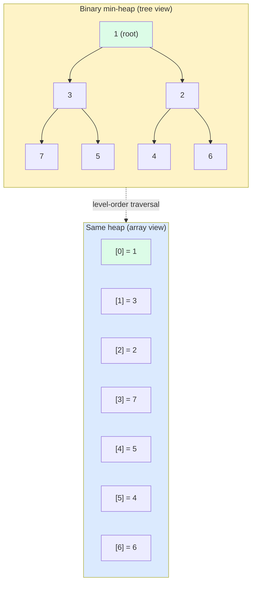
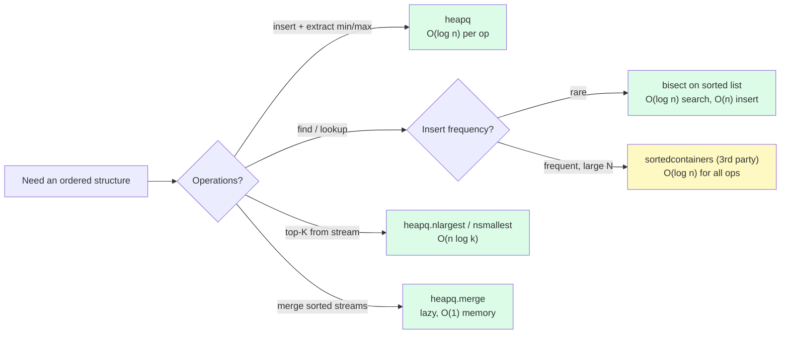

# 8. heapq and bisect

> [!note] Why this note exists
> Two of Python's most underused standard-library modules are `heapq` (a binary min-heap on top of a plain list) and `bisect` (binary search on sorted sequences). Together they cover two of the most common "I need a data structure" gaps: **priority queues** and **sorted sequences**. Knowing them means you stop reaching for `list.sort()` on every insert (O(n log n) per op vs O(log n) with `heapq`/`bisect`), and you stop writing your own binary search. This note covers both modules in depth, including the "max-heap trick" (negate values), `nlargest`/`nsmallest`, `insort`, and the heap-vs-bisect-vs-balanced-tree decision.

## Why It Matters

Consider a stream of 100 million events, and you need to maintain the top 10 highest values seen so far:

```python
# Approach A — sort every time
top = []
for event in stream:
    top.append(event.value)
    top.sort(reverse=True)
    top = top[:10]    # keep only 10
# Cost per event: O(n log n) for the sort, where n is len(top) <= 10.
# That's actually OK — but what if "10" is "10000"?

# Approach B — heapq.nlargest
import heapq
top = heapq.nlargest(10, (e.value for e in stream))
# Cost: O(n log k) where k=10. Streams without materializing the whole thing.

# Approach C — maintain a min-heap of size 10
import heapq
top = []
for event in stream:
    if len(top) < 10:
        heapq.heappush(top, event.value)
    elif event.value > top[0]:
        heapq.heapreplace(top, event.value)
# Cost per event: O(log 10) = O(1) effectively. Total: O(n log k).
```

For 100M events with k=10, all three finish in seconds. But increase k to 10,000 and Approach A becomes minutes; B and C stay fast. The pattern generalizes: **knowing `heapq` and `bisect` turns O(n²) and O(n log n) operations into O(n log k) and O(log n)**.

The second reason to know these modules: **they're the canonical "use a list as a smart structure" patterns**. You don't need a third-party balanced-tree library for most problems — a heap or a sorted list with binary search covers 80% of cases.

## Background

### What a heap is

A **binary heap** is a complete binary tree where each parent is smaller than (min-heap) or larger than (max-heap) its children. The key property: the **root is always the smallest (or largest) element**.

Python's `heapq` implements a **min-heap**: `heap[0]` is always the smallest.

The clever part: `heapq` doesn't define a new data type. It works on a **plain list**, treating it as the level-order traversal of a binary tree:

- Index 0 is the root.
- For a node at index `i`, its children are at `2i+1` and `2i+2`.
- Its parent is at `(i-1) // 2`.

This is the classic "heap as array" representation. It's memory-efficient (no node objects, no pointers) and cache-friendly (contiguous).

### Heap as array



The array `[1, 3, 2, 7, 5, 4, 6]` is the level-order traversal. Note: it's **not** sorted — only the heap property holds (parent ≤ child).

### `bisect` — binary search on sorted sequences

`bisect` works on any sorted sequence (list, tuple, array). It uses binary search to find the insertion point for a value in O(log n) time. **Insertion itself is still O(n)** because you have to shift elements — but the search is the fast part.

```python
import bisect
sorted_lst = [1, 3, 5, 7, 9]
i = bisect.bisect_left(sorted_lst, 5)    # 2 — leftmost position to insert 5
i = bisect.bisect_right(sorted_lst, 5)   # 3 — rightmost position
bisect.insort(sorted_lst, 6)             # insert 6 in sorted position — O(n) total
# sorted_lst is now [1, 3, 5, 6, 7, 9]
```

`bisect` is the right tool when:
- You have a sorted sequence and need to find where a value fits.
- You need to insert occasionally but mostly read.
- You don't need a fully-balanced tree (sorted-list + bisect is fine up to ~10k elements).

### When to use which

| Need | Use |
|------|-----|
| Priority queue (insert + extract-min/max) | `heapq` — O(log n) per op |
| Top-K from a stream | `heapq.nlargest` / `nsmallest` |
| Find an element in a sorted list | `bisect` — O(log n) search |
| Insert into a sorted list, occasional | `bisect.insort` — O(n) total |
| Frequent insert + frequent lookup, large N | `bintrees` / `sortedcontainers` (3rd party) |

For a true balanced tree with O(log n) insert/delete/lookup, you need a third-party library (`sortedcontainers` is the standard recommendation). The standard library doesn't ship one because most use cases are covered by `heapq` + `bisect`.

## Main Content

### `heapq` — full API

```python
import heapq

# --- Construction ---
heap = []                          # always start with empty list
heapq.heappush(heap, 3)            # add element — O(log n)
heapq.heappush(heap, 1)
heapq.heappush(heap, 4)
# heap is now [1, 3, 4] (heap-ordered, not sorted)

heap = [9, 3, 7, 1, 5, 2]
heapq.heapify(heap)                # linear-time heap construction — O(n)
# heap is now [1, 3, 2, 9, 5, 7]

# --- Inspection ---
heap[0]                            # always the smallest element — O(1)
# don't use heap[1] or heap[2] for "2nd smallest" — not guaranteed!

# --- Extraction ---
smallest = heapq.heappop(heap)     # pop and return smallest — O(log n)
# heap maintains heap property after pop

# --- Push-then-pop / pop-then-push (faster than separate ops) ---
heapq.heappushpop(heap, 0)         # push 0, then pop smallest (could be 0)
heapq.heapreplace(heap, 0)         # pop smallest, then push 0 (smallest may be > 0)

# --- Top-K helpers (don't modify the input) ---
heapq.nlargest(3, iterable)        # [largest, 2nd, 3rd]
heapq.nsmallest(3, iterable)       # [smallest, 2nd, 3rd]
heapq.nlargest(3, iterable, key=len)   # with key function

# --- Merge multiple sorted iterables (lazy!) ---
merged = heapq.merge([1, 3, 5], [2, 4, 6], [0, 7])
# merged is a generator: 0, 1, 2, 3, 4, 5, 6, 7
# All inputs must be sorted. Memory: O(1) (only holds one element from each input).
```

### The max-heap trick

`heapq` is min-heap only. To get a max-heap, **negate the values**:

```python
# Max-heap
maxheap = []
heapq.heappush(maxheap, -5)
heapq.heappush(maxheap, -1)
heapq.heappush(maxheap, -10)
# maxheap is [-10, -1, -5] (heap-ordered)
largest = -heapq.heappop(maxheap)   # 10

# Or: for nlargest, you don't need this — heapq.nlargest handles it.
```

For tuples (priority, item), use a tuple with negated priority:

```python
heap = []
heapq.heappush(heap, (-priority, item))
```

For non-numeric values, you can wrap them in a class with custom `__lt__`, or use `heapq` with a key wrapper.

### Priority queues with `heapq`

```python
import heapq
import itertools

class PriorityQueue:
    def __init__(self):
        self._heap = []
        self._counter = itertools.count()  # tiebreaker for equal priorities

    def push(self, item, priority=0):
        # tuple comparison: (priority, counter, item)
        # counter ensures FIFO for equal-priority items
        # and prevents comparing item (which may not be comparable)
        heapq.heappush(self._heap, (priority, next(self._counter), item))

    def pop(self):
        return heapq.heappop(self._heap)[2]

    def __len__(self):
        return len(self._heap)

# Usage
pq = PriorityQueue()
pq.push("low priority task", priority=3)
pq.push("high priority task", priority=1)
pq.push("medium task", priority=2)
pq.pop()    # 'high priority task'
pq.pop()    # 'medium task'
pq.pop()    # 'low priority task'
```

The `_counter` is critical: without it, if two items have equal priority, Python tries to compare the items themselves — which fails for non-comparable types (e.g., dicts).

### `bisect` — full API

```python
import bisect

# --- Find insertion point ---
sorted_lst = [1, 3, 3, 3, 5, 7, 9]

bisect.bisect_left(sorted_lst, 3)    # 1 — leftmost position for 3
bisect.bisect_right(sorted_lst, 3)   # 4 — rightmost position for 3
bisect.bisect(sorted_lst, 3)         # 4 — alias for bisect_right

# bisect_left/right with missing value
bisect.bisect_left(sorted_lst, 4)    # 5 — between 3 and 5
bisect.bisect_left(sorted_lst, 0)    # 0 — before everything
bisect.bisect_left(sorted_lst, 10)   # 7 — after everything

# --- Insert in sorted order (mutates the list) ---
lst = [1, 3, 5, 7]
bisect.insort_left(lst, 4)           # [1, 3, 4, 5, 7] — inserts before equal
lst = [1, 3, 5, 7]
bisect.insort_right(lst, 5)          # [1, 3, 5, 5, 7] — inserts after equal
bisect.insort(lst, 6)                # alias for insort_right

# --- With a key function (Python 3.10+) ---
people = [("alice", 30), ("bob", 25), ("carol", 35)]
# Note: people must be sorted by the key you'll use
people.sort(key=lambda p: p[1])
i = bisect.bisect_left(people, 28, key=lambda p: p[1])
# i = 1 — where a person with age 28 would go
```

### `bisect` for sorted-list patterns

```python
# Find the closest element
def closest(sorted_lst, target):
    i = bisect.bisect_left(sorted_lst, target)
    if i == 0:
        return sorted_lst[0]
    if i == len(sorted_lst):
        return sorted_lst[-1]
    before = sorted_lst[i - 1]
    after = sorted_lst[i]
    return after if after - target < target - before else before

# Range query
def in_range(sorted_lst, lo, hi):
    left = bisect.bisect_left(sorted_lst, lo)
    right = bisect.bisect_right(sorted_lst, hi)
    return sorted_lst[left:right]
```

### `heapq.merge` — merge sorted iterables

```python
import heapq

# Merge multiple sorted log files without loading everything into memory
log_files = [open(f) for f in filenames]
for line in heapq.merge(*log_files, key=lambda s: s.split()[0]):
    # lines come out in sorted order by timestamp
    process(line)
```

`heapq.merge` is lazy — it only holds one element from each input in memory at a time. Perfect for external sorts and streaming merges.

### `heapq` and `bisect` together



## Code Examples

### Example 1: Top-K from a stream

```python
import heapq

def top_k(stream, k):
    """Return the k largest elements seen in the stream."""
    heap = []
    for value in stream:
        if len(heap) < k:
            heapq.heappush(heap, value)
        elif value > heap[0]:
            heapq.heapreplace(heap, value)
    return sorted(heap, reverse=True)

# Or, the one-liner:
# return heapq.nlargest(k, stream)
```

### Example 2: Dijkstra's algorithm

```python
import heapq
from collections import defaultdict

def dijkstra(graph, start):
    dist = {start: 0}
    heap = [(0, start)]
    while heap:
        d, u = heapq.heappop(heap)
        if d > dist.get(u, float('inf')):
            continue    # stale entry
        for v, w in graph.get(u, []):
            nd = d + w
            if nd < dist.get(v, float('inf')):
                dist[v] = nd
                heapq.heappush(heap, (nd, v))
    return dist
```

### Example 3: Maintaining a leaderboard

```python
import heapq
import bisect

# Sorted list of scores (descending)
class Leaderboard:
    def __init__(self):
        self.scores = []          # sorted ascending (for bisect)
        self.entries = {}         # player -> score

    def add_score(self, player, score):
        if player in self.entries:
            old = self.entries[player]
            i = bisect.bisect_left(self.scores, old)
            self.scores.pop(i)    # O(n) removal
        bisect.insort(self.scores, score)   # O(n) insert
        self.entries[player] = score

    def rank(self, player):
        score = self.entries[player]
        # Number of players with higher score
        return len(self.scores) - bisect.bisect_right(self.scores, score)
```

For very large leaderboards, use `sortedcontainers.SortedList` instead — it's O(log n) for everything.

### Example 4: Median of a stream (two heaps)

```python
import heapq

class RunningMedian:
    def __init__(self):
        self.lower = []    # max-heap (negated) — smaller half
        self.upper = []    # min-heap — larger half

    def add(self, value):
        # Push to appropriate heap
        if not self.lower or value <= -self.lower[0]:
            heapq.heappush(self.lower, -value)
        else:
            heapq.heappush(self.upper, value)

        # Rebalance: sizes must differ by at most 1
        if len(self.lower) > len(self.upper) + 1:
            heapq.heappush(self.upper, -heapq.heappop(self.lower))
        elif len(self.upper) > len(self.lower):
            heapq.heappush(self.lower, -heapq.heappop(self.upper))

    def median(self):
        if len(self.lower) > len(self.upper):
            return -self.lower[0]
        elif len(self.upper) > len(self.lower):
            return self.upper[0]
        else:
            return (-self.lower[0] + self.upper[0]) / 2
```

### Example 5: Sorted insertion with `bisect.insort`

```python
import bisect

# Maintain a sorted log of events
events = []  # sorted by timestamp

def log_event(timestamp, event):
    bisect.insort(events, (timestamp, event))

# Now events is always sorted; bisect for range queries
def events_in_range(start, end):
    left = bisect.bisect_left(events, (start,))
    right = bisect.bisect_left(events, (end,))
    return events[left:right]
```

### Example 6: External merge sort

```python
import heapq

def external_sort(chunks):
    """chunks is a list of sorted iterables."""
    for item in heapq.merge(*chunks):
        yield item

# Use case: sort a 100GB file by splitting into memory-sized chunks,
# sorting each in memory, then merging with heapq.merge.
```

## Advanced Patterns and Performance

### The heap invariant and operation costs

A binary heap stored in a list satisfies: `heap[k] <= heap[2*k+1]` and `heap[k] <= heap[2*k+2]` for all valid k. The root (`heap[0]`) is always the smallest. Internally:

- `heappush`: append to end, then "sift up" — compare with parent, swap if smaller. O(log n) swaps, each O(1).
- `heappop`: take root, move last element to root, then "sift down" — compare with smaller child, swap if larger. O(log n) swaps.
- `heapify`: build heap from arbitrary list. Naive approach is O(n log n); CPython uses the **Floyd bottom-up** method, which is O(n).
- `heapreplace`: pop root and push new element in one operation. O(log n) — faster than separate pop+push because it avoids one sift.

```python
import heapq

h = [5, 2, 8, 1]
heapq.heapify(h)              # O(n) — h is now [1, 2, 8, 5]
heapq.heappush(h, 0)          # O(log n) — h is now [0, 1, 8, 5, 2]
print(heapq.heappop(h))       # 0, O(log n)
print(heapq.heappop(h))       # 1
print(heapq.heapreplace(h, 3))  # 2 (popped), 3 pushed in one op
```

### The max-heap trick

`heapq` only provides a min-heap. For a max-heap, negate the values:

```python
import heapq

class MaxHeap:
    def __init__(self, items=()):
        self._h = [-x for x in items]
        heapq.heapify(self._h)
    def push(self, x):
        heapq.heappush(self._h, -x)
    def pop(self):
        return -heapq.heappop(self._h)
    def peek(self):
        return -self._h[0]

mh = MaxHeap([3, 1, 4, 1, 5, 9])
print(mh.pop())   # 9
print(mh.pop())   # 5
print(mh.pop())   # 4
```

For tuples (priority, item), negate the priority: `(-priority, item)`. For objects with custom ordering, wrap them in a class with inverted `__lt__`.

### Priority queues — `heapq` vs `queue.PriorityQueue`

Two ways to build a priority queue:

```python
# 1. heapq — single-threaded, fast, manual
import heapq
import itertools

class PriorityQueue:
    def __init__(self):
        self._h = []
        self._counter = itertools.count()    # tiebreaker for equal priorities
    def push(self, priority, item):
        heapq.heappush(self._h, (priority, next(self._counter), item))
    def pop(self):
        return heapq.heappop(self._h)[2]

# 2. queue.PriorityQueue — thread-safe, slower
from queue import PriorityQueue
pq = PriorityQueue()
pq.put((1, "low priority"))
pq.put((0, "high priority"))
print(pq.get()[1])   # "high priority"
```

Use `heapq` for single-threaded code (faster, no locking). Use `queue.PriorityQueue` for multi-threaded code (locks included, blocks on get/put). Always include a tiebreaker (the counter) — without it, comparing items directly raises `TypeError` if priorities are equal and items aren't comparable.

### `nlargest` and `nsmallest` — optimised for small k

`heapq.nlargest(k, iterable)` and `heapq.nsmallest(k, iterable)` find the top/bottom k elements. They're optimised:

- For k=1: a single linear scan, O(n).
- For small k relative to n: a min-heap of size k, O(n log k).
- For k close to n: sort the iterable and slice, O(n log n).

You don't need to choose — `nlargest` picks the right algorithm internally. But for very small k and very large n, the heap-based approach can be 10× faster than `sorted(iterable, reverse=True)[:k]`.

```python
import heapq, random
data = [random.random() for _ in range(10_000_000)]

# Fast: O(n log 10) ~ O(n)
top10 = heapq.nlargest(10, data)

# Slower: O(n log n)
top10_alt = sorted(data, reverse=True)[:10]
```

### `bisect` — binary search on sorted sequences

`bisect` works on any sorted sequence (not just lists). It returns an insertion point — the index where you'd insert `x` to keep the sequence sorted.

| Function | Returns | Use case |
|----------|---------|----------|
| `bisect_left(a, x)` | First index i where `a[i] >= x` | Leftmost insertion point |
| `bisect_right(a, x)` | First index i where `a[i] > x` | Rightmost insertion point (default) |
| `insort_left(a, x)` | Inserts x at `bisect_left` | Maintain sorted list (O(n) due to shift) |
| `insort_right(a, x)` | Inserts x at `bisect_right` | Same, insert after equal elements |

All four are O(log n) for the search; `insort` adds O(n) for the shift.

```python
import bisect

# Find rank in a sorted leaderboard
scores = [10, 20, 30, 40, 50]
print(bisect.bisect_right(scores, 35))   # 3 — rank (0-indexed: 3 people have ≤35)

# Insert while keeping sorted — O(n) due to shift
bisect.insort(scores, 35)                # scores is now [10, 20, 30, 35, 40, 50]

# Lookup in a sorted list — O(log n)
def contains(sorted_list, x):
    i = bisect.bisect_left(sorted_list, x)
    return i < len(sorted_list) and sorted_list[i] == x
```

### `bisect` for range lookups (the killer use case)

The most powerful `bisect` pattern is mapping a value to a range using sorted breakpoints:

```python
import bisect

# Grade boundaries: 90+ is A, 80+ is B, etc.
breakpoints = [60, 70, 80, 90]
grades = "FDCBA"

def grade(score):
    i = bisect.bisect(breakpoints, score)    # 0..4
    return grades[i]

print(grade(85))   # 'B'
print(grade(92))   # 'A'
print(grade(50))   # 'F'
```

This is the standard way to bucket continuous values into discrete categories. It's O(log n) per lookup — far faster than a chain of `if score >= 90: ... elif score >= 80: ...`.

### When to use a heap vs `bisect` vs a balanced tree

| Need | Best tool |
|------|-----------|
| Maintain a sorted sequence, occasional insert | `bisect.insort` (O(n) per insert) |
| Top-k from a stream | `heapq.nlargest` or min-heap of size k |
| Priority queue | `heapq` (single-threaded) or `queue.PriorityQueue` (threaded) |
| Find min/max repeatedly | Min-heap (O(log n) per pop) |
| Range queries, rank queries | Sorted list + `bisect` |
| Both min and max at the same time | Min-heap and max-heap, or `sortedcontainers.SortedList` (3rd party) |
| Median of a stream | Two heaps (max-heap for lower half, min-heap for upper half) |

Python doesn't ship a balanced tree (no `std::map` equivalent). For workloads that need O(log n) insert/delete/lookup on a sorted structure, use the third-party `sortedcontainers` library — it's pure Python, fast, and battle-tested. For most other cases, `heapq` and `bisect` are enough.

## Common Pitfalls

> [!danger] `heap[0]` is the smallest, but `heap[1]` and `heap[2]` are NOT the 2nd and 3rd smallest
> The heap property only guarantees parent ≤ child. For the K smallest, use `heapq.nsmallest(k, heap)` or pop k times.

> [!danger] Iterating a heap gives heap-order, not sorted order
> ```python
> heap = [3, 1, 4, 1, 5]
> heapq.heapify(heap)
> list(heap)        # [1, 1, 4, 3, 5] — heap order, not sorted
> ```
> To get sorted order, pop repeatedly: `[heapq.heappop(heap) for _ in range(len(heap))]`.

> [!danger] `bisect` requires the list to be sorted
> If the list isn't sorted, `bisect` returns garbage without warning. Always sort first, or maintain the sort invariant with `insort`.

> [!danger] Comparing tuples with non-comparable items
> ```python
> heap = []
> heapq.heappush(heap, (1, {"a": 1}))    # OK so far
> heapq.heappush(heap, (1, {"b": 2}))    # TypeError: '<' not supported between dicts
> ```
> Always include a tiebreaker (counter, id, etc.) before the uncomparable item.

> [!danger] `heapreplace` pops BEFORE pushing; `heappushpop` pushes BEFORE popping
> They behave differently when the new value is smaller than the current min. `heapreplace(heap, x)` returns the old min (even if x is smaller); `heappushpop(heap, x)` returns the smaller of (x, old min).

> [!danger] Modifying a list while it's a heap
> If you `append`, `sort`, or otherwise modify the underlying list, the heap invariant may break. Always go through `heapq` functions or call `heapify` after.

> [!danger] `insort` is O(n), not O(log n)
> The *search* is O(log n); the *shift* is O(n). For frequent inserts into large lists, `sortedcontainers.SortedList` is the right choice.

> [!danger] `bisect_left` vs `bisect_right` confusion
> For a value `v` already in the list, `bisect_left` returns the index of the first `v`; `bisect_right` returns the index after the last `v`. Pick the one matching your intent.

## Tips and Tricks

- **For top-K, always use `heapq.nlargest` / `nsmallest`** — they handle the heap maintenance internally and use the optimal algorithm.
- **For priority queues, wrap items as `(priority, counter, item)`** to avoid comparing items.
- **`heapify` is O(n)** — much faster than n `heappush` calls (which would be O(n log n)). Use it when you already have a list.
- **`heappushpop` is faster than `heappush` then `heappop`** — single sift operation instead of two.
- **For max-heap, negate** — simple and idiomatic.
- **`heapq.merge` is lazy** — great for streaming merges of large sorted files.
- **`bisect.insort` is the right tool for occasional sorted inserts** — but switch to `sortedcontainers` above ~10k elements.
- **Use `bisect` for "find closest"** — combine `bisect_left` with a check of the neighbors.
- **Range queries on sorted lists** are trivial with `bisect_left` + `bisect_right`.
- **For persistent priority queues**, `heapq` + `pickle` works — or use `queue.PriorityQueue` for thread-safe version.
- **`heapq` doesn't support decrease-key** — to update a priority, push a new entry and skip stale ones when popping (as in the Dijkstra example).
- **For production-grade sorted collections**, install `sortedcontainers` — it's pure Python, fast, and ships a `SortedList`, `SortedDict`, and `SortedSet`.

## Active Recall

1. What does `heapq.heappush` do, and what's its time complexity?
2. Why does `heapq` work on a plain list instead of defining a new class?
3. How do you implement a max-heap using `heapq`?
4. Write a 5-line priority queue with `heapq` that handles equal priorities correctly.
5. What's the difference between `heappushpop` and `heapreplace`?
6. Why is `heapify` O(n) but n `heappush` calls are O(n log n)?
7. What does `heapq.nlargest(k, iterable)` do, and what's its complexity?
8. Write a one-liner to merge three sorted lists into one sorted iterator.
9. What does `bisect_left` return for a value already in the list? What about `bisect_right`?
10. Why is `bisect.insort` O(n) and not O(log n)?
11. Give an example where you'd need `sortedcontainers` instead of `heapq` + `bisect`.
12. How would you implement Dijkstra's algorithm with `heapq`? What's the "stale entry" trick?
13. Why is iterating a heap not the same as iterating a sorted list?
14. Write a function that maintains the running median of a stream using two heaps.

## Next Steps

- [[7. collections Module]] — `deque` for queues, `Counter` for counting, both complements to `heapq`.
- [[2. List Operations and Complexity]] — `heapq` and `bisect` are the "smart list" patterns that change the complexity profile.
- [[1. Lists Deep Dive]] — both `heapq` and `bisect` operate on plain lists; understanding list internals helps.
- [[5. Dictionaries Deep Dive]] — for `PriorityQueue` patterns that pair with dicts (e.g., Dijkstra's `dist` map).
- [[4. Sets and Frozen Sets]] — for O(1) membership tests alongside heap-based priorities.
