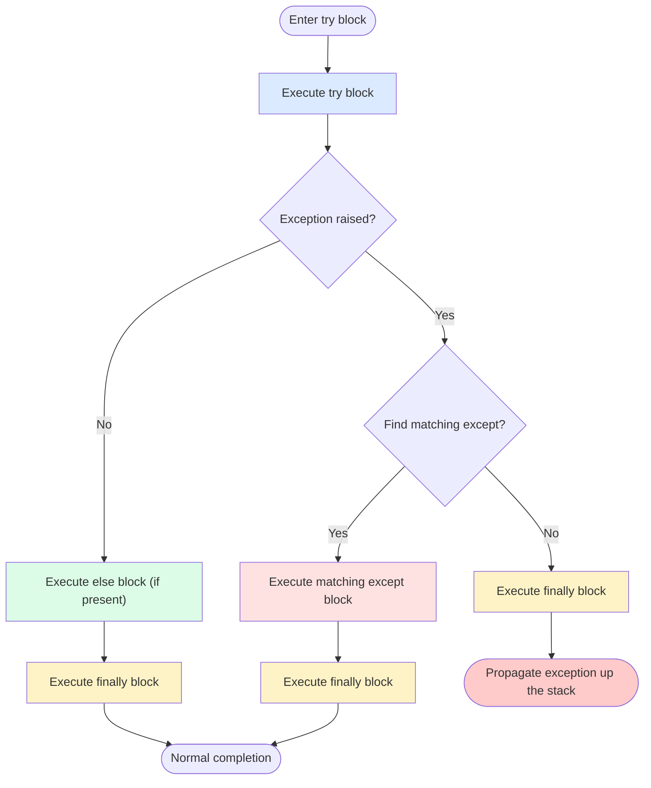
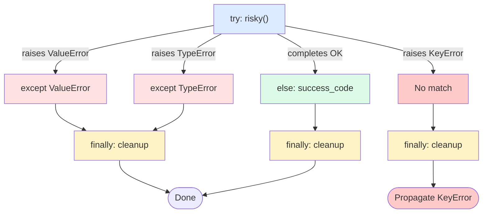
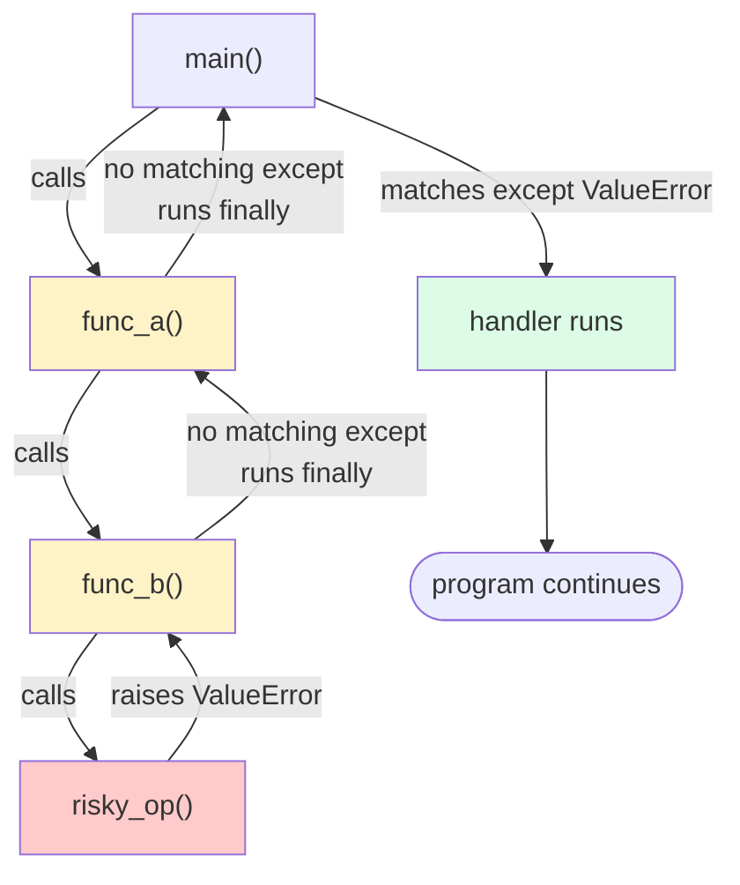

# 1. try-except-finally

> [!note] Why this note exists
> Exception handling in Python is not just "wrap risky code in `try`". The `try`/`except`/`else`/`finally` block is a four-part control-flow structure with precise semantics: `try` runs the risky code, `except` catches specific failures, `else` runs only on success, and `finally` always runs for cleanup. Misusing any of these four parts causes subtle bugs — silently swallowed errors, resources left open, cleanup that runs at the wrong time. This note covers the full syntax, the order of evaluation, the `as e` pattern, exception tuples, the bare-`except` anti-pattern, and the control-flow diagram you should have in your head.

## Why It Matters

Consider this code that opens a file, parses it, and writes a result:

```python
def process(path):
    f = open(path)
    data = f.read()
    result = parse(data)        # might raise
    f.close()                   # never runs if parse raises!
    return result
```

The file handle leaks on any exception in `parse`. The fix is `finally`:

```python
def process(path):
    f = open(path)
    try:
        data = f.read()
        return parse(data)
    finally:
        f.close()               # always runs, even on return or exception
```

Or, better, the `with` statement (see [[4. Context Managers]]) — but the underlying mechanism is `finally`.

The second common bug is the **bare `except`**:

```python
try:
    do_something()
except:
    print("something went wrong")    # swallows EVERYTHING, including KeyboardInterrupt
```

This catches `KeyboardInterrupt` (so Ctrl-C doesn't work), `SystemExit` (so `sys.exit()` is silently ignored), and `MemoryError`. It also masks programming errors — `AttributeError` from a typo in `do_something` becomes "something went wrong". The fix is `except Exception:` (or, better, the specific exception types you expect).

The third common bug is **using exceptions for control flow**:

```python
try:
    value = d[key]
except KeyError:
    value = default
# Better: value = d.get(key, default)
```

This works but is slower and less clear. Exceptions are for **exceptional** conditions, not for ordinary logic.

This note covers the rules that, once internalized, make exception code correct and readable.

## Background

### Exceptions in Python

An exception is an object that flows up the call stack until it's caught. If no function catches it, the interpreter prints a traceback and exits. The mechanism is:

1. An exception is **raised** with `raise ExceptionType("message")` (or implicitly by a runtime error like `1/0`).
2. The interpreter unwinds the call stack, looking for the nearest enclosing `try` block with a matching `except`.
3. If found, the `except` block runs. The exception is now "handled".
4. If not found, the interpreter prints the traceback and exits the program (or thread).

Unlike C++ where exceptions are slow, Python exceptions are **cheap when not raised** (a `try` block has zero overhead if no exception is raised). The cost is paid only when an exception is actually raised — typically 1-10 microseconds. So `try`/`except` is appropriate for "rare failure" cases, not "common case" code.

### What `try`/`except` actually does

The four clauses have precise semantics:

- `try:` — run this block. If an exception is raised, jump to the matching `except`.
- `except SomeError:` — run if `SomeError` (or a subclass) was raised. Multiple `except` clauses are checked top-to-bottom; the first match wins.
- `else:` — run if the `try` block completed **without raising**. Useful to keep "success" code out of the `try` (so its exceptions aren't caught).
- `finally:` — **always** run, whether the `try` succeeded, raised, or the `except` raised a new exception. Used for cleanup.

### The order of evaluation



Key insight: `finally` always runs. Even if:
- The `try` block returns.
- The `except` block raises a new exception.
- The `try` block has a `break`, `continue`, or `return`.
- An exception is uncaught.

The `finally` block runs before the function returns or the exception propagates.

## Main Content

### Basic syntax

```python
# Simplest form
try:
    risky_operation()
except SomeError:
    handle_error()

# With exception binding
try:
    risky_operation()
except SomeError as e:
    print(f"Got: {e}")
    print(f"Type: {type(e).__name__}")

# Multiple exception types
try:
    risky_operation()
except (ValueError, TypeError) as e:
    print(f"Bad input: {e}")

# Multiple handlers (checked top-to-bottom)
try:
    risky_operation()
except ValueError:
    handle_value_error()
except TypeError:
    handle_type_error()
except Exception:
    handle_anything_else()

# With else and finally
try:
    f = open(path)
except FileNotFoundError:
    print("missing")
else:
    data = f.read()       # only runs if open succeeded
    f.close()
finally:
    print("done")         # always runs
```

### The four clauses in detail

#### `try:`

Wraps the code that might raise. Keep the `try` block **as small as possible** — only the lines that actually might raise. This makes it clear what exception you're guarding against, and prevents accidentally catching exceptions from unrelated code.

```python
# BAD — try block too big
try:
    data = open(path).read()
    result = parse(data)
    save(result)
    notify_user()
except Exception:
    print("something failed")    # which step?

# BETTER — narrow try
try:
    f = open(path)
except FileNotFoundError:
    print("file not found")
    return
with f:
    data = f.read()
result = parse(data)
save(result)
notify_user()
```

#### `except:`

Catches the exception. Forms:

```python
except SomeError:               # catch by type
except SomeError as e:          # capture the exception object
except (Error1, Error2):        # catch multiple types
except (Error1, Error2) as e:   # both
except:                         # BARE — catches EVERYTHING (anti-pattern)
except Exception:               # catch all non-fatal exceptions (OK)
```

**Always catch the most specific type you can.** Catching `Exception` is acceptable when you genuinely don't know what might go wrong (e.g., top-level error logging), but in business logic, narrow types communicate intent.

> [!danger] Bare `except:` catches `KeyboardInterrupt` and `SystemExit`
> These inherit from `BaseException`, not `Exception`. A bare `except:` will silently swallow Ctrl-C and `sys.exit()`, making your program unkillable. Always use `except Exception:` for "catch anything non-fatal".

#### `else:`

Runs only if the `try` block completed without raising. Why use it? To keep "success" code out of the `try`, so its exceptions aren't accidentally caught:

```python
try:
    x = parse_value(s)
except ValueError:
    print("bad input")
else:
    # If save_to_db raises, we want it to propagate, not be swallowed
    save_to_db(x)
```

Without `else`, if `save_to_db` raised `ValueError`, the `except` would catch it — masking a bug.

#### `finally:`

Always runs. Used for cleanup: closing files, releasing locks, restoring state.

```python
lock.acquire()
try:
    do_critical_section()
finally:
    lock.release()    # always releases, even on exception
```

`finally` runs even if:
- `try` returns.
- `try` raises.
- `except` raises a new exception.
- `try` or `except` has `break`/`continue`.

> [!warning] Don't `return` from `finally`
> A `return` in `finally` silently swallows any exception that was propagating. This is almost never what you want.
> ```python
> def f():
>     try:
>         raise ValueError("oops")
>     finally:
>         return 42     # ValueError is LOST — caller sees 42
> ```

### Re-raising and chaining

```python
try:
    do_thing()
except SomeError as e:
    log(e)
    raise          # re-raises the same exception, with original traceback

try:
    do_thing()
except SomeError as e:
    raise OtherError("context") from e    # chained — preserves original
```

See [[2. raise and Custom Exceptions]] for chaining semantics (`from e`, `from None`).

### Catching multiple exception types

A tuple of types is matched by `isinstance`:

```python
try:
    value = int(s)
except (ValueError, TypeError) as e:
    print(f"Can't parse: {e}")
```

The order of multiple `except` clauses matters — they're checked top-to-bottom, first match wins. Put **more specific** types before **less specific**:

```python
try:
    ...
except FileNotFoundError:        # subclass of OSError — must come first
    handle_missing()
except OSError:                  # catches other OSErrors
    handle_other_os_error()
```

If you reverse the order, `FileNotFoundError` is never reached because `OSError` matches it.

### The `as e` pattern

```python
try:
    ...
except ValueError as e:
    print(f"Message: {e}")
    print(f"Args: {e.args}")
    print(f"Type: {type(e).__name__}")
    print(f"Traceback: {e.__traceback__}")

    # Common things to do with e:
    log.exception("Failed")     # logs with traceback
    raise                       # re-raise
    raise OtherError() from e   # chain
```

The exception object `e` has:
- `args` — tuple of arguments passed to the constructor.
- `__str__` — usually returns the first arg as a string.
- `__traceback__` — the traceback object (use `traceback.format_exc()` to print).
- `__cause__` — the original exception if chained with `from`.
- `__context__` — the original exception if implicitly chained.

### `try`/`finally` without `except`

You can use `try`/`finally` without `except` — useful when you want cleanup but want exceptions to propagate:

```python
f = open(path)
try:
    yield_data = f.read()
finally:
    f.close()
# Any exception from read() propagates, but f is always closed.
```

This is the manual version of `with open(path) as f:`. Prefer `with` for files (see [[4. Context Managers]]).

### `try`/`except`/`else` without `finally`

Common when you only need to handle success/failure, no cleanup:

```python
try:
    port = int(os.environ.get("PORT", "8080"))
except ValueError:
    port = 8080
else:
    print(f"Using port {port}")
```

### Exception control flow



### Performance: `try` is cheap when no exception is raised

```python
# This is FREE — no cost when the dict has the key
try:
    value = d[key]
except KeyError:
    value = default

# This is also cheap (one hash + one comparison)
value = d.get(key, default)

# But try/except is slower IF the exception is frequently raised
# (exception raising has overhead — about 1-10 microseconds)
```

The rule: **use try/except for rare failures; use explicit checks for common cases**.

### `sys.exc_info()` and `traceback`

```python
import sys
import traceback

try:
    risky()
except:
    exc_type, exc_value, exc_tb = sys.exc_info()
    print(f"Type: {exc_type}")
    print(f"Value: {exc_value}")
    print("Traceback:")
    traceback.print_tb(exc_tb)
```

`sys.exc_info()` returns the currently-handled exception. Modern code uses `except Exception as e:` instead — `e.__traceback__` gives you the traceback.

### `logging.exception`

```python
import logging

try:
    risky()
except Exception:
    logging.exception("Failed to do risky thing")
    # logs the message + full traceback
    raise   # optionally re-raise
```

`logging.exception` must be called from inside an `except` block — it pulls the current exception from `sys.exc_info()`.

## Code Examples

### Example 1: Safe file open

```python
def read_config(path):
    try:
        with open(path, encoding="utf-8") as f:
            return json.load(f)
    except FileNotFoundError:
        return {}
    except json.JSONDecodeError as e:
        logging.warning("Bad config: %s", e)
        return {}
    except OSError as e:
        logging.error("Can't read config: %s", e)
        return {}
```

### Example 2: Cleanup with `finally`

```python
import threading

def update_shared(state):
    state.lock.acquire()
    try:
        # Critical section — exceptions here are OK,
        # the lock will still be released.
        state.counter += 1
        state.history.append(time.time())
    finally:
        state.lock.release()
```

Or, better, with a context manager:

```python
def update_shared(state):
    with state.lock:
        state.counter += 1
        state.history.append(time.time())
```

### Example 3: Try/except/else for clean separation

```python
def safe_get(d, key, default=None):
    try:
        value = d[key]
    except KeyError:
        return default
    else:
        # Success path — if this raises, propagate (don't catch)
        return transform(value)
```

### Example 4: Re-raise with context

```python
def load_user(uid):
    try:
        record = db.fetch(uid)
    except db.ConnectionError as e:
        log.warning("DB failed for %s: %s", uid, e)
        raise   # re-raise the same exception
    if record is None:
        raise UserNotFoundError(uid)
    return User.from_record(record)
```

### Example 5: Chained exception

```python
def parse_config(text):
    try:
        return json.loads(text)
    except json.JSONDecodeError as e:
        raise ConfigError(f"Invalid JSON in config: {e}") from e

# Caller sees both:
# ConfigError: Invalid JSON in config: ...
# The above exception was the direct cause of...
```

### Example 6: Don't catch what you can't handle

```python
# BAD — swallows everything, including programming errors
def process(items):
    for item in items:
        try:
            do_stuff(item)
        except:
            pass    # silently skips bad items... and bugs!

# BETTER — catch only expected failures
def process(items):
    for item in items:
        try:
            do_stuff(item)
        except (ValueError, KeyError) as e:
            log.warning("Skipping item %r: %s", item, e)
            continue
        # Other exceptions (TypeError from a bug) propagate
```

### Call-stack unwinding visualised

When an exception is raised, Python does not magically teleport to the nearest `except`. It **unwinds** the call stack frame by frame, running any `finally` blocks along the way. Each frame gets a chance to handle the exception; if it does not, the exception continues upward.



This is why `finally` runs even when no `except` matches in the local frame: `finally` is part of the unwinding machinery, not part of the catch machinery. The catch happens at whichever frame has a matching `except`; the cleanups happen at every frame along the way.

### Advanced patterns and idioms

#### The "exception-translation sandwich"

When you call into a library that raises its own exception types, translate them at the boundary so your callers see a consistent error API:

```python
def load_config(path):
    """Public API — callers see only ConfigError."""
    try:
        with open(path, encoding="utf-8") as f:
            try:
                return json.load(f)
            except json.JSONDecodeError as e:
                raise ConfigError(f"invalid JSON at line {e.lineno}") from e
    except FileNotFoundError as e:
        raise ConfigError(f"config file missing: {path}") from e
    except PermissionError as e:
        raise ConfigError(f"config file unreadable: {path}") from e
```

The inner `try` translates JSON errors; the outer `try` translates OS errors. Callers only ever have to catch `ConfigError`.

#### The "guard-with-default" pattern

For simple "if missing, use default" semantics, prefer the dedicated method over `try`/`except`. The exception-based form is slower when the exception is frequently raised and obscures intent.

```python
# Slower if 'key' is often missing — exception machinery has cost
try:
    value = d[key]
except KeyError:
    value = default

# Faster and clearer — explicit "missing key" handling
value = d.get(key, default)

# Similarly:
try:
    value = getattr(obj, "attr")
except AttributeError:
    value = default
# Becomes:
value = getattr(obj, "attr", default)
```

#### The "EAFP vs LBYL" decision

Python culture prefers **EAFP** ("Easier to Ask Forgiveness than Permission") over **LBYL** ("Look Before You Leap"):

```python
# LBYL — race condition between check and use
if os.path.exists(path):
    with open(path) as f:        # might still fail: deleted between check and open
        data = f.read()

# EAFP — atomic check-and-use
try:
    with open(path) as f:
        data = f.read()
except FileNotFoundError:
    data = None
```

EAFP wins for two reasons: it avoids the race condition (the file can be deleted between the `exists()` check and the `open()`), and it is one syscall instead of two. LBYL is appropriate only when the check is essentially free (a dict lookup) and the failure mode is "common, expected, and slow to raise".

#### The "retry with backoff" pattern

```python
import time
import random

def fetch_with_retry(url, max_retries=5, base_delay=0.5):
    last_exc = None
    for attempt in range(max_retries):
        try:
            return http.get(url)
        except (ConnectionError, TimeoutError) as e:
            last_exc = e
            if attempt == max_retries - 1:
                break
            # Exponential backoff with jitter
            delay = base_delay * (2 ** attempt) + random.random()
            time.sleep(delay)
    raise RuntimeError(f"failed after {max_retries} retries") from last_exc
```

Key details: catch only the *transient* errors (a `ValueError` from a bad URL should not retry — that will fail forever), use exponential backoff with jitter to avoid thundering herd, and chain the last exception so debugging is possible.

#### The "exception group" pattern (Python 3.11+)

Python 3.11 added `ExceptionGroup` and the `except*` syntax for handling multiple simultaneous exceptions — useful in concurrent/parallel code where several coroutines can fail at once:

```python
def parallel_fetch(urls):
    # Returns when all fetches complete; may raise ExceptionGroup
    ...

try:
    results = parallel_fetch(urls)
except* ConnectionError as eg:
    # Handle all connection errors at once
    log.warning("failed URLs: %s", [e.url for e in eg.exceptions])
except* ValueError as eg:
    # Handle all value errors separately
    log.error("bad URLs: %s", [e.args for e in eg.exceptions])
```

`except*` lets you handle each exception type in the group independently, and unhandled types re-raise as a smaller group.

#### Conditional re-raise with cleanup

Sometimes you want to clean up and then conditionally re-raise:

```python
def process_with_tmp(data):
    tmp_path = create_tmp_file()
    try:
        result = transform(data)
        save(result, tmp_path)
        return result
    except TransformationError:
        # Known, recoverable — clean up and return default
        os.unlink(tmp_path)
        return None
    # Any other exception: tmp_path leaks? No — finally cleans up.
    finally:
        if os.path.exists(tmp_path) and not_should_keep(tmp_path):
            os.unlink(tmp_path)
```

The pattern: specific `except` for known failures with custom recovery; `finally` for the universal cleanup that must always run.

#### Comparison: `try` forms at a glance

| Form | Use when | Cleanup runs | Exception handled |
|------|----------|--------------|-------------------|
| `try`/`except` | You can recover from specific failures | No | Yes (specific) |
| `try`/`except`/`else` | Success code might raise the same type | No | Yes; `else` keeps success separate |
| `try`/`finally` | You need cleanup but no recovery | Yes | No (propagates) |
| `try`/`except`/`finally` | Recovery + cleanup | Yes | Yes |
| `with` (context manager) | Cleanup is the only need | Yes | No (propagates) |

Prefer `with` over `try`/`finally` whenever a context manager exists for your resource (files, locks, sockets, transactions). See [[4. Context Managers]].

## Common Pitfalls

> [!danger] Bare `except:` swallows `KeyboardInterrupt` and `SystemExit`
> Always use `except Exception:` for "catch anything non-fatal" — or better, catch specific types.

> [!danger] `except` order matters
> Subclasses must come before superclasses. `except FileNotFoundError:` before `except OSError:`. Otherwise the subclass branch is unreachable.

> [!danger] Returning from `finally` swallows exceptions
> ```python
> def f():
>     try:
>         raise ValueError()
>     finally:
>         return 42     # ValueError LOST
> ```

> [!danger] `try` block too large
> If you wrap a whole function in `try`, you catch bugs as well as expected errors. Keep `try` blocks narrow.

> [!danger] Catching and silently ignoring
> ```python
> try: do_thing()
> except: pass    # the worst code in Python
> ```
> At minimum, log the exception. Future-you will not remember why nothing works.

> [!danger] Re-raising loses the original traceback (without `raise` or `from`)
> ```python
> except Exception as e:
>     raise e          # often loses traceback (though Python 3 preserves it now)
> except Exception:
>     raise            # CORRECT — preserves everything
> ```

> [!danger] Using exceptions for normal control flow
> ```python
> # Slow and unclear
> try:
>     x = d[k]
> except KeyError:
>     x = default
> # Better
> x = d.get(k, default)
> ```
> Reserve exceptions for **exceptional** cases.

> [!danger] Catching `Exception` instead of the specific type
> This masks programming errors. `AttributeError` from a typo should crash loudly, not be caught by `except Exception:`.

> [!danger] Forgetting `else:` when success code can also raise
> If you put success-path code in the `try` block and it raises the same exception type you're catching, you'll silently treat it as a failure.

## Tips and Tricks

- **Keep `try` blocks small** — only the code that might raise. This makes intent clear and prevents masking bugs.
- **Catch specific exceptions**, not `Exception` or bare `except`. Future-you will thank you.
- **Use `else:` to separate success-path code** from risky code — keeps the `try` block narrow.
- **Use `finally:` for cleanup**, or better, `with` for resources.
- **`raise` (bare) re-raises** the current exception with its original traceback.
- **`raise X from e`** chains — preserves the cause for debugging.
- **`raise X from None`** suppresses the cause when you really want to replace it.
- **`logging.exception(...)`** logs with traceback — only works inside `except`.
- **Don't catch what you can't handle** — let it propagate.
- **For performance**, don't use try/except in hot inner loops where the exception is frequently raised. The check is cheap; the raise is not.
- **`sys.exc_info()`** is the legacy API; modern code uses `except Exception as e:` and accesses `e.__traceback__`.
- **Test your except branches** — coverage tools flag untested `except` clauses, which often hide bugs.

## Active Recall

1. What are the four clauses of a `try` statement, and when does each run?
2. Why is bare `except:` dangerous? What does it catch that `except Exception:` doesn't?
3. When does the `else:` block run? Why use it instead of putting success code in `try`?
4. When does `finally:` run? Give an example where it runs even though `try` returned.
5. What happens if you `return` from `finally`?
6. How do you catch multiple exception types in one `except`?
7. Why does the order of `except` clauses matter? Give an example of wrong ordering.
8. What's the difference between `raise`, `raise e`, and `raise X from e`?
9. Why are exceptions "cheap" in Python when not raised?
10. Write a function that opens a file, reads it, and always closes the file — using `try`/`finally`.
11. What's the anti-pattern of using exceptions for normal control flow? Give an example.
12. How do you log the full traceback from inside an `except` block?
13. What's the risk of catching `Exception` instead of specific types?
14. What does `as e` give you access to on the exception object?

## Next Steps

- [[2. raise and Custom Exceptions]] — how to raise, chain, and design your own exception types.
- [[3. Exception Hierarchy]] — the full tree of built-in exceptions and which to catch.
- [[4. Context Managers]] — `with` is the modern replacement for `try`/`finally` cleanup.
- [[6. Files and Serialization/1. Reading and Writing Files]] — file I/O is the canonical use case for `try`/`finally` and `with`.
- [[7. Modules and Packages/1. Modules and import]] — `ImportError` and `ModuleNotFoundError` are common catch targets.
