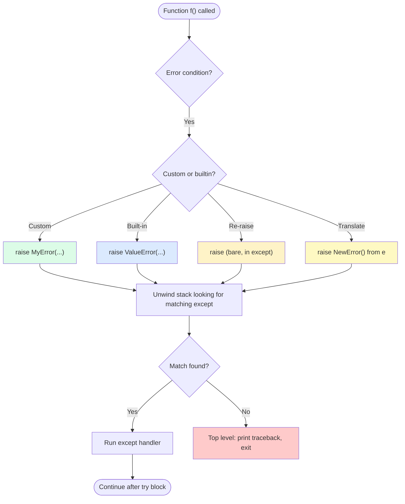

# 2. raise and Custom Exceptions

> [!note] Why this note exists
> Catching exceptions is half the story; **raising** them is the other half. Raising an exception well means choosing the right type, writing a useful message, and chaining it to the underlying cause so debugging is possible. Custom exception classes are how you build a typed error API for your library or application — `UserNotFoundError`, `RateLimitExceeded`, `InvalidConfigError`. This note covers the `raise` statement, exception chaining (`raise X from e`, `raise X from None`), when to write custom exceptions, how to design exception hierarchies, and the patterns that make your error API a pleasure to use.

## Why It Matters

Consider a library that fetches user data:

```python
def get_user(uid: str) -> User:
    response = http.get(f"https://api.example.com/users/{uid}")
    if response.status_code == 404:
        raise Exception("not found")    # BAD: generic, untyped
    if response.status_code != 200:
        raise Exception("error")        # BAD: no info
    return User.from_json(response.json())
```

Callers can't distinguish "user doesn't exist" from "server error" from "network failed" — they have to parse the string. Compare:

```python
class UserNotFoundError(Exception):
    pass

class APIError(Exception):
    def __init__(self, status_code, message):
        super().__init__(f"API error {status_code}: {message}")
        self.status_code = status_code

def get_user(uid: str) -> User:
    try:
        response = http.get(f"https://api.example.com/users/{uid}")
    except http.NetworkError as e:
        raise APIError(0, "network failure") from e
    if response.status_code == 404:
        raise UserNotFoundError(uid)
    if response.status_code != 200:
        raise APIError(response.status_code, response.text)
    return User.from_json(response.json())
```

Now callers can:

```python
try:
    user = get_user(uid)
except UserNotFoundError:
    show_404_page()
except APIError as e:
    if e.status_code == 429:
        show_rate_limit_page()
    else:
        raise   # re-raise unexpected API errors
```

The typed API lets callers handle errors precisely. The chaining (`from e`) preserves the original network error in the traceback. The custom message includes the status code as an attribute — accessible programmatically, not just as a string.

This is the difference between "I raise exceptions" and "I designed an error API". This note covers the latter.

## Background

### What `raise` does

`raise` is a statement that creates and throws an exception. Forms:

```python
raise ExceptionClass("message")           # construct and raise
raise exception_instance                  # raise an existing instance
raise                                     # re-raise the current exception (only in except)
raise ExceptionClass("msg") from cause    # chain with another exception
raise ExceptionClass("msg") from None     # explicitly suppress chaining
```

`raise` unwinds the call stack looking for the nearest matching `except`. If none is found, the interpreter prints the traceback and exits.

### Exception classes are regular classes

An exception class is any class that inherits (directly or indirectly) from `BaseException`. By convention, custom exceptions inherit from `Exception` (not `BaseException` — the latter is for system-level things like `KeyboardInterrupt` that should usually propagate).

```python
class MyError(Exception):
    pass

raise MyError("something went wrong")
```

That's the minimum. The exception class inherits `__init__`, `__str__`, `args`, `__traceback__`, and all the standard exception machinery from `Exception`.

### Why use custom exceptions

1. **Typed error handling.** Callers can `except UserNotFoundError:` rather than parsing a string.
2. **Structured information.** Custom `__init__` can store typed attributes (`status_code`, `uid`, `error_code`) accessible programmatically.
3. **Hierarchy.** `class UserNotFoundError(APIError):` lets callers catch either the specific type or the broader `APIError`.
4. **Documentation.** `raise UserNotFoundError(uid)` reads as documentation. `raise Exception("user not found")` doesn't.
5. **Stable API.** If you change the message string, callers' code doesn't break. If you change the exception type, that's an API change you should think about.

## Main Content

### The `raise` statement

```python
# Basic
raise ValueError("invalid input")

# Raise an existing instance
err = ValueError("invalid input")
raise err

# Re-raise (only inside an except block)
try:
    ...
except SomeError:
    log.error("failed")
    raise    # re-raises the same SomeError, with original traceback

# Re-raise with extra context (chained)
try:
    ...
except SomeError as e:
    raise MyError("better message") from e    # explicit chaining

# Suppress chaining
try:
    ...
except SomeError:
    raise MyError("clean message") from None  # no "during handling of..."
```

### Exception chaining: `from e` vs `from None` vs implicit

Python 3 introduced **exception chaining**. When you raise a new exception inside an `except` block, Python automatically attaches the original exception as the `__context__`:

```python
try:
    1 / 0
except ZeroDivisionError:
    raise ValueError("bad calculation")
# Traceback shows:
# ValueError: bad calculation
#
# During handling of the above exception, another exception occurred:
# ...
# ZeroDivisionError: division by zero
```

This is **implicit chaining** — Python does it automatically via `__context__`. The traceback shows "During handling of the above exception...".

**Explicit chaining** with `from e` sets `__cause__` instead. The traceback shows "The above exception was the direct cause of...":

```python
try:
    response = http.get(url)
except http.NetworkError as e:
    raise APIError("network failure") from e
# Traceback shows:
# APIError: network failure
#
# The above exception was the direct cause of...
# http.NetworkError: ...
```

**Suppressing** with `from None` clears the chain:

```python
try:
    value = parse(s)
except ValueError:
    raise ValidationError("bad input") from None
# Traceback shows only ValidationError, no "During handling..."
```

Use `from None` when the original exception adds no information (e.g., translating `KeyError` to `ConfigError: missing key` — the KeyError is noise).

### When to write a custom exception

Write a custom exception when:
- You're building a library or application with a defined error API.
- Callers will want to handle specific failures differently.
- The error carries structured data (status codes, error codes, failing fields).
- A bare `Exception` or built-in type doesn't communicate intent.

**Don't** write a custom exception when:
- The error is a programming bug (use `TypeError`, `ValueError`, `AssertionError`).
- The error is a one-off and callers won't catch it specifically.
- A built-in type fits perfectly (`FileNotFoundError`, `PermissionError`, `KeyError`).

### Designing exception classes

#### Simple marker class

```python
class UserNotFoundError(Exception):
    """Raised when a user lookup fails."""
    pass
```

That's it. The class name is the documentation. Callers can catch it specifically.

#### With structured data

```python
class ValidationError(Exception):
    def __init__(self, field: str, message: str, code: str = "invalid"):
        self.field = field
        self.message = message
        self.code = code
        super().__init__(f"{field}: {message} (code={code})")

raise ValidationError("email", "invalid format", code="bad_email")
```

Always call `super().__init__(...)` so `args` and `__str__` work correctly.

#### With hierarchy

```python
class AppError(Exception):
    """Base class for all application errors."""

class DatabaseError(AppError):
    """Database-related errors."""

class ConnectionError(DatabaseError):
    """Can't connect to the database."""

class QueryError(DatabaseError):
    """Query failed (syntax, constraint, etc.)."""

class UniqueViolationError(QueryError):
    """Specifically: a UNIQUE constraint was violated."""
```

Callers can catch at any level:

```python
try:
    db.insert(user)
except UniqueViolationError:
    return "username taken"
except QueryError as e:
    log.error("query failed: %s", e)
    return "internal error"
except DatabaseError:
    return "database unavailable"
except AppError:
    return "application error"
```

#### With default attributes

```python
class HTTPError(Exception):
    default_status = 500
    default_message = "Internal Server Error"

    def __init__(self, message=None, status=None):
        self.message = message or self.default_message
        self.status = status or self.default_status
        super().__init__(self.message)

class NotFoundError(HTTPError):
    default_status = 404
    default_message = "Not Found"

class RateLimitError(HTTPError):
    default_status = 429
    default_message = "Too Many Requests"
```

### Exception raising flow



### Choosing the right built-in

If a built-in type fits, prefer it over a custom class. Common choices:

| Built-in | When to use |
|----------|-------------|
| `ValueError` | Right type, wrong value (`int("abc")`) |
| `TypeError` | Wrong type (`len(42)`) |
| `KeyError` | Dict key missing |
| `IndexError` | List index out of range |
| `AttributeError` | Attribute missing |
| `FileNotFoundError` | File doesn't exist |
| `PermissionError` | Permission denied |
| `NotImplementedError` | Method stub that subclasses must override |
| `RuntimeError` | "Shouldn't happen" errors that aren't a bug per se |
| `StopIteration` | Iterator exhausted (raised by `next()` typically) |

See [[3. Exception Hierarchy]] for the full list.

### Custom exception patterns

#### Translation pattern

```python
def get_user(uid: str) -> User:
    try:
        row = db.execute("SELECT * FROM users WHERE id = ?", uid).fetchone()
    except db.OperationalError as e:
        raise ServiceUnavailableError("database error") from e
    if row is None:
        raise UserNotFoundError(uid)
    return User.from_row(row)
```

Translate low-level errors into your application's typed errors. Chain with `from e` to preserve the cause.

#### Validation pattern

```python
def validate_email(s: str) -> str:
    if not isinstance(s, str):
        raise TypeError("email must be a string")
    if "@" not in s:
        raise ValidationError("email", "missing @", code="no_at_sign")
    return s.lower()
```

#### State machine pattern

```python
class StateMachine:
    def transition(self, event):
        if self.state == "closed" and event == "open":
            self.state = "open"
        elif self.state == "open" and event == "close":
            self.state = "closed"
        else:
            raise InvalidTransitionError(self.state, event)
```

#### Sentinel pattern for "no value"

Don't use exceptions for this — use `None` or a sentinel object. Exceptions are for exceptional conditions.

### What to put in the message

- **What** went wrong, in plain English.
- **What value** caused it (truncate long values).
- **What was expected** (if relevant).
- **Where** it happened (the function name is usually in the traceback — don't repeat it).

```python
# BAD
raise Exception("error")

# OK
raise ValueError("invalid input")

# GOOD
raise ValueError(f"expected positive int, got {value!r}")
```

The `!r` (repr) is important — it shows the type and quoting, which helps distinguish `1` from `"1"`.

### `__str__` and `__repr__`

By default, `str(exception)` returns the constructor argument(s). If you want a custom representation:

```python
class ValidationError(Exception):
    def __init__(self, field, message, code):
        self.field = field
        self.message = message
        self.code = code
        super().__init__(message)   # this becomes str(e)

    def __str__(self):
        return f"[{self.code}] {self.field}: {self.message}"
```

### Pickling support

If your exceptions might be pickled (e.g., for `multiprocessing`), make sure `__reduce__` works. The easiest way: pass all attributes to `super().__init__`:

```python
class ValidationError(Exception):
    def __init__(self, field, message, code="invalid"):
        self.field = field
        self.message = message
        self.code = code
        super().__init__(field, message, code)   # all in args — picklable
```

## Code Examples

### Example 1: Library error API

```python
# mylib/errors.py
class MyLibError(Exception):
    """Base class for all mylib errors."""

class ConfigError(MyLibError):
    def __init__(self, key, reason):
        self.key = key
        self.reason = reason
        super().__init__(f"config error: {key!r}: {reason}")

class RateLimitError(MyLibError):
    def __init__(self, retry_after):
        self.retry_after = retry_after
        super().__init__(f"rate limited; retry after {retry_after}s")

# mylib/client.py
class Client:
    def get(self, url):
        try:
            response = self._http.get(url)
        except OSError as e:
            raise MyLibError(f"network failure: {e}") from e
        if response.status == 429:
            raise RateLimitError(int(response.headers.get("Retry-After", 60)))
        if response.status >= 400:
            raise MyLibError(f"HTTP {response.status}")
        return response.body
```

### Example 2: Validation with structured errors

```python
class FieldError(Exception):
    def __init__(self, field, message, code):
        self.field = field
        self.message = message
        self.code = code
        super().__init__(f"{field}: {message}")

def validate_user(data: dict):
    errors = []
    if not data.get("email"):
        errors.append(FieldError("email", "required", "missing"))
    elif "@" not in data["email"]:
        errors.append(FieldError("email", "invalid format", "bad_format"))
    if not data.get("age") or data["age"] < 0:
        errors.append(FieldError("age", "must be non-negative", "invalid"))
    if errors:
        raise ValidationErrorList(errors)
    return True
```

### Example 3: Translating exceptions

```python
def load_config(path):
    try:
        with open(path, encoding="utf-8") as f:
            return json.load(f)
    except FileNotFoundError as e:
        raise ConfigError("config_file", f"missing: {path}") from e
    except json.JSONDecodeError as e:
        raise ConfigError("config_format", f"invalid JSON at line {e.lineno}") from e
    except PermissionError as e:
        raise ConfigError("config_permission", "can't read file") from e
```

### Example 4: Suppressing chain when noise

```python
def parse_int(s: str) -> int:
    try:
        return int(s)
    except ValueError:
        raise ValidationError(f"not an integer: {s!r}") from None
        # ValueError adds no info — suppress it
```

### Example 5: Conditional raise

```python
def assert_positive(n):
    if n < 0:
        raise ValueError(f"expected positive, got {n}")
    return n
```

### Example 6: Re-raise with extra logging

```python
def call_api():
    try:
        return http.get(url).json()
    except http.HTTPError as e:
        log.warning("API call failed: %s", e)
        raise    # re-raise so caller can handle
```

### Example 7: Exception with rich attributes and `__cause__`

```python
class RetryableError(Exception):
    """An error that callers may want to retry."""
    def __init__(self, message, *, retry_after=None, attempts_left=0):
        super().__init__(message)
        self.retry_after = retry_after        # seconds, or None
        self.attempts_left = attempts_left

    @property
    def can_retry(self):
        return self.attempts_left > 0

def call_with_retry(fn, *, retries=3):
    last_exc = None
    for attempt in range(retries):
        try:
            return fn()
        except (ConnectionError, TimeoutError) as e:
            last_exc = e
            if attempt == retries - 1:
                break
            time.sleep(2 ** attempt)
    raise RetryableError(
        f"failed after {retries} attempts",
        retry_after=2 ** retries,
        attempts_left=0,
    ) from last_exc

# Caller code:
try:
    result = call_with_retry(fetch)
except RetryableError as e:
    if e.can_retry:
        schedule_later(e.retry_after)
    else:
        raise
```

The `RetryableError` carries actionable data (`retry_after`, `attempts_left`) and chains the underlying network error via `from last_exc`, so a developer reading the traceback sees both the high-level intent ("retry exhausted") and the low-level cause (`ConnectionRefusedError`).

### Exception chaining deep-dive

Python's traceback printing uses three attributes on the exception object:

| Attribute | Set by | Traceback shows |
|-----------|--------|------------------|
| `__cause__` | `raise X from e` (explicit) | "The above exception was the direct cause of..." |
| `__context__` | Implicit — raised inside `except` | "During handling of the above exception, another exception occurred:" |
| `__suppress_context__` | `raise X from None` | (suppresses the `__context__` print) |

When you write `raise X from e`, Python sets `X.__cause__ = e` and `X.__suppress_context__ = True`. When you write `raise X` inside an `except`, Python sets `X.__context__ = e` (the currently-handled exception). When you write `raise X from None`, Python sets `X.__suppress_context__ = True` and leaves `__cause__` as `None`.

```python
try:
    1 / 0
except ZeroDivisionError:
    raise ValueError("bad")

# ValueError.__context__ is the ZeroDivisionError
# ValueError.__cause__ is None
# ValueError.__suppress_context__ is False
# Traceback prints "During handling of..."
```

```python
try:
    1 / 0
except ZeroDivisionError as e:
    raise ValueError("bad") from e

# ValueError.__cause__ is the ZeroDivisionError
# ValueError.__suppress_context__ is True
# Traceback prints "The above exception was the direct cause of..."
```

```python
try:
    1 / 0
except ZeroDivisionError:
    raise ValueError("bad") from None

# ValueError.__cause__ is None
# ValueError.__suppress_context__ is True
# Traceback shows only ValueError
```

Use `from e` when the original exception is meaningful (it explains *why* the new one happened). Use `from None` when the original is noise (e.g., translating `KeyError("db")` to `ConfigError("missing db key")` — the `KeyError` adds nothing).

### Designing exception hierarchies for libraries

A well-designed library has a single base exception class, with subclasses for each error category:

```python
# mylib/errors.py
class MyLibError(Exception):
    """Base class for all mylib errors."""

class ConfigError(MyLibError):
    """Configuration is missing or invalid."""

class AuthError(MyLibError):
    """Authentication or authorization failed."""

class RateLimitError(MyLibError):
    """API rate limit was exceeded."""
    def __init__(self, message, retry_after):
        super().__init__(message)
        self.retry_after = retry_after

class APIError(MyLibError):
    """Generic API error from the server."""
    def __init__(self, message, status_code):
        super().__init__(message)
        self.status_code = status_code

class NotFoundError(APIError):
    """Resource was not found (HTTP 404)."""
    def __init__(self, resource, id):
        super().__init__(f"{resource} {id!r} not found", 404)
        self.resource = resource
        self.id = id
```

Callers can choose their level of granularity:

```python
try:
    client.get_user(uid)
except NotFoundError as e:
    # Most specific — only 404s
    show_404(e.resource, e.id)
except RateLimitError as e:
    # Specific — only rate limits
    schedule_retry(e.retry_after)
except APIError as e:
    # Broader — any HTTP error
    log.error("API error %d: %s", e.status_code, e)
except MyLibError:
    # Broadest — anything mylib raises
    log.exception("mylib failure")
```

The hierarchy gives callers flexibility while still letting them "catch all mylib errors" if they want a single fallback.

### When NOT to use custom exceptions

- **Programming bugs**: `TypeError`, `ValueError`, `AssertionError` — these should crash loudly so developers find them.
- **Standard library has a perfect fit**: `FileNotFoundError`, `PermissionError`, `KeyError`, `NotImplementedError` — use the built-in.
- **One-off scripts**: a custom exception class adds ceremony without value if you're never going to `except` it specifically.
- **Performance-critical inner loops**: a custom exception class with extra attributes is slightly slower to construct than a plain `ValueError`. Use the cheapest exception type that fits.

### The "exception as control flow" anti-pattern (and how to refactor)

Sometimes you see code like:

```python
def find_user(uid):
    for row in db.all_users():
        if row.id == uid:
            raise FoundUser(row)
    raise NotFoundError(uid)
```

This is wrong. Exceptions are for **exceptional** conditions; finding a user in a loop is normal flow. Refactor to:

```python
def find_user(uid):
    for row in db.all_users():
        if row.id == uid:
            return row
    raise NotFoundError(uid)    # exceptional — no user with that id
```

Use `return` for success, `raise` for failure. Never `raise` to signal "I found it".

### Testing exceptions with pytest

```python
import pytest

def test_invalid_email_raises():
    with pytest.raises(ValidationError, match="missing @"):
        validate_email("no-at-sign")

def test_user_not_found():
    with pytest.raises(UserNotFoundError) as exc_info:
        get_user("nonexistent-id")
    assert exc_info.value.uid == "nonexistent-id"

def test_chained_cause():
    with pytest.raises(ConfigError) as exc_info:
        load_config("/bad")
    assert isinstance(exc_info.value.__cause__, FileNotFoundError)

def test_custom_attributes():
    with pytest.raises(RateLimitError) as exc_info:
        client.call()
    assert exc_info.value.retry_after > 0
```

`pytest.raises` is the idiomatic way to assert that an exception is raised, with optional `match=` for the message (regex) and `exc_info.value` to inspect the exception object.

## Common Pitfalls

> [!danger] Generic `raise Exception("msg")`
> Callers can't catch it specifically without catching everything. Always use a typed exception.

> [!danger] Custom exceptions inheriting from `BaseException` instead of `Exception`
> `BaseException` includes `KeyboardInterrupt` and `SystemExit`. Catching these by accident can hang your program. Inherit from `Exception` unless you have a specific reason.

> [!danger] Forgetting `super().__init__()` in custom exceptions
> Without it, `args`, `__str__`, and pickling all break. Always call `super().__init__(...)` with the message.

> [!danger] Using exceptions for normal control flow
> Don't raise `StopIteration` yourself — that's what `return` from a generator does. Don't raise `KeyError` to signal "not found" in your own API — use `Optional` / `None` or a sentinel.

> [!danger] `raise X from e` vs `raise X` inside an except
> Both attach `__context__` (implicit). Only `from e` sets `__cause__` (explicit). Use `from e` when the original is meaningful, `from None` when it's noise.

> [!danger] Catching your own custom exception too broadly
> If `MyLibError` is the base, callers might catch `MyLibError` to "handle everything" — masking bugs. Document which subtypes are expected vs. which are unexpected.

> [!danger] Putting too much in the exception message
> Don't dump the whole context — the traceback already shows the call stack. Just include the failing value and what was expected.

> [!danger] Mutable attributes on exception objects
> If you store a mutable object (list, dict) as an exception attribute, and someone catches and modifies it, you can get surprising behavior. Store immutable copies if it matters.

> [!danger] Raising in `__del__`
> Exceptions in `__del__` are silently swallowed (printed to stderr but not propagated). Don't rely on exceptions for cleanup logic.

## Tips and Tricks

- **Inherit from `Exception`, not `BaseException`** — keeps your errors catchable by `except Exception:`.
- **Use `raise X from e`** to chain when the cause is meaningful.
- **Use `raise X from None`** to suppress when the cause is noise (e.g., translating `KeyError` to `ConfigError`).
- **Name exceptions with the `Error` suffix** — `UserNotFound` is awkward; `UserNotFoundError` reads well.
- **Document your exception API** in the docstring of the raising function: `Raises: UserNotFoundError: if the user does not exist.`
- **Group exceptions in an `errors.py` module** — keeps the API surface clear.
- **Add a `code` attribute for machine-readable error codes** — useful for i18n and API responses.
- **For pickle support, pass all attributes to `super().__init__`** — needed for `multiprocessing`.
- **Use `!r` in messages** to make types clear: `f"got {value!r}"` shows `1` vs `"1"`.
- **Don't be afraid to raise built-in exceptions** when they fit — `ValueError`, `TypeError`, `FileNotFoundError` are good citizens.
- **Test that your exceptions are raised correctly** — `pytest.raises(MyError)`.
- **For application-wide error handling**, define a single base class (`AppError`) so a top-level handler can catch and log all your errors.

## Active Recall

1. What's the difference between `raise X`, `raise X from e`, and `raise X from None`?
2. When does Python implicitly chain exceptions (i.e., set `__context__`)?
3. Why should custom exceptions inherit from `Exception` and not `BaseException`?
4. Write a custom exception `ValidationError` that stores `field`, `message`, and `code` attributes.
5. Why is `raise Exception("error")` a bad practice? What's the alternative?
6. When should you use `from None` instead of `from e`?
7. Write a hierarchy of exceptions for a database library: `DatabaseError`, `ConnectionError`, `QueryError`, `UniqueViolationError`.
8. Why do you need to call `super().__init__()` in a custom exception?
9. Give an example of "translating" an exception from one type to another.
10. What's the issue with raising exceptions in `__del__`?
11. Why use `!r` in exception messages? Give an example.
12. How do you ensure your custom exception is picklable?
13. When is it appropriate to use a built-in exception vs. a custom one?
14. Write a function that catches a low-level exception, logs it, and re-raises with chained context.

## Next Steps

- [[1. try-except-finally]] — the catching side of the equation.
- [[3. Exception Hierarchy]] — the full tree of built-in exceptions; choose the right base class.
- [[4. Context Managers]] — for cleanup that pairs with raising.
- [[6. Files and Serialization/1. Reading and Writing Files]] — `FileNotFoundError`, `PermissionError` are common raise/catch targets.
- [[7. Modules and Packages/1. Modules and import]] — `ImportError` and `ModuleNotFoundError` for optional dependencies.
