# 3. Exception Hierarchy

> [!note] Why this note exists
> Python's exception hierarchy is a tree, not a flat list. Knowing the tree is what lets you catch at the right level: catch `OSError` to handle any I/O failure, or catch `FileNotFoundError` to handle only missing files. Catching too broadly (`Exception`) hides bugs; catching too narrowly (`FileNotFoundError` when the call could also raise `PermissionError`) leaves errors unhandled. This note covers the full hierarchy from `BaseException` down, the three "system" exceptions you should almost never catch (`SystemExit`, `KeyboardInterrupt`, `GeneratorExit`), the major categories under `Exception` (`ArithmeticError`, `LookupError`, `OSError`, `ValueError`, `TypeError`, etc.), and the rules for choosing the right level to catch.

## Why It Matters

Consider this code that opens a file:

```python
try:
    with open(path) as f:
        data = f.read()
except FileNotFoundError:
    print("file not found")
except OSError:
    print("some OS error")
```

The order matters because `FileNotFoundError` is a subclass of `OSError`. If you reverse the clauses, `FileNotFoundError` is never reached. This is the kind of mistake you make when you don't know the hierarchy.

A more subtle bug: catching `Exception` to handle "all errors":

```python
try:
    user_input = input(">")
except Exception:
    print("bad input")
```

This catches `KeyboardInterrupt`? No — `KeyboardInterrupt` inherits from `BaseException`, not `Exception`. So Ctrl-C still works. Good. But it catches `EOFError`, `OSError`, `ValueError`, and even `MemoryError`. If the user types Ctrl-D, you get `EOFError` — and you print "bad input" instead of exiting cleanly. Catching `Exception` is too broad.

The hierarchy is the map that tells you:
- What a given `except` will actually catch.
- What level to catch at when you want a specific kind of failure.
- Which exceptions are "fatal" and should propagate (system exceptions).

This note is your map.

## Background

### The root: `BaseException`

All exceptions inherit from `BaseException`. **Never catch `BaseException`** — that catches `SystemExit`, `KeyboardInterrupt`, and `GeneratorExit`, which you almost always want to propagate.

### The user-facing root: `Exception`

`Exception` is the root of all "ordinary" exceptions. Catching `Exception` catches everything except the three system exceptions. This is the broadest catch you should ever use, and even that is usually too broad.

### The three system exceptions

These inherit directly from `BaseException`, NOT from `Exception`:

- **`SystemExit`** — raised by `sys.exit()`. Propagates to the top level and exits with the given code.
- **`KeyboardInterrupt`** — raised when the user presses Ctrl-C (SIGINT).
- **`GeneratorExit`** — raised when a generator is closed (via `close()` or garbage collection).

```python
try:
    sys.exit(0)
except BaseException:    # catches SystemExit — usually wrong
    print("you can't escape!")
```

Don't catch these unless you really know what you're doing. Catching `KeyboardInterrupt` makes your program unkillable; catching `SystemExit` breaks `sys.exit()`.

### The hierarchy tree

```mermaid
flowchart TB
    Base["BaseException"]
    Base --> System["SystemExit"]
    Base --> Keyboard["KeyboardInterrupt"]
    Base --> Generator["GeneratorExit"]
    Base --> Exception["Exception"]
    Exception --> StopIter["StopIteration"]
    Exception --> StopAsyncIter["StopAsyncIteration"]
    Exception --> Arithmetic["ArithmeticError"]
    Arithmetic --> Zero["ZeroDivisionError"]
    Arithmetic --> Overflow["OverflowError"]
    Arithmetic --> Floating["FloatingPointError"]
    Exception --> Assert["AssertionError"]
    Exception --> Attribute["AttributeError"]
    Exception --> Buffer["BufferError"]
    Exception --> EOF["EOFError"]
    Exception --> Import["ImportError"]
    Import --> ModuleNotFound["ModuleNotFoundError"]
    Exception --> Lookup["LookupError"]
    Lookup --> Key["KeyError"]
    Lookup --> Index["IndexError"]
    Exception --> Memory["MemoryError"]
    Exception --> Name["NameError"]
    Name --> Unbound["UnboundLocalError"]
    Exception --> OS["OSError"]
    OS --> FileNotFound["FileNotFoundError"]
    OS --> Permission["PermissionError"]
    OS --> Interrupted["InterruptedError"]
    OS --> IsDir["IsADirectoryError"]
    OS --> NotDir["NotADirectoryError"]
    OS --> FileExists["FileExistsError"]
    OS --> Timeout["TimeoutError"]
    OS --> ProcessLookup["ProcessLookupError"]
    OS --> Connection["ConnectionError"]
    Connection --> ConnBroken["ConnectionAbortedError"]
    Connection --> ConnReset["ConnectionResetError"]
    Exception --> Ref["ReferenceError"]
    Exception --> Runtime["RuntimeError"]
    Runtime --> NotImpl["NotImplementedError"]
    Runtime --> Recursion["RecursionError"]
    Exception --> Stop["StopIteration"]
    Exception --> Syntax["SyntaxError"]
    Syntax --> Indent["IndentationError"]
    Indent --> Tab["TabError"]
    Exception --> SystemExit2["SystemError"]
    Exception --> Type["TypeError"]
    Exception --> Value["ValueError"]
    Value --> Unicode["UnicodeError"]
    Unicode --> Decode["UnicodeDecodeError"]
    Unicode --> Encode["UnicodeEncodeError"]
    Unicode --> Translate["UnicodeTranslateError"]
    Exception --> Warning["Warning"]
    Warning --> Deprecation["DeprecationWarning"]
    Warning --> Pending["PendingDeprecationWarning"]
    Warning --> RuntimeWarn["RuntimeWarning"]
    Warning --> SyntaxWarn["SyntaxWarning"]
    Warning --> UserWarn["UserWarning"]
    Warning --> Future["FutureWarning"]
    Warning --> Resource["ResourceWarning"]
    style Base fill:#fecaca
    style Exception fill:#dcfce7
    style System fill:#fef3c7
    style Keyboard fill:#fef3c7
    style Generator fill:#fef3c7
```



## Main Content

### Major categories under `Exception`

#### `ArithmeticError`

Math errors. Three subclasses:
- `ZeroDivisionError` — `1 / 0`.
- `OverflowError` — numeric overflow (rare in Python, but happens with `float` and large `int` conversions).
- `FloatingPointError` — almost never raised in practice (CPython doesn't raise it).

```python
try:
    result = a / b
except ZeroDivisionError:
    result = float('inf')
```

#### `LookupError`

Container lookup failures. Two common subclasses:
- `KeyError` — dict key missing.
- `IndexError` — sequence index out of range.

```python
try:
    value = d[key]
except KeyError:
    value = default

try:
    last = lst[len(lst) - 1]
except IndexError:
    last = None
```

#### `OSError` (the renamed `EnvironmentError`/`IOError`)

All operating-system errors. Since Python 3.3, `IOError`, `EnvironmentError`, `WindowsError`, `mmap.error`, `socket.error`, and `select.error` are all aliases for `OSError`. This is the most important category for I/O code.

Common subclasses:
- `FileNotFoundError` — file doesn't exist.
- `FileExistsError` — trying to create an existing file with `x` mode.
- `PermissionError` — permission denied.
- `IsADirectoryError` — expected file, got directory.
- `NotADirectoryError` — expected directory, got file.
- `TimeoutError` — OS-level timeout (different from `socket.timeout`).
- `InterruptedError` — system call interrupted (e.g., by signal).
- `ConnectionError` — network connection failure. Subclasses:
  - `ConnectionAbortedError`, `ConnectionResetError`, `ConnectionRefusedError`, `BrokenPipeError`.
- `ProcessLookupError` — process not found.
- `BlockingIOError` — would block in non-blocking mode.

`OSError` instances have a `.errno` attribute (the C `errno` value) and a `.strerror` attribute (the OS message):

```python
try:
    open("/etc/shadow")
except PermissionError as e:
    print(f"errno={e.errno}, strerror={e.strerror}")
    # errno=13, strerror=Permission denied
```

#### `ValueError` and `TypeError`

- `ValueError` — right type, wrong value: `int("abc")`, `math.sqrt(-1)`.
- `TypeError` — wrong type: `len(42)`, `"x" + 1`.

These are the two most common "programming" errors. Usually you **don't catch them** — they indicate bugs that should propagate. But sometimes you do:

```python
try:
    value = int(user_input)
except ValueError:
    print("please enter a number")
```

#### `UnicodeError`

Subclass of `ValueError`. Three subclasses:
- `UnicodeDecodeError` — `b"\xff".decode("utf-8")`.
- `UnicodeEncodeError` — `"\xff".encode("ascii")`.
- `UnicodeTranslateError` — rare.

```python
try:
    text = data.decode("utf-8")
except UnicodeDecodeError as e:
    print(f"bad bytes at position {e.start}")
```

#### `ImportError` and `ModuleNotFoundError`

- `ModuleNotFoundError` (subclass of `ImportError`) — the module doesn't exist.
- `ImportError` — module exists but couldn't be imported (bad code inside, missing attribute).

```python
try:
    import cyaml as yaml
except ImportError:
    import yaml
```

`ModuleNotFoundError` was added in Python 3.6 to let you distinguish "module doesn't exist" from "module exists but import failed".

#### `AttributeError`

Attribute access on an object that doesn't have it: `None.something`. Usually a bug, but can be caught for "duck typing with fallback":

```python
try:
    value = obj.value
except AttributeError:
    value = compute_default()
# Better: value = getattr(obj, 'value', compute_default())
```

#### `RuntimeError`

"Shouldn't happen" errors. Two important subclasses:
- `NotImplementedError` — abstract method that subclasses must override.
- `RecursionError` — recursion limit exceeded.

```python
class AbstractBase:
    def do_thing(self):
        raise NotImplementedError("subclasses must implement do_thing")
```

#### `StopIteration` and `StopAsyncIteration`

Used internally by the iteration protocol. **Don't raise manually** — use `return` from a generator. Don't catch unless you're implementing an iterator manually.

#### `EOFError`

Raised by `input()` when the user presses Ctrl-D (EOF). Catch this for clean shutdown of interactive programs.

#### `NameError` and `UnboundLocalError`

`NameError` — name not in scope. `UnboundLocalError` (subclass) — local variable referenced before assignment. **Always a bug**; never catch.

#### `MemoryError`

Out of memory. You can try to catch this for emergency cleanup, but usually it's too late — the program is already dying.

#### `SyntaxError` and `IndentationError`

Raised at parse time. You can't catch these in the same file (the file won't even compile). Useful for catching in `compile()` or `eval()` of user-supplied code:

```python
try:
    code = compile(user_input, "<string>", "exec")
except SyntaxError as e:
    print(f"Syntax error at line {e.lineno}: {e.msg}")
```

#### `Warning` (subclass of `Exception`)

Warnings are not errors — they're advisory messages. Don't catch with `except`; use `warnings.filterwarnings` instead. Subclasses:
- `DeprecationWarning` / `PendingDeprecationWarning` — for library maintainers.
- `UserWarning` — for end-user code.
- `RuntimeWarning` — runtime dubieties.
- `SyntaxWarning` / `FutureWarning` / `ResourceWarning` / `BytesWarning` / `ImportWarning` / `UnicodeWarning`.

### Catching at the right level

The hierarchy determines what an `except` catches:

```python
# Catches only FileNotFoundError
except FileNotFoundError:

# Catches all OSError subclasses (file, socket, pipe, etc.)
except OSError:

# Catches all Exception subclasses (almost everything)
except Exception:

# Catches everything (DON'T — includes KeyboardInterrupt)
except BaseException:

# Catches everything (DON'T — same as bare except)
except:
```

**Rules:**

1. Catch the **most specific** type that covers the failures you expect.
2. Order clauses from **most specific to least specific** (subclasses before superclasses).
3. Don't catch `BaseException` or use bare `except:` — you'll swallow `KeyboardInterrupt`.
4. Catch `Exception` only at the top level for "log and continue" — never in business logic.

### Common catch patterns

```python
# "Handle missing file specifically, other OS errors generically"
try:
    open(path)
except FileNotFoundError:
    create_default()
except OSError as e:
    log.error("can't open %s: %s", path, e)
    raise

# "Try the fast version, fall back to slow"
try:
    import cjson as json
except ImportError:
    import json

# "Parse user input, fall back to default"
try:
    n = int(input(">"))
except ValueError:
    n = 0

# "Network failure — retry"
for attempt in range(3):
    try:
        return api.call()
    except ConnectionError:
        if attempt == 2:
            raise
        time.sleep(2 ** attempt)
```

### What NOT to catch

- **`KeyboardInterrupt`** — let it propagate; the user wants the program to stop.
- **`SystemExit`** — let it propagate; `sys.exit()` should exit.
- **`GeneratorExit`** — internal mechanism; never catch.
- **`MemoryError`** — usually unrecoverable; catching doesn't help.
- **`SyntaxError`** at the same-file level — you can't; the file won't compile.
- **Bugs** — `AttributeError`, `TypeError`, `NameError` from typos should propagate so you find them. (Don't catch `AttributeError` from `obj.attr` if `obj` shouldn't be `None` — fix the bug.)

### Exception attributes

Many exceptions carry useful attributes:

```python
# OSError: .errno, .strerror, .filename
try:
    open("/nonexistent")
except OSError as e:
    print(e.errno, e.strerror, e.filename)

# UnicodeDecodeError: .encoding, .object, .start, .end, .reason
try:
    b"\xff".decode("utf-8")
except UnicodeDecodeError as e:
    print(e.start, e.end, e.reason)

# SyntaxError: .msg, .lineno, .offset, .text, .filename
try:
    compile("def", "<x>", "exec")
except SyntaxError as e:
    print(e.lineno, e.msg)

# ImportError: .name, .path
try:
    from missing_module import x
except ImportError as e:
    print(e.name)
```

Use these for richer error reporting.

### `args` on an exception

Every exception has `args` — the tuple of arguments passed to the constructor:

```python
e = ValueError("bad value", 42)
e.args          # ('bad value', 42)
str(e)          # "('bad value", 42)'
```

By convention, `str(e)` returns the first arg, but if you pass multiple args they all show up. Custom exceptions can override `__str__`.

## Code Examples

### Example 1: Layered OS error handling

```python
def read_file(path: str) -> str:
    try:
        with open(path, encoding="utf-8") as f:
            return f.read()
    except FileNotFoundError:
        return ""
    except PermissionError:
        raise PermissionError(f"can't read {path} — check permissions") from None
    except IsADirectoryError:
        raise ValueError(f"{path} is a directory, not a file") from None
    except OSError as e:
        # Catch-all for unusual OS errors
        raise RuntimeError(f"unexpected I/O error: {e}") from e
```

### Example 2: Optional dependency

```python
try:
    import ujson as json
except ImportError:
    import json
```

`ModuleNotFoundError` would also work here, but `ImportError` is the traditional form and works on all Python versions.

### Example 3: Network retry with hierarchy

```python
import time

def fetch_with_retry(url, retries=3):
    last_error = None
    for attempt in range(retries):
        try:
            return http.get(url)
        except ConnectionRefusedError:
            # Specific: server not running
            time.sleep(2 ** attempt)
        except ConnectionError as e:
            # Broader: any connection issue
            last_error = e
            time.sleep(2 ** attempt)
        except TimeoutError:
            # Specific: timed out
            time.sleep(2 ** attempt)
    raise RuntimeError(f"failed after {retries} retries") from last_error
```

### Example 4: Parse error reporting

```python
def parse_config(text):
    try:
        return json.loads(text)
    except json.JSONDecodeError as e:
        raise ConfigError(f"bad JSON at line {e.lineno} col {e.colno}: {e.msg}") from e
```

`JSONDecodeError` is a subclass of `ValueError`, so callers can catch `ValueError` for general parse failures or `JSONDecodeError` for specific handling.

### Example 5: Top-level error handler

```python
def main():
    try:
        run_app()
    except KeyboardInterrupt:
        print("\ninterrupted")
        return 130
    except Exception:
        logging.exception("unhandled error")
        return 1

if __name__ == "__main__":
    sys.exit(main())
```

`KeyboardInterrupt` is caught separately (it's not an `Exception`). Other exceptions are logged and the program exits with code 1.

### Example 6: Inspecting exceptions programmatically

```python
def classify_error(exc: BaseException) -> str:
    """Map any exception to a user-facing category string."""
    if isinstance(exc, (FileNotFoundError,)):
        return "missing-file"
    if isinstance(exc, PermissionError):
        return "permission-denied"
    if isinstance(exc, ConnectionError):
        return "network-error"
    if isinstance(exc, TimeoutError):
        return "timeout"
    if isinstance(exc, OSError):
        return "io-error"          # catch-all OS bucket
    if isinstance(exc, ValueError):
        return "bad-input"
    if isinstance(exc, TypeError):
        return "bug"               # probably a programming error
    if isinstance(exc, KeyboardInterrupt):
        return "cancelled"
    return "unknown"

try:
    do_work()
except BaseException as e:        # OK at top level — we discriminate explicitly
    category = classify_error(e)
    log.error("operation failed: category=%s detail=%r", category, e)
    raise
```

Note that `isinstance` checks work because subclasses match their superclasses: a `FileNotFoundError` is an `OSError`, which is an `Exception`. Order the checks from most-specific to least-specific.

### Exception hierarchies in third-party libraries

Many popular libraries follow the "single base class + subclasses" pattern. Knowing these hierarchies lets you write more targeted exception handling:

| Library | Base class | Common subclasses |
|---------|-----------|-------------------|
| `requests` | `requests.RequestException` | `ConnectionError`, `Timeout`, `HTTPError`, `TooManyRedirects` |
| `sqlalchemy` | `SQLAlchemyError` | `DBAPIError`, `IntegrityError`, `OperationalError`, `DataError` |
| `psycopg` | `psycopg.Error` | `DatabaseError`, `OperationalError`, `IntegrityError`, `ProgrammingError` |
| `urllib3` | `HTTPError` | `PoolError`, `RequestError`, `MaxRetryError` |
| `pytest` | `UsageError`, `Collector.CollectError` | (no single base — pytest is special) |

For example, in `requests`:

```python
import requests

try:
    resp = requests.get(url, timeout=10)
except requests.ConnectionError:
    # Network-level failure (DNS, refused, etc.)
    log.warning("can't reach %s", url)
except requests.Timeout:
    # Server didn't respond in time
    log.warning("timeout for %s", url)
except requests.HTTPError as e:
    # Server responded with 4xx/5xx
    log.error("HTTP %d from %s", e.response.status_code, url)
except requests.RequestException:
    # Anything else from requests
    log.exception("requests failure")
```

### Subclassing built-ins for richer errors

You can subclass a built-in exception to add structured data while still letting callers catch the parent type:

```python
class InvalidConfigError(ValueError):
    """A config value is invalid — inherits from ValueError for backward compat."""
    def __init__(self, key, value, expected):
        self.key = key
        self.value = value
        self.expected = expected
        super().__init__(
            f"invalid value {value!r} for {key!r}; expected {expected}"
        )

def load_config(d):
    if d.get("port", 0) < 0:
        raise InvalidConfigError("port", d["port"], "non-negative int")
    return d

# Caller can catch either the specific type or the parent:
try:
    cfg = load_config(d)
except InvalidConfigError as e:
    print(f"bad key {e.key}: {e.value} (expected {e.expected})")
except ValueError:
    # Catches any ValueError, including InvalidConfigError
    print("config has invalid value")
```

This is the recommended pattern when your library's errors are conceptually a kind of `ValueError` or `OSError`. It lets existing code that catches the parent type continue to work.

### The `__notes__` attribute (Python 3.11+)

Python 3.11 added `__notes__` to `BaseException` — a list of strings appended to the traceback:

```python
try:
    process(user)
except Exception as e:
    e.add_note(f"user id was {user.id}")
    e.add_note(f"current state: {state}")
    raise
```

The traceback will print the notes after the exception message, which is helpful for adding context that the original exception didn't carry. This is especially useful for `ExceptionGroup` instances, where each exception in the group can have its own notes.

### Mapping C `errno` to Python exceptions

For low-level OS code, `os.strerror` and `errno` give you the OS-level error code. `OSError` subclasses know how to translate these:

```python
import errno

try:
    os.makedirs(path)
except OSError as e:
    if e.errno == errno.EEXIST:
        # Directory already exists — fine
        pass
    elif e.errno == errno.EACCES:
        raise PermissionError(f"can't create {path}") from e
    else:
        raise
```

Common `errno` constants: `ENOENT` (no such file), `EACCES` (permission denied), `EEXIST` (file exists), `EISDIR` (is a directory), `ENOTDIR` (not a directory), `EBUSY` (resource busy), `ENOSPC` (no space left on device).

## Common Pitfalls

> [!danger] Bare `except:` catches `KeyboardInterrupt`
> Use `except Exception:` instead. Bare `except:` is almost never right.

> [!danger] Catching `Exception` too broadly
> This masks bugs (`AttributeError` from typos). Catch specific types in business logic.

> [!danger] Wrong clause order
> `except OSError:` before `except FileNotFoundError:` — the second is unreachable. Subclasses first.

> [!danger] Catching `BaseException`
> Includes `SystemExit`, `KeyboardInterrupt`, `GeneratorExit`. Almost always wrong.

> [!danger] Confusing `IOError` and `OSError`
> They're the same thing since 3.3. `IOError` is an alias. Use `OSError`.

> [!danger] Catching `MemoryError`
> Usually the program is already doomed. Cleanup attempts often fail because there's no memory to allocate the cleanup objects.

> [!danger] Treating warnings as exceptions
> `Warning` inherits from `Exception`, but `except Warning:` won't catch them — warnings go through the `warnings` module, not the exception system. Use `warnings.catch_warnings()`.

> [!danger] `ImportError` vs `ModuleNotFoundError`
> `ModuleNotFoundError` is a 3.6+ subclass of `ImportError`. Use `ModuleNotFoundError` if you specifically need "module doesn't exist" — use `ImportError` if you also want to catch "module exists but failed to import".

> [!danger] `socket.timeout` vs `TimeoutError`
> Before 3.10, `socket.timeout` was an `OSError` subclass but not `TimeoutError`. Since 3.10, they're the same. If you need to support old Python, catch both: `except (TimeoutError, socket.timeout):`.

## Tips and Tricks

- **Catch the most specific exception** that covers the failures you expect.
- **Order clauses specific-to-general** — subclasses first.
- **`except Exception:`** is the right broad catch at top level only.
- **`OSError` is the I/O catch-all** — covers files, sockets, pipes, processes.
- **Check `e.errno`** for specific OS error codes (`errno.ENOENT` for "not found", etc.).
- **Use `ModuleNotFoundError`** for "missing module", `ImportError` for broader import issues.
- **For network code**, catch `ConnectionError` (covers refused, reset, aborted, broken pipe).
- **For parse code**, catch the specific parse error (`JSONDecodeError`, `csv.Error`) — they all inherit from `ValueError`.
- **`RuntimeError` is a catch-all** for "shouldn't happen" — prefer more specific types when possible.
- **`NotImplementedError`** for abstract methods, `AssertionError` for invariants.
- **Document what your function raises** — `Raises: ValueError: if input is negative.` in the docstring.
- **Custom exceptions should inherit from the right built-in** — `class MyDBError(OSError):` for DB I/O errors, `class MyParseError(ValueError):` for parse errors. This lets callers catch the built-in level too.
- **Test exception hierarchies** with `isinstance` — `assert issubclass(MyError, AppError)`.

## Active Recall

1. What's the root of the Python exception hierarchy? Why shouldn't you catch it?
2. Name the three exceptions that inherit from `BaseException` but not `Exception`.
3. Why does the order of `except` clauses matter?
4. What's the difference between `ImportError` and `ModuleNotFoundError`?
5. List three subclasses of `OSError`.
6. Why is catching `Exception` usually too broad?
7. What attributes does an `OSError` instance have?
8. How would you handle "missing file" vs "permission denied" differently?
9. What's the relationship between `IOError`, `EnvironmentError`, and `OSError`?
10. Why is `UnicodeDecodeError` a subclass of `ValueError`?
11. What is `Warning`'s parent class, and how do you handle it (if not with `except`)?
12. What's the issue with catching `MemoryError`?
13. Write a try/except that catches `KeyError` and `IndexError` together.
14. When should you catch `NotImplementedError`? (Trick question — explain.)

## Next Steps

- [[1. try-except-finally]] — the catching mechanics.
- [[2. raise and Custom Exceptions]] — designing your own typed exceptions, which inherit from this hierarchy.
- [[4. Context Managers]] — for cleanup that pairs with exception handling.
- [[6. Files and Serialization/1. Reading and Writing Files]] — `OSError` and its subclasses in action.
- [[7. Modules and Packages/1. Modules and import]] — `ImportError` / `ModuleNotFoundError` patterns.
