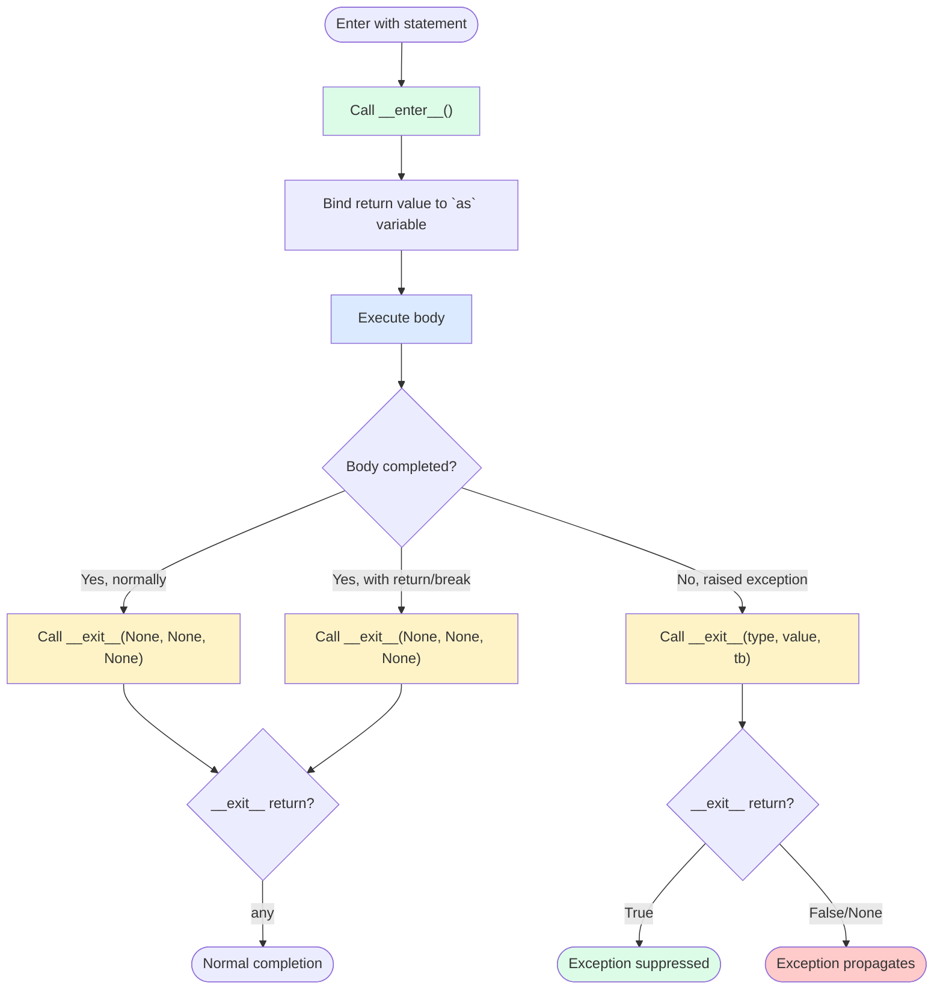

# 4. Context Managers

> [!note] Why this note exists
> The `with` statement is Python's answer to "I have a resource that needs setup and teardown, and I want to guarantee the teardown runs even if an exception is raised." Context managers are the protocol behind `with`. They replace the `try`/`finally` pattern with a single, declarative construct. This note covers the `__enter__`/`__exit__` protocol, the `contextlib.contextmanager` decorator for writing context managers as generators, the `ExitStack` for dynamic composition, and the `contextlib` utilities (`suppress`, `redirect_stdout`, `closing`, `nullcontext`). After this note, you should never write `f = open(...); try: ... finally: f.close()` again.

## Why It Matters

Consider this manual file handling:

```python
f = open(path)
try:
    data = f.read()
finally:
    f.close()
```

This is correct but verbose — and easy to forget. Beginners frequently write:

```python
f = open(path)
data = f.read()
f.close()    # never runs if read() raises — leaked file handle
```

The `with` statement makes the cleanup automatic and unmistakable:

```python
with open(path) as f:
    data = f.read()
# f is guaranteed closed here, no matter what happened.
```

But context managers go far beyond files. They're the right pattern for:
- **Locks** — `with lock:` acquires on enter, releases on exit.
- **Database transactions** — `with db.transaction():` commits on success, rolls back on exception.
- **Temp files / directories** — `with tempfile.NamedTemporaryFile() as f:` cleans up on exit.
- **Patched state** — `with mock.patch(...):` restores on exit.
- **Timing** — `with timer():` measures and logs on exit.
- **Redirected I/O** — `with redirect_stdout(buf):` captures prints.
- **Suppressed exceptions** — `with suppress(FileNotFoundError):` silently ignores specific errors.

The pattern is universal: any pair of "do X before, undo X after" can be a context manager. And the `@contextmanager` decorator makes it trivial to write your own — no class boilerplate needed.

## Background

### The `with` statement

```python
with expression as var:
    body
```

`expression` must evaluate to a **context manager** — an object with `__enter__` and `__exit__` methods. The protocol:

1. `expression` is evaluated, producing a context manager object.
2. `__enter__()` is called on the object. Its return value is bound to `var` (if `as var` is present).
3. The `body` is executed.
4. `__exit__(exc_type, exc_value, traceback)` is called:
   - If the body completed normally, all three arguments are `None`.
   - If the body raised, the three arguments are the exception's type, value, and traceback.
5. If `__exit__` returns `True`, the exception is suppressed (does not propagate).
6. If `__exit__` returns `None` or `False`, the exception propagates.

### The `__enter__`/`__exit__` protocol

```python
class MyContext:
    def __enter__(self):
        print("setup")
        return self    # or any value to bind with `as`

    def __exit__(self, exc_type, exc_value, traceback):
        print("teardown")
        # If exc_type is not None, an exception was raised in the body.
        # Return True to suppress, False/None to propagate.
        return False
```

```python
with MyContext() as x:
    print("body")
# Output:
# setup
# body
# teardown
```

### Why this is better than `try`/`finally`

1. **Cleanup is guaranteed** — even on `return`, `break`, `continue`, or unhandled exceptions.
2. **Cleanup is right next to the resource acquisition** — no temporal separation.
3. **Cleanup can't be forgotten** — the `with` block makes it syntactically required.
4. **Cleanup runs in the right order** — nested `with` blocks exit in reverse order.
5. **Cleanup is composable** — multiple `with` blocks stack cleanly.

## Main Content

### Writing a context manager: class-based

```python
class Timer:
    def __enter__(self):
        import time
        self.start = time.perf_counter()
        return self

    def __exit__(self, exc_type, exc_value, tb):
        import time
        self.elapsed = time.perf_counter() - self.start
        return False    # don't suppress exceptions

# Usage
with Timer() as t:
    do_expensive_work()
print(f"took {t.elapsed:.3f}s")
```

### Writing a context manager: `@contextmanager` decorator

The `contextlib.contextmanager` decorator turns a generator into a context manager. Everything before `yield` is `__enter__`; the `yield` value is bound to `as`; everything after `yield` is `__exit__`:

```python
from contextlib import contextmanager
import time

@contextmanager
def timer():
    start = time.perf_counter()
    try:
        yield    # value yielded is bound to `as`, if any
    finally:
        elapsed = time.perf_counter() - start
        print(f"took {elapsed:.3f}s")

# Usage
with timer():
    do_expensive_work()
```

The `try`/`finally` is important: if the body raises, the exception is re-raised *inside* the generator at the `yield` point. The `finally` block ensures cleanup runs.

To pass a value out via `as`:

```python
@contextmanager
def open_db(path):
    db = connect(path)
    try:
        yield db
    finally:
        db.close()

with open_db("test.db") as db:
    db.execute("...")
```

### Suppressing exceptions in `__exit__`

```python
class IgnoreErrors:
    def __enter__(self):
        return self

    def __exit__(self, exc_type, exc_value, tb):
        if exc_type is not None:
            print(f"Suppressing {exc_type.__name__}")
            return True    # suppress!
        return False

with IgnoreErrors():
    raise ValueError("this will be swallowed")
# "Suppressing ValueError"
# Program continues normally.
```

Use this sparingly — usually you want exceptions to propagate. The standard `contextlib.suppress` is the right tool for the common case.

### Multiple context managers

Python 3.1+ allows multiple `with` items on one line:

```python
with open(input_path) as fin, open(output_path, "w") as fout:
    fout.write(fin.read())
```

Equivalent to nesting:

```python
with open(input_path) as fin:
    with open(output_path, "w") as fout:
        fout.write(fin.read())
```

Exit order is reverse of entry: `fout` exits first, then `fin`.

Python 3.10+ allows parenthesized multi-line `with`:

```python
with (
    open(input_path) as fin,
    open(output_path, "w") as fout,
    lock:
):
    ...
```

### `contextlib` utilities

#### `contextlib.suppress(*exceptions)`

```python
from contextlib import suppress

with suppress(FileNotFoundError):
    os.remove("tempfile")
# If FileNotFoundError is raised, it's silently suppressed.
# Any other exception propagates.
```

Cleaner than:

```python
try:
    os.remove("tempfile")
except FileNotFoundError:
    pass
```

#### `contextlib.redirect_stdout` / `redirect_stderr`

```python
from contextlib import redirect_stdout
import io

buf = io.StringIO()
with redirect_stdout(buf):
    print("this goes to buf, not stdout")
print(buf.getvalue())   # 'this goes to buf, not stdout\n'
```

Useful for testing code that uses `print`, or for capturing library output.

#### `contextlib.closing(thing)`

Calls `thing.close()` on exit. Useful for objects that have a `close()` method but aren't context managers themselves:

```python
from contextlib import closing
from urllib.request import urlopen

with closing(urlopen("http://example.com")) as response:
    html = response.read()
```

Most modern libraries (including `urllib.request` in 3.x) support `with` directly, so `closing` is less needed now.

#### `contextlib.nullcontext(enter_result=None)`

A no-op context manager that returns `enter_result` from `__enter__`. Useful as a default when a context manager is optional:

```python
def process(items, lock=None):
    cm = lock if lock else nullcontext()
    with cm:
        for item in items:
            ...
```

#### `contextlib.ExitStack`

For dynamic composition of context managers. Useful when the number of context managers is determined at runtime:

```python
from contextlib import ExitStack

files = []
with ExitStack() as stack:
    for path in paths:
        files.append(stack.enter_context(open(path)))
    # All files are now open; all will be closed when the `with` exits.
    process(files)
```

`ExitStack` also supports cleanup callbacks:

```python
with ExitStack() as stack:
    setup_step_1()
    stack.callback(teardown_step_1)
    setup_step_2()
    stack.callback(teardown_step_2)
    # Teardown runs in reverse order: teardown_step_2, then teardown_step_1.
```

### Context manager lifecycle



### Async context managers (`async with`)

Python 3.5+ has async context managers, used with `async with`. They implement `__aenter__` and `__aexit__` (coroutine methods):

```python
class AsyncTimer:
    async def __aenter__(self):
        self.start = time.perf_counter()
        return self

    async def __aexit__(self, exc_type, exc_value, tb):
        self.elapsed = time.perf_counter() - self.start
        return False

async def main():
    async with AsyncTimer() as t:
        await asyncio.sleep(1)
    print(f"took {t.elapsed:.3f}s")
```

`contextlib.asynccontextmanager` is the decorator equivalent.

## Code Examples

### Example 1: Custom file-like context manager

```python
from contextlib import contextmanager

@contextmanager
def atomic_write(path, mode="w", encoding="utf-8"):
    """Write to a temp file, then rename on success."""
    import os, tempfile
    dir = os.path.dirname(path) or "."
    fd, tmp = tempfile.mkstemp(dir=dir)
    try:
        with os.fdopen(fd, mode, encoding=encoding) as f:
            yield f
        os.replace(tmp, path)    # atomic on POSIX
    except BaseException:
        os.unlink(tmp)    # cleanup on error
        raise

# Usage
with atomic_write("important.txt") as f:
    f.write("data")
# File is either fully written or unchanged — no half-written state.
```

### Example 2: Database transaction

```python
@contextmanager
def transaction(conn):
    cur = conn.cursor()
    try:
        yield cur
        conn.commit()
    except Exception:
        conn.rollback()
        raise
    finally:
        cur.close()

# Usage
with transaction(conn) as cur:
    cur.execute("UPDATE users SET balance = balance - 100 WHERE id = 1")
    cur.execute("UPDATE users SET balance = balance + 100 WHERE id = 2")
# Commits on success, rolls back on any exception.
```

### Example 3: Lock with timeout

```python
import threading
from contextlib import contextmanager

@contextmanager
def acquire_timeout(lock, timeout):
    result = lock.acquire(timeout=timeout)
    if not result:
        raise TimeoutError(f"couldn't acquire lock in {timeout}s")
    try:
        yield
    finally:
        lock.release()

# Usage
lock = threading.Lock()
with acquire_timeout(lock, timeout=5):
    do_critical_section()
```

### Example 4: Stack of context managers

```python
from contextlib import ExitStack

def copy_all(src_paths, dst_dir):
    with ExitStack() as stack:
        srcs = [stack.enter_context(open(p)) for p in src_paths]
        dst = stack.enter_context(open(dst_dir / "combined.txt", "w"))
        for src in srcs:
            dst.write(src.read())
# All files closed at exit, even on exception.
```

### Example 5: Suppress specific exceptions

```python
from contextlib import suppress
import os

# Delete all of these files; ignore missing ones
for path in paths:
    with suppress(FileNotFoundError, PermissionError):
        os.unlink(path)
```

### Example 6: Capture stdout for testing

```python
from contextlib import redirect_stdout
import io

def test_greeting():
    buf = io.StringIO()
    with redirect_stdout(buf):
        print_greeting("Alice")
    assert buf.getvalue() == "Hello, Alice!\n"
```

### Example 7: Patch for testing

```python
from unittest.mock import patch

def test_get_user():
    with patch("myapp.api.http.get") as mock_get:
        mock_get.return_value.json.return_value = {"name": "Alice"}
        user = get_user(1)
        assert user.name == "Alice"
# http.get is automatically restored after the block.
```

### Example 8: `ExitStack` for dynamic cleanup

```python
from contextlib import ExitStack

def setup_resources(config):
    with ExitStack() as stack:
        stack.callback(lambda: print("cleaning up"))
        db = stack.enter_context(open_db(config.db))
        cache = stack.enter_context(open_cache(config.cache))
        if config.use_lock:
            lock = stack.enter_context(acquire_lock())
        # ... use db, cache, lock ...
# All cleanup runs in reverse order on exit.
```

### Example 9: State-restoring context manager

A common pattern: save some global state, restore it after the block — even if the body raises.

```python
import os

@contextmanager
def changed_env(name, value):
    """Temporarily set an environment variable."""
    old = os.environ.get(name)
    os.environ[name] = value
    try:
        yield
    finally:
        if old is None:
            del os.environ[name]
        else:
            os.environ[name] = old

# Usage
with changed_env("DATABASE_URL", "sqlite:///test.db"):
    run_tests()
# DATABASE_URL is restored to its original value (or unset) even if tests raise.
```

The same pattern works for `sys.path`, `sys.stdout`, `os.getcwd`, `signal.signal`, etc.

### Example 10: Reentrant context manager with depth tracking

Sometimes you want a context manager that's safe to nest:

```python
class Indent:
    """Print messages indented by nesting depth."""
    def __init__(self):
        self.depth = 0

    def __enter__(self):
        self.depth += 1
        return self

    def __exit__(self, *exc):
        self.depth -= 1
        return False

    def log(self, msg):
        print("  " * self.depth + msg)

indent = Indent()
with indent:
    indent.log("processing")
    with indent:
        indent.log("sub-task 1")
        indent.log("sub-task 2")
    indent.log("done")
# Output:
#   processing
#     sub-task 1
#     sub-task 2
#   done
```

### Context manager vs `try`/`finally` — decision guide

| Aspect | `with` | `try`/`finally` |
|--------|--------|-----------------|
| Cleanup guarantee | Yes | Yes |
| Recovery from errors | No (propagates) | Yes (with `except`) |
| Reusability | High — define once, use anywhere | Low — repeat every call site |
| Composability | Stacks cleanly with `with a, b, c:` | Nested `try`/`finally` is ugly |
| Verbosity | Minimal | More verbose |
| Conditional cleanup | Harder (need `ExitStack`) | Easy (conditional `finally`) |

Use `with` whenever the cleanup is unconditional. Use `try`/`finally` (or `try`/`except`/`finally`) when you need conditional recovery, multiple distinct exception types, or logic that doesn't fit the "enter/exit" model.

### The `@contextmanager` decorator internals

When you write:

```python
@contextmanager
def my_cm():
    setup()
    try:
        yield value
    finally:
        teardown()
```

…`contextlib.contextmanager` wraps your generator function in a class (`_GeneratorContextManager`) that implements `__enter__` and `__exit__`:

- `__enter__` calls `next(gen)` to advance to the `yield`, returning the yielded value.
- `__exit__(exc_type, exc_value, tb)` calls `gen.throw(exc_type, exc_value, tb)` if an exception was raised in the body (so the exception re-enters the generator at the `yield`), or `next(gen)` if the body completed normally (which raises `StopIteration`, caught silently).
- If the generator raises `StopIteration`, `__exit__` returns `True` (suppressing the body's exception). Otherwise it returns `False` (propagating).

This is why you must wrap `yield` in `try`/`finally`: the `finally` block runs when the exception is thrown back into the generator. Without it, cleanup is skipped on exceptions.

### Performance notes

- The `with` statement adds a small constant overhead (a function call to `__enter__` and `__exit__`).
- `@contextmanager` adds a generator creation + two `next()`/`throw()` calls per `with` — about 1-2 microseconds on CPython. For most code this is invisible; in tight inner loops (millions of iterations), consider an inlined `try`/`finally`.
- `contextlib.suppress` is slightly slower than a hand-written `try`/`except: pass` because it goes through the context-manager protocol. The difference is ~0.5 microseconds per use — not a real concern.

### Async context managers in practice

For `asyncio` code, use `async with` and `@asynccontextmanager`:

```python
from contextlib import asynccontextmanager
import asyncio

@asynccontextmanager
async def db_transaction(conn):
    await conn.execute("BEGIN")
    try:
        yield conn
        await conn.execute("COMMIT")
    except Exception:
        await conn.execute("ROLLBACK")
        raise

async def main():
    async with db_transaction(conn) as db:
        await db.execute("INSERT INTO users ...")
        await db.execute("INSERT INTO logs ...")
    # Commits on success; rolls back on any exception.
```

The semantics mirror the sync version: everything before `yield` is `__aenter__`; everything after `yield` is `__aexit__`. The `try`/`finally` rule still applies.

### Real-world examples from the standard library

Recognising the context managers already in the standard library saves you from reinventing them:

| Context manager | Module | Purpose |
|----------------|--------|---------|
| `open(path)` | built-in | File I/O with auto-close |
| `lock` | `threading` / `multiprocessing` | Mutual exclusion |
| `tempfile.NamedTemporaryFile()` | `tempfile` | Auto-deleted temp file |
| `tempfile.TemporaryDirectory()` | `tempfile` | Auto-deleted temp directory |
| `suppress(*exc)` | `contextlib` | Ignore specified exceptions |
| `redirect_stdout(buf)` | `contextlib` | Capture `print` output |
| `redirect_stderr(buf)` | `contextlib` | Capture stderr |
| `ExitStack()` | `contextlib` | Dynamic composition |
| `nullcontext()` | `contextlib` | No-op placeholder |
| `closing(thing)` | `contextlib` | Call `.close()` on exit |
| `patch(target)` | `unittest.mock` | Patch-and-restore for tests |
| `socket.socket()` | `socket` | Network socket with auto-close |
| `subprocess.Popen(...)` | `subprocess` | Process with auto-close |
| `zipfile.ZipFile(...)` | `zipfile` | ZIP archive with auto-close |
| `tarfile.open(...)` | `tarfile` | Tar archive with auto-close |
| `contextvars.ContextVar` (`contextlib`) | (3.7+) | Per-async-task context |

When you encounter a new resource, check whether it supports `with` before reaching for `try`/`finally`.

### Nesting and teardown order

When `with` blocks are nested, teardown happens in **reverse order** — like a stack:

```python
with acquire_a() as a:        # __enter__ A
    with acquire_b() as b:    # __enter__ B
        with acquire_c() as c:  # __enter__ C
            do_work(a, b, c)
        # __exit__ C
    # __exit__ B
# __exit__ A
```

This is essential for correctly ordering resource dependencies. If B depends on A, you must enter A first and exit A last — which is exactly what nesting gives you. If you put them on a single `with a, b, c:` line, the order is the same: enter left-to-right, exit right-to-left.

### Common context manager smells

- **`acquire()` outside the `with`**: `lock.acquire(); with lock: ...` — the `with` will try to acquire again (deadlock with non-reentrant locks). Always `with lock:` and let the manager handle it.
- **`open()` outside the `with`**: `f = open(path); with f: ...` works but is misleading; just `with open(path) as f:`.
- **Mixing `with` and manual cleanup**: `with open(path) as f: ...; f.close()` — the `close()` is redundant; the manager already did it.
- **Catching exceptions inside the `with` body that should propagate**: if you `try/except` inside the `with` and swallow an exception, `__exit__` is still called with `(None, None, None)`. The manager doesn't know an exception was caught.

## Common Pitfalls

> [!danger] Returning `True` from `__exit__` swallows exceptions
> Most context managers should return `False` (or `None`) so exceptions propagate. Only suppress when you really mean to (like `contextlib.suppress`).

> [!danger] Forgetting `try`/`finally` in `@contextmanager`
> ```python
> @contextmanager
> def bad():
>     acquire()
>     yield    # if body raises, exception re-enters here
>     release()    # NEVER RUNS if body raises
> ```
> Always wrap `yield` in `try`/`finally`:
> ```python
> @contextmanager
> def good():
>     acquire()
>     try:
>         yield
>     finally:
>         release()
> ```

> [!danger] Reusing the same context manager object
> ```python
> cm = MyContext()
> with cm: ...
> with cm: ...    # may or may not work, depending on the implementation
> ```
> Context managers are often single-use. Create a fresh one each time.

> [!danger] Returning a value from `__enter__` that's not the manager itself
> Some managers return a different object (e.g., `open()` returns the file object, not the file's context manager protocol object). This is fine — just remember the `as` binding is to whatever `__enter__` returned.

> [!danger] Not handling exceptions in `__exit__`
> If `__exit__` itself raises, the original exception is lost (replaced by the new one). Use `try`/`finally` inside `__exit__` if your cleanup might fail.

> [!danger] Using `@contextmanager` without `yield`
> The decorator requires a generator function with exactly one `yield`. No `yield` = no context manager; multiple `yield`s = error at runtime.

> [!danger] Mixing async and sync context managers
> `async with` requires `__aenter__`/`__aexit__`; `with` requires `__enter__`/`__exit__`. They don't interoperate. `contextlib.asynccontextmanager` is the async equivalent of `contextmanager`.

> [!danger] Forgetting to clean up resources registered in `ExitStack`
> If you add a callback with `stack.callback(...)` and then `return` from the function, the callback runs. Good. But if you `stack.callback(cleanup)` and never reach the end of the `with`, the cleanup still runs — that's the whole point.

## Tips and Tricks

- **Use `@contextmanager` for one-off context managers** — far less boilerplate than a class.
- **Always wrap `yield` in `try`/`finally`** in `@contextmanager` functions — cleanup must run on exception.
- **Use `contextlib.suppress`** instead of `try`/`except`/`pass` for "ignore this error".
- **Use `contextlib.redirect_stdout`** to capture `print` output in tests.
- **Use `ExitStack` for dynamic numbers of context managers** — opening N files, for example.
- **Use `nullcontext()` as a default** when a context manager is optional.
- **`__enter__` can return anything** — not just `self`. `open()` returns the file object; `mock.patch()` returns the mock.
- **`__exit__` returning `True` suppresses exceptions** — useful for `suppress`-style managers.
- **Nested `with` blocks exit in reverse order** — LIFO, like a stack.
- **Async context managers** use `async with` and `__aenter__`/`__aexit__` (coroutines).
- **Most file-like objects are context managers** — `open()`, `tempfile.NamedTemporaryFile()`, `socket.socket()`, `subprocess.Popen()`, etc. Always use `with`.
- **`contextlib.closing`** for objects with `.close()` but no `__enter__`/`__exit__`.
- **Custom context managers are great for state changes** — `with changed_cwd("/tmp"):`, `with patched_env("PATH", "..."):`.

## Active Recall

1. What are the two methods that define the context manager protocol?
2. What does `__exit__` return to suppress an exception?
3. Write a context manager using `@contextmanager` that prints "enter" and "exit".
4. Why must `yield` be wrapped in `try`/`finally` in a `@contextmanager` function?
5. What does `contextlib.suppress(FileNotFoundError)` do?
6. How do you open 10 files safely with a runtime-determined list? Which `contextlib` tool?
7. What's the difference between `with` and `async with`?
8. What's the order of teardown when multiple `with` blocks are nested?
9. What does `contextlib.redirect_stdout(buf)` do, and when would you use it?
10. Why is `with open(path) as f:` safer than `f = open(path); try: ... finally: f.close()`?
11. What is `ExitStack.callback` for?
12. Write a `transaction` context manager that commits on success and rolls back on exception.
13. What is `nullcontext` for? Give a use case.
14. Can a context manager instance be reused? Why or why not?

## Next Steps

- [[1. try-except-finally]] — the underlying mechanism that `with` replaces.
- [[2. raise and Custom Exceptions]] — for raising inside context managers and chaining.
- [[3. Exception Hierarchy]] — which exceptions to catch or suppress in `__exit__`.
- [[6. Files and Serialization/1. Reading and Writing Files]] — `open()` is the canonical context manager.
- [[6. Files and Serialization/2. Path Handling with pathlib]] — pathlib operations often pair with `with`.
