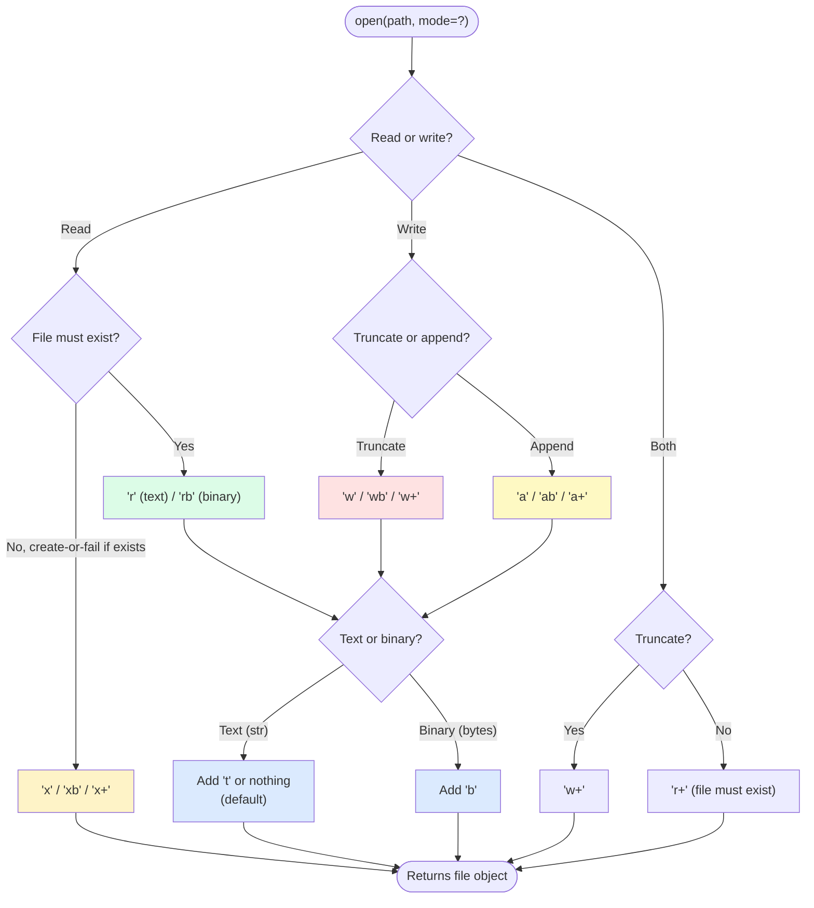

# 1. Reading and Writing Files

> [!note] Why this note exists
> File I/O is the most common external interaction in any program, and Python's built-in `open()` is deceptively simple. The single function hides a 7-mode interface (`r`, `w`, `a`, `x`, `b`, `t`, `+`), four different read methods (`read`, `readline`, `readlines`, iteration), and the encoding pitfall that has corrupted more data than any other Python feature. This note covers the `open()` API, the mode characters, the read/write methods, the `with` statement for guaranteed cleanup, the `encoding="utf-8"` rule that prevents `UnicodeDecodeError`, and the performance patterns for large files.

## Why It Matters

Consider this code that runs fine on the developer's Linux laptop:

```python
with open("config.txt") as f:
    config = f.read()
```

On the developer's machine, the default encoding is UTF-8 and the file is UTF-8 — works. Deploy to Windows, where the default is `cp1252`, and a UTF-8 file containing "café" raises `UnicodeDecodeError`. The bug only manifests in production, only on Windows, and only when the file contains non-ASCII characters. Three months later, you get a vague "config doesn't load on the new server" ticket.

The fix is one parameter:

```python
with open("config.txt", encoding="utf-8") as f:
    config = f.read()
```

This is the central lesson of file I/O: **always specify the encoding**. The platform default is a footgun.

The second lesson: **always use `with`**. Files are operating-system resources with finite limits (file descriptors). Forgetting to close them leaks descriptors until the process hits the OS limit (`ulimit -n`, usually 1024 on Linux), at which point every subsequent `open()` fails with `OSError: too many open files`. The `with` statement makes the close automatic.

The third lesson: **choose the right read method for your file size**. `f.read()` loads the whole file into memory — fine for a config file, catastrophic for a 50GB log. `f.readline()` reads one line; `for line in f:` iterates lazily. Know the difference.

## Background

### The `open()` function

```python
open(file, mode='r', buffering=-1, encoding=None, errors=None,
     newline=None, closefd=True, opener=None)
```

The most common args:
- `file` — path string or path-like object (`Path`, file descriptor, etc.).
- `mode` — string of mode characters (see below). Default `'r'`.
- `encoding` — text encoding. Default: platform-dependent (don't rely on it — always specify).
- `errors` — how to handle decoding errors: `'strict'` (default, raises), `'ignore'`, `'replace'`, `'surrogateescape'`, `'backslashreplace'`.
- `newline` — controls universal newline translation. Default `None` translates `\r\n` and `\r` to `\n` on read.

### Mode characters

| Char | Meaning |
|------|---------|
| `'r'` | Read (default). File must exist. |
| `'w'` | Write. Truncates (overwrites) if exists, creates if not. |
| `'a'` | Append. Creates if not exists, writes at end. |
| `'x'` | Exclusive create. Fails if file exists. |
| `'b'` | Binary mode. Bytes, not str. |
| `'t'` | Text mode (default). str, not bytes. |
| `'+'` | Update — both read and write. |

Modes are combined:
- `'r'` (text read) — default.
- `'rb'` (binary read) — for images, audio, structured binary.
- `'w'` (text write, truncates).
- `'wb'` (binary write).
- `'a'` (text append).
- `'r+'` (text read+write, doesn't truncate).
- `'w+'` (text write+read, truncates).
- `'x'` (exclusive create — atomic create-or-fail).

### File open modes



### Text mode vs binary mode

| | Text mode (`t`, default) | Binary mode (`b`) |
|--|--------------------------|-------------------|
| What you read/write | `str` | `bytes` |
| Encoding | Applied (UTF-8 by default) | None — raw bytes |
| Newline translation | `\r\n` / `\r` → `\n` on read, `\n` → `os.linesep` on write | None — bytes pass through |
| `seek()` | Arbitrary, but only safe to seek to start or to a position returned by `tell()` | Arbitrary (byte offsets) |
| Use case | Text files, JSON, CSV, config | Images, audio, video, custom binary formats |

**Rule of thumb**: if you're reading text, use text mode with explicit encoding. If you're reading bytes (any non-text format), use binary mode.

### Universal newlines

In text mode, Python translates line endings:
- On read: `\r\n` (Windows) and `\r` (old Mac) become `\n`.
- On write: `\n` becomes `os.linesep` (unless `newline=''`).

This means you can read a Windows-created file on Linux without seeing `\r` characters — Python handles it.

To disable translation (preserve raw bytes), pass `newline=''`:

```python
with open(path, newline='') as f:
    text = f.read()
```

## Main Content

### Reading from a file

```python
# Read the whole file into one string
with open(path, encoding="utf-8") as f:
    text = f.read()

# Read all lines into a list
with open(path, encoding="utf-8") as f:
    lines = f.readlines()    # ['line1\n', 'line2\n', ...]

# Iterate line by line (lazy, memory-efficient)
with open(path, encoding="utf-8") as f:
    for line in f:           # 'line1\n', 'line2\n', ...
        process(line)

# Read one line at a time
with open(path, encoding="utf-8") as f:
    first = f.readline()
    second = f.readline()

# Read N bytes
with open(path, "rb") as f:  # binary mode for bytes
    chunk = f.read(1024)     # up to 1024 bytes

# Read into a fixed buffer (for very large files)
with open(path, "rb") as f:
    while True:
        chunk = f.read(8192)
        if not chunk:
            break
        process(chunk)
```

### Writing to a file

```python
# Write a string (overwrites)
with open(path, "w", encoding="utf-8") as f:
    f.write("hello\n")
    f.write("world\n")

# Write multiple lines from a list
lines = ["line1\n", "line2\n", "line3\n"]
with open(path, "w", encoding="utf-8") as f:
    f.writelines(lines)    # no newlines added — they're in the strings

# Append
with open(path, "a", encoding="utf-8") as f:
    f.write("more text\n")

# Write binary
with open(path, "wb") as f:
    f.write(b"\x00\x01\x02\xff")
```

> [!warning] `writelines` does NOT add newlines
> `f.writelines(["a", "b", "c"])` writes `"abc"`, not `"a\nb\nc\n"`. The strings must already contain their newlines.

### Buffered I/O

Files are buffered — writes go to an in-memory buffer and are flushed to disk periodically. You can control this:

```python
# Default buffering (usually 8KB)
open(path, "w")

# Unbuffered (each write goes to the OS immediately)
open(path, "w", buffering=1)   # 1 = line buffering (text mode only)
open(path, "wb", buffering=0)  # 0 = unbuffered (binary only)

# Custom buffer size
open(path, "w", buffering=65536)
```

To flush manually:

```python
f.write("important data")
f.flush()    # force write to OS, but doesn't fsync
os.fsync(f.fileno())    # force write to disk (slow, but durable)
```

### `seek` and `tell`

```python
with open(path, "r+", encoding="utf-8") as f:
    pos = f.tell()          # 0 — current position
    f.read(10)              # read first 10 chars
    pos = f.tell()          # 10
    f.seek(0)               # rewind to start
    f.seek(5)               # jump to position 5
    f.seek(0, 2)            # seek from end (whence=2)
    f.seek(-3, 2)           # 3 bytes before end
    f.seek(10, 1)           # 10 bytes forward from current (whence=1)
```

`whence` values: `0` = start (default), `1` = current, `2` = end.

> [!warning] `seek` in text mode is restricted
> In text mode, you can only `seek(0)` (start) or `seek(pos)` where `pos` was returned by `tell()`. Arbitrary byte offsets don't work because of variable-length encodings (UTF-8 characters can be 1-4 bytes).

### The `with` statement — guaranteed close

```python
# Manual (BAD — file leaks if read raises)
f = open(path)
data = f.read()
f.close()

# Try/finally (OK but verbose)
f = open(path)
try:
    data = f.read()
finally:
    f.close()

# with (BEST — guaranteed close, even on exception)
with open(path) as f:
    data = f.read()
```

See [[4. Context Managers]] for the underlying protocol.

### Encoding — always specify it

```python
# BAD — relies on platform default
open(path)

# GOOD — explicit encoding
open(path, encoding="utf-8")

# Even better — handle errors
open(path, encoding="utf-8", errors="replace")
```

Common encodings:
- `utf-8` — the modern default for text.
- `utf-8-sig` — UTF-8 with BOM (Byte Order Mark). Reads BOM-prefixed UTF-8 files (some Windows tools add BOM).
- `latin-1` (a.k.a. `iso-8859-1`) — 1-byte-per-char, covers Western Europe. Never raises on decode (every byte is valid) but mangles non-Latin-1 data.
- `ascii` — 7-bit. Raises on non-ASCII.
- `utf-16`, `utf-32` — multi-byte Unicode. Used by Windows internally and some legacy systems.

### `errors` parameter

```python
open(path, encoding="utf-8", errors="strict")        # default — raise on error
open(path, encoding="utf-8", errors="ignore")        # skip bad bytes
open(path, encoding="utf-8", errors="replace")       # replace with U+FFFD
open(path, encoding="utf-8", errors="surrogateescape")  # preserve bad bytes for round-trip
open(path, encoding="utf-8", errors="backslashreplace")  # \xNN escapes
```

`surrogateescape` is what `os.fsdecode`/`os.fsencode` use — it lets you read filesystem paths with arbitrary bytes without losing data.

### Working with large files

```python
# Iterate line by line — O(1) memory regardless of file size
with open(huge_log, encoding="utf-8") as f:
    for line in f:
        if "ERROR" in line:
            process(line)

# Streaming binary chunks
with open(big_file, "rb") as f:
    while True:
        chunk = f.read(65536)
        if not chunk:
            break
        hash_update(chunk)
```

**Never do this for large files**:
```python
with open(big_file) as f:
    lines = f.readlines()    # loads entire file into memory!
```

### File object methods (full list)

| Method | Description |
|--------|-------------|
| `f.read(size=-1)` | Read up to `size` bytes (or all if -1) |
| `f.readline(size=-1)` | Read one line (up to size bytes) |
| `f.readlines(hint=-1)` | Read all lines (or until ~hint bytes) |
| `f.write(s)` | Write string `s` |
| `f.writelines(lines)` | Write each string in iterable |
| `f.tell()` | Current stream position |
| `f.seek(pos, whence=0)` | Move to position |
| `f.flush()` | Flush write buffer to OS |
| `f.close()` | Close the file |
| `f.fileno()` | Integer file descriptor |
| `f.readable()` / `writable()` / `seekable()` | Capability checks |
| `f.truncate(size=None)` | Truncate to `size` (or current pos) |
| `f.__enter__()` / `__exit__()` | Context manager protocol |

### Atomic writes

For atomic file replacement (no half-written file on crash):

```python
import os
import tempfile

def atomic_write(path, data, encoding="utf-8"):
    dir = os.path.dirname(path) or "."
    with tempfile.NamedTemporaryFile(
        mode="w", encoding=encoding, dir=dir, delete=False
    ) as tmp:
        tmp.write(data)
        tmp_name = tmp.name
    os.replace(tmp_name, path)    # atomic on POSIX
```

`os.replace` is atomic — either the new file is fully in place or the old one is. This is the right pattern for "write file that other processes might read".

## Code Examples

### Example 1: Read a config file safely

```python
import json

def load_config(path):
    try:
        with open(path, encoding="utf-8") as f:
            return json.load(f)
    except FileNotFoundError:
        return {}
    except json.JSONDecodeError as e:
        raise ConfigError(f"invalid config at {path}: {e}") from e
```

### Example 2: Stream a log file

```python
def count_errors(path):
    count = 0
    with open(path, encoding="utf-8", errors="replace") as f:
        for line in f:    # O(1) memory
            if " ERROR " in line:
                count += 1
    return count
```

### Example 3: Append with rotation

```python
import os

def log_with_rotation(path, message, max_size=10_000_000):
    if os.path.exists(path) and os.path.getsize(path) > max_size:
        os.rename(path, path + ".1")
    with open(path, "a", encoding="utf-8") as f:
        f.write(message + "\n")
```

### Example 4: Read and write a binary file

```python
def copy_binary(src, dst):
    with open(src, "rb") as fin, open(dst, "wb") as fout:
        while True:
            chunk = fin.read(65536)
            if not chunk:
                break
            fout.write(chunk)
```

### Example 5: Read N lines from the end

```python
import os
from collections import deque

def tail(path, n=10):
    with open(path, encoding="utf-8") as f:
        return deque(f, maxlen=n)

# More memory-efficient than readlines for huge files
```

### Example 6: Atomic config update

```python
import os
import tempfile
import json

def save_config(path, config):
    dir = os.path.dirname(path) or "."
    fd, tmp = tempfile.mkstemp(dir=dir, suffix=".tmp")
    try:
        with os.fdopen(fd, "w", encoding="utf-8") as f:
            json.dump(config, f, indent=2)
        os.replace(tmp, path)
    except BaseException:
        os.unlink(tmp)
        raise
```

### Example 7: File-like objects and `io` module

```python
import io

# In-memory text file
buf = io.StringIO()
buf.write("hello\n")
buf.write("world\n")
buf.seek(0)
print(buf.read())    # 'hello\nworld\n'

# In-memory binary file
bbuf = io.BytesIO()
bbuf.write(b"\x00\x01\x02")
bbuf.seek(0)
data = bbuf.read()   # b'\x00\x01\x02'
```

`StringIO` and `BytesIO` are useful for: unit tests (replace `open()` with a fake returning `StringIO`), building up data before writing it out, and providing a file-like interface to network data. They implement the full file protocol — `read`, `write`, `seek`, `tell`, `readline`, `readlines`, `writelines`, `close`, context-manager protocol — so they're drop-in replacements for real files in many APIs.

### Example 8: Reading a file backwards

Python doesn't have a built-in "reverse iterator" for files, but `deque` gives you a windowed approach:

```python
from collections import deque

def reverse_lines(path, n=10):
    """Return the last n lines of a file, in order."""
    with open(path, encoding="utf-8") as f:
        return list(deque(f, maxlen=n))

# For truly huge files, seek from the end:
def tail_seek(path, n=4096):
    """Read the last n bytes, split into lines."""
    import os
    size = os.path.getsize(path)
    with open(path, encoding="utf-8", errors="replace") as f:
        f.seek(max(0, size - n), 0)
        return f.read().splitlines()
```

### Performance: comparing read strategies

| Method | Memory | Speed | When to use |
|--------|--------|-------|-------------|
| `f.read()` | O(file size) | Fast | Small files (<10MB) |
| `f.readlines()` | O(file size) | Fast | Small files when you need a list |
| `for line in f:` | O(1) per iteration | Fast | Large files, line-oriented |
| `f.read(chunk)` | O(chunk) | Fast | Binary or chunk-oriented |
| `mmap.mmap(...)` | O(working set) | Very fast for random access | Random access into huge files |

The fastest method depends on what you're doing — but `for line in f:` is almost always the right answer for text processing.

### Common idioms from the Python community

#### One-liner reads (pathlib)

```python
from pathlib import Path

text = Path("config.txt").read_text(encoding="utf-8")
data = Path("image.png").read_bytes()
Path("output.txt").write_text("hello\n", encoding="utf-8")
```

These open, read/write, and close the file in one call. Great for tiny files; don't use for anything where you need streaming or partial reads.

#### The "context manager stack" pattern

When you have multiple files to manage and a dynamic number of them, use `ExitStack`:

```python
from contextlib import ExitStack

def merge_files(input_paths, output_path):
    with ExitStack() as stack:
        inputs = [stack.enter_context(open(p, encoding="utf-8")) for p in input_paths]
        with open(output_path, "w", encoding="utf-8") as out:
            for lines in zip(*inputs):
                out.writelines(lines)
    # All inputs and output are guaranteed closed.
```

#### Lazy line generation

```python
def iter_lines(path):
    """Generator yielding lines — closes file when generator is exhausted or closed."""
    with open(path, encoding="utf-8") as f:
        yield from f

# Usage:
for line in iter_lines(huge_file):
    if "ERROR" in line:
        print(line, end="")
# File is closed automatically when the for loop ends or breaks.
```

`yield from f` delegates to the file's iterator, which yields one line at a time. The `with` block ensures the file closes when the generator is exhausted or garbage-collected.

## Common Pitfalls

> [!danger] Forgetting `encoding="utf-8"`
> The platform default is `cp1252` on Windows and UTF-8 on Linux. Always specify. Linters (ruff, flake8) can flag this.

> [!danger] Forgetting `with` (file descriptor leak)
> Each `open()` consumes a file descriptor. The OS limit is ~1024 by default. Once hit, every subsequent `open()` fails. Always use `with`.

> [!danger] `f.readlines()` on a huge file
> Loads the entire file into a list. Use `for line in f:` instead.

> [!danger] `writelines` doesn't add newlines
> `f.writelines(["a", "b"])` writes `"ab"`, not `"a\nb\n"`. The strings must contain their own newlines.

> [!danger] Mixing text and binary mode
> ```python
> with open(path, "w") as f:
>     f.write(b"hello")    # TypeError — expected str
> ```

> [!danger] `seek` in text mode
> Arbitrary byte offsets don't work in text mode (variable-length encoding). Only seek to positions returned by `tell()` or to 0.

> [!danger] Modifying a file in place with `w+`
> `w+` truncates the file immediately on open. Use `r+` to read and modify without truncating.

> [!danger] `read()` returning empty string doesn't mean error
> It means you're at EOF. Check `if not data:` to detect end-of-file.

> [!danger] Buffering and durability
> `f.write(data)` returns immediately — the data is in the buffer, not on disk. Use `f.flush()` to push to the OS, `os.fsync(f.fileno())` to push to the physical disk.

> [!danger] Concurrent writes from multiple processes
> Two processes writing to the same file produce garbled output. Use file locking (`fcntl.flock` on POSIX, `msvcrt.locking` on Windows) or write to separate files and merge.

> [!danger] File not closed when exception in `with` initialization
> `open()` itself doesn't raise commonly, but if it does (e.g., bad mode), there's no file to close. The `with` statement handles this correctly.

## Tips and Tricks

- **Always specify `encoding="utf-8"`** — non-negotiable for portable code.
- **Always use `with`** — non-negotiable for not leaking file descriptors.
- **Iterate `for line in f:`** for line-by-line processing — lazy, memory-efficient.
- **Use `read(chunk_size)`** for binary streaming — 64KB is a good default.
- **`os.replace` for atomic writes** — never half-written.
- **`tempfile.NamedTemporaryFile`** for temporary files — auto-deleted.
- **`shutil.copyfile`** instead of manual `read`/`write` for copies.
- **`pathlib.Path.read_text()` / `.write_text()`** for one-liner reads/writes — see [[2. Path Handling with pathlib]].
- **`io.StringIO` / `io.BytesIO`** for in-memory file-like objects — useful for testing and for building up data.
- **`csv` and `json` modules** for structured text — see [[3. CSV and JSON]].
- **`pickle`** for Python objects — see [[4. Pickle and Serialization]] (but be aware of security).
- **For very large text files**, `mmap` can be faster than `read()` — it maps the file into memory without copying.
- **`newline=''`** when working with CSV files (prevents double-translation).

## Active Recall

1. What's the default mode for `open()`? What's the default encoding?
2. Why should you always pass `encoding="utf-8"` to `open()`?
3. List the seven mode characters and what each means.
4. What's the difference between `'w'` and `'x'`?
5. Why is `with open(path) as f:` better than `f = open(path); ...; f.close()`?
6. What's the memory cost of `f.readlines()` on a 10GB file? What's the alternative?
7. Does `f.writelines(["a", "b"])` write `"a\nb\n"` or `"ab"`?
8. Why can't you `seek(100)` in text mode and expect byte 100?
9. Write a function that streams a large file line by line and counts matching lines.
10. What does `errors="replace"` do? When would you use it?
11. How do you make a write atomic (no half-written file on crash)?
12. What's the difference between `f.flush()` and `os.fsync(f.fileno())`?
13. What happens if you `open(path, "w")` and the file already exists?
14. Why does `for line in f:` work without calling `readlines()`?

## Next Steps

- [[2. Path Handling with pathlib]] — modern path manipulation that pairs with `open()`.
- [[3. CSV and JSON]] — structured text file formats.
- [[4. Pickle and Serialization]] — Python object serialization.
- [[5. Working with Binary Files]] — binary modes, `struct`, `mmap`.
- [[../5. Error Handling/4. Context Managers]] — the protocol behind `with`.
- [[../4. Data Structures/6. Strings Deep Dive]] — the encoding model that `open()` uses.
