# 2. Path Handling with pathlib

> [!note] Why this note exists
> For 25 years, Python path handling meant `os.path.join`, `os.path.dirname`, `os.path.basename`, `os.path.exists` — a flat namespace of string functions that produced unreadable code like `os.path.join(os.path.dirname(os.path.dirname(p)), "data", "file.txt")`. The `pathlib` module (Python 3.4+) replaced all of this with an object-oriented `Path` class where the `/` operator joins paths, attributes give you parts, and methods give you file operations. This note covers the `Path` API, the parts/parents/stem/suffix attributes, the existence/permission checks, the `mkdir`/`rmdir`/`unlink` operations, the `glob`/`rglob` patterns, and the migration from `os.path` to `pathlib`.

## Why It Matters

Compare these two snippets that build a path to a config file relative to the user's home directory:

```python
# Old style (os.path)
import os
config_path = os.path.join(os.path.expanduser("~"), ".config", "myapp", "config.json")

# New style (pathlib)
from pathlib import Path
config_path = Path.home() / ".config" / "myapp" / "config.json"
```

The `pathlib` version reads like the path it represents. The `os.path` version is a function call nested in function calls nested in function calls — and you have to read it inside-out to understand what it produces.

The benefits go beyond readability:
- **Type safety**: a `Path` is a `Path`, not a string. You can't accidentally pass a string to a function expecting a `Path` (or vice versa, if your type hints are strict).
- **Method chaining**: `Path("a") / "b" / "c"` returns a new `Path`, which has all the same methods.
- **Cross-platform**: `pathlib` handles `/` vs `\` automatically. The `/` operator works on Windows too — it produces a `WindowsPath` that uses backslashes internally.
- **Rich API**: existence checks, file operations, globbing, all on the same object.

The `os.path` module is still around for backward compatibility, but for new code, `pathlib` is the right choice.

## Background

### The `Path` class

`pathlib.Path` is the base class. On import, Python picks a platform-specific subclass:
- `PosixPath` on Linux/macOS.
- `WindowsPath` on Windows.

You usually just use `Path` — the platform subclass is selected automatically. (There's also `PurePath` / `PurePosixPath` / `PureWindowsPath` for path manipulation without filesystem access — useful for parsing paths from another OS.)

### Constructing paths

```python
from pathlib import Path

# From a string
p = Path("/usr/local/bin/python")

# From multiple parts (joined)
p = Path("/usr", "local", "bin", "python")

# With the / operator
p = Path("/usr") / "local" / "bin" / "python"

# Joining with another Path
base = Path("/usr/local")
p = base / "bin" / "python"

# Home directory
p = Path.home()    # /Users/alice or C:\Users\alice

# Current working directory
p = Path.cwd()    # /home/alice/projects/myapp

# From environment-like expansion
p = Path("~/.config").expanduser()    # expands ~
```

### The `/` operator

The `/` operator on `Path` is path joining. It's the killer feature:

```python
base = Path("/data")
file = base / "logs" / "app.log"     # /data/logs/app.log
```

It works with strings on the right side too:

```python
file = base / "logs" / "app.log"     # both work
file = base / "logs/app.log"         # also works (single string)
```

And it's chainable:

```python
p = Path.home() / ".config" / "myapp" / "config.json"
```

### Path parts

A `Path` exposes its components as attributes:

```python
p = Path("/home/alice/projects/myapp/main.py")

p.parts         # ('/', 'home', 'alice', 'projects', 'myapp', 'main.py')
p.parent        # /home/alice/projects/myapp
p.name          # main.py
p.stem          # main
p.suffix        # .py
p.suffixes      # ['.py']  (for "archive.tar.gz" -> ['.tar', '.gz'])
p.anchor        # '/'   (the root or drive)
p.root          # '/'
p.drive         # ''   (or 'C:' on Windows)
p.as_posix()    # '/home/alice/projects/myapp/main.py' (string with /)
```

### Parents (plural)

```python
p = Path("/home/alice/projects/myapp/main.py")

p.parent        # /home/alice/projects/myapp
p.parent.parent # /home/alice/projects

# Iterate ancestors
for ancestor in p.parents:
    print(ancestor)
# /home/alice/projects/myapp
# /home/alice/projects
# /home/alice
# /home
# /
```

### `with_*` methods (return new Path)

```python
p = Path("data.csv")

p.with_suffix(".json")        # data.json
p.with_name("output.txt")     # output.txt
p.with_stem("output")         # output.csv (3.9+)

p = Path("/a/b/c.txt")
p.with_suffix(".bak")         # /a/b/c.bak
p.with_name("d.txt")          # /a/d.txt
```

## Main Content

### Existence and type checks

```python
p = Path("/etc/passwd")

p.exists()        # True
p.is_file()       # True
p.is_dir()        # False
p.is_symlink()    # False
p.is_socket()     # False
p.is_block_device()
p.is_char_device()
p.is_fifo()
p.is_mount()      # 3.7+
```

These methods call `os.stat` once and check the result — they don't raise on missing files (they return `False`).

### File metadata

```python
p = Path("/etc/passwd")

stat = p.stat()
stat.st_size       # bytes
stat.st_mtime      # modification time (Unix timestamp)
stat.st_atime      # access time
stat.st_ctime      # creation time (or last metadata change on POSIX)
stat.st_mode       # permission bits
stat.st_uid        # owner user id
stat.st_gid        # owner group id

p.owner()          # 'root' (POSIX only)
p.group()          # 'root' (POSIX only)

# lstat doesn't follow symlinks
p.lstat()
```

### File operations

```python
# Create directory
Path("a/b/c").mkdir(parents=True, exist_ok=True)
# parents=True: create intermediate dirs
# exist_ok=True: don't raise if exists

# Create file (touch)
Path("newfile.txt").touch(mode=0o644, exist_ok=True)

# Delete
Path("file.txt").unlink()         # delete file (missing_ok=True for 3.8+)
Path("emptydir").rmdir()          # delete empty directory
Path("nonempty").rmdir()          # OSError: not empty

# Rename / move
Path("old.txt").rename("new.txt")
Path("old.txt").replace("new.txt")   # atomic, overwrites if exists

# Symbolic links
Path("link").symlink_to("target")
Path("link").readlink()    # returns the target (3.9+)
```

For recursive directory deletion, use `shutil.rmtree`:

```python
import shutil
shutil.rmtree(Path("dir/to/delete"))
```

### Reading and writing (one-liners)

`Path` objects have convenience methods for small files:

```python
p = Path("config.txt")

# Read
text = p.read_text(encoding="utf-8")    # whole file as str
data = p.read_bytes()                   # whole file as bytes

# Write (overwrites)
p.write_text("content", encoding="utf-8")
p.write_bytes(b"\x00\x01")

# Append — no built-in method, use open()
with p.open("a", encoding="utf-8") as f:
    f.write("more\n")
```

Use these for small files. For large files, use `open()` directly (see [[1. Reading and Writing Files]]).

### `open()` integration

A `Path` object is "path-like" — `open()` accepts it directly:

```python
p = Path("data.csv")
with p.open(encoding="utf-8") as f:
    ...
```

### Globbing

```python
# Glob in a single directory
Path("/var/log").glob("*.log")        # iterator of Path objects

# Recursive glob (with **)
Path("/var/log").rglob("*.log")       # recursive

# With ** in glob()
Path("/data").glob("**/*.csv")        # recursive

# Glob with multiple patterns — chain
from itertools import chain
all_files = chain(
    Path("/data").glob("*.csv"),
    Path("/data").glob("*.json"),
)

# Filter
csv_files = [p for p in Path("/data").glob("*.csv") if p.is_file()]
```

`glob()` returns a **generator** of `Path` objects, not a list. This is memory-efficient for directories with millions of files.

`rglob()` is shorthand for `glob("**/pattern")` — it descends into subdirectories.

The `**` pattern matches any number of intermediate directories (including zero). So `glob("**/*.py")` matches `a.py`, `dir/a.py`, `dir/sub/a.py`, etc.

### Path comparison and sorting

```python
# Equality
Path("/a/b") == Path("/a/b")         # True
Path("/a/b") == Path("/a/b/")        # False on POSIX (trailing slash)
Path("/a/./b") == Path("/a/b")       # False — not normalized

# To normalize, use resolve()
Path("/a/./b").resolve()             # /a/b
Path("foo/../bar").resolve()         # /current/dir/bar

# Sorting (lexicographic by string)
sorted(Path("/data").glob("*.csv"))
# [PosixPath('/data/a.csv'), PosixPath('/data/b.csv'), ...]
```

### `resolve()` vs `absolute()`

```python
# absolute(): just prepends cwd, doesn't resolve symlinks or ..
Path("foo/bar").absolute()           # /cwd/foo/bar (no symlink resolution)

# resolve(): full normalization, follows symlinks
Path("foo/bar").resolve()            # /real/path/bar (after symlink resolution)
Path("~/foo").resolve()              # /home/alice/foo? No — doesn't expand ~
# Use .expanduser() for ~
Path("~/foo").expanduser()           # /home/alice/foo
Path("~/foo").expanduser().resolve() # both
```

### `pathlib` API surface

```mermaid
flowchart TB
    Path["pathlib.Path"]
    Path --> Construct["Construction<br/>Path(), home(), cwd(), / operator"]
    Path --> Parts["Parts<br/>.parts, .parent, .name, .stem, .suffix, .anchor"]
    Path --> With["With_* (return new)<br/>.with_suffix(), .with_name(), .with_stem()"]
    Path --> Check["Checks<br/>.exists(), .is_file(), .is_dir(), .is_symlink()"]
    Path --> Stat["Metadata<br/>.stat(), .owner(), .group(), .lstat()"]
    Path --> Ops["Operations<br/>.mkdir(), .rmdir(), .unlink(), .rename(), .replace()"]
    Path --> IO["I/O<br/>.open(), .read_text(), .read_bytes(), .write_text(), .write_bytes()"]
    Path --> Glob["Globbing<br/>.glob(), .rglob()"]
    Path --> Resolve["Resolution<br/>.resolve(), .absolute(), .expanduser(), .relative_to()"]
    Path --> Iter["Iteration<br/>.iterdir()"]
    style Path fill:#dbeafe
    style IO fill:#dcfce7
    style Glob fill:#dcfce7
```



### `iterdir()` — list directory contents

```python
for child in Path("/etc").iterdir():
    print(child)
# All entries in /etc — files, dirs, symlinks

# Filter
dirs_only = [p for p in Path("/etc").iterdir() if p.is_dir()]
files_only = [p for p in Path("/etc").iterdir() if p.is_file()]
```

`iterdir()` is the modern replacement for `os.listdir()`.

### `relative_to()` — get relative path

```python
p = Path("/data/logs/app.log")
p.relative_to("/data")          # logs/app.log
p.relative_to("/data/logs")     # app.log
p.relative_to("/other")         # ValueError: not relative
```

### Pure paths (no filesystem access)

```python
from pathlib import PurePath, PurePosixPath, PureWindowsPath

# PurePosixPath for parsing POSIX paths on any platform
p = PurePosixPath("/usr/local/bin")
# Even on Windows, this uses POSIX semantics

# PureWindowsPath for parsing Windows paths
p = PureWindowsPath("C:/Users/alice")
p.drive         # 'C:'
p.root          # '\\'

# Useful for parsing paths from another OS without touching the filesystem
```

### `os.path` → `pathlib` migration

| `os.path` | `pathlib` |
|-----------|-----------|
| `os.path.join(a, b)` | `Path(a) / b` |
| `os.path.dirname(p)` | `Path(p).parent` |
| `os.path.basename(p)` | `Path(p).name` |
| `os.path.splitext(p)` | `Path(p).stem, Path(p).suffix` |
| `os.path.exists(p)` | `Path(p).exists()` |
| `os.path.isfile(p)` | `Path(p).is_file()` |
| `os.path.isdir(p)` | `Path(p).is_dir()` |
| `os.path.abspath(p)` | `Path(p).resolve()` |
| `os.path.expanduser(p)` | `Path(p).expanduser()` |
| `os.path.realpath(p)` | `Path(p).resolve()` |
| `os.path.getsize(p)` | `Path(p).stat().st_size` |
| `os.path.getmtime(p)` | `Path(p).stat().st_mtime` |
| `os.listdir(p)` | `Path(p).iterdir()` |
| `os.makedirs(p)` | `Path(p).mkdir(parents=True)` |
| `os.remove(p)` | `Path(p).unlink()` |
| `os.rmdir(p)` | `Path(p).rmdir()` |
| `os.rename(a, b)` | `Path(a).rename(b)` |
| `glob.glob(pattern)` | `Path(...).glob(pattern)` |

## Code Examples

### Example 1: Locate all Python files in a project

```python
from pathlib import Path

project = Path(".")
py_files = list(project.rglob("*.py"))
# All .py files, recursively

# Exclude tests
src_files = [p for p in project.rglob("*.py")
             if "test" not in p.name and "venv" not in p.parts]
```

### Example 2: Build a config path

```python
from pathlib import Path

def config_path(app_name: str) -> Path:
    # Cross-platform: ~/.config/app on Linux, ~/Library/Application Support/app on macOS
    if (xdg := os.environ.get("XDG_CONFIG_HOME")):
        return Path(xdg) / app_name / "config.json"
    return Path.home() / ".config" / app_name / "config.json"
```

### Example 3: Create a directory tree

```python
from pathlib import Path

def ensure_dirs(base: Path, *subdirs: str) -> Path:
    p = base.joinpath(*subdirs)
    p.mkdir(parents=True, exist_ok=True)
    return p

data_dir = ensure_dirs(Path.home() / "myapp", "data", "logs", "2024")
# All four dirs created; returns the final path
```

### Example 4: Atomic file replacement

```python
from pathlib import Path
import tempfile

def atomic_write(path: Path, content: str) -> None:
    tmp = path.parent / f".{path.name}.tmp.{os.getpid()}"
    tmp.write_text(content, encoding="utf-8")
    tmp.replace(path)    # atomic on POSIX
```

### Example 5: Process all CSV files in a directory

```python
from pathlib import Path
import csv

def process_all_csv(directory: Path):
    for csv_path in directory.glob("*.csv"):
        with csv_path.open(encoding="utf-8", newline="") as f:
            reader = csv.DictReader(f)
            for row in reader:
                yield csv_path.stem, row
```

### Example 6: Find the project root

```python
from pathlib import Path

def find_project_root(start: Path = None) -> Path:
    """Walk up looking for pyproject.toml or .git."""
    start = start or Path.cwd()
    for p in [start, *start.parents]:
        if (p / "pyproject.toml").is_file() or (p / ".git").is_dir():
            return p
    raise FileNotFoundError("no project root found")
```

### Example 7: Recursive file count by extension

```python
from collections import Counter
from pathlib import Path

def extension_counts(directory: Path) -> dict:
    counts = Counter()
    for p in directory.rglob("*"):
        if p.is_file() and p.suffix:
            counts[p.suffix.lower()] += 1
    return dict(counts)
```

### Example 8: Walk a directory tree (depth-first)

```python
def walk_tree(root: Path):
    """Yield (path, is_dir) for every entry under root, depth-first."""
    for child in sorted(root.iterdir()):
        if child.is_dir():
            yield child, True
            yield from walk_tree(child)
        else:
            yield child, False
```

`pathlib` does not provide a direct replacement for `os.walk`, but `rglob("*")` plus filtering gets you most of the way. For directory-tree traversal that distinguishes files and directories, the recursive `iterdir` pattern above is idiomatic. `os.walk` is still appropriate when you want all files in a directory at once (`dirpath, dirnames, filenames`).

### Example 9: Working with file URIs and absolute paths

```python
def to_file_uri(path: Path) -> str:
    """Convert a path to a file:// URI (cross-platform)."""
    return path.resolve().as_uri()

def from_file_uri(uri: str) -> Path:
    """Inverse: file:// URI back to a Path."""
    from urllib.request import url2pathname
    from urllib.parse import urlparse
    p = urlparse(uri)
    return Path(url2pathname(p.path))

# Usage
to_file_uri(Path("data.csv"))
# 'file:///home/alice/projects/myapp/data.csv'
```

This is useful when you need to interoperate with tools that expect file URIs (web browsers, Electron apps, some XML formats).

### Path arithmetic: parents, relative_to, and joins

```python
# Compare two paths: is one an ancestor of the other?
def is_ancestor(maybe_ancestor: Path, descendant: Path) -> bool:
    try:
        descendant.relative_to(maybe_ancestor)
        return True
    except ValueError:
        return False

# Walk up until you find a matching file
def find_upwards(start: Path, target: str) -> Path | None:
    for p in [start, *start.parents]:
        candidate = p / target
        if candidate.exists():
            return candidate
    return None

# Find the nearest .git directory
git_dir = find_upwards(Path.cwd(), ".git")
```

These patterns replace ad-hoc `while` loops with string slicing. The `relative_to` trick for "is X a descendant of Y" is particularly elegant — it raises `ValueError` if not, so the `try/except` is the test.

### Handling case-insensitive filesystems

On macOS and Windows, the filesystem is case-insensitive but case-preserving. So `Path("DATA.txt").exists()` returns `True` even if the file is `data.txt`. To find the actual on-disk name:

```python
def real_name(directory: Path, target: str) -> str | None:
    """Return the actual on-disk filename matching target (case-insensitive)."""
    target_lower = target.lower()
    for entry in directory.iterdir():
        if entry.name.lower() == target_lower:
            return entry.name
    return None
```

This is mostly relevant when porting tools from Linux to macOS/Windows, or when working with code that came from a case-insensitive system.

### `pathlib` vs `os.path` — when to use which

| Situation | Recommendation |
|-----------|----------------|
| New code, general-purpose | `pathlib.Path` |
| Working with libraries that expect strings | Convert with `str(path)` at the boundary |
| Need to handle paths from another OS without touching the filesystem | `PurePosixPath` / `PureWindowsPath` |
| Performance-critical path manipulation (millions of paths) | `os.path` is slightly faster (no object allocation); `pathlib` is fast enough for almost everything |
| Single one-off path operation (e.g., `os.path.exists`) | Either; `Path(p).exists()` is fine |
| `os.walk` semantics (dirpath/dirnames/filenames) | `os.walk` is still appropriate |

For new code, default to `pathlib`. Drop down to `os.path` only when integrating with code that requires strings, or when you need `os.walk`'s specific return format.

### Path normalization pitfalls

`Path` objects compare by their string representation, which means semantically-equal paths can compare as unequal:

```python
Path("/a/b") == Path("/a/b/")            # False on POSIX (trailing slash)
Path("/a/./b") == Path("/a/b")           # False (not normalized)
Path("/a//b") == Path("/a/b")            # False (double slash)
Path("/a/b/..") == Path("/a")            # False (.. not resolved)
Path("a/b") == Path("./a/b")             # False
```

To get a canonical comparison, normalize both sides first:

```python
def canonical(p: Path) -> Path:
    return p.expanduser().resolve()

canonical(Path("/a/./b")) == canonical(Path("/a/b"))   # True
```

`resolve()` resolves `.`, `..`, symlinks, and makes the path absolute. For case-insensitive filesystems (macOS, Windows), also compare lower-cased strings: `str(canonical(a)).lower() == str(canonical(b)).lower()`.

### Cross-platform path handling

`pathlib` is cross-platform at the API level, but the *values* still differ:

```python
# On Linux
Path.home()        # PosixPath('/home/alice')
Path.cwd()         # PosixPath('/home/alice/projects')

# On Windows
Path.home()        # WindowsPath('C:/Users/alice')
Path.cwd()         # WindowsPath('C:/Users/alice/projects')
```

The `/` operator works on both, but the resulting path uses the platform's separator internally. For string output:

```python
str(Path("a") / "b")    # 'a/b' on Linux, 'a\\b' on Windows
Path("a/b").as_posix()  # 'a/b' on both — force POSIX-style separators
```

If you're writing paths to a config file that needs to be portable across platforms, use `as_posix()` for output and `Path()` (which accepts both `/` and `\` on any platform) for input.

### Path operations on symlinks

`pathlib` distinguishes between the symlink path and its target:

```python
import os
os.symlink("/real/target", "/tmp/link")

p = Path("/tmp/link")
p.exists()              # True (follows symlink, checks target)
p.is_symlink()          # True
p.resolve()             # PosixPath('/real/target')
p.absolute()            # PosixPath('/tmp/link') — does NOT resolve symlinks
p.stat()                # stat of the TARGET
p.lstat()               # stat of the LINK itself
p.readlink()            # '/real/target' (the link's target, 3.9+)
```

For "is this path a broken symlink?" (link exists but target doesn't):

```python
def is_broken_symlink(p: Path) -> bool:
    return p.is_symlink() and not p.exists()
```

`p.exists()` follows the symlink and returns `False` if the target is missing; `p.is_symlink()` returns `True` if the link itself exists. The combination detects broken links.

### Working with paths from environment variables

Environment variables that hold paths (`PATH`, `PYTHONPATH`, `HOME`, etc.) are colon-separated (POSIX) or semicolon-separated (Windows). Use `os.pathsep`:

```python
import os
from pathlib import Path

# Parse PATH into a list of Path objects
path_dirs = [Path(p) for p in os.environ.get("PATH", "").split(os.pathsep) if p]

# Find an executable on PATH
def find_executable(name: str) -> Path | None:
    for d in path_dirs:
        candidate = d / name
        if candidate.is_file() and os.access(candidate, os.X_OK):
            return candidate
    return None

# Or use shutil.which (stdlib)
import shutil
exe = shutil.which("python")   # '/usr/bin/python' as a string
```

This is more reliable than parsing `PATH` manually with `string.split(":")` because `os.pathsep` is `:` on POSIX and `;` on Windows.

## Common Pitfalls

> [!danger] Forgetting `parents=True` in `mkdir()`
> `Path("a/b/c").mkdir()` raises `FileNotFoundError` if `a/b` doesn't exist. Use `mkdir(parents=True, exist_ok=True)`.

> [!danger] `Path("~")` doesn't expand
> `Path("~/.config")` is literally `~/.config` — no expansion. Use `Path("~/.config").expanduser()`.

> [!danger] `glob()` returns a generator
> If you iterate twice, the second pass is empty. Convert to a list: `files = list(p.glob(...))`.

> [!danger] `resolve()` follows symlinks
> If you don't want to follow symlinks, use `absolute()` instead. Note that `absolute()` doesn't resolve `..` or `.`.

> [!danger] Trailing slash matters for equality
> `Path("/a/b") == Path("/a/b/")` is False on POSIX. Normalize with `resolve()` if you need consistent comparison.

> [!danger] `Path.unlink()` on a missing file raises
> Use `unlink(missing_ok=True)` (Python 3.8+) or check existence first.

> [!danger] `rmdir()` only works on empty directories
> Use `shutil.rmtree(path)` for non-empty.

> [!danger] Cross-platform path comparisons
> A `WindowsPath("C:/a/b")` is not equal to a `PosixPath("/a/b")`. If you're comparing paths from different OSes, use `PurePosixPath` / `PureWindowsPath` explicitly.

> [!danger] `with_suffix("")` removes the suffix
> `Path("a.txt").with_suffix("")` is `Path("a")` — not `Path("a.txt")` without extension. To replace, use `.with_suffix(".new")`.

> [!danger] `name` includes the suffix; `stem` doesn't
> `Path("a.tar.gz").name == "a.tar.gz"`, `.stem == "a.tar"`, `.suffix == ".gz"`, `.suffixes == [".tar", ".gz"]`.

## Tips and Tricks

- **Use `Path` everywhere** — type signatures, function arguments, return values. Resist the temptation to convert to `str` unless required by a library.
- **The `/` operator is path joining** — it's the killer feature.
- **`Path.home()` and `Path.cwd()`** for the two most common starting points.
- **`read_text(encoding="utf-8")` / `write_text(...)`** for small files.
- **`rglob("*.py")`** for recursive file finding.
- **`parents=True, exist_ok=True`** in `mkdir()` is the safe default.
- **`resolve()` for absolute, normalized paths** — but it touches the filesystem (slow).
- **`absolute()` for non-resolving absolute paths** — fast, but doesn't resolve symlinks or `..`.
- **`relative_to()` for stripping a known prefix**.
- **`PurePath` for paths without filesystem access** — useful for parsing paths from another OS.
- **`Path` is `os.PathLike`** — `open()`, `os.stat()`, etc. accept it directly.
- **`shutil` for file operations pathlib doesn't cover**: `copy`, `copytree`, `rmtree`, `move`.
- **For path templates, use `Path` with format strings**: `Path(f"/data/{year}/{month}/{day}.log")`.

## Active Recall

1. What does the `/` operator do on a `Path`?
2. How do you get the file extension of a `Path`? The filename without extension?
3. Write a one-liner to read the contents of a small text file using `pathlib`.
4. What's the difference between `resolve()` and `absolute()`?
5. How do you create a directory tree `a/b/c` if it doesn't exist?
6. How do you recursively find all `.py` files in a directory?
7. What does `Path("~/.config").expanduser()` do, and why is the `.expanduser()` needed?
8. How do you get the parent directory of a `Path`? How about two levels up?
9. What's the difference between `.name` and `.stem` on `Path("archive.tar.gz")`?
10. How do you atomically replace a file's contents using `pathlib`?
11. Why does `glob()` return a generator, not a list?
12. Write a function that finds the project root by walking up the directory tree.
13. How do you port `os.path.join(a, b, c)` to `pathlib`?
14. What is `PurePosixPath` for, and when would you use it?

## Next Steps

- [[1. Reading and Writing Files]] — `Path` objects work directly with `open()`.
- [[3. CSV and JSON]] — combine `Path` with `csv` and `json` for structured file I/O.
- [[5. Working with Binary Files]] — `Path.read_bytes()` / `write_bytes()` and binary `open()`.
- [[../5. Error Handling/1. try-except-finally]] — `FileNotFoundError`, `PermissionError` from path operations.
- [[../4. Data Structures/6. Strings Deep Dive]] — encoding matters for text paths.
