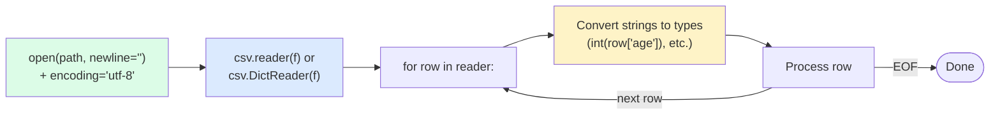
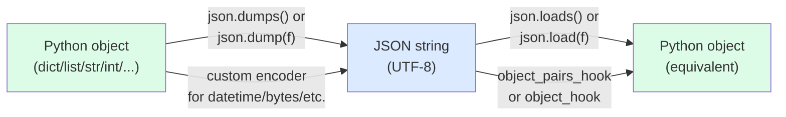

# 3. CSV and JSON

> [!note] Why this note exists
> CSV and JSON are the two most common text-based data interchange formats in existence. Python ships with excellent built-in modules for both — `csv` for tabular data and `json` for nested structured data. But "ships with" hides a lot of footguns: CSV files with quoted commas, embedded newlines, BOM markers, inconsistent dialects; JSON files with non-ASCII text, datetime objects, custom classes, and trailing commas. This note covers the `csv` API (`reader`, `writer`, `DictReader`, `DictWriter`, dialects), the `json` API (`load`, `loads`, `dump`, `dumps`, custom encoders/decoders), the round-trip patterns, and the migration to third-party alternatives (`pandas` for tabular, `orjson` for high-performance JSON).

## Why It Matters

Consider this naive CSV parser:

```python
import csv

with open("data.csv") as f:
    for line in f:
        fields = line.split(",")
        process(fields)
```

This breaks on the very first row that contains a quoted comma:

```csv
name,city,note
Alice,"New York, NY",likes coffee
```

`line.split(",")` produces `['Alice', '"New York', ' NY"', 'likes coffee']` — four fields instead of three, with stray quotes. The `csv` module handles this correctly:

```python
import csv

with open("data.csv", newline="") as f:
    reader = csv.reader(f)
    for row in reader:
        process(row)
# row is ['Alice', 'New York, NY', 'likes coffee'] — correct.
```

The lesson: **always use the `csv` module for CSV files**, even when you think the data is simple. The format has too many edge cases (quoting, escaping, dialects) to roll your own.

For JSON, the parallel lesson is: **always use the `json` module**, and **always pass `encoding="utf-8"`** when opening the file. JSON is defined as UTF-8 (or UTF-16/32 with BOM), and `json.load` handles the parsing — but the file-encoding layer is yours to get right.

## Background

### CSV format

CSV (Comma-Separated Values) is a tabular text format: one row per line, fields separated by commas. The format is deceptively simple — RFC 4180 is the closest thing to a standard, but real-world CSV files vary wildly:
- Field separator: comma, semicolon, tab, pipe.
- Quote character: double-quote, single-quote, none.
- Escape character: double-quote (CSV-style doubling) or backslash.
- Line terminator: `\n`, `\r\n`, `\r`.
- Header row: present or not.
- Encoding: UTF-8, Latin-1, UTF-8 with BOM, cp1252.

Python's `csv` module handles all of these via **dialects** and per-call parameters.

### JSON format

JSON (JavaScript Object Notation) is a hierarchical text format:
- Objects: `{"key": value}`
- Arrays: `[value, value]`
- Strings: `"..."` (UTF-16 surrogate pairs for non-BMP)
- Numbers: `1`, `1.5`, `1e10`, `-1`
- Booleans: `true`, `false`
- Null: `null`

JSON is **always UTF-8** (or UTF-16/32 with BOM). The Python `json` module handles encoding and decoding; you handle the file encoding.

### Differences

| | CSV | JSON |
|--|-----|------|
| Structure | Tabular (rows of fields) | Hierarchical (nested objects/arrays) |
| Data types | All strings (no numbers, bools, null) | Strings, numbers, bools, null, arrays, objects |
| Schema | Implicit (header row) | None |
| Streaming | Easy (one row at a time) | Hard (whole document parse in stdlib) |
| Use case | Logs, spreadsheets, exports | APIs, config files, nested data |

## Main Content

### `csv` module

#### `csv.reader` — basic reading

```python
import csv

with open("data.csv", encoding="utf-8", newline="") as f:
    reader = csv.reader(f)
    for row in reader:
        print(row)
# Each row is a list of strings.
```

> [!warning] `newline=""` is required for csv
> The `csv` module handles its own line endings. If you let `open()` translate newlines (the default), embedded newlines in quoted fields will be mangled. Always pass `newline=""` to `open()` when using `csv`.

#### `csv.writer` — basic writing

```python
import csv

with open("output.csv", "w", encoding="utf-8", newline="") as f:
    writer = csv.writer(f)
    writer.writerow(["name", "age", "city"])
    writer.writerow(["Alice", 30, "NYC"])
    writer.writerows([
        ["Bob", 25, "LA"],
        ["Carol", 35, "SF"],
    ])
```

`writerow` takes a single row; `writerows` takes an iterable of rows.

#### `csv.DictReader` — read by column name

```python
import csv

with open("data.csv", encoding="utf-8", newline="") as f:
    reader = csv.DictReader(f)
    for row in reader:
        print(row["name"], row["age"])
# Each row is a dict with keys from the header.
```

`DictReader` uses the first row as the header. If no header is present, pass `fieldnames=[...]` to the constructor.

#### `csv.DictWriter` — write by column name

```python
import csv

fields = ["name", "age", "city"]
with open("output.csv", "w", encoding="utf-8", newline="") as f:
    writer = csv.DictWriter(f, fieldnames=fields)
    writer.writeheader()
    writer.writerow({"name": "Alice", "age": 30, "city": "NYC"})
    writer.writerow({"name": "Bob", "age": 25, "city": "LA"})
```

`DictWriter` is the right choice when your data is already in dict form (e.g., database rows, JSON objects). The `extrasaction="ignore"` option lets you pass dicts with extra keys; the `restval=""` option provides a default for missing keys.

#### CSV dialects

```python
# Built-in dialects: "excel" (default), "excel-tab", "unix"

# Excel dialect: comma-separated, \r\n line endings, " quotes
csv.reader(f, dialect="excel")

# Excel-tab: tab-separated
csv.reader(f, dialect="excel-tab")

# Unix: comma-separated, \n line endings
csv.reader(f, dialect="unix")

# Custom dialect
csv.register_dialect(
    "pipes",
    delimiter="|",
    quotechar="'",
    lineterminator="\n",
)
csv.reader(f, dialect="pipes")
```

Dialect parameters:
- `delimiter` — field separator (default `","`).
- `quotechar` — quote character (default `'"'`).
- `escapechar` — escape character (default `None`).
- `doublequote` — if True, `""` inside a quoted field is a literal `"` (default True).
- `lineterminator` — written line ending (default `"\r\n"`).
- `quoting` — when to quote fields: `csv.QUOTE_MINIMAL` (default), `csv.QUOTE_ALL`, `csv.QUOTE_NONNUMERIC`, `csv.QUOTE_NONE`.
- `skipinitialspace` — skip whitespace after delimiter (default False).

#### CSV reading flow



### `json` module

#### `json.load` / `json.loads`

```python
import json

# From a file
with open("data.json", encoding="utf-8") as f:
    data = json.load(f)    # parses the file

# From a string
data = json.loads('{"name": "Alice", "age": 30}')

# From bytes (3.6+)
data = json.loads(b'{"x": 1}')     # works
```

`load` takes a file-like object; `loads` (load string) takes a string or bytes.

#### `json.dump` / `json.dumps`

```python
import json

# To a file
with open("data.json", "w", encoding="utf-8") as f:
    json.dump(data, f, indent=2, ensure_ascii=False)

# To a string
text = json.dumps(data, indent=2, ensure_ascii=False)
```

Important parameters:
- `indent=2` — pretty-print with 2-space indent. None (default) = compact.
- `ensure_ascii=False` — output Unicode directly (don't escape non-ASCII to `\uXXXX`). Almost always what you want.
- `sort_keys=True` — sort dict keys in output (useful for stable diffs).
- `default=func` — function called for objects `json` can't serialize.
- `cls=MyEncoder` — custom JSONEncoder subclass.
- `separators=(",", ":")` — compact separators (default for `dumps`).

#### `ensure_ascii` — the Unicode pitfall

```python
data = {"name": "café"}

json.dumps(data)                  # '{"name": "caf\\u00e9"}' — escaped
json.dumps(data, ensure_ascii=False)  # '{"name": "café"}' — direct

# When writing to a file with ensure_ascii=False, the file is UTF-8.
# Make sure to open with encoding="utf-8".
```

The default `ensure_ascii=True` is for backward compatibility. For modern code, always use `ensure_ascii=False` and write to a UTF-8 file.

#### JSON  Python type mapping

| JSON | Python |
|------|--------|
| `object` | `dict` |
| `array` | `list` |
| `string` | `str` |
| `number` (integer) | `int` |
| `number` (float) | `float` |
| `true` | `True` |
| `false` | `False` |
| `null` | `None` |

Note: JSON has no `tuple`, no `bytes`, no `datetime`, no `set`. Custom types need a custom encoder.

#### Custom JSON encoders

```python
import json
from datetime import datetime

class CustomEncoder(json.JSONEncoder):
    def default(self, obj):
        if isinstance(obj, datetime):
            return obj.isoformat()
        if isinstance(obj, set):
            return sorted(obj)
        if isinstance(obj, bytes):
            return obj.decode("utf-8")
        return super().default(obj)    # raises TypeError

data = {"now": datetime.now(), "tags": {"a", "b"}}
text = json.dumps(data, cls=CustomEncoder, ensure_ascii=False)
# {"now": "2024-01-01T12:00:00", "tags": ["a", "b"]}
```

The `default` method is called for any object `json` can't serialize natively. Return a serializable object (dict, list, str, etc.) or call `super().default(obj)` to raise `TypeError`.

#### Custom JSON decoders

```python
import json
from datetime import datetime

def parse_object(pairs):
    # pairs is a list of (key, value) tuples
    obj = dict(pairs)
    if "now" in obj and isinstance(obj["now"], str):
        obj["now"] = datetime.fromisoformat(obj["now"])
    return obj

data = json.loads(text, object_pairs_hook=parse_object)
```

`object_pairs_hook` is called for every JSON object. The `pairs` form (instead of `object_hook`) preserves order and avoids the intermediate dict.

#### JSON round-trip



#### Streaming JSON

The stdlib `json` module parses the whole document at once. For large JSON, use **JSON Lines** (`.jsonl`) — one JSON object per line:

```python
import json

# Write JSON Lines
with open("events.jsonl", "w", encoding="utf-8") as f:
    for event in events:
        f.write(json.dumps(event, ensure_ascii=False) + "\n")

# Read JSON Lines (streaming — O(1) memory)
with open("events.jsonl", encoding="utf-8") as f:
    for line in f:
        event = json.loads(line)
        process(event)
```

For deeply nested large JSON, use `ijson` (third-party) for streaming parsing.

### Performance: `orjson` and `ujson`

For high-performance JSON, use `orjson`:

```python
# pip install orjson
import orjson

# 5-10x faster than stdlib json
data = orjson.loads(json_bytes)
json_bytes = orjson.dumps(data, option=orjson.OPT_INDENT_2 | orjson.OPT_SERIALIZE_NUMPY)
```

`orjson`:
- Is 5-10× faster than `json`.
- Returns `bytes` (not `str`) from `dumps`.
- Supports `datetime`, `numpy`, `dataclasses`, `uuid` natively.
- Doesn't support all stdlib options (e.g., custom `default` is via `option=`).

For CSV at scale, use `pandas.read_csv` — it's much faster than the stdlib `csv` module for large files, and handles type inference.

## Code Examples

### Example 1: Read CSV with type conversion

```python
import csv
from pathlib import Path

def load_users(path: Path) -> list[dict]:
    with path.open(encoding="utf-8", newline="") as f:
        reader = csv.DictReader(f)
        users = []
        for row in reader:
            users.append({
                "name": row["name"],
                "age": int(row["age"]),
                "active": row["active"].lower() == "true",
            })
    return users
```

### Example 2: Write CSV with proper escaping

```python
import csv

rows = [
    {"name": "Alice", "note": "likes coffee, tea, and \"cookies\""},
    {"name": "Bob", "note": "new\nline in text"},
    {"name": "Carol", "note": "no quotes needed"},
]

with open("users.csv", "w", encoding="utf-8", newline="") as f:
    writer = csv.DictWriter(f, fieldnames=["name", "note"])
    writer.writeheader()
    writer.writerows(rows)
# CSV output:
# name,note
# Alice,"likes coffee, tea, and ""cookies"""
# Bob,"new
# line in text"
# Carol,no quotes needed
```

### Example 3: JSON config with datetime

```python
import json
from datetime import datetime
from pathlib import Path

class ConfigEncoder(json.JSONEncoder):
    def default(self, obj):
        if isinstance(obj, datetime):
            return {"__type__": "datetime", "value": obj.isoformat()}
        return super().default(obj)

def config_decoder(pairs):
    obj = dict(pairs)
    if obj.get("__type__") == "datetime":
        return datetime.fromisoformat(obj["value"])
    return obj

def save_config(path: Path, config: dict):
    with path.open("w", encoding="utf-8") as f:
        json.dump(config, f, cls=ConfigEncoder, indent=2,
                  ensure_ascii=False, sort_keys=True)

def load_config(path: Path) -> dict:
    with path.open(encoding="utf-8") as f:
        return json.load(f, object_pairs_hook=config_decoder)
```

### Example 4: Convert CSV to JSON

```python
import csv
import json
from pathlib import Path

def csv_to_json(csv_path: Path, json_path: Path):
    with csv_path.open(encoding="utf-8", newline="") as f:
        reader = csv.DictReader(f)
        rows = list(reader)
    with json_path.open("w", encoding="utf-8") as f:
        json.dump(rows, f, indent=2, ensure_ascii=False)
```

### Example 5: Convert JSON to CSV (flatten)

```python
import csv
import json

def json_to_csv(json_path, csv_path, fields):
    with open(json_path, encoding="utf-8") as f:
        data = json.load(f)
    with open(csv_path, "w", encoding="utf-8", newline="") as f:
        writer = csv.DictWriter(f, fieldnames=fields)
        writer.writeheader()
        for item in data:
            writer.writerow({k: item.get(k, "") for k in fields})
```

### Example 6: Streaming large JSON Lines

```python
import json

def process_events(path):
    """Process a .jsonl file with O(1) memory."""
    with open(path, encoding="utf-8") as f:
        for lineno, line in enumerate(f, 1):
            try:
                event = json.loads(line)
            except json.JSONDecodeError as e:
                logging.warning("bad JSON at line %d: %s", lineno, e)
                continue
            yield event
```

### Example 7: Handle BOM in CSV files

```python
import csv

# Some Excel exports add a UTF-8 BOM. Use 'utf-8-sig' to strip it.
with open("data.csv", encoding="utf-8-sig", newline="") as f:
    reader = csv.DictReader(f)
    for row in reader:
        # row's keys won't have a stray \ufeff prefix
        process(row)
```

### Example 8: CSV with type inference

The `csv` module returns strings only. For automatic type conversion, write a helper or use `csv.DictReader` with a per-column converter:

```python
from datetime import datetime
from pathlib import Path
import csv

def typed_csv(path: Path, types: dict[str, callable]) -> list[dict]:
    """Read CSV, converting each named column via its converter function."""
    with path.open(encoding="utf-8-sig", newline="") as f:
        reader = csv.DictReader(f)
        rows = []
        for row in reader:
            typed_row = {}
            for key, raw in row.items():
                conv = types.get(key, str)
                try:
                    typed_row[key] = conv(raw) if raw not in ("", None) else None
                except (ValueError, TypeError):
                    typed_row[key] = raw    # keep as string on failure
            rows.append(typed_row)
        return rows

# Usage
data = typed_csv(Path("users.csv"), {
    "id": int,
    "age": int,
    "balance": float,
    "active": lambda s: s.lower() == "true",
    "joined_at": datetime.fromisoformat,
})
```

### Example 9: Schema validation for JSON config

When loading JSON config from a user-supplied file, validate the structure before using it. `pydantic` is the modern choice, but a lightweight version using `try/except`:

```python
def validate_config(data: dict) -> Config:
    if not isinstance(data, dict):
        raise ConfigError("config must be a JSON object")
    if "port" not in data:
        raise ConfigError("missing required field: port")
    port = data["port"]
    if not isinstance(port, int) or not (0 < port < 65536):
        raise ConfigError(f"port must be in (0, 65536); got {port!r}")
    # ... more checks ...
    return Config(**data)

try:
    with open("config.json", encoding="utf-8") as f:
        raw = json.load(f)
    config = validate_config(raw)
except (OSError, json.JSONDecodeError, ConfigError) as e:
    logging.error("config load failed: %s", e)
    sys.exit(1)
```

### CSV dialect identification

When you receive a CSV file from an unknown source, sniff the dialect first:

```python
import csv

with open("unknown.csv", encoding="utf-8-sig", newline="") as f:
    sample = f.read(8192)
    f.seek(0)
    dialect = csv.Sniffer().sniff(sample, delimiters=",;|\t")
    has_header = csv.Sniffer().has_header(sample)
    reader = csv.DictReader(f, dialect=dialect) if has_header else csv.reader(f, dialect=dialect)
```

`Sniffer` looks at the sample text and guesses the delimiter, quote character, and so on. It's not perfect (especially with unusual formats) but works for most real-world files.

### JSON Schema validation

For larger applications, formal JSON Schema validation (the `jsonschema` library) gives you declarative validation:

```python
import jsonschema

schema = {
    "type": "object",
    "properties": {
        "port": {"type": "integer", "minimum": 1, "maximum": 65535},
        "host": {"type": "string"},
        "tls": {"type": "boolean"},
    },
    "required": ["port", "host"],
    "additionalProperties": False,
}

try:
    jsonschema.validate(config, schema)
except jsonschema.ValidationError as e:
    raise ConfigError(f"invalid config: {e.message}") from e
```

JSON Schema is the standard for "this is what valid config looks like" — supported by most languages, with mature tooling.

### When to use CSV vs JSON vs other formats

| Format | Use when | Avoid when |
|--------|----------|------------|
| CSV | Tabular data, spreadsheet interop, log files | Nested data, types matter, need self-describing |
| JSON | APIs, config files, nested data, cross-language | Large datasets (no streaming), binary data |
| JSON Lines | Streaming logs, one record per line | Tight packing, complex nested objects per line |
| TOML | Human-edited config files | Machine-written data |
| YAML | Human-edited config with anchors/refs | Security (YAML can deserialize arbitrary classes) |
| Parquet | Columnar analytics, big data | Small datasets, human readability |
| Pickle | Python-to-Python only | Untrusted source (security risk) |
| MessagePack | Compact binary JSON-like | Need human readability |

Choose based on: who/what writes it, who/what reads it, what types you need to preserve, and how big the data is.

## Common Pitfalls

> [!danger] Forgetting `newline=""` with `csv`
> Without it, embedded newlines in quoted fields are mangled by `open()`'s universal newline translation. Always pass `newline=""`.

> [!danger] Forgetting `encoding="utf-8"` with `json.load`
> `json.load(f)` uses `f`'s encoding. If `f` was opened with the platform default (cp1252 on Windows), non-ASCII JSON will fail.

> [!danger] `ensure_ascii=True` mangles Unicode
> Default for `json.dumps`. Always pass `ensure_ascii=False` for human-readable output.

> [!danger] CSV doesn't preserve types
> All values come back as strings. You must convert: `int(row["age"])`, `float(row["price"])`, etc.

> [!danger] JSON doesn't have tuples
> `json.dumps((1, 2, 3))` produces `"[1, 2, 3]"` — a JSON array. On load, it comes back as a `list`, not a `tuple`. If you need to preserve tuple-ness, use a custom encoder.

> [!danger] `json.dumps` doesn't serialize `datetime`, `bytes`, `set`, `Decimal`, `Path`
> All raise `TypeError`. Use a custom `default=` or `cls=`.

> [!danger] CSV header row is just data
> `csv.reader` doesn't know about headers — every row, including the first, is returned. Use `csv.DictReader` for header-aware reading.

> [!danger] `json.dumps` order
> By default, dict iteration order is preserved (3.7+). For stable diffs, pass `sort_keys=True`.

> [!danger] Excel-style CSV files with BOM
> Some Excel versions add a UTF-8 BOM. Open with `encoding="utf-8-sig"` to strip it (otherwise the first column header has a stray `\ufeff` prefix).

> [!danger] CSV with embedded `\r\n`
> `csv.reader` handles these correctly only if you opened the file with `newline=""`. Otherwise Python translates `\r\n` to `\n` before csv sees it, breaking embedded newlines.

> [!danger] `json.loads` accepts single-quoted strings as valid
> Actually, no — JSON spec requires double quotes. `json.loads("{'x': 1}")` raises. Use `ast.literal_eval` if you really need Python-syntax.

## Tips and Tricks

- **Always pass `newline=""`** to `open()` when using the `csv` module.
- **Always pass `encoding="utf-8"`** to `open()` for both CSV and JSON.
- **Always pass `ensure_ascii=False`** to `json.dumps` / `dump` for Unicode.
- **Use `csv.DictReader` / `DictWriter`** for header-aware CSV — far easier than positional access.
- **Use `csv.register_dialect`** for non-standard CSV formats (e.g., pipe-separated).
- **For type conversion**, write a small wrapper that converts string columns to int/float/bool.
- **For datetime in JSON**, use `isoformat()` and `datetime.fromisoformat()` (3.7+). Don't roll your own format.
- **For large JSON, use JSON Lines (`.jsonl`)** — one object per line, streamable.
- **`orjson` is 5-10× faster** than stdlib `json` — drop-in for high-performance cases.
- **`pandas.read_csv`** is much faster than `csv.reader` for large CSVs, with type inference.
- **`csv.writer.writerow` accepts any iterable**, not just lists — `writerow(some_tuple)` works.
- **Use `object_pairs_hook`** instead of `object_hook` for JSON decoding — preserves order and is more efficient.
- **`json.dumps(data, sort_keys=True, indent=2)`** is the canonical "pretty, stable" format for config files.
- **`restval` and `extrasaction`** on `DictWriter` handle missing/extra keys gracefully.

## Active Recall

1. Why must you pass `newline=""` to `open()` when using the `csv` module?
2. What's the difference between `csv.reader` and `csv.DictReader`?
3. Write a one-liner to read a JSON file into a Python dict.
4. What does `ensure_ascii=False` do in `json.dumps`? Why is it usually right?
5. How do you serialize a `datetime` object with the `json` module?
6. What CSV format issues does `csv.reader` handle that `str.split(",")` doesn't?
7. How do you read a 10GB JSON Lines file without loading it all into memory?
8. What types does JSON have that Python dicts/lists don't preserve on round-trip?
9. How do you write a CSV file with custom delimiter (e.g., pipe)?
10. Why is `orjson` faster than the stdlib `json`? When would you switch?
11. What's the difference between `json.load` and `json.loads`?
12. How do you handle a CSV file with a UTF-8 BOM (from Excel)?
13. Write a function that converts a CSV file to a list of dicts with proper type conversion.
14. Why does `json.dumps((1, 2, 3))` produce `"[1, 2, 3]"` and not `"[1, 2, 3]"` with a tuple marker?

## Next Steps

- [[1. Reading and Writing Files]] — the underlying file I/O that CSV and JSON build on.
- [[2. Path Handling with pathlib]] — `Path` works seamlessly with `open()`, `csv`, and `json`.
- [[4. Pickle and Serialization]] — Python-specific serialization (richer types, but unsafe).
- [[5. Working with Binary Files]] — when text formats don't fit, binary formats do.
- [[../4. Data Structures/5. Dictionaries Deep Dive]] — dicts are the natural Python representation of JSON objects.
