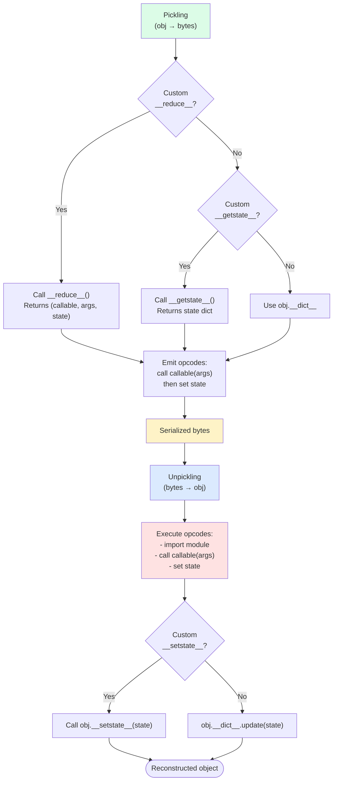
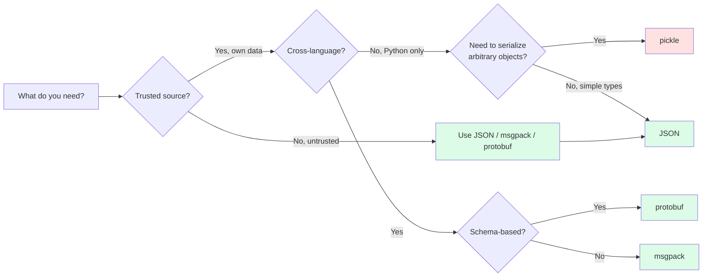

# 4. Pickle and Serialization

> [!note] Why this note exists
> `pickle` is Python's native object serialization format — it can serialize almost any Python object (functions, classes, instances, complex nested structures) into a byte stream and back. That power is also its danger: **unpickling untrusted data is arbitrary code execution**, full stop. This note covers the pickle protocol, the `pickle`/`cPickle` distinction, protocol versions, the security model, what can and can't be pickled, the alternatives (JSON, msgpack, marshal, shelve), and the patterns for using pickle safely (only your own data, with version pinning).

## Why It Matters

Consider this snippet in a "trusted internal tool":

```python
import pickle

# Receive a "config" from another service
config = pickle.loads(request.body)
do_thing(config)
```

If `request.body` is attacker-controlled, the attacker can execute any Python code in your process. The classic exploit:

```python
import pickle, os

class Exploit:
    def __reduce__(self):
        return (os.system, ("rm -rf /tmp/victim",))

payload = pickle.dumps(Exploit())
# Send payload to the service. When it calls pickle.loads(payload),
# os.system("rm -rf /tmp/victim") executes during unpickling.
```

The `__reduce__` method tells pickle how to reconstruct the object — by calling `os.system(...)`. When pickle unpickles, it executes that call. **There is no way to make unpickling safe for untrusted data.** No `safe_loads` function exists; no "sandboxed pickle" works. The pickle format is, by design, a stream of Python opcodes that pickle executes.

This is the central lesson: **pickle is for trusted data only**. For untrusted data, use JSON (or msgpack, or protobuf, or any format that doesn't execute code on parse).

The second lesson: pickle is **Python-specific and version-sensitive**. A pickle created with Python 3.12 may not unpickle cleanly on 3.8, and definitely won't on a non-Python language. Pickle is for **short-term, same-language, same-version** storage — not for long-term persistence or inter-service communication.

## Background

### What pickle is

`pickle` serializes a Python object into a byte stream. The byte stream encodes:
- The object's class (by reference: module + class name).
- The object's state (instance `__dict__`, or via `__reduce__` / `__getstate__`).
- Recursively, all referenced objects.

The byte stream can be saved to a file, sent over a network, or stored in a database. Later, `pickle.loads()` reconstructs an equivalent object.

### `pickle` vs `cPickle` vs `_pickle`

- Python 2 had `pickle` (pure Python) and `cPickle` (C, faster).
- Python 3 unified them: `import pickle` gives you the fast C version (`_pickle`) automatically.
- The pure-Python version is available as `pickle.Pickler` / `pickle.Unpickler` for educational purposes, but you should always use the standard `pickle` import.

### Protocol versions

Pickle has a "protocol" number — the format version. Higher protocols are more efficient but unreadable by older Python versions.

| Protocol | Python | Features |
|----------|--------|----------|
| 0 | All | ASCII (text-mode safe) |
| 1 | All | Binary, old-style |
| 2 | 2.3+ | New-style classes, `__slots__` |
| 3 | 3.0+ | `bytes` objects |
| 4 | 3.4+ | Large objects (>4GB), more types |
| 5 | 3.8+ | Out-of-band data (PEP 574) |

```python
# Pickle with the highest protocol (most efficient)
pickle.dumps(obj, protocol=pickle.HIGHEST_PROTOCOL)

# Pickle with the default protocol (currently 5 on 3.8+)
pickle.dumps(obj)    # uses pickle.DEFAULT_PROTOCOL

# Pin a protocol for compatibility
pickle.dumps(obj, protocol=4)    # works on 3.4+
```

Use `pickle.HIGHEST_PROTOCOL` for new data; pin a specific protocol if you need cross-version compatibility.

### The `pickle` API

```python
import pickle

# Serialize to bytes
data = pickle.dumps(obj, protocol=pickle.HIGHEST_PROTOCOL)

# Deserialize from bytes
obj = pickle.loads(data)

# Serialize to a file
with open("obj.pkl", "wb") as f:
    pickle.dump(obj, f, protocol=pickle.HIGHEST_PROTOCOL)

# Deserialize from a file
with open("obj.pkl", "rb") as f:
    obj = pickle.load(f)

# Multiple objects in one file
with open("objs.pkl", "wb") as f:
    pickle.dump(obj1, f)
    pickle.dump(obj2, f)

with open("objs.pkl", "rb") as f:
    obj1 = pickle.load(f)
    obj2 = pickle.load(f)
```

> [!warning] Always open pickle files in binary mode
> `'wb'` for writing, `'rb'` for reading. Pickle is a binary format (protocols 1-5); text mode corrupts it.

## Main Content

### What can be pickled

Most Python objects can be pickled. The rule: if you can `copy.deepcopy()` it, you can probably pickle it.

**Picklable by default**:
- `None`, `True`, `False`
- `int`, `float`, `complex`, `str`, `bytes`, `bytearray`
- `tuple`, `list`, `dict`, `set`, `frozenset` (if elements are picklable)
- Functions and classes defined at module top level (by reference)
- Instances of user classes (with `__dict__`)
- `datetime`, `Decimal`, `fractions.Fraction`
- `re` compiled patterns
- `collections.namedtuple` instances

**NOT picklable**:
- Lambda functions (and locally-defined functions/classes)
- Generators and coroutines (current state)
- File objects, sockets, locks
- Open database connections
- Frame objects, traceback objects
- Nested classes (defined inside another class or function)

```python
import pickle

# Picklable
pickle.dumps([1, "a", (1, 2), {"k": [1, 2]}])

# Not picklable
pickle.dumps(lambda x: x)    # PicklingError: can't pickle lambda
pickle.dumps(open("/tmp/x")) # TypeError: cannot pickle '_io.TextIOWrapper'
```

### Customizing pickling: `__getstate__` / `__setstate__`

For classes with non-picklable attributes (file handles, locks, cached data), define `__getstate__` and `__setstate__`:

```python
import pickle

class Connection:
    def __init__(self, host, port):
        self.host = host
        self.port = port
        self._conn = self._connect()    # not picklable!
        self._cache = {}

    def _connect(self):
        # ... open a socket ...
        return ...

    def __getstate__(self):
        # Return what to pickle — exclude the connection and cache
        state = self.__dict__.copy()
        del state["_conn"]
        del state["_cache"]
        return state

    def __setstate__(self, state):
        # Restore from pickled state
        self.__dict__.update(state)
        self._conn = self._connect()    # reopen the connection
        self._cache = {}                # fresh cache
```

`__getstate__` returns a dict (or any picklable object) representing the state. `__setstate__` receives that dict and reconstructs the object. If you don't define them, pickle uses `self.__dict__` directly.

### `__reduce__` — full custom control

For objects that don't fit the `__getstate__`/`__setstate__` model, define `__reduce__`. It returns a tuple describing how to reconstruct the object:

```python
class Singleton:
    _instance = None

    def __reduce__(self):
        # (callable, args, state, listitems, dictitems)
        return (Singleton._get_instance, ())

    @classmethod
    def _get_instance(cls):
        if cls._instance is None:
            cls._instance = cls()
        return cls._instance
```

`__reduce__` is also the method attackers abuse — by returning `(os.system, ("malicious command",))`, unpickling executes the call. This is why **unpickling is unsafe for untrusted data**.

### Pickle protocol flow



The "execute opcodes" step is the security hole — pickle can call arbitrary functions during unpickling.

### Security

> [!danger] Never unpickle untrusted data
> Unpickling executes Python code. An attacker who controls the pickle can execute arbitrary code in your process. There is no "safe unpickle" function.

**Safe uses of pickle**:
- Caching your own objects to disk between runs of the same program.
- Sending Python objects between your own processes (via `multiprocessing`, which uses pickle internally).
- Storing Python objects in a database that only your trusted code reads.

**Unsafe uses of pickle**:
- Receiving pickle data over the network.
- Reading pickle files from user uploads.
- Storing pickle in a database that other services or users can read.
- Using pickle as an API serialization format.

For any of those, use JSON, msgpack, protobuf, or another format that doesn't execute code.

### Alternatives

| Format | Pros | Cons |
|--------|------|------|
| `pickle` | Python-native, almost any object | Unsafe, Python-only, version-sensitive |
| `json` | Safe, universal, human-readable | Limited types (no datetime, bytes, tuple) |
| `msgpack` | Safe, compact, fast, multi-language | Third-party, less types than pickle |
| `yaml` | Safe (with `safe_load`), human-readable, richer than JSON | Slower, complex spec |
| `marshal` | Fast, internal to Python | Not for general use (Python internals) |
| `shelve` | Pickle-based key-value store | Inherently pickle's security model |
| `protobuf` | Cross-language, schema-based, fast | Requires schema definition |
| `apache.arrow` | Cross-language, columnar, fast | For tabular data only |

### Serialization format comparison



### `shelve` — pickle-based key-value store

`shelve` is a thin wrapper around `anydbm` + `pickle`. It gives you a dict-like interface backed by a disk file:

```python
import shelve

with shelve.open("mydb") as db:
    db["user:1"] = {"name": "Alice", "age": 30}
    db["user:2"] = {"name": "Bob", "age": 25}

with shelve.open("mydb") as db:
    print(db["user:1"])    # {'name': 'Alice', 'age': 30}
```

`shelve` is convenient but inherits all of pickle's security issues — never open a `shelve` file from an untrusted source.

### `copyreg` — customizing pickling for third-party classes

```python
import copyreg

class MyClass:
    def __init__(self, x):
        self.x = x

def pickle_myclass(obj):
    return MyClass, (obj.x,)

copyreg.pickle(MyClass, pickle_myclass)
# Now pickle.dumps(MyClass(5)) uses pickle_myclass
```

`copyreg.pickle` registers a reducer for a class — useful for adding pickling to classes you don't control.

### Pickling functions and classes

Functions and classes are pickled **by reference** — the pickle stores the module and qualname, not the code:

```python
import pickle

def my_func(x):
    return x + 1

data = pickle.dumps(my_func)
# data contains: module __main__, name my_func

# On unpickle, pickle imports __main__ and looks up my_func.
# If my_func has been deleted or renamed, unpickling fails.
new_func = pickle.loads(data)
new_func(5)    # 6
```

This means:
- You can't pickle lambdas (they have no module-level name).
- You can't pickle locally-defined functions or classes.
- Renaming a function or class breaks old pickles.
- The module must be importable on the receiving end.

### `pickle.Pickler` and `Unpickler` — fine-grained control

```python
import pickle

class RestrictedUnpickler(pickle.Unpickler):
    """Refuse to unpickle anything not on the allowlist."""
    ALLOWED = {("builtins", "list"), ("builtins", "dict"), ("builtins", "str")}

    def find_class(self, module, name):
        if (module, name) in self.ALLOWED:
            return super().find_class(module, name)
        raise pickle.UnpicklingError(f"forbidden: {module}.{name}")

# This is NOT a security boundary — it's a defense in depth.
# A determined attacker can still exploit pickle via __reduce__.
data = pickle.dumps({"a": [1, 2, 3]})
obj = RestrictedUnpickler(data).load()
```

> [!danger] `find_class` overrides are NOT a security boundary
> Pickle's opcode set is rich enough to bypass most allowlist attempts. The only safe approach is to not unpickle untrusted data at all.

## Code Examples

### Example 1: Cache expensive computation

```python
import pickle
from pathlib import Path

def compute_or_load(path: Path, compute_fn):
    if path.exists():
        with path.open("rb") as f:
            return pickle.load(f)
    result = compute_fn()
    with path.open("wb") as f:
        pickle.dump(result, f, protocol=pickle.HIGHEST_PROTOCOL)
    return result
```

### Example 2: Pickle a class with non-picklable state

```python
import pickle

class Worker:
    def __init__(self, config):
        self.config = config
        self._conn = self._connect()    # can't pickle this
        self._cache = {}

    def _connect(self):
        return open_db_connection(self.config.db_url)

    def __getstate__(self):
        state = self.__dict__.copy()
        del state["_conn"]
        del state["_cache"]
        return state

    def __setstate__(self, state):
        self.__dict__.update(state)
        self._conn = self._connect()
        self._cache = {}
```

### Example 3: Use `shelve` for persistent dict

```python
import shelve

with shelve.open("users.db") as db:
    db["alice"] = {"name": "Alice", "login_count": 0}
    db["alice"]["login_count"] += 1    # this DOESN'T work — shelve doesn't detect nested mutations
    # You must reassign:
    user = db["alice"]
    user["login_count"] += 1
    db["alice"] = user
```

### Example 4: Safe alternative — JSON for untrusted data

```python
import json

# Receiving untrusted data over the network
def handle_request(body: bytes):
    # SAFE — JSON parsing doesn't execute code
    data = json.loads(body.decode("utf-8"))
    return process(data)
```

### Example 5: `msgpack` for compact binary

```python
# pip install msgpack
import msgpack

data = {"name": "Alice", "scores": [95, 87, 92]}
packed = msgpack.packb(data)    # compact bytes
unpacked = msgpack.unpackb(packed, raw=False)    # raw=False returns str, not bytes
```

### Example 6: `multiprocessing` uses pickle

```python
from multiprocessing import Pool

def process(x):
    return x * x

# Pool pickles `process` and sends it to worker processes
with Pool(4) as pool:
    results = pool.map(process, range(10))

# This is why multiprocessing requires functions to be top-level (picklable)
```

### Example 7: Version-safe pickle loading

```python
import pickle

def safe_pickle_load(path):
    """Load a pickle file, handling common version issues."""
    with open(path, "rb") as f:
        try:
            return pickle.load(f)
        except pickle.UnpicklingError as e:
            raise ValueError(f"corrupted pickle: {e}") from e
        except ModuleNotFoundError as e:
            raise ValueError(f"missing module: {e}") from e
        except AttributeError as e:
            raise ValueError(f"missing class/attribute: {e}") from e
```

### Example 8: Pickle with cache invalidation

For long-running caches, encode the class version in the filename so a code change invalidates the cache automatically:

```python
import hashlib
import inspect
import pickle
from pathlib import Path

def versioned_cache(namespace: str, fn, *args, **kwargs):
    """Cache fn(*args, **kwargs) to disk, keyed by a hash of the function source."""
    source = inspect.getsource(fn)
    key = hashlib.sha256(f"{namespace}:{source}".encode()).hexdigest()[:16]
    cache_path = Path("/tmp/cache") / f"{namespace}-{key}.pkl"
    if cache_path.exists():
        with cache_path.open("rb") as f:
            return pickle.load(f)
    result = fn(*args, **kwargs)
    cache_path.parent.mkdir(parents=True, exist_ok=True)
    with cache_path.open("wb") as f:
        pickle.dump(result, f, protocol=pickle.HIGHEST_PROTOCOL)
    return result
```

The function source hash means: if you edit the function, the cache key changes, and the next call recomputes. No stale results from an old function version.

### Example 9: Pickle alternatives — when to use what

A decision guide for the common serialization scenarios:

```python
# Scenario 1: Sending Python objects between your own processes
# → pickle (or multiprocessing, which uses pickle internally)
from multiprocessing import Pool
with Pool() as p:
    results = p.map(worker_fn, data)

# Scenario 2: Caching expensive results to disk
# → pickle (with versioned filenames)
import pickle
with open("cache.pkl", "wb") as f:
    pickle.dump(result, f, protocol=pickle.HIGHEST_PROTOCOL)

# Scenario 3: Receiving data over the network from untrusted clients
# → JSON (stdlib) or msgpack (compact)
import json
data = json.loads(request.body.decode("utf-8"))

# Scenario 4: Storing Python objects long-term (years)
# → JSON for simple types, or a schema-based format (protobuf, avro) for structured data
# Don't use pickle — Python version drift will break it.

# Scenario 5: Cross-language communication
# → JSON (universal), protobuf (typed), or msgpack (compact)
# Never pickle — only Python can read pickle.

# Scenario 6: Large numerical arrays
# → numpy.save / numpy.load (.npy) or HDF5 for multi-array datasets
import numpy as np
np.save("array.npy", arr)        # binary, fast, type-preserving
arr = np.load("array.npy")

# Scenario 7: ML model persistence
# → joblib (sklearn's preferred pickle wrapper) or the framework's native format
import joblib
joblib.dump(model, "model.joblib")
model = joblib.load("model.joblib")
```

### `dataclasses` and pickle

Dataclasses are picklable by default (since they're regular classes with `__dict__`):

```python
from dataclasses import dataclass, field

@dataclass
class User:
    name: str
    age: int
    tags: list[str] = field(default_factory=list)

import pickle
u = User("Alice", 30, ["admin", "staff"])
data = pickle.dumps(u)
u2 = pickle.loads(data)
# u2 == u  → True
```

For dataclasses with non-picklable fields (e.g., a database connection), use `__getstate__`/`__setstate__` as above, or `field(default=None, repr=False, compare=False)` and reconnect in `__post_init__`.

### Custom `__reduce__` for immutable types

For immutable types where the constructor must run (e.g., frozen dataclasses), `__reduce__` lets you specify the constructor call:

```python
class FrozenPoint:
    __slots__ = ("x", "y")

    def __init__(self, x, y):
        object.__setattr__(self, "x", x)
        object.__setattr__(self, "y", y)

    def __reduce__(self):
        return (FrozenPoint, (self.x, self.y))

# Now pickle.dumps(FrozenPoint(1, 2)) works.
```

### Debugging pickle issues

Common pickle errors and their causes:

| Error | Likely cause |
|-------|-------------|
| `PicklingError: Can't pickle <class '...'>: attribute lookup ...` | Class defined inside a function (not module-level) |
| `PicklingError: Can't pickle <function ...>` | Lambda or local function — use a module-level function |
| `TypeError: cannot pickle '_io.TextIOWrapper'` | Trying to pickle a file object — exclude it via `__getstate__` |
| `AttributeError: ... has no attribute 'old_name'` | Class was renamed between pickling and unpickling |
| `ModuleNotFoundError` | The module containing the class isn't importable on the receiving side |
| `_pickle.UnpicklingError: invalid load key, '\x...'` | File was opened in text mode and corrupted — always use `"rb"` |
| `_pickle.UnpicklingError: unsupported pickle protocol` | Pickle was written with a higher protocol than the reader supports |

## Common Pitfalls

> [!danger] Unpickling untrusted data is RCE
> There is no safe way to unpickle attacker-controlled bytes. Use JSON, msgpack, or another safe format for untrusted input.

> [!danger] Renaming a class breaks old pickles
> Pickle stores the class by module + qualname. If you rename or move the class, old pickles can't be unpickled. Keep a stable class location or use `__reduce__` to handle migration.

> [!danger] Lambdas and local functions can't be pickled
> `pickle.dumps(lambda x: x)` raises `PicklingError`. Use a module-level function instead.

> [!danger] Opening pickle files in text mode
> `open("obj.pkl", "w")` corrupts binary pickle data. Always use `"wb"` / `"rb"`.

> [!danger] Mixing pickle protocols across Python versions
> A pickle created with protocol 5 (3.8+) can't be read by 3.7. Pin a protocol if you need cross-version support.

> [!danger] `shelve` doesn't detect nested mutations
> ```python
> db = shelve.open("x")
> db["k"]["nested"] = 1    # change is lost!
> ```
> You must reassign: `v = db["k"]; v["nested"] = 1; db["k"] = v`.

> [!danger] `pickle.loads` doesn't validate types
> You can pickle a `dict`, send it, and the receiver gets a `dict`. But you can also pickle a custom class — and the receiver needs that class importable. Don't assume the receiver will get a "simple" object.

> [!danger] Pickling a class doesn't pickle its code
> Pickle stores a reference to the class. If the class definition changes between pickling and unpickling, the unpickled object may have unexpected behavior (e.g., new `__init__` signature).

> [!danger] Circular references can be pickled
> Pickle handles cycles correctly, but the resulting bytes are larger and slower to load. If you don't need cycles, break them before pickling.

> [!danger] `copyreg.pickle` is global
> It affects all pickling in the process. Don't use it in libraries that other code imports — your reducer might conflict with the user's.

## Tips and Tricks

- **Use `pickle.HIGHEST_PROTOCOL`** for new data — most efficient.
- **Pin a protocol** (`protocol=4`) if you need cross-version compatibility.
- **Never unpickle untrusted data** — JSON is your friend.
- **For caching, use `pickle` + a version key** in the filename, so old caches are invalidated when you change the class.
- **For inter-process communication, `multiprocessing` already uses pickle** — just make sure your data is picklable (no lambdas, no file handles).
- **`__getstate__` / `__setstate__`** for classes with non-picklable state.
- **`__reduce__` for full control** — but be aware it's the security-critical method.
- **`copyreg.pickle`** to add pickling to third-party classes (rarely needed).
- **`shelve`** for simple persistent dicts — but understand its limits.
- **For long-term storage, prefer JSON or msgpack** — pickle is short-term.
- **For high-performance serialization of Python objects, `orjson` + `dataclasses`** is often fast enough and much safer.
- **Always document the protocol version** when writing pickles to disk.

## Active Recall

1. Why is unpickling untrusted data dangerous? Give an example attack.
2. What's the difference between `pickle` and `cPickle` in Python 3?
3. List three Python objects that can't be pickled.
4. What does `__getstate__` return, and when is it called?
5. Why can't you pickle a lambda? What's the workaround?
6. What pickle protocol should you use by default? When would you pin a lower one?
7. Write a function that caches the result of an expensive computation using pickle.
8. Why does renaming a class break old pickles?
9. What's `shelve` and how does it relate to pickle?
10. Why is `find_class` override NOT a security boundary?
11. Compare pickle, JSON, and msgpack for: trusted data, untrusted data, cross-language interop, rich Python types.
12. Why does `multiprocessing` use pickle? What does that imply about the data you can pass between processes?
13. Why must pickle files be opened in binary mode?
14. How would you customize pickling for a class with a database connection attribute?

## Next Steps

- [[3. CSV and JSON]] — the safe alternative for untrusted and cross-language data.
- [[5. Working with Binary Files]] — binary file formats, including pickle's binary nature.
- [[1. Reading and Writing Files]] — the underlying file I/O.
- [[../5. Error Handling/2. raise and Custom Exceptions]] — design exceptions for unpickling failures.
- [[../7. Modules and Packages/1. Modules and import]] — pickle imports modules to find classes, so module layout matters.
