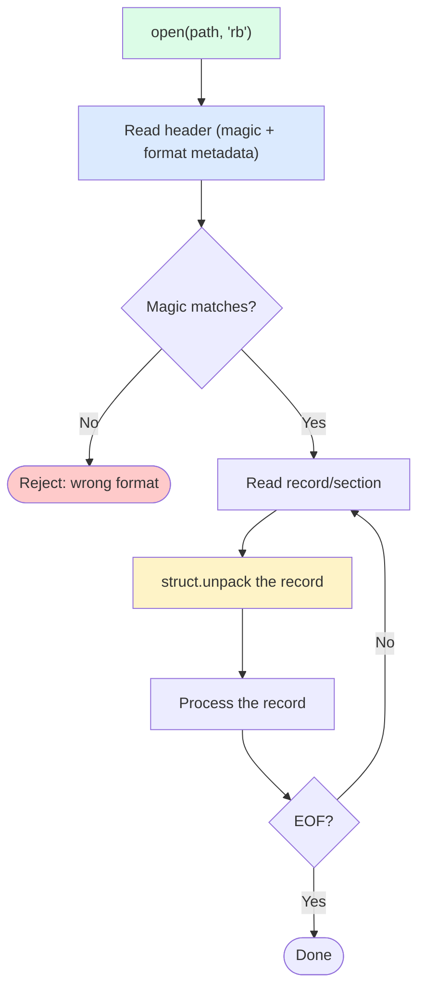

# 5. Working with Binary Files

> [!note] Why this note exists
> Text files are easy — open, read, write strings. Binary files are where the real world lives: images, audio, video, compiled code, network packets, custom file formats, scientific data. Python's binary I/O is built on three layers: the `bytes`/`bytearray`/`memoryview` types, the binary file modes (`'rb'`, `'wb'`), and the `struct` module for packing/unpacking C-style binary records. This note covers binary file modes, the `bytes`/`memoryview` distinction, `struct` format strings and byte order, reading file headers, and the patterns for parsing custom binary formats.

## Why It Matters

Consider reading a PNG file's dimensions:

```python
# WRONG — text mode corrupts binary data
with open("image.png") as f:    # default mode is 'r' (text)
    data = f.read()             # UnicodeDecodeError on first non-text byte
```

```python
# CORRECT — binary mode
with open("image.png", "rb") as f:
    data = f.read()
# PNG signature: 8 bytes, then IHDR chunk with width and height as big-endian uint32
import struct
width, height = struct.unpack(">II", data[16:24])
```

The lesson: **binary files must be opened in binary mode**. Text mode applies encoding and newline translation, which corrupts binary data.

The second lesson: **binary data parsing is about byte layouts**. The PNG header has width at bytes 16-19, height at bytes 20-23, both as 4-byte big-endian unsigned integers. `struct.unpack(">II", ...)` is the canonical way to extract them.

The third lesson: **`bytes` vs `bytearray` vs `memoryview`**. `bytes` is immutable (like `str`); `bytearray` is mutable (like a `list` of ints); `memoryview` is a zero-copy view into another buffer (useful for slicing large binary blobs without copying). Choosing the right one matters for performance.

## Background

### `bytes` and `bytearray`

| | `bytes` | `bytearray` |
|--|---------|-------------|
| Mutability | Immutable | Mutable |
| Literal | `b"hello"` | `bytearray(b"hello")` |
| Element type | `int` (0-255) | `int` (0-255) |
| Methods | read-only | `append`, `extend`, `insert`, `pop`, etc. |
| Use case | Most binary data | Building up binary data incrementally |

```python
# bytes — immutable
b = b"hello"
b[0]            # 104 (int, not b"h")
b[1:3]          # b"el" (bytes)
# b[0] = 72     # TypeError

# bytearray — mutable
ba = bytearray(b"hello")
ba[0] = 72      # works
ba.append(33)   # append byte 33 (== '!')
ba.extend(b"!!")
# ba is now bytearray(b"Hello!!!")
```

### `memoryview` — zero-copy view

`memoryview` lets you slice a `bytes`/`bytearray`/`array.array` without copying:

```python
data = b"0123456789" * 1_000_000    # 10MB

# bytes slicing — copies
chunk = data[1000:2000]    # new bytes object, 1000 bytes copied

# memoryview — no copy
mv = memoryview(data)
chunk = mv[1000:2000]      # view into the original; no copy
# Convert back to bytes when needed:
chunk_bytes = bytes(chunk)
```

`memoryview` is essential for performance when working with large binary blobs — file headers, network packets, video frames, etc.

### Binary file modes

| Mode | Description |
|------|-------------|
| `'rb'` | Read binary (default for `'rb'`) |
| `'wb'` | Write binary (truncates) |
| `'ab'` | Append binary |
| `'xb'` | Exclusive create binary |
| `'r+b'` | Read and write binary (file must exist) |
| `'w+b'` | Read and write binary (truncates) |

Binary mode means:
- `read()` and `write()` use `bytes`/`bytearray`, not `str`.
- No encoding/decoding.
- No newline translation (`\r\n` stays `\r\n`).
- `seek()` accepts arbitrary byte offsets.

### The `struct` module

`struct` packs Python values into `bytes` (and unpacks `bytes` back into Python values) according to a format string. It's the standard way to read/write C-style binary records.

Format string components:
1. **Byte order** (optional first char):
   - `@` — native byte order, native sizes (default)
   - `<` — little-endian, standard sizes
   - `>` — big-endian, standard sizes
   - `!` — network byte order (big-endian, standard sizes) — same as `>`
   - `=` — native byte order, standard sizes
2. **Format chars** (repeat with a count):
   - `x` — pad byte (no value)
   - `c` — char (bytes of length 1)
   - `b`/`B` — signed/unsigned char (1 byte)
   - `?` — bool (1 byte)
   - `h`/`H` — short/unsigned short (2 bytes)
   - `i`/`I` — int/unsigned int (4 bytes)
   - `l`/`L` — long/unsigned long (4 or 8 bytes, platform-dependent)
   - `q`/`Q` — long long/unsigned long long (8 bytes)
   - `f` — float (4 bytes)
   - `d` — double (8 bytes)
   - `s` — char[] (bytes of fixed length, e.g., `10s`)
   - `p` — Pascal string (length-prefixed)

```python
import struct

# Pack: encode values into bytes
data = struct.pack(">I", 42)        # b'\x00\x00\x00*' — big-endian uint32
data = struct.pack("<I", 42)        # b'*\x00\x00\x00' — little-endian uint32
data = struct.pack(">II", 42, 99)   # 8 bytes — two uint32s
data = struct.pack(">10s", b"hello")  # b'hello\x00\x00\x00\x00\x00' — padded

# Unpack: decode bytes into values
value = struct.unpack(">I", b'\x00\x00\x00*')[0]    # 42
a, b = struct.unpack(">II", eight_bytes)             # (42, 99)

# Pack into a pre-allocated buffer
buf = bytearray(8)
struct.pack_into(">II", buf, 0, 42, 99)

# Unpack from a buffer at an offset
a, b = struct.unpack_from(">II", buf, 0)

# Calculate size of a format
struct.calcsize(">II")    # 8
```

### `bytearray` for building binary

For incremental construction of binary data, `bytearray` is faster than `bytes` `+=`:

```python
# BAD — O(n^2)
data = b""
for chunk in chunks:
    data += chunk

# GOOD — O(n)
data = bytearray()
for chunk in chunks:
    data.extend(chunk)
result = bytes(data)
```

### `array.array` — typed arrays

`array.array` is a flat array of C primitives:

```python
import array

a = array.array('i', [1, 2, 3, 4])    # array of signed ints
a.append(5)
a[0] = 10
a.tobytes()    # serialize to bytes (little-endian by default)
a.byteswap()   # swap byte order in place
```

Type codes: `'b'`/`'B'` (char), `'h'`/`'H'` (short), `'i'`/`'I'` (int), `'l'`/`'L'` (long), `'q'`/`'Q'` (long long), `'f'` (float), `'d'` (double).

`array.array` is more memory-efficient than a list of ints (4 bytes per int vs ~28 for a Python int object). For real numeric work, use NumPy.

## Main Content

### Reading a binary file

```python
# Read whole file into memory
with open("data.bin", "rb") as f:
    data = f.read()    # bytes

# Read in chunks
with open("big.bin", "rb") as f:
    while True:
        chunk = f.read(65536)
        if not chunk:
            break
        process(chunk)

# Read N bytes
with open("data.bin", "rb") as f:
    header = f.read(16)
    body = f.read(1024)
    rest = f.read()    # rest of file
```

### Writing a binary file

```python
# Write bytes
with open("out.bin", "wb") as f:
    f.write(b"\x00\x01\x02")
    f.write(bytearray([3, 4, 5]))

# Write struct-packed data
import struct
with open("out.bin", "wb") as f:
    f.write(struct.pack(">II", 42, 99))
    f.write(struct.pack(">f", 3.14))

# Append
with open("out.bin", "ab") as f:
    f.write(b"more data")
```

### Reading file headers

Binary file formats usually start with a "magic number" — a fixed byte sequence that identifies the format. Examples:

| Format | Magic bytes | Header layout |
|--------|-------------|---------------|
| PNG | `89 50 4E 47 0D 0A 1A 0A` | Then IHDR chunk with width, height (uint32 BE) |
| JPEG | `FF D8 FF` | Then markers |
| GIF | `47 49 46 38` ("GIF8") | Then version, width, height (uint16 LE) |
| PDF | `25 50 44 46` ("%PDF") | Then version |
| ZIP | `50 4B 03 04` ("PK\x03\x04") | Then file headers |
| ELF | `7F 45 4C 46` | Then class, endianness, etc. |

```python
def read_png_dimensions(path):
    with open(path, "rb") as f:
        header = f.read(24)
        if not header.startswith(b"\x89PNG\r\n\x1a\n"):
            raise ValueError("not a PNG")
        # Bytes 16-23: width (4 BE), height (4 BE)
        width, height = struct.unpack(">II", header[16:24])
        return width, height
```

### Binary file reading flow



### `struct` examples

#### Example 1: Read a C struct from a file

```c
// C struct
struct record {
    int32_t id;
    float value;
    char name[16];
};
```

```python
import struct

# Format: little-endian int32, float, 16-byte string
fmt = "<i f 16s"
size = struct.calcsize(fmt)    # 24 bytes (4 + 4 + 16, no padding due to standard sizes)

with open("records.bin", "rb") as f:
    while True:
        data = f.read(size)
        if len(data) < size:
            break
        id_, value, name = struct.unpack(fmt, data)
        # name is bytes; strip trailing nulls
        name = name.rstrip(b"\x00").decode("utf-8")
        print(id_, value, name)
```

The `<` (little-endian, standard sizes) is important — without it, `struct` uses native byte order and padding, which varies by platform.

#### Example 2: Pack a record

```python
import struct

def pack_record(id_: int, value: float, name: str) -> bytes:
    name_bytes = name.encode("utf-8")[:16].ljust(16, b"\x00")
    return struct.pack("<i f 16s", id_, value, name_bytes)

with open("records.bin", "wb") as f:
    f.write(pack_record(1, 3.14, "Alice"))
    f.write(pack_record(2, 2.71, "Bob"))
```

#### Example 3: Variable-length strings

```python
import struct

# Length-prefixed string: 4-byte length, then bytes
def write_string(f, s):
    b = s.encode("utf-8")
    f.write(struct.pack(">I", len(b)))
    f.write(b)

def read_string(f):
    length = struct.unpack(">I", f.read(4))[0]
    return f.read(length).decode("utf-8")
```

#### Example 4: Bit fields

`struct` doesn't directly support bit fields (C does). Use bit manipulation:

```python
# Pack two 4-bit values into one byte
def pack_nibbles(high: int, low: int) -> int:
    return (high << 4) | (low & 0xF)

# Unpack
high = (byte >> 4) & 0xF
low = byte & 0xF
```

For more complex bit packing, consider `ctypes` or `bitstruct` (third-party).

### `memoryview` for zero-copy parsing

```python
import struct

def parse_records(data: bytes):
    """Parse all records without copying slices."""
    mv = memoryview(data)
    fmt = ">II"    # two uint32s
    size = struct.calcsize(fmt)
    records = []
    for offset in range(0, len(mv) - size + 1, size):
        a, b = struct.unpack_from(fmt, mv, offset)
        records.append((a, b))
    return records
```

`memoryview` + `unpack_from` avoids creating intermediate `bytes` objects for each record.

### `mmap` — memory-mapped files

For very large files, `mmap` maps the file into the process's virtual memory without loading it all:

```python
import mmap

with open("huge.bin", "rb") as f:
    with mmap.mmap(f.fileno(), 0, access=mmap.ACCESS_READ) as mm:
        # mm is a bytes-like object backed by the file
        header = mm[:16]
        # Random access without read() calls
        byte_at_1M = mm[1_000_000]
```

`mmap` is the right choice for:
- Files larger than memory (the OS pages in only what you touch).
- Random access patterns (no `seek()` overhead).
- Multiple processes sharing the same file (writes are visible to all).

### Endianness — the eternal gotcha

```python
# Little-endian (x86, ARM in LE mode): least significant byte first
struct.pack("<I", 0x12345678)    # b'\x78\x56\x34\x12'

# Big-endian (network byte order, Java, some MIPS): most significant byte first
struct.pack(">I", 0x12345678)    # b'\x12\x34\x56\x78'
```

Most binary formats specify endianness explicitly:
- **Network protocols**: big-endian (`>`)
- **PNG, JPEG, JVM class files**: big-endian (`>`)
- **GIF, BMP, WAV, RIFF**: little-endian (`<`)
- **x86 native**: little-endian (`<`)

Always check the format spec. Don't rely on native byte order (`@` or no prefix).

### `ctypes` — for complex C structures

For complex C structures (especially with bit fields, unions, or arrays), `ctypes` is more expressive than `struct`:

```python
import ctypes

class Record(ctypes.Structure):
    _fields_ = [
        ("id", ctypes.c_int32),
        ("value", ctypes.c_float),
        ("name", ctypes.c_char * 16),
        ("flags", ctypes.c_uint32, 8),    # bit field (8 bits)
    ]

# Read from a file
with open("data.bin", "rb") as f:
    data = f.read(ctypes.sizeof(Record))
    record = Record.from_buffer_copy(data)
    print(record.id, record.value, record.name)

# Write
record.id = 42
with open("out.bin", "wb") as f:
    f.write(bytes(record))
```

`ctypes` is also useful for calling C functions from Python (FFI).

## Code Examples

### Example 1: Parse a WAV file header

```python
import struct
from pathlib import Path

def parse_wav(path: Path):
    with path.open("rb") as f:
        riff = f.read(4)
        if riff != b"RIFF":
            raise ValueError("not a WAV")
        size = struct.unpack("<I", f.read(4))[0]
        wave = f.read(4)
        if wave != b"WAVE":
            raise ValueError("not a WAV")

        # Find fmt chunk
        while True:
            chunk_id = f.read(4)
            chunk_size = struct.unpack("<I", f.read(4))[0]
            if chunk_id == b"fmt ":
                audio_format, channels, sample_rate, byte_rate, block_align, bits_per_sample = \
                    struct.unpack("<HHIIHH", f.read(16))
                return {
                    "channels": channels,
                    "sample_rate": sample_rate,
                    "bits_per_sample": bits_per_sample,
                }
            f.seek(chunk_size, 1)    # skip this chunk
```

### Example 2: Build a binary log writer

```python
import struct
from pathlib import Path

class BinaryLog:
    """Append-only log with length-prefixed records."""
    def __init__(self, path: Path):
        self.path = path
        self.f = path.open("ab")

    def write(self, record: bytes):
        # 4-byte big-endian length, then the record
        self.f.write(struct.pack(">I", len(record)))
        self.f.write(record)

    def close(self):
        self.f.close()

    def __enter__(self): return self
    def __exit__(self, *args): self.close()

# Reading
def read_log(path: Path):
    with path.open("rb") as f:
        while True:
            header = f.read(4)
            if len(header) < 4:
                break
            length = struct.unpack(">I", header)[0]
            yield f.read(length)
```

### Example 3: Memory-mapped large file

```python
import mmap
import struct

def count_records(path: str, record_size: int = 8) -> int:
    with open(path, "rb") as f:
        size = f.seek(0, 2)
        return size // record_size

def iter_records(path: str):
    with open(path, "rb") as f:
        with mmap.mmap(f.fileno(), 0, access=mmap.ACCESS_READ) as mm:
            record_size = struct.calcsize(">II")
            for offset in range(0, len(mm) - record_size + 1, record_size):
                yield struct.unpack_from(">II", mm, offset)
```

### Example 4: Network packet header

```python
import struct

# IP header (first 20 bytes, no options)
def parse_ip_header(data: bytes):
    # IPv4 header format (simplified)
    version_ihl, tos, total_length, ident, flags_offset, ttl, protocol, checksum, src, dst = \
        struct.unpack(">BBHHHBBHII", data[:20])
    version = version_ihl >> 4
    ihl = (version_ihl & 0xF) * 4    # header length in bytes
    return {
        "version": version,
        "header_length": ihl,
        "total_length": total_length,
        "ttl": ttl,
        "protocol": protocol,
        "src": ".".join(str(b) for b in struct.pack(">I", src)),
        "dst": ".".join(str(b) for b in struct.pack(">I", dst)),
    }
```

### Example 5: Write a struct with a string field

```python
import struct

def write_record(f, id_: int, name: str):
    name_bytes = name.encode("utf-8")
    if len(name_bytes) > 255:
        raise ValueError("name too long")
    f.write(struct.pack("<B", len(name_bytes)))    # 1-byte length
    f.write(struct.pack("<i", id_))                # 4-byte signed int
    f.write(name_bytes)                            # variable-length string

def read_record(f):
    length = struct.unpack("<B", f.read(1))[0]
    id_ = struct.unpack("<i", f.read(4))[0]
    name = f.read(length).decode("utf-8")
    return id_, name
```

### Example 6: Parse a PNG file signature and dimensions

```python
import struct
from pathlib import Path

def parse_png(path: Path):
    PNG_MAGIC = b"\x89PNG\r\n\x1a\n"
    with path.open("rb") as f:
        if f.read(len(PNG_MAGIC)) != PNG_MAGIC:
            raise ValueError("not a PNG file")
        # First chunk: IHDR
        length = struct.unpack(">I", f.read(4))[0]
        chunk_type = f.read(4)
        if chunk_type != b"IHDR":
            raise ValueError("expected IHDR first")
        width, height, bit_depth, color_type, compression, filter_method, interlace = \
            struct.unpack(">IIBBBBB", f.read(13))
        return {
            "width": width,
            "height": height,
            "bit_depth": bit_depth,
            "color_type": color_type,
        }

# Usage
info = parse_png(Path("photo.png"))
print(f"{info['width']}x{info['height']}, depth={info['bit_depth']}")
```

The PNG magic bytes are deliberately designed to detect common transmission errors (the `\x89` makes it look "binary" to old text-only tools; the `\r\n` detects CR/LF translation; the `\x1a` stops display on DOS `type`). Recognising magic bytes is the universal first step in parsing any binary format.

### Example 7: Reading a fixed-width binary table with NumPy

For tabular binary data, `numpy` is dramatically faster than manual `struct` loops:

```python
import numpy as np

# Define a structured dtype matching the on-disk layout
dtype = np.dtype([
    ("id", ">i4"),            # 4-byte big-endian int
    ("timestamp", ">u8"),     # 8-byte unsigned int (Unix time)
    ("value", ">f8"),         # 8-byte double
    ("label", "S16"),         # 16-byte ASCII string
])

# Read 1 million records in a single call
data = np.fromfile("events.bin", dtype=dtype)
print(data["value"].mean())     # vectorised — much faster than a Python loop
print(data[data["id"] == 42])   # boolean-indexed lookup
```

`numpy.fromfile` reads the whole file in one OS call and interprets the bytes according to the dtype — orders of magnitude faster than a Python loop with `struct.unpack`.

### Example 8: Hex dumps and debugging binary data

When debugging binary parsing, hex dumps are essential. Python provides `binascii.hexlify` and the `hex()` method on bytes:

```python
import binascii

data = b"\x89PNG\r\n\x1a\n\x00\x00\x00\x0dIHDR"

# Hex string
print(binascii.hexlify(data).decode())
# '89504e470d0a1a0a0000000d49484452'

# Hex+ASCII dump (custom)
def hexdump(data: bytes, width: int = 16) -> str:
    lines = []
    for i in range(0, len(data), width):
        chunk = data[i:i + width]
        hex_part = " ".join(f"{b:02x}" for b in chunk)
        ascii_part = "".join(
            chr(b) if 32 <= b < 127 else "." for b in chunk
        )
        lines.append(f"{i:08x}  {hex_part:<{width * 3}}  {ascii_part}")
    return "\n".join(lines)

print(hexdump(b"\x89PNG\r\n\x1a\nHello, world!"))
# 00000000  89 50 4e 47 0d 0a 1a 0a  48 65 6c 6c 6f 2c 20 77   .PNG....Hello, w
# 00000010  6f 72 6c 64 21                                        orld!
```

A hex dump lets you see both the raw byte values and the printable ASCII representation side by side — indispensable when reverse-engineering a binary format or diagnosing a parse failure.

### Binary format design principles

When designing your own binary format:

1. **Start with magic bytes** — unique 4-8 bytes that identify the format and version. Example: `b"MYFMT01"`.
2. **Use network byte order (big-endian)** for portability — `>` in `struct`.
3. **Length-prefix variable-length fields** — never use sentinel-terminated strings (they break on binary data containing the sentinel).
4. **Align fields explicitly** — don't rely on native alignment. Use `<` or `>` to get packed layouts.
5. **Include a checksum or CRC** for integrity checking on read.
6. **Version the format** — first byte after the magic should be a version number; reject unknown versions explicitly.
7. **Document the format** — write a spec. Future-you (or someone else) will need to write a reader.

```python
import struct
import zlib

MAGIC = b"EVNT"
VERSION = 1

def write_event(f, event_id: int, payload: bytes):
    """Write a single event: magic + version + id + length + payload + CRC32."""
    header = struct.pack(">4sBII", MAGIC, VERSION, event_id, len(payload))
    crc = zlib.crc32(payload) & 0xFFFFFFFF
    f.write(header)
    f.write(payload)
    f.write(struct.pack(">I", crc))

def read_event(f):
    header = f.read(13)
    if len(header) < 13:
        return None    # EOF
    magic, version, event_id, length = struct.unpack(">4sBII", header)
    if magic != MAGIC:
        raise ValueError(f"bad magic: {magic!r}")
    if version != VERSION:
        raise ValueError(f"unsupported version: {version}")
    payload = f.read(length)
    if len(payload) < length:
        raise ValueError("truncated payload")
    crc_stored = struct.unpack(">I", f.read(4))[0]
    crc_computed = zlib.crc32(payload) & 0xFFFFFFFF
    if crc_stored != crc_computed:
        raise ValueError("CRC mismatch — corrupted data")
    return event_id, payload
```

This format is self-describing (magic), forward-compatible (version), length-prefixed (so the reader knows where each record ends), and integrity-checked (CRC32 catches corruption).

## Common Pitfalls

> [!danger] Opening binary files in text mode
> `open("data.bin")` defaults to `'r'` (text). Reading non-text bytes raises `UnicodeDecodeError`. Always use `'rb'` / `'wb'` for binary.

> [!danger] Forgetting the byte-order prefix in `struct`
> Without `<` / `>` / `!`, `struct` uses native byte order, which differs between x86 (little-endian) and some other platforms. Always specify byte order explicitly.

> [!danger] Native padding in `struct`
> `struct.pack("ii", 1, 2)` (no byte-order prefix) uses native alignment, which may insert padding. Use `<` or `>` to get standard sizes and no padding.

> [!danger] `bytes[i]` returns an `int`, not a 1-byte `bytes`
> ```python
> b"abc"[0]    # 97 (int), not b"a"
> b"abc"[0:1]  # b"a" (bytes)
> ```
> To get a 1-byte `bytes`, slice: `b[0:1]`.

> [!danger] `bytes` are immutable
> `b[0] = 72` raises `TypeError`. Use `bytearray` for mutation.

> [!danger] String encoding vs bytes
> Don't confuse `b"hello"` (bytes) with `"hello"` (str). They're different types and can't be concatenated.

> [!danger] Wrong endianness for the format
> Network protocols are big-endian. Most file formats (PNG, GIF, WAV) have specific endianness — check the spec.

> [!danger] Struct size mismatch on read
> If you read fewer bytes than `struct.calcsize(fmt)`, `unpack` raises `struct.error`. Always check the length first.

> [!danger] `mmap` requires the file to be open
> The `mmap` object references the file descriptor. Close the `mmap` before closing the file, or use both in nested `with` statements.

> [!danger] Signed vs unsigned
> `b` (signed char) interprets byte 0xFF as -1; `B` (unsigned char) interprets it as 255. Pick the right one for your data.

## Tips and Tricks

- **Always open binary files with `'rb'` / `'wb'`** — never rely on default mode.
- **Always specify byte order** in `struct` (`<` or `>` or `!`).
- **Use `bytearray` for building binary incrementally** — `bytes +=` is O(n²).
- **Use `memoryview` for zero-copy slicing** of large binary blobs.
- **Use `struct.unpack_from` / `pack_into`** to avoid slicing overhead.
- **Use `mmap` for very large files** — OS handles paging.
- **Use `ctypes` for complex C structures** — bit fields, unions, nested structs.
- **Magic bytes identify the format** — always check the header before parsing.
- **Read the file format spec** — endianness, alignment, and size matter.
- **`array.array` is more memory-efficient than `list`** for typed numeric data.
- **For numerical work, use NumPy** — `numpy.frombuffer` parses binary into typed arrays in one call.
- **`binascii.hexlify` / `unhexlify`** for hex dumps of binary data.
- **`int.from_bytes` / `int.to_bytes`** for simple integer encoding without `struct`:
  ```python
  n = int.from_bytes(b"\x00\x01", "big")    # 1
  b = (256).to_bytes(2, "big")              # b"\x01\x00"
  ```

## Active Recall

1. Why must binary files be opened with `'rb'` / `'wb'` instead of `'r'` / `'w'`?
2. What's the difference between `bytes` and `bytearray`?
3. What does `struct.pack(">I", 42)` produce? What's the `>` for?
4. What's the difference between `b"abc"[0]` and `b"abc"[0:1]`?
5. How would you read a 4-byte big-endian unsigned integer from a binary file?
6. What is `memoryview` for, and when would you use it?
7. Why is `bytearray` better than `bytes` for building binary data incrementally?
8. What's the difference between `<`, `>`, `!`, and `@` in `struct` format strings?
9. How would you read the dimensions of a PNG file?
10. What is `mmap`, and when is it the right choice?
11. Write a function that writes a length-prefixed string to a binary file.
12. How would you parse a C struct with bit fields from a binary file?
13. Why does `struct.pack("ii", 1, 2)` produce 8 bytes on some platforms and 16 on others?
14. How do you convert an `int` to bytes without `struct`?

## Next Steps

- [[1. Reading and Writing Files]] — the underlying file I/O model.
- [[4. Pickle and Serialization]] — Python's native binary serialization (with security caveats).
- [[3. CSV and JSON]] — text-based alternatives that often replace custom binary formats.
- [[2. Path Handling with pathlib]] — `Path` works seamlessly with binary `open()`.
- [[../4. Data Structures/6. Strings Deep Dive]] — the `bytes`/`str` distinction covered in depth.
