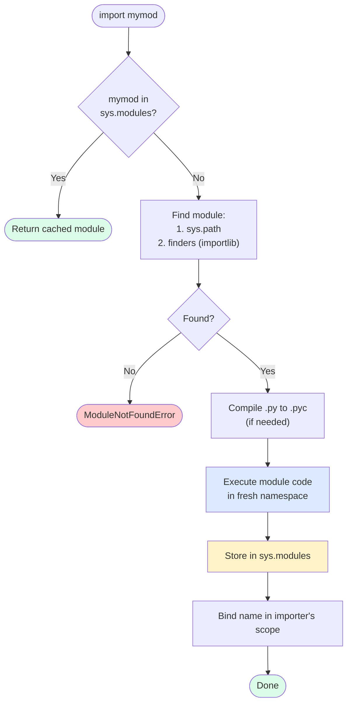

# 1. Modules and import

> [!note] Why this note exists
> Every Python program of any size is split across multiple files — modules. The `import` statement is the bridge between them, but its semantics are deeper than "load the file": modules are cached in `sys.modules`, names are bound in the importing scope, packages and namespaces interact in subtle ways, and the `__name__ == "__main__"` idiom enables dual-use modules (importable AND runnable). This note covers the import forms, the module search path, the import system internals (`sys.modules`, `importlib`), the `__main__` distinction, circular imports, and the patterns that keep module organization clean.

## Why It Matters

Consider this layout:

```
myapp/
    __init__.py
    main.py
    utils.py
    db/
        __init__.py
        connection.py
        models.py
```

Inside `main.py`, you write:

```python
import utils
from db.connection import connect
from . import utils as u    # does this work?
```

If you don't understand the import system, three things will confuse you:
1. Why `import utils` works when running `python main.py` from inside `myapp/`, but fails when running `python myapp/main.py` from outside.
2. Why `from . import utils` (relative import) works in `db/models.py` but raises `ImportError` in `main.py` when run directly.
3. Why adding `print("imported")` at the top of `utils.py` only prints once, even if you `import utils` from five different files.

These are not edge cases — they're the import system working as designed. Understanding it lets you:
- Structure projects of any size.
- Debug "ImportError: No module named ..." in seconds.
- Use `__name__ == "__main__"` to make files that are both runnable and importable.
- Avoid circular imports.
- Write plugins, hooks, and dynamic loading code.

## Background

### What a module is

A **module** is a `.py` file (or a compiled C extension). When you `import` it, Python:
1. Locates the file (using `sys.path`).
2. Compiles it to bytecode (if needed; `.pyc` cached in `__pycache__`).
3. Executes the module's top-level code in a fresh namespace.
4. Stores the resulting module object in `sys.modules` (a dict).
5. Binds the module name in the importing scope.

Subsequent imports of the same module return the cached object from `sys.modules` — they don't re-execute the file. This is why a module's top-level code runs only once per process.

### The import forms

```python
# 1. Import the module
import module_name
module_name.function()    # access via the module name

# 2. Import specific names
from module_name import function, Class, constant
function()                # access directly

# 3. Import with alias
import module_name as mn
mn.function()
from module_name import function as f
f()

# 4. Import everything (DON'T — pollutes namespace)
from module_name import *
# Imports all names not starting with _, unless __all__ is defined

# 5. Import a submodule
import package.submodule
package.submodule.function()

# 6. From a submodule
from package.submodule import function

# 7. Relative import (inside a package)
from . import sibling_module          # same package
from .. import parent_module          # parent package
from .sibling import function         # sibling submodule
```

### The module search path (`sys.path`)

When you `import foo`, Python searches these locations in order:
1. The directory of the script being run (or the current directory in REPL).
2. `PYTHONPATH` environment variable directories.
3. Installation-dependent defaults (site-packages, standard library).

```python
import sys
print(sys.path)
# ['', '/usr/lib/python312.zip', '/usr/lib/python3.12', ...,
#  '/home/user/.local/lib/python3.12/site-packages']
```

The first entry `''` means "current directory" (or the script's directory). To add a directory:

```python
sys.path.insert(0, "/path/to/my/modules")
import my_module
```

But this is rarely the right approach — use proper packaging (see [[4. pyproject.toml and Packaging]]) or `pip install -e .` instead.

### `sys.modules` — the import cache

```python
import sys
import json

print(json in sys.modules.values())     # True
print(sys.modules["json"])              # <module 'json' from '...'>

# To force a re-import (rarely needed):
del sys.modules["json"]
import json    # re-executes the module
```

`sys.modules` is a dict mapping module names to module objects. Every successful import adds an entry. Subsequent imports return the cached object without re-executing.

### `__name__` and `__main__`

Every module has a `__name__` attribute:
- If the module is being run directly (`python mymodule.py`), `__name__ == "__main__"`.
- If the module is being imported, `__name__ == "mymodule"` (the module's name).

This enables the dual-use idiom:

```python
# mymodule.py
def main():
    print("running")

if __name__ == "__main__":
    main()
```

When you run `python mymodule.py`, `main()` runs. When you `import mymodule`, `main()` doesn't run — only the function is defined.

### Import resolution flow



## Main Content

### `import` mechanics in depth

When Python executes `import foo.bar.baz`:

1. Check `sys.modules["foo.bar.baz"]`. If present, return it.
2. Otherwise, find `foo` (using `sys.path` and import finders).
3. Import `foo` (recursively, if needed).
4. Find `foo.bar` (using `foo.__path__` to find subpackages).
5. Import `foo.bar`.
6. Find `foo.bar.baz`.
7. Import `foo.bar.baz`.
8. Bind `foo` in the current scope (NOT `foo.bar.baz` — only the top name is bound).

So after `import foo.bar.baz`, you reference it as `foo.bar.baz`, not `baz`.

`from foo.bar import baz` binds `baz` directly:

```python
from foo.bar import baz
baz()    # direct access
```

### `from module import *`

Imports all names not starting with `_`. If `__all__` is defined in the module, only those names are imported:

```python
# mymodule.py
__all__ = ["foo", "bar"]

def foo(): ...
def bar(): ...
def _helper(): ...
def baz(): ...    # not in __all__, not imported by *
```

> [!danger] Avoid `from module import *`
> It pollutes the namespace, makes dependencies unclear, and can silently shadow built-ins or other imports. Use explicit imports. Linters flag `import *`.

### The `importlib` module

For dynamic imports (where the module name is a string):

```python
import importlib

module = importlib.import_module("package.module")
module.function()

# Or, equivalently:
import importlib.util
spec = importlib.util.find_spec("package.module")
if spec is None:
    raise ImportError("not found")
module = importlib.util.module_from_spec(spec)
spec.loader.exec_module(module)
```

`importlib.import_module` is the right way to dynamically import a module by name. Direct `__import__("name")` is the lower-level builtin but has subtle behavior with dotted names.

### Reloading modules

```python
import importlib
import mymodule

# After editing mymodule.py:
importlib.reload(mymodule)
```

`reload` re-executes the module code and updates the module object in place. It's mostly useful in REPL/Jupyter sessions. **Don't use it in production** — references to old objects (functions, classes) inside other modules won't update.

### Circular imports

```python
# a.py
import b
def use_b():
    return b.b_function()

# b.py
import a
def use_a():
    return a.a_function()
```

This works *if* neither module uses the other at import time. But:

```python
# a.py
import b
X = b.compute()    # uses b at import time!

# b.py
import a
def compute():
    return a.something()    # a isn't fully loaded yet
```

This raises `ImportError: cannot import name 'something' from partially initialized module 'a'`.

**Fixes**:
1. Move the import inside the function (lazy import):
   ```python
   def use_b():
       import b
       return b.b_function()
   ```
2. Restructure the modules to break the cycle (often the cleanest fix).
3. Move shared code to a third module that both import.

### Module execution order

When `import foo` runs:
1. Top-level statements execute top-to-bottom.
2. `def` and `class` statements define functions and classes.
3. Function bodies don't execute (only `def`).
4. Class bodies DO execute (to define methods and class attributes).
5. Side effects (printing, file I/O, opening connections) happen at import time.

This is why "import-time side effects" are a code smell — they make the module hard to test and slow to import. Move side effects into functions.

### The `__name__ == "__main__"` pattern

```python
# mymodule.py
def add(a, b):
    return a + b

def main():
    import sys
    a, b = int(sys.argv[1]), int(sys.argv[2])
    print(add(a, b))

if __name__ == "__main__":
    main()
```

Now `python mymodule.py 2 3` prints `5`, but `import mymodule; mymodule.add(2, 3)` doesn't run `main`.

### Module attributes

Every module has:
- `__name__` — the module's name (or `"__main__"`).
- `__file__` — the path to the `.py` file (or `.pyc`, or none for builtins).
- `__path__` — for packages, the list of directory paths.
- `__package__` — the parent package name (or `""` for top-level).
- `__doc__` — the module docstring.
- `__dict__` — the module's namespace (all defined names).

```python
import json
print(json.__file__)     # /usr/lib/python3.12/json/__init__.py
print(json.__package__)  # json
print(json.__dict__.keys())
```

### Packages vs modules

A **module** is a single `.py` file. A **package** is a directory containing an `__init__.py` (and possibly other modules/subpackages). See [[2. Packages and init.py]] for the full treatment.

```python
import mypackage        # runs mypackage/__init__.py
import mypackage.mymod  # runs mypackage/mymod.py
```

### Conditional and optional imports

```python
# Optional dependency
try:
    import ujson as json
except ImportError:
    import json

# Different implementations by platform
import sys
if sys.platform == "win32":
    import winreg
else:
    import posix
```

### `sys.modules` tricks

```python
import sys

# Check if a module is loaded
"numpy" in sys.modules    # True if numpy has been imported

# Get a module object by name (without importing)
mod = sys.modules.get("numpy")    # None if not loaded

# Remove a module from cache (forces re-import on next import)
if "numpy" in sys.modules:
    del sys.modules["numpy"]
```

### Lazy imports (Python 3.7+)

```python
from types import ModuleType

class LazyModule(ModuleType):
    """A module that imports itself only on first access."""
    def __init__(self, name, import_path):
        super().__init__(name)
        self._import_path = import_path
        self._wrapped = None

    def __getattr__(self, attr):
        if self._wrapped is None:
            import importlib
            self._wrapped = importlib.import_module(self._import_path)
        return getattr(self._wrapped, attr)

# Or use the simpler pattern: import inside the function
def expensive_function():
    import heavy_dependency    # only imported when function is called
    ...
```

Lazy imports speed up startup time by deferring imports until they're actually needed.

### Import hooks and finders

Python's import system is extensible. You can register custom **finders** and **loaders**:

```python
import sys
from importlib.abc import MetaPathFinder, Loader
from importlib.machinery import ModuleSpec

class MyFinder(MetaPathFinder):
    def find_spec(self, fullname, path, target=None):
        if fullname.startswith("myvirtual."):
            return ModuleSpec(fullname, MyLoader())
        return None

class MyLoader(Loader):
    def create_module(self, spec):
        return None    # use default module creation
    def exec_module(self, module):
        module.dynamic_attr = "hello"

sys.meta_path.insert(0, MyFinder())

import myvirtual.foo    # actually loaded by MyLoader, not from disk
```

This is how `pkg_resources`, namespace packages, and other tools extend the import system. Most application code doesn't need this.

## Code Examples

### Example 1: A dual-use module

```python
# utils.py
def greet(name):
    return f"Hello, {name}!"

def main():
    import argparse
    parser = argparse.ArgumentParser()
    parser.add_argument("name")
    args = parser.parse_args()
    print(greet(args.name))

if __name__ == "__main__":
    main()
```

### Example 2: Optional dependency

```python
try:
    import orjson
    def dumps(obj):
        return orjson.dumps(obj).decode("utf-8")
except ImportError:
    import json
    def dumps(obj):
        return json.dumps(obj)
```

### Example 3: Plugin loading

```python
import importlib
from pathlib import Path

def load_plugins(plugin_dir: Path):
    plugins = []
    for path in plugin_dir.glob("*.py"):
        if path.name.startswith("_"):
            continue
        module_name = path.stem
        spec = importlib.util.spec_from_file_location(module_name, path)
        module = importlib.util.module_from_spec(spec)
        spec.loader.exec_module(module)
        if hasattr(module, "Plugin"):
            plugins.append(module.Plugin())
    return plugins
```

### Example 4: Lazy import for fast startup

```python
# Bad — slow startup
import pandas as pd
import numpy as np
import matplotlib.pyplot as plt

# Good — fast startup, loaded only when used
def analyze(data):
    import pandas as pd      # imported on first call to analyze
    import numpy as np
    return pd.DataFrame(data).describe()
```

### Example 5: Avoiding circular imports

```python
# Bad — circular at import time
# a.py
from b import B
class A: pass

# b.py
from a import A
class B: pass

# Fix 1: import inside function
# a.py
class A: pass
def make_b():
    from b import B
    return B()

# Fix 2: extract shared code
# shared.py
class Base: pass

# a.py
from shared import Base
class A(Base): pass

# b.py
from shared import Base
class B(Base): pass
```

### Example 6: Re-import in Jupyter

```python
# In a Jupyter notebook, after editing mymodule.py:
import importlib
import mymodule
importlib.reload(mymodule)
```

### Example 7: Get the path of the current module

```python
from pathlib import Path

# Path to the current file
CURRENT_FILE = Path(__file__).resolve()
CURRENT_DIR = CURRENT_FILE.parent

# Path to a data file next to this module
DATA_FILE = CURRENT_DIR / "data" / "config.json"
```

This is the right pattern for "find data files relative to my module" — don't rely on the current working directory.

### Example 8: Using `__all__` for public API

```python
# mypackage/__init__.py
from .core import CoreClass, core_function
from .utils import helper

__all__ = ["CoreClass", "core_function", "helper"]
__version__ = "1.0.0"

# Now users can do:
#   from mypackage import CoreClass, core_function, helper
# or:
#   from mypackage import *   # imports only what's in __all__
```

`__all__` serves two purposes: it controls what `from module import *` imports, and it documents the module's public API (linters like `pylint` and `ruff` check that "public" names match `__all__`). Always define `__all__` in any module intended for reuse.

### Example 9: The `__init__.py` as API surface

A package's `__init__.py` is the first thing imported when someone does `import mypackage`. It can be empty (just marking the directory as a package) or it can re-export the public API:

```python
# mypackage/__init__.py
from mypackage.core import CoreClass
from mypackage.utils import helper

# This makes the API ergonomic:
#   from mypackage import CoreClass, helper
# instead of:
#   from mypackage.core import CoreClass
#   from mypackage.utils import helper

__all__ = ["CoreClass", "helper"]
__version__ = "1.0.0"
```

But beware: importing in `__init__.py` can cause circular imports if a submodule tries to import from the package itself. The rule: `__init__.py` can import from submodules, but submodules should not import from the package's `__init__` (they should import from sibling submodules directly via relative imports).

### Example 10: Detecting how a module was invoked

```python
if __name__ == "__main__":
    # Run as a script: python mymodule.py
    main()
elif __package__:
    # Imported as part of a package: from mypackage import mymodule
    pass
else:
    # Imported as a top-level module: import mymodule
    pass
```

`__package__` is the empty string for top-level modules and the package name for submodules. This is useful when you need to know whether relative imports will work.

### Module-level configuration: constants vs functions

```python
# BAD — configuration evaluated at import time, can't be changed
import os
DATABASE_URL = os.environ["DATABASE_URL"]    # KeyError if not set!
DB = connect(DATABASE_URL)                   # opens connection at import time!

# GOOD — lazy evaluation
DATABASE_URL: str | None = None
DB = None

def configure(database_url: str):
    global DATABASE_URL, DB
    DATABASE_URL = database_url
    DB = connect(database_url)
```

The "import should be cheap and pure" rule means: don't read environment variables, don't open files, don't connect to databases at module top level. Provide a `configure()` function (or a settings class) that the caller invokes after import.

### Import performance: measuring and optimising

```python
# Measure import time
python -X importtime -c "import mypackage"
# Prints a tree of imports with their cumulative time:
# import time: self [us] | cumulative | imported package

# Or from Python:
import time
start = time.perf_counter()
import heavy_package
elapsed = time.perf_counter() - start
print(f"import took {elapsed*1000:.1f}ms")
```

Slow imports add up: many Python CLI tools take 500ms+ to start because they import heavy libraries at the top. Tools to investigate:

- `python -X importtime` — built-in, prints import tree with timings.
- `importtime` package (PyPI) — visualises the tree.
- `tuna` (PyPI) — interactive flame graph of import times.

Common fixes for slow imports: lazy imports (move `import` inside functions), break circular imports, reduce import-time computation.

### `__init_subclass__` and import-time hooks

When you define a subclass of a base class that uses `__init_subclass__`, the hook runs at class-definition time — which is at module import time:

```python
# registry.py
class Plugin:
    _registry = []

    def __init_subclass__(cls, **kwargs):
        super().__init_subclass__(**kwargs)
        Plugin._registry.append(cls)

class MyPlugin(Plugin):    # This line triggers __init_subclass__
    pass

# After importing the module containing MyPlugin,
# Plugin._registry contains MyPlugin.
```

This is the foundation of plugin discovery in many frameworks (Django, Flask, pytest). The catch: the module containing the subclass must be imported for it to register — which is why these frameworks have "autodiscovery" mechanisms.

## Common Pitfalls

> [!danger] `from module import *`
> Pollutes the namespace, hides dependencies, can shadow built-ins. Always use explicit imports. Linters flag this.

> [!danger] Circular imports
> Two modules importing each other at top level often fail. Use lazy imports (import inside function) or restructure.

> [!danger] Import-time side effects
> ```python
> # mymodule.py
> print("loading mymodule")
> db = connect()    # opens a DB connection at import time!
> ```
> Importing this module prints to stdout and opens a connection. Test runners, linters, and `python -c "import mymodule"` all trigger the side effects. Move side effects into functions.

> [!danger] Confusing module name vs file name
> `import mymod` imports the module named `mymod`, which Python finds at `mymod.py` (or `mymod/`). If you rename the file, you must update all imports.

> [!danger] Running a module inside a package directly
> `python mypackage/mymodule.py` runs `mymodule.py` as `__main__`, NOT as `mypackage.mymodule`. Relative imports (`from . import sibling`) fail because `__package__` is empty. Use `python -m mypackage.mymodule` instead.

> [!danger] `sys.path` manipulation
> Adding to `sys.path` at runtime works but is fragile. Use proper packaging (`pip install -e .`) instead.

> [!danger] `importlib.reload` doesn't update references
> If module A imported `from B import foo`, and you reload B, A still has the old `foo`. `reload` is for development only.

> [!danger] Name shadowing
> If you name your file `email.py`, `import email` imports YOUR file, not the standard library. Don't name files after stdlib modules.

> [!danger] Case sensitivity on case-insensitive filesystems
> macOS and Windows filesystems are case-insensitive but case-preserving. `import MyModule` and `import mymodule` might point to the same file but be treated as different modules. Use consistent casing.

> [!danger] `__pycache__` staleness
> Sometimes a `.pyc` is older than the `.py` and Python still loads it. Usually Python detects this, but unusual filesystem behaviors (clock skew, network mounts) can break it. Delete `__pycache__` if imports behave oddly.

## Tips and Tricks

- **Use `python -m module.name` to run a module inside a package** — fixes relative import issues.
- **Always use `if __name__ == "__main__":`** for scripts that you also want to import.
- **Avoid `from module import *`** — explicit imports only.
- **Move side effects out of import time** — make `import mymodule` cheap and pure.
- **Use `try/except ImportError`** for optional dependencies.
- **Use lazy imports** (inside functions) for heavy dependencies that aren't always needed.
- **`Path(__file__).parent`** to find files relative to the current module — don't use cwd.
- **`__all__`** in your modules to define the public API for `from module import *` (even if you don't use `*` yourself, it documents intent).
- **`importlib.import_module(name)`** for dynamic imports by string name.
- **`importlib.reload(module)`** in Jupyter notebooks to pick up edits.
- **`sys.modules`** to check what's loaded, force re-imports, or get module objects.
- **Pin import order in `__init__.py`** for packages — sometimes the order matters.
- **Use `isort` / `ruff` to sort imports** — keeps them tidy and avoids merge conflicts.
- **Group imports: stdlib, third-party, local** — a common style that helps readability.

## Active Recall

1. What's the difference between `import foo` and `from foo import bar`?
2. What does `sys.modules` do, and why is it important?
3. What does `if __name__ == "__main__":` enable, and why is it useful?
4. Why does `from module import *` cause problems?
5. Where does Python look for modules when you `import`?
6. How would you dynamically import a module whose name is in a string?
7. What is a circular import, and how do you fix it?
8. Why is `python -m mypackage.mymodule` preferable to `python mypackage/mymodule.py`?
9. What's the difference between `import foo.bar.baz` (the resulting binding) and `from foo.bar import baz`?
10. Why are import-time side effects bad?
11. How would you implement an optional dependency that falls back to a slower alternative?
12. What does `importlib.reload` do, and why shouldn't you use it in production?
13. How do you find a data file located next to your module?
14. What is `__all__` for, and where do you define it?

## Next Steps

- [[2. Packages and init.py]] — packages, subpackages, `__init__.py`, namespace packages, relative imports.
- [[3. Virtual Environments]] — isolating module installations per project.
- [[4. pyproject.toml and Packaging]] — making your modules installable.
- [[5. Dependency Management]] — managing third-party modules.
- [[../6. Files and Serialization/1. Reading and Writing Files]] — modules often read config files relative to themselves.
