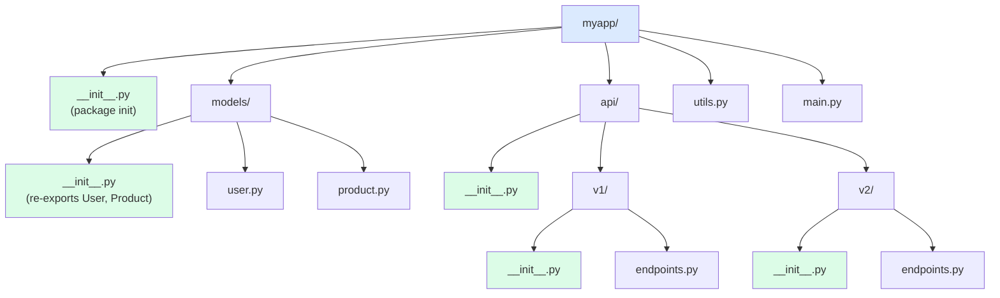

# 2. Packages and init.py

> [!note] Why this note exists
> A module is a single `.py` file. A **package** is a directory of modules with an `__init__.py` — and the `__init__.py` is where the package's public API is defined, submodules are imported, and `__all__` declares the public surface. Since PEP 420 (Python 3.3), packages can also be "namespace packages" (no `__init__.py`), useful for splitting a package across multiple directories. This note covers regular packages, `__init__.py` patterns, subpackages, `__all__`, relative imports, namespace packages, and the project structures that scale.

## Why It Matters

Consider this project layout:

```
myapp/
    __init__.py
    models/
        __init__.py
        user.py
        product.py
    api/
        __init__.py
        v1/
            __init__.py
            endpoints.py
```

Without `__init__.py` files, `import myapp.models.user` would fail (in Python <3.3) or be treated as a namespace package (3.3+). With them, each level is a regular package.

The `__init__.py` files are not just markers — they're modules that run when the package is imported. They're the right place to:
- Re-export public names: `from .user import User` in `models/__init__.py` so callers can `from myapp.models import User` instead of `from myapp.models.user import User`.
- Define `__all__` to declare the public API.
- Run package-level initialization (configuration, logging setup).
- Control what `from mypackage import *` exports.

Understanding `__init__.py` is what separates "I can write a Python script" from "I can organize a Python project". This note covers the patterns.

## Background

### What a package is

A **package** is a module that contains submodules. Technically, a package is any module with a `__path__` attribute (a list of directories to search for submodules). There are two kinds:

1. **Regular package** — a directory containing `__init__.py`. The `__init__.py` can be empty or contain code.
2. **Namespace package** (PEP 420, Python 3.3+) — a directory without `__init__.py`. Multiple directories on `sys.path` can contribute to the same namespace package.

### Regular package initialization

When you `import mypackage`, Python:
1. Finds `mypackage/` on `sys.path`.
2. Finds `mypackage/__init__.py`.
3. Compiles and executes `__init__.py` in a fresh namespace.
4. Stores the resulting module object as `sys.modules["mypackage"]`.
5. The module's `__path__` is set to `["/path/to/mypackage"]`.

`__init__.py` is the package's "top-level code". It runs once, when the package is first imported.

### Subpackages

```python
import mypackage.sub.module
```

Python imports `mypackage`, then `mypackage.sub`, then `mypackage.sub.module`. Each level runs its own `__init__.py`.

### `__init__.py` can be empty

The minimal `__init__.py` is an empty file. This makes the directory a regular package. Many packages ship with empty `__init__.py` files and let users import submodules directly.

## Main Content

### `__init__.py` patterns

#### Pattern 1: Empty `__init__.py`

```python
# mypackage/__init__.py
# (empty file)
```

Users import submodules directly:

```python
from mypackage.models import User
from mypackage.api import create_app
```

This is the simplest pattern — the package is just a namespace for submodules.

#### Pattern 2: Re-export public API

```python
# mypackage/__init__.py
from .models import User, Product
from .api import create_app
from .config import Config

__all__ = ["User", "Product", "create_app", "Config"]
```

Users can now do:

```python
from mypackage import User, create_app
```

instead of the longer:

```python
from mypackage.models import User
```

This is the most common `__init__.py` pattern — it hides the internal structure and exposes a clean public API.

#### Pattern 3: Lazy public API

If re-exporting pulls in heavy dependencies, use lazy imports:

```python
# mypackage/__init__.py
import importlib

__all__ = ["User", "Product", "create_app"]

def __getattr__(name):
    if name == "User":
        from .models import User
        return User
    if name == "create_app":
        from .api import create_app
        return create_app
    raise AttributeError(f"module {__name__!r} has no attribute {name!r}")
```

`__getattr__` on a module (PEP 562, Python 3.7+) lets you defer imports until the attribute is accessed. Useful for fast package import time.

#### Pattern 4: Package-level initialization

```python
# mypackage/__init__.py
import logging
from .config import load_config

# Configure logging when the package is imported
logging.basicConfig(level=logging.INFO)
logger = logging.getLogger(__name__)

# Load the package's configuration
config = load_config()

__version__ = "1.0.0"
```

This runs at import time, so any side effects (logging, config loading) happen whenever anyone imports the package.

> [!warning] Side effects in `__init__.py`
> Import-time side effects make the package hard to test and slow to import. Prefer lazy patterns: `get_config()` instead of `config = load_config()` at the top.

#### Pattern 5: `__all__` for public API

```python
# mypackage/__init__.py
from .models import User, Product
from .api import create_app

__all__ = ["User", "Product", "create_app"]
```

`__all__` does two things:
1. Defines what `from mypackage import *` exports.
2. Documents the public API (some tools use it for documentation).

Names not in `__all__` (and not starting with `_`) are still importable, but `*` won't pull them. Some teams treat `__all__` as the contract: anything not in it is internal.

### `__all__` in submodules

Each submodule can also define `__all__`:

```python
# mypackage/models.py
__all__ = ["User", "Product"]

class User: ...
class Product: ...
class _Helper: ...    # not exported by *
```

### Subpackages

A package can contain subpackages (directories with their own `__init__.py`):

```
myapp/
    __init__.py
    models/
        __init__.py
        user.py
        product.py
    api/
        __init__.py
        v1/
            __init__.py
            endpoints.py
        v2/
            __init__.py
            endpoints.py
```

```python
from myapp.models.user import User
from myapp.api.v1.endpoints import router
from myapp.api.v2.endpoints import router as router_v2
```

To re-export from a subpackage:

```python
# myapp/models/__init__.py
from .user import User
from .product import Product
__all__ = ["User", "Product"]

# myapp/api/__init__.py
from .v1.endpoints import router as v1_router
from .v2.endpoints import router as v2_router
__all__ = ["v1_router", "v2_router"]
```

### Package structure



### Relative imports

Inside a package, you can use relative imports:

```python
# myapp/models/user.py

from . import product           # sibling module in same package
from .product import Product    # specific name from sibling
from .. import utils            # parent package's utils module
from ..api.v1 import router     # cousin module
```

The dots:
- `.` — current package.
- `..` — parent package.
- `...` — grandparent package.

Relative imports only work inside a package — they fail in `__main__` (running a file directly). Use `python -m myapp.models.user` to run a module within its package context.

### Absolute vs relative imports

```python
# Absolute — full path from project root
from myapp.models.product import Product

# Relative — relative to current module's package
from .product import Product
```

PEP 8 recommends absolute imports for clarity, but relative imports are useful inside packages to avoid coupling to the package's name. If you rename the package, relative imports don't break.

### Namespace packages (PEP 420)

A namespace package is a package without `__init__.py`. It allows multiple directories on `sys.path` to contribute to the same package:

```
/path/a/myns/
    module_a.py
/path/b/myns/
    module_b.py
```

If both `/path/a` and `/path/b` are on `sys.path`, then:

```python
import myns.module_a    # found in /path/a
import myns.module_b    # found in /path/b
```

This is useful for:
- **Splitting a large package** across multiple repositories (e.g., `google.cloud.*` packages).
- **Plugin systems** where multiple installed packages contribute to the same namespace.

Namespace packages don't have an `__init__.py` — the absence is what makes them namespace packages. Subpackages can still be regular packages (with `__init__.py`).

> [!note] Implicit namespace packages
> Python 3.3+ treats any directory on `sys.path` without `__init__.py` as a potential namespace package. This is convenient but can cause surprising behavior if you have a directory named the same as a real package.

### `__init__.py` for backwards compatibility

If you have a package that used to have a submodule but you've moved it, you can keep the old name as an alias:

```python
# mypackage/old_module.py
# (deprecated — moved to mypackage.new_module)

from mypackage.new_module import *  # noqa: F401,F403
from mypackage.new_module import __all__    # if defined

import warnings
warnings.warn(
    "mypackage.old_module is deprecated; use mypackage.new_module",
    DeprecationWarning,
    stacklevel=2,
)
```

### Package data files

To include non-Python files in a package (e.g., default config, templates, images), use `importlib.resources` (3.9+) or `pkg_resources` (older):

```python
# Reading a data file that ships with the package
from importlib.resources import files
import mypackage

config_text = files(mypackage).joinpath("data/default.yaml").read_text()
```

This works correctly whether the package is installed from a wheel, run from source, or zipped. Don't use `__file__` to find package data — it breaks with zip-imports and some installations.

### Project layout patterns

#### Pattern 1: Single-module package

```
mypackage/
    __init__.py
    module1.py
    module2.py
```

Good for small packages.

#### Pattern 2: src layout

```
project/
    pyproject.toml
    src/
        mypackage/
            __init__.py
            ...
    tests/
        test_*.py
```

The `src` layout is recommended by PyPA. It forces you to install the package before testing (catching packaging bugs), and avoids accidentally importing the local directory instead of the installed package.

#### Pattern 3: Flat layout

```
project/
    pyproject.toml
    mypackage/
        __init__.py
        ...
    tests/
        test_*.py
```

Simpler than `src`, but can have import-path issues.

#### Pattern 4: Namespace package layout

```
company-foo/
    pyproject.toml
    src/
        company/
            foo/
                __init__.py
                ...
company-bar/
    pyproject.toml
    src/
        company/
            bar/
                __init__.py
                ...
```

Two separately-installable packages sharing the `company.*` namespace. The `company/` directories have no `__init__.py` (they're namespace packages); the `foo/` and `bar/` subdirectories do.

## Code Examples

### Example 1: A typical `__init__.py`

```python
# myapp/__init__.py
"""MyApp — a sample application package."""

from .config import Config
from .models import User, Product
from .client import Client

__all__ = ["Config", "User", "Product", "Client"]
__version__ = "1.0.0"
```

### Example 2: Lazy re-export

```python
# myapp/__init__.py
"""MyApp — heavy dependencies loaded on demand."""

__all__ = ["Client", "Server"]
__version__ = "1.0.0"

def __getattr__(name):
    if name == "Client":
        from .client import Client
        return Client
    if name == "Server":
        from .server import Server
        return Server
    raise AttributeError(f"module {__name__!r} has no attribute {name!r}")
```

### Example 3: Subpackage re-export

```python
# myapp/models/__init__.py
from .user import User
from .product import Product
from .order import Order

__all__ = ["User", "Product", "Order"]
```

### Example 4: Relative imports

```python
# myapp/api/v1/endpoints.py
from flask import Blueprint

from ..auth import require_auth        # parent's auth module
from .schemas import UserSchema        # sibling schemas module
from ...models import User             # grandparent's models package

bp = Blueprint("v1", __name__)
```

### Example 5: Namespace package

```
# Two repos, both contributing to mycompany.*

# repo 1: company-core/src/mycompany/core/__init__.py
# repo 2: company-tools/src/mycompany/tools/__init__.py
# Note: no __init__.py in the mycompany/ directories themselves
```

```python
# After both packages are installed:
import mycompany.core
import mycompany.tools
# Both work, despite being installed separately.
```

### Example 6: Reading package data

```python
# myapp/__init__.py
from importlib.resources import files

def get_default_config():
    return files(__name__).joinpath("data/default.yaml").read_text(encoding="utf-8")
```

### Example 7: Versioning with `__init__.py`

```python
# myapp/__init__.py
__version__ = "1.2.3"

# In pyproject.toml (modern approach):
# [project]
# dynamic = ["version"]
# [tool.setuptools.dynamic]
# version = {attr = "myapp.__version__"}
```

### Example 8: Deprecation warnings for moved modules

When you move a module from one location to another, leave behind a shim that emits a `DeprecationWarning`:

```python
# myapp/old_location.py
"""Deprecated; use myapp.new_location instead."""
import warnings
from myapp.new_location import *      # re-export everything
from myapp.new_location import _all_names as __all__  # preserve __all__

warnings.warn(
    "myapp.old_location is deprecated; use myapp.new_location instead",
    DeprecationWarning,
    stacklevel=2,
)
```

Now existing code that imports `myapp.old_location` continues to work but emits a warning that the maintainers can see by enabling `warnings.filterwarnings("default", category=DeprecationWarning)`. After a deprecation period (typically one major release), delete the shim.

### Example 9: Package data files with `importlib.resources`

`importlib.resources` is the modern way to read files that ship with your package (the old `pkg_resources` API is deprecated). It works correctly whether the package is installed as a wheel, an egg, or run from source:

```python
# myapp/__init__.py
from importlib.resources import files

def load_schema(name: str) -> str:
    """Load a JSON schema file that ships with myapp."""
    return files(__name__).joinpath("schemas", f"{name}.json").read_text(encoding="utf-8")

def open_template(name: str):
    """Open a Jinja template for reading."""
    return files(__name__).joinpath("templates", f"{name}.j2").open("r", encoding="utf-8")
```

```python
# Usage by callers
from myapp import load_schema
schema = load_schema("user")
```

`files(__name__)` returns a `Traversable` representing the package's location — which can be a real filesystem directory (when installed editable or from source) or a virtual path inside a `.zip`/`.whl` (when installed as a wheel). The API works in both cases.

### Package layout: when to use subpackages vs flat

As a package grows, decide when to split modules into subpackages. Rules of thumb:

- **5-10 modules at one level**: flat is fine.
- **10-20 modules**: start grouping related modules into subpackages.
- **20+ modules**: definitely use subpackages; flat becomes hard to navigate.
- **Clear domain boundaries** (e.g., `models/`, `api/`, `cli/`, `utils/`): subpackages match mental models.

A typical medium-sized application structure:

```
myapp/
    __init__.py             # version, public API
    config.py               # settings loading
    cli.py                  # command-line interface
    core/
        __init__.py
        models.py           # domain models
        services.py         # business logic
        repositories.py     # data access
    api/
        __init__.py
        routes.py
        schemas.py
        auth.py
    infra/
        __init__.py
        db.py
        cache.py
        messaging.py
    utils/
        __init__.py
        logging.py
        timing.py
```

Each subpackage has a clear responsibility, and the import graph flows downward: `api` depends on `core` depends on `infra`. Circular imports are rare when the layering is explicit.

### The `__main__.py` idiom

A package can have a `__main__.py` file that runs when you do `python -m mypackage`:

```
myapp/
    __init__.py
    __main__.py    # runs when: python -m myapp
    cli.py
```

```python
# myapp/__main__.py
from myapp.cli import main

if __name__ == "__main__":
    main()
```

This is the clean way to make a package executable. Users run `python -m myapp` (or `python -m mypackage`, depending on the package name) and `__main__.py` runs. The same idiom works for the stdlib: `python -m json.tool`, `python -m http.server`, `python -m zipfile` all use `__main__.py`.

### `__init__.py` execution order

When you `import myapp.api.routes`:

1. Run `myapp/__init__.py`.
2. Run `myapp/api/__init__.py`.
3. Run `myapp/api/routes.py`.

Each `__init__.py` runs once (cached in `sys.modules`). If `myapp/__init__.py` is heavy (imports many submodules), the first `import myapp.anything` is slow. Use lazy `__getattr__` (PEP 562) to defer.

## Common Pitfalls

> [!danger] Forgetting `__init__.py`
> Without it, the directory is a namespace package (3.3+). This can be intentional, but if you expected a regular package and forgot the file, your `from . import sibling` imports will fail or behave unexpectedly.

> [!danger] Side effects in `__init__.py`
> Importing the package triggers the side effect. Tests, linters, and `python -c "import mypackage"` all run it. Keep `__init__.py` side-effect-free.

> [!danger] Heavy `__init__.py` slows import
> If `__init__.py` imports many submodules, every `import mypackage` pays the cost. Use lazy imports (PEP 562 `__getattr__`) for heavy submodules.

> [!danger] Relative imports in `__main__`
> ```python
> # mypackage/mymodule.py
> from . import sibling    # fails if run as python mypackage/mymodule.py
> ```
> Use `python -m mypackage.mymodule` instead, or absolute imports.

> [!danger] Name collisions in namespace packages
> If two packages on `sys.path` define the same namespace, the order of `sys.path` determines which is found first. This can cause subtle bugs.

> [!danger] `__all__` typos
> ```python
> __all__ = ["User", "Poduct"]    # typo — Product is missing from *
> ```
> Linters don't always catch this. Test that `from mypackage import *` exports what you expect.

> [!danger] Circular imports via `__init__.py`
> If `__init__.py` imports from a submodule, and that submodule imports from the package (via `from mypackage import X`), you get a circular import. Use `from mypackage.submodule import X` or relative imports instead.

> [!danger] Mixing namespace and regular packages
> If `mycompany/` is a namespace package (no `__init__.py`) but you add `mycompany/__init__.py` in one location, it becomes a regular package — and may shadow the other namespace contributions. Decide which model you're using and stick to it.

> [!danger] `from package import *` with no `__all__`
> Without `__all__`, `*` imports everything not starting with `_`. This pulls in submodule names too, which is rarely what you want. Always define `__all__`.

## Tips and Tricks

- **`__init__.py` is the package's "front door"** — use it to define the public API.
- **Empty `__init__.py` is fine** if you have no public re-exports.
- **Use `__all__`** to declare the public API and avoid surprises with `import *`.
- **Lazy `__getattr__` (PEP 562)** for heavy submodules — keeps `import mypackage` fast.
- **Avoid side effects in `__init__.py`** — make import cheap and pure.
- **Relative imports inside packages** — robust to package renaming.
- **Absolute imports for top-level scripts** — clearer for new readers.
- **`python -m mypackage.mymodule`** to run a package module with relative imports.
- **`src/` layout** for serious projects — forces install before test, avoids path issues.
- **`importlib.resources`** for reading package data files — robust across installation methods.
- **Namespace packages** for splitting a large package across repos.
- **`__version__` in `__init__.py`** for version discovery from code.
- **Pin `__all__` in every `__init__.py`** to make the public API explicit.
- **Test that `import mypackage` is fast** — measure with `python -X importtime -c "import mypackage"`.

## Active Recall

1. What's the purpose of `__init__.py`?
2. What's the difference between a regular package and a namespace package?
3. How does `from . import sibling` work, and where does it work?
4. Why would you use `__getattr__` in `__init__.py` (PEP 562)?
5. What does `__all__` do, and where is it used?
6. Write a minimal `__init__.py` that re-exports `User` and `Product` from submodules.
7. Why does `python mypackage/mymodule.py` fail on relative imports, and what's the fix?
8. What's a namespace package, and when would you use one?
9. How would you read a YAML config file that ships with your package?
10. Why is the `src/` layout recommended over flat layout?
11. How would you handle a deprecated module that's been moved to a new name?
12. What's the problem with side effects in `__init__.py`?
13. Write a relative import that imports from a sibling subpackage's parent.
14. How do you version your package using `__init__.py`?

## Next Steps

- [[1. Modules and import]] — the import system that packages build on.
- [[3. Virtual Environments]] — isolating package installations per project.
- [[4. pyproject.toml and Packaging]] — making your package installable with `pip`.
- [[5. Dependency Management]] — managing third-party packages.
- [[../6. Files and Serialization/2. Path Handling with pathlib]] — `Path` is often used to locate package data.
