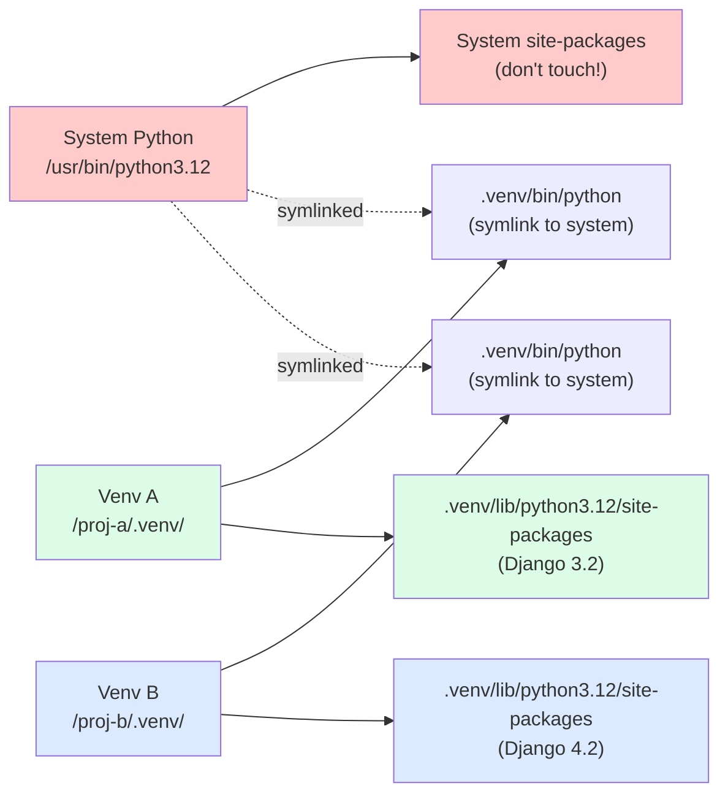
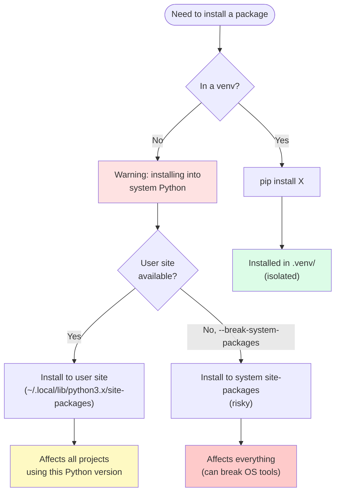

# 3. Virtual Environments

> [!note] Why this note exists
> Every Python developer eventually hits the "it works on my machine" problem: project A needs Django 3, project B needs Django 4, and the system Python can only have one installed. Virtual environments (venvs) solve this by giving each project its own isolated Python installation with its own package directory. This note covers why venvs exist, the standard-library `venv` module, the third-party `virtualenv`, the `conda` alternative, activation/deactivation, `requirements.txt` and `pip freeze`, and the modern `uv` tool that's changing the landscape.

## Why It Matters

Without virtual environments, this happens:

```bash
# On a fresh system
pip install django==3.2
# Project A works.

# Start project B
pip install django==4.2
# Project A breaks: "ImportError: cannot import name 'force_text' from 'django.utils.encoding'"

# Try to fix
pip install django==3.2
# Now project B breaks.
```

The system Python's `site-packages` directory can only hold one version of each package. Without isolation, every project fights every other project for control of that directory.

With virtual environments:

```bash
python -m venv .venv-a
source .venv-a/bin/activate
pip install django==3.2
deactivate

python -m venv .venv-b
source .venv-b/bin/activate
pip install django==4.2
deactivate
```

Each venv has its own `site-packages`, so Django 3.2 and 4.2 coexist on the same machine. Switching projects is just activating the right venv.

The lesson: **never install packages into the system Python**. Always use a venv. The exceptions are tools you want available globally (`pip`, `setuptools`, sometimes `ipython`), and even those are debatable.

## Background

### What a virtual environment is

A virtual environment is a directory containing:
1. A copy (or symlink) of the Python interpreter.
2. A `pyvenv.cfg` file marking it as a venv.
3. Its own `site-packages/` directory for installed packages.
4. Scripts (`activate`, `pip`, `python`) for using the venv.

When activated, `python` and `pip` refer to the venv's versions, and `pip install` installs into the venv's `site-packages`, not the system's.



### `venv` vs `virtualenv`

- **`venv`** — standard library (Python 3.3+). Always available. Slower to create. Limited features.
- **`virtualenv`** — third-party (`pip install virtualenv`). Faster. More features (e.g., specify Python version, create venvs from any Python). Works on Python 2 too (legacy).
- **`uv venv`** — Rust-based, much faster than both (10-100×). The new modern choice.

For most uses, `python -m venv` is fine. If you need speed or extra features, use `uv` or `virtualenv`.

### `conda` environments

Conda is a separate package manager (not pip-based) popular in data science. Conda environments can include non-Python dependencies (C libraries, R, etc.) that pip can't install. Conda environments are heavier than venvs but more capable for scientific work.

## Main Content

### Creating a venv

```bash
# Standard library venv
python -m venv .venv

# With a specific Python version (virtualenv or uv)
virtualenv -p python3.12 .venv
uv venv .venv --python 3.12

# With system packages (rarely needed)
python -m venv .venv --system-site-packages
```

The `.venv` directory is created in the current directory. Common names: `.venv`, `venv`, `env`. `.venv` (with leading dot) is hidden from `ls` by default, which is nice.

### Activating and deactivating

```bash
# Linux/macOS
source .venv/bin/activate

# Windows (cmd)
.venv\Scripts\activate.bat

# Windows (PowerShell)
.venv\Scripts\Activate.ps1

# Deactivate (any platform)
deactivate
```

After activation, your shell prompt shows `(.venv) $ ` and:
- `python` refers to `.venv/bin/python`.
- `pip` refers to `.venv/bin/pip`.
- `pip install` installs into `.venv/lib/...`.
- `python -m pip` also works.

`deactivate` is a shell function (defined by `activate`) that undoes the activation.

### You don't NEED to activate

Activation is a convenience. The actual isolation comes from the venv's `python` and `pip`. You can use them directly:

```bash
.venv/bin/python script.py
.venv/bin/pip install django
```

This works without sourcing `activate`. Editors like VS Code and PyCharm let you select the venv's Python directly — they don't need activation.

### `requirements.txt`

```bash
# Save current packages
pip freeze > requirements.txt

# Recreate environment
pip install -r requirements.txt
```

`pip freeze` produces lines like:

```
django==4.2.7
requests==2.31.0
numpy==1.26.0
```

These are **pinned** versions — exact versions installed. `pip install -r requirements.txt` installs exactly those versions.

`requirements.txt` is the simplest dependency file. It's good for:
- Reproducible deployments.
- Simple projects.
- Lock files generated by other tools (pip-tools, poetry, uv).

For complex projects, see [[5. Dependency Management]] for `pyproject.toml`, `poetry`, and `uv`.

### `pip freeze` vs `pip list`

- `pip freeze` — output in `requirements.txt` format (only third-party packages).
- `pip list` — human-readable table (includes pip, setuptools, etc.).

### Inspecting a venv

```bash
# Where is python?
which python              # /path/to/.venv/bin/python

# What's installed?
pip list

# Where do packages go?
python -c "import site; print(site.getsitepackages())"

# What's the venv's python?
python -c "import sys; print(sys.executable)"
```

### Venv isolation



Modern Linux distros (Debian 12+, Ubuntu 23.04+) have **PEP 668** protection: `pip install` into the system Python raises an error (`externally-managed-environment`) by default. This is to prevent users from breaking OS tools that depend on the system Python. The right fix is to use a venv; the workaround is `pip install --break-system-packages` (don't).

### Conda environments

```bash
# Create
conda create -n myenv python=3.12

# Activate
conda activate myenv

# Install
conda install numpy pandas matplotlib

# Deactivate
conda deactivate

# List environments
conda env list

# Export
conda env export > environment.yml

# Recreate
conda env create -f environment.yml
```

Conda is heavier than venv but handles non-Python dependencies. Use it when:
- You need C/Fortran libraries (NumPy with MKL, etc.) that pip can't install cleanly.
- You're in a scientific computing environment where conda is the norm.
- You need multiple Python versions side-by-side (conda handles this elegantly).

For most application Python, pip + venv is lighter and simpler.

### Modern alternatives: `uv`

`uv` (Astral, 2024) is a Rust-based Python package manager that's 10-100× faster than pip and includes venv management:

```bash
# Install uv
curl -LsSf https://astral.sh/uv/install.sh | sh

# Create a venv
uv venv

# Install packages (much faster than pip)
uv pip install django

# Sync from requirements
uv pip sync requirements.txt

# Or use uv's project mode (replaces poetry)
uv init myproject
uv add django
uv run python script.py
```

`uv` is becoming the standard for new Python projects. See [[5. Dependency Management]] for more.

### Multiple Python versions

To use multiple Python versions on the same machine:

```bash
# pyenv (POSIX) — install and switch Python versions
pyenv install 3.12.0
pyenv install 3.11.6
pyenv global 3.12.0

# Create a venv with a specific version
pyenv shell 3.11.6
python -m venv .venv-3.11

# Or with uv
uv venv --python 3.11
```

For Windows, use the official Python installer or `pyenv-win`.

## Code Examples

### Example 1: Standard project setup

```bash
mkdir myproject && cd myproject
python -m venv .venv
source .venv/bin/activate
pip install --upgrade pip
pip install django requests pytest
pip freeze > requirements.txt
```

### Example 2: `.gitignore` for venvs

```
# .gitignore
.venv/
venv/
env/
__pycache__/
*.pyc
```

Never commit your `.venv/` directory — it's machine-specific and huge.

### Example 3: Reproducible deployment

```bash
# On dev machine
pip freeze > requirements.txt
git add requirements.txt
git commit

# On production
git pull
python -m venv .venv
source .venv/bin/activate
pip install -r requirements.txt
python -m myapp
```

### Example 4: VS Code integration

VS Code auto-detects `.venv/` and offers to use it. To force:

```json
// .vscode/settings.json
{
    "python.defaultInterpreterPath": "${workspaceFolder}/.venv/bin/python"
}
```

### Example 5: Makefile for venv management

```makefile
# Makefile
.PHONY: venv install test

venv:
        python -m venv .venv

install: venv
        .venv/bin/pip install --upgrade pip
        .venv/bin/pip install -r requirements.txt

test:
        .venv/bin/pytest
```

### Example 6: Switching Python versions

```bash
# With pyenv
pyenv install 3.12.0
pyenv local 3.12.0    # creates .python-version file
python -m venv .venv

# Now this venv uses Python 3.12
.venv/bin/python --version    # Python 3.12.0
```

### Example 7: Lock files with `pip-tools`

```bash
# Install pip-tools
pip install pip-tools

# Write requirements.in with unpinned deps
echo "django" > requirements.in
echo "psycopg2" >> requirements.in

# Compile to a fully-pinned requirements.txt
pip-compile requirements.in
# Output: django==4.2.7, psycopg2==2.9.9, and all transitive deps

# Install
pip-sync requirements.txt
# (pip-sync uninstalls anything not in the file too)
```

`pip-tools` separates "what I want" (`requirements.in`) from "what I get" (`requirements.txt` lock file). See [[5. Dependency Management]].

### Example 8: Docker + venv pattern

For production deployments, build the venv inside the Docker image — don't copy a local `.venv/`:

```dockerfile
FROM python:3.12-slim

# Create venv
RUN python -m venv /opt/venv
ENV PATH="/opt/venv/bin:$PATH"

# Install dependencies first (cache layer)
COPY requirements.txt .
RUN pip install --no-cache-dir -r requirements.txt

# Copy app code
COPY . /app
WORKDIR /app

CMD ["python", "-m", "myapp"]
```

The key insights: (1) the venv lives in `/opt/venv`, not the project directory; (2) `PATH` is set so `python` and `pip` find the venv versions; (3) `requirements.txt` is copied and installed in a separate layer before the app code, so code changes don't invalidate the dependency cache.

### Example 9: `uv` project mode (replaces poetry)

```bash
# Initialise a new project
uv init myproject
cd myproject

# Add a dependency (writes to pyproject.toml + uv.lock)
uv add django
uv add --dev pytest ruff

# Remove a dependency
uv remove django

# Run any command in the project venv (auto-created)
uv run python -m django --version
uv run pytest

# Sync the venv to match the lock file exactly
uv sync
```

`uv` handles venv creation, dependency resolution, lock file management, and command execution in one tool. The `uv.lock` file is reproducible across machines — `uv sync` produces an identical venv on any system.

### Example 10: Conditional dependencies per platform

Some packages have different names on different platforms (notably `psycopg2` vs `psycopg2-binary`):

```toml
# pyproject.toml
[project]
dependencies = [
    "django>=4.2",
    "psycopg2-binary>=2.9 ; sys_platform != 'linux'",
    "psycopg2>=2.9 ; sys_platform == 'linux'",
]
```

The `;` after a dependency introduces an environment marker. Common markers: `sys_platform`, `python_version`, `platform_system`, `platform_machine`. They let you express "this dependency only on Windows" or "this version only on Python 3.11+".

### How venvs actually work (under the hood)

When you run `python -m venv .venv`, Python:

1. Creates the `.venv/` directory structure (`bin/`, `lib/`, `include/` on POSIX; `Scripts/`, `Lib/`, `Include/` on Windows).
2. Copies or symlinks the Python interpreter into `.venv/bin/python`.
3. Creates a `pyvenv.cfg` file with `home = /usr/bin/python3.12` (pointing to the base interpreter) and `include-system-site-packages = false`.
4. Installs `pip` and `setuptools` into the venv's `site-packages`.

When you run `.venv/bin/python`, Python reads `pyvenv.cfg` and:
- Sets `sys.prefix` to `.venv/`.
- Sets `sys.base_prefix` to the system Python (from `home`).
- Uses `.venv/lib/python3.12/site-packages/` for imports (instead of the system's).

The `activate` script is purely a shell convenience: it puts `.venv/bin/` first on `PATH` and sets `VIRTUAL_ENV`. The isolation comes from Python itself reading `pyvenv.cfg`.

### Venv vs Docker vs conda

| Tool | Isolates | When to use |
|------|----------|-------------|
| `venv` | Python packages only | Most Python apps |
| `virtualenv` | Python packages only | Same as venv, but faster + cross-version |
| `uv venv` | Python packages only | Modern default; 10-100× faster |
| `conda env` | Python + non-Python libs | Scientific computing (NumPy+MKL, CUDA, R) |
| Docker | The whole OS | Production deployments, full reproducibility |
| `pyenv` | Python interpreter itself | Need multiple Python versions |
| `asdf` | Multiple language versions | Polyglot teams (Python + Node + Ruby) |

For a typical web service: `uv` locally, Docker in production. For ML/data science: `conda` or `uv` with PyTorch. For libraries: `uv` + a CI matrix testing across Python versions.

### When activation is the wrong approach

Activation works well for interactive shells, but it's fragile for automation. Several patterns avoid it:

**Direct invocation (scripts, Makefiles):**
```makefile
test:
        .venv/bin/pytest

run:
        .venv/bin/python -m myapp
```

No activation, no `source` — just call the venv's binaries directly. This works in cron jobs, systemd units, CI runners, and any other non-interactive context.

**`uv run` (auto-creates and uses venv):**
```bash
uv run pytest         # uses .venv/ if it exists, else creates one
uv run --with rich python -c "import rich; print('ok')"   # ephemeral extra dep
```

`uv run` is the modern idiom: no activation, no `source`, just run a command in the project's venv. For one-off tasks with extra deps, `--with` adds them temporarily without modifying the project.

**Python's `-m` invocation:**
```bash
python -m venv .venv          # instead of `virtualenv .venv`
python -m pytest              # instead of `pytest` (which might be the system pytest)
python -m pip install X       # instead of `pip install X`
```

`python -m` guarantees you're using the venv's module, not whatever happens to be on `PATH`. It's the safest form when you're not sure which environment you're in.

### Inspecting and cleaning up venvs

Over time, venvs accumulate. Tools to manage them:

```bash
# List all venvs in your home directory (heuristic — looks for pyvenv.cfg)
fd -t f -H pyvenv.cfg ~ | xargs -I{} dirname {} | xargs -I{} dirname {}

# Check disk usage
du -sh .venv/                 # typical: 50-500 MB depending on installed packages

# Remove and recreate (when upgrades go wrong)
rm -rf .venv && python -m venv .venv && .venv/bin/pip install -r requirements.txt

# With uv: fresh sync from lock file
rm -rf .venv && uv sync
```

For CI and disposable environments, treat venvs as ephemeral: recreate from the lock file on every run. For long-lived dev environments, periodic cleanup (once a quarter) catches stale packages and broken state.

## Common Pitfalls

> [!danger] Installing into system Python
> `pip install X` outside a venv pollutes the system Python. On modern distros (PEP 668), it's blocked; on older ones, it can break OS tools. Always use a venv.

> [!danger] Committing `.venv/` to git
> It's huge (50-500 MB), machine-specific, and breaks for teammates. Add to `.gitignore`.

> [!danger] Forgetting to activate
> `pip install X` then `python script.py` — if you didn't activate, `pip` installed into the system, but `python` is the system python, which doesn't see X (because of PEP 668 protection). Always activate, or use `.venv/bin/pip` and `.venv/bin/python` directly.

> [!danger] Venv Python version mismatch
> If you created a venv with Python 3.11 and then later `pyenv global 3.12`, the venv still uses 3.11 (it's a symlink at creation time, but Python's behavior preserves the original). Recreate the venv to switch Python versions.

> [!danger] Moving a venv
> Venvs contain absolute paths. Moving `.venv/` to a new location breaks the symlinks. Delete and recreate.

> [!danger] Wrong `python` after `deactivate`
> After `deactivate`, your shell still has stale environment variables in some cases. Open a new shell if `which python` looks wrong.

> [!danger] Using `sudo pip install`
> Never do this. It bypasses venvs, installs into the system Python, and can break OS tools. Use a venv.

> [!danger] `pip install --user` as a "venv alternative"
> The user site (`~/.local/lib/...`) is shared across all projects using that Python version. It's a half-solution — better than system installs, but not isolated per project. Use a venv.

> [!danger] Conda + pip conflicts
> If you `conda install X` and then `pip install X`, you can get inconsistent installs. Pick one tool per environment and stick to it.

> [!danger] Forgetting to update `requirements.txt`
> After `pip install X`, run `pip freeze > requirements.txt` so your teammates get X too. Or use a tool that manages this for you (poetry, uv).

## Tips and Tricks

- **Always use a venv** — even for one-off scripts. The habit prevents bugs.
- **Name it `.venv`** — convention, hidden from `ls`, ignored by most tools.
- **Add `.venv/` to `.gitignore`** — never commit it.
- **`python -m venv` is enough** for most uses; use `uv venv` for speed.
- **Activate or use full paths** — both work. Editors don't need activation.
- **`pip freeze > requirements.txt`** for reproducible installs.
- **`pip install -r requirements.txt`** to recreate an environment.
- **Use `pip-tools`** for separating direct vs. transitive deps.
- **Use `pyenv`** for managing multiple Python versions.
- **Use `conda`** for scientific work with non-Python deps.
- **Use `uv`** for 10-100× faster installs — modern recommendation.
- **PEP 668** means modern Linux distros block system-wide pip — venvs are not optional anymore.
- **VS Code, PyCharm auto-detect `.venv/`** — point your editor at the venv's Python.
- **`uv run script.py`** auto-creates a venv, installs deps, and runs — no activation needed.
- **For production, build the venv inside the Docker image** — don't copy a local venv.

## Active Recall

1. Why are virtual environments necessary?
2. What's the difference between `venv` and `virtualenv`?
3. How do you create and activate a venv on Linux?
4. Do you have to activate a venv to use it? What are the alternatives?
5. What does `pip freeze` produce, and what's it used for?
6. Why shouldn't you commit `.venv/` to git?
7. What's PEP 668, and how does it affect `pip install` outside a venv?
8. How would you manage multiple Python versions on the same machine?
9. When would you use `conda` instead of `venv`?
10. What's `uv`, and why is it faster than `pip`?
11. Write the commands to set up a new project with a venv and install Django.
12. Why does moving a `.venv/` directory break it?
13. What's the difference between `pip install` and `pip install --user`? Why are both worse than a venv?
14. How would you deploy a Python app to a server with a venv?

## Next Steps

- [[1. Modules and import]] — modules installed via `pip` end up in the venv's `site-packages`.
- [[2. Packages and init.py]] — your package's structure determines how it's installed into venvs.
- [[4. pyproject.toml and Packaging]] — making your project installable into venvs.
- [[5. Dependency Management]] — modern tools (poetry, uv, pip-tools) that build on venvs.
- [[../6. Files and Serialization/1. Reading and Writing Files]] — venvs are just directories; `Path` works on them.
