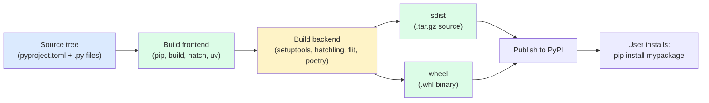
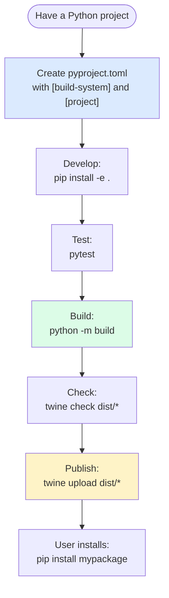

# 4. pyproject.toml and Packaging

> [!note] Why this note exists
> For 25 years, Python packaging was a mess: `setup.py` with imperative code, `setup.cfg` with a different format, `MANIFEST.in` for file inclusion, `requirements.txt` for dependencies. PEP 518 (2016) introduced `pyproject.toml` as a single declarative configuration file, and PEP 621 (2020) standardized the `[project]` table for metadata. Today, `pyproject.toml` is the canonical packaging config, and modern build backends (setuptools, Hatch, Flit, Poetry) all read it. This note covers the file format, the `[build-system]` and `[project]` tables, the major backends, entry points, and the modern packaging workflow.

## Why It Matters

Compare the old and new way to package a Python project:

```python
# OLD: setup.py (imperative, fragile, version-dependent)
from setuptools import setup, find_packages

setup(
    name="mypackage",
    version="1.0.0",
    packages=find_packages(),
    install_requires=["requests>=2.20"],
    entry_points={"console_scripts": ["mycli = mypackage.cli:main"]},
)
```

```toml
# NEW: pyproject.toml (declarative, standard, backend-agnostic)
[build-system]
requires = ["setuptools>=61.0"]
build-backend = "setuptools.build_meta"

[project]
name = "mypackage"
version = "1.0.0"
dependencies = ["requests>=2.20"]

[project.scripts]
mycli = "mypackage.cli:main"
```

The `pyproject.toml` version is:
- **Declarative** — no Python code executing at build time, no risk of `setup.py` doing something weird.
- **Backend-agnostic** — the `[build-system]` table says which backend to use. You can switch backends without rewriting metadata.
- **Standardized** — PEP 621 defines the `[project]` table format that all backends understand.
- **Single file** — metadata, build config, tool config (ruff, black, pytest) all in one place.

This is the modern way. `setup.py` is legacy — use it only for very old projects or unusual build requirements.

## Background

### The history

- **Pre-2016**: `setup.py` was the only standard. Imperative Python, ran at build time. Many projects had complex `setup.py` files that did arbitrary things.
- **PEP 518 (2016)**: introduced `pyproject.toml` with just a `[build-system]` table. Tools could now know which backend to use without running `setup.py`.
- **PEP 517 (2017)**: defined the build backend API (`build_wheel`, `build_sdist`).
- **PEP 621 (2020)**: standardized the `[project]` table for project metadata. Now all backends read the same metadata format.
- **PEP 660 (2023)**: editable installs (`pip install -e .`) via the backend API.

### The build pipeline



**Frontend** (the tool you run): `pip`, `build`, `hatch`, `uv`, `poetry`.
**Backend** (the thing that produces wheels): `setuptools`, `hatchling`, `flit`, `poetry-core`.

The frontend reads `[build-system]` from `pyproject.toml`, installs the backend in an isolated environment, and calls its API.

### Wheels

A **wheel** (`.whl`) is a pre-built binary package. It's a zip file with the package's `.py` files plus metadata. Installing a wheel is just unzipping — no build step, no compiler needed.

```bash
# Build a wheel
python -m build --wheel
# Output: dist/mypackage-1.0.0-py3-none-any.whl

# Inspect
unzip -l dist/mypackage-1.0.0-py3-none-any.whl

# Install
pip install dist/mypackage-1.0.0-py3-none-any.whl
```

Wheel filenames encode compatibility: `mypackage-1.0.0-py3-none-any.whl` means Python 3, no ABI, any platform. `numpy-1.26.0-cp312-cp312-linux_x86_64.whl` means CPython 3.12, cp312 ABI, Linux x86_64.

### sdists

A **source distribution** (sdist, `.tar.gz`) is the package's source code plus metadata. Installing from sdist runs the build backend to produce a wheel, then installs the wheel. Slower than wheels, but works on any platform.

## Main Content

### The `pyproject.toml` file

A complete example:

```toml
# Build system declaration (required)
[build-system]
requires = ["setuptools>=61.0", "wheel"]
build-backend = "setuptools.build_meta"

# Project metadata (PEP 621)
[project]
name = "mypackage"
version = "1.0.0"
description = "A sample package"
readme = "README.md"
requires-python = ">=3.9"
license = {text = "MIT"}
authors = [
    {name = "Alice", email = "alice@example.com"}
]
keywords = ["sample", "demo"]
classifiers = [
    "Development Status :: 4 - Beta",
    "Programming Language :: Python :: 3",
    "License :: OSI Approved :: MIT License",
]
dependencies = [
    "requests>=2.20,<3",
    "click>=8.0",
]

[project.optional-dependencies]
dev = ["pytest", "ruff", "mypy"]
docs = ["sphinx", "sphinx-rtd-theme"]

[project.scripts]
mycli = "mypackage.cli:main"

[project.gui-scripts]
mygui = "mypackage.gui:main"

[project.entry-points."mypackage.plugins"]
builtin = "mypackage.plugins:builtin"

# Backend-specific config (setuptools)
[tool.setuptools.packages.find]
where = ["src"]

# Tool config
[tool.ruff]
line-length = 100

[tool.pytest.ini_options]
testpaths = ["tests"]
```

### `[build-system]`

```toml
[build-system]
requires = ["setuptools>=61.0"]
build-backend = "setuptools.build_meta"
```

- `requires` — packages needed to run the backend (installed in an isolated env).
- `build-backend` — Python path to the backend module.

Common backends:
- `setuptools.build_meta` — the most common, supports legacy `setup.py` too.
- `hatchling.build` — modern, used by Hatch.
- `flit_core.buildapi` — minimal, simple pure-Python packages.
- `poetry.core.masonry.api` — used by Poetry.

### `[project]` table (PEP 621)

#### Required fields

- `name` — the package name (PyPI name).
- `version` — semantic version string.

#### Common fields

- `description` — one-line summary.
- `readme` — path to README file (or inline text).
- `requires-python` — Python version constraint.
- `license` — license info (`{text = "MIT"}` or `{file = "LICENSE"}`).
- `authors` — list of `{name, email}`.
- `keywords` — list of search keywords.
- `classifiers` — PyPI classifiers (see https://pypi.org/classifiers/).
- `dependencies` — runtime dependencies.

#### `dependencies` syntax

```toml
dependencies = [
    "requests",                       # any version
    "requests>=2.20",                 # 2.20 or later
    "requests>=2.20,<3",              # 2.20 to 2.x
    "requests~=2.20",                 # compatible release: >=2.20, <3.0
    "requests[socks]>=2.20",          # with extras
    "requests ; python_version<'3.9'",  # environment marker
    "uvicorn ; sys_platform=='linux'",
]
```

Operators: `==`, `!=`, `<`, `<=`, `>`, `>=`, `~=` (compatible), `===` (arbitrary equality).

Environment markers: `python_version`, `python_full_version`, `sys_platform`, `platform_system`, `implementation_name`, etc.

#### `[project.optional-dependencies]` — extras

```toml
[project.optional-dependencies]
dev = ["pytest>=7", "ruff", "mypy"]
docs = ["sphinx>=7", "sphinx-rtd-theme"]
async = ["aiohttp>=3"]
```

Install with `pip install mypackage[dev,async]` or `pip install mypackage[docs]`.

#### `[project.scripts]` — console entry points

```toml
[project.scripts]
mycli = "mypackage.cli:main"
```

After `pip install mypackage`, you can run `mycli` from the shell. It's equivalent to:

```python
from mypackage.cli import main
main()
```

#### `[project.gui-scripts]` — GUI entry points

Same as `[project.scripts]` but for GUI applications (on Windows, doesn't open a console window).

#### `[project.entry-points."group.name"]` — plugin entry points

```toml
[project.entry-points."mypackage.plugins"]
builtin = "mypackage.plugins:builtin"
csv = "mypackage_csv:Plugin"
```

These are discoverable at runtime:

```python
from importlib.metadata import entry_points

plugins = entry_points(group="mypackage.plugins")
for ep in plugins:
    plugin_class = ep.load()
    plugin_class().register()
```

This is the standard Python plugin mechanism — used by pytest (fixtures), flask (commands), markdown (extensions), and many others.

### `[tool.*]` — tool configuration

`pyproject.toml` is also the standard place for tool configuration:

```toml
[tool.ruff]
line-length = 100
target-version = "py39"

[tool.black]
line-length = 100

[tool.mypy]
strict = true

[tool.pytest.ini_options]
testpaths = ["tests"]
addopts = "-v"

[tool.setuptools]
packages = ["mypackage"]    # explicit list

[tool.setuptools.packages.find]
where = ["src"]              # auto-discover under src/
```

Most modern Python tools (ruff, black, mypy, pytest, setuptools, hatch, etc.) read config from `pyproject.toml`.

### Dynamic versioning

If you want the version to come from a single source (e.g., `__version__` in your package or a git tag):

```toml
[project]
dynamic = ["version"]

# setuptools: read from __init__.py
[tool.setuptools.dynamic]
version = {attr = "mypackage.__version__"}

# Or from a file
# version = {file = "VERSION"}

# Or use setuptools-scm to read from git tags
[tool.setuptools-scm]
write_to = "src/mypackage/_version.py"
```

### Build backends comparison

| Backend | Best for | Pros | Cons |
|---------|----------|------|------|
| `setuptools` | Most projects | Universal, supports legacy | Config more verbose |
| `hatchling` | Modern pure-Python | Fast, clean config | Newer, smaller ecosystem |
| `flit_core` | Simple pure-Python | Minimal, fast | No C extensions, no complex layouts |
| `poetry-core` | Poetry users | Tight Poetry integration | Less standard, opinionated |
| `pdm-backend` | PDM users | PEP 621 native | Newer |
| `scikit-build-core` | CMake-based C extensions | Cross-platform CMake | More complex |

For most new pure-Python projects, `hatchling` or `setuptools` is the right choice.

### The `src/` layout

```toml
[tool.setuptools.packages.find]
where = ["src"]
```

Project structure:
```
project/
    pyproject.toml
    src/
        mypackage/
            __init__.py
            ...
    tests/
```

The `src/` layout is recommended because:
- It forces you to install the package before testing (catches packaging bugs).
- It prevents accidental imports of the local source tree (which would mask packaging bugs).

### Building and publishing

```bash
# Install the build frontend
pip install build

# Build sdist and wheel
python -m build

# Output in dist/:
#   mypackage-1.0.0.tar.gz
#   mypackage-1.0.0-py3-none-any.whl

# Test the wheel locally
pip install dist/mypackage-1.0.0-py3-none-any.whl

# Publish to PyPI (use twine or uv publish)
pip install twine
twine upload dist/*

# Or with uv
uv publish
```

### Editable installs

```bash
# Old (still works for setuptools)
pip install -e .

# Modern (PEP 660, requires backend support)
pip install -e . --config-settings editable_mode=compat
```

Editable installs symlink your source tree into the venv's `site-packages`, so changes to your code are immediately visible without reinstalling. Essential for active development.

### Modern packaging flow



## Code Examples

### Example 1: Minimal `pyproject.toml` (Hatch)

```toml
[build-system]
requires = ["hatchling"]
build-backend = "hatchling.build"

[project]
name = "mypackage"
version = "1.0.0"
description = "A minimal example"
requires-python = ">=3.9"
```

### Example 2: Full `pyproject.toml` (setuptools, src layout)

```toml
[build-system]
requires = ["setuptools>=61.0"]
build-backend = "setuptools.build_meta"

[project]
name = "mypackage"
dynamic = ["version"]
description = "A sample package with full metadata"
readme = "README.md"
requires-python = ">=3.9"
license = {text = "MIT"}
authors = [
    {name = "Alice", email = "alice@example.com"}
]
keywords = ["sample", "demo"]
classifiers = [
    "Development Status :: 4 - Beta",
    "Intended Audience :: Developers",
    "License :: OSI Approved :: MIT License",
    "Programming Language :: Python :: 3",
    "Programming Language :: Python :: 3.9",
    "Programming Language :: Python :: 3.10",
    "Programming Language :: Python :: 3.11",
    "Programming Language :: Python :: 3.12",
]
dependencies = [
    "requests>=2.20,<3",
    "click>=8.0",
]

[project.optional-dependencies]
dev = ["pytest>=7", "ruff", "mypy"]
docs = ["sphinx>=7"]

[project.scripts]
mycli = "mypackage.cli:main"

[project.urls]
Homepage = "https://github.com/alice/mypackage"
Documentation = "https://mypackage.readthedocs.io"
Repository = "https://github.com/alice/mypackage"
Issues = "https://github.com/alice/mypackage/issues"

[tool.setuptools.dynamic]
version = {attr = "mypackage.__version__"}

[tool.setuptools.packages.find]
where = ["src"]

[tool.ruff]
line-length = 100
target-version = "py39"

[tool.pytest.ini_options]
testpaths = ["tests"]
```

### Example 3: Plugin entry points

```toml
# mypackage's pyproject.toml
[project.entry-points."mypackage.plugins"]
builtin = "mypackage.plugins:builtin_plugin"
```

```python
# In the host application
from importlib.metadata import entry_points

def load_plugins():
    return [ep.load() for ep in entry_points(group="mypackage.plugins")]
```

### Example 4: Conditional dependencies

```toml
dependencies = [
    "tomli>=1.1.0 ; python_version<'3.11'",  # only on older Python
    "uvloop>=0.17 ; sys_platform!='win32'",  # not on Windows
    "colorama>=0.4 ; sys_platform=='win32'",  # only on Windows
]
```

### Example 5: Dynamic version from git

```toml
[build-system]
requires = ["setuptools>=61.0", "setuptools-scm>=8.0"]
build-backend = "setuptools.build_meta"

[project]
name = "mypackage"
dynamic = ["version"]

[tool.setuptools-scm]
write_to = "src/mypackage/_version.py"
```

The version is determined from git tags (`git tag v1.0.0` → version 1.0.0; commits after the tag → 1.0.1.devN+gHASH).

### Example 6: Package data files

For including non-Python files in your wheel (templates, schemas, default configs):

```toml
[tool.setuptools.package-data]
mypackage = [
    "schemas/*.json",
    "templates/*.j2",
    "data/defaults.yaml",
]

# Or use include/exclude patterns:
[tool.setuptools.packages.find]
where = ["src"]
include = ["mypackage*"]

[tool.hatch.build.targets.wheel]
# For hatchling:
packages = ["src/mypackage"]
force-include = { "src/mypackage/schemas" = "mypackage/schemas" }
```

Without this, `pip install` produces a wheel with only `.py` files, and your runtime code that does `files("mypackage").joinpath("schemas/user.json")` raises `FileNotFoundError`. The standard library's `importlib.resources` API reads from the installed package location, so the data must be in the wheel.

### Example 7: Building C extensions with `pyproject.toml`

For packages with C extensions, use `setuptools` with a `[tool.setuptools.ext-modules]` entry (or a separate `setup.py` shim):

```toml
[build-system]
requires = ["setuptools>=61.0", "wheel"]
build-backend = "setuptools.build_meta"

[project]
name = "fastkit"
version = "1.0.0"

[tool.setuptools]
ext-modules = [
    {name = "fastkit._core", sources = ["src/fastkit/_core.c"], define = [{"name = "NDEBUG"}]},
]
```

Or, for projects that need full CMake support (cross-platform, multi-config), use `scikit-build-core`:

```toml
[build-system]
requires = ["scikit-build-core>=0.5.0"]
build-backend = "scikit_build_core.build"

[project]
name = "fastkit"
version = "1.0.0"
```

`scikit-build-core` invokes CMake to build the C/C++ parts, then bundles them into a wheel. It's the modern replacement for the older `scikit-build` (which used `setup.py`).

### Example 8: Multi-section `pyproject.toml` for tooling

`pyproject.toml` is the canonical home for *all* Python tool configuration, not just packaging. This is one of its biggest wins over the older `setup.py` + `setup.cfg` + `.flake8` + `pytest.ini` + `mypy.ini` world:

```toml
[build-system]
requires = ["hatchling"]
build-backend = "hatchling.build"

[project]
name = "mypackage"
version = "1.0.0"

# --- Ruff (linter + formatter) ---
[tool.ruff]
line-length = 100
target-version = "py39"

[tool.ruff.lint]
select = ["E", "F", "I", "N", "UP", "B", "SIM"]
ignore = ["E501"]

[tool.ruff.format]
quote-style = "double"

# --- pytest ---
[tool.pytest.ini_options]
minversion = "7.0"
testpaths = ["tests"]
addopts = "-ra --strict-markers"
markers = [
    "slow: marks tests as slow (deselect with '-m \"not slow\"')",
]

# --- mypy ---
[tool.mypy]
python_version = "3.9"
strict = true
ignore_missing_imports = true

# --- coverage ---
[tool.coverage.run]
source = ["mypackage"]
omit = ["*/tests/*"]

[tool.coverage.report]
exclude_lines = [
    "pragma: no cover",
    "if TYPE_CHECKING:",
    "raise NotImplementedError",
]
```

One file, every tool configured. Editors and CI tools all read from the same place.

### Wheel vs sdist: which to publish?

| Artifact | Contents | When used |
|----------|----------|-----------|
| `sdist` (`.tar.gz`) | Full source tree + metadata | Fallback when no compatible wheel exists; for source-based distributions (Gentoo, Nix) |
| `wheel` (`.whl`) | Pre-built, ready-to-install | Default install target — `pip install` prefers wheels |

For pure-Python projects, the wheel is `py3-none-any` (any Python 3, any platform). For projects with C extensions, you publish one wheel per platform/Python combination: `cp312-cp312-manylinux_2_17_x86_64`, `cp312-cp312-win_amd64`, etc. Tools like `cibuildwheel` automate building all the wheels in CI.

Always publish both sdist and wheel. The sdist is the "source of truth" for the package; the wheel is the convenience artifact.

### The PEPs that make modern packaging work

| PEP | What it standardised |
|-----|----------------------|
| PEP 517 | Build backend interface (`build_wheel`, `build_sdist`) |
| PEP 518 | `[build-system]` table in `pyproject.toml` |
| PEP 621 | `[project]` metadata table |
| PEP 660 | Editable installs via the backend (no more `setup.py develop`) |
| PEP 631 | Dependency specification in `pyproject.toml` |
| PEP 639 | License expression in SPDX format |
| PEP 440 | Version numbering scheme |
| PEP 503 | Normalized package names on PyPI |
| PEP 508 | Dependency specification with environment markers |

Knowing these PEPs lets you read the actual specs when tools behave unexpectedly — the Python packaging docs link to them, and they're the final authority.

## Common Pitfalls

> [!danger] Forgetting `[build-system]`
> Without it, `pip install .` falls back to legacy setuptools with `setup.py`. Always declare the backend.

> [!danger] Mixing `setup.py` and `pyproject.toml`
> If both exist, behavior is undefined. Pick one (prefer `pyproject.toml`).

> [!danger] Missing `requires-python`
> Without it, your package might install on Python versions you don't support, causing confusing errors. Always set `requires-python`.

> [!danger] Forgetting to include package data
> Wheels don't include non-Python files by default. Use `[tool.setuptools.package-data]` or `MANIFEST.in` to include `.json`, `.yaml`, etc.

> [!danger] Version pinning too tight
> `dependencies = ["requests==2.31.0"]` forces exact version, conflicting with other packages. Use `>=X` or `~=X` for compatibility ranges.

> [!danger] Not testing the built wheel
> After `python -m build`, install the wheel in a fresh venv and run your tests. Source-tree tests don't catch packaging bugs.

> [!danger] Uploading to PyPI without `twine check`
> `twine check dist/*` validates metadata. Run it before upload to catch issues like long descriptions that don't render.

> [!danger] Confusing `name` and package directory
> The PyPI `name = "my-package"` (with hyphen) maps to a Python package `my_package` (with underscore). Pick names that work in both contexts.

> [!danger] Forgetting `[project.scripts]` for CLIs
> Without an entry point, users have to do `python -m mypackage.cli` instead of `mycli`. Add a script entry point for any CLI.

> [!danger] Backend incompatible with PEP 621
> Some older backends don't read `[project]` metadata. Use a modern backend (`setuptools>=61`, `hatchling`, `flit_core`).

> [!danger] Editable install breaks after restructuring
> `pip install -e .` caches the install metadata. If you restructure, you may need to `pip install -e . --force-reinstall` or `pip uninstall` first.

## Tips and Tricks

- **Always declare `[build-system]`** — non-negotiable for modern packaging.
- **Use `[project]` (PEP 621) for metadata** — backend-agnostic, standardized.
- **Use the `src/` layout** — forces install-before-test, prevents path bugs.
- **Use `[project.scripts]` for CLIs** — `pip install` then `mycli`.
- **Use `[project.entry-points]` for plugins** — standard Python plugin mechanism.
- **Use `[project.optional-dependencies]` for extras** — `pip install pkg[dev]`.
- **Use dynamic versioning** (`setuptools-scm` or `attr =`) — single source of truth.
- **Use environment markers** for platform-specific deps — `"uvloop ; sys_platform!='win32'"`.
- **Use `python -m build`** to build sdist + wheel.
- **Use `twine check`** before uploading.
- **Use `twine upload`** (or `uv publish`) to publish to PyPI.
- **Use `pip install -e .`** for development — changes are immediately visible.
- **Keep one tool config per `[tool.*]` table** — `pyproject.toml` is the single source of truth.
- **Test on a fresh venv** before publishing — catch packaging bugs early.
- **Use `requires-python`** to declare your Python version support.

## Active Recall

1. What's the purpose of `pyproject.toml`?
2. What does the `[build-system]` table declare?
3. What's the difference between a build frontend and a build backend? Give examples of each.
4. What's the `[project]` table for, and which PEP standardized it?
5. How do you declare a console script entry point in `pyproject.toml`?
6. How do you declare optional dependencies (extras)?
7. What's the `src/` layout, and why is it recommended?
8. How would you make the version dynamic (read from a single source)?
9. Write a `pyproject.toml` for a package called `mypackage` with a CLI entry point and a `dev` extra.
10. What's a wheel, and how does it differ from an sdist?
11. How do you build a wheel from a `pyproject.toml`?
12. How do you publish to PyPI?
13. What's an editable install, and when would you use one?
14. How would you express "install uvloop on Linux but not Windows"?

## Next Steps

- [[1. Modules and import]] — the import system that loads your installed package.
- [[2. Packages and init.py]] — package structure that determines what gets installed.
- [[3. Virtual Environments]] — where installed packages live.
- [[5. Dependency Management]] — managing dependencies at scale (poetry, uv, pip-tools).
- [[../5. Error Handling/3. Exception Hierarchy]] — `ImportError` / `ModuleNotFoundError` for missing optional deps.
