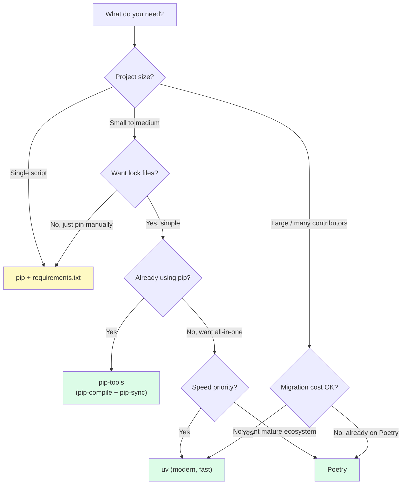

# 5. Dependency Management

> [!note] Why this note exists
> "Just use `pip install`" works for a single script. For real projects, you need: a way to declare dependencies (`pyproject.toml`), a way to lock them to specific versions (`requirements.txt`, `poetry.lock`, `uv.lock`), a way to separate direct from transitive deps, and a way to resolve conflicts. This note covers `pip` basics, `pip-tools` (`pip-compile` + `pip-sync`), Poetry, `uv`, the lock-file philosophy, dependency resolution algorithms, and the trade-offs that determine which tool fits your project.

## Why It Matters

Consider this scenario: you `pip install fastapi`, then `pip install pydantic==1.10`. FastAPI 0.100+ requires Pydantic 2. Pip happily installs both — but your app crashes at runtime with confusing errors because the two versions are incompatible. Without a resolver that detects this, you're stuck debugging a problem pip created silently.

Or this: you deploy to production with `requirements.txt` listing `fastapi` (no version). Yesterday, FastAPI 0.110 was the latest; today it's 0.111 with a breaking change. Your deploy breaks. Without a lock file, the same `requirements.txt` produces different installs on different days.

Modern dependency managers solve both problems:
- **Resolution**: detect conflicts before install (rather than at runtime).
- **Locking**: produce a fully-resolved, reproducible install plan.

The choice between `pip`, `pip-tools`, Poetry, and `uv` depends on project size, team preference, and performance needs. This note covers all four.

## Background

### The dependency problem

Every non-trivial Python project has:
- **Direct dependencies** — packages you explicitly want (`fastapi`, `pydantic`).
- **Transitive dependencies** — packages your direct deps depend on (`starlette`, `anyio`, `typing-extensions`).
- **Version constraints** — `fastapi>=0.100,<0.111`, etc.
- **Conflicts** — package A wants `pydantic>=2`, package B wants `pydantic<2`. Can't install both.

The dependency manager's job: pick one version per package that satisfies all constraints, and produce a reproducible install.

### Resolution algorithms

Two approaches:

1. **Backtracking** (used by Poetry, PDM, uv): try a version, check constraints; if any conflict, backtrack and try a different version. Slow but finds a solution if one exists. Can be exponential in pathological cases.

2. **Greedy / first-fit** (used by pip < 20.3, classic apt/yum): install the latest version that matches each constraint in order. Fast but can fail to find a solution even when one exists, and can produce different results depending on order.

Modern pip (20.3+, December 2020) uses a new resolver (`pip install --use-feature=2020-resolver` was the opt-in; now default) that backtracks. It's slower than the old one but much more correct.

### Lock files

A **lock file** is the fully-resolved install plan: every package, exact version, hash, and source. Lock files are:
- **Reproducible** — same lock file → identical install.
- **Verifiable** — hashes detect tampering or corruption.
- **Auditable** — you can see exactly what's installed.

| Tool | Lock file |
|------|-----------|
| pip | none (you write `requirements.txt` by hand or via `pip freeze`) |
| pip-tools | `requirements.txt` (generated) |
| Poetry | `poetry.lock` |
| PDM | `pdm.lock` |
| uv | `uv.lock` |
| Hatch | `hatch.lock` (or uses uv) |

Lock files should be **committed to git** for applications (so deploys are reproducible) and usually **not committed** for libraries (so users can pick their own dep versions).

## Main Content

### `pip` — the basics

```bash
# Install a package
pip install requests

# Install a specific version
pip install requests==2.31.0

# Install with version constraint
pip install "requests>=2.20,<3"

# Install from a requirements file
pip install -r requirements.txt

# Upgrade
pip install --upgrade requests

# Uninstall
pip uninstall requests

# List installed packages
pip list

# Show details of an installed package
pip show requests

# Freeze current state
pip freeze > requirements.txt
```

`pip` is universal — every Python environment has it. Its limitations:
- No lock file (just `requirements.txt`, which you maintain).
- No separation of direct vs. transitive deps.
- Resolution can be slow for complex dependency trees.
- No project metadata (`pyproject.toml` integration is limited).

For simple projects, `pip` + `requirements.txt` is fine. For complex ones, use a real dependency manager.

### `pip-tools` — `pip-compile` + `pip-sync`

`pip-tools` adds lock-file semantics on top of pip:

```bash
pip install pip-tools
```

#### `requirements.in` → `requirements.txt`

```bash
# Write your direct deps (unpinned or loosely pinned)
echo "fastapi" > requirements.in
echo "uvicorn[standard]" >> requirements.in
echo "pytest" >> requirements.in

# Compile to a fully-pinned requirements.txt with all transitive deps
pip-compile requirements.in
# Output: requirements.txt with exact versions and hashes (optional)
```

`requirements.txt` looks like:

```
#
# This file is autogenerated by pip-compile with Python 3.12
# To update, run:
#    pip-compile requirements.in
#
anyio==4.2.0
    # via
    #   -r requirements.in
    #   starlette
    #   uvicorn
click==8.1.7
    # via uvicorn
fastapi==0.108.0
    # via -r requirements.in
h11==0.14.0
    # via uvicorn
...
```

Each package is pinned with `==`, and the comments show why (which package depends on it).

#### `pip-sync` — install exactly what's in the lock

```bash
pip-sync requirements.txt
```

`pip-sync` installs the packages in `requirements.txt` AND uninstalls anything not in the file. This keeps your venv clean — no leftover packages from old experiments.

#### Multiple requirements files

```bash
pip-compile requirements.in -o requirements.txt
pip-compile requirements-dev.in -o requirements-dev.txt
# requirements-dev.in includes -r requirements.in
```

#### Hash-checking mode

```bash
pip-compile --generate-hashes requirements.in
# Adds hash=... to each line
# Then:
pip install --require-hashes -r requirements.txt
# Verifies each download matches the hash
```

Hash-checking protects against supply-chain attacks (a malicious package replacing the real one on PyPI).

### Poetry

Poetry is a full-featured dependency manager and packaging tool:

```bash
pip install poetry
```

#### Initialize

```bash
poetry new myproject
# Creates:
# myproject/
#   pyproject.toml
#   myproject/
#     __init__.py
#   tests/

# Or in an existing project:
poetry init
```

Poetry's `pyproject.toml` (Poetry-managed):

```toml
[tool.poetry]
name = "myproject"
version = "0.1.0"
description = ""
authors = ["Alice <alice@example.com>"]

[tool.poetry.dependencies]
python = "^3.9"
fastapi = "^0.108"
uvicorn = {extras = ["standard"], version = "^0.25"}

[tool.poetry.group.dev.dependencies]
pytest = "^7.0"
ruff = "^0.1"

[build-system]
requires = ["poetry-core"]
build-backend = "poetry.core.masonry.api"
```

#### Common commands

```bash
poetry add requests              # add a runtime dep
poetry add pytest --group dev    # add a dev dep
poetry remove requests           # remove
poetry install                   # install all deps from pyproject.toml
poetry install --no-dev          # skip dev deps (legacy flag)
poetry install --only dev        # only dev deps
poetry update                    # update to latest compatible versions
poetry lock                      # update poetry.lock without installing
poetry shell                     # activate the venv
poetry run python script.py      # run in the venv
poetry build                     # build sdist + wheel
poetry publish                   # publish to PyPI
```

Poetry creates and manages a venv for you (usually `~/.cache/pypoetry/virtualenvs/...`). `poetry run` and `poetry shell` use that venv automatically.

#### `poetry.lock`

Poetry generates a `poetry.lock` file with exact versions and hashes. Commit it for applications; usually don't for libraries. `poetry install` reads `poetry.lock` if it exists, ensuring reproducibility.

#### Pros and cons of Poetry

**Pros**:
- All-in-one: packaging, deps, venv, publishing.
- Good resolver (backtracking).
- Lock file with hashes.
- Active development and large community.

**Cons**:
- Slow (Python-based, no parallel downloads).
- Opinionated (uses `[tool.poetry]` table, not standard `[project]` until newer versions).
- Plugin ecosystem smaller than pip's.

### `uv` — the modern, fast alternative

`uv` (Astral, 2024) is a Rust-based Python package manager:

```bash
# Install
curl -LsSf https://astral.sh/uv/install.sh | sh
```

#### Basic usage (pip-compatible)

```bash
uv pip install requests         # same as pip install, but 10-100x faster
uv pip install -r requirements.txt
uv pip sync requirements.txt    # like pip-sync
uv pip freeze
uv pip list
```

#### Project mode (Poetry/PDM-like)

```bash
uv init myproject           # creates pyproject.toml
cd myproject
uv add fastapi              # adds to [project.dependencies]
uv add pytest --dev         # adds to dev group
uv add "requests>=2.20"     # with constraint
uv remove requests
uv lock                     # update uv.lock
uv sync                     # install from uv.lock
uv run python script.py     # run in the project's venv
uv build                    # build sdist + wheel
uv publish                  # publish to PyPI
```

`uv.lock` is a TOML file with full resolution and hashes. `uv sync` installs exactly what's in the lock.

#### Why `uv` is winning

- **10-100× faster** than pip and Poetry (Rust, parallel downloads, parallel installs).
- **PEP 621 native** — uses the standard `[project]` table, not a tool-specific one.
- **Drop-in pip replacement** — `uv pip` works just like `pip`.
- **Project mode** — `uv add`, `uv sync`, `uv run` like Poetry.
- **Manages Python versions** — `uv python install 3.12` and `uv venv --python 3.12`.
- **Single binary** — no Python install needed to bootstrap.

#### Lock files in `uv`

`uv.lock` is cross-platform: it includes versions for all platforms your project supports. So one lock file works on Linux, macOS, and Windows (as long as the deps have wheels for all).

### Dependency manager comparison



### Lock file philosophy

| Project type | Lock file | Why |
|--------------|-----------|-----|
| Application / service | Commit it | Reproducible deploys |
| Library | Don't commit | Users pick their own versions |
| Library (with CI) | Generate in CI, don't commit | Test with latest, but don't impose on users |

For libraries, the `pyproject.toml` declares loose constraints (`fastapi>=0.100,<0.111`). Users' dependency managers resolve to specific versions. For applications, the lock file pins exact versions for reproducibility.

### Direct vs transitive deps

The principle: **declare what you use directly**; let the resolver figure out transitive deps.

```toml
# pyproject.toml
[project]
dependencies = [
    "fastapi",       # I use this directly
    "uvicorn",       # I use this directly
    # DON'T list starlette, anyio, etc. — they're transitive
]
```

If you import `starlette` directly in your code, then list it as a direct dep — otherwise, a future FastAPI version might drop it and break your code.

### Version constraints

| Constraint | Meaning | Use case |
|------------|---------|----------|
| `requests` | Any version | Dev tools, no constraints |
| `requests>=2.20` | 2.20 or later | Need a specific feature |
| `requests>=2.20,<3` | 2.x line | Avoid major version bumps |
| `requests~=2.20` | `>=2.20, <3.0` | Same as above (compatible) |
| `requests~=2.20.1` | `>=2.20.1, <2.21` | Patch-level only |
| `requests==2.31.0` | Exact | Lock files, reproducibility |

Rules of thumb for libraries:
- Use `>=` for minimum version you support.
- Use `<` to exclude incompatible major versions.
- Don't pin exact versions — let users resolve.

For applications:
- Pin exact versions (via lock file).

### Dependency resolution example

```
You want: fastapi>=0.108
FastAPI 0.108 depends on:
    starlette>=0.29
    pydantic>=1.7.4,<3
Pydantic 2.5 depends on:
    pydantic-core==2.14.1
    typing-extensions>=4.6.1
Starlette 0.32 depends on:
    anyio>=3.4.0,<5
AnyIO 4.2 depends on:
    idna>=2.8
    sniffio>=1.1
```

The resolver walks this tree, picks versions, and checks for conflicts. If FastAPI 0.110 requires `starlette>=0.30` but you've also pinned `starlette<0.30` (via some other dep), the resolver detects the conflict and either backtracks (Poetry, uv, modern pip) or fails.

## Code Examples

### Example 1: `pip-tools` workflow

```bash
# Initial setup
python -m venv .venv
source .venv/bin/activate
pip install pip-tools

# Write direct deps
cat > requirements.in <<EOF
fastapi
uvicorn[standard]
python-multipart
EOF

# Generate lock file
pip-compile requirements.in

# Install
pip-sync requirements.txt

# Add a new dep
echo "redis" >> requirements.in
pip-compile requirements.in
pip-sync requirements.txt
```

### Example 2: Poetry workflow

```bash
# Create project
poetry new myapp
cd myapp

# Add deps
poetry add fastapi uvicorn[standard]
poetry add pytest ruff --group dev

# Run
poetry run uvicorn myapp.main:app --reload

# Build and publish
poetry build
poetry publish
```

### Example 3: `uv` workflow

```bash
# Create project
uv init myapp
cd myapp

# Add deps
uv add fastapi uvicorn[standard]
uv add pytest ruff --dev

# Run
uv run uvicorn myapp.main:app --reload

# Build and publish
uv build
uv publish
```

### Example 4: Conditional dependencies

```toml
[project]
dependencies = [
    "fastapi>=0.108",
    "uvicorn[standard]>=0.25",
    "uvloop>=0.17 ; sys_platform != 'win32'",      # only non-Windows
    "colorama>=0.4 ; sys_platform == 'win32'",      # only Windows
    "tomli>=1.1.0 ; python_version < '3.11'",       # only old Python
]
```

### Example 5: Multiple dependency groups

```toml
# pyproject.toml (uv style, PEP 735)
[project]
dependencies = ["fastapi", "uvicorn"]

[dependency-groups]
dev = ["pytest", "ruff"]
docs = ["sphinx", "sphinx-rtd-theme"]
test = ["pytest", "pytest-cov", "httpx"]
```

```bash
uv sync                     # install main + dev (default)
uv sync --only dev          # only dev
uv sync --all-groups        # everything
```

### Example 6: Audit your deps

```bash
# Check for known vulnerabilities
pip install pip-audit
pip-audit                   # checks installed packages against PyPI advisory DB

# Or with uv
uv pip audit
```

`pip-audit` checks your installed packages against the [PyPI Advisory Database](https://github.com/pypa/advisory-database) and reports known CVEs.

### Example 7: Visualising the dependency tree

When debugging version conflicts, the dependency tree is your map:

```bash
# With uv
uv pip tree
# fastapi==0.108.0
# ├── anyio>=3.7.1,<5.0
# │   ├── idna>=2.8
# │   └── sniffio>=1.1
# ├── pydantic>=1.7.4,<3.0
# │   ├── annotated-types>=0.4.0
# │   └── pydantic-core==2.14.1
# └── starlette>=0.29.0,<0.33.0

# With poetry
poetry show --tree

# With pip-tools
pipdeptree                  # pip install pipdeptree

# Why a specific version was installed
uv pip tree --invert requests
# Shows what depends on requests, all the way up
```

The `--invert` flag (or `pipdeptree -p requests`) is invaluable when a package is in your environment that you don't expect — it shows you who pulled it in.

### Example 8: Resolving version conflicts

When you get a resolution error like:

```
The conflict is caused by:
    The user requested fastapi==0.108.0
    The user requested starlette==0.31.0
    fastapi 0.108.0 depends on starlette>=0.29.0,<0.33.0
```

The fix is usually one of:
1. **Loosen your constraints** — let the resolver pick a compatible starlette.
2. **Upgrade/downgrade the conflicting package** — perhaps `fastapi>=0.109` allows your starlette.
3. **Find an alternative package** — if the conflict is fundamental.
4. **Use a `[tool.uv.sources]` override** (or poetry's `[tool.poetry.dependencies]` git source) — pin a fork.

```toml
# uv override example
[tool.uv.sources]
starlette = { git = "https://github.com/encode/starlette", rev = "abc123" }
```

Overrides should be a last resort — they signal that two packages have incompatible release schedules, and you'll have to maintain the override forever.

### Example 9: Hash-pinned installs for supply-chain security

For high-security environments, pin hashes as well as versions:

```bash
# Generate a hash-pinned requirements.txt
pip-compile --generate-hashes requirements.in
```

```text
# requirements.txt
fastapi==0.108.0 \
    --hash=sha256:abc123def... \
    --hash=sha256:fed987cba...
uvicorn==0.25.0 \
    --hash=sha256:012345...
```

```bash
# Install with hash verification (fails if download doesn't match)
pip install --require-hashes -r requirements.txt
```

If a package is tampered with (a malicious PyPI maintainer pushes a new release with the same version number, or a CDN is compromised), the hash check fails and pip refuses to install. This is the same mechanism `pip-tools`, `uv`, and `poetry` lock files use internally — they all store hashes.

### Example 10: Managing extras and optional dependencies

Libraries often have optional features: a CLI, async support, specific integrations. Use extras to let users opt in:

```toml
# pyproject.toml
[project]
name = "mylib"
dependencies = [
    "httpx",          # always needed
]

[project.optional-dependencies]
cli = ["click>=8.0", "rich"]               # for `pip install mylib[cli]`
async = ["httpx[http2]", "anyio"]          # for `pip install mylib[async]`
all = ["mylib[cli,async]"]                 # bundle
```

```bash
pip install mylib                    # base install
pip install mylib[cli]               # base + cli
pip install mylib[cli,async]         # base + cli + async
pip install mylib[all]               # everything
```

In code, detect optional deps with `try/except ImportError`:

```python
try:
    import click
except ImportError:
    click = None

def main():
    if click is None:
        raise RuntimeError("mylib[cli] extra required for CLI; install with: pip install mylib[cli]")
    ...
```

### Lock file strategies: applications vs libraries

The decision of whether to commit a lock file depends on the project type:

| Project type | Commit lock file? | Why |
|--------------|-------------------|-----|
| **Application / service** (deployed) | **Yes** | Reproducible deploys; same versions in CI and prod |
| **Library** (imported by others) | **No** | Users resolve their own versions; lock files would impose on them |
| **Library** (with CI matrix) | **Generate in CI, don't commit** | Test against latest compatible versions, but don't impose |
| **Monorepo app** | **Yes, per-app** | Each app has its own lock; shared libraries have none |
| **Edge: end-user scripts** | **Yes** | So `uv sync` produces the same environment for everyone |

The general principle: **lock files make sense when there's a single deployer who wants reproducibility.** They don't make sense when there are many downstream consumers with their own constraints.

### Migrating between dependency managers

If you're moving from one tool to another, the migration paths are well-trodden:

- **pip + requirements.txt → uv**: `uv pip compile requirements.txt -o uv.lock` (or `uv init` + `uv add` for each dep).
- **Poetry → uv**: `uv import` reads `pyproject.toml` (Poetry's `[tool.poetry.dependencies]` is auto-migrated to `[project] dependencies`).
- **pip-tools → uv**: `uv pip compile requirements.in` produces `uv.lock`.
- **setup.py + setup.cfg → pyproject.toml**: `pyproject-fmt` and `ini2toml` automate most of it; finish by hand.

In all cases, test the migration in a fresh venv: `rm -rf .venv && uv sync && pytest`. If tests pass, the migration is complete.

## Common Pitfalls

> [!danger] No lock file for applications
> Without a lock file, deploys are non-reproducible — the same `requirements.txt` can install different versions on different days. Always use a lock file for apps.

> [!danger] Committing lock files for libraries
> Library lock files impose exact versions on users, defeating the point of dependency resolution. Don't commit them for libraries.

> [!danger] Listing transitive deps as direct
> If you `import starlette` because FastAPI uses it, but you don't list `starlette` as a direct dep, a future FastAPI might remove it. List everything you import.

> [!danger] Mixing `pip install` and `poetry add` / `uv add`
> If you use Poetry or uv, don't `pip install` directly — it bypasses the lock file. Use `poetry add` / `uv add` instead.

> [!danger] Over-pinning in libraries
> `dependencies = ["requests==2.31.0"]` in a library forces every downstream user to use 2.31.0, conflicting with their other deps. Use ranges.

> [!danger] Under-pinning in applications
> `dependencies = ["requests"]` in an application means non-reproducible builds. Use a lock file.

> [!danger] `pip install --upgrade` without thinking
> This can break your app by pulling in a new major version. Use `pip-compile --upgrade` (or `poetry update`, `uv lock --upgrade`) and test.

> [!danger] Forgetting to update the lock file after `pyproject.toml` changes
> Edit `pyproject.toml`, run `uv lock` / `poetry lock` / `pip-compile` to regenerate the lock. CI should fail if they're out of sync.

> [!danger] Conflict between `setup.py`, `setup.cfg`, `requirements.txt`, and `pyproject.toml`
> Having all four is a mess. Pick one source of truth (usually `pyproject.toml` + a generated lock file).

> [!danger] Slow CI due to slow resolver
> Pip's resolver can take minutes on complex projects. Switch to `uv` (seconds) for fast CI.

> [!danger] Hash mismatches
> If `--require-hashes` fails, a download was tampered with OR the package was yanked and re-released. Investigate before disabling hash checking.

> [!danger] Platform-specific deps without markers
> `uvloop` doesn't install on Windows. If you list it without `; sys_platform != 'win32'`, Windows users can't install your package.

## Tips and Tricks

- **Use a real dependency manager** for non-trivial projects: Poetry, uv, or pip-tools.
- **Commit lock files for applications**; don't for libraries.
- **Use environment markers** for platform-specific deps.
- **Use extras / groups** for dev/docs/test deps — keeps the main install lean.
- **`uv` is the fastest** — switch if you're spending time waiting for installs.
- **`pip-audit`** for security checks — run in CI.
- **`pip-compile --generate-hashes`** for hash-verified installs — supply-chain safety.
- **`uv pip tree` / `poetry show --tree`** to visualize the dependency tree.
- **`pipdeptree`** (third-party) for a nicer tree view.
- **Use `[project.optional-dependencies]` for library extras** — `pip install mylib[async]`.
- **Use `[dependency-groups]` (PEP 735) for non-installable groups** — dev, test, docs.
- **Update regularly** — `poetry update` / `uv lock --upgrade` — to get security patches.
- **Pin Python version** with `requires-python` to avoid installing on unsupported versions.
- **Test with the oldest supported Python** in CI — catches accidental use of newer features.
- **For monorepos**, consider `uv` workspace support or Hatch monorepo patterns.

## Active Recall

1. Why are lock files important for applications?
2. Why are lock files usually NOT committed for libraries?
3. What's the difference between `pip` and `pip-tools`?
4. What does `pip-compile` do? What does `pip-sync` do?
5. Name three features of Poetry that plain `pip` doesn't have.
6. Why is `uv` faster than `pip`?
7. Write a version constraint that means ">=2.20 and <3.0" using the `~=` operator.
8. How would you express "install uvloop only on non-Windows platforms"?
9. What's the difference between direct and transitive dependencies? Why does it matter?
10. What does `pip-audit` do, and why should you run it in CI?
11. How do you separate dev dependencies from runtime dependencies in `pyproject.toml`?
12. What's the difference between `[project.optional-dependencies]` (extras) and `[dependency-groups]` (PEP 735)?
13. Why shouldn't you mix `pip install` and `poetry add` in the same project?
14. Give an example where pip's old greedy resolver would fail but the new backtracking resolver succeeds.

## Next Steps

- [[1. Modules and import]] — installed packages live in `site-packages` and are loaded by the import system.
- [[2. Packages and init.py]] — your package's structure determines what gets installed.
- [[3. Virtual Environments]] — where installed packages live.
- [[4. pyproject.toml and Packaging]] — declaring dependencies in `[project]`.
- [[../5. Error Handling/1. try-except-finally]] — `try/except ImportError` for optional deps.
