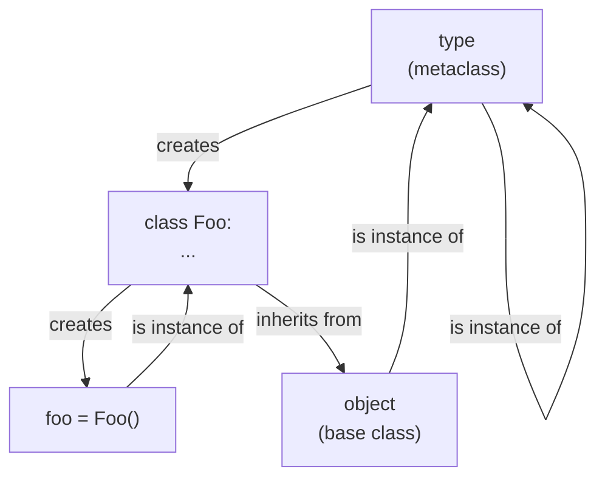
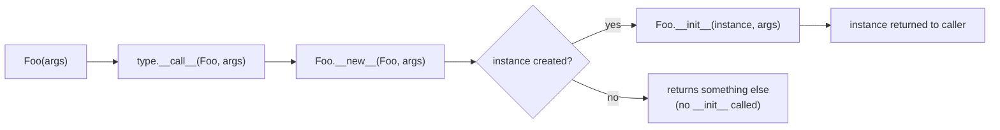

# 1. Classes and Objects

## Why This Matters

Almost every non-trivial Python program you ever write will involve classes. The `class` keyword is the primary tool Python gives you for grouping **state** (data) and **behaviour** (functions) into a single unit. Even when you "just use functions," the libraries you import — `pathlib.Path`, `requests.Session`, `pandas.DataFrame`, `unittest.TestCase`, `asyncio.Event` — are built from classes. To use them well, to read their source, and to debug into them, you have to understand what a class *is* in Python.

This is also where Python separates from C++ and Java in subtle but important ways. Python's classes are themselves **objects** (instances of `type`, the metaclass). Python has **no declarations** — classes are created at runtime by executing their body. Python has **no `new` keyword** — calling a class like a function creates an instance. Python has **no true private** — only conventions and name mangling. And the `self` parameter is **explicit**, not implicit. These design choices give Python enormous flexibility (monkey-patching, dynamic class creation, metaclasses) but also demand that you understand the model beneath the syntax.

This note lays the foundation. The rest of [[8. Object-Oriented Programming]] — attributes, inheritance, polymorphism, encapsulation, magic methods, class/staticmethods, composition — builds directly on what you learn here.

---

## Background

In procedural programming, you manipulate data structures with functions:

```python
point_x = 3
point_y = 4

def distance(x1, y1, x2, y2):
    return ((x2 - x1) ** 2 + (y2 - y1) ** 2) ** 0.5
```

As soon as you have *kinds* of things — points, lines, circles, users, accounts, orders — the procedural approach forces you to remember which functions operate on which data. Object-oriented programming groups data and behaviour together:

```python
class Point:
    def __init__(self, x, y):
        self.x = x
        self.y = y

    def distance_to(self, other):
        return ((other.x - self.x) ** 2 + (other.y - self.y) ** 2) ** 0.5

p = Point(3, 4)
q = Point(0, 0)
print(p.distance_to(q))  # 5.0
```

The data (`x`, `y`) and the behaviour (`distance_to`) live together. The function "knows" which point it operates on because of `self`.

In Python specifically, the OOP story is more flexible than in C++ or Java:

- **No access modifiers** (`public`, `private`, `protected` are not keywords).
- **No `new`** — calling the class returns an instance.
- **No header/source split** — the whole class is one block.
- **Dynamic** — you can add attributes and methods at runtime.
- **Multiple inheritance** — and the MRO (see [[3. Inheritance]]) handles ambiguity.
- **Everything is an object** — classes themselves are objects, created by `type`.

---

## The `class` Keyword

A `class` statement is **executable code**. When Python executes it, it:

1. Creates a new namespace (essentially a dict) for the class body.
2. Executes the body in that namespace — assignments create class attributes, `def` creates methods, nested `class` creates nested classes, etc.
3. Calls `type(name, bases, namespace)` (or the metaclass, if specified) to create the class object.
4. Binds the class name in the surrounding scope.

```python
class Dog:
    species = "Canis familiaris"   # class attribute

    def __init__(self, name, age):
        self.name = name            # instance attribute
        self.age = age

    def bark(self):
        return f"{self.name} says woof!"
```

After this definition runs, `Dog` is a class object. You can inspect it:

```python
print(type(Dog))       # <class 'type'>
print(Dog.species)     # 'Canis familiaris'
print(Dog.bark)        # <function Dog.bark at 0x...>
```

Notice that `Dog.bark` is just a function. Methods are functions stored on the class. The "bound method" magic happens through descriptors (see [[5. Encapsulation and Properties]] and Chapter 17).

---

## Classes Are Callable

A class is callable. Calling a class (`Dog(...)`) returns a new instance. This is conceptually the same as a factory function.

```python
rex = Dog("Rex", 5)   # equivalent to: rex = Dog.__call__("Rex", 5)
```

Under the hood, `Dog(...)` invokes `type.__call__(Dog, ...)`, which in turn:

1. Calls `Dog.__new__(Dog, *args, **kwargs)` — creates a new instance.
2. Calls `Dog.__init__(instance, *args, **kwargs)` — initializes it.
3. Returns the instance.

This means **`__new__` is the constructor**; `__init__` is only the **initializer**. For almost every class you write, you only override `__init__`. You override `__new__` only when you need to control instance creation itself — most commonly for immutable types (like `tuple` or `str` subclasses), singletons, or metaclasses.

```python
class Singleton:
    _instance = None

    def __new__(cls, *args, **kwargs):
        if cls._instance is None:
            cls._instance = super().__new__(cls)
        return cls._instance

a = Singleton()
b = Singleton()
print(a is b)  # True
```

> [!warning] `__init__` is not a constructor
> Many tutorials call `__init__` "the constructor." Strictly, it isn't. `__init__` *initialises* an already-constructed instance. `__new__` *constructs* it. The distinction matters for immutables (you can't mutate `self` in `__init__` for a `str` subclass because the value is already locked in) and for interning patterns like the singleton above.

---

## `__init__` — The Initializer

`__init__` runs **after** the instance exists. Its job is to populate the instance's `__dict__` with initial attribute values. It returns `None` (Python will raise `TypeError` if you return anything else).

```python
class Rectangle:
    def __init__(self, width, height):
        self.width = width
        self.height = height
        self.area = width * height  # cached

r = Rectangle(3, 4)
print(r.__dict__)  # {'width': 3, 'height': 4, 'area': 12}
```

Things to know:

- `__init__` is **inherited** like any other method. If a subclass doesn't define its own, the parent's is used.
- If a subclass does define `__init__`, it **does not** automatically call the parent's. You must call `super().__init__(...)` explicitly.
- `__init__` can take default args, `*args`, `**kwargs`, keyword-only args — same rules as any function (see [[3. Default and Keyword Arguments]] and [[4. args and kwargs]]).

```python
class Square(Rectangle):
    def __init__(self, side):
        super().__init__(side, side)
```

---

## `self` — The Instance Reference

The first parameter of every instance method is the instance itself. By **convention** it is named `self`. Python does not enforce this name — you could call it `this`, `me`, or `the_instance_and_i_love_it` — but `self` is universal in the Python community. Deviating from it makes your code unreadable.

When you call `rex.bark()`, Python translates it into `Dog.bark(rex)`:

```python
rex = Dog("Rex", 5)
rex.bark()       # "Rex says woof!"
Dog.bark(rex)    # exactly the same
```

The `rex.bark` syntax produces a **bound method**: a small object that has `rex` pre-loaded as the first argument. Bound methods are created on the fly by the descriptor protocol every time you access a method.

```python
m = rex.bark
print(m)              # <bound method Dog.bark of <Dog object at 0x...>>
print(m.__self__)     # <Dog object at 0x...>
print(m.__func__)     # <function Dog.bark at 0x...>
m()                   # calls Dog.bark(rex)
```

> [!tip] Why is `self` explicit?
> Explicit `self` makes several patterns trivial: calling a method from another method (`self.other()`), passing `self` to a free function, storing methods as callbacks (`button.on_click = self.handle_click`), and applying decorators uniformly. Implicit `this` (as in C++ or Java) requires special syntax for these cases. Python's design trades two characters of typing for a lot of conceptual cleanliness.

---

## Class vs Instance Attributes

There are two kinds of attributes:

- **Class attributes** live on the class object. Shared by all instances.
- **Instance attributes** live on each instance's `__dict__`. Per-instance.

```python
class Cat:
    species = "Felis catus"   # class attribute
    count = 0                 # class attribute

    def __init__(self, name):
        self.name = name      # instance attribute
        Cat.count += 1        # increment class attribute

a = Cat("Mittens")
b = Cat("Paws")
print(a.species, b.species)   # 'Felis catus' 'Felis catus'
print(Cat.count)              # 2
print(a.count, b.count)       # 2 2 — accessible via instances too
```

### The mutable class attribute trap

```python
class Bad:
    items = []   # class attribute, shared!

    def add(self, x):
        self.items.append(x)   # mutates the class attribute!

a = Bad()
b = Bad()
a.add(1)
print(b.items)   # [1]  ← surprise!
```

`self.items.append(1)` does NOT create a new instance attribute. It looks up `items`, finds it on the class (no instance attr yet), and calls `.append` on that shared list. Both instances now see `[1]`.

Fix: initialise mutable per-instance attributes in `__init__`:

```python
class Good:
    def __init__(self):
        self.items = []   # instance attribute, per-instance

a = Good()
b = Good()
a.add = lambda x: a.items.append(x)
a.add(1)
print(b.items)   # []
```

Or use `None` as a class-level sentinel:

```python
class Good:
    items = None

    def __init__(self):
        if self.items is None:
            self.items = []
```

The first form is cleaner.

### Lookup order

When you write `obj.attr`, Python looks up `attr` in this order (see [[2. Attributes and Methods]] for the full picture):

1. **Type** of `obj` (the class and its bases) — for data descriptors like `property`.
2. **Instance** `__dict__`.
3. **Type** again — for non-data descriptors (like plain methods) and class attributes.
4. If not found: `AttributeError`, unless `__getattr__` is defined (see [[6. Magic Methods]]).

For most day-to-day work the rule of thumb is: **instance first, then class, then base classes.**

---

## Everything Is an Object

In Python, *everything* is an object — including classes. Integers, functions, modules, classes, exceptions, types — all are instances of some class. You can inspect them:

```python
print(type(42))         # <class 'int'>
print(type("hello"))    # <class 'str'>
print(type(len))        # <class 'builtin_function_or_method'>
print(type(print))      # <class 'builtin_function_or_method'>
import math
print(type(math))       # <class 'module'>
class Foo: pass
print(type(Foo))        # <class 'type'>          ← the class is itself an instance of `type`
print(type(Foo()))      # <class '__main__.Foo'>
print(type(type))       # <class 'type'>          ← `type` is its own metaclass
print(type(object))     # <class 'type'>
```

This is the metaclass rabbit hole. `type` is the metaclass for all classes. When you write:

```python
class Foo:
    x = 1
```

Python roughly runs:

```python
Foo = type("Foo", (object,), {"x": 1, "__module__": "__main__", "__qualname__": "Foo"})
```

You can do this manually:

```python
def init_method(self):
    print("Hello from", self)

Bar = type("Bar", (object,), {"greet": init_method})
b = Bar()
b.greet()   # Hello from <__main__.Bar object at 0x...>
```

This is the basis of [[4. Metaclasses]] (Chapter 17) and dynamic class creation. The key insight here is: **a class is an object that produces other objects.**

### The class/instance/type relationship



The diagram shows the two fundamental relationships:

- **`isinstance(x, C)`** — `x` was created by `C` (or a subclass).
- **`issubclass(C, D)`** — `C` inherits from `D`.

`type` and `object` are at the top of both hierarchies: `object` is the root of inheritance, `type` is the root of instantiation. `isinstance(type, object)` is `True` (every class is an object), and `issubclass(object, type)` is `False`, but `isinstance(type, type)` is `True` (the metaclass loop). Don't worry about the philosophy — just remember the diagram.

---

## Instance Lifecycle



In the vast majority of cases you only write `__init__`. The full chain matters for:

- **Singletons** (override `__new__` to return cached instance).
- **Immutable subclasses** (override `__new__` to set the value before `__init__`).
- **Metaclasses** (override `__call__` to customise how a class's instances are created).
- **Interning / caching** (return an existing instance instead of creating a new one).

### `__del__` — The Finalizer

Python also calls `__del__` when an object is about to be garbage-collected:

```python
class Connection:
    def __init__(self, url):
        self.url = url
        print(f"Connecting to {url}")

    def __del__(self):
        print(f"Closing connection to {self.url}")
```

`__del__` is **not** a destructor in the C++ sense. It's a finalizer, called at an unspecified time after the last reference goes away (or never, if the program exits first). Use context managers (see [[4. Context Managers]]) instead of `__del__` for deterministic resource cleanup. `__del__` is a safety net, not a primary tool.

---

## Creating a Class — A Worked Example

Let's build a small, complete `BankAccount` class that exercises the concepts above.

```python
from decimal import Decimal

class BankAccount:
    # Class attributes
    bank_name = "Python Trust Bank"
    _next_account_number = 1000   # private-by-convention counter

    def __init__(self, owner, initial_balance=0):
        self.owner = owner
        self._balance = Decimal(str(initial_balance))   # protected
        self.account_number = BankAccount._next_account_number
        BankAccount._next_account_number += 1

    # Instance method
    def deposit(self, amount):
        if amount <= 0:
            raise ValueError("Deposit must be positive")
        self._balance += Decimal(str(amount))
        return self._balance

    def withdraw(self, amount):
        if amount <= 0:
            raise ValueError("Withdrawal must be positive")
        if amount > self._balance:
            raise ValueError("Insufficient funds")
        self._balance -= Decimal(str(amount))
        return self._balance

    def __repr__(self):
        return f"BankAccount(owner={self.owner!r}, balance={self._balance})"

acc = BankAccount("Alice", 100)
print(acc.account_number)   # 1000
acc.deposit(50)
acc.withdraw(25)
print(acc)                  # BankAccount(owner='Alice', balance=125.00)
print(BankAccount.bank_name)   # Python Trust Bank
```

Note:

- `bank_name` and `_next_account_number` are **class attributes** — shared by all accounts.
- `owner`, `_balance`, `account_number` are **instance attributes** — set in `__init__`.
- `_balance` uses a single underscore: "protected by convention" (see [[5. Encapsulation and Properties]]).
- `__repr__` is a magic method (see [[6. Magic Methods]]) controlling how the object prints.

---

## Common Pitfalls

### 1. Forgetting `self`

```python
class Bad:
    def __init__():       # forgot self!
        pass

Bad()   # TypeError: __init__() takes 0 positional arguments but 1 was given
```

Always make the first parameter `self` (or whatever you call it) on instance methods.

### 2. Forgetting to call `super().__init__()`

```python
class Animal:
    def __init__(self, name):
        self.name = name

class Dog(Animal):
    def __init__(self, breed):   # forgot super().__init__(name)
        self.breed = breed

d = Dog("Labrador")
print(d.name)   # AttributeError
```

If a subclass defines `__init__`, it must explicitly call the parent's.

### 3. Mutable class attribute shared across instances

Covered above — initialise mutable attributes in `__init__`, not at class scope.

### 4. Confusing `__init__` with `__new__`

You almost never need `__new__`. If you find yourself writing it, ask: do I really need to control *creation*, or do I just need to control *initialisation*? Usually the latter.

### 5. Returning a value from `__init__`

```python
class Bad:
    def __init__(self):
        return 42   # TypeError: __init__() should return None
```

`__init__` returns `None` implicitly. Don't add a `return` with a value.

### 6. Shadowing class attributes with instance attributes

```python
class Counter:
    total = 0

    def bump(self):
        self.total += 1   # creates instance attr; class attr untouched

c1 = Counter()
c2 = Counter()
c1.bump()
print(c1.total, c2.total, Counter.total)   # 1 0 0
```

`self.total += 1` reads from the class (no instance attr yet), then assigns to the instance — creating a new instance attribute that shadows the class attribute. If you wanted to increment the class-level counter, you'd write `Counter.total += 1` or `type(self).total += 1`.

### 7. Class defined inside a function captures closure state oddly

```python
def make_class(x):
    class C:
        value = x
    return C

C1 = make_class(1)
C2 = make_class(2)
print(C1.value, C2.value)   # 1 2 — fine
```

This works, but the class's `__qualname__` will be `make_class.<locals>.C`, which can confuse serialisation frameworks.

### 8. Calling a class with no `__init__` defined

This is fine — Python uses `object.__init__`, which accepts no arguments. But:

```python
class Empty: pass
Empty(1, 2)   # TypeError: Empty() takes no arguments
```

If you want to accept and ignore args, define `def __init__(self, *args, **kwargs): pass`.

### 9. Defining `__init__` but not `__new__` for immutables

```python
class MyString(str):
    def __init__(self, value):
        # value already locked in by str.__new__ — too late!
        pass
```

For `str`, `int`, `tuple`, `frozenset` subclasses, override `__new__` instead.

### 10. Treating `class` as a declaration

In C++, `class Foo { ... };` is a compile-time declaration. In Python, `class Foo:` is a runtime statement. You can conditionally define classes, generate them in loops, redefine them at runtime — they're just objects created by executing code.

---

## Tips and Tricks

- **Class bodies are namespaces** — you can put any executable code in a class body, including comprehensions, `if`, `for`, and even `print`. Useful for building tables of options:

  ```python
  class Color:
      for _name, _code in [("RED", 0xFF0000), ("GREEN", 0x00FF00), ("BLUE", 0x0000FF)]:
          locals()[_name] = _code
  ```

- **Use `__slots__`** when you have millions of instances of a small class — it skips `__dict__` and saves memory (see [[2. Attributes and Methods]]).

- **Define `__repr__` for every class you care about** — it makes debugging vastly easier.

- **`type(obj).__name__`** gives you the class name as a string — useful in error messages and logging.

- **`vars(obj)`** returns `obj.__dict__` — a handy shortcut for inspecting instance attributes.

- **`dir(obj)`** lists all attributes (instance + class + inherited) — useful at the REPL.

- **Class attributes are a great place for constants** — `Math.PI`-style. Just don't make them mutable.

- **`@dataclass`** (see [[4. Dataclasses]] in Ch 18) auto-generates `__init__`, `__repr__`, and `__eq__` for free. Use it for plain data containers.

- **Initialise mutable defaults in `__init__`** — never at class scope.

- **`type(name, bases, namespace)`** lets you create classes dynamically — useful for plugins, ORMs, serializers.

- **`cls.__mro__`** shows the method resolution order — invaluable for debugging inheritance (see [[3. Inheritance]]).

- **Prefer composition over inheritance** when in doubt — see [[8. Composition vs Inheritance]].

---

## Active Recall

1. What does the `class` keyword actually do at runtime? List the four steps.
2. Why is `__init__` not technically a constructor? Which method *is* the constructor?
3. What does `Dog("Rex", 5)` translate to in terms of `__new__` and `__init__`?
4. Why must `self` be explicit in Python method definitions? Give one benefit of this design.
5. What is a **class attribute** vs an **instance attribute**? Where does each live?
6. Explain the mutable class attribute trap. Show the bug and the fix.
7. What is the lookup order for `obj.attr`?
8. What is `type`? What does `type(Dog)` return? What does `type(type)` return?
9. Write a class `Temperature` with `__init__(self, celsius)` and methods `to_fahrenheit` and `to_kelvin`. Then make it print nicely with `__repr__`.
10. Write a `Singleton` class. Why do you need `__new__` and not `__init__`?
11. What is the relationship between `type` and `object`? Draw the diagram from memory.
12. When would you override `__new__` instead of `__init__`?
13. What does `vars(rex)` return? How is it different from `dir(rex)`?
14. Show that a method accessed via an instance becomes a "bound method". What does `m.__self__` give you?
15. Why does `Empty(1, 2)` raise `TypeError` for `class Empty: pass`?

---

## Next Steps

- Read [[2. Attributes and Methods]] — deep dive into instance vs class attributes, the lookup protocol, and `_`/`__` conventions.
- Read [[3. Inheritance]] — single, multiple, the C3 MRO, and `super()` in depth.
- Read [[5. Encapsulation and Properties]] — `@property`, `@x.setter`, name mangling, and Python's "consent, not coercion" privacy model.
- Read [[6. Magic Methods]] — `__init__`, `__new__`, `__repr__`, `__eq__`, `__enter__`, `__call__`, and dozens more.
- Read [[7. Class Methods and Static Methods]] — `@classmethod`, `@staticmethod`, and factory patterns.
- See [[4. Dataclasses]] in Chapter 18 for `@dataclass` — the modern shortcut for plain data classes.
- See [[3. type and Dynamic Class Creation]] and [[4. Metaclasses]] in Chapter 17 for the deep metaclass rabbit hole.
- See [[1. Descriptors]] in Chapter 17 to understand *how* methods become bound methods.
- See [[4. Context Managers]] in Chapter 5 — for `__enter__`/`__exit__`, the proper alternative to `__del__` for cleanup.
