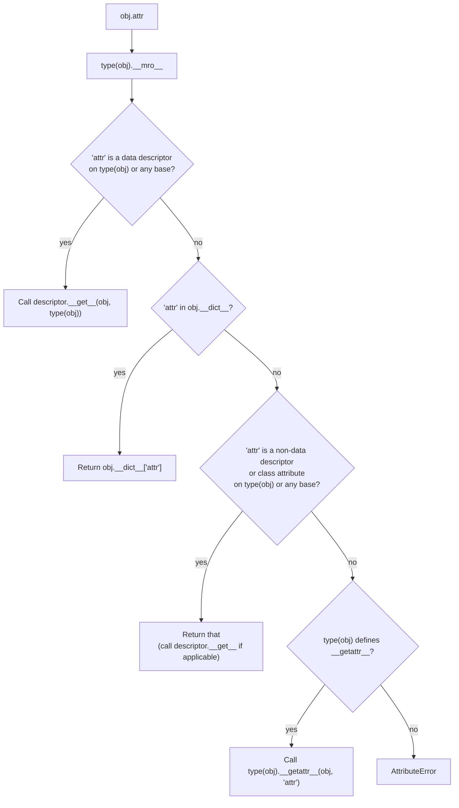

# 2. Attributes and Methods

## Why This Matters

A class is a namespace with superpowers. Once you start writing classes with more than a couple of methods, you immediately face practical questions: *Where does this attribute live? What happens if an instance attribute shadows a class attribute? How do I make an attribute "private"? Why does `obj.method()` work but `Class.method(obj)` is also fine? What's the difference between `_x` and `__x`?*

This note answers those questions. Attributes are the **nouns** of OOP — the data your objects carry. Methods are the **verbs** — the behaviour your objects expose. Python's model for both is more dynamic and more uniform than C++ or Java: every attribute access is a runtime lookup, every method is just a function stored on a class, and "privacy" is a convention layered on top of name mangling.

Once you understand the lookup protocol, you can:

- Avoid the most common Python OOP bugs (shadowing, mutable class attributes, missing `self`).
- Read framework source code with confidence (`django.db.models.Field`, `pandas.DataFrame`, `requests.Session` all lean heavily on attribute mechanics).
- Build your own descriptors, properties, and decorators later (Chapters 17 and 18).
- Use `__slots__`, `__dict__`, `getattr`, `setattr`, `hasattr`, and `delattr` fluently.

This note is the bedrock for [[5. Encapsulation and Properties]] (which adds `@property`) and for the descriptor deep dive in Chapter 17.

---

## Background

In Python, **everything attached to an object is an attribute**. Functions, classes, modules, integers — all are attributes of something. `math.pi` is an attribute of the `math` module. `list.append` is an attribute of the `list` class. `"hello".upper` is an attribute of the `str` instance `"hello"`. Attributes are accessed by name via the dot operator.

There are four flavours of attribute in OOP:

1. **Instance attributes** — per-object, stored in `instance.__dict__`.
2. **Class attributes** — shared, stored in `class.__dict__`.
3. **Methods** — functions defined in the class body; technically class attributes that happen to be functions.
4. **Descriptor-based attributes** — properties, classmethods, staticmethods, and custom descriptors; controlled by `__get__`, `__set__`, `__delete__` (see Chapter 17).

This note covers the first three and the lookup protocol. We'll mention descriptors when they affect the lookup order, but leave the full treatment to Chapter 17.

---

## Instance Attributes

Instance attributes are created by **assignment** on an instance, most often inside `__init__`:

```python
class Person:
    def __init__(self, name, age):
        self.name = name          # creates instance attribute 'name'
        self.age = age            # creates instance attribute 'age'

p = Person("Alice", 30)
print(p.__dict__)    # {'name': 'Alice', 'age': 30}
```

Each instance has its own `__dict__` — a regular dict mapping attribute names to values. You can inspect it, mutate it, and even replace it (rare, but legal):

```python
p.__dict__["email"] = "alice@example.com"   # equivalent to p.email = ...
print(p.email)   # 'alice@example.com'

p.__dict__ = {"x": 1}   # nuclear option — replaces all instance attributes
print(p.x)         # 1
print(p.name)      # AttributeError: 'Person' object has no attribute 'name'
```

> [!warning] Don't manipulate `__dict__` directly in production code
> It's fine for debugging and metaprogramming. In normal code, use `p.attr = value`, `getattr(p, "attr")`, `setattr(p, "attr", value)`, `delattr(p, "attr")`. These respect the descriptor protocol; raw `__dict__` access does not.

You can add instance attributes at any time, not just in `__init__`:

```python
p = Person("Bob", 25)
p.hobby = "cycling"   # new instance attribute, only on this instance
```

This is legal but frowned upon in code that needs to be maintainable — readers expect every instance of a class to have the same shape. The exception is when you're using a class as a namespace or a lightweight struct (see [[4. Dataclasses]] for a better alternative).

### `__slots__` — Skipping `__dict__`

For classes with many instances, you can declare a fixed set of attributes using `__slots__`:

```python
class Point:
    __slots__ = ("x", "y")

    def __init__(self, x, y):
        self.x = x
        self.y = y

p = Point(1, 2)
p.z = 3   # AttributeError: 'Point' object has no attribute 'z'
print(p.__dict__)   # AttributeError: 'Point' object has no attribute '__dict__'
```

`__slots__` tells Python to allocate space for exactly those attributes (using descriptors under the hood), skipping `__dict__`. Benefits:

- **Memory savings** — no per-instance dict (typically 40–100 bytes saved per instance).
- **Slightly faster attribute access** — descriptors are direct.
- **Typo protection** — `p.xx = 1` raises `AttributeError` instead of silently creating a new attribute.

Trade-offs:

- **No `__dict__`** — can't add new attributes at runtime.
- **No weak references** unless you also include `"__weakref__"` in `__slots__`.
- **Inheritance gotchas** — subclasses must also define `__slots__ = ()` (or their own slots) to keep the memory savings.
- **Pickling and copy sometimes break** — your class may need custom `__getstate__`/`__setstate__`.

Use `__slots__` when you have millions of instances of a small, fixed-shape class (graph nodes, particles, parser tokens). Skip it otherwise.

---

## Class Attributes

Class attributes are defined in the class body, outside any method:

```python
class Circle:
    pi = 3.14159            # class attribute (constant)
    _count = 0              # class attribute (shared counter)

    def __init__(self, radius):
        self.radius = radius
        Circle._count += 1   # increment shared counter

    def area(self):
        return Circle.pi * self.radius ** 2

print(Circle.pi)        # 3.14159 — accessible via class
c1 = Circle(1)
c2 = Circle(2)
print(c1.pi, c2.pi)     # 3.14159 3.14159 — accessible via instances too
print(Circle._count)    # 2
```

Class attributes are stored in `Circle.__dict__` (a mappingproxy, not a plain dict — you can't assign to it directly). All instances share the same class attribute — they don't have their own copies, they just *see* the class's.

### Why use class attributes?

- **Constants** — `Math.PI`, `Color.RED`, `HTTPStatus.OK`. Cleaner than module-level constants when the value is conceptually owned by the class.
- **Default values** — class attributes act as fallbacks for instance attributes (see lookup order below).
- **Shared counters / registries** — `_next_id`, `_instances = []`.
- **Configuration** — `Thread.pool_size`, `Database.connection_timeout`.

### The mutable class attribute trap

Already covered in [[1. Classes and Objects]] but worth re-emphasising:

```python
class Bad:
    tags = []   # shared list!

    def add_tag(self, t):
        self.tags.append(t)

a = Bad()
b = Bad()
a.add_tag("python")
print(b.tags)   # ['python']  ← leak!
```

The fix is to initialise mutable attributes per-instance in `__init__`:

```python
class Good:
    def __init__(self):
        self.tags = []   # per-instance
```

---

## Attribute Lookup Order

This is the central concept of this note. When you write `obj.attr`, Python follows a specific protocol:



The simplified rule of thumb:

1. **Data descriptors on the type** (e.g. `property` with a setter) — highest priority.
2. **Instance `__dict__`** — per-instance values.
3. **Non-data descriptors and class attributes on the type** (e.g. methods, plain class attrs).
4. **`__getattr__`** — fallback hook (see [[6. Magic Methods]]).

This ordering has two surprising consequences:

### Surprise 1: Methods can be shadowed by instance attributes

```python
class Foo:
    def greet(self):
        return "hello"

f = Foo()
f.greet = lambda: "hi"   # instance attribute shadows method
print(f.greet())   # 'hi'
```

`f.greet` finds `greet` in `f.__dict__` before reaching the class. This is rarely what you want — but it's legal, and it's why some style guides recommend never assigning to instance attributes whose names collide with methods.

### Surprise 2: Properties always win

```python
class Bar:
    @property
    def value(self):
        return 42

b = Bar()
b.__dict__["value"] = 99   # try to shadow
print(b.value)   # 42 — property wins because it's a data descriptor
b.value = 99      # AttributeError: can't set attribute (no setter defined)
```

Properties are data descriptors (they define `__set__`), so they take priority over the instance `__dict__`. This is why read-only properties actually stay read-only even if someone tries to override them via `__dict__`.

### Direct class lookup

You can bypass the instance entirely by accessing through the class:

```python
Circle.pi                # via class
type(c1).pi              # same, via type of instance
c1.__class__.pi          # same, via __class__
```

This is useful when you want the *class* value even if an instance attribute shadows it.

---

## Methods

A **method** is a function defined inside a class body. There are three kinds:

| Kind | Decorator | First parameter | Typical use |
|------|-----------|-----------------|-------------|
| Instance method | (none) | `self` (the instance) | Operate on instance state |
| Class method | `@classmethod` | `cls` (the class) | Factory methods, alternative constructors |
| Static method | `@staticmethod` | (no implicit first arg) | Utility functions grouped with the class |

We'll cover instance methods here; class and static methods get their own note in [[7. Class Methods and Static Methods]].

### Instance methods

```python
class Counter:
    def __init__(self, start=0):
        self.value = start

    def increment(self, by=1):     # instance method
        self.value += by
        return self.value

    def reset(self):
        self.value = 0

c = Counter()
c.increment(5)        # 5 — Python translates to Counter.increment(c, 5)
Counter.increment(c, 5)   # exactly equivalent
```

When you access `c.increment`, Python's descriptor protocol kicks in:

1. `Counter.increment` is a plain function (a non-data descriptor).
2. Accessing it via an instance triggers `function.__get__(c, Counter)`.
3. This returns a **bound method** — a callable that prepends `c` as the first argument when called.

```python
m = c.increment
print(m)              # <bound method Counter.increment of <Counter object at 0x...>>
print(m.__self__)     # <Counter object at 0x...>
print(m.__func__)     # <function Counter.increment at 0x...>
m(3)                  # calls Counter.increment(c, 3)
```

Accessing the method via the class instead gives you the **unbound function**:

```python
print(Counter.increment)   # <function Counter.increment at 0x...>
```

### Calling methods from other methods

Inside a method, use `self.other_method()` to call other methods on the same instance:

```python
class Calculator:
    def __init__(self, value):
        self.value = value

    def double(self):
        return self.value * 2

    def quadruple(self):
        return self.double() + self.double()   # uses self
```

Always go through `self.` (not `Calculator.double()`). That way subclass overrides are respected (see [[3. Inheritance]]).

### Private and "protected" attributes

Python has no `private` or `protected` keywords. Instead:

- **Single underscore** (`_name`) — "internal use" by convention. Tools like `from module import *` won't import these. IDEs warn you. Nothing actually prevents access.
- **Double underscore** (`__name`) — **name mangling**. Python rewrites `__name` inside a class to `_ClassName__name`. This is a *collision-avoidance* mechanism, not a security feature.

```python
class Server:
    def __init__(self, host):
        self._config = {"host": host}     # convention: protected
        self.__secret = "hunter2"          # mangled to _Server__secret

s = Server("example.com")
print(s._config)              # {'host': 'example.com'} — accessible, just discouraged
print(s.__secret)             # AttributeError: 'Server' object has no attribute '__secret'
print(s._Server__secret)      # 'hunter2' — accessible via mangled name
print(s.__dict__)             # {'_config': {...}, '_Server__secret': 'hunter2'}
```

Name mangling exists so that a subclass can define `__secret` without colliding with the parent's `__secret`. It's not access control — anyone with the mangled name can read or write it.

> [!tip] When to use which
> Use `_single_underscore` for "internal" attributes that the rest of your code shouldn't touch but might need to in tests or for debugging. Reserve `__double_underscore` for cases where you genuinely need to avoid name collisions in a subclass hierarchy — rare. Most Python code uses `_` exclusively.

### Avoiding the "trusting" lint

Don't write:

```python
class Bad:
    def __init__(self):
        self.__value = 0
    def get(self):
        return self.__value
    def set(self, v):
        self.__value = v
```

That's C++/Java thinking transplanted into Python. Use `@property` instead (see [[5. Encapsulation and Properties]]):

```python
class Good:
    def __init__(self):
        self._value = 0

    @property
    def value(self):
        return self._value

    @value.setter
    def value(self, v):
        if v < 0:
            raise ValueError("value must be non-negative")
        self._value = v
```

---

## Attribute Access Built-ins

Python gives you four functions for attribute access by name (as a string):

| Function | Equivalent to | Use |
|----------|---------------|-----|
| `getattr(obj, name)` | `obj.name` | Dynamic attribute access from a string |
| `getattr(obj, name, default)` | (with fallback) | Safe access that returns default if missing |
| `setattr(obj, name, value)` | `obj.name = value` | Dynamic attribute set |
| `delattr(obj, name)` | `del obj.name` | Dynamic attribute delete |
| `hasattr(obj, name)` | `try: getattr(...)` | Check if attribute exists |

```python
class Config:
    def __init__(self):
        self.debug = False
        self.host = "localhost"

c = Config()
print(getattr(c, "host"))              # 'localhost'
print(getattr(c, "port", 8080))        # 8080 (default)
setattr(c, "port", 9000)
print(hasattr(c, "port"))              # True
delattr(c, "port")
print(hasattr(c, "port"))              # False
```

`getattr` with a default is the Pythonic way to probe for an attribute (EAFP-style — see [[7. EAFP and Duck Typing]]). Avoid `hasattr` followed by `getattr` in performance-sensitive code; one `getattr` with a default is cheaper than two lookups.

### `__dict__` and `dir`

- `obj.__dict__` — the instance's own attributes (a dict).
- `type(obj).__dict__` — the class's attributes (a mappingproxy).
- `vars(obj)` — same as `obj.__dict__`.
- `dir(obj)` — a sorted list of all attribute names visible on `obj` (instance + class + bases + built-ins).

```python
class A:
    x = 1
    def __init__(self):
        self.y = 2

a = A()
print(vars(a))           # {'y': 2}
print(type(a).__dict__.keys())   # dict_keys(['__module__', 'x', '__init__', ...])
print(dir(a))            # ['__class__', '__delattr__', ..., 'x', 'y']
```

`dir` is for interactive exploration; `vars` and `__dict__` are for actual programmatic use.

---

## A Worked Example: A `TaggedValue` Class

Let's put everything together — instance attributes, class attributes, methods, `_` convention, and the lookup protocol in action.

```python
class TaggedValue:
    """A value with an optional tag and a shared registry of all instances."""

    _registry = []   # class attribute — shared list of all instances
    _next_id = 1     # class attribute — shared counter

    def __init__(self, value, tag=None):
        self.value = value                # public instance attribute
        self._tag = tag                   # "protected" instance attribute
        self._id = TaggedValue._next_id   # capture-and-increment shared counter
        TaggedValue._next_id += 1
        TaggedValue._registry.append(self)

    @property
    def tag(self):
        """Read-only view of the tag."""
        return self._tag

    def set_tag(self, tag):
        self._tag = tag
        return self

    @classmethod
    def all(cls):
        """Return all instances ever created."""
        return list(cls._registry)

    def __repr__(self):
        return f"TaggedValue(id={self._id}, value={self.value!r}, tag={self._tag!r})"

v1 = TaggedValue(10, "alpha")
v2 = TaggedValue(20)
v2.set_tag("beta")

print(v1)                  # TaggedValue(id=1, value=10, tag='alpha')
print(v2)                  # TaggedValue(id=2, value=20, tag='beta')
print(TaggedValue.all())   # [TaggedValue(id=1, ...), TaggedValue(id=2, ...)]
print(v1.tag)              # 'alpha'  (via @property)
v1.tag = "x"               # AttributeError — read-only property
```

Things to notice:

- `_registry` and `_next_id` are **class attributes**, shared by all instances.
- `value` is a **public instance attribute**; `_tag` and `_id` are **"protected"** by convention.
- `tag` is a **read-only property** (no setter) — public, computed from `_tag`.
- `set_tag` returns `self` so calls can be chained: `TaggedValue(30).set_tag("gamma")`.
- `all()` is a **class method** — see [[7. Class Methods and Static Methods]].
- `__repr__` uses `!r` to display values with their repr (quotes for strings).

---

## Common Pitfalls

### 1. Mutable class attribute shared across instances

Covered above and in [[1. Classes and Objects]]. Initialise mutable per-instance data in `__init__`.

### 2. Setting a class attribute through an instance

```python
class C:
    x = 1

c = C()
c.x = 5          # creates instance attribute 'x' on c, NOT class attribute
print(c.x, C.x)  # 5 1
d = C()
print(d.x)       # 1 — class attribute, unchanged
```

To set the class attribute, use `C.x = 5` or `type(c).x = 5`.

### 3. Forgetting `self` in method body

```python
class Bad:
    def __init__(self, x):
        x = x          # local variable, not self.x!

b = Bad(5)
print(b.x)   # AttributeError
```

Should be `self.x = x`.

### 4. `__` not actually private

```python
class Safe:
    def __init__(self):
        self.__password = "1234"

s = Safe()
print(s.__password)        # AttributeError (looks private)
print(s._Safe__password)   # '1234' (mangled name is fully accessible)
```

Name mangling prevents *accidental* collision, not deliberate access.

### 5. Attribute lookup is per-access — caching matters

```python
class Pixel:
    __slots__ = ("r", "g", "b")

    def is_gray(self):
        # Three lookups: self.r, self.g, self.b
        return self.r == self.g == self.b
```

In a hot loop, calling `pixel.is_gray()` millions of times does three attribute lookups per call. If you need speed, cache:

```python
def is_gray_fast(p):
    r, g, b = p.r, p.g, p.b   # one lookup each, then locals
    return r == g == b
```

Local variable access is significantly faster than attribute access in CPython.

### 6. `__slots__` and inheritance

```python
class Base:
    __slots__ = ("x",)

class Derived(Base):
    pass   # no __slots__ → Derived instances get a __dict__ anyway

d = Derived()
d.x = 1
d.y = 2   # works! __slots__ on Base is defeated
```

For `__slots__` to actually save memory in a hierarchy, every subclass must also declare `__slots__` (even if just `()`).

### 7. `hasattr` swallows all exceptions in Python 2 (not 3)

In Python 3, `hasattr(obj, 'x')` calls `getattr` and returns `False` only on `AttributeError`. Other exceptions propagate. (Python 2 returned `False` for any exception — a notorious footgun.) Just something to know if you ever read old code.

### 8. `dir()` returns more than `__dict__`

```python
class Empty: pass
print(len(Empty.__dict__))   # a handful
print(len(dir(Empty)))       # ~40 (includes inherited from object)
```

`dir()` includes inherited attributes and dunder methods. Don't use it to test "does this instance have attribute X" — use `hasattr` or `try/except AttributeError`.

### 9. Confusing `cls` and `self`

In a `@classmethod`, the first parameter is `cls` (the class). In an instance method, it's `self` (the instance). Calling a classmethod from an instance method: `self.from_yaml(...)` works (because `self.from_yaml` resolves via the class), but it's clearer to write `type(self).from_yaml(...)` or `MyClass.from_yaml(...)`.

### 10. Forgetting that methods are attributes

```python
class Button:
    def click(self):
        print("clicked")

b = Button()
b.click      # not called! returns bound method object
b.click()    # called
```

Forgetting the `()` is a common typo. Some linters will warn about "statement has no effect."

---

## Tips and Tricks

- **Use `vars(obj)` for quick debugging** — it shows just the instance's own attributes.
- **Use `dir(obj)` at the REPL** — comprehensive list of what's accessible.
- **Cache attribute lookups in hot loops** — `x = obj.attr` once, then use `x`.
- **Prefer `_single_underscore`** for "internal" attributes — reserve `__double` for genuine collision avoidance.
- **Use `@property` for read-only attributes** instead of getter methods — Pythonic.
- **Use `__slots__`** when you have many small, fixed-shape instances.
- **Don't add instance attributes outside `__init__`** unless you have a strong reason — surprising shape changes are hard to debug.
- **Class attributes make great constants** — `Color.RED`, `HTTPStatus.OK`.
- **`type(self)` is more subclass-safe than `ClassName`** when incrementing a shared class counter — but `ClassName` is clearer when you don't expect subclassing.
- **Bound methods are first-class objects** — you can pass `obj.method` as a callback, store it, or wrap it with decorators.
- **`__dict__` is mutable** — you can add attributes via `obj.__dict__["x"] = 1`, but using `setattr(obj, "x", 1)` is more Pythonic.
- **`functools.cached_property`** is a great way to memoise expensive instance attributes — see [[5. Encapsulation and Properties]].
- **`inspect.getmembers(obj)`** returns `(name, value)` pairs for everything in `dir(obj)` — useful for reflective code.

---

## Active Recall

1. What are the four kinds of attributes in Python OOP?
2. Where do instance attributes live? Where do class attributes live?
3. What is the attribute lookup order in Python? Draw the flowchart.
4. Why can an instance attribute shadow a method? Why can't it shadow a property?
5. What is name mangling? What does `self.__secret` become inside class `Server`?
6. What is the difference between `_name` and `__name`? When would you use each?
7. What is `__slots__`? What does it save, and what does it cost?
8. Write a `Point` class with `__slots__ = ("x", "y")`. Show that `p.z = 1` raises `AttributeError`.
9. What does `vars(obj)` return? How is it different from `dir(obj)`?
10. What is a **bound method**? Show `m = obj.method`, then `m.__self__` and `m.__func__`.
11. Explain why `Circle._count += 1` inside `__init__` increments a shared counter, but `self.tags.append(...)` mutates a shared list. Why does one "create an instance attribute" and the other not?
12. Write a class `Stack` with `push`, `pop`, and `peek` using a single class-attribute `_sentinel = object()` to mark empty.
13. Why does `c.x = 5` on an instance not change the class attribute `C.x`?
14. Show that `hasattr` followed by `getattr` is wasteful — give the EAFP alternative.
15. When would you actually use `__double_underscore` name mangling?

---

## Next Steps

- Read [[3. Inheritance]] — what happens to attributes when subclasses are involved, the C3 MRO, and `super()`.
- Read [[5. Encapsulation and Properties]] — `@property`, `@x.setter`, `@x.deleter`, `functools.cached_property`.
- Read [[6. Magic Methods]] — `__getattr__`, `__getattribute__`, `__setattr__` (the hooks that intercept attribute access).
- Read [[7. Class Methods and Static Methods]] — `@classmethod`, `@staticmethod`, factory methods.
- See [[1. Descriptors]] in Chapter 17 — the *real* mechanism behind `property`, `classmethod`, `staticmethod`, and methods in general.
- See [[4. Dataclasses]] in Chapter 18 — `@dataclass` with `field()`, `__slots__`, and frozen instances.
- See [[1. __dict__ and Attribute Access]] in Chapter 17 — metaprogramming with `__dict__`.
