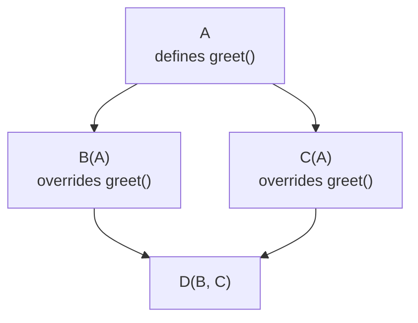
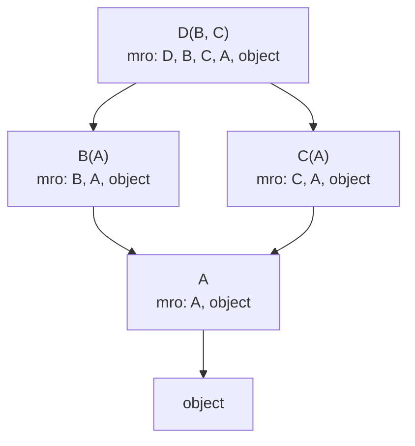

# 3. Inheritance

## Why This Matters

Inheritance is the most famous — and most misused — feature of object-oriented programming. It lets you say "`Dog` *is an* `Animal`," and have `Dog` automatically get everything `Animal` has, then add or override bits. Used well, inheritance eliminates duplication and makes type relationships explicit. Used badly, it creates rigid hierarchies, fragile base classes, and the infamous **diamond problem**.

Python's inheritance model is more powerful and more dangerous than C++ or Java's:

- **Multiple inheritance is allowed** — a class can inherit from any number of parents.
- **The MRO (Method Resolution Order)** uses **C3 linearization**, a deterministic algorithm that resolves the diamond problem without ambiguity (in most cases).
- **`super()`** is not just "call my parent" — it's "call the next class in the MRO," which in multiple inheritance can be a *sibling*. This makes `super()` a cooperative mechanism: every class in a hierarchy must agree to use it.
- **Abstract base classes** (ABCs) formalise interfaces — see [[1. Abstract Base Classes]] in Chapter 18.

This note covers single and multiple inheritance, the C3 MRO, `super()` in depth, `isinstance`/`issubclass`, method overriding, and a brief look at ABCs. After this, you should be able to design hierarchies that are flexible, predictable, and free of diamond-shaped surprises.

---

## Background

Inheritance answers the question: *I have a class that does most of what I want; can I just extend it?* The derived class (subclass) automatically has all the attributes and methods of the base class (superclass), and can:

- **Add** new attributes and methods.
- **Override** existing methods with new implementations.
- **Extend** existing methods by calling the parent's version via `super()`.

```python
class Animal:
    def __init__(self, name):
        self.name = name

    def speak(self):
        return f"{self.name} makes a sound"

class Dog(Animal):
    def speak(self):
        return f"{self.name} says woof!"

d = Dog("Rex")
print(d.speak())   # Rex says woof!
print(d.name)      # Rex — inherited attribute
```

`Dog` inherits from `Animal` because `Animal` is listed in parentheses after `Dog`. `Dog` overrides `speak` but inherits `__init__` (and therefore the `name` attribute created by it).

If no base is given, a class implicitly inherits from `object`:

```python
class Foo: pass
class Bar(object): pass   # identical

print(Foo.__bases__)   # (<class 'object'>,)
print(Bar.__bases__)   # (<class 'object'>,)
```

`object` is the root of the inheritance hierarchy. Every class is a subclass of `object`.

---

## Single Inheritance

One base class. The simplest case:

```python
class Vehicle:
    def __init__(self, wheels):
        self.wheels = wheels

    def describe(self):
        return f"Vehicle with {self.wheels} wheels"

class Bicycle(Vehicle):
    def __init__(self):
        super().__init__(2)   # call parent's __init__

    def ring(self):
        return "ding ding!"

b = Bicycle()
print(b.describe())   # Vehicle with 2 wheels — inherited
print(b.ring())       # ding ding! — own method
print(b.wheels)       # 2 — inherited attribute
```

### Method overriding

A subclass method with the same name as a parent method **replaces** it. To extend rather than replace, call `super()`:

```python
class Base:
    def greet(self):
        return "hello"

class Sub(Base):
    def greet(self):
        return super().greet() + " and goodbye"

print(Sub().greet())   # hello and goodbye
```

### Attribute inheritance

If a subclass doesn't define `__init__`, the parent's `__init__` is used automatically:

```python
class Parent:
    def __init__(self):
        self.x = 1

class Child(Parent): pass

c = Child()
print(c.x)   # 1
```

If a subclass *does* define `__init__`, the parent's `__init__` is **not** called automatically — you must call it yourself via `super().__init__(...)`:

```python
class Child(Parent):
    def __init__(self):
        # Parent's __init__ NOT called!
        self.y = 2

c = Child()
print(c.y)   # 2
print(c.x)   # AttributeError
```

---

## Multiple Inheritance

Python allows a class to inherit from multiple bases:

```python
class Flyable:
    def fly(self):
        return "flying"

class Swimmer:
    def swim(self):
        return "swimming"

class Duck(Flyable, Swimmer):
    pass

d = Duck()
print(d.fly())    # flying
print(d.swim())   # swimming
```

Multiple inheritance is powerful but risky. It raises two questions:

1. **Which `fly` is used if two bases define one?** — answered by the MRO.
2. **How do you call *all* parents' `__init__` cleanly?** — answered by cooperative `super()`.

### The diamond problem

The classic pitfall:



`D` inherits from `B` and `C`, both of which inherit from `A`. If `D` calls `super().greet()`, which `greet` is used? If both `B` and `C` call `super().greet()`, will `A.greet()` be called once or twice?

In C++, you'd need `virtual` inheritance to make this safe. In Python, **C3 linearization** resolves it deterministically.

---

## The C3 Method Resolution Order

Python computes a **linearization** of the inheritance graph — a single, ordered list of classes — when a class is created. This list is stored in `cls.__mro__`. When you access an attribute, Python walks this list in order.

### Rules

C3 builds the MRO by merging the MROs of the bases plus the new class itself, with these guarantees:

1. A class appears before its parents.
2. The order of bases is preserved (if `class D(B, C)`, then `B` comes before `C`).
3. The order is consistent (no contradictions).

If no consistent linearization exists, Python raises `TypeError` at class-creation time.

### Example

```python
class A:
    def greet(self): return "A"

class B(A):
    def greet(self): return "B -> " + super().greet()

class C(A):
    def greet(self): return "C -> " + super().greet()

class D(B, C):
    def greet(self): return "D -> " + super().greet()

print(D.__mro__)
# (<class 'D'>, <class 'B'>, <class 'C'>, <class 'A'>, <class 'object'>)

print(D().greet())   # D -> B -> C -> A
```

The MRO is `D, B, C, A, object`. So:

- `D.greet` calls `super().greet()` → next is `B.greet`.
- `B.greet` calls `super().greet()` → next is `C.greet` (NOT `A.greet` — the MRO determines the next, not the direct parent).
- `C.greet` calls `super().greet()` → next is `A.greet`.
- `A.greet` returns `"A"`.

`A.greet` is called exactly once — `super()` walks the MRO linearly, never revisiting a class.

### When C3 fails

```python
class X: pass
class Y: pass
class XY(X, Y): pass
class YX(Y, X): pass
class contradiction(XY, YX): pass   # TypeError: Cannot create a consistent MRO
```

`XY` says X before Y; `YX` says Y before X. `contradiction` inherits from both — no linearization can satisfy both orders. CPython detects this and refuses to create the class.

### Inspecting the MRO

```python
print(D.__mro__)               # tuple of classes
print(D.mro())                 # same, as a method
import inspect
print(inspect.getmro(D))       # same
```

You can also visualise the hierarchy:



> [!tip] Always check `__mro__` when debugging multiple inheritance
> If a method isn't being called or is being called twice, print `cls.__mro__` and trace the call by hand. The MRO is the single source of truth for "which class is next."

---

## `super()` — Deep Dive

`super()` returns a **proxy object** that routes attribute access to the next class in the MRO. "Next" means: the class after the current one in `type(self).__mro__`.

### Two forms

```python
super()                          # Python 3 — magic, works inside methods
super(SubClass, self).method()   # explicit form, also works outside methods
```

The zero-arg `super()` uses the `__class__` cell (a compiler trick) to know which class you're in, and `self` (or `cls`) to find the MRO.

### How `super()` finds the next class

`super()` doesn't know "the parent of the current class" — it knows "the class after the current class in `type(self).__mro__`." In a single-inheritance hierarchy this is the same thing. In multiple inheritance it's not.

```python
class B(A):
    def greet(self):
        super().greet()   # ← "next after B in type(self).__mro__"

b = B()
b.greet()   # next after B in B.__mro__ = A — correct

class D(B, C):
    pass

d = D()
# D.__mro__ = (D, B, C, A, object)
# When d.greet() runs B.greet, super() inside B.greet sees type(d).__mro__
# and finds the class after B, which is C — not A!
```

This is why `super()` is described as **cooperative**: it works correctly only if every class in the hierarchy uses `super()` consistently and the call chain reaches every class exactly once.

### `super()` with arguments

```python
class B(A):
    def greet(self):
        super(B, self).greet()   # explicit form
```

The explicit form takes the class to skip past and the instance to use for the MRO. The zero-arg form is preferred where it works (inside methods).

### Cooperative `__init__`

When using multiple inheritance with `__init__`, every class must:

1. Define `__init__` with `*args, **kwargs` (or specific named args that get passed along).
2. Call `super().__init__(*args, **kwargs)`.

```python
class Base:
    def __init__(self, **kwargs):
        print("Base.__init__", kwargs)
        super().__init__()   # object.__init__ takes no args

class Left(Base):
    def __init__(self, left_value, **kwargs):
        self.left_value = left_value
        print("Left.__init__", left_value)
        super().__init__(**kwargs)

class Right(Base):
    def __init__(self, right_value, **kwargs):
        self.right_value = right_value
        print("Right.__init__", right_value)
        super().__init__(**kwargs)

class Child(Left, Right):
    def __init__(self, *args, **kwargs):
        print("Child.__init__")
        super().__init__(*args, **kwargs)

c = Child(left_value=1, right_value=2)
# Child.__init__
# Left.__init__ 1
# Right.__init__ 2
# Base.__init__ {'left_value': 1, 'right_value': 2}  ←
# Wait — actually Base receives whatever wasn't consumed.
```

Wait — actually, in this example, `Left` pops `left_value` and passes the rest via `**kwargs`, so `Base` would receive `{'right_value': 2}`. The point is: every layer of the chain consumes what it needs and forwards the rest. This is the **kwarg-popping pattern** for cooperative `__init__`.

### `super()` outside methods

```python
proxy = super(B, b)   # legal but rare
proxy.greet()         # calls A.greet(b)
```

Useful for testing or for explicit disambiguation in hairy hierarchies.

### When NOT to use `super()`

- **When you specifically want the parent's version, not "the next in MRO."** Use `ParentClass.method(self, ...)` directly. This breaks cooperative multiple inheritance but is sometimes what you want.
- **In `__new__` of a class that might be subclassed alongside unrelated classes** — `super().__new__(cls)` is correct for the cooperative pattern, but if a sibling's `__new__` has a different signature, things break.
- **When the MRO has classes that don't cooperate** — `super()` cannot save you from a poorly designed hierarchy.

---

## `isinstance` and `issubclass`

```python
isinstance(obj, cls)        # True if obj is an instance of cls (or subclass)
issubclass(sub, sup)        # True if sub is a subclass of sup
```

Both accept tuples:

```python
isinstance(x, (int, float, complex))   # numeric?
issubclass(D, (A, B, C))
```

### `isinstance` vs `type(x) is`

```python
class A: pass
class B(A): pass

b = B()
print(isinstance(b, A))   # True — considers inheritance
print(type(b) is A)       # False — exact type only
```

`isinstance` is almost always what you want. `type(x) is Foo` is for cases where you need exact-type match (rare — usually a smell).

### Avoiding type checks — duck typing

In idiomatic Python, you often don't need `isinstance` at all. Just try to use the object's interface:

```python
def double(x):
    return x + x

double(2)            # 4
double("ab")         # "abab"
double([1, 2])       # [1, 2, 1, 2]
```

`double` works on anything that supports `+`. This is **duck typing** — see [[4. Polymorphism and Duck Typing]].

> [!tip] When type checks are OK
> Use `isinstance` at API boundaries — when a wrong type means a programmer error you want to surface immediately with a clear message. Avoid it in the middle of algorithms where duck typing works.

---

## Overriding Methods

A subclass method with the same name as a parent method replaces it. To extend:

```python
class Base:
    def save(self):
        self.validate()
        self._write_to_disk()

class Logged(Base):
    def save(self):
        print(f"Saving {self}")
        super().save()           # call parent's save
        print("Done")

class Validated(Base):
    def validate(self):
        if not self.is_valid():
            raise ValueError("invalid")
```

`Logged.save` calls `super().save()`, which is `Base.save`. `Base.save` calls `self.validate()` — but `self` is a `Validated` instance, so `Validated.validate` is used, not `Base.validate` (which doesn't exist anyway). This is **polymorphism in action**: the parent doesn't need to know which subclass it's dealing with.

### Calling the parent explicitly

If `super()` doesn't fit (e.g., you want a specific parent's method, not "the next in MRO"), call the parent directly:

```python
class Child(Base):
    def save(self):
        Base.save(self)   # specifically Base.save, no MRO involvement
```

This is sometimes clearer but breaks cooperative multiple inheritance. Use sparingly.

---

## Abstract Base Classes (ABCs) — Brief

An **abstract base class** (ABC) defines an interface without providing a complete implementation. Subclasses must implement the abstract methods.

```python
from abc import ABC, abstractmethod

class Shape(ABC):
    @abstractmethod
    def area(self):
        ...

    @abstractmethod
    def perimeter(self):
        ...

    def describe(self):
        return f"{type(self).__name__}: area={self.area()}, perimeter={self.perimeter()}"
```

```python
class Circle(Shape):
    def __init__(self, r):
        self.r = r
    def area(self):
        return 3.14159 * self.r ** 2
    def perimeter(self):
        return 2 * 3.14159 * self.r

Shape()         # TypeError — can't instantiate abstract class
c = Circle(2)
print(c.describe())   # Circle: area=12.56636, perimeter=12.56636
```

ABCs are the proper tool for "this class defines an interface; subclasses must implement these methods." Full treatment is in [[1. Abstract Base Classes]] (Chapter 18). The `typing.Protocol` alternative (structural typing) is in [[3. Protocols]] (Chapter 11) and [[2. Protocols]] (Chapter 18).

---

## Putting It All Together: A Plugin Hierarchy

```python
from abc import ABC, abstractmethod

class Plugin(ABC):
    """Base class for all plugins in the system."""

    name: str = "base"

    def __init__(self, config=None):
        self.config = config or {}

    @classmethod
    @abstractmethod
    def from_config(cls, config):
        """Factory: build an instance from a config dict."""
        ...

    @abstractmethod
    def run(self, input_data):
        """Process input and return output."""
        ...

    def __repr__(self):
        return f"{type(self).__name__}(name={self.name!r})"


class LoggerPlugin(Plugin):
    name = "logger"

    @classmethod
    def from_config(cls, config):
        return cls(config)

    def run(self, input_data):
        print(f"[{self.name}] {input_data}")
        return input_data


class CachedPlugin(Plugin):
    """Wraps another plugin and caches its output."""

    name = "cached"

    def __init__(self, inner: Plugin, config=None):
        super().__init__(config)
        self.inner = inner
        self._cache = {}

    @classmethod
    def from_config(cls, config):
        # In a real system, you'd build `inner` from config too.
        raise NotImplementedError("Use CachedPlugin(inner, ...) directly")

    def run(self, input_data):
        if input_data not in self._cache:
            self._cache[input_data] = self.inner.run(input_data)
        return self._cache[input_data]


p = CachedPlugin(LoggerPlugin())
p.run("hello")   # [logger] hello
p.run("hello")   # (cached, no print)
```

Things to notice:

- `Plugin` is an ABC with abstract methods `from_config` and `run`.
- `LoggerPlugin` is a concrete subclass — `from_config` and `run` are implemented.
- `CachedPlugin` *composes* another plugin — see [[8. Composition vs Inheritance]]. This is a common pattern: inherit the interface, compose the implementation.
- `CachedPlugin.from_config` raises `NotImplementedError` because it can't build the inner plugin from config alone — a legitimate override of an abstract method that says "this factory doesn't apply here."

---

## Common Pitfalls

### 1. Forgetting `super().__init__()` in a subclass

```python
class Animal:
    def __init__(self, name):
        self.name = name

class Dog(Animal):
    def __init__(self, breed):   # no super().__init__!
        self.breed = breed

d = Dog("Lab")
print(d.name)   # AttributeError
```

### 2. Assuming `super()` calls the "parent"

In multiple inheritance, `super()` calls the *next class in the MRO*, which may be a sibling:

```python
class A:
    def f(self): print("A")

class B(A):
    def f(self):
        print("B")
        super().f()   # might call C, not A, depending on MRO!

class C(A):
    def f(self):
        print("C")
        super().f()   # calls A

class D(B, C):
    def f(self):
        print("D")
        super().f()

D().f()   # D → B → C → A
```

### 3. Diamond problem without cooperative `super()`

If `B.f` calls `A.f` directly (`A.f(self)` instead of `super().f()`), and `C.f` does the same, then `D().f()` calls `B.f` (which calls `A.f`), then... wait, `D`'s MRO is `(D, B, C, A)`. `D.f` calls `super().f()` → `B.f`. `B.f` calls `A.f` directly → `A.f` runs. But `C.f` is never called! The diamond is broken.

Fix: always use `super()` for cooperative dispatch.

### 4. `isinstance` vs `type(x) is`

```python
class A: pass
class B(A): pass

b = B()
type(b) is A    # False
isinstance(b, A)   # True
```

If you mean "is b an A or a subclass of A," use `isinstance`.

### 5. Instantiating an ABC without implementing all abstract methods

```python
from abc import ABC, abstractmethod
class S(ABC):
    @abstractmethod
    def area(self): ...

class Circle(S): pass   # didn't implement area!

Circle()   # TypeError: Can't instantiate abstract class Circle with abstract method area
```

The check happens at instantiation time, not at definition time. This is by design — it lets you partially implement abstract methods and complete them in subclasses.

### 6. Multiple `__init__` calls in MI

If every class in a multiple-inheritance chain uses cooperative `super().__init__(**kwargs)`, each `__init__` runs exactly once. If even one class calls `Parent.__init__(self)` directly, the chain breaks — some inits may run twice, others not at all.

### 7. Fragile base class problem

If you change a base class's method signature, every subclass that overrides it might break. Mitigations: prefer composition (see [[8. Composition vs Inheritance]]), use ABCs to formalise interfaces, write tests for the base class that subclasses inherit.

### 8. Liskov violation

A subclass that changes the contract of a method (e.g., raises new exceptions, returns different types, requires stronger preconditions) violates the Liskov Substitution Principle. Anyone holding a `Base` reference expects `Base`'s contract. See [[3. SOLID Principles]] (Chapter 28).

### 9. MRO confusion in `super()` with arguments

```python
class B(A):
    def __init__(self):
        super(B, self).__init__()   # old-style, fine
        super().__init__()          # modern, equivalent, preferred
```

Don't mix styles in one codebase.

### 10. Subclassing built-ins is sometimes surprising

```python
class MyList(list):
    def __getitem__(self, i):
        print(f"indexing with {i}")
        return super().__getitem__(i)

ml = MyList([1, 2, 3])
ml[0]            # works — prints "indexing with 0"
ml.append(4)
print(ml[3])     # works
# But: list's internal C code may not call your __getitem__ for some operations
```

Some built-in operations on `list`, `dict`, `str` bypass Python-level overrides for performance. If you need a fully customised container, subclass `collections.UserList` / `UserDict` / `UserString` instead.

---

## Tips and Tricks

- **Print `cls.__mro__` when debugging inheritance.** It's the single source of truth.
- **Use `super()` consistently** — every class in a hierarchy should call it for cooperative methods.
- **Prefer ABCs for interfaces** rather than concrete base classes — see [[1. Abstract Base Classes]].
- **Prefer composition over deep inheritance trees** — see [[8. Composition vs Inheritance]].
- **Keep hierarchies shallow.** Three levels is a lot. Five is suspicious.
- **Don't subclass for code reuse alone** — only subclass when there's a true "is-a" relationship.
- **`issubclass(cls, Parent)` works on the class itself**, `isinstance(obj, Parent)` works on instances.
- **`isinstance(x, (A, B, C))`** is the idiomatic way to check "is x any of these types."
- **`Protocol` (PEP 544)** gives structural typing — see [[3. Protocols]]. Often cleaner than ABCs.
- **`@dataclass` with `kw_only=True`** helps make cooperative `__init__` chains work — see [[4. Dataclasses]].
- **`__init_subclass__`** lets a base class react when it's subclassed — useful for plugin registries (Chapter 17).
- **Subclass `typing.NamedTuple` or `@dataclass(frozen=True)`** for immutable value types — better than overriding `__setattr__`.
- **`super()` in `__new__`**: always call `super().__new__(cls)` — never `object.__new__(cls)` directly, to support MI.

---

## Active Recall

1. What does `class Dog(Animal):` mean? What if `Animal` is omitted?
2. Why must a subclass call `super().__init__(...)` if it defines its own `__init__`?
3. What is the **MRO**? How does Python compute it (algorithm name)?
4. Given `class D(B, C)` where `B` and `C` both inherit from `A`, what is `D.__mro__`?
5. Why does `super()` not always call "the parent"? Give an example with multiple inheritance.
6. What is the **diamond problem**? How does Python solve it?
7. Write a cooperative `__init__` chain for three classes using `**kwargs` popping.
8. When does C3 linearization fail? Give an example.
9. `isinstance(b, A)` vs `type(b) is A` — what's the difference?
10. What is an ABC? Show `from abc import ABC, abstractmethod`. Why can't you instantiate an ABC?
11. Write `Plugin` ABC with abstract `run` and a concrete `CachedPlugin` that wraps another plugin.
12. What is the **fragile base class problem**? How do you mitigate it?
13. What is the **Liskov Substitution Principle**? Give an example of a violation.
14. Why subclass `collections.UserList` instead of `list`?
15. Show that `super().method()` inside `B.method` (where `B(A)`) might call `C.method` if `B` is mixed into a multiple-inheritance hierarchy.

---

## Next Steps

- Read [[4. Polymorphism and Duck Typing]] — what inheritance is *for*: replacing behaviour.
- Read [[8. Composition vs Inheritance]] — when to NOT inherit, and what to do instead.
- Read [[5. Encapsulation and Properties]] — `@property` interacts with inheritance in interesting ways.
- Read [[7. Class Methods and Static Methods]] — `@classmethod` and inheritance (alternative constructors).
- See [[1. Abstract Base Classes]] (Chapter 18) — full ABC treatment.
- See [[2. Protocols]] (Chapter 18) and [[3. Protocols and Structural Typing]] (Chapter 11) — `typing.Protocol` for structural typing.
- See [[3. Mixins]] (Chapter 18) — a disciplined form of multiple inheritance.
- See [[3. SOLID Principles]] (Chapter 28) — L, I, D in the context of inheritance.
- See [[4. Metaclasses]] (Chapter 17) — `__init_subclass__` and plugin registration.
