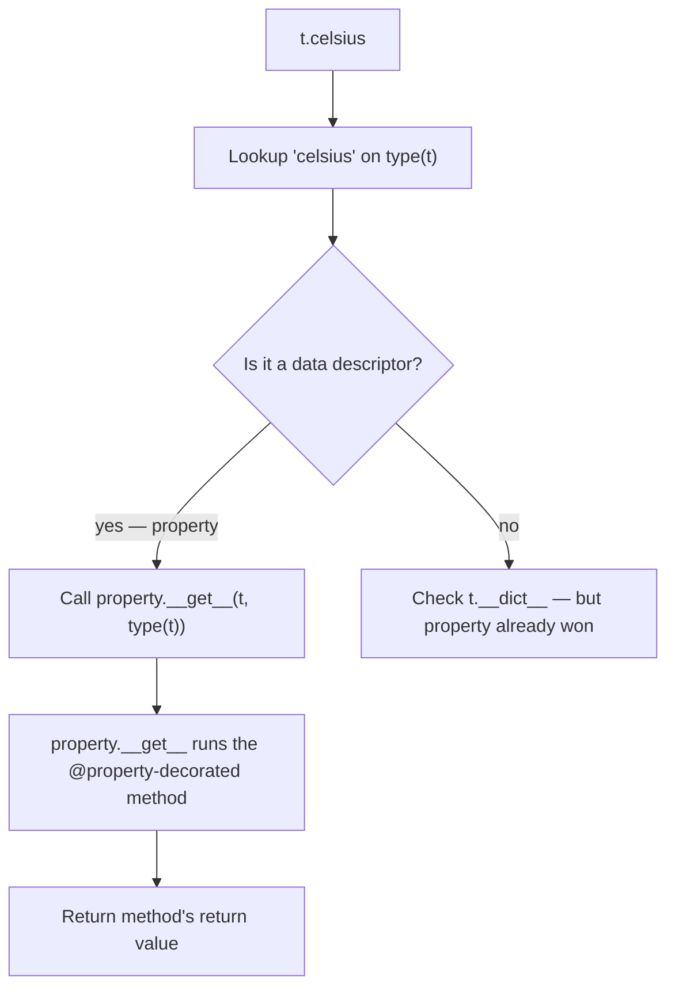

# 5. Encapsulation and Properties

## Why This Matters

Encapsulation — the third pillar of OOP after inheritance and polymorphism — is the practice of hiding an object's internal state behind a well-defined interface. In C++ or Java this is enforced by `private`, `protected`, and `public` access modifiers. Python famously has **no such keywords**. Instead, Python offers:

- **Conventions** (`_single_underscore`) — "internal, please don't touch."
- **Name mangling** (`__double_underscore`) — collision avoidance in subclasses.
- **Properties** (`@property`, `@x.setter`, `@x.deleter`) — controlled attribute access without changing the call site.
- **`functools.cached_property`** — lazily-computed, memoised properties.

This combination is more flexible than C++'s access modifiers in many ways: you can change a plain attribute into a property without changing any call site, you can make attributes read-only, you can validate on set, you can cache expensive computations. But it also places more responsibility on the programmer to use conventions consistently.

This note covers all four mechanisms, the descriptor protocol underneath `@property` (briefly — full treatment in Chapter 17), and the patterns that make properties productive rather than problematic.

---

## Background

In C++:

```cpp
class Temperature {
private:
    double celsius_;
public:
    double get_celsius() const { return celsius_; }
    void set_celsius(double c) {
        if (c < -273.15) throw std::invalid_argument("below absolute zero");
        celsius_ = c;
    }
};
```

The class exposes `get_celsius` / `set_celsius` and hides `celsius_` as private. Callers must use the getters and setters.

In Python, the equivalent starts simpler:

```python
class Temperature:
    def __init__(self, celsius):
        self.celsius = celsius   # plain attribute, no validation
```

Callers write `t.celsius` and `t.celsius = 100`. Later, when you decide to validate, you don't change the call site — you turn `celsius` into a property:

```python
class Temperature:
    def __init__(self, celsius):
        self.celsius = celsius   # goes through the setter

    @property
    def celsius(self):
        return self._celsius

    @celsius.setter
    def celsius(self, value):
        if value < -273.15:
            raise ValueError("below absolute zero")
        self._celsius = value
```

Existing code (`t.celsius`, `t.celsius = 100`) keeps working unchanged. **This is the key Python advantage**: you start with a plain attribute and "promote" it to a property when you need validation, caching, or computed access. In C++/Java, you must start with getters/setters from day one to be future-proof.

This is sometimes called the **"uniform access principle"** — callers don't (and shouldn't) care whether `t.celsius` is a stored attribute or a method call.

---

## No True Private in Python

Python's philosophy is **"we're all consenting adults here."** The language doesn't enforce privacy; it provides conventions and mild obfuscation, and trusts you to respect them.

### `_single_underscore` — "internal" by convention

```python
class Server:
    def __init__(self, host):
        self._host = host    # convention: internal

    def _connect(self):       # convention: internal method
        ...
```

- Single underscore says: "I consider this internal. Don't touch it from outside the class (or its tests)."
- It is **not** access-controlled. Anyone can still write `server._host`.
- Tools like `from module import *` won't import names starting with `_` (unless `__all__` is defined).
- IDEs and linters may warn you about accessing `_` attributes from outside.
- It's the right level of "privacy" for 90% of internal state.

### `__double_underscore` — name mangling

```python
class Server:
    def __init__(self, host):
        self.__secret = "hunter2"

s = Server("example.com")
print(s.__secret)              # AttributeError
print(s._Server__secret)       # 'hunter2' — accessible via mangled name
print(s.__dict__)              # {'_Server__secret': 'hunter2'}
```

Inside the class body, Python rewrites `__name` to `_ClassName__name`. Outside the class (or in a subclass), `__name` doesn't exist; you must use the mangled name.

The point of name mangling is **collision avoidance in subclasses**, not access control:

```python
class Base:
    def __init__(self):
        self.__value = 1   # becomes _Base__value

class Derived(Base):
    def __init__(self):
        super().__init__()
        self.__value = 2   # becomes _Derived__value — no collision!

d = Derived()
print(d.__dict__)   # {'_Base__value': 1, '_Derived__value': 2}
```

Without mangling, `Derived.__init__` would overwrite `Base.__init__`'s `__value`. With mangling, each class gets its own private namespace.

> [!warning] Don't use `__` for privacy
> Many Python newcomers use `__` thinking it makes attributes "really private." It doesn't — anyone can access `_ClassName__attr`. And it makes your code harder to test and debug. Use `_` for "internal" and reserve `__` for genuine subclass-collision cases (which are rare). Python's own style guide ([PEP 8](https://peps.python.org/pep-0008/)) says: "Use one leading underscore only for non-public methods and instance variables."

### `__dunder__` — magic names

Names with **two leading and two trailing** underscores (`__init__`, `__repr__`, `__len__`) are **not** mangled. They're reserved for Python's magic methods — see [[6. Magic Methods]]. The trailing underscores signal "this is a magic name, leave it alone."

---

## The `@property` Decorator

`@property` turns a method into a **computed attribute**. The method is called whenever the attribute is accessed (read).

```python
class Circle:
    def __init__(self, radius):
        self.radius = radius

    @property
    def area(self):
        return 3.14159 * self.radius ** 2

c = Circle(2)
print(c.area)   # 12.56636 — no parens!
c.area = 5      # AttributeError: can't set attribute (no setter)
```

`c.area` looks like an attribute access. Under the hood, Python calls `Circle.area.__get__(c, Circle)`, which invokes the decorated method.

### Why properties?

1. **Read-only computed attributes** — `area`, `perimeter`, `is_valid`.
2. **Validation on set** — `celsius = -300` raises.
3. **Backward compatibility** — change a plain attribute into a property without changing call sites.
4. **Encapsulation without boilerplate** — no `getX()`/`setX()` noise.

### Setter and deleter

```python
class Temperature:
    def __init__(self, celsius):
        self.celsius = celsius   # goes through the setter

    @property
    def celsius(self):
        return self._celsius

    @celsius.setter
    def celsius(self, value):
        if value < -273.15:
            raise ValueError("below absolute zero")
        self._celsius = value

    @celsius.deleter
    def celsius(self):
        print("deleting celsius")
        del self._celsius

t = Temperature(20)
print(t.celsius)       # 20
t.celsius = 100        # setter runs
print(t.celsius)       # 100
t.celsius = -300       # ValueError
del t.celsius          # deleting celsius
t.celsius              # AttributeError: _celsius is gone
```

The pattern:

1. Define a method `celsius` and decorate it with `@property`.
2. Define another method, also named `celsius`, decorated with `@celsius.setter`. This becomes the setter.
3. Optionally define `@celsius.deleter`.

The three methods share the same name. The `@property` decorator creates a `property` object, and `.setter` / `.deleter` create copies with the additional accessor added.

### Read-only properties

If you only define `@property` (no setter), the property is read-only. Attempts to assign raise `AttributeError: can't set attribute`.

```python
class Point:
    def __init__(self, x, y):
        self._x = x
        self._y = y

    @property
    def x(self):
        return self._x

    @property
    def y(self):
        return self._y

p = Point(1, 2)
p.x = 5   # AttributeError
```

This is how you make a "public read, private write" attribute in Python.

---

## How Properties Actually Work: The Descriptor Protocol

`property` is a **descriptor** — an object that defines `__get__`, `__set__`, and/or `__delete__`. When you access an attribute that's a descriptor on the class, Python calls the descriptor's methods instead of returning the raw value.

```python
# Equivalent to the @property version above:
class Temperature:
    def __init__(self, celsius):
        self.celsius = celsius

    def _get_celsius(self):
        return self._celsius

    def _set_celsius(self, value):
        if value < -273.15:
            raise ValueError("below absolute zero")
        self._celsius = value

    celsius = property(_get_celsius, _set_celsius)

    del _get_celsius, _set_celsius   # cleanup namespace
```

`property(fget, fset, fdel, doc)` returns a descriptor object. The `@property` / `@x.setter` syntax is just sugar on top.

The full descriptor protocol:

- `__get__(self, instance, owner)` — called on `instance.attr` or `Class.attr`.
- `__set__(self, instance, value)` — called on `instance.attr = value`.
- `__delete__(self, instance)` — called on `del instance.attr`.
- `__set_name__(self, owner, name)` — called when the descriptor is assigned to a class attribute (Python 3.6+).

Descriptors that define `__set__` are **data descriptors** — they take priority over instance `__dict__`. Descriptors that only define `__get__` are **non-data descriptors** — instance `__dict__` wins. This is why `@property` (a data descriptor) always wins, but plain methods (non-data descriptors) can be shadowed by instance attributes. See [[2. Attributes and Methods]] and [[5. Descriptors Deep Dive]] (Chapter 18).

### Property access flow



When you write `t.celsius`, Python finds `celsius` on the class (it's a `property`, which is a data descriptor), and calls its `__get__`. The instance `__dict__` is bypassed — that's why properties always win.

When you write `t.celsius = 100`, Python finds `celsius` on the class, sees it's a data descriptor with `__set__`, and calls `property.__set__(t, 100)`, which runs your setter.

---

## Inheritance and Properties

Properties are inherited like any other class attribute. Subclasses can override them — but you have to override the entire property, not just the getter or setter:

```python
class Base:
    @property
    def value(self):
        return 1

class Bad(Base):
    @value.setter          # ← ERROR — `value` doesn't exist yet in Bad's namespace
    def value(self, v):
        ...

class Good(Base):
    @Base.value.setter     # ← correct: extend the parent's property
    def value(self, v):
        print("setting to", v)
```

The fix: use `@Base.value.setter` to get the parent's property and add a setter. See [[5. Descriptors Deep Dive]] for more on this pattern.

A subclass can also completely replace the property:

```python
class ReadOnly(Base):
    @property
    def value(self):
        return "read only"
```

This is a brand-new property, not an extension of `Base.value`.

---

## `functools.cached_property`

`functools.cached_property` (Python 3.8+) is like `@property`, but the result is computed once and cached on the instance:

```python
from functools import cached_property

class DataSet:
    def __init__(self, numbers):
        self.numbers = list(numbers)

    @cached_property
    def stats(self):
        print("computing stats...")
        n = len(self.numbers)
        mean = sum(self.numbers) / n
        variance = sum((x - mean) ** 2 for x in self.numbers) / n
        return {"count": n, "mean": mean, "variance": variance}

ds = DataSet([1, 2, 3, 4, 5])
print(ds.stats)   # computing stats... {'count': 5, 'mean': 3.0, 'variance': 2.0}
print(ds.stats)   # {'count': 5, 'mean': 3.0, 'variance': 2.0} — no recomputation
```

The first access computes and stores the value in `ds.__dict__['stats']`. Subsequent accesses find it in the instance `__dict__` and skip the descriptor entirely.

### `cached_property` vs `property` + `lru_cache`

```python
# Option A: cached_property (preferred for instance methods)
class A:
    @cached_property
    def expensive(self):
        ...

# Option B: property + manual caching
class B:
    @property
    def expensive(self):
        if not hasattr(self, '_expensive'):
            self._expensive = compute()
        return self._expensive
```

`cached_property` is cleaner and handles the "store on instance" mechanic for you.

### Cache invalidation

To invalidate a cached property, `del` it:

```python
ds = DataSet([1, 2, 3])
print(ds.stats)         # computes
del ds.stats            # invalidates
print(ds.stats)         # recomputes
```

### Limitations

- `cached_property` doesn't work if the class has a custom `__dict__` that doesn't support item assignment (rare).
- It does **not** thread-safely cache — concurrent first-access could compute twice. If you need thread safety, use a lock or `@property` + `functools.lru_cache(maxsize=None)` on a method.
- It's **not** for mutable state — if `numbers` changes, `stats` is stale. You must invalidate manually.

---

## Property Patterns

### 1. Validated attribute

```python
class Age:
    def __init__(self, value):
        self.value = value

    @property
    def value(self):
        return self._value

    @value.setter
    def value(self, v):
        if not isinstance(v, int):
            raise TypeError("age must be int")
        if not 0 <= v <= 150:
            raise ValueError("age out of range")
        self._value = v
```

### 2. Read-only computed attribute

```python
class Rectangle:
    def __init__(self, w, h):
        self.w = w
        self.h = h

    @property
    def area(self):
        return self.w * self.h

    @property
    def perimeter(self):
        return 2 * (self.w + self.h)
```

### 3. Lazy / cached attribute

```python
from functools import cached_property
import json

class Config:
    def __init__(self, path):
        self.path = path

    @cached_property
    def data(self):
        with open(self.path) as f:
            return json.load(f)
```

### 4. Derived attributes that stay in sync

```python
class Temperature:
    def __init__(self, celsius=0):
        self.celsius = celsius

    @property
    def celsius(self):
        return self._celsius

    @celsius.setter
    def celsius(self, v):
        self._celsius = v

    @property
    def fahrenheit(self):
        return self._celsius * 9 / 5 + 32

    @fahrenheit.setter
    def fahrenheit(self, f):
        self._celsius = (f - 32) * 5 / 9

t = Temperature(0)
print(t.fahrenheit)   # 32.0
t.fahrenheit = 212
print(t.celsius)      # 100.0
```

### 5. Backing field with controlled access

```python
class Account:
    def __init__(self, balance=0):
        self._balance = balance

    @property
    def balance(self):
        return self._balance

    def deposit(self, amount):
        if amount <= 0:
            raise ValueError("must be positive")
        self._balance += amount

    def withdraw(self, amount):
        if amount <= 0:
            raise ValueError("must be positive")
        if amount > self._balance:
            raise ValueError("insufficient funds")
        self._balance -= amount
```

`balance` is read-only via property; mutations go through `deposit`/`withdraw` which enforce business rules. This is the proper Python equivalent of a C++ class with `get_balance()` public and `balance_` private.

---

## A Worked Example: A `Money` Class

```python
from decimal import Decimal
from functools import cached_property


class Money:
    """An immutable amount of money in a specific currency."""

    __slots__ = ("_amount", "_currency", "__dict__")   # allow cached_property's __dict__

    def __init__(self, amount, currency="USD"):
        # Use the property setters for validation
        self.amount = amount
        self.currency = currency

    @property
    def amount(self):
        return self._amount

    @amount.setter
    def amount(self, value):
        if not isinstance(value, (int, Decimal)):
            value = Decimal(str(value))
        if value < 0:
            raise ValueError("amount must be non-negative")
        self._amount = value

    @property
    def currency(self):
        return self._currency

    @currency.setter
    def currency(self, value):
        if not isinstance(value, str) or len(value) != 3:
            raise ValueError("currency must be a 3-letter code")
        self._currency = value.upper()

    @cached_property
    def formatted(self):
        return f"{self._currency} {self._amount:.2f}"

    def __add__(self, other):
        if not isinstance(other, Money):
            return NotImplemented
        if self.currency != other.currency:
            raise ValueError("currency mismatch")
        return Money(self.amount + other.amount, self.currency)

    def __repr__(self):
        return f"Money({self._amount!r}, {self._currency!r})"

m = Money(100)
print(m.formatted)   # USD 100.00
print(m + Money(50)) # Money(Decimal('150'), 'USD')
Money(-5)             # ValueError
Money(100, "us")      # ValueError
```

Things to notice:

- `amount` and `currency` use properties with validation.
- `formatted` is a `cached_property` — computed once, reused.
- `__add__` makes `+` work — see [[6. Magic Methods]].
- `__slots__` includes `"__dict__"` because `cached_property` needs to store its result on the instance.
- The class is essentially immutable from the outside: validation prevents bad state, and there's no public setter that bypasses the rules.

---

## Common Pitfalls

### 1. Using `__` for privacy

```python
class Bad:
    def __init__(self):
        self.__password = "1234"   # mangled to _Bad__password

b = Bad()
b.__password = "hacked"   # creates a NEW attribute, doesn't change _Bad__password!
print(b.__dict__)         # {'_Bad__password': '1234', '__password': 'hacked'}
print(b._Bad__password)   # '1234' — original is intact, but accessible
```

`__` doesn't make things private. Use `_`.

### 2. Infinite recursion in property setter

```python
class Bad:
    @property
    def x(self):
        return self.x   # ← calls itself recursively!

    @x.setter
    def x(self, v):
        self.x = v      # ← calls the setter recursively!

Bad().x   # RecursionError
```

You must store the value under a different name — conventionally `_x`. The property is `x`, the backing field is `_x`.

### 3. Forgetting `@property` on the getter

```python
class Bad:
    def x(self):
        return 5

b = Bad()
print(b.x)    # <bound method...> — not 5!
print(b.x())  # 5 — but you forgot the parens
```

Always decorate the getter with `@property` if you want attribute-style access.

### 4. Overriding only part of an inherited property

```python
class Base:
    @property
    def value(self):
        return 1
    @value.setter
    def value(self, v):
        self._v = v

class Sub(Base):
    @property                    # ← completely replaces Base.value
    def value(self):
        return 2
    # setter is GONE — Sub().value = 5 will raise

Sub().value = 5   # AttributeError
```

To keep the setter, use `@Base.value.setter`:

```python
class Sub(Base):
    @Base.value.getter
    def value(self):
        return 2
```

### 5. `cached_property` and mutable state

```python
class Bad:
    def __init__(self, n): self.n = n
    @cached_property
    def doubled(self): return self.n * 2

b = Bad(5)
print(b.doubled)   # 10 — cached
b.n = 100
print(b.doubled)   # 10 — still cached, stale!
```

If the underlying data changes, you must invalidate: `del b.doubled`.

### 6. Property on a class with `__slots__` and no `__dict__`

```python
class Bad:
    __slots__ = ("x",)
    @cached_property
    def y(self):
        return 42

Bad().y   # AttributeError: 'Bad' object has no attribute '__dict__'
                                   # and 'y' is not a slot
```

`cached_property` needs `__dict__` to store the cached value. Either include `"__dict__"` in `__slots__`, or use a different caching strategy.

### 7. Property performance in hot loops

```python
class Sum:
    def __init__(self, items):
        self.items = items
    @property
    def total(self):
        return sum(self.items)

s = Sum([1, 2, 3])
result = 0
for _ in range(1_000_000):
    result += s.total   # property access every iteration
```

Each `s.total` calls the property function. Cache it in a local before the loop:

```python
total = s.total
for _ in range(1_000_000):
    result += total
```

Or use `cached_property` if the value doesn't change.

### 8. Trying to make a truly immutable class with just `@property`

```python
class Bad:
    def __init__(self, x):
        self._x = x
    @property
    def x(self):
        return self._x

b = Bad(5)
b._x = 100   # bypasses the property — _x is still accessible
print(b.x)   # 100 — mutated!
```

`@property` makes the **public** attribute read-only, but `_x` is still mutable. For true immutability, use `@dataclass(frozen=True)` or override `__setattr__` to raise. See [[4. Dataclasses]].

### 9. Property setter returning a value

```python
class Bad:
    @property
    def x(self):
        return self._x
    @x.setter
    def x(self, v):
        self._x = v
        return v   # ignored — setters don't return to the caller

Bad().x = 5   # the assignment expression evaluates to 5, but setter's return is discarded
```

Setters should return `None` (implicitly).

### 10. Side effects in getters

```python
class Bad:
    @property
    def count(self):
        self._count += 1   # ← getter mutates state!
        return self._count

b = Bad()
b._count = 0
print(b.count)   # 1
print(b.count)   # 2 — different every call!
```

Getters should be idempotent and side-effect-free (or at least, the side effects should be invisible — caching is OK, mutation is not). Callers expect `b.count` to give the same answer twice.

---

## Tips and Tricks

- **Start with plain attributes, promote to properties only when needed.** This keeps your code simple until you have a reason for complexity.
- **Use `_single_underscore` for internal attributes** — that's the convention.
- **Reserve `__double_underscore` for genuine subclass collision avoidance** — rare.
- **`@property` for read-only**, `@x.setter` for validated writes, `@x.deleter` rarely.
- **`functools.cached_property` for expensive computations** that don't change.
- **Cache results in locals in hot loops** — property access isn't free.
- **Keep getters pure** — no side effects, no surprises.
- **Use `@dataclass(frozen=True)` for true immutability** — better than rolling your own.
- **Override `__setattr__` only as a last resort** — it's heavy-handed and easy to get wrong (infinite recursion via `self.x = ...`).
- **`__slots__` + `cached_property`** requires including `"__dict__"` in slots.
- **Subclassing properties** — use `@Parent.property.getter` / `.setter` to extend, or define a new property to replace.
- **Document the property's contract** — is it expensive? cached? side-effecting? Read-only?
- **Avoid `getX`/`setX` Java-style methods** — that's not Pythonic. Use `@property`.
- **For computed attributes with parameters**, use a regular method: `obj.compute_stats(window=10)`. Properties take no arguments (other than the setter value).
- **`@property` works on classes too** via metaclasses — see [[4. Metaclasses]].

---

## Active Recall

1. Why does Python have no `private` keyword? What's the philosophy?
2. What's the difference between `_name` and `__name`? When would you use each?
3. What does `__value` become inside class `Foo`? Why does Python do this?
4. Write a `Temperature` class with a `celsius` property that validates against absolute zero.
5. Show that `@property` (read-only) cannot be shadowed by an instance attribute. Why?
6. What's the descriptor protocol? Which methods does `property` define?
7. Convert this plain-attribute class to use a validated property without changing call sites:
   ```python
   class Money:
       def __init__(self, amount):
           self.amount = amount
   ```
8. How do you make a property **read-only**? How do you make it **writable but validated**?
9. What does `functools.cached_property` do? When would you use it instead of `@property`?
10. How do you invalidate a `cached_property`?
11. Why does `cached_property` not work with `__slots__` unless you include `"__dict__"`?
12. Why does this code recurse? Fix it.
    ```python
    class A:
        @property
        def x(self): return self.x
    ```
13. Show how a subclass can **extend** a parent's property (add a setter) without losing the parent's getter.
14. Why is "we're all consenting adults here" the Python encapsulation philosophy?
15. When should you use `@dataclass(frozen=True)` instead of a hand-rolled `@property`-based immutable class?

---

## Next Steps

- Read [[6. Magic Methods]] — `__getattr__`, `__getattribute__`, `__setattr__`, `__delattr__` (the lower-level hooks properties are built on).
- Read [[2. Attributes and Methods]] — attribute lookup order, which determines when properties win.
- Read [[7. Class Methods and Static Methods]] — `@classmethod` and `@staticmethod`, the other common decorators.
- See [[5. Descriptors Deep Dive]] (Chapter 18) — write your own descriptor classes (e.g., typed attributes, validated fields).
- See [[1. Descriptors]] (Chapter 17) — the descriptor protocol in depth, including how `property`, `classmethod`, `staticmethod`, and ordinary methods are all descriptors.
- See [[4. Dataclasses]] (Chapter 18) — `@dataclass` with `field()`, frozen instances, and slots.
- See [[2. getattr, setattr, hasattr]] (Chapter 17) — dynamic attribute manipulation.
