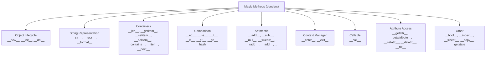

# 6. Magic Methods

## Why This Matters

Magic methods — also called **dunder** methods (double underscore) — are the hooks Python uses to integrate your classes with built-in syntax and functions. Without them, your class can hold data but can't participate in `len()`, `+`, `==`, `in`, `for`, `with`, `print`, indexing, slicing, or any of the other operations that make Python expressive.

When you write `len(my_obj)`, Python calls `my_obj.__len__()`. When you write `a + b`, Python calls `a.__add__(b)` (or `b.__radd__(a)` if `a` doesn't know how). When you write `for x in obj`, Python calls `obj.__iter__()` and `__next__()` on the result. When you write `with obj:`, Python calls `__enter__` and `__exit__`. Every operator and many built-in functions are *despatched* to a dunder method on your class.

This note covers the **full catalogue**: object lifecycle (`__init__`, `__new__`, `__del__`), string representation (`__str__`, `__repr__`), containers (`__len__`, `__getitem__`, `__setitem__`, `__delitem__`, `__contains__`), iteration (`__iter__`, `__next__`), comparison (`__eq__`, `__hash__`, `__lt__`, `__gt__`, etc.), arithmetic (`__add__`, `__sub__`, `__mul__`, etc.), context managers (`__enter__`, `__exit__`), callable objects (`__call__`), and attribute access hooks (`__getattr__`, `__setattr__`, `__getattribute__`).

By the end you'll be able to make a class behave like a list, a dict, a function, a context manager, a number, or all of the above — depending on which dunder methods you implement.

---

## Background

Every object in Python has a type, and every type has a set of "special methods" used by the language's syntax and built-ins. The names are wrapped in double underscores to avoid collision with your own attribute names. Python has roughly 100 dunder methods — this note covers the most important 40 or so.

The fundamental rule: **dunder methods are looked up on the type, not the instance.**

```python
class A:
    def __len__(self):
        return 42

a = A()
print(len(a))   # 42 — calls type(a).__len__(a), not a.__len__

a.__len__ = lambda: 99   # set instance attribute
print(a.__len__())       # 99 — calls the instance attr directly
print(len(a))            # 42 — STILL 42! len() uses the type's method
```

This is why monkey-patching dunders on an instance doesn't change how `len()` behaves — `len()` looks up `__len__` on `type(a)`, not `a`. To change behaviour, you must change the class (or use a metaclass — Chapter 17).

> [!warning] Don't invent your own `__dunder__` names
> Python reserves all `__*__` names. If you define `__frobnicate__` hoping Python will call it, nothing happens (today). A future Python release might add a `__frobnicate__` magic method that breaks your code. Stick to `_single_underscore` for your own internal names.

---

## Categories of Magic Methods



We'll walk through each category.

---

## 1. Object Lifecycle

### `__new__(cls, *args, **kwargs)` — the constructor

`__new__` creates the instance. It's a `@staticmethod` (technically; you don't decorate it) that takes the class as its first argument and returns a new instance of that class.

```python
class Singleton:
    _instance = None

    def __new__(cls, *args, **kwargs):
        if cls._instance is None:
            cls._instance = super().__new__(cls)
        return cls._instance

a = Singleton()
b = Singleton()
print(a is b)   # True
```

Override `__new__` when you need to control instance *creation*:

- Singletons and interned objects.
- Subclasses of immutable types (`str`, `int`, `tuple`, `frozenset`) — the value is set at creation time, before `__init__` runs.
- Object pools, flyweights, caches.

### `__init__(self, *args, **kwargs)` — the initializer

Runs after `__new__` returns. Populates the instance with attributes. Returns `None`. See [[1. Classes and Objects]].

### `__del__(self)` — the finalizer

Called when an instance is about to be garbage-collected. **Not a destructor** in the C++ sense — timing is non-deterministic, and `__del__` may not be called at all if the program exits or there are reference cycles (in older Pythons; modern CPython's GC handles cycles).

```python
class TempFile:
    def __init__(self, path):
        self.path = path
        self.f = open(path, "w")

    def __del__(self):
        try:
            self.f.close()
        except Exception:
            pass   # swallow — finalizers must not raise
```

> [!warning] Don't rely on `__del__` for cleanup
> Use a context manager (`with`) instead. `__del__` is a safety net, not a primary mechanism. Exceptions in `__del__` are printed to stderr but not raised. Circular references can delay or prevent `__del__`. See [[4. Context Managers]].

---

## 2. String Representation

### `__str__(self)` — human-readable

Used by `str(obj)`, `print(obj)`, f-strings (`f"{obj}"`). Aim for a friendly, user-facing string.

```python
class Point:
    def __init__(self, x, y):
        self.x, self.y = x, y
    def __str__(self):
        return f"({self.x}, {self.y})"

print(Point(1, 2))   # (1, 2)
```

### `__repr__(self)` — developer-readable

Used by `repr(obj)`, the interactive REPL, debugger displays, and `f"{obj!r}"`. Aim for a string that, if possible, could be `eval`'d to recreate the object.

```python
class Point:
    def __init__(self, x, y):
        self.x, self.y = x, y
    def __repr__(self):
        return f"Point({self.x!r}, {self.y!r})"
    def __str__(self):
        return f"({self.x}, {self.y})"

p = Point(1, 2)
print(repr(p))   # Point(1, 2)
print(str(p))    # (1, 2)
print(p)         # (1, 2) — __str__ wins
print(f"{p!r}")  # Point(1, 2)
```

> [!tip] Always define `__repr__`
> If you define only one, define `__repr__`. When `__str__` is missing, Python falls back to `__repr__`. So `__repr__` is the safety net for any string display. The reverse isn't true — `__str__` alone leaves `repr()` useless.

### `__format__(self, spec)` — f-string and `format()`

```python
class Color:
    def __init__(self, r, g, b):
        self.r, self.g, self.b = r, g, b
    def __format__(self, spec):
        if spec == "hex":
            return f"#{self.r:02x}{self.g:02x}{self.b:02x}"
        elif spec == "rgb":
            return f"rgb({self.r}, {self.g}, {self.b})"
        else:
            return str((self.r, self.g, self.b))

c = Color(255, 128, 0)
print(f"{c:hex}")   # #ff8000
print(f"{c:rgb}")   # rgb(255, 128, 0)
print(f"{c}")       # (255, 128, 0)
```

---

## 3. Containers

Implement these to make your class behave like a list, dict, or set.

### `__len__(self)`

```python
class Stack:
    def __init__(self):
        self._items = []
    def push(self, x): self._items.append(x)
    def pop(self): return self._items.pop()
    def __len__(self):
        return len(self._items)

s = Stack()
s.push(1); s.push(2)
print(len(s))   # 2
```

`__len__` is also used by `bool(obj)` — if `__bool__` is not defined, an object is falsy when `__len__` returns 0.

### `__getitem__(self, key)` — indexing and slicing

```python
class SparseArray:
    def __init__(self):
        self._data = {}
    def __getitem__(self, i):
        if isinstance(i, slice):
            return [self._data.get(j, 0) for j in range(*i.indices(len(self)))]
        return self._data.get(i, 0)
    def __setitem__(self, i, v):
        self._data[i] = v
    def __len__(self):
        return max(self._data, default=-1) + 1

a = SparseArray()
a[5] = 10
print(a[5])    # 10
print(a[100])  # 0
print(a[0:10]) # [0, 0, 0, 0, 0, 10, 0, 0, 0, 0]
```

### `__setitem__`, `__delitem__`

```python
obj[key] = value   # calls __setitem__
del obj[key]       # calls __delitem__
```

### `__contains__(self, item)` — the `in` operator

```python
class SortedList:
    def __init__(self, items):
        self._items = sorted(items)
    def __contains__(self, item):
        # binary search — O(log n) instead of O(n)
        import bisect
        i = bisect.bisect_left(self._items, item)
        return i < len(self._items) and self._items[i] == item

sl = SortedList([1, 3, 5, 7, 9])
print(5 in sl)   # True — uses __contains__
print(6 in sl)   # False
```

If `__contains__` is missing, Python falls back to iterating with `__iter__` (or `__getitem__`).

### `__iter__` and `__next__` — iteration

Two ways to make a class iterable:

**Iterator protocol** — `__iter__` returns `self`, `__next__` returns the next value or raises `StopIteration`:

```python
class Countdown:
    def __init__(self, start):
        self.n = start
    def __iter__(self):
        return self
    def __next__(self):
        if self.n <= 0:
            raise StopIteration
        self.n -= 1
        return self.n + 1

for x in Countdown(3):
    print(x)   # 3 2 1
```

**Iterable protocol** — `__iter__` returns a fresh iterator (often a generator):

```python
class Countdown:
    def __init__(self, start):
        self.start = start
    def __iter__(self):
        n = self.start
        while n > 0:
            yield n
            n -= 1
```

The iterable form is restartable — each `for` loop gets a fresh iterator. The iterator form is exhausted after one pass.

### Container magic summary

| Operation | Dunder |
|-----------|--------|
| `len(obj)` | `__len__` |
| `obj[i]`, `obj[i:j]` | `__getitem__` |
| `obj[i] = v` | `__setitem__` |
| `del obj[i]` | `__delitem__` |
| `x in obj` | `__contains__` (or `__iter__` fallback) |
| `for x in obj` | `__iter__` (or `__getitem__` with index fallback) |
| `reversed(obj)` | `__reversed__` |
| `obj.keys()`, `obj.values()`, `obj.items()` | for Mapping protocol |

> [!tip] Subclass `collections.abc`
> Instead of remembering which methods make a "sequence" or "mapping," subclass `collections.abc.Sequence` / `Mapping` / `Set` / `Iterable`. They give you free implementations of mixin methods (like `__contains__`, `__iter__`, `index`, `count`) once you implement a few core methods. See [[4. collections Module]] (Chapter 9).

---

## 4. Comparison

### `__eq__` and `__ne__`

```python
class Point:
    def __init__(self, x, y):
        self.x, self.y = x, y
    def __eq__(self, other):
        if not isinstance(other, Point):
            return NotImplemented
        return self.x == other.x and self.y == other.y

print(Point(1, 2) == Point(1, 2))   # True
print(Point(1, 2) == "hello")       # False — falls back to identity
```

Returning `NotImplemented` (not `False`) tells Python "I don't know how to compare with this type" — it then tries the other object's `__eq__` (the reflected operation) before falling back to `is`. This is the correct pattern for cross-type comparison.

`__ne__` defaults to `not __eq__` if you don't define it. Define it explicitly only if you need different behaviour.

### `__hash__`

If a class defines `__eq__` and you want instances to be usable as dict keys or set elements, you must also define `__hash__`. The rule: **equal objects must have equal hashes.**

```python
class Point:
    def __init__(self, x, y):
        self.x, self.y = x, y
    def __eq__(self, other):
        if not isinstance(other, Point):
            return NotImplemented
        return self.x == other.x and self.y == other.y
    def __hash__(self):
        return hash((self.x, self.y))

print(Point(1, 2) in {Point(1, 2)})   # True
```

> [!warning] Defining `__eq__` without `__hash__` makes the class unhashable
> Python automatically sets `__hash__ = None` when you define `__eq__`. This means instances can't be used as dict keys or in sets. If you want hashability, define `__hash__` explicitly.

### Rich comparison methods

```python
__lt__(self, other)   # <
__le__(self, other)   # <=
__gt__(self, other)   # >
__ge__(self, other)   # >=
__eq__(self, other)   # ==
__ne__(self, other)   # !=
```

Python does NOT automatically derive `>` from `<` — but `functools.total_ordering` does:

```python
from functools import total_ordering

@total_ordering
class Version:
    def __init__(self, major, minor):
        self.major, self.minor = major, minor
    def __eq__(self, other):
        return (self.major, self.minor) == (other.major, other.minor)
    def __lt__(self, other):
        return (self.major, self.minor) < (other.major, other.minor)

print(Version(1, 2) < Version(1, 3))   # True
print(Version(1, 2) >= Version(1, 1))  # True — derived from __lt__ and __eq__
```

Define `__eq__` and one of `__lt__` / `__le__` / `__gt__` / `__ge__`, decorate with `@total_ordering`, get the rest for free.

---

## 5. Arithmetic

Binary operators dispatch to dunder methods on the left operand. If that returns `NotImplemented`, Python tries the reflected method on the right operand.

| Operator | Method | Reflected |
|----------|--------|-----------|
| `a + b` | `__add__` | `__radd__` |
| `a - b` | `__sub__` | `__rsub__` |
| `a * b` | `__mul__` | `__rmul__` |
| `a / b` | `__truediv__` | `__rtruediv__` |
| `a // b` | `__floordiv__` | `__rfloordiv__` |
| `a % b` | `__mod__` | `__rmod__` |
| `a ** b` | `__pow__` | `__rpow__` |
| `a @ b` | `__matmul__` | `__rmatmul__` |
| `a & b` | `__and__` | `__rand__` |
| `a | b` | `__or__` | `__ror__` |
| `a ^ b` | `__xor__` | `__rxor__` |
| `a << b` | `__lshift__` | `__rlshift__` |
| `a >> b` | `__rshift__` | `__rrshift__` |

In-place operators (`+=`, `-=`, etc.) dispatch to `__iadd__`, `__isub__`, etc. If those aren't defined, Python falls back to `__add__` and reassignment.

### Worked example: a `Vector` class

```python
import math

class Vector:
    def __init__(self, x, y):
        self.x, self.y = x, y

    def __repr__(self):
        return f"Vector({self.x!r}, {self.y!r})"

    def __eq__(self, other):
        if not isinstance(other, Vector):
            return NotImplemented
        return self.x == other.x and self.y == other.y

    def __hash__(self):
        return hash((self.x, self.y))

    def __add__(self, other):
        if isinstance(other, Vector):
            return Vector(self.x + other.x, self.y + other.y)
        return NotImplemented

    def __sub__(self, other):
        if isinstance(other, Vector):
            return Vector(self.x - other.x, self.y - other.y)
        return NotImplemented

    def __mul__(self, scalar):
        if isinstance(scalar, (int, float)):
            return Vector(self.x * scalar, self.y * scalar)
        return NotImplemented

    __rmul__ = __mul__   # support 3 * v as well as v * 3

    def __abs__(self):
        return math.hypot(self.x, self.y)

    def __bool__(self):
        return bool(abs(self))

    def __neg__(self):
        return Vector(-self.x, -self.y)

v = Vector(3, 4)
print(v + Vector(1, 1))   # Vector(3, 5)
print(2 * v)              # Vector(6, 8)  — uses __rmul__
print(abs(v))             # 5.0
print(-v)                 # Vector(-3, -4)
print(bool(Vector(0, 0))) # False
```

Key patterns:

- **Return `NotImplemented`** for unknown types — gives the other operand a chance.
- **`__rmul__ = __mul__`** for commutative operations — short, idiomatic.
- **`__abs__`, `__neg__`, `__bool__`** are unary operators.

### Unary operators

```python
-a        # __neg__
+a        # __pos__
~a        # __invert__
abs(a)    # __abs__
round(a)  # __round__
```

---

## 6. Context Managers

```python
class Timer:
    def __enter__(self):
        import time
        self.start = time.perf_counter()
        return self

    def __exit__(self, exc_type, exc_val, exc_tb):
        import time
        self.elapsed = time.perf_counter() - self.start
        print(f"elapsed: {self.elapsed:.3f}s")
        return False   # don't suppress exceptions

with Timer() as t:
    sum(range(1_000_000))
# elapsed: 0.025s
```

`__enter__` runs at the start of the `with` block. Its return value is bound to the `as` variable. `__exit__` runs at the end, whether or not an exception occurred. If `__exit__` returns `True`, any exception is suppressed.

`__exit__` receives the exception info if one was raised inside the `with` block — `exc_type`, `exc_val`, `exc_tb`. If no exception, all three are `None`.

> [!tip] Use `@contextmanager` for simple cases
> For one-off context managers, the decorator from `contextlib` is cleaner than defining a class. See [[4. Context Managers]] (Chapter 5).

See [[4. Context Managers]] for the full treatment.

---

## 7. Callable Objects

`__call__` makes an instance callable like a function:

```python
class Multiplier:
    def __init__(self, factor):
        self.factor = factor
    def __call__(self, x):
        return x * self.factor

double = Multiplier(2)
triple = Multiplier(3)

print(double(5))    # 10
print(triple(5))    # 15
print(callable(double))   # True
```

Use cases:

- **Stateful "functions"** — counters, accumulators, rate limiters.
- **Functors** — small objects with config that get called many times.
- **ML models** — `model(x)` instead of `model.predict(x)` (PyTorch convention).
- **Decorators as classes** — see [[7. Decorators]].
- **`functools.partial`** alternative when you need state beyond captured args.

```python
class Cache:
    def __init__(self):
        self._store = {}
    def __call__(self, func):
        def wrapper(*args):
            if args not in self._store:
                self._store[args] = func(*args)
            return self._store[args]
        return wrapper

@Cache()
def fib(n):
    return n if n < 2 else fib(n - 1) + fib(n - 2)

print(fib(100))   # fast — cached
```

---

## 8. Attribute Access Hooks

These let you customise what happens when an attribute is accessed, set, or deleted. Powerful but dangerous — easy to create infinite recursion.

### `__getattribute__(self, name)` — every attribute access

Called for **every** `obj.attr`. Even `self._x` inside other methods goes through `__getattribute__`. This makes it the most powerful but also the most dangerous hook.

```python
class LoggingProxy:
    def __init__(self, target):
        object.__setattr__(self, "_target", target)
    def __getattribute__(self, name):
        print(f"accessing {name}")
        target = object.__getattribute__(self, "_target")
        return getattr(target, name)

proxy = LoggingProxy([1, 2, 3])
proxy.append(4)   # accessing append
print(proxy)      # accessing __repr__ ... [1, 2, 3, 4]
```

To avoid infinite recursion inside `__getattribute__`, you must use `object.__getattribute__(self, ...)` to actually fetch attributes.

### `__getattr__(self, name)` — only on missing attributes

Called **only** when normal lookup fails. Much safer than `__getattribute__`:

```python
class DefaultDict:
    def __init__(self, default):
        self._default = default
        self._data = {}
    def __getattr__(self, name):
        if name.startswith("_"):
            raise AttributeError(name)
        return self._data.get(name, self._default)
    def __setattr__(self, name, value):
        if name.startswith("_"):
            object.__setattr__(self, name, value)
        else:
            self._data[name] = value

d = DefaultDict(0)
d.x = 5
print(d.x)        # 5
print(d.y)        # 0 — __getattr__ returned default
```

This is the Pythonic way to implement "dynamic" attributes or proxy objects.

### `__setattr__(self, name, value)` — every attribute set

Called for every `obj.attr = value`. To actually set, use `object.__setattr__(self, name, value)` or update `self.__dict__` directly.

```python
class Frozen:
    def __setattr__(self, name, value):
        raise AttributeError(f"{type(self).__name__} is frozen")

f = Frozen()
f.x = 1   # AttributeError
```

Beware infinite recursion: `self.x = value` inside `__setattr__` calls `__setattr__` again.

### `__delattr__(self, name)` — every `del obj.attr`

Similar to `__setattr__` but for deletion.

### `__dir__(self)` — controls `dir(obj)`

Returns the list of attribute names that `dir()` shows. Useful for dynamic objects that have "phantom" attributes created by `__getattr__`.

```python
class DynamicAttrs:
    _known = ("x", "y", "z")
    def __getattr__(self, name):
        if name in self._known:
            return f"value of {name}"
        raise AttributeError(name)
    def __dir__(self):
        return list(super().__dir__()) + list(self._known)

d = DynamicAttrs()
print(d.x)   # value of x
print("x" in dir(d))   # True
```

---

## 9. Other Useful Dunders

### `__bool__(self)`

```python
class Collection:
    def __init__(self, items):
        self.items = items
    def __bool__(self):
        return len(self.items) > 0

print(bool(Collection([])))    # False
print(bool(Collection([1])))   # True
```

If `__bool__` is missing, Python falls back to `__len__` (truthy if non-zero).

### `__index__(self)`

Used by `int()`, slicing, `bin()`, `hex()`, `oct()` when an integer is needed. Implement on classes that represent integer-like values (e.g., `enum.IntEnum`):

```python
class BitField:
    def __init__(self, value):
        self.value = value
    def __index__(self):
        return self.value

b = BitField(0b1010)
print(bin(b))    # 0b1010 — uses __index__
print([1,2,3,4][b])   # 3 — slicing uses __index__
```

### `__sizeof__(self)`

Used by `sys.getsizeof()`. Rare to override; useful for very low-level memory accounting.

### `__class__` and `__dict__`

Not methods you override, but attributes Python uses for introspection. `obj.__class__` is `type(obj)`. `obj.__dict__` is the instance's attribute namespace.

### `__slots__`

Not a method but a class attribute. Tells Python to use a fixed set of attributes via descriptors instead of `__dict__`. See [[2. Attributes and Methods]].

### `__copy__` and `__deepcopy__`

Used by `copy.copy()` and `copy.deepcopy()` to control how your object is copied. See [[4. Pickle and Serialization]] (Chapter 6).

### `__getstate__` / `__setstate__` / `__reduce__`

Used by `pickle`. See [[4. Pickle and Serialization]] (Chapter 6).

### `__enter__` / `__exit__`

Already covered. See [[4. Context Managers]] (Chapter 5).

### `__await__`

For awaitable objects. See [[5. async-await]] (Chapter 14).

---

## Putting It All Together: A `Matrix` Class

```python
class Matrix:
    """A small 2D matrix using lists of lists."""

    def __init__(self, data):
        self.data = [list(row) for row in data]
        self.rows = len(data)
        self.cols = len(data[0]) if data else 0

    # --- Container ---
    def __len__(self):
        return self.rows * self.cols

    def __getitem__(self, key):
        if isinstance(key, tuple):
            r, c = key
            return self.data[r][c]
        return self.data[key]   # whole row

    def __setitem__(self, key, value):
        r, c = key
        self.data[r][c] = value

    def __iter__(self):
        for row in self.data:
            yield from row

    # --- Representation ---
    def __repr__(self):
        return f"Matrix({self.data!r})"

    def __str__(self):
        return "\n".join(" ".join(f"{v:4}" for v in row) for row in self.data)

    # --- Comparison ---
    def __eq__(self, other):
        if not isinstance(other, Matrix):
            return NotImplemented
        return self.data == other.data

    def __hash__(self):
        return hash(tuple(tuple(row) for row in self.data))

    # --- Arithmetic ---
    def __add__(self, other):
        if not isinstance(other, Matrix) or (self.rows, self.cols) != (other.rows, other.cols):
            return NotImplemented
        return Matrix([[a + b for a, b in zip(r1, r2)]
                       for r1, r2 in zip(self.data, other.data)])

    def __mul__(self, other):
        if isinstance(other, Matrix):
            if self.cols != other.rows:
                return NotImplemented
            result = [[sum(a * b for a, b in zip(row, col))
                       for col in zip(*other.data)]
                      for row in self.data]
            return Matrix(result)
        if isinstance(other, (int, float)):
            return Matrix([[v * other for v in row] for row in self.data])
        return NotImplemented

    __rmul__ = __mul__

    # --- Shape ---
    def __bool__(self):
        return self.rows > 0 and self.cols > 0

    # --- Context manager (e.g., to log operations) ---
    def __enter__(self):
        print(f"Using matrix {self.rows}x{self.cols}")
        return self

    def __exit__(self, *exc):
        print("Done with matrix")
        return False

    # --- Callable: get diagonal ---
    def __call__(self, kind="main"):
        if kind == "main":
            return [self.data[i][i] for i in range(min(self.rows, self.cols))]
        elif kind == "anti":
            return [self.data[i][self.cols - 1 - i] for i in range(min(self.rows, self.cols))]
        raise ValueError(f"unknown diagonal kind: {kind}")


m = Matrix([[1, 2], [3, 4]])
n = Matrix([[5, 6], [7, 8]])

print(m + n)              #  6  8
                          # 10 12

print(m * n)              # 19 22
                          # 43 50

print(m * 2)              # 2 4
                          # 6 8

print(m("main"))          # [1, 4]
print(m("anti"))          # [2, 3]

with m:
    print(m[0, 1])        # 2

for x in m:
    print(x, end=" ")     # 1 2 3 4
print()
```

This single class uses: `__init__`, `__len__`, `__getitem__`, `__setitem__`, `__iter__`, `__repr__`, `__str__`, `__eq__`, `__hash__`, `__add__`, `__mul__`, `__rmul__`, `__bool__`, `__enter__`, `__exit__`, `__call__`. That's 16 dunders — and they make `Matrix` feel like a built-in.

---

## Common Pitfalls

### 1. Returning `NotImplemented` vs `False` in comparisons

```python
def __eq__(self, other):
    if not isinstance(other, MyClass):
        return False   # ← wrong
    return self.value == other.value
```

Returning `False` short-circuits — Python won't try `other.__eq__(self)`. Return `NotImplemented` instead:

```python
def __eq__(self, other):
    if not isinstance(other, MyClass):
        return NotImplemented
    return self.value == other.value
```

### 2. Defining `__eq__` without `__hash__`

```python
class Bad:
    def __eq__(self, other):
        return True

Bad()  # __hash__ is automatically set to None
{Bad()}   # TypeError: unhashable type: 'Bad'
```

Define `__hash__` whenever you define `__eq__` and want instances hashable.

### 3. `__hash__` must be consistent with `__eq__`

```python
class Bad:
    def __init__(self, x):
        self.x = x
    def __eq__(self, other):
        return isinstance(other, Bad) and self.x == other.x
    def __hash__(self):
        return hash(id(self))   # ← different for equal objects!
```

If `a == b` but `hash(a) != hash(b)`, dict/set behaviour is broken — you'll find duplicate keys. The rule: equal objects → equal hashes. The reverse isn't required (different objects can share a hash).

### 4. Infinite recursion in `__getattribute__` / `__setattr__`

```python
class Bad:
    def __getattribute__(self, name):
        return self._data[name]   # ← self._data calls __getattribute__ again!
```

Fix: use `object.__getattribute__(self, "_data")`.

### 5. `__str__` without `__repr__`

```python
class Bad:
    def __str__(self):
        return "hello"

print([Bad(), Bad()])   # [<__main__.Bad object at 0x...>, ...] — useless
```

`print(list)` calls `repr()` on each element, not `str()`. Always define `__repr__`.

### 6. Defining `__ne__` incorrectly

```python
class Bad:
    def __eq__(self, other): ...
    def __ne__(self, other):
        return not self.__eq__(other)   # ← wrong if __eq__ returns NotImplemented
```

If you must define `__ne__`, handle `NotImplemented`:

```python
def __ne__(self, other):
    result = self.__eq__(other)
    if result is NotImplemented:
        return result
    return not result
```

Better: don't define `__ne__` at all — Python derives it correctly from `__eq__` in Python 3.

### 7. Returning a value from `__init__`

```python
class Bad:
    def __init__(self):
        return 42   # TypeError: __init__() should return None
```

### 8. `__del__` raising exceptions

Exceptions in `__del__` are printed to stderr but not propagated. They can mask bugs and leave resources in inconsistent states. Wrap `__del__` bodies in `try/except`.

### 9. Side effects in `__eq__` / `__hash__`

```python
class Bad:
    counter = 0
    def __eq__(self, other):
        Bad.counter += 1   # ← __eq__ has side effects
        return True
```

`__eq__` and `__hash__` can be called by Python in unexpected places (dict lookups, set operations, the `in` operator, sorting). Side effects make debugging a nightmare.

### 10. `__bool__` returning a non-bool

```python
class Bad:
    def __bool__(self):
        return 1   # ← int, not bool
```

Python will call `bool()` on the result, which works, but it's clearer to return `True`/`False` directly. Returning a non-bool that's truthy/falsy works but violates the convention.

### 11. Arithmetic dunders returning the wrong type

```python
class Bad:
    def __add__(self, other):
        return self.x + other.x   # ← returns a number, not a Bad
```

If `a + b` returns a number instead of a `Bad`, chained operations like `(a + b) + c` break. Return a new instance of your class for `__add__`, `__mul__`, etc.

### 12. Mutating `self` in `__add__`

```python
class Bad:
    def __add__(self, other):
        self.x += other.x   # ← mutates! should return a new object
        return self
```

`a + b` should not modify `a`. That's `__iadd__`'s job (`+=`). `__add__` should return a new instance.

---

## Tips and Tricks

- **Always define `__repr__`** for any class you'll debug.
- **Define `__eq__` and `__hash__` together** — or neither.
- **Use `@functools.total_ordering`** to get all six comparison methods from `__eq__` + one.
- **Return `NotImplemented`** for unknown types in arithmetic and comparison dunders.
- **Subclass `collections.abc`** to get container mixins for free.
- **`__getattr__` is safer than `__getattribute__`** — use it for proxy/dynamic-attribute classes.
- **`__call__` makes functors** — objects that look like functions but carry state.
- **`@dataclass` generates `__init__`, `__repr__`, `__eq__`** for you — see [[4. Dataclasses]].
- **`__enter__`/`__exit__` make context managers** — but `@contextmanager` is often simpler.
- **`__init_subclass__`** lets a base class react to being subclassed — useful for plugin registration (Chapter 17).
- **Dunders are looked up on the type, not the instance** — monkey-patching an instance's `__len__` doesn't change `len(obj)`.
- **Don't reinvent dunders** — `__frobnicate__` is reserved by Python; use your own non-dunder name.
- **Document non-obvious `__call__` signatures** — `model(x, training=False)` isn't obvious from the class.
- **`__format__` enables f-string specs** — `f"{obj:hex}"` is nicer than `obj.to_hex()`.
- **Profile before optimising** — dunder calls are slower than direct method calls, but rarely the bottleneck.

---

## Active Recall

1. What is a magic method / dunder? Why are they looked up on the type, not the instance?
2. What's the difference between `__str__` and `__repr__`? Which should you always define?
3. Why is `__init__` not technically a constructor? Which method is?
4. Implement a `Stack` class with `__len__`, `__iter__`, and `__contains__`.
5. Make a class `Money` that supports `+` and `==` with another `Money`. What happens if the currencies differ?
6. What does `NotImplemented` mean? Why use it instead of `False` in `__eq__`?
7. Why does defining `__eq__` make a class unhashable by default? How do you fix it?
8. Use `@functools.total_ordering` to implement all six comparison methods for a `Version` class.
9. Write a context manager class with `__enter__` and `__exit__`. What do the three arguments to `__exit__` mean?
10. What does `__call__` do? Give an example of a "stateful function" using it.
11. What's the difference between `__getattr__` and `__getattribute__`? Why is `__getattr__` safer?
12. Why does this code recurse? Fix it.
    ```python
    class A:
        def __getattribute__(self, name):
            return self._data[name]
    ```
13. Implement a `Vector` class with `__add__`, `__mul__`, `__abs__`, `__eq__`, `__hash__`, `__repr__`, and `__bool__`.
14. What is `__index__` for? When is it called?
15. List six dunders that are called by built-in functions or syntax (e.g., `len` → `__len__`).
16. Show that monkey-patching an instance's `__len__` doesn't change `len(obj)`. Why?
17. Why should `__add__` not mutate `self`? What method does mutation?
18. What does `@dataclass` auto-generate for you? (See [[4. Dataclasses]].)

---

## Next Steps

- Read [[5. Encapsulation and Properties]] — `@property` is built on the descriptor protocol, which `__get__`/`__set__` belong to.
- Read [[7. Class Methods and Static Methods]] — `@classmethod` and `@staticmethod` are also descriptors.
- Read [[8. Composition vs Inheritance]] — many magic methods are best added via composition (e.g., wrapping a list).
- See [[4. Context Managers]] (Chapter 5) — `__enter__`/`__exit__` in depth, including `@contextmanager`.
- See [[4. Pickle and Serialization]] (Chapter 6) — `__getstate__`, `__setstate__`, `__reduce__`.
- See [[5. Descriptors Deep Dive]] (Chapter 18) — write your own descriptor classes.
- See [[1. Descriptors]] (Chapter 17) — the underlying mechanism behind `property`, `classmethod`, `staticmethod`, and methods.
- See [[4. Dataclasses]] (Chapter 18) — `@dataclass` auto-generates `__init__`, `__repr__`, `__eq__`, optionally `__hash__`, `__lt__`, etc.
- See [[4. The Object Model]] (Chapter 16) — how CPython implements dunders at the C level.
