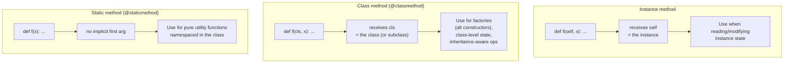

# 7. Class Methods and Static Methods

## Why This Matters

Python has three kinds of methods inside a class:

1. **Instance methods** — the default. First parameter is `self` (the instance). They operate on instance state.
2. **Class methods** (`@classmethod`) — first parameter is `cls` (the class itself). They operate on the class, and are most commonly used for **factory methods** (alternative constructors).
3. **Static methods** (`@staticmethod`) — no implicit first parameter. They're plain functions that happen to live in a class namespace for organisational reasons.

Choosing between the three is one of those small decisions that separates clean Python code from messy Python code. Use instance methods when you need instance data. Use class methods when you need to create instances in different ways (factories) or to operate on class-level state. Use static methods when a function is logically associated with your class but doesn't need access to `self` or `cls` — and even then, consider whether a module-level function would be clearer.

This note covers the mechanics, the use cases, the factory pattern, and the common pitfalls. It builds directly on [[1. Classes and Objects]], [[2. Attributes and Methods]], and [[3. Inheritance]] — `@classmethod` in particular interacts with inheritance in interesting ways.

---

## Background

In C++ or Java, methods belong to a class. There's no separate "instance method vs class method" distinction in the syntax — a method is a method. Static methods are a special case (`static` keyword) that disallows access to `this`.

In Python, **all** methods are functions stored on the class. The difference between instance, class, and static methods is just how the **descriptor protocol** wraps them when you access them:

- A plain function, accessed via an instance, becomes a **bound method** with `self` pre-supplied.
- A `classmethod`-wrapped function, accessed via a class or an instance, becomes a bound method with `cls` pre-supplied.
- A `staticmethod`-wrapped function is returned as-is — no binding.

```python
class Foo:
    def instance_method(self):
        return self

    @classmethod
    def class_method(cls):
        return cls

    @staticmethod
    def static_method():
        return "no self, no cls"

f = Foo()

# Via instance
print(f.instance_method())   # <Foo object>
print(f.class_method())      # <class 'Foo'>   ← cls is the class, even when accessed via instance!
print(f.static_method())     # 'no self, no cls'

# Via class
print(Foo.instance_method(f))   # <Foo object>   ← must pass instance explicitly
print(Foo.class_method())       # <class 'Foo'>
print(Foo.static_method())      # 'no self, no cls'
```

The key insight: `@classmethod` always knows which class it's being called on, even when called via an instance. This makes it ideal for factory methods that respect subclassing.

---

## Instance Methods — Recap

The default. First parameter is `self`. Use them when the method needs to read or modify instance state.

```python
class Counter:
    def __init__(self, start=0):
        self.value = start

    def increment(self):          # instance method
        self.value += 1

    def reset(self):              # instance method
        self.value = 0

c = Counter()
c.increment()
c.increment()
print(c.value)   # 2
```

See [[2. Attributes and Methods]] for the full treatment.

---

## `@classmethod`

A class method receives the **class** as its first parameter, conventionally named `cls`. It's defined by decorating a function with `@classmethod`.

```python
class Widget:
    registry = []

    def __init__(self, name):
        self.name = name

    @classmethod
    def register(cls, widget):
        cls.registry.append(widget)

    @classmethod
    def all(cls):
        return list(cls.registry)
```

`cls` is the class itself, not an instance. You can use it to:

- Access class attributes (`cls.registry`).
- Create instances (`cls(...)`) — this is the **factory pattern**.
- Call other class methods (`cls.other_classmethod()`).
- Iterate over subclasses (with `cls.__subclasses__()`).

### The factory pattern — alternative constructors

The most common use of `@classmethod` is **factory methods**: alternative ways to construct instances. Python classes can have only one `__init__`, so if you want multiple construction paths, use class methods:

```python
import time

class Date:
    def __init__(self, year, month, day):
        self.year = year
        self.month = month
        self.day = day

    @classmethod
    def today(cls):
        t = time.localtime()
        return cls(t.tm_year, t.tm_mon, t.tm_mday)

    @classmethod
    def from_iso(cls, iso_string):
        # "2024-03-15"
        year, month, day = map(int, iso_string.split("-"))
        return cls(year, month, day)

    @classmethod
    def from_timestamp(cls, ts):
        t = time.localtime(ts)
        return cls(t.tm_year, t.tm_mon, t.tm_mday)

    def __repr__(self):
        return f"Date({self.year}, {self.month}, {self.day})"

print(Date.today())             # Date(2024, 3, 15)
print(Date.from_iso("2024-01-01"))   # Date(2024, 1, 1)
print(Date.from_timestamp(0))   # Date(1970, 1, 1) — depending on timezone
```

Each classmethod offers a different way to construct a `Date`. Notice `cls(...)` instead of `Date(...)` — this is critical for inheritance.

### `cls` vs the class name

Inside a classmethod, **always use `cls(...)` not `ClassName(...)`**. This makes the method respect subclassing:

```python
class SpecialDate(Date):
    pass

sd = SpecialDate.today()
print(type(sd))   # <class 'SpecialDate'> — cls was SpecialDate, not Date!
```

If `today` had used `Date(...)`, `SpecialDate.today()` would have returned a `Date` — surprising. Using `cls(...)` makes the factory polymorphic.

### Class methods and inheritance

A classmethod is inherited like any other method. When called via a subclass, `cls` is the subclass:

```python
class Base:
    @classmethod
    def create(cls):
        return cls()

class Sub(Base):
    pass

b = Base.create()   # Base instance
s = Sub.create()    # Sub instance — cls was Sub
print(type(b), type(s))   # <class 'Base'> <class 'Sub'>
```

This is the foundation of **polymorphic constructors** and many design patterns (factory method, registry, plugin systems).

### Class methods as alternative constructors — common idioms

```python
class Point:
    def __init__(self, x, y):
        self.x, self.y = x, y

    @classmethod
    def origin(cls):
        return cls(0, 0)

    @classmethod
    def from_tuple(cls, t):
        return cls(*t)

    @classmethod
    def from_polar(cls, r, theta):
        import math
        return cls(r * math.cos(theta), r * math.sin(theta))


class Color:
    def __init__(self, r, g, b):
        self.r, self.g, self.b = r, g, b

    @classmethod
    def from_hex(cls, hex_str):
        h = hex_str.lstrip("#")
        return cls(int(h[0:2], 16), int(h[2:4], 16), int(h[4:6], 16))

    @classmethod
    def red(cls):    return cls(255, 0, 0)
    @classmethod
    def green(cls):  return cls(0, 255, 0)
    @classmethod
    def blue(cls):   return cls(0, 0, 255)

    @classmethod
    def from_name(cls, name):
        names = {"red": cls.red, "green": cls.green, "blue": cls.blue}
        if name not in names:
            raise ValueError(f"unknown color: {name}")
        return names[name]()   # call the classmethod to get an instance
```

Each `from_*` is a different way to construct the same kind of object. This is far cleaner than overloading `__init__` (which Python doesn't support anyway).

### `__init_subclass__` — a special classmethod

`__init_subclass__` is a hook called when a class is subclassed. It's a classmethod (you don't decorate it) that lets the parent react:

```python
class Plugin:
    _registry = {}

    def __init_subclass__(cls, name=None, **kwargs):
        super().__init_subclass__(**kwargs)
        if name:
            Plugin._registry[name] = cls

class FooPlugin(Plugin, name="foo"):
    pass

class BarPlugin(Plugin, name="bar"):
    pass

print(Plugin._registry)   # {'foo': <class 'FooPlugin'>, 'bar': <class 'BarPlugin'>}
```

This is the modern (Python 3.6+) way to register plugins — see [[4. Metaclasses]] (Chapter 17) for the full story.

---

## `@staticmethod`

A static method is a function defined inside a class that **does not** receive `self` or `cls`. It's just a function that happens to be namespaced inside a class.

```python
class Geometry:
    @staticmethod
    def distance(x1, y1, x2, y2):
        return ((x2 - x1) ** 2 + (y2 - y1) ** 2) ** 0.5

    @staticmethod
    def circle_area(radius):
        return 3.14159 * radius ** 2

print(Geometry.distance(0, 0, 3, 4))   # 5.0
print(Geometry.circle_area(2))         # 12.56636
```

`distance` and `circle_area` don't need any instance or class state. They're pure functions. Putting them inside `Geometry` is a documentation/organisation choice — it says "these belong with the Geometry concept."

### When to use static methods

- **Pure utility functions** that are conceptually tied to the class.
- **Helper functions** that other methods of the class use but don't need state.
- **Constants or computations** that the class's clients will want, but that don't depend on instances.

```python
class Temperature:
    ABSOLUTE_ZERO_C = -273.15

    def __init__(self, celsius):
        if celsius < Temperature.ABSOLUTE_ZERO_C:
            raise ValueError("below absolute zero")
        self.celsius = celsius

    @staticmethod
    def celsius_to_fahrenheit(c):
        return c * 9 / 5 + 32

    @staticmethod
    def fahrenheit_to_celsius(f):
        return (f - 32) * 5 / 9

    @property
    def fahrenheit(self):
        return Temperature.celsius_to_fahrenheit(self.celsius)

print(Temperature.celsius_to_fahrenheit(100))   # 212.0
t = Temperature(25)
print(t.fahrenheit)   # 77.0
```

### `@staticmethod` vs module-level functions

A static method is essentially a module-level function that's been placed inside a class for namespacing. The two are interchangeable in many cases:

```python
# Option A: static method
class StringUtils:
    @staticmethod
    def snake_to_camel(s):
        parts = s.split("_")
        return parts[0] + "".join(p.title() for p in parts[1:])

# Option B: module-level function
def snake_to_camel(s):
    parts = s.split("_")
    return parts[0] + "".join(p.title() for p in parts[1:])
```

Use `@staticmethod` when:

- The function is logically tied to the class (callers will look for it there).
- You want to override it in subclasses (yes, static methods can be overridden — `@staticmethod` allows polymorphic dispatch via the class).
- You want a place for related utilities to live together.

Use a module-level function when:

- The function is a general utility that callers might want without importing the class.
- The function is the primary export of the module (not a helper).

There's no hard rule — use your judgement. Many Python developers prefer module-level functions for "just a utility" and reserve `@staticmethod` for cases where the function is conceptually a method of the class but doesn't need `self`/`cls`.

---

## Comparison: Instance, Class, Static



### Side-by-side

| Aspect | Instance | Class | Static |
|--------|----------|-------|--------|
| Decorator | (none) | `@classmethod` | `@staticmethod` |
| First arg | `self` (instance) | `cls` (class) | (none) |
| Can access instance attrs? | Yes | No (no `self`) | No |
| Can access class attrs? | Yes (`self.x` works for class attrs) | Yes (`cls.x`) | No (must use `ClassName.x`) |
| Polymorphic? | Yes | Yes (`cls` is subclass) | Yes (override works) |
| Called via instance | `obj.f(x)` | `obj.f(x)` or `Class.f(x)` | `obj.f(x)` or `Class.f(x)` |
| Typical use | Behaviour on instance state | Factory methods, class-level ops | Pure utilities |

---

## When to Use Each

### Use an **instance method** when:

- You need to read or modify instance attributes (`self.x`).
- The behaviour is fundamentally about *this particular object*.

```python
class Account:
    def deposit(self, amount):   # instance method — modifies self
        self.balance += amount
```

### Use a **class method** when:

- You're writing a **factory method** (alternative constructor).
- You're operating on **class-level state** (registries, counters, configs).
- You want the method to be **inheritance-aware** (`cls` is the actual subclass).

```python
class Point:
    @classmethod
    def from_polar(cls, r, theta):
        return cls(r * math.cos(theta), r * math.sin(theta))
```

### Use a **static method** when:

- The function is a **pure utility** that doesn't need `self` or `cls`.
- The function is **logically associated with the class** — clients expect to find it there.
- You want **namespace organisation** without coupling to instance/class state.

```python
class StringUtils:
    @staticmethod
    def is_palindrome(s):
        s = "".join(c.lower() for c in s if c.isalnum())
        return s == s[::-1]
```

### Smells

- **Static method that takes an instance as a parameter** — it should be an instance method.
- **Class method that ignores `cls`** — it should be a static method (or module function).
- **Instance method that doesn't use `self`** — it should be a static or class method.
- **`@classmethod` used as a singleton accessor** — fine, but consider whether a module-level function would be simpler.

---

## Factory Methods — Deep Dive

The factory pattern is the canonical use of `@classmethod`. There are several variants:

### 1. Simple alternative constructor

```python
class Money:
    def __init__(self, amount, currency="USD"):
        self.amount = amount
        self.currency = currency

    @classmethod
    def from_string(cls, s):
        # "$100" or "100 USD"
        s = s.strip()
        if s.startswith("$"):
            return cls(float(s[1:]), "USD")
        amount, _, currency = s.partition(" ")
        return cls(float(amount), currency or "USD")
```

### 2. Polymorphic factory (virtual constructor)

```python
class Animal:
    @classmethod
    def create(cls, kind):
        classes = {"dog": Dog, "cat": Cat, "bird": Bird}
        if kind not in classes:
            raise ValueError(f"unknown animal: {kind}")
        return classes[kind]()

class Dog(Animal):
    def speak(self): return "woof"
class Cat(Animal):
    def speak(self): return "meow"
class Bird(Animal):
    def speak(self): return "tweet"

a = Animal.create("dog")
print(a.speak())   # woof
print(type(a))     # <class 'Dog'>
```

`Animal.create` returns a different subclass based on the `kind` parameter. The classmethod dispatches to the right class.

### 3. Registry-based factory

```python
class Plugin:
    _registry = {}

    @classmethod
    def register(cls, name):
        def decorator(klass):
            cls._registry[name] = klass
            return klass
        return decorator

    @classmethod
    def create(cls, name, *args, **kwargs):
        if name not in cls._registry:
            raise ValueError(f"unknown plugin: {name}")
        return cls._registry[name](*args, **kwargs)

@Plugin.register("logger")
class Logger(Plugin):
    def run(self): return "logging"

@Plugin.register("emailer")
class Emailer(Plugin):
    def run(self): return "emailing"

p = Plugin.create("logger")
print(p.run())   # logging
```

Plugins register themselves at import time via the `@Plugin.register("name")` decorator. `Plugin.create("name")` looks them up and instantiates.

### 4. `dict.fromkeys` — a built-in example

Python's own `dict.fromkeys` is a classmethod factory:

```python
keys = ["a", "b", "c"]
d = dict.fromkeys(keys, 0)
print(d)   # {'a': 0, 'b': 0, 'c': 0}
```

`dict.fromkeys(["a"], 0)` returns a `dict`. `OrderedDict.fromkeys(["a"], 0)` returns an `OrderedDict` — because `cls` is `OrderedDict`, not `dict`. This is exactly the polymorphic-constructor pattern.

### 5. `datetime` classmethods

`datetime.datetime.now()`, `datetime.datetime.utcnow()`, `datetime.datetime.fromtimestamp(ts)` are all classmethods — alternative ways to construct a `datetime`.

---

## A Worked Example: A `Database` Class

```python
import sqlite3
from contextlib import contextmanager


class Database:
    """Wrapper around a sqlite3 connection with factory methods."""

    def __init__(self, path=":memory:"):
        self.path = path
        self._conn = sqlite3.connect(path)

    # --- Alternative constructors (class methods) ---

    @classmethod
    def memory(cls):
        """In-memory database — fastest for tests."""
        return cls(":memory:")

    @classmethod
    def from_config(cls, config):
        """Build from a config dict."""
        path = config.get("database", "path", ":memory:")
        return cls(path)

    @classmethod
    def for_testing(cls, schema_sql=None):
        """Create an in-memory DB and optionally load a schema."""
        db = cls(":memory:")
        if schema_sql:
            db._conn.executescript(schema_sql)
        return db

    # --- Instance methods ---

    def execute(self, sql, params=()):
        return self._conn.execute(sql, params)

    def executemany(self, sql, params):
        return self._conn.executemany(sql, params)

    def commit(self):
        self._conn.commit()

    @contextmanager
    def transaction(self):
        try:
            yield self._conn
            self._conn.commit()
        except Exception:
            self._conn.rollback()
            raise

    # --- Static helpers ---

    @staticmethod
    def _quote_identifier(name):
        if not name.replace("_", "").isalnum():
            raise ValueError(f"invalid identifier: {name}")
        return f'"{name}"'

    @staticmethod
    def build_insert_sql(table, columns):
        """Build a parameterised INSERT statement."""
        cols = ", ".join(Database._quote_identifier(c) for c in columns)
        placeholders = ", ".join("?" for _ in columns)
        return f"INSERT INTO {Database._quote_identifier(table)} ({cols}) VALUES ({placeholders})"

    # --- Class-level state ---

    _open_connections = 0

    @classmethod
    def open_count(cls):
        return cls._open_connections

    def __enter__(self):
        Database._open_connections += 1
        return self

    def __exit__(self, *exc):
        self._conn.close()
        Database._open_connections -= 1
        return False


# Usage
with Database.memory() as db:
    db.execute("CREATE TABLE users (id INTEGER PRIMARY KEY, name TEXT)")
    sql = Database.build_insert_sql("users", ["id", "name"])
    db.executemany(sql, [(1, "Alice"), (2, "Bob")])
    for row in db.execute("SELECT * FROM users"):
        print(row)
# (1, 'Alice')
# (2, 'Bob')
print(Database.open_count())   # 0
```

This single class uses:

- Three `@classmethod` factories: `memory`, `from_config`, `for_testing`.
- Two `@staticmethod` helpers: `_quote_identifier`, `build_insert_sql`.
- Instance methods for queries and transactions.
- A class-level counter with a classmethod accessor.
- A context manager via `__enter__`/`__exit__`.

Notice:

- `Database.build_insert_sql` is a static method because it doesn't need an instance — it's a pure function of its arguments. It could be a module-level function, but putting it on `Database` documents that it's tied to the database concept.
- `Database.memory()` is a classmethod factory because it constructs a `Database` instance — and would correctly construct a subclass if called as `MyDB.memory()`.
- `Database.open_count()` is a classmethod because it reports class-level state (`_open_connections`).

---

## Common Pitfalls

### 1. Using `@classmethod` when you mean `@staticmethod`

```python
class Bad:
    @classmethod
    def add(cls, a, b):   # cls is never used!
        return a + b
```

If `cls` isn't used, it's a static method (or a module function). Don't take a parameter you don't need.

### 2. Using `@staticmethod` when you mean `@classmethod`

```python
class Bad:
    @staticmethod
    def create():
        return Bad()   # hardcoded — subclasses get Bad instances!
```

If you want factory behaviour that respects subclassing, use `@classmethod` and `cls(...)`:

```python
class Good:
    @classmethod
    def create(cls):
        return cls()
```

### 3. Forgetting `cls` parameter

```python
class Bad:
    @classmethod
    def create():   # forgot cls!
        return Bad()

Bad.create()   # TypeError: create() takes 0 positional arguments but 1 was given
```

`@classmethod` always passes the class as the first argument. Define the parameter.

### 4. Calling `cls` like a class method

```python
class Bad:
    @classmethod
    def create(cls):
        return cls   # returns the class itself, not an instance!

Bad.create()()   # works but weird
```

`cls` is the class object. To make an instance, call it: `cls(...)`.

### 5. Hardcoding the class name in a classmethod

```python
class Base:
    @classmethod
    def make(cls):
        return Base()   # ← should be cls()

class Sub(Base):
    pass

Sub.make()   # returns Base, not Sub — surprising
```

Always use `cls(...)`, never `ClassName(...)` inside a classmethod.

### 6. Static method calling instance methods

```python
class Bad:
    def instance_method(self):
        return "hello"

    @staticmethod
    def static_method():
        return self.instance_method()   # NameError — no self!
```

Static methods don't have `self`. If you need instance methods, you need an instance.

### 7. Overriding class methods incorrectly

```python
class Base:
    @classmethod
    def f(cls):
        return f"Base.f on {cls.__name__}"

class Sub(Base):
    @classmethod
    def f(cls):
        return super().f() + " (extended)"

print(Sub.f())   # 'Base.f on Sub (extended)'  ← cls is Sub throughout
```

`super().f()` inside a classmethod calls `Base.f` with `cls=Sub` (not `cls=Base`). This is correct and useful, but it's surprising if you expected `cls` to switch to `Base`.

### 8. Static methods can't be used to override dunders

```python
class Bad:
    @staticmethod
    def __len__():   # ← won't be called by len()!
        return 42

len(Bad())   # TypeError: object of type 'Bad' has no len()
```

Dunders are looked up on the type, and `staticmethod` wrapping interferes with that. Define `__len__` as a regular instance method.

### 9. Using `@staticmethod` for things that should be properties

```python
class Bad:
    @staticmethod
    def pi():
        return 3.14159

Bad.pi()   # has to call — should be Bad.pi

class Good:
    @staticmethod
    PI = 3.14159   # class attribute, not method

# Or
class Good:
    @property
    def pi(self):
        return 3.14159
```

If the method takes no arguments and returns the same value every time, it's a constant or a property — not a static method.

### 10. Module-level function vs static method confusion

```python
# Bad — over-namespacing
class DataProcessor:
    @staticmethod
    def read_csv(path): ...

    @staticmethod
    def write_csv(path, data): ...

    @staticmethod
    def read_json(path): ...

    @staticmethod
    def write_json(path, data): ...
```

If a class is just a bag of static methods, it's probably misusing OOP. Make them module-level functions, or rethink the abstraction.

---

## Tips and Tricks

- **`@classmethod` for factories** — the most common and idiomatic use.
- **Use `cls(...)` not `ClassName(...)`** in classmethods — respects subclassing.
- **`@staticmethod` for pure utilities tied to a class.**
- **If `cls` is unused, it's a `@staticmethod`.**
- **If `self` is unused, consider `@classmethod` or `@staticmethod`.**
- **`dict.fromkeys`, `datetime.now`, `int.from_bytes`** are all factory classmethods — look at the stdlib for patterns.
- **`__init_subclass__`** is the modern plugin-registration hook — see Chapter 17.
- **Multiple factories are cleaner than `__init__` overloading** (which Python doesn't support anyway).
- **`@classmethod` on an ABC** can define a "constructor contract" that subclasses must implement.
- **Use `@classmethod` for caching/config shared across instances** of a class.
- **Don't wrap a constant in a static method** — use a class attribute.
- **Test factory methods by checking the type of the result** — `assert isinstance(MyClass.from_x(x), MyClass)`.
- **`@classmethod` + `@property`** doesn't work directly (no `@classproperty` in stdlib) — see [[5. Descriptors Deep Dive]] for custom solutions.
- **`functools.singledispatchmethod`** (Python 3.8+) lets you dispatch a method on the type of its first non-self argument — see [[2. partial and singledispatch]].

---

## Active Recall

1. What are the three kinds of methods in a Python class? What's the first parameter of each?
2. What does `@classmethod` do that `@staticmethod` doesn't?
3. Why is `cls` always the **actual** class, even when the classmethod is called via an instance?
4. Write a `Point` class with three factory classmethods: `origin()`, `from_tuple(t)`, `from_polar(r, theta)`.
5. Why must factory methods use `cls(...)` and not `ClassName(...)`?
6. When would you use `@staticmethod` instead of a module-level function?
7. Show that `dict.fromkeys(["a"], 0)` returns a `dict` but `OrderedDict.fromkeys(["a"], 0)` returns an `OrderedDict`. Why?
8. What is `__init_subclass__`? How does it differ from `__init__`?
9. Implement a registry-based plugin system with `@classmethod register` and `@classmethod create`.
10. Why does this fail? Fix it.
    ```python
    class A:
        @staticmethod
        def __len__(): return 42
    len(A())
    ```
11. Why is using `cls(...)` instead of `ClassName(...)` in a classmethod important for inheritance? Give an example.
12. List five built-in classmethods from the standard library and what each does.
13. When is `@staticmethod` a code smell?
14. Write a `Database` class with `@classmethod memory()` and `@classmethod for_testing(schema)` factory methods.
15. How would you implement a class-level cache shared across all instances of a class?

---

## Next Steps

- Read [[1. Classes and Objects]] — classmethods are how you create instances; understanding `__init__` and `__new__` matters.
- Read [[2. Attributes and Methods]] — the three method kinds in context with attribute lookup.
- Read [[3. Inheritance]] — `cls` is the actual (sub)class; this is essential for factory polymorphism.
- Read [[6. Magic Methods]] — `__init_subclass__`, `__class_getitem__`, and other dunder-classmethods.
- See [[4. Dataclasses]] (Chapter 18) — `@dataclass` generates `__init__` for you, and you can add classmethod factories alongside.
- See [[4. Metaclasses]] (Chapter 17) — `__init_subclass__` is the metaclass-light alternative.
- See [[2. partial and singledispatch]] (Chapter 19) — `singledispatchmethod` for type-dispatched methods.
- See [[2. Design Patterns in Python]] (Chapter 28) — Factory Method, Abstract Factory, and Builder patterns in Python.
- See [[3. Mixins]] (Chapter 18) — mixins often use classmethods for shared configuration.
